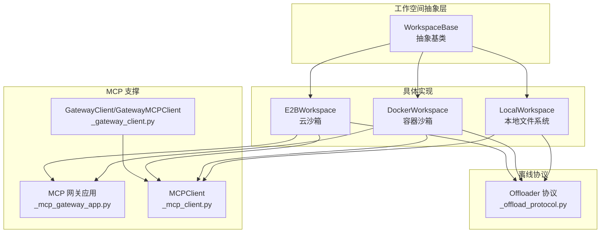
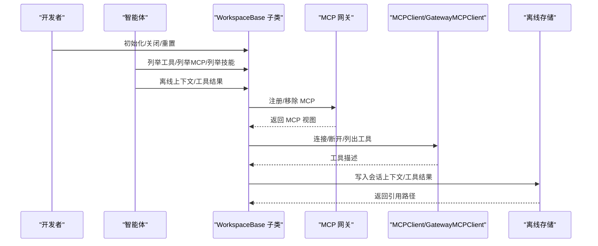
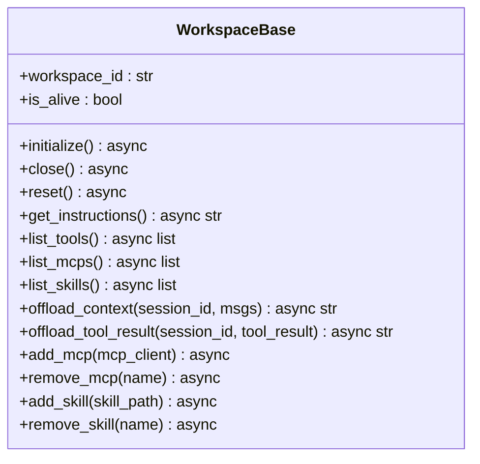
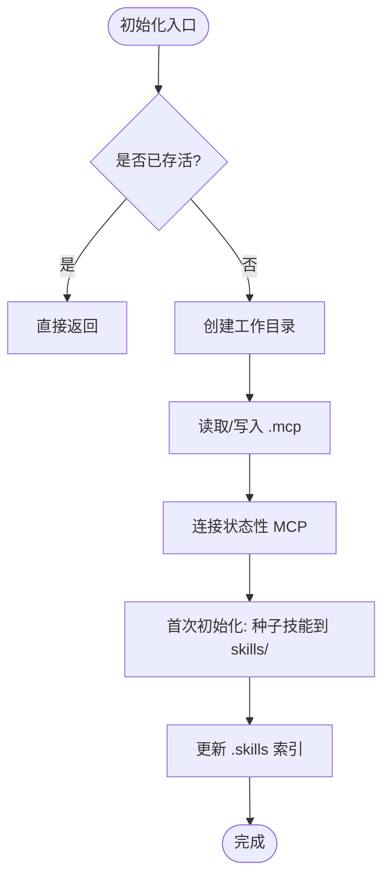
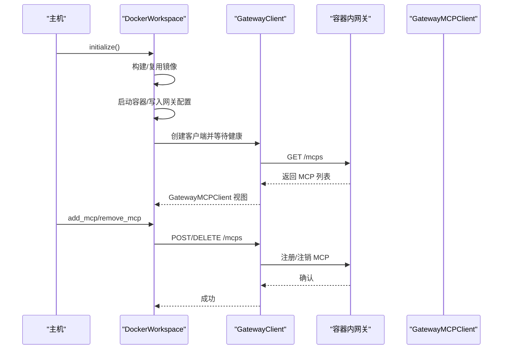
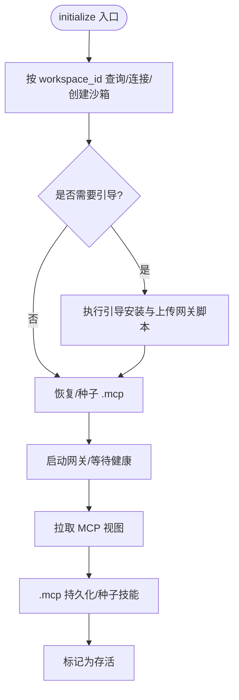
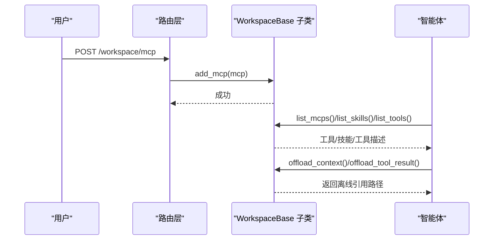
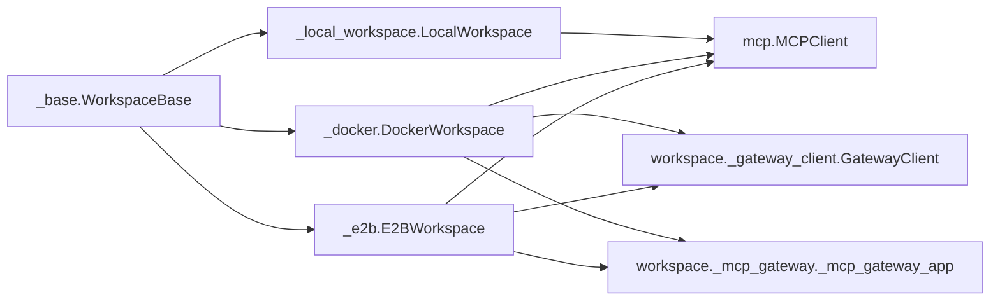

# 工作空间基础接口

<cite>
**本文档引用的文件**
- [workspace/_base.py](file://src/agentscope/workspace/_base.py)
- [workspace/_local_workspace.py](file://src/agentscope/workspace/_local_workspace.py)
- [workspace/_docker/_docker_workspace.py](file://src/agentscope/workspace/_docker/_docker_workspace.py)
- [workspace/_e2b/_e2b_workspace.py](file://src/agentscope/workspace/_e2b/_e2b_workspace.py)
- [workspace/_offload_protocol.py](file://src/agentscope/workspace/_offload_protocol.py)
- [workspace/_mcp_gateway/_mcp_gateway_app.py](file://src/agentscope/workspace/_mcp_gateway/_mcp_gateway_app.py)
- [workspace/_gateway_client.py](file://src/agentscope/workspace/_gateway_client.py)
- [mcp/_mcp_client.py](file://src/agentscope/mcp/_mcp_client.py)
- [app/_manager/_workspace_manager.py](file://src/agentscope/app/_manager/_workspace_manager.py)
- [app/_manager/_docker_workspace_manager.py](file://src/agentscope/app/_manager/_docker_workspace_manager.py)
- [app/_router/workspace.py](file://src/agentscope/app/_router/workspace.py)
- [tests/workspace_local_test.py](file://tests/workspace_local_test.py)
- [tests/workspace_docker_test.py](file://tests/workspace_docker_test.py)
</cite>

## 目录
1. [简介](#简介)
2. [项目结构](#项目结构)
3. [核心组件](#核心组件)
4. [架构总览](#架构总览)
5. [详细组件分析](#详细组件分析)
6. [依赖关系分析](#依赖关系分析)
7. [性能考虑](#性能考虑)
8. [故障排除指南](#故障排除指南)
9. [结论](#结论)

## 简介
本文件系统性地阐述 AgentScope 工作空间基础接口的设计与实现，重点围绕 WorkspaceBase 抽象类及其三大核心能力：资源管理（Resources）、工具操作（Tools）与离线存储（Offload）。文档同时覆盖工作空间生命周期管理（initialize、close、reset）、异步上下文管理器支持、动态 MCP 与技能管理接口、会话级离线数据持久化策略，以及工作空间 ID 生成、存活状态管理与错误处理策略。最后给出工作空间与智能体、用户、开发者之间的交互模式与实现细节。

## 项目结构
AgentScope 的工作空间体系由抽象基类 WorkspaceBase 与三种具体实现构成：
- LocalWorkspace：本地文件系统工作空间
- DockerWorkspace：基于容器的工作空间
- E2BWorkspace：基于云沙箱的工作空间

此外，还包含 MCP 网关服务、网关客户端、离线协议等配套模块，支撑跨后端的一致性接口与运行时交互。



**图表来源**
- [workspace/_base.py:36-204](file://src/agentscope/workspace/_base.py#L36-L204)
- [workspace/_local_workspace.py:118-129](file://src/agentscope/workspace/_local_workspace.py#L118-L129)
- [workspace/_docker/_docker_workspace.py:127-132](file://src/agentscope/workspace/_docker/_docker_workspace.py#L127-L132)
- [workspace/_e2b/_e2b_workspace.py:143-148](file://src/agentscope/workspace/_e2b/_e2b_workspace.py#L143-L148)
- [workspace/_mcp_gateway/_mcp_gateway_app.py:102-136](file://src/agentscope/workspace/_mcp_gateway/_mcp_gateway_app.py#L102-L136)
- [workspace/_gateway_client.py:245-569](file://src/agentscope/workspace/_gateway_client.py#L245-L569)
- [workspace/_offload_protocol.py:8-46](file://src/agentscope/workspace/_offload_protocol.py#L8-L46)

**章节来源**
- [workspace/_base.py:1-25](file://src/agentscope/workspace/_base.py#L1-L25)
- [workspace/_local_workspace.py:118-129](file://src/agentscope/workspace/_local_workspace.py#L118-L129)
- [workspace/_docker/_docker_workspace.py:127-132](file://src/agentscope/workspace/_docker/_docker_workspace.py#L127-L132)
- [workspace/_e2b/_e2b_workspace.py:143-148](file://src/agentscope/workspace/_e2b/_e2b_workspace.py#L143-L148)

## 核心组件
- WorkspaceBase：定义工作空间生命周期、指令片段、资源/工具/技能发现、离线存储接口与动态 MCP/技能管理接口；提供异步上下文管理器支持。
- LocalWorkspace：以本地文件系统为后端，维护 .mcp、skills、sessions、data 四大目录，支持技能索引与冲突消解、数据块离线落盘。
- DockerWorkspace：以容器为后端，通过网关在容器内暴露 MCP 服务，支持镜像构建缓存、容器生命周期管理、会话与数据持久化。
- E2BWorkspace：以云沙箱为后端，通过 E2B SDK 管理沙箱生命周期与元数据，复用容器侧网关模式。
- Offloader 协议：统一离线存储接口，约束 offload_context 与 offload_tool_result 的行为。
- MCP 客户端与网关：MCPClient 提供连接/断开、工具发现；GatewayClient/GatewayMCPClient 提供对容器/沙箱内网关的 HTTP 访问与 MCP 生命周期管理。

**章节来源**
- [workspace/_base.py:36-204](file://src/agentscope/workspace/_base.py#L36-L204)
- [workspace/_offload_protocol.py:8-46](file://src/agentscope/workspace/_offload_protocol.py#L8-L46)
- [mcp/_mcp_client.py:36-84](file://src/agentscope/mcp/_mcp_client.py#L36-L84)
- [workspace/_gateway_client.py:245-569](file://src/agentscope/workspace/_gateway_client.py#L245-L569)

## 架构总览
下图展示工作空间与 MCP 网关、客户端及外部系统的交互关系，体现“抽象接口 + 多后端实现 + 统一协议”的设计。



**图表来源**
- [workspace/_base.py:103-204](file://src/agentscope/workspace/_base.py#L103-L204)
- [workspace/_mcp_gateway/_mcp_gateway_app.py:102-136](file://src/agentscope/workspace/_mcp_gateway/_mcp_gateway_app.py#L102-L136)
- [workspace/_gateway_client.py:245-569](file://src/agentscope/workspace/_gateway_client.py#L245-L569)

## 详细组件分析

### WorkspaceBase 抽象类
- 设计理念
  - 通过抽象方法固定生命周期契约（initialize/close/reset）与异步上下文管理器协议（__aenter__/__aexit__）。
  - 将最小状态（workspace_id、is_alive）置于基类，后端特定状态保留在子类。
  - 明确三大能力边界：资源管理（list_skills）、工具操作（list_tools/list_mcps/add_mcp/remove_mcp）、离线存储（offload_context/offload_tool_result）。
- 关键接口
  - 生命周期：initialize（初始化资源、连接 MCP、复制技能）、close（释放资源与连接）、reset（清理 MCP/技能/会话与数据目录，保留默认种子配置）。
  - 异步上下文：__aenter__/__aexit__ 自动调用 initialize/close 并维护 is_alive。
  - 指令片段：get_instructions 返回工作空间专属系统提示片段。
  - 发现接口：list_tools、list_mcps、list_skills。
  - 离线接口：offload_context、offload_tool_result。
  - 动态管理：add_mcp、remove_mcp、add_skill、remove_skill。
- 错误处理
  - remove_mcp 对不存在名称进行静默处理（记录警告），保持幂等性。
  - remove_skill 使用 KeyError 表示未找到技能，便于上层区分逻辑错误与缺失。
  - reset 默认实现为空操作，子类如需用户态状态应覆盖。



**图表来源**
- [workspace/_base.py:36-204](file://src/agentscope/workspace/_base.py#L36-L204)

**章节来源**
- [workspace/_base.py:36-204](file://src/agentscope/workspace/_base.py#L36-L204)

### LocalWorkspace 实现
- 目录布局与职责
  - .mcp：持久化的 MCP 客户端配置（JSON 数组）。
  - skills/：技能目录，采用 .skills 索引文件记录内容哈希与对外名称，支持冲突消解与手动增删后的再协调。
  - sessions/：按会话分区的上下文与工具结果文件。
  - data/：离线数据块的持久化目录，避免将大体积 Base64 数据写入 JSONL。
- 初始化流程
  - 若已存活则幂等返回；否则创建工作目录，恢复或写入 .mcp，连接状态性 MCP；首次初始化时从 skill_paths 种子技能到 skills/ 并更新索引。
- 离线存储策略
  - offload_context：将消息序列化为 JSONL，对 DataBlock 中的 Base64 源先落地 data/，再以 URL 源替换，保证 JSONL 轻量化。
  - offload_tool_result：将工具结果文本拼接写入文件，DataBlock 输出以占位符形式记录 URL 与媒体类型。
- 技能管理
  - add_skill：校验 SKILL.md，去重（基于内容哈希），冲突名与目录名自动编号，支持路径穿越检查。
  - list_skills：读取 .skills 索引，比较 skills_dir mtime 检测变更并再协调，异步并发加载技能。
- 关闭与重置
  - close：关闭所有状态性 MCP；重置：删除 .mcp、skills/、sessions/、data/，并清空内存句柄。



**图表来源**
- [workspace/_local_workspace.py:178-304](file://src/agentscope/workspace/_local_workspace.py#L178-L304)

**章节来源**
- [workspace/_local_workspace.py:118-129](file://src/agentscope/workspace/_local_workspace.py#L118-L129)
- [workspace/_local_workspace.py:178-304](file://src/agentscope/workspace/_local_workspace.py#L178-L304)
- [workspace/_local_workspace.py:478-592](file://src/agentscope/workspace/_local_workspace.py#L478-L592)
- [workspace/_local_workspace.py:619-652](file://src/agentscope/workspace/_local_workspace.py#L619-L652)
- [workspace/_local_workspace.py:654-712](file://src/agentscope/workspace/_local_workspace.py#L654-L712)
- [workspace/_local_workspace.py:714-809](file://src/agentscope/workspace/_local_workspace.py#L714-L809)
- [workspace/_local_workspace.py:934-952](file://src/agentscope/workspace/_local_workspace.py#L934-L952)

### DockerWorkspace 实现
- 生命周期与镜像构建
  - initialize：构建/复用镜像、启动容器、写入网关配置、启动网关进程、等待健康、拉取网关侧 MCP 视图、持久化 .mcp 与种子技能（当有宿主工作目录）。
  - reset：注销所有 MCP、清空 sessions/data/skills、重写 .mcp 为空列表。
  - close：停止并删除容器，释放 aiodocker 客户端，Linux 下尝试修正权限。
- 网关与 MCP 管理
  - 通过 GatewayClient 与容器内网关通信，GatewayMCPClient 作为代理客户端承载每个 MCP 的连接与工具调用。
  - add_mcp/remove_mcp：注册/注销容器内 MCP，同步更新 .mcp。
- 离线存储
  - offload_context/offload_tool_result：在容器内执行 mkdir、读取已有内容、写入 JSONL/文本文件，对 Base64 DataBlock 先落地 data/ 再以 URL 替换。
- 配置与环境
  - 支持 base_image、node_version、extra_pip、gateway_port、env 等参数，指令模板使用容器内路径占位符。



**图表来源**
- [workspace/_docker/_docker_workspace.py:230-293](file://src/agentscope/workspace/_docker/_docker_workspace.py#L230-L293)
- [workspace/_docker/_docker_workspace.py:466-525](file://src/agentscope/workspace/_docker/_docker_workspace.py#L466-L525)
- [workspace/_mcp_gateway/_mcp_gateway_app.py:102-136](file://src/agentscope/workspace/_mcp_gateway/_mcp_gateway_app.py#L102-L136)
- [workspace/_gateway_client.py:549-569](file://src/agentscope/workspace/_gateway_client.py#L549-L569)

**章节来源**
- [workspace/_docker/_docker_workspace.py:127-132](file://src/agentscope/workspace/_docker/_docker_workspace.py#L127-L132)
- [workspace/_docker/_docker_workspace.py:230-293](file://src/agentscope/workspace/_docker/_docker_workspace.py#L230-L293)
- [workspace/_docker/_docker_workspace.py:295-384](file://src/agentscope/workspace/_docker/_docker_workspace.py#L295-L384)
- [workspace/_docker/_docker_workspace.py:466-525](file://src/agentscope/workspace/_docker/_docker_workspace.py#L466-L525)
- [workspace/_docker/_docker_workspace.py:585-617](file://src/agentscope/workspace/_docker/_docker_workspace.py#L585-L617)
- [workspace/_docker/_docker_workspace.py:621-724](file://src/agentscope/workspace/_docker/_docker_workspace.py#L621-L724)

### E2BWorkspace 实现
- 生命周期与沙箱管理
  - initialize：按 metadata 查询/连接现有沙箱或创建新沙箱，必要时执行引导安装（uv、venv、agentscope、上传网关脚本），启动网关，等待健康，拉取 MCP 视图并持久化 .mcp。
  - reset：与 DockerWorkspace 类似，注销 MCP、清空 sessions/data/skills、重写 .mcp。
  - close：暂停沙箱（非 kill），保留文件系统以便下次重连。
- 网关与 MCP 管理
  - 通过 GatewayClient 与沙箱内网关通信，支持代理头 X-Access-Token。
- 离线存储
  - 与 DockerWorkspace 类似，但通过 SDK 文件接口写入。



**图表来源**
- [workspace/_e2b/_e2b_workspace.py:244-328](file://src/agentscope/workspace/_e2b/_e2b_workspace.py#L244-L328)

**章节来源**
- [workspace/_e2b/_e2b_workspace.py:143-148](file://src/agentscope/workspace/_e2b/_e2b_workspace.py#L143-L148)
- [workspace/_e2b/_e2b_workspace.py:244-328](file://src/agentscope/workspace/_e2b/_e2b_workspace.py#L244-L328)
- [workspace/_e2b/_e2b_workspace.py:330-391](file://src/agentscope/workspace/_e2b/_e2b_workspace.py#L330-L391)
- [workspace/_e2b/_e2b_workspace.py:464-500](file://src/agentscope/workspace/_e2b/_e2b_workspace.py#L464-L500)
- [workspace/_e2b/_e2b_workspace.py:568-642](file://src/agentscope/workspace/_e2b/_e2b_workspace.py#L568-L642)

### 离线协议与实现
- Offloader 协议
  - 规定 offload_context(session_id, msgs) 与 offload_tool_result(session_id, tool_result) 的签名与返回值语义（返回可访问的引用路径）。
- Local/Docker/E2B 实现
  - 均遵循协议，将消息与工具结果序列化为轻量格式，对大体量数据块落地 data/ 并以 URL 替换，确保会话上下文可长期检索与压缩传输。

**章节来源**
- [workspace/_offload_protocol.py:8-46](file://src/agentscope/workspace/_offload_protocol.py#L8-L46)
- [workspace/_local_workspace.py:478-592](file://src/agentscope/workspace/_local_workspace.py#L478-L592)
- [workspace/_docker/_docker_workspace.py:621-724](file://src/agentscope/workspace/_docker/_docker_workspace.py#L621-L724)
- [workspace/_e2b/_e2b_workspace.py:568-642](file://src/agentscope/workspace/_e2b/_e2b_workspace.py#L568-L642)

### MCP 管理与网关交互
- MCPClient
  - 支持状态性（STDIO/HTTP）与无状态（HTTP）两种模式；状态性 MCP 需要显式 connect/close。
- 网关客户端
  - GatewayClient：持有网关地址、Bearer Token、共享 HTTP 客户端，提供 connect/close/list_mcps 等方法。
  - GatewayMCPClient：对单个 MCP 的封装，负责注册/注销与工具发现。
- 网关应用
  - 提供 /mcps 列表、注册、注销接口，校验名称唯一性并转发异常。

```mermaid
classDiagram
class MCPClient {
+name : str
+is_stateful : bool
+connect() async
+close() async
+list_tools() async
}
class GatewayClient {
+base_url : str
+token : str
+list_mcps() async
+make_client(spec, connected) async
}
class GatewayMCPClient {
+connect() async
+close() async
+list_tools() async
}
class MCPGatewayApp {
+GET /mcps
+POST /mcps
+DELETE /mcps/{name}
}
GatewayClient --> GatewayMCPClient : "创建/管理"
GatewayMCPClient --> MCPClient : "包装"
MCPGatewayApp <-- GatewayClient : "HTTP 交互"
```

**图表来源**
- [mcp/_mcp_client.py:36-84](file://src/agentscope/mcp/_mcp_client.py#L36-L84)
- [workspace/_gateway_client.py:245-569](file://src/agentscope/workspace/_gateway_client.py#L245-L569)
- [workspace/_mcp_gateway/_mcp_gateway_app.py:102-136](file://src/agentscope/workspace/_mcp_gateway/_mcp_gateway_app.py#L102-L136)

**章节来源**
- [mcp/_mcp_client.py:36-84](file://src/agentscope/mcp/_mcp_client.py#L36-L84)
- [workspace/_gateway_client.py:245-569](file://src/agentscope/workspace/_gateway_client.py#L245-L569)
- [workspace/_mcp_gateway/_mcp_gateway_app.py:102-136](file://src/agentscope/workspace/_mcp_gateway/_mcp_gateway_app.py#L102-L136)

### 与智能体、用户、开发者的交互模式
- 智能体（Agent）
  - 通过 list_tools/list_mcps/list_skills 获取可用工具与技能；通过 offload_context/offload_tool_result 将上下文与工具结果持久化以便后续检索。
- 用户（User）
  - 通过 add_mcp/remove_mcp 动态添加/移除 MCP；通过 add_skill/remove_skill 管理技能集合。
- 开发者（Developer）
  - 通过 initialize/close 控制工作空间生命周期；通过 reset 清理至干净状态；通过异步上下文管理器简化资源管理。



**图表来源**
- [app/_router/workspace.py:113-136](file://src/agentscope/app/_router/workspace.py#L113-L136)
- [workspace/_base.py:109-204](file://src/agentscope/workspace/_base.py#L109-L204)

**章节来源**
- [app/_router/workspace.py:88-136](file://src/agentscope/app/_router/workspace.py#L88-L136)
- [workspace/_base.py:17-23](file://src/agentscope/workspace/_base.py#L17-L23)

## 依赖关系分析
- 组件耦合
  - WorkspaceBase 仅依赖 MCPClient、Msg、ToolResultBlock、Skill 等类型，保持低耦合。
  - Local/Docker/E2B 通过各自后端（文件系统/容器/云沙箱）实现具体逻辑，共享统一接口。
- 外部依赖
  - DockerWorkspace 依赖 aiodocker；E2BWorkspace 依赖 e2b.AsyncSandbox；三者均依赖 MCP 网关与 GatewayClient。
- 可能的循环依赖
  - 当前结构清晰，无明显循环导入。



**图表来源**
- [workspace/_base.py:30-34](file://src/agentscope/workspace/_base.py#L30-L34)
- [workspace/_local_workspace.py:20-40](file://src/agentscope/workspace/_local_workspace.py#L20-L40)
- [workspace/_docker/_docker_workspace.py:47-77](file://src/agentscope/workspace/_docker/_docker_workspace.py#L47-L77)
- [workspace/_e2b/_e2b_workspace.py:52-95](file://src/agentscope/workspace/_e2b/_e2b_workspace.py#L52-L95)

**章节来源**
- [workspace/_base.py:30-34](file://src/agentscope/workspace/_base.py#L30-L34)
- [workspace/_local_workspace.py:20-40](file://src/agentscope/workspace/_local_workspace.py#L20-L40)
- [workspace/_docker/_docker_workspace.py:47-77](file://src/agentscope/workspace/_docker/_docker_workspace.py#L47-L77)
- [workspace/_e2b/_e2b_workspace.py:52-95](file://src/agentscope/workspace/_e2b/_e2b_workspace.py#L52-L95)

## 性能考虑
- I/O 优化
  - 离线存储优先将大体量数据块落地 data/ 并以 URL 替换，减少 JSONL 体积与网络传输成本。
  - LocalWorkspace 在 list_skills 时通过 .skills 索引与 mtime 检测避免全量扫描，必要时并发加载技能。
- 并发与锁
  - LocalWorkspace 对技能与 MCP 操作分别加锁，避免竞态；Docker/E2B 在 reset/close 时并行关闭多个 MCP，提升回收效率。
- 缓存与复用
  - DockerWorkspace 通过镜像内容哈希缓存构建；E2BWorkspace 通过 metadata 重连已有沙箱，减少冷启动时间。
- 资源释放
  - close 与 __aexit__ 统一释放资源，避免泄漏；Linux 下尝试修正宿主权限，降低后续清理成本。

[本节为通用指导，无需特定文件分析]

## 故障排除指南
- 初始化失败
  - DockerWorkspace：镜像构建失败或网关健康检查超时，查看构建日志尾部与健康检查响应。
  - E2BWorkspace：沙箱未就绪（is_running 未返回 200），检查引导过程与网络代理头。
- MCP 管理异常
  - add_mcp：名称重复导致 409；上游命令不可用导致 500；检查 MCP 配置与可达性。
  - remove_mcp：名称不存在时记录警告并静默忽略；确认名称大小写与注册一致。
- 技能管理异常
  - add_skill：缺少 SKILL.md 或目录同名冲突抛出异常；检查技能目录结构与命名。
  - remove_skill：未找到技能抛出 KeyError；确认技能对外名称与索引一致。
- 离线存储异常
  - 路径不存在或权限不足导致写入失败；检查 data/ 与 sessions/ 目录权限与磁盘配额。
- 生命周期问题
  - is_alive 标志未正确更新：确认 __aenter__/__aexit__ 是否被正确调用；检查 close/reset 是否抛出异常。

**章节来源**
- [workspace/_docker/_docker_workspace.py:251-255](file://src/agentscope/workspace/_docker/_docker_workspace.py#L251-L255)
- [workspace/_docker/_docker_workspace.py:466-487](file://src/agentscope/workspace/_docker/_docker_workspace.py#L466-L487)
- [workspace/_docker/_docker_workspace.py:501-525](file://src/agentscope/workspace/_docker/_docker_workspace.py#L501-L525)
- [workspace/_local_workspace.py:934-952](file://src/agentscope/workspace/_local_workspace.py#L934-L952)
- [workspace/_e2b/_e2b_workspace.py:721-724](file://src/agentscope/workspace/_e2b/_e2b_workspace.py#L721-L724)

## 结论
WorkspaceBase 以抽象接口统一了工作空间的生命周期、资源/工具/技能发现与离线存储能力，配合 Local/Docker/E2B 三种实现满足从本地到容器再到云端的不同部署需求。通过 MCP 网关与客户端，系统实现了跨后端一致的工具调用与动态管理能力；通过离线协议与数据块落盘策略，保障了会话上下文与工具结果的可检索性与可压缩性。整体设计兼顾易用性、可扩展性与可维护性，适合在多场景下稳定运行。