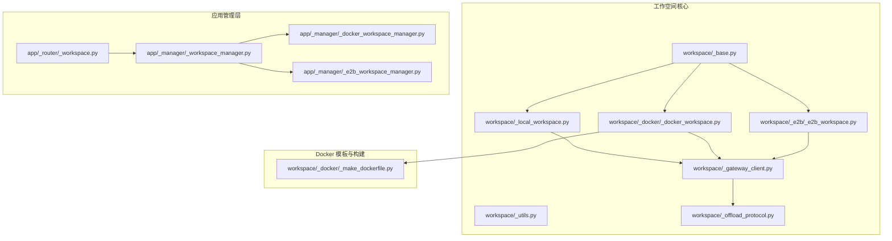
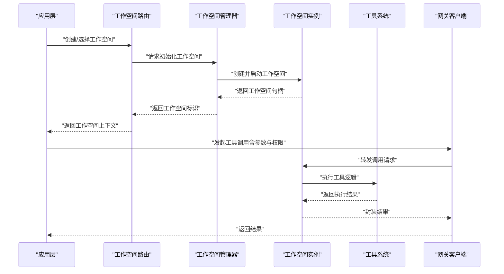
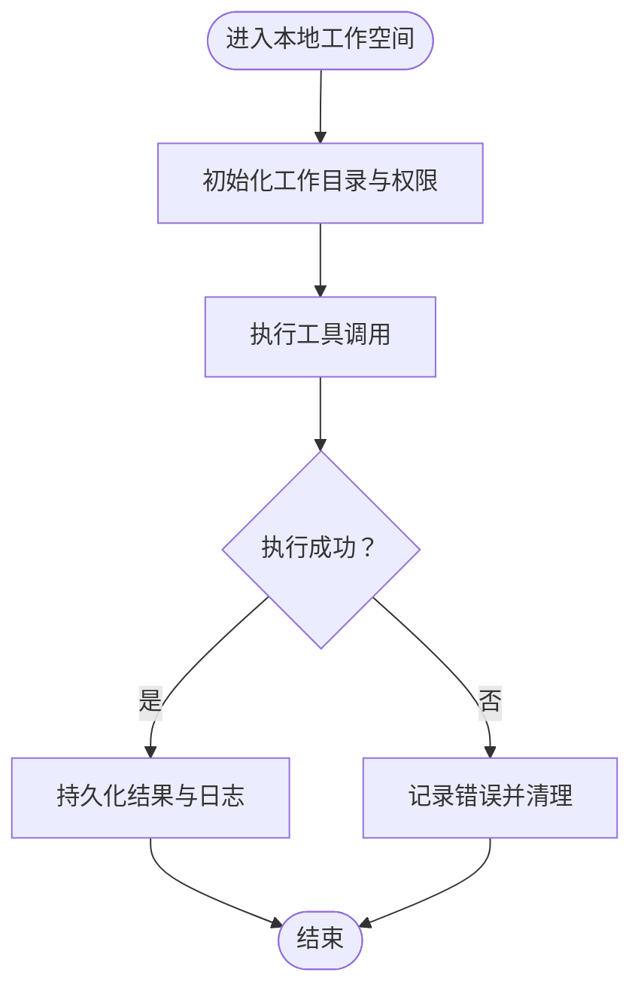
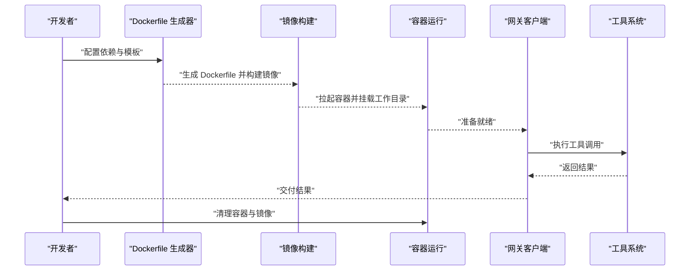
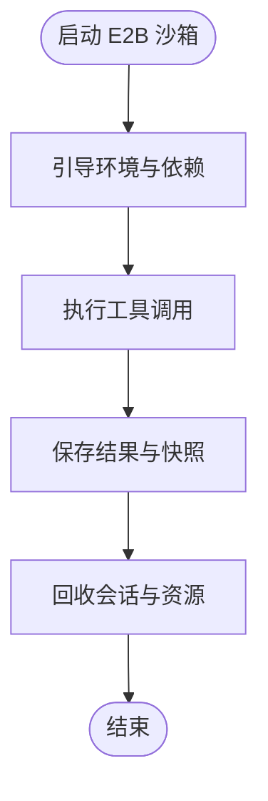
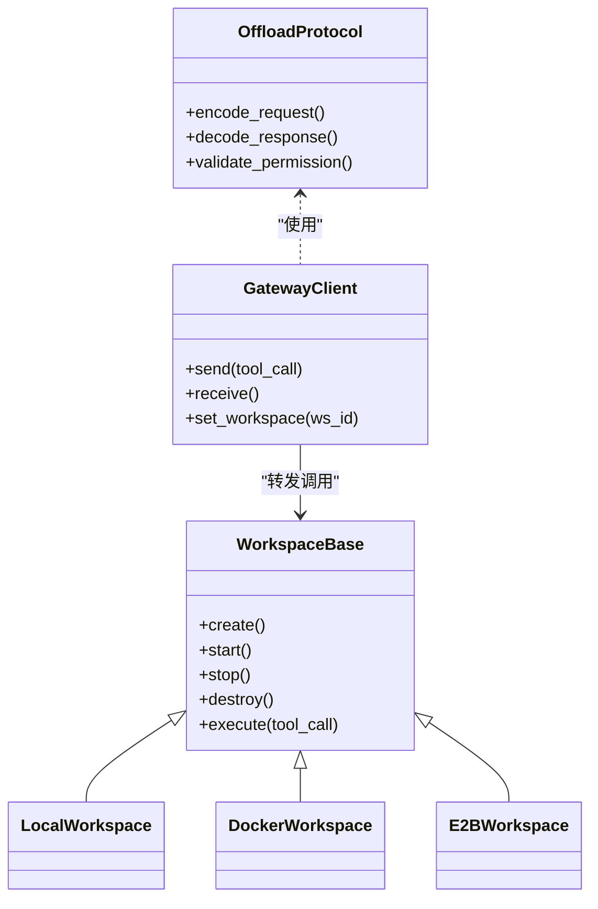
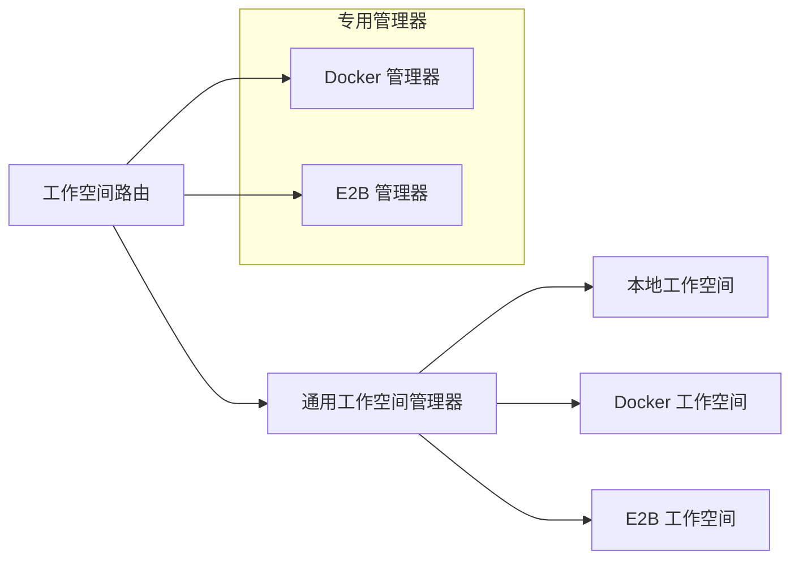
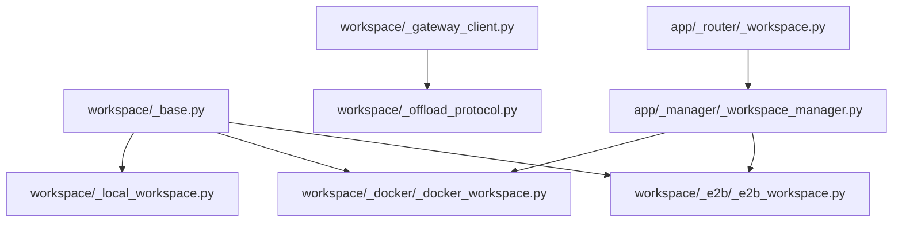

# 工作空间（Workspace）

<cite>
**本文引用的文件**
- [workspace/_base.py](file://src/agentscope/workspace/_base.py)
- [workspace/_local_workspace.py](file://src/agentscope/workspace/_local_workspace.py)
- [workspace/_docker/_docker_workspace.py](file://src/agentscope/workspace/_docker/_docker_workspace.py)
- [workspace/_docker/_make_dockerfile.py](file://src/agentscope/workspace/_docker/_make_dockerfile.py)
- [workspace/_e2b/_e2b_workspace.py](file://src/agentscope/workspace/_e2b/_e2b_workspace.py)
- [workspace/_e2b/_bootstrap.py](file://src/agentscope/workspace/_e2b/_bootstrap.py)
- [workspace/_gateway_client.py](file://src/agentscope/workspace/_gateway_client.py)
- [workspace/_offload_protocol.py](file://src/agentscope/workspace/_offload_protocol.py)
- [workspace/_utils.py](file://src/agentscope/workspace/_utils.py)
- [app/_manager/_workspace_manager.py](file://src/agentscope/app/_manager/_workspace_manager.py)
- [app/_manager/_docker_workspace_manager.py](file://src/agentscope/app/_manager/_docker_workspace_manager.py)
- [app/_manager/_e2b_workspace_manager.py](file://src/agentscope/app/_manager/_e2b_workspace_manager.py)
- [app/_router/_workspace.py](file://src/agentscope/app/_router/_workspace.py)
- [tests/workspace_local_test.py](file://tests/workspace_local_test.py)
- [tests/workspace_docker_test.py](file://tests/workspace_docker_test.py)
- [tests/workspace_e2b_test.py](file://tests/workspace_e2b_test.py)
</cite>

## 目录
1. [引言](#引言)
2. [项目结构](#项目结构)
3. [核心组件](#核心组件)
4. [架构总览](#架构总览)
5. [详细组件分析](#详细组件分析)
6. [依赖关系分析](#依赖关系分析)
7. [性能考量](#性能考量)
8. [故障排查指南](#故障排查指南)
9. [结论](#结论)
10. [附录](#附录)

## 引言
本文件系统性阐述 AgentScope 的“工作空间”概念与实现，重点覆盖以下方面：
- 工作空间的设计理念：为智能体提供隔离的执行环境与资源管理能力
- 本地工作空间（LocalWorkspace）与 Docker 工作空间（DockerWorkspace）的差异与适用场景
- 生命周期管理、资源分配、安全隔离与数据持久化机制
- 工作空间与工具系统的集成方式，以及通过工作空间实现任务离线执行与结果存储
- 配置与使用示例，包含 Docker 容器的部署与管理要点

## 项目结构
工作空间相关代码主要位于 src/agentscope/workspace 及其子模块，并在应用层的管理器与路由中进行编排。

图表来源
- [workspace/_base.py](file://src/agentscope/workspace/_base.py)
- [workspace/_local_workspace.py](file://src/agentscope/workspace/_local_workspace.py)
- [workspace/_docker/_docker_workspace.py](file://src/agentscope/workspace/_docker/_docker_workspace.py)
- [workspace/_docker/_make_dockerfile.py](file://src/agentscope/workspace/_docker/_make_dockerfile.py)
- [workspace/_e2b/_e2b_workspace.py](file://src/agentscope/workspace/_e2b/_e2b_workspace.py)
- [workspace/_gateway_client.py](file://src/agentscope/workspace/_gateway_client.py)
- [workspace/_offload_protocol.py](file://src/agentscope/workspace/_offload_protocol.py)
- [app/_manager/_workspace_manager.py](file://src/agentscope/app/_manager/_workspace_manager.py)
- [app/_manager/_docker_workspace_manager.py](file://src/agentscope/app/_manager/_docker_workspace_manager.py)
- [app/_manager/_e2b_workspace_manager.py](file://src/agentscope/app/_manager/_e2b_workspace_manager.py)
- [app/_router/_workspace.py](file://src/agentscope/app/_router/_workspace.py)

章节来源
- [workspace/_base.py](file://src/agentscope/workspace/_base.py)
- [workspace/_local_workspace.py](file://src/agentscope/workspace/_local_workspace.py)
- [workspace/_docker/_docker_workspace.py](file://src/agentscope/workspace/_docker/_docker_workspace.py)
- [workspace/_docker/_make_dockerfile.py](file://src/agentscope/workspace/_docker/_make_dockerfile.py)
- [workspace/_e2b/_e2b_workspace.py](file://src/agentscope/workspace/_e2b/_e2b_workspace.py)
- [workspace/_gateway_client.py](file://src/agentscope/workspace/_gateway_client.py)
- [workspace/_offload_protocol.py](file://src/agentscope/workspace/_offload_protocol.py)
- [workspace/_utils.py](file://src/agentscope/workspace/_utils.py)
- [app/_manager/_workspace_manager.py](file://src/agentscope/app/_manager/_workspace_manager.py)
- [app/_manager/_docker_workspace_manager.py](file://src/agentscope/app/_manager/_docker_workspace_manager.py)
- [app/_manager/_e2b_workspace_manager.py](file://src/agentscope/app/_manager/_e2b_workspace_manager.py)
- [app/_router/_workspace.py](file://src/agentscope/app/_router/_workspace.py)

## 核心组件
- 基类与接口定义：统一工作空间的生命周期、资源抽象与对外能力
- 本地工作空间：直接在宿主机上运行，适合快速开发与调试
- Docker 工作空间：基于容器隔离执行，适合标准化与可移植性要求高的场景
- E2B 工作空间：云端沙箱式执行环境，适合需要更强隔离与弹性扩展的场景
- 网关与卸载协议：负责工具调用的跨边界传输与结果回传
- 应用管理层：编排工作空间的创建、销毁与调度；提供路由接口供上层调用

章节来源
- [workspace/_base.py](file://src/agentscope/workspace/_base.py)
- [workspace/_local_workspace.py](file://src/agentscope/workspace/_local_workspace.py)
- [workspace/_docker/_docker_workspace.py](file://src/agentscope/workspace/_docker/_docker_workspace.py)
- [workspace/_e2b/_e2b_workspace.py](file://src/agentscope/workspace/_e2b/_e2b_workspace.py)
- [workspace/_gateway_client.py](file://src/agentscope/workspace/_gateway_client.py)
- [workspace/_offload_protocol.py](file://src/agentscope/workspace/_offload_protocol.py)

## 架构总览
下图展示从应用层到工作空间与工具系统的整体交互流程。

图表来源
- [app/_router/_workspace.py](file://src/agentscope/app/_router/_workspace.py)
- [app/_manager/_workspace_manager.py](file://src/agentscope/app/_manager/_workspace_manager.py)
- [workspace/_gateway_client.py](file://src/agentscope/workspace/_gateway_client.py)
- [workspace/_offload_protocol.py](file://src/agentscope/workspace/_offload_protocol.py)

## 详细组件分析

### 工作空间基类与生命周期
- 设计目标：抽象出统一的生命周期方法（如创建、启动、停止、销毁），以及资源与权限的统一接口
- 关键职责：
  - 资源分配：CPU/内存/磁盘等资源的预留与限制
  - 安全隔离：进程/网络/文件系统的隔离策略
  - 数据持久化：工作目录、日志、中间产物的落盘与清理策略
  - 结果输出：标准化的结果封装与回传格式

章节来源
- [workspace/_base.py](file://src/agentscope/workspace/_base.py)

### 本地工作空间（LocalWorkspace）
- 特点：
  - 直接在宿主机执行，无需额外虚拟化或容器化
  - 启动速度快、调试成本低
  - 适合开发测试、小规模任务与快速原型验证
- 适用场景：
  - 本地开发联调
  - 对延迟敏感的小型任务
  - 不需要强隔离的场景
- 与工具系统集成：
  - 通过网关客户端进行工具调用转发
  - 支持权限控制与结果回传

图表来源
- [workspace/_local_workspace.py](file://src/agentscope/workspace/_local_workspace.py)
- [workspace/_gateway_client.py](file://src/agentscope/workspace/_gateway_client.py)

章节来源
- [workspace/_local_workspace.py](file://src/agentscope/workspace/_local_workspace.py)
- [workspace/_gateway_client.py](file://src/agentscope/workspace/_gateway_client.py)

### Docker 工作空间（DockerWorkspace）
- 特点：
  - 基于容器隔离，具备更强的可移植性与一致性
  - 支持自定义镜像模板与依赖安装
  - 适合生产级任务与多租户隔离
- 关键流程：
  - Dockerfile 生成与构建：根据模板与依赖生成镜像
  - 容器启动与挂载：映射工作目录、端口与卷
  - 执行与回收：任务完成后容器清理与镜像缓存管理
- 与工具系统集成：
  - 通过网关客户端在容器内执行工具调用
  - 支持离线模式下的结果持久化与回传

图表来源
- [workspace/_docker/_docker_workspace.py](file://src/agentscope/workspace/_docker/_docker_workspace.py)
- [workspace/_docker/_make_dockerfile.py](file://src/agentscope/workspace/_docker/_make_dockerfile.py)
- [workspace/_gateway_client.py](file://src/agentscope/workspace/_gateway_client.py)

章节来源
- [workspace/_docker/_docker_workspace.py](file://src/agentscope/workspace/_docker/_docker_workspace.py)
- [workspace/_docker/_make_dockerfile.py](file://src/agentscope/workspace/_docker/_make_dockerfile.py)
- [workspace/_gateway_client.py](file://src/agentscope/workspace/_gateway_client.py)

### E2B 工作空间（E2BWorkspace）
- 特点：
  - 基于云端沙箱，提供更强的安全隔离与弹性资源
  - 适合高安全性与高可用性的任务执行
- 关键流程：
  - 启动沙箱会话
  - 在沙箱内安装依赖与执行工具
  - 回收会话与清理资源

图表来源
- [workspace/_e2b/_e2b_workspace.py](file://src/agentscope/workspace/_e2b/_e2b_workspace.py)
- [workspace/_e2b/_bootstrap.py](file://src/agentscope/workspace/_e2b/_bootstrap.py)

章节来源
- [workspace/_e2b/_e2b_workspace.py](file://src/agentscope/workspace/_e2b/_e2b_workspace.py)
- [workspace/_e2b/_bootstrap.py](file://src/agentscope/workspace/_e2b/_bootstrap.py)

### 工具系统集成与卸载协议
- 卸载协议：定义工具调用的跨边界传输规范，确保在不同工作空间类型间的一致行为
- 网关客户端：负责将工具调用请求路由至对应工作空间，并接收结果回传
- 权限与安全：在工具调用前进行权限校验与策略匹配，防止越权操作

图表来源
- [workspace/_offload_protocol.py](file://src/agentscope/workspace/_offload_protocol.py)
- [workspace/_gateway_client.py](file://src/agentscope/workspace/_gateway_client.py)
- [workspace/_base.py](file://src/agentscope/workspace/_base.py)
- [workspace/_local_workspace.py](file://src/agentscope/workspace/_local_workspace.py)
- [workspace/_docker/_docker_workspace.py](file://src/agentscope/workspace/_docker/_docker_workspace.py)
- [workspace/_e2b/_e2b_workspace.py](file://src/agentscope/workspace/_e2b/_e2b_workspace.py)

章节来源
- [workspace/_offload_protocol.py](file://src/agentscope/workspace/_offload_protocol.py)
- [workspace/_gateway_client.py](file://src/agentscope/workspace/_gateway_client.py)
- [workspace/_base.py](file://src/agentscope/workspace/_base.py)

### 应用管理层与路由
- 工作空间管理器：负责工作空间的创建、调度与回收
- Docker/E2B 管理器：针对特定类型的工作空间提供专用编排能力
- 工作空间路由：向上层提供统一的接口，屏蔽底层差异

图表来源
- [app/_router/_workspace.py](file://src/agentscope/app/_router/_workspace.py)
- [app/_manager/_workspace_manager.py](file://src/agentscope/app/_manager/_workspace_manager.py)
- [app/_manager/_docker_workspace_manager.py](file://src/agentscope/app/_manager/_docker_workspace_manager.py)
- [app/_manager/_e2b_workspace_manager.py](file://src/agentscope/app/_manager/_e2b_workspace_manager.py)

章节来源
- [app/_router/_workspace.py](file://src/agentscope/app/_router/_workspace.py)
- [app/_manager/_workspace_manager.py](file://src/agentscope/app/_manager/_workspace_manager.py)
- [app/_manager/_docker_workspace_manager.py](file://src/agentscope/app/_manager/_docker_workspace_manager.py)
- [app/_manager/_e2b_workspace_manager.py](file://src/agentscope/app/_manager/_e2b_workspace_manager.py)

## 依赖关系分析
- 组件耦合度：
  - 工作空间基类与各实现之间为松耦合，通过统一接口交互
  - 网关客户端与卸载协议形成稳定的传输层契约
  - 应用管理层对工作空间类型进行抽象，便于扩展新类型
- 外部依赖：
  - Docker 工作空间依赖容器运行时与镜像仓库
  - E2B 工作空间依赖云端沙箱服务
- 潜在循环依赖：
  - 当前设计避免了工作空间实现之间的直接循环依赖

图表来源
- [workspace/_base.py](file://src/agentscope/workspace/_base.py)
- [workspace/_local_workspace.py](file://src/agentscope/workspace/_local_workspace.py)
- [workspace/_docker/_docker_workspace.py](file://src/agentscope/workspace/_docker/_docker_workspace.py)
- [workspace/_e2b/_e2b_workspace.py](file://src/agentscope/workspace/_e2b/_e2b_workspace.py)
- [workspace/_gateway_client.py](file://src/agentscope/workspace/_gateway_client.py)
- [workspace/_offload_protocol.py](file://src/agentscope/workspace/_offload_protocol.py)
- [app/_router/_workspace.py](file://src/agentscope/app/_router/_workspace.py)
- [app/_manager/_workspace_manager.py](file://src/agentscope/app/_manager/_workspace_manager.py)

章节来源
- [workspace/_base.py](file://src/agentscope/workspace/_base.py)
- [workspace/_gateway_client.py](file://src/agentscope/workspace/_gateway_client.py)
- [workspace/_offload_protocol.py](file://src/agentscope/workspace/_offload_protocol.py)
- [app/_router/_workspace.py](file://src/agentscope/app/_router/_workspace.py)
- [app/_manager/_workspace_manager.py](file://src/agentscope/app/_manager/_workspace_manager.py)

## 性能考量
- 启动时间
  - 本地工作空间启动最快，适合高频短任务
  - Docker 工作空间受镜像大小与依赖安装影响，建议复用镜像与缓存
  - E2B 工作空间受云端网络与会话建立影响，适合长任务与高可用需求
- 资源占用
  - 本地工作空间直连宿主机资源，需注意 CPU/内存上限
  - Docker 工作空间可通过容器资源限制实现更精细的配额
  - E2B 工作空间由平台统一调度，资源弹性更好
- I/O 与持久化
  - 使用挂载卷或持久化目录减少重复 I/O
  - 结果与日志及时落盘，避免丢失
- 网络与安全
  - 工具调用尽量本地化，减少跨边界传输
  - 严格权限校验，避免不必要的网络暴露

## 故障排查指南
- 常见问题
  - Docker 镜像构建失败：检查模板与依赖版本，确认网络可达性
  - 容器无法启动：检查资源配额、卷挂载与权限
  - 工具执行超时：检查工作空间资源与并发度，优化工具实现
  - 结果缺失：确认持久化目录与回传协议配置
- 排查步骤
  - 查看工作空间日志与状态
  - 验证网关客户端与卸载协议的编码/解码正确性
  - 对比不同工作空间类型的差异，定位问题根因
- 测试参考
  - 单元测试覆盖本地、Docker、E2B 三种工作空间的行为与边界条件

章节来源
- [tests/workspace_local_test.py](file://tests/workspace_local_test.py)
- [tests/workspace_docker_test.py](file://tests/workspace_docker_test.py)
- [tests/workspace_e2b_test.py](file://tests/workspace_e2b_test.py)

## 结论
工作空间为 AgentScope 提供了统一的执行环境抽象，既能满足本地开发的灵活性，也能支持容器化与云端沙箱的强隔离与可移植性。通过应用管理层与路由接口，上层可以以一致的方式选择与编排不同类型的工作空间，结合工具系统的卸载协议与网关客户端，实现任务的离线执行与结果存储。建议在开发阶段优先使用本地工作空间，在需要隔离与可移植性时采用 Docker 或 E2B 工作空间，并配合完善的日志与持久化策略保障稳定性。

## 附录
- 配置与使用建议
  - 本地工作空间：适用于快速迭代与调试，注意资源监控与清理策略
  - Docker 工作空间：建议预构建基础镜像，减少每次构建时间；合理设置资源限制
  - E2B 工作空间：关注会话生命周期与资源弹性，适配长任务与高并发场景
- 示例路径参考
  - 本地工作空间：[workspace/_local_workspace.py](file://src/agentscope/workspace/_local_workspace.py)
  - Docker 工作空间：[workspace/_docker/_docker_workspace.py](file://src/agentscope/workspace/_docker/_docker_workspace.py)，[workspace/_docker/_make_dockerfile.py](file://src/agentscope/workspace/_docker/_make_dockerfile.py)
  - E2B 工作空间：[workspace/_e2b/_e2b_workspace.py](file://src/agentscope/workspace/_e2b/_e2b_workspace.py)，[workspace/_e2b/_bootstrap.py](file://src/agentscope/workspace/_e2b/_bootstrap.py)
  - 应用层编排：[app/_router/_workspace.py](file://src/agentscope/app/_router/_workspace.py)，[app/_manager/_workspace_manager.py](file://src/agentscope/app/_manager/_workspace_manager.py)，[app/_manager/_docker_workspace_manager.py](file://src/agentscope/app/_manager/_docker_workspace_manager.py)，[app/_manager/_e2b_workspace_manager.py](file://src/agentscope/app/_manager/_e2b_workspace_manager.py)
  - 工具集成：[workspace/_gateway_client.py](file://src/agentscope/workspace/_gateway_client.py)，[workspace/_offload_protocol.py](file://src/agentscope/workspace/_offload_protocol.py)