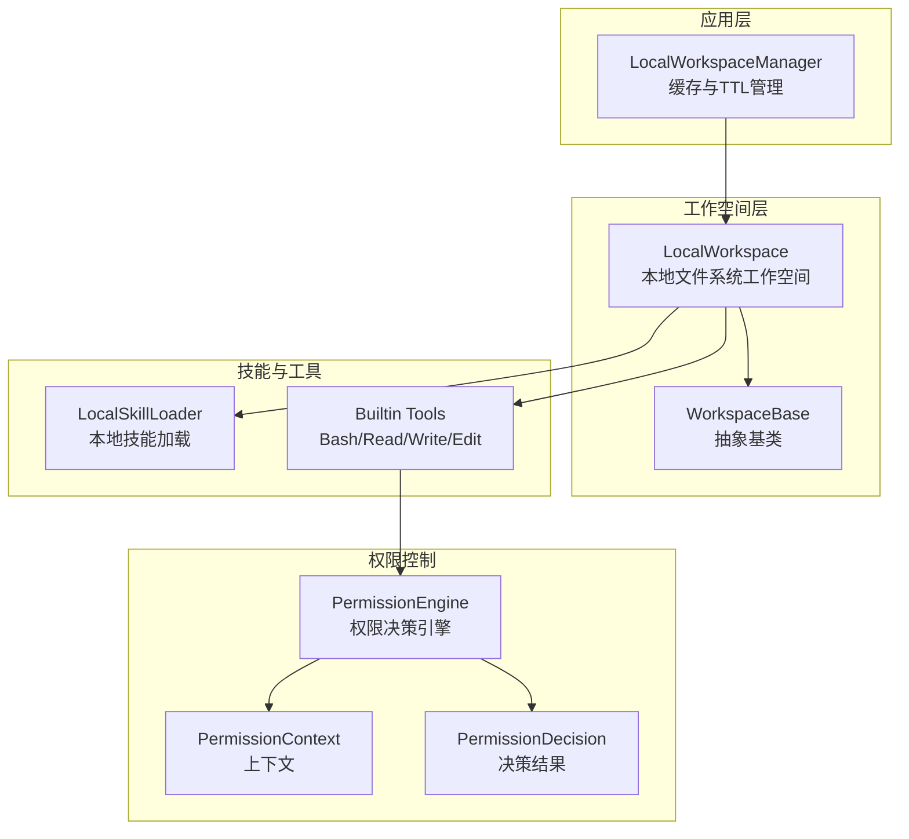
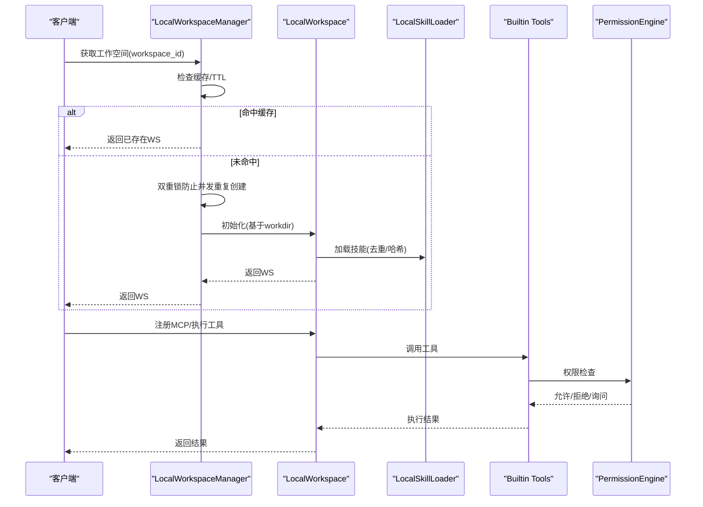
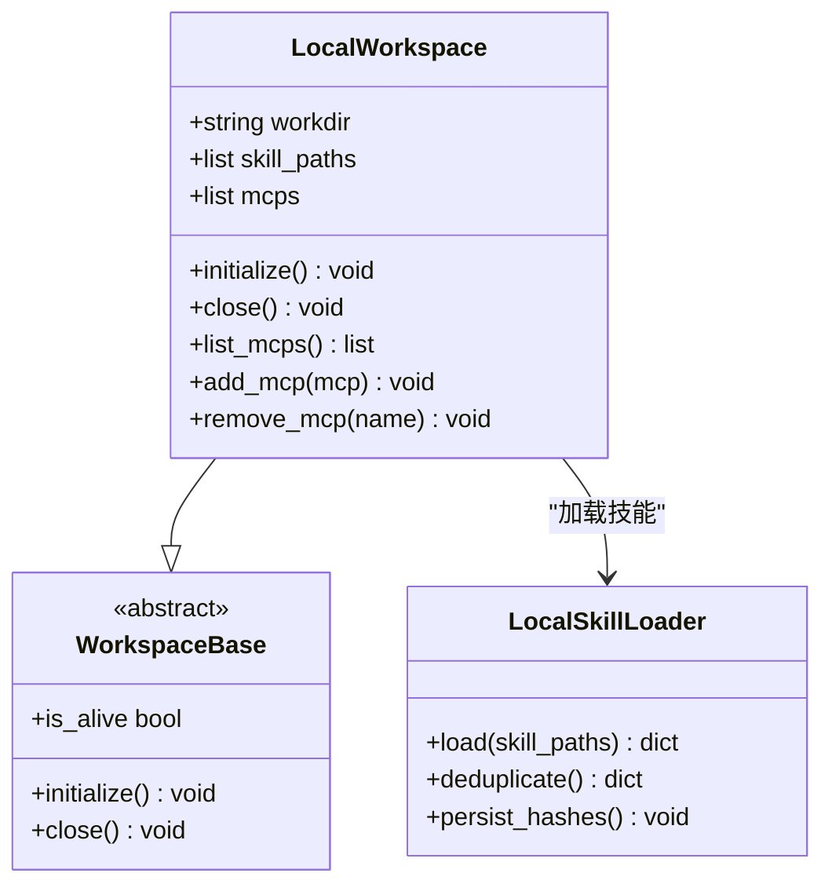
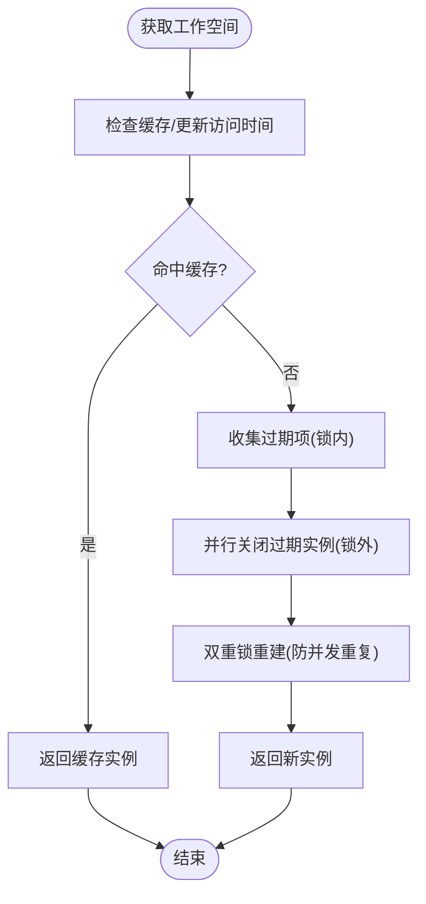
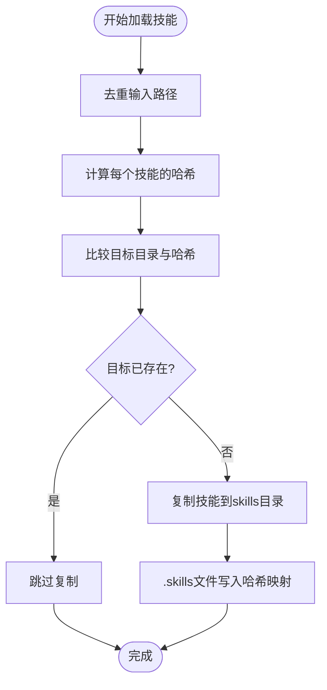
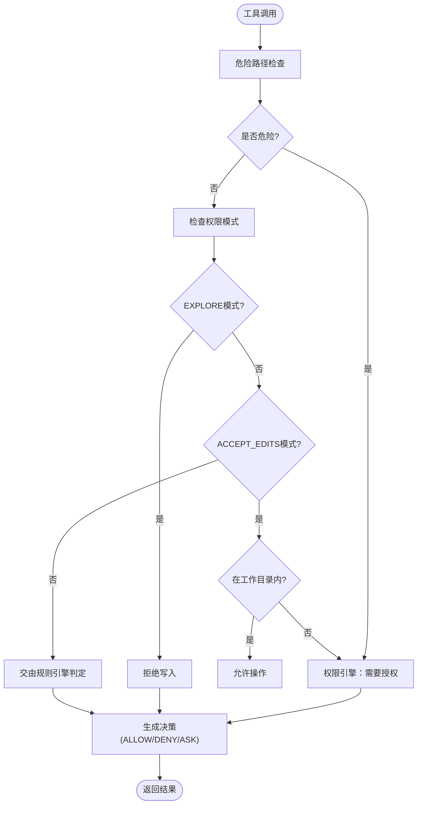
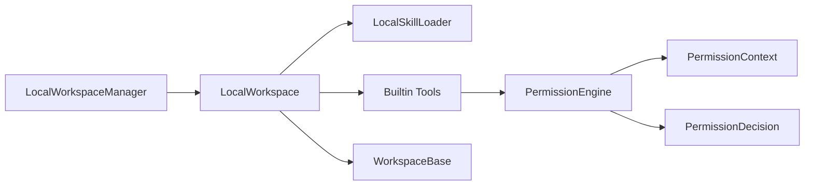

# 本地工作空间

<cite>
**本文引用的文件**
- [src/agentscope/workspace/_local_workspace.py](file://src/agentscope/workspace/_local_workspace.py)
- [src/agentscope/app/_manager/_workspace_manager.py](file://src/agentscope/app/_manager/_workspace_manager.py)
- [src/agentscope/skill/_local_loader.py](file://src/agentscope/skill/_local_loader.py)
- [src/agentscope/tool/_builtin/_bash.py](file://src/agentscope/tool/_builtin/_bash.py)
- [src/agentscope/tool/_builtin/_read.py](file://src/agentscope/tool/_builtin/_read.py)
- [src/agentscope/tool/_builtin/_write.py](file://src/agentscope/tool/_builtin/_write.py)
- [src/agentscope/tool/_builtin/_edit.py](file://src/agentscope/tool/_builtin/_edit.py)
- [src/agentscope/permission/_engine.py](file://src/agentscope/permission/_engine.py)
- [src/agentscope/permission/_context.py](file://src/agentscope/permission/_context.py)
- [src/agentscope/permission/_decision.py](file://src/agentscope/permission/_decision.py)
- [src/agentscope/workspace/_base.py](file://src/agentscope/workspace/_base.py)
- [tests/workspace_local_test.py](file://tests/workspace_local_test.py)
- [tests/workspace_docker_test.py](file://tests/workspace_docker_test.py)
</cite>

## 目录
1. [简介](#简介)
2. [项目结构](#项目结构)
3. [核心组件](#核心组件)
4. [架构总览](#架构总览)
5. [详细组件分析](#详细组件分析)
6. [依赖关系分析](#依赖关系分析)
7. [性能考量](#性能考量)
8. [故障排查指南](#故障排查指南)
9. [结论](#结论)
10. [附录](#附录)

## 简介
本文件面向AgentScope的本地工作空间实现，系统性阐述LocalWorkspace类如何基于本地文件系统提供工作空间能力，包括文件系统资源管理、本地工具调用与技能加载机制。文档覆盖初始化流程、资源路径管理、文件权限控制与数据持久化策略；并对比本地工作空间与Docker工作空间在性能、安全与部署方面的差异及适用场景；最后给出配置示例、使用场景与最佳实践（含开发环境搭建与调试技巧）。

## 项目结构
本地工作空间位于workspace子模块中，配合应用层的工作空间管理器、权限引擎与内置工具共同构成完整的本地执行环境。关键文件与职责如下：
- 工作空间实现：LocalWorkspace（本地文件系统）
- 工作空间管理器：LocalWorkspaceManager（缓存、TTL、重建）
- 技能加载：LocalSkillLoader（从本地目录加载技能）
- 权限控制：PermissionEngine（结合模式与规则）
- 内置工具：Bash、Read、Write、Edit（文件与命令执行）
- 基类接口：WorkspaceBase（统一抽象）

图表来源
- [src/agentscope/app/_manager/_workspace_manager.py](file://src/agentscope/app/_manager/_workspace_manager.py)
- [src/agentscope/workspace/_local_workspace.py](file://src/agentscope/workspace/_local_workspace.py)
- [src/agentscope/workspace/_base.py](file://src/agentscope/workspace/_base.py)
- [src/agentscope/skill/_local_loader.py](file://src/agentscope/skill/_local_loader.py)
- [src/agentscope/tool/_builtin/_bash.py](file://src/agentscope/tool/_builtin/_bash.py)
- [src/agentscope/tool/_builtin/_read.py](file://src/agentscope/tool/_builtin/_read.py)
- [src/agentscope/tool/_builtin/_write.py](file://src/agentscope/tool/_builtin/_write.py)
- [src/agentscope/tool/_builtin/_edit.py](file://src/agentscope/tool/_builtin/_edit.py)
- [src/agentscope/permission/_engine.py](file://src/agentscope/permission/_engine.py)
- [src/agentscope/permission/_context.py](file://src/agentscope/permission/_context.py)
- [src/agentscope/permission/_decision.py](file://src/agentscope/permission/_decision.py)

章节来源
- [src/agentscope/workspace/_local_workspace.py](file://src/agentscope/workspace/_local_workspace.py)
- [src/agentscope/app/_manager/_workspace_manager.py](file://src/agentscope/app/_manager/_workspace_manager.py)

## 核心组件
- LocalWorkspace：基于本地文件系统的可初始化工作空间，负责技能复制、MCP注册、工具调用与生命周期管理。
- LocalWorkspaceManager：以workspace_id为键的缓存式管理器，支持TTL过期回收与重建逻辑，避免并发重复创建。
- LocalSkillLoader：从指定本地路径加载技能包，支持去重与哈希校验，确保技能一致性。
- 权限引擎：根据PermissionMode与AdditionalWorkingDirectory等上下文，对文件读写、编辑与命令执行进行决策。
- 内置工具：Bash（命令执行）、Read/Write/Edit（文件操作），均受权限引擎保护。

章节来源
- [src/agentscope/workspace/_local_workspace.py](file://src/agentscope/workspace/_local_workspace.py)
- [src/agentscope/app/_manager/_workspace_manager.py](file://src/agentscope/app/_manager/_workspace_manager.py)
- [src/agentscope/skill/_local_loader.py](file://src/agentscope/skill/_local_loader.py)
- [src/agentscope/permission/_engine.py](file://src/agentscope/permission/_engine.py)

## 架构总览
本地工作空间采用“管理器-工作空间-技能/工具-权限”的分层架构。管理器负责生命周期与缓存，工作空间负责资源与执行，技能与工具通过权限控制保障安全。

图表来源
- [src/agentscope/app/_manager/_workspace_manager.py](file://src/agentscope/app/_manager/_workspace_manager.py)
- [src/agentscope/workspace/_local_workspace.py](file://src/agentscope/workspace/_local_workspace.py)
- [src/agentscope/skill/_local_loader.py](file://src/agentscope/skill/_local_loader.py)
- [src/agentscope/tool/_builtin/_bash.py](file://src/agentscope/tool/_builtin/_bash.py)
- [src/agentscope/tool/_builtin/_read.py](file://src/agentscope/tool/_builtin/_read.py)
- [src/agentscope/tool/_builtin/_write.py](file://src/agentscope/tool/_builtin/_write.py)
- [src/agentscope/tool/_builtin/_edit.py](file://src/agentscope/tool/_builtin/_edit.py)
- [src/agentscope/permission/_engine.py](file://src/agentscope/permission/_engine.py)

## 详细组件分析

### LocalWorkspace 类分析
- 初始化与生命周期
  - 支持从workdir直接初始化，或在首次使用时构建。
  - 提供initialize/idempotent保证与close销毁。
- 技能管理
  - 从skill_paths复制技能到工作空间的skills目录，自动去重与哈希记录(.skills文件)。
  - 多次initialize不会重复拷贝相同技能，且不修改已有内容。
- MCP管理
  - 支持注册/移除MCP客户端，变更持久化至.mcp文件（当workdir可用时）。
- 文件系统资源
  - 使用工作目录作为根，所有文件操作限定在该目录内，结合权限引擎实现安全控制。

图表来源
- [src/agentscope/workspace/_local_workspace.py](file://src/agentscope/workspace/_local_workspace.py)
- [src/agentscope/workspace/_base.py](file://src/agentscope/workspace/_base.py)
- [src/agentscope/skill/_local_loader.py](file://src/agentscope/skill/_local_loader.py)

章节来源
- [src/agentscope/workspace/_local_workspace.py](file://src/agentscope/workspace/_local_workspace.py)
- [tests/workspace_local_test.py](file://tests/workspace_local_test.py)

### LocalWorkspaceManager 类分析
- 缓存与TTL
  - 以workspace_id为键缓存LocalWorkspace实例，使用monotonic时间戳判断过期。
  - 过期项在持有锁外并行关闭，避免阻塞其他请求。
- 并发控制
  - 双重锁模式：先检查缓存收集过期项；若未命中再加锁重建，防止并发重复创建。
- 重建策略
  - 基于basedir与agent_id确定workdir，无需额外存储查询，实现确定性路径。

图表来源
- [src/agentscope/app/_manager/_workspace_manager.py](file://src/agentscope/app/_manager/_workspace_manager.py)

章节来源
- [src/agentscope/app/_manager/_workspace_manager.py](file://src/agentscope/app/_manager/_workspace_manager.py)

### 技能加载机制（LocalSkillLoader）
- 去重与哈希
  - 对输入的skill_paths进行去重，计算每个技能的哈希，写入工作空间的.skills文件。
- 拷贝策略
  - 将技能目录复制到工作空间的skills子目录，保持原始结构与元数据。
- 二次初始化保护
  - 若目标目录已存在且哈希一致，则跳过复制，保证幂等性。

图表来源
- [src/agentscope/skill/_local_loader.py](file://src/agentscope/skill/_local_loader.py)
- [tests/workspace_local_test.py](file://tests/workspace_local_test.py)

章节来源
- [src/agentscope/skill/_local_loader.py](file://src/agentscope/skill/_local_loader.py)
- [tests/workspace_local_test.py](file://tests/workspace_local_test.py)

### 权限控制与文件系统安全
- 权限模式
  - 探索模式EXPLORE：允许只读操作，拒绝写入。
  - 接受编辑ACCEPT_EDITS：允许在工作目录内的读写与编辑，危险路径需询问。
  - 不询问DONT_ASK：严格按规则拒绝。
- 危险路径检测
  - 内置工具（如Write）对敏感路径进行安全检查，必要时触发“需要授权”流程。
- 工作目录白名单
  - 结合PermissionContext中的AdditionalWorkingDirectory，仅允许在白名单内进行文件操作。

图表来源
- [src/agentscope/tool/_builtin/_write.py](file://src/agentscope/tool/_builtin/_write.py)
- [src/agentscope/permission/_engine.py](file://src/agentscope/permission/_engine.py)
- [src/agentscope/permission/_context.py](file://src/agentscope/permission/_context.py)
- [src/agentscope/permission/_decision.py](file://src/agentscope/permission/_decision.py)

章节来源
- [src/agentscope/tool/_builtin/_write.py](file://src/agentscope/tool/_builtin/_write.py)
- [src/agentscope/permission/_engine.py](file://src/agentscope/permission/_engine.py)
- [src/agentscope/permission/_context.py](file://src/agentscope/permission/_context.py)
- [src/agentscope/permission/_decision.py](file://src/agentscope/permission/_decision.py)

### 本地工具调用（Bash/Read/Write/Edit）
- Bash工具
  - 在受限环境中执行命令，结合权限引擎与工作目录限制，避免越权执行。
- Read/Write/Edit工具
  - 读取/写入/编辑文件，均受权限引擎保护；Write还包含危险路径检测与工作目录白名单校验。

章节来源
- [src/agentscope/tool/_builtin/_bash.py](file://src/agentscope/tool/_builtin/_bash.py)
- [src/agentscope/tool/_builtin/_read.py](file://src/agentscope/tool/_builtin/_read.py)
- [src/agentscope/tool/_builtin/_write.py](file://src/agentscope/tool/_builtin/_write.py)
- [src/agentscope/tool/_builtin/_edit.py](file://src/agentscope/tool/_builtin/_edit.py)

## 依赖关系分析
- 组件耦合
  - LocalWorkspaceManager依赖LocalWorkspace；LocalWorkspace依赖LocalSkillLoader与内置工具。
  - 权限引擎贯穿工具调用链，形成统一的安全控制点。
- 外部依赖
  - 文件系统IO、异步锁与并发gather用于管理生命周期与性能。
  - Docker工作空间提供对比参考，展示不同运行环境的差异。

图表来源
- [src/agentscope/app/_manager/_workspace_manager.py](file://src/agentscope/app/_manager/_workspace_manager.py)
- [src/agentscope/workspace/_local_workspace.py](file://src/agentscope/workspace/_local_workspace.py)
- [src/agentscope/workspace/_base.py](file://src/agentscope/workspace/_base.py)
- [src/agentscope/skill/_local_loader.py](file://src/agentscope/skill/_local_loader.py)
- [src/agentscope/tool/_builtin/_bash.py](file://src/agentscope/tool/_builtin/_bash.py)
- [src/agentscope/tool/_builtin/_read.py](file://src/agentscope/tool/_builtin/_read.py)
- [src/agentscope/tool/_builtin/_write.py](file://src/agentscope/tool/_builtin/_write.py)
- [src/agentscope/tool/_builtin/_edit.py](file://src/agentscope/tool/_builtin/_edit.py)
- [src/agentscope/permission/_engine.py](file://src/agentscope/permission/_engine.py)
- [src/agentscope/permission/_context.py](file://src/agentscope/permission/_context.py)
- [src/agentscope/permission/_decision.py](file://src/agentscope/permission/_decision.py)

章节来源
- [src/agentscope/app/_manager/_workspace_manager.py](file://src/agentscope/app/_manager/_workspace_manager.py)
- [src/agentscope/workspace/_local_workspace.py](file://src/agentscope/workspace/_local_workspace.py)
- [src/agentscope/workspace/_base.py](file://src/agentscope/workspace/_base.py)
- [src/agentscope/skill/_local_loader.py](file://src/agentscope/skill/_local_loader.py)
- [src/agentscope/tool/_builtin/_bash.py](file://src/agentscope/tool/_builtin/_bash.py)
- [src/agentscope/tool/_builtin/_read.py](file://src/agentscope/tool/_builtin/_read.py)
- [src/agentscope/tool/_builtin/_write.py](file://src/agentscope/tool/_builtin/_write.py)
- [src/agentscope/tool/_builtin/_edit.py](file://src/agentscope/tool/_builtin/_edit.py)
- [src/agentscope/permission/_engine.py](file://src/agentscope/permission/_engine.py)
- [src/agentscope/permission/_context.py](file://src/agentscope/permission/_context.py)
- [src/agentscope/permission/_decision.py](file://src/agentscope/permission/_decision.py)

## 性能考量
- 缓存与TTL
  - 通过TTL避免长期占用资源；过期项在锁外并行关闭，降低锁竞争。
- 幂等初始化
  - 多次initialize不重复拷贝技能，减少IO开销。
- 并发安全
  - 双重锁策略防止竞态，确保同一workspace_id不会被重复创建。
- I/O优化
  - 技能去重与哈希持久化，避免不必要的磁盘写入。

## 故障排查指南
- 初始化失败
  - 检查workdir是否存在与可写；确认技能路径有效且可访问。
- 技能未生效
  - 确认.skills文件存在且哈希正确；查看是否因重复初始化而被跳过。
- 权限被拒
  - 检查PermissionMode与AdditionalWorkingDirectory配置；确认操作路径是否在白名单内。
- MCP注册异常
  - 查看.mcp文件是否正确持久化；确认名称唯一性与连接状态。

章节来源
- [tests/workspace_local_test.py](file://tests/workspace_local_test.py)
- [tests/workspace_docker_test.py](file://tests/workspace_docker_test.py)

## 结论
本地工作空间通过明确的分层设计与严格的权限控制，在本地文件系统上提供了高效、安全且可缓存的工作空间能力。其与Docker工作空间相比，具备更低的部署门槛与更好的开发调试体验，但在隔离性与跨平台一致性方面有所牺牲。建议在开发与测试阶段优先使用本地工作空间，在需要强隔离与一致性生产环境时选择Docker工作空间。

## 附录

### 本地工作空间与Docker工作空间对比
- 性能
  - 本地：无容器启动/网络开销，I/O延迟低；适合高频迭代与快速反馈。
  - Docker：容器启动与网络有额外开销，但可复现环境差异。
- 安全
  - 本地：依赖权限引擎与工作目录白名单；风险集中于宿主机。
  - Docker：更强的进程与文件系统隔离，降低误操作影响面。
- 部署
  - 本地：无需安装容器运行时；直接使用宿主机资源。
  - Docker：需要Docker守护进程与镜像准备，便于标准化交付。

章节来源
- [tests/workspace_docker_test.py](file://tests/workspace_docker_test.py)

### 配置示例与最佳实践
- 配置要点
  - 指定basedir与skill_paths，确保路径可读写。
  - 设置合适的TTL，平衡内存占用与热缓存命中率。
  - 合理配置PermissionMode与AdditionalWorkingDirectory，满足开发与安全需求。
- 使用场景
  - 快速原型开发、本地脚本执行、文件批处理与多工具编排。
- 最佳实践
  - 开发环境：使用EXPLORE模式进行只读验证，进入ACCEPT_EDITS后谨慎写入。
  - 调试技巧：利用多次initialize幂等特性，快速回滚与重试；通过日志定位权限与I/O问题。