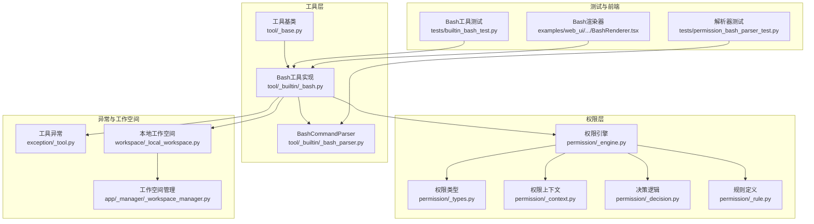
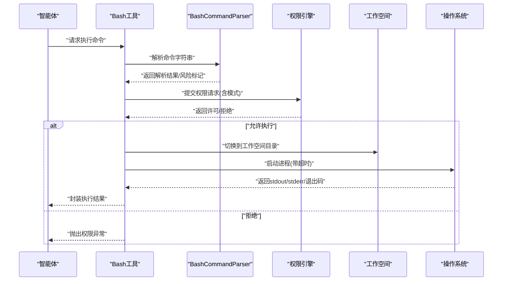
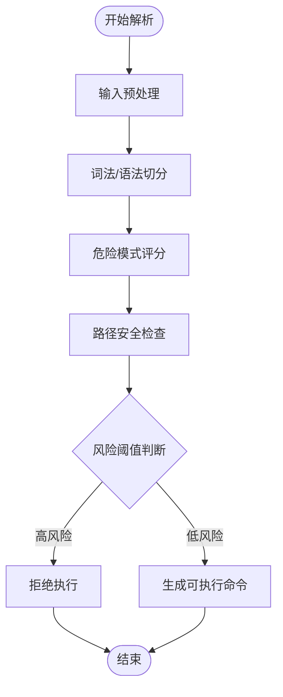
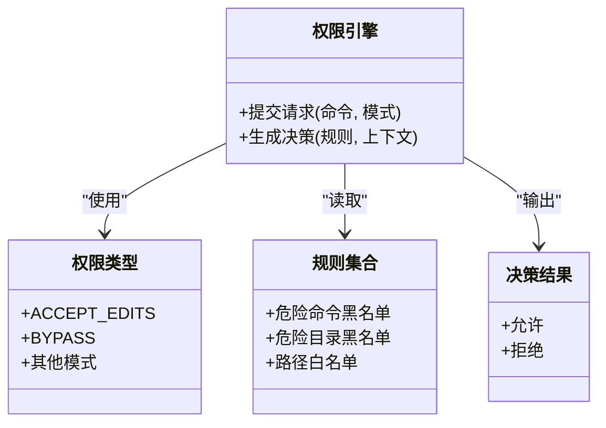
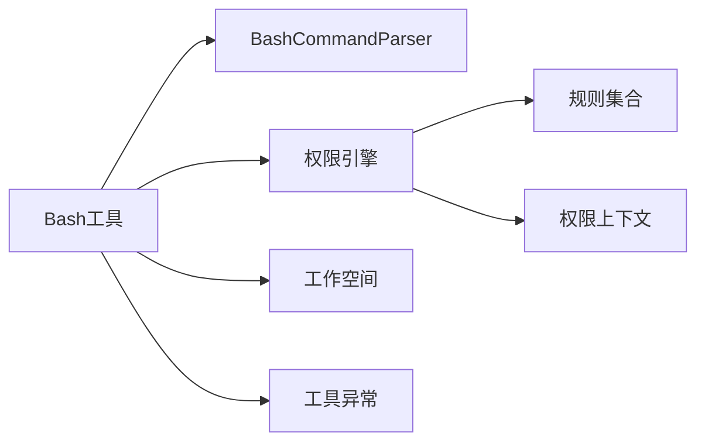

# Bash工具

<cite>
**本文引用的文件**
- [src/agentscope/tool/_builtin/_bash.py](file://src/agentscope/tool/_builtin/_bash.py)
- [src/agentscope/tool/_builtin/_bash_parser.py](file://src/agentscope/tool/_builtin/_bash_parser.py)
- [src/agentscope/tool/_constants.py](file://src/agentscope/tool/_constants.py)
- [src/agentscope/tool/_base.py](file://src/agentscope/tool/_base.py)
- [src/agentscope/permission/_engine.py](file://src/agentscope/permission/_engine.py)
- [src/agentscope/permission/_types.py](file://src/agentscope/permission/_types.py)
- [src/agentscope/permission/_context.py](file://src/agentscope/permission/_context.py)
- [src/agentscope/permission/_decision.py](file://src/agentscope/permission/_decision.py)
- [src/agentscope/permission/_rule.py](file://src/agentscope/permission/_rule.py)
- [src/agentscope/exception/_tool.py](file://src/agentscope/exception/_tool.py)
- [src/agentscope/workspace/_local_workspace.py](file://src/agentscope/workspace/_local_workspace.py)
- [src/agentscope/app/_manager/_workspace_manager.py](file://src/agentscope/app/_manager/_workspace_manager.py)
- [tests/builtin_bash_test.py](file://tests/builtin_bash_test.py)
- [tests/permission_bash_parser_test.py](file://tests/permission_bash_parser_test.py)
- [examples/web_ui/frontend/src/components/chat/tool-renderers/BashRenderer.tsx](file://examples/web_ui/frontend/src/components/chat/tool-renderers/BashRenderer.tsx)
</cite>

## 目录
1. [简介](#简介)
2. [项目结构](#项目结构)
3. [核心组件](#核心组件)
4. [架构总览](#架构总览)
5. [详细组件分析](#详细组件分析)
6. [依赖关系分析](#依赖关系分析)
7. [性能考量](#性能考量)
8. [故障排查指南](#故障排查指南)
9. [结论](#结论)
10. [附录](#附录)

## 简介
本文件面向AgentScope中的Bash工具，系统性阐述其功能、参数与使用方式，重点覆盖以下方面：
- 命令执行机制：同步/异步执行、工作空间隔离、超时控制与资源回收
- 权限控制系统：权限模式（如ACCEPT_EDITS、BYPASS等）对行为的影响
- 安全检查机制：危险命令识别、路径安全校验、注入风险检测
- BashCommandParser安全解析器：如何识别危险模式与潜在注入风险
- 实战用法：在智能体中执行系统命令、并行多命令、Git操作最佳实践、错误处理策略
- 配置指南：如何配置危险文件/目录白名单与黑名单

## 项目结构
Bash工具位于内置工具模块中，围绕“工具定义—解析器—权限引擎—异常处理—工作空间”的链路组织。前端通过Bash渲染器展示工具调用结果。

图表来源
- [src/agentscope/tool/_base.py](file://src/agentscope/tool/_base.py)
- [src/agentscope/tool/_builtin/_bash.py](file://src/agentscope/tool/_builtin/_bash.py)
- [src/agentscope/tool/_builtin/_bash_parser.py](file://src/agentscope/tool/_builtin/_bash_parser.py)
- [src/agentscope/permission/_engine.py](file://src/agentscope/permission/_engine.py)
- [src/agentscope/permission/_types.py](file://src/agentscope/permission/_types.py)
- [src/agentscope/permission/_context.py](file://src/agentscope/permission/_context.py)
- [src/agentscope/permission/_decision.py](file://src/agentscope/permission/_decision.py)
- [src/agentscope/permission/_rule.py](file://src/agentscope/permission/_rule.py)
- [src/agentscope/exception/_tool.py](file://src/agentscope/exception/_tool.py)
- [src/agentscope/workspace/_local_workspace.py](file://src/agentscope/workspace/_local_workspace.py)
- [src/agentscope/app/_manager/_workspace_manager.py](file://src/agentscope/app/_manager/_workspace_manager.py)
- [tests/builtin_bash_test.py](file://tests/builtin_bash_test.py)
- [tests/permission_bash_parser_test.py](file://tests/permission_bash_parser_test.py)
- [examples/web_ui/frontend/src/components/chat/tool-renderers/BashRenderer.tsx](file://examples/web_ui/frontend/src/components/chat/tool-renderers/BashRenderer.tsx)

章节来源
- [src/agentscope/tool/_builtin/_bash.py](file://src/agentscope/tool/_builtin/_bash.py)
- [src/agentscope/tool/_builtin/_bash_parser.py](file://src/agentscope/tool/_builtin/_bash_parser.py)
- [src/agentscope/tool/_base.py](file://src/agentscope/tool/_base.py)
- [src/agentscope/permission/_engine.py](file://src/agentscope/permission/_engine.py)
- [src/agentscope/permission/_types.py](file://src/agentscope/permission/_types.py)
- [src/agentscope/permission/_context.py](file://src/agentscope/permission/_context.py)
- [src/agentscope/permission/_decision.py](file://src/agentscope/permission/_decision.py)
- [src/agentscope/permission/_rule.py](file://src/agentscope/permission/_rule.py)
- [src/agentscope/exception/_tool.py](file://src/agentscope/exception/_tool.py)
- [src/agentscope/workspace/_local_workspace.py](file://src/agentscope/workspace/_local_workspace.py)
- [src/agentscope/app/_manager/_workspace_manager.py](file://src/agentscope/app/_manager/_workspace_manager.py)
- [tests/builtin_bash_test.py](file://tests/builtin_bash_test.py)
- [tests/permission_bash_parser_test.py](file://tests/permission_bash_parser_test.py)
- [examples/web_ui/frontend/src/components/chat/tool-renderers/BashRenderer.tsx](file://examples/web_ui/frontend/src/components/chat/tool-renderers/BashRenderer.tsx)

## 核心组件
- Bash工具实现：封装命令执行、工作空间隔离、超时控制、输出捕获与错误处理
- BashCommandParser：解析命令字符串，识别危险模式、路径合法性与注入风险
- 权限引擎：根据权限模式（如ACCEPT_EDITS、BYPASS等）决定是否放行命令
- 工作空间：提供本地沙箱环境，限制命令可访问的文件范围
- 异常体系：统一的工具异常类型，便于上层捕获与提示

章节来源
- [src/agentscope/tool/_builtin/_bash.py](file://src/agentscope/tool/_builtin/_bash.py)
- [src/agentscope/tool/_builtin/_bash_parser.py](file://src/agentscope/tool/_builtin/_bash_parser.py)
- [src/agentscope/permission/_engine.py](file://src/agentscope/permission/_engine.py)
- [src/agentscope/workspace/_local_workspace.py](file://src/agentscope/workspace/_local_workspace.py)
- [src/agentscope/exception/_tool.py](file://src/agentscope/exception/_tool.py)

## 架构总览
下图展示了从智能体到命令执行的端到端流程，包括权限判定、命令解析、工作空间隔离与结果返回。

图表来源
- [src/agentscope/tool/_builtin/_bash.py](file://src/agentscope/tool/_builtin/_bash.py)
- [src/agentscope/tool/_builtin/_bash_parser.py](file://src/agentscope/tool/_builtin/_bash_parser.py)
- [src/agentscope/permission/_engine.py](file://src/agentscope/permission/_engine.py)
- [src/agentscope/workspace/_local_workspace.py](file://src/agentscope/workspace/_local_workspace.py)

## 详细组件分析

### Bash工具实现
- 功能要点
  - 支持单条或多条命令串行/并行执行
  - 通过工作空间隔离，限制命令可见/可写文件范围
  - 超时控制与资源回收，避免长时间阻塞
  - 统一异常封装，区分系统错误与权限错误
- 关键接口与行为
  - 执行入口：接收命令字符串或命令列表，返回结构化结果
  - 并行执行：支持同时触发多个独立命令，聚合输出
  - 超时处理：为每个命令设置最大执行时间，超时则终止进程
  - 输出捕获：分别记录标准输出与标准错误，并保留退出码
- 典型用法参考
  - 单命令执行：见测试用例中的调用路径
  - 多命令并行：见测试用例中的并发执行路径
  - Git操作：见测试用例中的版本控制相关场景
  - 错误处理：见测试用例中的异常捕获与断言

章节来源
- [src/agentscope/tool/_builtin/_bash.py](file://src/agentscope/tool/_builtin/_bash.py)
- [tests/builtin_bash_test.py](file://tests/builtin_bash_test.py)

### BashCommandParser安全解析器
- 功能要点
  - 检测潜在注入风险：识别命令拼接、管道、重定向等高危模式
  - 危险命令模式识别：如删除、修改系统关键路径、执行未知二进制等
  - 路径安全检查：确保命令引用的文件/目录在允许范围内
- 解析流程
  - 输入预处理：清理空白、转义特殊字符
  - 词法/语法分析：拆分命令与参数，识别重定向、管道、变量扩展等
  - 风险评估：对每个片段打分，汇总整体风险
  - 结果输出：返回可执行命令序列与风险标签
- 典型用法参考
  - 危险命令拦截：见解析器测试用例
  - 合法命令放行：见解析器测试用例
  - 路径越权检测：见解析器测试用例

图表来源
- [src/agentscope/tool/_builtin/_bash_parser.py](file://src/agentscope/tool/_builtin/_bash_parser.py)
- [tests/permission_bash_parser_test.py](file://tests/permission_bash_parser_test.py)

章节来源
- [src/agentscope/tool/_builtin/_bash_parser.py](file://src/agentscope/tool/_builtin/_bash_parser.py)
- [tests/permission_bash_parser_test.py](file://tests/permission_bash_parser_test.py)

### 权限控制系统
- 权限模式
  - ACCEPT_EDITS：允许编辑文件的命令
  - BYPASS：绕过权限检查（谨慎使用）
  - 其他模式：根据具体业务定义
- 决策流程
  - 权限引擎接收命令与模式，结合规则与上下文进行综合判定
  - 若命中高危模式或越权路径，则拒绝；否则放行
- 配置建议
  - 默认采用更严格的模式，仅在受控场景启用BYPASS
  - 将危险命令与目录加入黑名单，白名单仅包含必要路径

图表来源
- [src/agentscope/permission/_engine.py](file://src/agentscope/permission/_engine.py)
- [src/agentscope/permission/_types.py](file://src/agentscope/permission/_types.py)
- [src/agentscope/permission/_rule.py](file://src/agentscope/permission/_rule.py)
- [src/agentscope/permission/_decision.py](file://src/agentscope/permission/_decision.py)
- [src/agentscope/permission/_context.py](file://src/agentscope/permission/_context.py)

章节来源
- [src/agentscope/permission/_engine.py](file://src/agentscope/permission/_engine.py)
- [src/agentscope/permission/_types.py](file://src/agentscope/permission/_types.py)
- [src/agentscope/permission/_rule.py](file://src/agentscope/permission/_rule.py)
- [src/agentscope/permission/_decision.py](file://src/agentscope/permission/_decision.py)
- [src/agentscope/permission/_context.py](file://src/agentscope/permission/_context.py)

### 工作空间与超时控制
- 工作空间
  - 提供隔离的执行环境，限制命令可访问的文件范围
  - 可配置工作目录、临时文件位置与清理策略
- 超时控制
  - 为每个命令设置超时阈值，防止长时间阻塞
  - 超时后自动终止进程并回收资源
- 资源回收
  - 进程结束后释放内存与句柄
  - 清理临时文件与日志

章节来源
- [src/agentscope/workspace/_local_workspace.py](file://src/agentscope/workspace/_local_workspace.py)
- [src/agentscope/app/_manager/_workspace_manager.py](file://src/agentscope/app/_manager/_workspace_manager.py)
- [src/agentscope/tool/_builtin/_bash.py](file://src/agentscope/tool/_builtin/_bash.py)

### 异常处理与错误策略
- 工具异常
  - 使用统一的工具异常类型，便于上层捕获与分类处理
- 错误策略
  - 对于权限拒绝：返回明确的拒绝原因与建议
  - 对于系统错误：返回标准错误输出与退出码
  - 对于超时：返回超时信息并提示调整阈值

章节来源
- [src/agentscope/exception/_tool.py](file://src/agentscope/exception/_tool.py)
- [src/agentscope/tool/_builtin/_bash.py](file://src/agentscope/tool/_builtin/_bash.py)

### 前端集成与可视化
- Bash渲染器负责在Web界面中展示Bash工具的调用与结果
- 支持命令输入、执行状态显示与结果格式化展示

章节来源
- [examples/web_ui/frontend/src/components/chat/tool-renderers/BashRenderer.tsx](file://examples/web_ui/frontend/src/components/chat/tool-renderers/BashRenderer.tsx)

## 依赖关系分析
- 组件耦合
  - Bash工具依赖解析器进行安全检查，依赖权限引擎进行决策，依赖工作空间进行隔离
  - 权限引擎依赖规则与上下文，规则来源于配置
- 外部依赖
  - 操作系统命令执行能力
  - 文件系统访问权限
  - 线程/进程管理与超时控制

图表来源
- [src/agentscope/tool/_builtin/_bash.py](file://src/agentscope/tool/_builtin/_bash.py)
- [src/agentscope/tool/_builtin/_bash_parser.py](file://src/agentscope/tool/_builtin/_bash_parser.py)
- [src/agentscope/permission/_engine.py](file://src/agentscope/permission/_engine.py)
- [src/agentscope/permission/_rule.py](file://src/agentscope/permission/_rule.py)
- [src/agentscope/permission/_context.py](file://src/agentscope/permission/_context.py)
- [src/agentscope/workspace/_local_workspace.py](file://src/agentscope/workspace/_local_workspace.py)
- [src/agentscope/exception/_tool.py](file://src/agentscope/exception/_tool.py)

章节来源
- [src/agentscope/tool/_builtin/_bash.py](file://src/agentscope/tool/_builtin/_bash.py)
- [src/agentscope/tool/_builtin/_bash_parser.py](file://src/agentscope/tool/_builtin/_bash_parser.py)
- [src/agentscope/permission/_engine.py](file://src/agentscope/permission/_engine.py)
- [src/agentscope/permission/_rule.py](file://src/agentscope/permission/_rule.py)
- [src/agentscope/permission/_context.py](file://src/agentscope/permission/_context.py)
- [src/agentscope/workspace/_local_workspace.py](file://src/agentscope/workspace/_local_workspace.py)
- [src/agentscope/exception/_tool.py](file://src/agentscope/exception/_tool.py)

## 性能考量
- 并发执行
  - 合理设置并发度，避免过多命令同时占用CPU/IO
- 超时阈值
  - 根据命令特性设置合理超时，平衡安全性与可用性
- 资源回收
  - 及时清理临时文件与僵尸进程，降低内存与句柄泄漏风险
- 日志与监控
  - 记录执行耗时、失败率与超时次数，辅助优化阈值与规则

## 故障排查指南
- 常见问题
  - 权限被拒绝：检查权限模式与规则配置，确认命令是否命中黑名单
  - 路径越权：确认工作空间目录与白名单/黑名单配置
  - 超时失败：适当提高超时阈值或拆分复杂命令
  - 注入风险拦截：修正命令格式或使用安全替代方案
- 排查步骤
  - 查看工具异常类型与错误信息
  - 检查权限引擎决策日志
  - 校验解析器对命令的评分与标记
  - 验证工作空间隔离是否生效

章节来源
- [src/agentscope/exception/_tool.py](file://src/agentscope/exception/_tool.py)
- [src/agentscope/permission/_engine.py](file://src/agentscope/permission/_engine.py)
- [src/agentscope/tool/_builtin/_bash_parser.py](file://src/agentscope/tool/_builtin/_bash_parser.py)
- [src/agentscope/workspace/_local_workspace.py](file://src/agentscope/workspace/_local_workspace.py)

## 结论
Bash工具通过“解析器+权限引擎+工作空间+异常体系”的组合，实现了安全可控的命令执行能力。在实际应用中，应优先采用严格的权限模式，完善危险命令与路径的规则配置，并结合超时与并发策略提升稳定性与安全性。

## 附录
- 参数与配置清单
  - 权限模式：ACCEPT_EDITS、BYPASS等
  - 危险命令黑名单：删除、修改系统关键路径、执行未知二进制等
  - 危险目录黑名单：系统目录、用户主目录等
  - 路径白名单：仅允许访问的工作空间内目录
  - 超时阈值：按命令类型设置合理上限
- 最佳实践
  - 单命令优先：尽量将复杂任务拆分为多个简单命令
  - Git操作：使用安全的子命令与参数，避免直接拼接命令
  - 错误处理：捕获并分类处理权限、系统与超时异常
  - 并行执行：控制并发度，避免资源争用