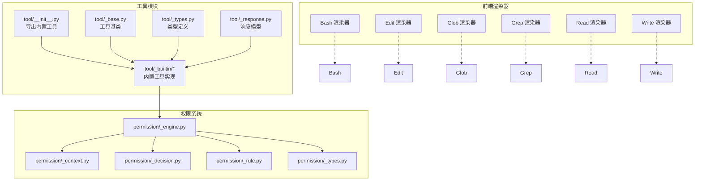
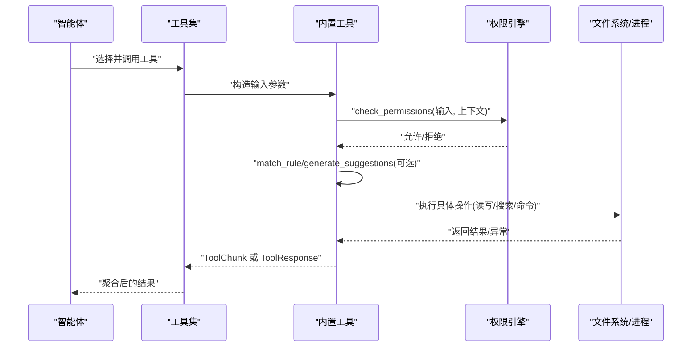
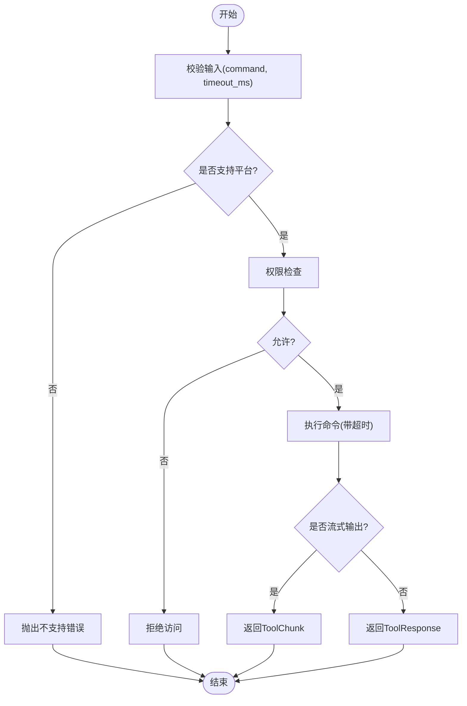
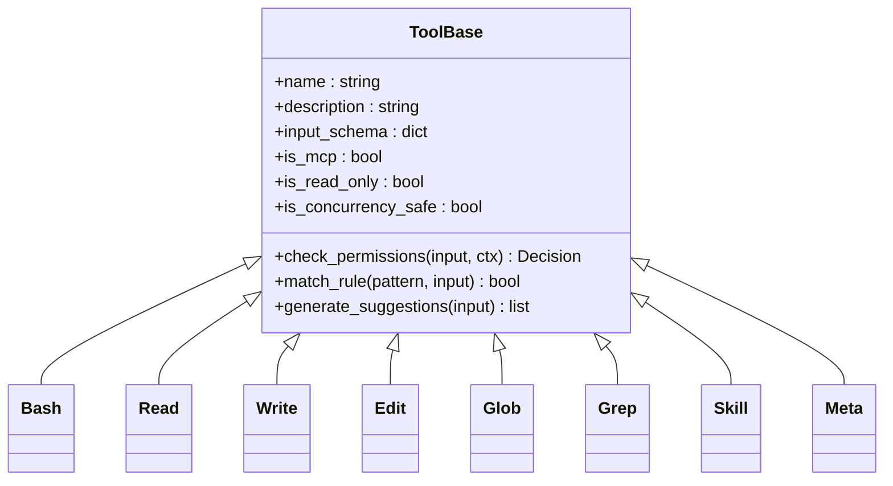

# 内置工具

<cite>
**本文引用的文件**
- [src/agentscope/tool/__init__.py](file://src/agentscope/tool/__init__.py)
- [src/agentscope/tool/_base.py](file://src/agentscope/tool/_base.py)
- [src/agentscope/tool/_builtin/__init__.py](file://src/agentscope/tool/_builtin/__init__.py)
- [src/agentscope/tool/_builtin/_bash.py](file://src/agentscope/tool/_builtin/_bash.py)
- [src/agentscope/tool/_builtin/_bash_parser.py](file://src/agentscope/tool/_builtin/_bash_parser.py)
- [src/agentscope/tool/_builtin/_edit.py](file://src/agentscope/tool/_builtin/_edit.py)
- [src/agentscope/tool/_builtin/_glob.py](file://src/agentscope/tool/_builtin/_glob.py)
- [src/agentscope/tool/_builtin/_grep.py](file://src/agentscope/tool/_builtin/_grep.py)
- [src/agentscope/tool/_builtin/_meta.py](file://src/agentscope/tool/_builtin/_meta.py)
- [src/agentscope/tool/_builtin/_read.py](file://src/agentscope/tool/_builtin/_read.py)
- [src/agentscope/tool/_builtin/_skill.py](file://src/agentscope/tool/_builtin/_skill.py)
- [src/agentscope/tool/_builtin/_write.py](file://src/agentscope/tool/_builtin/_write.py)
- [src/agentscope/tool/_response.py](file://src/agentscope/tool/_response.py)
- [src/agentscope/tool/_types.py](file://src/agentscope/tool/_types.py)
- [src/agentscope/permission/_engine.py](file://src/agentscope/permission/_engine.py)
- [src/agentscope/permission/_context.py](file://src/agentscope/permission/_context.py)
- [src/agentscope/permission/_decision.py](file://src/agentscope/permission/_decision.py)
- [src/agentscope/permission/_rule.py](file://src/agentscope/permission/_rule.py)
- [src/agentscope/permission/_types.py](file://src/agentscope/permission/_types.py)
- [tests/builtin_bash_test.py](file://tests/builtin_bash_test.py)
- [tests/builtin_edit_test.py](file://tests/builtin_edit_test.py)
- [tests/builtin_glob_test.py](file://tests/builtin_glob_test.py)
- [tests/builtin_grep_test.py](file://tests/builtin_grep_test.py)
- [tests/builtin_read_test.py](file://tests/builtin_read_test.py)
- [tests/builtin_write_test.py](file://tests/builtin_write_test.py)
- [examples/web_ui/frontend/src/components/chat/tool-renderers/BashRenderer.tsx](file://examples/web_ui/frontend/src/components/chat/tool-renderers/BashRenderer.tsx)
- [examples/web_ui/frontend/src/components/chat/tool-renderers/EditRenderer.tsx](file://examples/web_ui/frontend/src/components/chat/tool-renderers/EditRenderer.tsx)
- [examples/web_ui/frontend/src/components/chat/tool-renderers/GlobRenderer.tsx](file://examples/web_ui/frontend/src/components/chat/tool-renderers/GlobRenderer.tsx)
- [examples/web_ui/frontend/src/components/chat/tool-renderers/GrepRenderer.tsx](file://examples/web_ui/frontend/src/components/chat/tool-renderers/GrepRenderer.tsx)
- [examples/web_ui/frontend/src/components/chat/tool-renderers/ReadRenderer.tsx](file://examples/web_ui/frontend/src/components/chat/tool-renderers/ReadRenderer.tsx)
- [examples/web_ui/frontend/src/components/chat/tool-renderers/WriteRenderer.tsx](file://examples/web_ui/frontend/src/components/chat/tool-renderers/WriteRenderer.tsx)
</cite>

## 目录
1. [简介](#简介)
2. [项目结构](#项目结构)
3. [核心组件](#核心组件)
4. [架构总览](#架构总览)
5. [详细组件分析](#详细组件分析)
6. [依赖关系分析](#依赖关系分析)
7. [性能考虑](#性能考虑)
8. [故障排查指南](#故障排查指南)
9. [结论](#结论)
10. [附录](#附录)

## 简介
本文件面向AgentScope的内置工具，系统性梳理并说明以下工具的能力、参数、输出格式、权限与安全限制，并给出在智能体中的使用建议与最佳实践：Bash（系统命令执行）、Read/Write（文件读写）、Edit（文件内容编辑）、Glob（文件路径模式匹配）、Grep（文本搜索）、Skill（技能调用）、Meta（元数据操作）。文档同时提供调用流程图、类图与序列图，帮助读者从整体到细节理解工具链路。

## 项目结构
内置工具位于工具模块的“_builtin”子包中，统一通过工具模块入口导出；权限控制由独立的权限引擎提供；前端Web UI提供了各工具的渲染器以增强交互体验。

图表来源
- [src/agentscope/tool/__init__.py:1-50](file://src/agentscope/tool/__init__.py#L1-L50)
- [src/agentscope/tool/_builtin/__init__.py](file://src/agentscope/tool/_builtin/__init__.py)
- [src/agentscope/tool/_base.py](file://src/agentscope/tool/_base.py)
- [src/agentscope/tool/_types.py](file://src/agentscope/tool/_types.py)
- [src/agentscope/tool/_response.py](file://src/agentscope/tool/_response.py)
- [src/agentscope/permission/_engine.py](file://src/agentscope/permission/_engine.py)
- [examples/web_ui/frontend/src/components/chat/tool-renderers/BashRenderer.tsx](file://examples/web_ui/frontend/src/components/chat/tool-renderers/BashRenderer.tsx)
- [examples/web_ui/frontend/src/components/chat/tool-renderers/EditRenderer.tsx](file://examples/web_ui/frontend/src/components/chat/tool-renderers/EditRenderer.tsx)
- [examples/web_ui/frontend/src/components/chat/tool-renderers/GlobRenderer.tsx](file://examples/web_ui/frontend/src/components/chat/tool-renderers/GlobRenderer.tsx)
- [examples/web_ui/frontend/src/components/chat/tool-renderers/GrepRenderer.tsx](file://examples/web_ui/frontend/src/components/chat/tool-renderers/GrepRenderer.tsx)
- [examples/web_ui/frontend/src/components/chat/tool-renderers/ReadRenderer.tsx](file://examples/web_ui/frontend/src/components/chat/tool-renderers/ReadRenderer.tsx)
- [examples/web_ui/frontend/src/components/chat/tool-renderers/WriteRenderer.tsx](file://examples/web_ui/frontend/src/components/chat/tool-renderers/WriteRenderer.tsx)

章节来源
- [src/agentscope/tool/__init__.py:1-50](file://src/agentscope/tool/__init__.py#L1-L50)
- [src/agentscope/tool/_builtin/__init__.py](file://src/agentscope/tool/_builtin/__init__.py)

## 核心组件
- 工具基类与类型：工具基类定义了统一的生命周期与接口契约；类型系统定义了工具选择、函数签名与注册工具等核心类型。
- 内置工具集合：包含Bash、Read、Write、Edit、Glob、Grep、Skill、Meta等工具，均继承自工具基类。
- 权限引擎：提供权限上下文、决策、规则与类型，支持对工具调用进行细粒度控制。
- 响应模型：统一的工具响应与分片模型，便于流式或非流式返回结果。

章节来源
- [src/agentscope/tool/_base.py](file://src/agentscope/tool/_base.py)
- [src/agentscope/tool/_types.py](file://src/agentscope/tool/_types.py)
- [src/agentscope/tool/_response.py](file://src/agentscope/tool/_response.py)
- [src/agentscope/permission/_engine.py](file://src/agentscope/permission/_engine.py)
- [src/agentscope/permission/_context.py](file://src/agentscope/permission/_context.py)
- [src/agentscope/permission/_decision.py](file://src/agentscope/permission/_decision.py)
- [src/agentscope/permission/_rule.py](file://src/agentscope/permission/_rule.py)
- [src/agentscope/permission/_types.py](file://src/agentscope/permission/_types.py)

## 架构总览
内置工具遵循统一的调用协议：智能体将工具请求封装为标准输入，工具执行后返回统一的响应对象；权限引擎在调用前进行策略评估；前端渲染器负责可视化展示工具行为与结果。

图表来源
- [src/agentscope/tool/_base.py](file://src/agentscope/tool/_base.py)
- [src/agentscope/tool/_builtin/_bash.py](file://src/agentscope/tool/_builtin/_bash.py)
- [src/agentscope/permission/_engine.py](file://src/agentscope/permission/_engine.py)

## 详细组件分析

### Bash 工具
- 功能概述：在受控环境中执行系统命令，支持流式输出与超时控制。建议优先使用专用工具完成常见任务（如搜索、读取、编辑）。
- 输入参数
  - command: 字符串，待执行的命令行
  - timeout_ms: 可选，毫秒级超时上限，默认最大值见实现
- 输出格式
  - 流式分片：ToolChunk，包含stdout/stderr片段
  - 完整响应：ToolResponse，包含退出码、输出与错误信息
- 权限与安全
  - 支持权限检查与规则匹配（如前缀/通配符模式）
  - 不建议在Windows平台使用
- 使用示例与最佳实践
  - 在需要跨工具组合时谨慎使用，避免重复功能
  - 对含空格路径使用双引号，尽量保持当前工作目录稳定
  - 合理设置超时，避免长时间阻塞
- 错误处理
  - 命令失败返回非零退出码
  - 超时、权限拒绝、平台不支持等场景需捕获并反馈

图表来源
- [src/agentscope/tool/_builtin/_bash.py:51-79](file://src/agentscope/tool/_builtin/_bash.py#L51-L79)
- [tests/builtin_bash_test.py:37-249](file://tests/builtin_bash_test.py#L37-L249)

章节来源
- [src/agentscope/tool/_builtin/_bash.py:51-79](file://src/agentscope/tool/_builtin/_bash.py#L51-L79)
- [tests/builtin_bash_test.py:37-249](file://tests/builtin_bash_test.py#L37-L249)
- [examples/web_ui/frontend/src/components/chat/tool-renderers/BashRenderer.tsx](file://examples/web_ui/frontend/src/components/chat/tool-renderers/BashRenderer.tsx)

### Read 工具
- 功能概述：读取指定文件内容，适合获取配置、日志、源码等文本资源。
- 输入参数
  - path: 字符串，目标文件路径
  - max_length: 可选，最大读取长度
- 输出格式
  - ToolResponse，包含content字段
- 权限与安全
  - 需要只读权限
  - 建议配合权限规则限制可访问路径范围
- 使用示例与最佳实践
  - 读取前先用Glob确认路径存在
  - 大文件建议分块读取或限制max_length
- 错误处理
  - 文件不存在、无权限、路径非法等异常需捕获

章节来源
- [src/agentscope/tool/_builtin/_read.py](file://src/agentscope/tool/_builtin/_read.py)
- [tests/builtin_read_test.py](file://tests/builtin_read_test.py)
- [examples/web_ui/frontend/src/components/chat/tool-renderers/ReadRenderer.tsx](file://examples/web_ui/frontend/src/components/chat/tool-renderers/ReadRenderer.tsx)

### Write 工具
- 功能概述：向指定文件写入内容，支持覆盖与追加模式。
- 输入参数
  - path: 字符串，目标文件路径
  - content: 字符串，写入内容
  - mode: 可选，'w'覆盖或'a'追加
- 输出格式
  - ToolResponse，包含成功状态与提示信息
- 权限与安全
  - 需要写权限；默认非只读
- 使用示例与最佳实践
  - 写入前先用Glob确认父目录存在
  - 追加模式适合日志记录
- 错误处理
  - 目录不可写、磁盘空间不足、路径非法等

章节来源
- [src/agentscope/tool/_builtin/_write.py](file://src/agentscope/tool/_builtin/_write.py)
- [tests/builtin_write_test.py](file://tests/builtin_write_test.py)
- [examples/web_ui/frontend/src/components/chat/tool-renderers/WriteRenderer.tsx](file://examples/web_ui/frontend/src/components/chat/tool-renderers/WriteRenderer.tsx)

### Edit 工具
- 功能概述：对文件内容进行编辑，支持插入、替换、删除等操作。
- 输入参数
  - path: 字符串，目标文件路径
  - operations: 列表，包含多种编辑操作（如插入、替换、删除）
- 输出格式
  - ToolResponse，包含修改摘要与新内容预览
- 权限与安全
  - 需要写权限；建议限制可编辑路径范围
- 使用示例与最佳实践
  - 先Read获取原始内容，再按需编辑
  - 操作前生成备份，便于回滚
- 错误处理
  - 文件锁定、权限不足、语法错误等

章节来源
- [src/agentscope/tool/_builtin/_edit.py](file://src/agentscope/tool/_builtin/_edit.py)
- [tests/builtin_edit_test.py](file://tests/builtin_edit_test.py)
- [examples/web_ui/frontend/src/components/chat/tool-renderers/EditRenderer.tsx](file://examples/web_ui/frontend/src/components/chat/tool-renderers/EditRenderer.tsx)

### Glob 工具
- 功能概述：基于模式匹配查找文件路径，支持通配符与递归。
- 输入参数
  - pattern: 字符串，匹配模式（如*.txt、**/*.py）
  - recursive: 布尔，是否递归
  - base_dir: 可选，基准目录
- 输出格式
  - ToolResponse，包含匹配到的文件列表
- 权限与安全
  - 需要只读权限；建议限制base_dir范围
- 使用示例与最佳实践
  - 优先使用Glob替代find/ls，提升可审计性
  - 复杂模式建议先测试再批量操作
- 错误处理
  - 模式非法、路径不存在、权限不足等

章节来源
- [src/agentscope/tool/_builtin/_glob.py](file://src/agentscope/tool/_builtin/_glob.py)
- [tests/builtin_glob_test.py](file://tests/builtin_glob_test.py)
- [examples/web_ui/frontend/src/components/chat/tool-renderers/GlobRenderer.tsx](file://examples/web_ui/frontend/src/components/chat/tool-renderers/GlobRenderer.tsx)

### Grep 工具
- 功能概述：在文件中搜索正则表达式或字符串，支持多文件与上下文。
- 输入参数
  - pattern: 字符串，搜索模式
  - paths: 列表，目标文件路径
  - case_sensitive: 布尔，是否区分大小写
  - context_lines: 可选，上下文行数
- 输出格式
  - ToolResponse，包含匹配行、文件名与上下文
- 权限与安全
  - 需要只读权限；建议限制可访问文件范围
- 使用示例与最佳实践
  - 优先使用Grep替代grep/rg，便于权限控制
  - 大文件建议分批处理
- 错误处理
  - 正则非法、文件不可读、权限不足等

章节来源
- [src/agentscope/tool/_builtin/_grep.py](file://src/agentscope/tool/_builtin/_grep.py)
- [tests/builtin_grep_test.py](file://tests/builtin_grep_test.py)
- [examples/web_ui/frontend/src/components/chat/tool-renderers/GrepRenderer.tsx](file://examples/web_ui/frontend/src/components/chat/tool-renderers/GrepRenderer.tsx)

### Skill 工具
- 功能概述：调用已注册的技能（本地/远程），支持参数传递与结果解析。
- 输入参数
  - name: 字符串，技能名称
  - arguments: 可选，技能参数字典
- 输出格式
  - ToolResponse，包含技能返回结果
- 权限与安全
  - 需要技能访问权限；建议限制可调用技能清单
- 使用示例与最佳实践
  - 通过工具集管理技能加载与版本
  - 对外部服务调用做好重试与降级
- 错误处理
  - 技能不存在、参数错误、服务不可达等

章节来源
- [src/agentscope/tool/_builtin/_skill.py](file://src/agentscope/tool/_builtin/_skill.py)

### Meta 工具
- 功能概述：对工具集进行元操作，如重置工具组、切换可见性等。
- 输入参数
  - group_xxx: 布尔或配置项，用于控制特定工具组的行为
- 输出格式
  - ToolResponse，包含操作结果与状态
- 权限与安全
  - 通常需要管理员权限；建议最小化暴露
- 使用示例与最佳实践
  - 在会话初始化时重置工具集，确保一致性
- 错误处理
  - 组名冲突、状态不一致等

章节来源
- [src/agentscope/tool/_builtin/_meta.py](file://src/agentscope/tool/_builtin/_meta.py)

## 依赖关系分析
- 工具基类与类型系统：所有内置工具共享同一基类与类型定义，保证行为一致性。
- 权限系统：工具调用前统一经过权限引擎评估，支持规则匹配与决策缓存。
- 前端渲染器：Web UI为各工具提供可视化渲染器，便于用户确认与审阅工具调用意图。

图表来源
- [src/agentscope/tool/_base.py](file://src/agentscope/tool/_base.py)
- [src/agentscope/tool/_builtin/_bash.py](file://src/agentscope/tool/_builtin/_bash.py)
- [src/agentscope/tool/_builtin/_read.py](file://src/agentscope/tool/_builtin/_read.py)
- [src/agentscope/tool/_builtin/_write.py](file://src/agentscope/tool/_builtin/_write.py)
- [src/agentscope/tool/_builtin/_edit.py](file://src/agentscope/tool/_builtin/_edit.py)
- [src/agentscope/tool/_builtin/_glob.py](file://src/agentscope/tool/_builtin/_glob.py)
- [src/agentscope/tool/_builtin/_grep.py](file://src/agentscope/tool/_builtin/_grep.py)
- [src/agentscope/tool/_builtin/_skill.py](file://src/agentscope/tool/_builtin/_skill.py)
- [src/agentscope/tool/_builtin/_meta.py](file://src/agentscope/tool/_builtin/_meta.py)

章节来源
- [src/agentscope/tool/_base.py](file://src/agentscope/tool/_base.py)
- [src/agentscope/tool/_builtin/__init__.py](file://src/agentscope/tool/_builtin/__init__.py)

## 性能考虑
- 流式输出：Bash工具支持分片输出，降低单次响应体积，提升交互流畅度。
- 批量操作：Glob/Grep支持多文件处理，建议分批执行并设置合理超时。
- 缓存与复用：权限决策可缓存，减少重复计算；工具组切换应避免频繁重建。
- I/O优化：Read/Write/ Edit建议限制单次读取/写入大小，避免内存峰值过高。

## 故障排查指南
- 平台兼容性：Bash工具在Windows上不支持，需在Linux/macOS环境使用。
- 权限不足：若被拒绝，请检查权限规则与上下文，必要时调整策略。
- 超时与阻塞：为长耗时命令设置合理超时，避免占用资源。
- 路径问题：使用Glob先行验证路径，避免相对路径导致的歧义。
- 前端确认：通过Web UI渲染器确认工具调用意图，便于审计与回溯。

章节来源
- [tests/builtin_bash_test.py:37-249](file://tests/builtin_bash_test.py#L37-L249)
- [examples/web_ui/frontend/src/components/chat/tool-renderers/BashRenderer.tsx](file://examples/web_ui/frontend/src/components/chat/tool-renderers/BashRenderer.tsx)

## 结论
AgentScope的内置工具以统一的基类与类型系统为基础，结合权限引擎与前端渲染器，形成可审计、可控制、易扩展的工具生态。推荐优先使用专用工具完成常见任务，仅在必要时使用Bash；通过权限规则与前端确认机制保障安全性与可控性。

## 附录
- 快速索引
  - 工具入口与导出：[tool/__init__.py:1-50](file://src/agentscope/tool/__init__.py#L1-L50)
  - 工具基类与类型：[tool/_base.py](file://src/agentscope/tool/_base.py)、[tool/_types.py](file://src/agentscope/tool/_types.py)
  - 响应模型：[tool/_response.py](file://src/agentscope/tool/_response.py)
  - 权限系统：[permission/_engine.py](file://src/agentscope/permission/_engine.py)、[permission/_context.py](file://src/agentscope/permission/_context.py)、[permission/_decision.py](file://src/agentscope/permission/_decision.py)、[permission/_rule.py](file://src/agentscope/permission/_rule.py)、[permission/_types.py](file://src/agentscope/permission/_types.py)
  - 前端渲染器：Bash/[BashRenderer.tsx](file://examples/web_ui/frontend/src/components/chat/tool-renderers/BashRenderer.tsx)、Edit/[EditRenderer.tsx](file://examples/web_ui/frontend/src/components/chat/tool-renderers/EditRenderer.tsx)、Glob/[GlobRenderer.tsx](file://examples/web_ui/frontend/src/components/chat/tool-renderers/GlobRenderer.tsx)、Grep/[GrepRenderer.tsx](file://examples/web_ui/frontend/src/components/chat/tool-renderers/GrepRenderer.tsx)、Read/[ReadRenderer.tsx](file://examples/web_ui/frontend/src/components/chat/tool-renderers/ReadRenderer.tsx)、Write/[WriteRenderer.tsx](file://examples/web_ui/frontend/src/components/chat/tool-renderers/WriteRenderer.tsx)