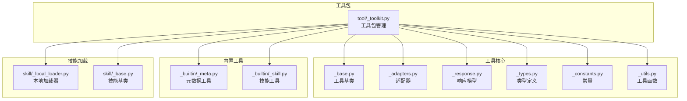
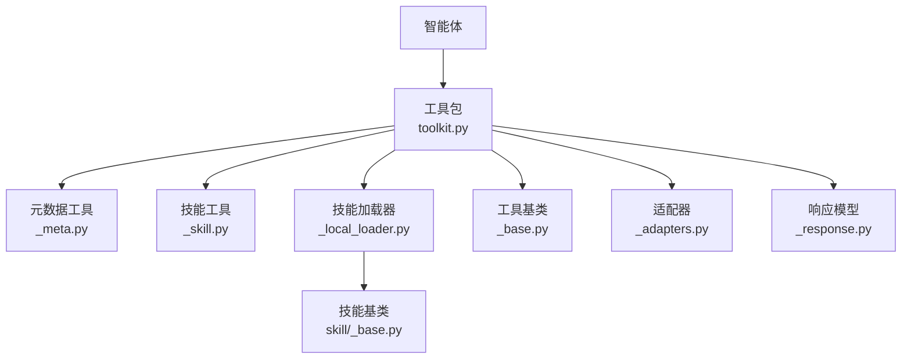
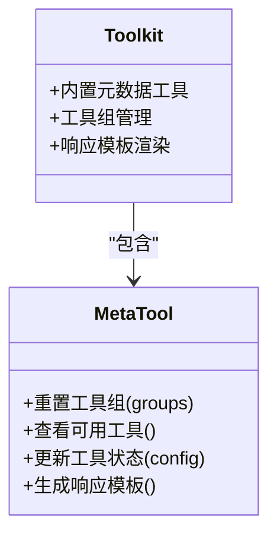
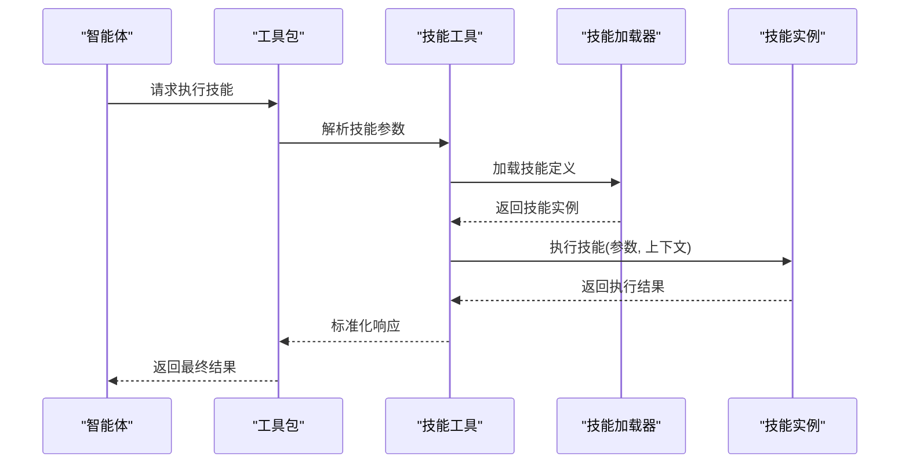
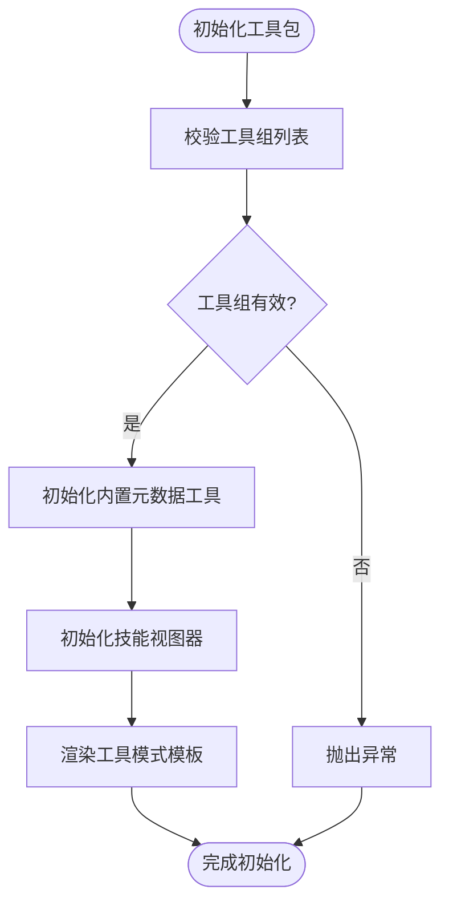
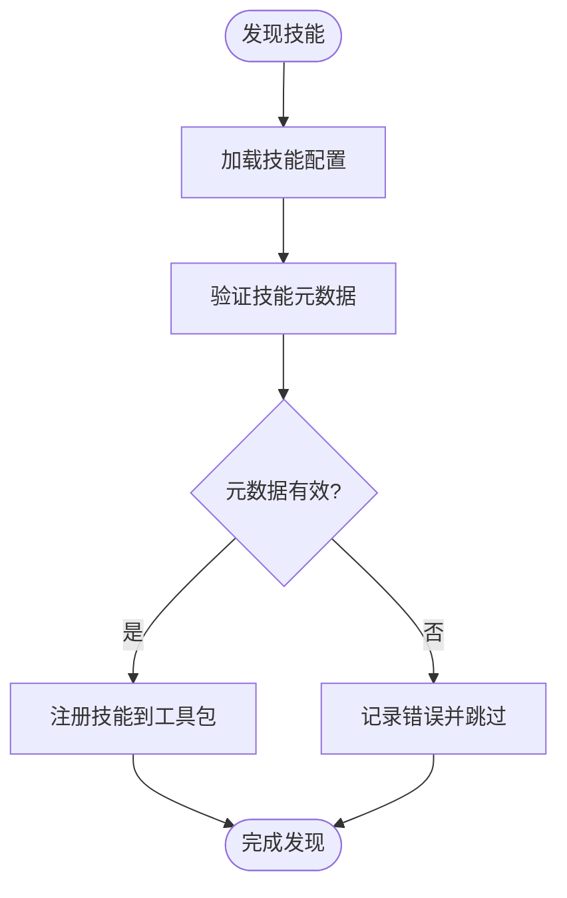
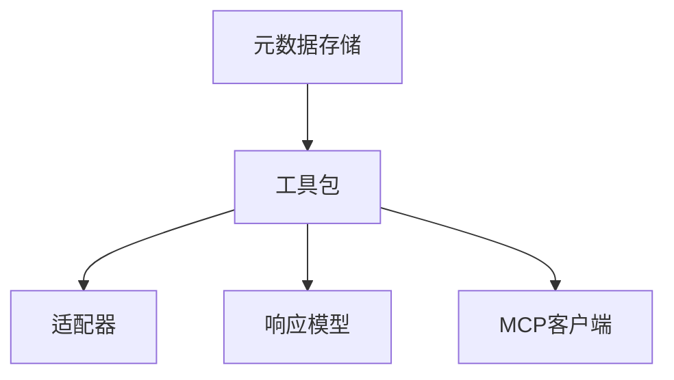
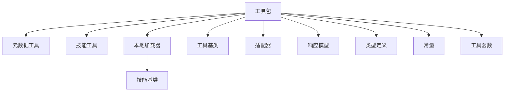

# 技能与元数据工具

<cite>
**本文档引用的文件**
- [toolkit.py](file://src/agentscope/tool/_toolkit.py)
- [_meta.py](file://src/agentscope/tool/_builtin/_meta.py)
- [_skill.py](file://src/agentscope/tool/_builtin/_skill.py)
- [_base.py](file://src/agentscope/tool/_base.py)
- [_adapters.py](file://src/agentscope/tool/_adapters.py)
- [_response.py](file://src/agentscope/tool/_response.py)
- [_types.py](file://src/agentscope/tool/_types.py)
- [_constants.py](file://src/agentscope/tool/_constants.py)
- [_utils.py](file://src/agentscope/tool/_utils.py)
- [_local_loader.py](file://src/agentscope/skill/_local_loader.py)
- [_base.py](file://src/agentscope/skill/_base.py)
- [README.md](file://README.md)
</cite>

## 目录
1. [简介](#简介)
2. [项目结构](#项目结构)
3. [核心组件](#核心组件)
4. [架构概览](#架构概览)
5. [详细组件分析](#详细组件分析)
6. [依赖关系分析](#依赖关系分析)
7. [性能考虑](#性能考虑)
8. [故障排除指南](#故障排除指南)
9. [结论](#结论)
10. [附录](#附录)

## 简介
本文件面向AgentScope的技能与元数据工具，系统性阐述以下能力：
- 技能工具（Skill）：如何加载、执行智能体技能，参数传递与结果处理，以及技能发现机制
- 元数据工具（Meta）：如何管理工具元数据、状态信息与配置选项，支持工具组管理与动态配置
- 工具链集成：如何在智能体中注册、验证参数并进行错误处理，以及工具与MCP客户端的协作方式

本文件以代码级分析为基础，结合可视化图示，帮助读者快速理解并正确使用这些工具。

## 项目结构
AgentScope的技能与元数据工具主要分布在以下模块：
- 工具核心与内置工具：src/agentscope/tool/
- 技能加载器：src/agentscope/skill/
- 工具包（Toolkit）：封装工具组、元数据工具与技能视图器，提供统一的工具管理入口

**图表来源**
- [toolkit.py:137-170](file://src/agentscope/tool/_toolkit.py#L137-L170)
- [_meta.py](file://src/agentscope/tool/_builtin/_meta.py)
- [_skill.py](file://src/agentscope/tool/_builtin/_skill.py)
- [_base.py](file://src/agentscope/tool/_base.py)
- [_adapters.py](file://src/agentscope/tool/_adapters.py)
- [_response.py](file://src/agentscope/tool/_response.py)
- [_types.py](file://src/agentscope/tool/_types.py)
- [_constants.py](file://src/agentscope/tool/_constants.py)
- [_utils.py](file://src/agentscope/tool/_utils.py)
- [_local_loader.py](file://src/agentscope/skill/_local_loader.py)
- [_base.py](file://src/agentscope/skill/_base.py)

**章节来源**
- [toolkit.py:137-170](file://src/agentscope/tool/_toolkit.py#L137-L170)
- [_meta.py](file://src/agentscope/tool/_builtin/_meta.py)
- [_skill.py](file://src/agentscope/tool/_builtin/_skill.py)
- [_base.py](file://src/agentscope/tool/_base.py)
- [_adapters.py](file://src/agentscope/tool/_adapters.py)
- [_response.py](file://src/agentscope/tool/_response.py)
- [_types.py](file://src/agentscope/tool/_types.py)
- [_constants.py](file://src/agentscope/tool/_constants.py)
- [_utils.py](file://src/agentscope/tool/_utils.py)
- [_local_loader.py](file://src/agentscope/skill/_local_loader.py)
- [_base.py](file://src/agentscope/skill/_base.py)

## 核心组件
本节聚焦于技能工具与元数据工具的关键实现，涵盖职责、参数与返回值、错误处理策略等。

- 工具基类与接口
  - 工具基类定义了统一的工具接口，包括输入模式、输出模式、工具名称与描述等元信息，以及异步执行方法
  - 通过工具类型枚举与响应模型，确保工具调用的一致性与可追踪性

- 元数据工具（Meta）
  - 提供重置工具组、查看可用工具、更新工具状态等功能
  - 支持基于模板的响应生成，便于与智能体对话流程集成
  - 与工具包中的内置元数据工具配合，实现动态工具组管理

- 技能工具（Skill）
  - 负责从本地或远程加载技能，并将其注册到工具包中
  - 支持技能参数校验、执行上下文注入与结果格式化
  - 与技能加载器协作，实现技能发现与动态注册

- 工具包（Toolkit）
  - 统一管理工具组、内置元数据工具与技能视图器
  - 提供工具模式模板渲染、可用工具过滤与工具模式生成
  - 支持MCP客户端的状态管理与连接校验

**章节来源**
- [_base.py](file://src/agentscope/tool/_base.py)
- [_meta.py](file://src/agentscope/tool/_builtin/_meta.py)
- [_skill.py](file://src/agentscope/tool/_builtin/_skill.py)
- [_local_loader.py](file://src/agentscope/skill/_local_loader.py)
- [_base.py](file://src/agentscope/skill/_base.py)
- [toolkit.py:137-170](file://src/agentscope/tool/_toolkit.py#L137-L170)

## 架构概览
下图展示了技能与元数据工具在AgentScope中的整体架构与交互关系：

**图表来源**
- [toolkit.py:137-170](file://src/agentscope/tool/_toolkit.py#L137-L170)
- [_meta.py](file://src/agentscope/tool/_builtin/_meta.py)
- [_skill.py](file://src/agentscope/tool/_builtin/_skill.py)
- [_local_loader.py](file://src/agentscope/skill/_local_loader.py)
- [_base.py](file://src/agentscope/skill/_base.py)
- [_base.py](file://src/agentscope/tool/_base.py)
- [_adapters.py](file://src/agentscope/tool/_adapters.py)
- [_response.py](file://src/agentscope/tool/_response.py)

## 详细组件分析

### 元数据工具（Meta）分析
元数据工具负责管理工具元数据、状态信息与配置选项，支持工具组的动态管理与工具状态的查询与更新。

- 主要职责
  - 重置工具组：清空当前工具组并恢复默认配置
  - 查看可用工具：列出当前激活的工具集合
  - 更新工具状态：根据配置更新工具的启用/禁用状态
  - 响应模板：基于模板生成标准化的工具调用响应

- 关键参数与行为
  - 工具组列表：用于标识当前激活的工具组
  - 响应模板：控制元数据工具的输出格式
  - 内置元数据工具：作为工具包的一部分，自动注册并参与工具模式生成

- 错误处理
  - 当工具组重复或状态不一致时，抛出明确的异常信息
  - 对无效的工具组名称或状态值进行校验与拒绝

**图表来源**
- [_meta.py](file://src/agentscope/tool/_builtin/_meta.py)
- [toolkit.py:137-170](file://src/agentscope/tool/_toolkit.py#L137-L170)

**章节来源**
- [_meta.py](file://src/agentscope/tool/_builtin/_meta.py)
- [toolkit.py:137-170](file://src/agentscope/tool/_toolkit.py#L137-L170)

### 技能工具（Skill）分析
技能工具负责加载与执行智能体技能，支持参数传递、结果处理与错误处理。

- 主要职责
  - 加载技能：从本地或远程源加载技能定义
  - 执行技能：将参数传递给技能并获取执行结果
  - 参数校验：对输入参数进行类型与范围校验
  - 结果处理：将原始结果转换为标准响应格式

- 关键参数与行为
  - 技能名称：唯一标识技能
  - 输入参数：字典形式的参数集合
  - 执行上下文：环境变量、认证信息等
  - 输出格式：统一的响应模型，便于后续处理

- 错误处理
  - 抛出明确的异常类型，包含错误原因与建议
  - 对缺失参数、类型不匹配、执行失败等情况进行分类处理

**图表来源**
- [_skill.py](file://src/agentscope/tool/_builtin/_skill.py)
- [_local_loader.py](file://src/agentscope/skill/_local_loader.py)
- [_base.py](file://src/agentscope/skill/_base.py)
- [toolkit.py:137-170](file://src/agentscope/tool/_toolkit.py#L137-L170)

**章节来源**
- [_skill.py](file://src/agentscope/tool/_builtin/_skill.py)
- [_local_loader.py](file://src/agentscope/skill/_local_loader.py)
- [_base.py](file://src/agentscope/skill/_base.py)
- [toolkit.py:137-170](file://src/agentscope/tool/_toolkit.py#L137-L170)

### 工具包（Toolkit）分析
工具包是技能与元数据工具的统一管理入口，负责工具组的组织、内置工具的注册与工具模式的生成。

- 主要职责
  - 工具组管理：维护工具组列表，确保无重复且状态有效
  - 内置工具注册：注册元数据工具与技能视图器
  - 工具模式生成：基于模板渲染工具模式，供智能体使用
  - 可用工具过滤：根据激活的工具组筛选可用工具

- 关键参数与行为
  - 工具组列表：当前激活的工具组名称集合
  - 响应模板：控制内置元数据工具的输出格式
  - 技能指令模板：控制技能视图器的提示词生成
  - MCP客户端：管理状态式MCP客户端的连接状态

- 错误处理
  - 对重复工具组名称进行校验并抛出异常
  - 对状态式MCP客户端的连接状态进行校验

**图表来源**
- [toolkit.py:137-170](file://src/agentscope/tool/_toolkit.py#L137-L170)

**章节来源**
- [toolkit.py:137-170](file://src/agentscope/tool/_toolkit.py#L137-L170)

### 技能发现机制
技能发现机制允许智能体动态发现并注册可用技能，提升系统的灵活性与扩展性。

- 发现流程
  - 读取技能目录或配置文件，收集技能定义
  - 验证技能元数据的完整性与合法性
  - 将技能注册到工具包，使其成为可用工具

- 关键点
  - 技能名称唯一性：避免重复注册
  - 参数与返回值的标准化：确保与工具基类兼容
  - 错误处理：对无效技能定义进行过滤与记录

**图表来源**
- [_local_loader.py](file://src/agentscope/skill/_local_loader.py)
- [_base.py](file://src/agentscope/skill/_base.py)
- [toolkit.py:137-170](file://src/agentscope/tool/_toolkit.py#L137-L170)

**章节来源**
- [_local_loader.py](file://src/agentscope/skill/_local_loader.py)
- [_base.py](file://src/agentscope/skill/_base.py)
- [toolkit.py:137-170](file://src/agentscope/tool/_toolkit.py#L137-L170)

### 元数据存储与工具链集成
元数据存储与工具链集成确保工具的状态、配置与执行历史能够被持久化与追踪。

- 元数据存储
  - 工具组状态：记录当前激活的工具组及其配置
  - 工具执行日志：记录工具调用的时间、参数与结果
  - 响应模板：存储元数据工具的输出格式

- 工具链集成
  - 与适配器协作：将工具调用转换为标准格式
  - 与响应模型协作：统一工具输出的结构
  - 与MCP客户端协作：管理状态式客户端的连接与会话

**图表来源**
- [toolkit.py:137-170](file://src/agentscope/tool/_toolkit.py#L137-L170)
- [_adapters.py](file://src/agentscope/tool/_adapters.py)
- [_response.py](file://src/agentscope/tool/_response.py)
- [_constants.py](file://src/agentscope/tool/_constants.py)

**章节来源**
- [toolkit.py:137-170](file://src/agentscope/tool/_toolkit.py#L137-L170)
- [_adapters.py](file://src/agentscope/tool/_adapters.py)
- [_response.py](file://src/agentscope/tool/_response.py)
- [_constants.py](file://src/agentscope/tool/_constants.py)

## 依赖关系分析
技能与元数据工具之间的依赖关系如下：

**图表来源**
- [toolkit.py:137-170](file://src/agentscope/tool/_toolkit.py#L137-L170)
- [_meta.py](file://src/agentscope/tool/_builtin/_meta.py)
- [_skill.py](file://src/agentscope/tool/_builtin/_skill.py)
- [_local_loader.py](file://src/agentscope/skill/_local_loader.py)
- [_base.py](file://src/agentscope/skill/_base.py)
- [_base.py](file://src/agentscope/tool/_base.py)
- [_adapters.py](file://src/agentscope/tool/_adapters.py)
- [_response.py](file://src/agentscope/tool/_response.py)
- [_types.py](file://src/agentscope/tool/_types.py)
- [_constants.py](file://src/agentscope/tool/_constants.py)
- [_utils.py](file://src/agentscope/tool/_utils.py)

**章节来源**
- [toolkit.py:137-170](file://src/agentscope/tool/_toolkit.py#L137-L170)
- [_meta.py](file://src/agentscope/tool/_builtin/_meta.py)
- [_skill.py](file://src/agentscope/tool/_builtin/_skill.py)
- [_local_loader.py](file://src/agentscope/skill/_local_loader.py)
- [_base.py](file://src/agentscope/skill/_base.py)
- [_base.py](file://src/agentscope/tool/_base.py)
- [_adapters.py](file://src/agentscope/tool/_adapters.py)
- [_response.py](file://src/agentscope/tool/_response.py)
- [_types.py](file://src/agentscope/tool/_types.py)
- [_constants.py](file://src/agentscope/tool/_constants.py)
- [_utils.py](file://src/agentscope/tool/_utils.py)

## 性能考虑
- 工具组管理
  - 在初始化阶段对工具组进行去重与有效性校验，避免运行时重复检查
  - 使用模板渲染工具模式，减少重复计算

- 技能加载与执行
  - 缓存已加载的技能定义，避免重复加载
  - 异步执行技能，提高并发性能

- 元数据存储
  - 将常用配置与状态缓存在内存中，减少磁盘访问
  - 定期清理过期的执行日志，控制存储空间

## 故障排除指南
- 工具组相关问题
  - 重复工具组名称：检查工具组列表，确保名称唯一
  - 状态式MCP客户端未连接：确认客户端连接状态后再初始化工具包

- 技能加载与执行问题
  - 技能定义无效：检查技能元数据的完整性与合法性
  - 参数类型不匹配：对输入参数进行类型校验与转换

- 元数据工具问题
  - 响应模板格式错误：检查模板语法与变量替换
  - 工具状态更新失败：确认工具状态值的有效性

**章节来源**
- [toolkit.py:137-170](file://src/agentscope/tool/_toolkit.py#L137-L170)
- [_meta.py](file://src/agentscope/tool/_builtin/_meta.py)
- [_skill.py](file://src/agentscope/tool/_builtin/_skill.py)
- [_local_loader.py](file://src/agentscope/skill/_local_loader.py)

## 结论
AgentScope的技能与元数据工具提供了完整的工具管理与技能执行能力。通过工具包的统一管理、元数据工具的动态配置与技能工具的灵活加载，系统实现了高扩展性与易用性。建议在实际使用中遵循参数校验与错误处理的最佳实践，确保工具链的稳定性与可靠性。

## 附录
- 快速开始
  - 初始化工具包并注册工具组
  - 使用元数据工具管理工具状态
  - 通过技能工具加载并执行技能
- 最佳实践
  - 保持技能名称唯一性
  - 对输入参数进行严格的类型与范围校验
  - 使用模板渲染工具模式，确保输出一致性