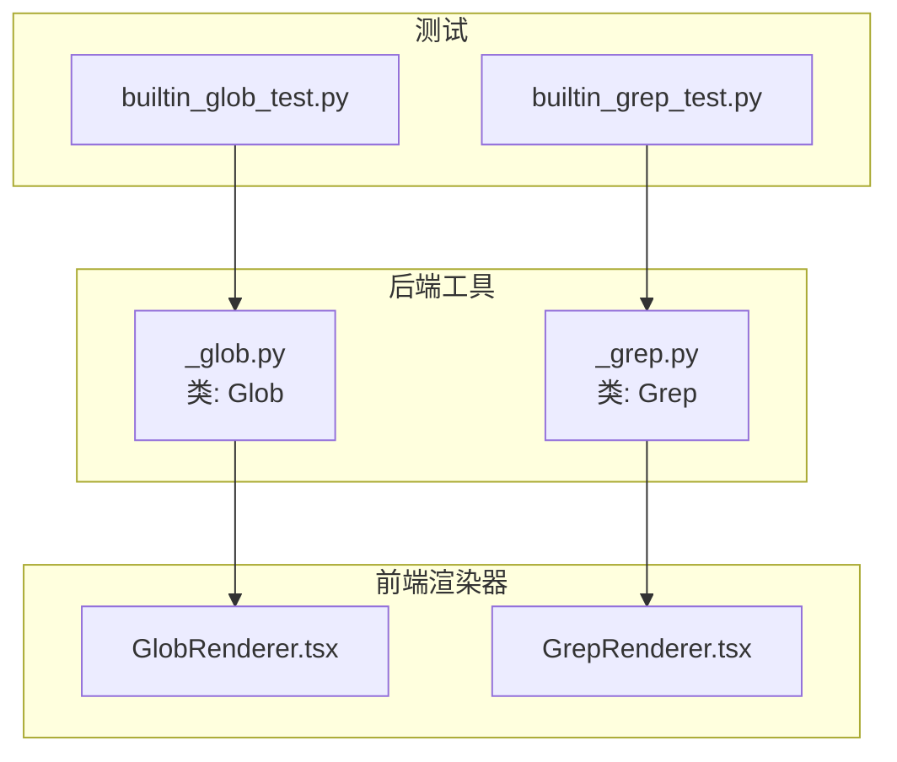
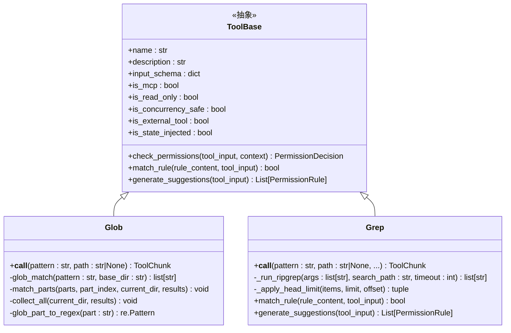
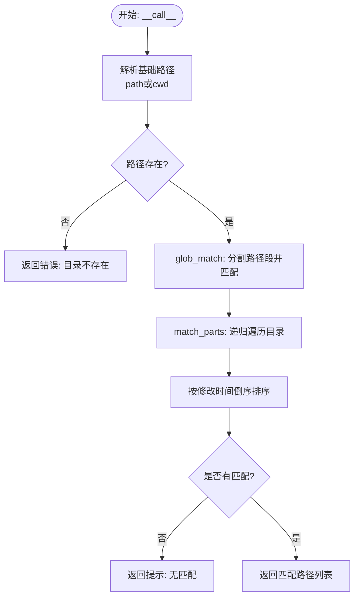
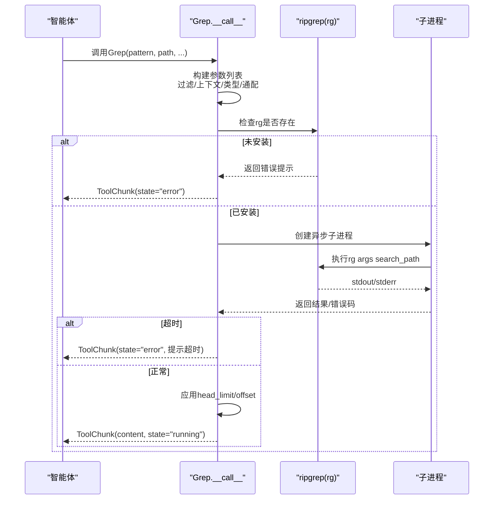
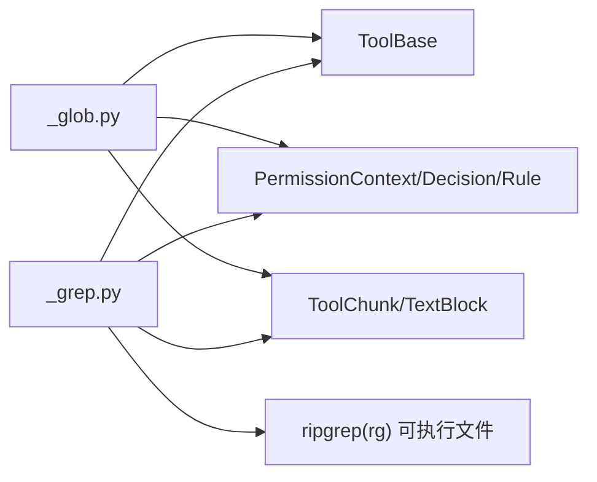

# 搜索工具

<cite>
**本文引用的文件**
- [_glob.py](file://src/agentscope/tool/_builtin/_glob.py)
- [_grep.py](file://src/agentscope/tool/_builtin/_grep.py)
- [GlobRenderer.tsx](file://examples/web_ui/frontend/src/components/chat/tool-renderers/GlobRenderer.tsx)
- [GrepRenderer.tsx](file://examples/web_ui/frontend/src/components/chat/tool-renderers/GrepRenderer.tsx)
- [builtin_glob_test.py](file://tests/builtin_glob_test.py)
- [builtin_grep_test.py](file://tests/builtin_grep_test.py)
</cite>

## 目录
1. [简介](#简介)
2. [项目结构](#项目结构)
3. [核心组件](#核心组件)
4. [架构总览](#架构总览)
5. [详细组件分析](#详细组件分析)
6. [依赖关系分析](#依赖关系分析)
7. [性能考量](#性能考量)
8. [故障排查指南](#故障排查指南)
9. [结论](#结论)
10. [附录](#附录)

## 简介
本文件面向AgentScope中的搜索工具，系统性阐述Glob与Grep两大工具的功能、参数与使用方法，覆盖：
- Glob：文件路径模式匹配、递归搜索（双星号）、文件过滤与结果排序
- Grep：基于ripgrep的正则表达式搜索、大小写敏感控制、上下文行匹配、文件类型与通配过滤、结果分页与限制

文档同时提供在智能体中使用这些工具进行文件查找与内容搜索的实践建议，包括复杂模式匹配、性能优化技巧与结果处理方法，并解释搜索范围控制、文件类型过滤与搜索结果排序机制。

## 项目结构
搜索工具位于后端Python模块与前端渲染器中，测试用例验证其行为与边界条件。

**图表来源**
- [_glob.py:1-317](file://src/agentscope/tool/_builtin/_glob.py#L1-L317)
- [_grep.py:1-465](file://src/agentscope/tool/_builtin/_grep.py#L1-L465)
- [GlobRenderer.tsx:1-31](file://examples/web_ui/frontend/src/components/chat/tool-renderers/GlobRenderer.tsx#L1-L31)
- [GrepRenderer.tsx:1-31](file://examples/web_ui/frontend/src/components/chat/tool-renderers/GrepRenderer.tsx#L1-L31)
- [builtin_glob_test.py:1-208](file://tests/builtin_glob_test.py#L1-L208)
- [builtin_grep_test.py:1-254](file://tests/builtin_grep_test.py#L1-L254)

**章节来源**
- [_glob.py:1-317](file://src/agentscope/tool/_builtin/_glob.py#L1-L317)
- [_grep.py:1-465](file://src/agentscope/tool/_builtin/_grep.py#L1-L465)
- [GlobRenderer.tsx:1-31](file://examples/web_ui/frontend/src/components/chat/tool-renderers/GlobRenderer.tsx#L1-L31)
- [GrepRenderer.tsx:1-31](file://examples/web_ui/frontend/src/components/chat/tool-renderers/GrepRenderer.tsx#L1-L31)
- [builtin_glob_test.py:1-208](file://tests/builtin_glob_test.py#L1-L208)
- [builtin_grep_test.py:1-254](file://tests/builtin_grep_test.py#L1-L254)

## 核心组件
- Glob（文件路径模式匹配）
  - 支持通配符：单字符“?”、多字符“*”、方括号字符集等
  - 支持递归匹配：双星号“**”跨目录
  - 结果按修改时间降序排列
  - 权限策略：只读、规则匹配基于“路径或模式”
- Grep（内容搜索）
  - 基于ripgrep，支持完整正则语法
  - 输出模式：仅文件列表、计数、匹配行（含上下文）
  - 大小写敏感控制：i 或 case_insensitive
  - 上下文行：-A/-B/-C 或 context
  - 文件过滤：type（语言类型）与glob（通配）
  - 结果限制：head_limit与offset，带默认上限
  - 安全与范围：排除版本控制目录、限制行长、超时保护

**章节来源**
- [_glob.py:19-317](file://src/agentscope/tool/_builtin/_glob.py#L19-L317)
- [_grep.py:42-465](file://src/agentscope/tool/_builtin/_grep.py#L42-L465)

## 架构总览
Glob与Grep均继承自统一的工具基类，遵循相同的权限与响应协议；Glob侧重路径匹配与排序，Grep侧重内容检索与ripgrep集成。

**图表来源**
- [_glob.py:19-317](file://src/agentscope/tool/_builtin/_glob.py#L19-L317)
- [_grep.py:42-465](file://src/agentscope/tool/_builtin/_grep.py#L42-L465)

## 详细组件分析

### Glob 组件分析
- 功能要点
  - 输入参数：pattern（必需）、path（可选，默认当前工作目录）
  - 路径匹配算法：将pattern按“/”拆分为若干段，逐段匹配目录名或文件名；遇到“**”时，先在当前目录继续匹配，再递归进入子目录
  - 通配符转换：将glob片段转为正则，支持“*”、“?”及特殊字符转义
  - 结果处理：收集所有匹配文件路径，按修改时间倒序排序
  - 错误处理：目录不存在返回错误状态；无匹配返回提示信息
- 权限与规则
  - 只读工具，权限决策直接透传
  - 规则匹配优先匹配“path”，其次匹配“pattern”
  - 自动生成建议规则：基于绝对路径的“目录/**”模式
- 使用场景
  - 快速定位某类文件（如“**/*.py”）
  - 在指定范围内递归查找并排序输出

**图表来源**
- [_glob.py:266-317](file://src/agentscope/tool/_builtin/_glob.py#L266-L317)

**章节来源**
- [_glob.py:19-317](file://src/agentscope/tool/_builtin/_glob.py#L19-L317)
- [builtin_glob_test.py:1-208](file://tests/builtin_glob_test.py#L1-L208)

### Grep 组件分析
- 功能要点
  - 输入参数：pattern（必需）、path（可选）、output_mode（content/files_with_matches/count）、glob、type、大小写、上下文、多行、head_limit、offset、行号显示等
  - ripgrep集成：自动检测rg可执行文件，构建参数列表，执行子进程并捕获输出
  - 过滤与范围：排除常见版本控制目录、限制行长、支持type与glob过滤
  - 输出控制：根据output_mode选择-l/-c或直接输出行；支持上下文行-A/-B/-C与-n行号
  - 分页与限制：通过head_limit与offset实现分页；默认上限常量
  - 错误处理：超时抛出自定义异常；ripgrep非零退出码抛出运行时错误；无匹配返回提示
- 权限与规则
  - 只读工具，权限决策透传
  - 规则匹配基于“path”（默认当前工作目录）
  - 自动生成建议规则：基于绝对路径的“目录/**”模式
- 使用场景
  - 在代码库中按正则查找函数签名、日志模式、配置项等
  - 限定文件类型或通配范围，结合上下文行快速定位问题

**图表来源**
- [_grep.py:300-465](file://src/agentscope/tool/_builtin/_grep.py#L300-L465)

**章节来源**
- [_grep.py:42-465](file://src/agentscope/tool/_builtin/_grep.py#L42-L465)
- [builtin_grep_test.py:1-254](file://tests/builtin_grep_test.py#L1-L254)

### 前端渲染器（工具调用展示）
- GlobRenderer：从工具调用输入中提取pattern，用于聊天界面展示
- GrepRenderer：同上，用于展示Grep调用的pattern或输入

**章节来源**
- [GlobRenderer.tsx:1-31](file://examples/web_ui/frontend/src/components/chat/tool-renderers/GlobRenderer.tsx#L1-L31)
- [GrepRenderer.tsx:1-31](file://examples/web_ui/frontend/src/components/chat/tool-renderers/GrepRenderer.tsx#L1-L31)

## 依赖关系分析
- Glob
  - 依赖标准库：os、fnmatch、re
  - 依赖框架层：ToolBase、PermissionContext/Decision/Rule、ToolChunk、TextBlock
- Grep
  - 依赖标准库：os、shutil、fnmatch、asyncio
  - 依赖外部工具：ripgrep（rg），通过shutil.which探测
  - 依赖框架层：ToolBase、PermissionContext/Decision/Rule、ToolChunk、TextBlock
- 前端渲染器
  - 依赖工具调用数据结构，用于在聊天界面聚合与展示工具调用

**图表来源**
- [_glob.py:1-17](file://src/agentscope/tool/_builtin/_glob.py#L1-L17)
- [_grep.py:1-18](file://src/agentscope/tool/_builtin/_grep.py#L1-L18)

**章节来源**
- [_glob.py:1-17](file://src/agentscope/tool/_builtin/_glob.py#L1-L17)
- [_grep.py:1-18](file://src/agentscope/tool/_builtin/_grep.py#L1-L18)

## 性能考量
- Glob
  - 递归遍历采用os.scandir与os.walk，对不可访问目录静默跳过，避免阻塞
  - 结果按修改时间排序，可能带来额外开销；若不需要排序，可在上层逻辑中规避
- Grep
  - 依赖ripgrep，具备高性能正则匹配能力
  - 默认限制行长与排除版本控制目录，减少无关内容扫描
  - head_limit与offset实现分页，避免一次性输出过多内容
  - 超时保护：默认超时时间可调，超时返回部分结果提示
- 实践建议
  - 优先使用更精确的pattern与glob/type缩小搜索范围
  - 对大仓库搜索时启用type/glob过滤，必要时设置head_limit
  - 将上下文行设置为合理值，避免过多行导致输出膨胀

[本节为通用性能指导，不直接分析具体文件]

## 故障排查指南
- Glob
  - 目录不存在：返回错误状态
  - 无匹配：返回提示信息
  - 权限不足：遍历过程中静默跳过不可读目录
- Grep
  - rg未安装：返回安装指引
  - 正则无效：ripgrep返回解析错误，工具捕获并上报
  - 超时：抛出自定义超时异常，包含部分结果提示
  - 无匹配：返回提示信息
- 测试用例参考
  - Glob：路径存在/不存在、简单与递归模式、规则匹配、建议规则生成
  - Grep：简单搜索、大小写不敏感、类型过滤、通配过滤、无匹配、无效正则、规则匹配、建议规则生成

**章节来源**
- [_glob.py:283-317](file://src/agentscope/tool/_builtin/_glob.py#L283-L317)
- [_grep.py:338-465](file://src/agentscope/tool/_builtin/_grep.py#L338-L465)
- [builtin_glob_test.py:1-208](file://tests/builtin_glob_test.py#L1-L208)
- [builtin_grep_test.py:1-254](file://tests/builtin_grep_test.py#L1-L254)

## 结论
- Glob专注于路径模式匹配与排序，适合快速定位文件集合
- Grep基于ripgrep提供强大的内容搜索能力，支持灵活的过滤、上下文与分页
- 两者均遵循只读与权限透传设计，便于在受控环境中安全使用
- 建议在实际应用中结合type/glob与head_limit等参数，提升搜索效率与结果可用性

[本节为总结性内容，不直接分析具体文件]

## 附录

### 参数与行为速查
- Glob
  - 关键参数：pattern（必需）、path（可选）
  - 行为：递归匹配“**”、按修改时间倒序、无匹配返回提示
- Grep
  - 关键参数：pattern（必需）、path（可选）、output_mode、glob、type、i/case_insensitive、context/-A/-B/-C、multiline、head_limit、offset、n
  - 行为：ripgrep执行、排除VCS目录、限制行长、超时保护、分页与提示

**章节来源**
- [_glob.py:35-50](file://src/agentscope/tool/_builtin/_glob.py#L35-L50)
- [_grep.py:61-152](file://src/agentscope/tool/_builtin/_grep.py#L61-L152)

### 典型使用场景与建议
- 查找所有Python源文件：Glob(pattern="**/*.py", path="src")
- 在指定目录内按正则查找函数定义：Grep(pattern=r"def\s+\w+\s*\(", path="src", type="py", output_mode="content", context=2)
- 限制结果数量并分页：Grep(pattern="TODO", path=".", head_limit=100, offset=0)
- 忽略大小写搜索配置项：Grep(pattern="port", path="config", case_insensitive=True, output_mode="content")

[本节为实践建议，不直接分析具体文件]