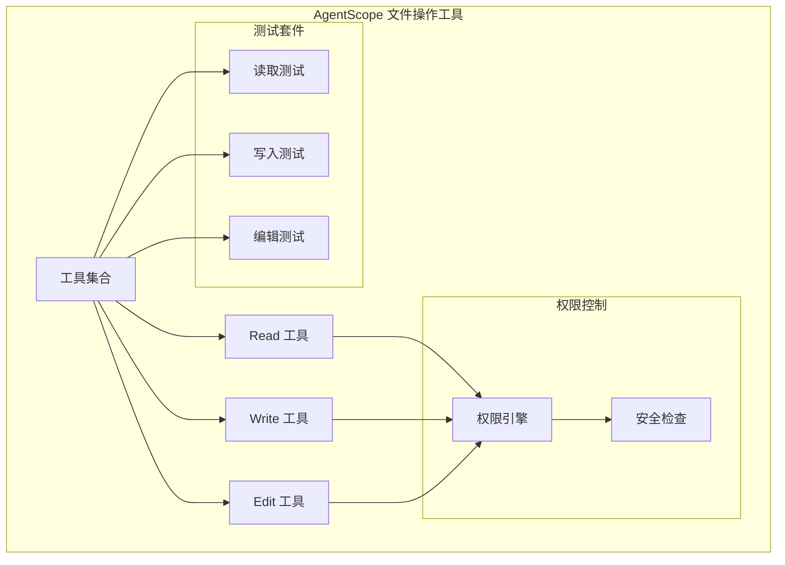
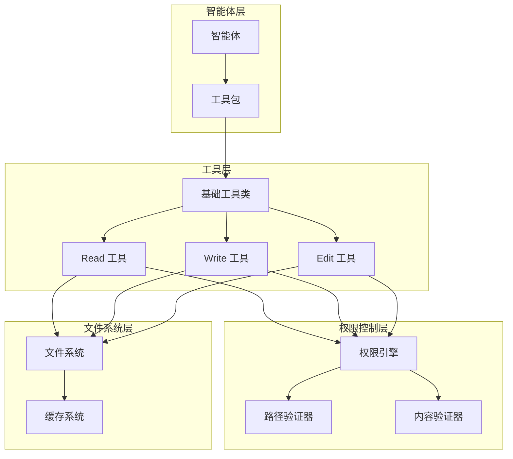
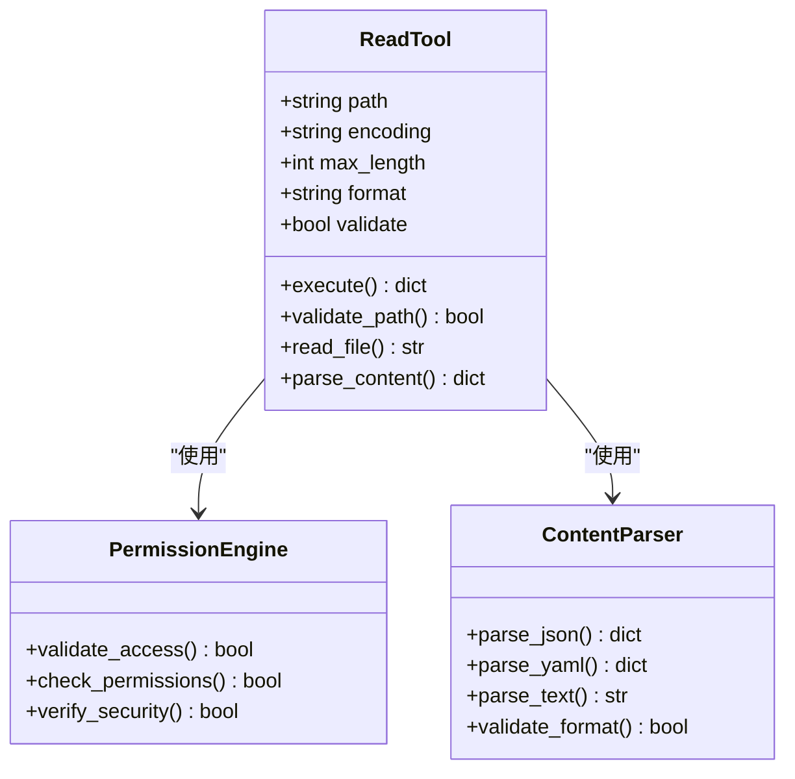
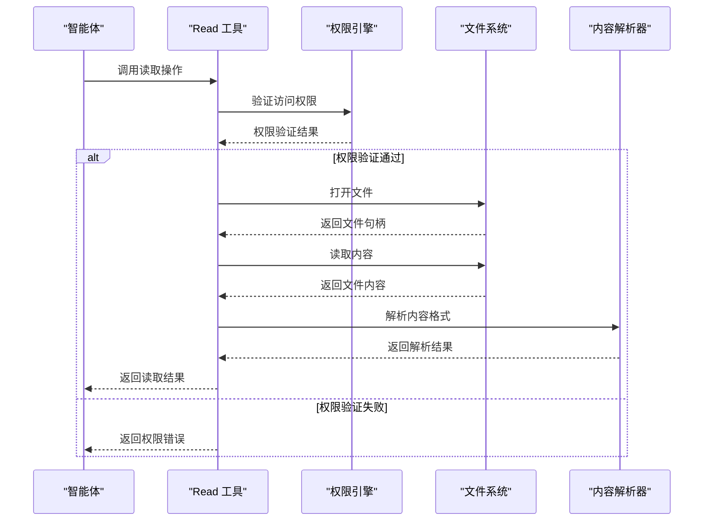
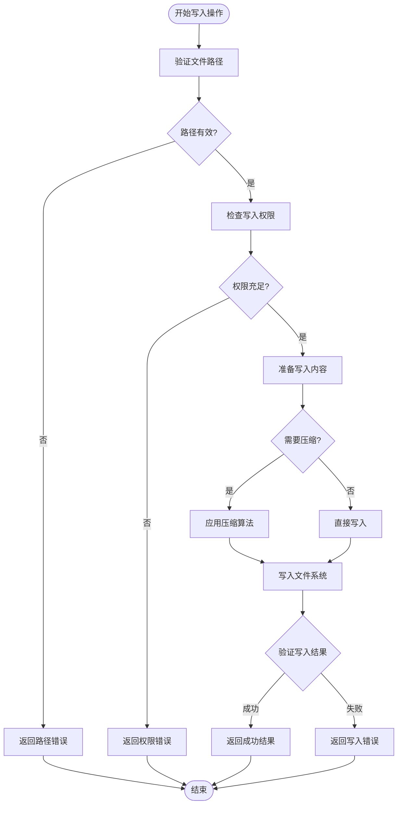
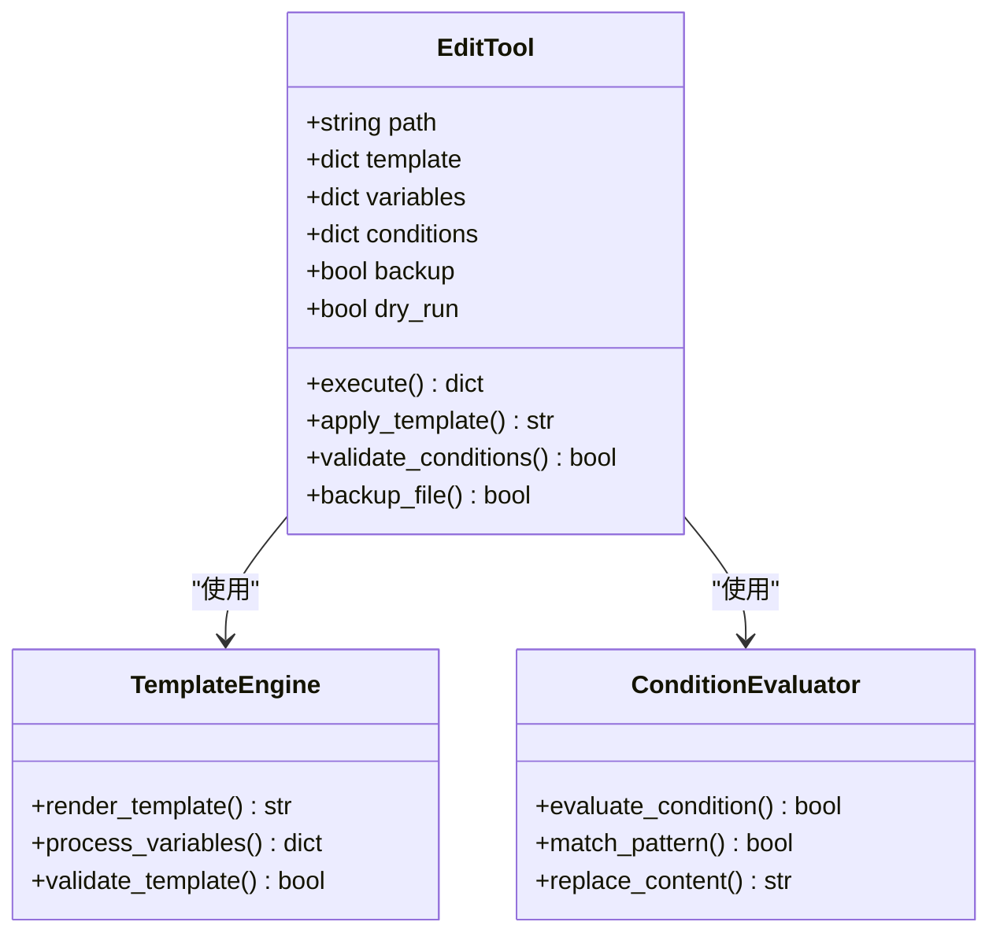
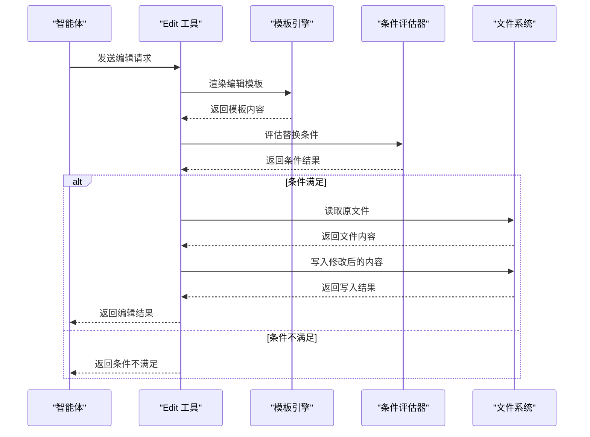
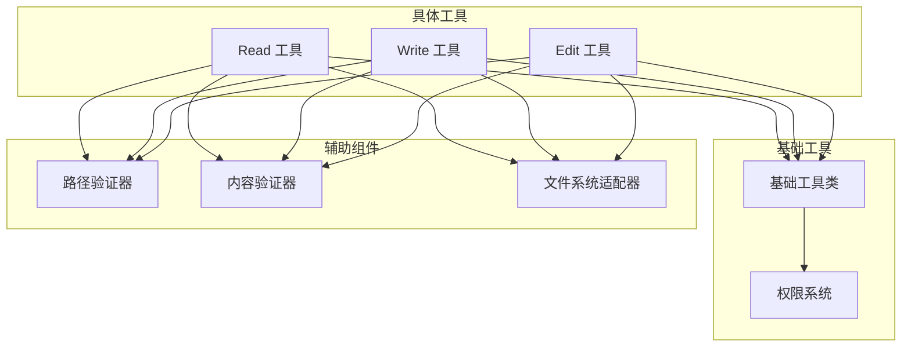
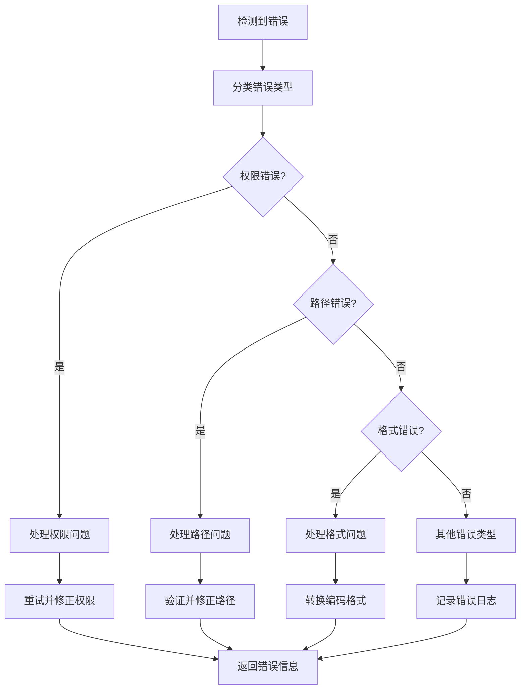

# 文件操作工具

<cite>
**本文档引用的文件**
- [_read.py](file://src/agentscope/tool/_builtin/_read.py)
- [_write.py](file://src/agentscope/tool/_builtin/_write.py)
- [_edit.py](file://src/agentscope/tool/_builtin/_edit.py)
- [builtin_read_test.py](file://tests/builtin_read_test.py)
- [builtin_write_test.py](file://tests/builtin_write_test.py)
- [builtin_edit_test.py](file://tests/builtin_edit_test.py)
</cite>

## 目录
1. [简介](#简介)
2. [项目结构](#项目结构)
3. [核心组件](#核心组件)
4. [架构概览](#架构概览)
5. [详细组件分析](#详细组件分析)
6. [依赖关系分析](#依赖关系分析)
7. [性能考虑](#性能考虑)
8. [故障排除指南](#故障排除指南)
9. [结论](#结论)

## 简介
本文件操作工具集为智能体提供基础的文件系统交互能力，包含三个核心工具：Read（读取文件）、Write（写入文件）和 Edit（编辑文件）。这些工具支持多种文件格式、编码方式和权限控制，能够满足智能体在工作空间内进行文件内容读取、新文件创建、现有文件修改以及批量文件操作的需求。

## 项目结构
文件操作工具位于AgentScope的核心模块中，采用内置工具的设计模式，与权限控制系统集成，确保安全的文件操作环境。

**图表来源**
- [src/agentscope/tool/_builtin/_read.py](file://src/agentscope/tool/_builtin/_read.py)
- [src/agentscope/tool/_builtin/_write.py](file://src/agentscope/tool/_builtin/_write.py)
- [src/agentscope/tool/_builtin/_edit.py](file://src/agentscope/tool/_builtin/_edit.py)

**章节来源**
- [src/agentscope/tool/_builtin/_read.py](file://src/agentscope/tool/_builtin/_read.py)
- [src/agentscope/tool/_builtin/_write.py](file://src/agentscope/tool/_builtin/_write.py)
- [src/agentscope/tool/_builtin/_edit.py](file://src/agentscope/tool/_builtin/_edit.py)

## 核心组件
文件操作工具集包含三个主要组件，每个组件都实现了统一的接口规范和错误处理机制：

### Read 工具
负责从指定路径读取文件内容，支持多种文件格式和编码方式，提供灵活的内容提取能力。

### Write 工具  
负责向指定路径写入文件内容，支持新文件创建和现有文件覆盖，具备完整的权限验证和安全检查。

### Edit 工具
提供基于模板的文件内容编辑功能，支持条件替换、正则表达式匹配和批量内容更新。

**章节来源**
- [src/agentscope/tool/_builtin/_read.py](file://src/agentscope/tool/_builtin/_read.py)
- [src/agentscope/tool/_builtin/_write.py](file://src/agentscope/tool/_builtin/_write.py)
- [src/agentscope/tool/_builtin/_edit.py](file://src/agentscope/tool/_builtin/_edit.py)

## 架构概览
文件操作工具采用分层架构设计，通过权限控制系统确保操作安全性，支持异步和同步两种执行模式。

**图表来源**
- [src/agentscope/tool/_builtin/_read.py](file://src/agentscope/tool/_builtin/_read.py)
- [src/agentscope/tool/_builtin/_write.py](file://src/agentscope/tool/_builtin/_write.py)
- [src/agentscope/tool/_builtin/_edit.py](file://src/agentscope/tool/_builtin/_edit.py)

## 详细组件分析

### Read 工具详细分析

#### 功能特性
- 支持多种文件格式：文本文件、JSON、YAML、CSV等
- 多种编码方式：UTF-8、GBK、ASCII等
- 内容过滤和预处理功能
- 错误处理和异常恢复机制

#### 输入参数规范
- `path`: 文件绝对或相对路径
- `encoding`: 指定文件编码方式，默认UTF-8
- `max_length`: 最大读取长度限制
- `format`: 输出格式类型
- `validate`: 是否启用内容验证

#### 输出格式
- JSON格式：包含状态码、内容和元数据
- 文本格式：原始文件内容
- 结构化格式：解析后的数据对象

**图表来源**
- [src/agentscope/tool/_builtin/_read.py](file://src/agentscope/tool/_builtin/_read.py)

#### 使用流程序列图

**图表来源**
- [src/agentscope/tool/_builtin/_read.py](file://src/agentscope/tool/_builtin/_read.py)

**章节来源**
- [src/agentscope/tool/_builtin/_read.py](file://src/agentscope/tool/_builtin/_read.py)
- [tests/builtin_read_test.py](file://tests/builtin_read_test.py)

### Write 工具详细分析

#### 功能特性
- 支持新文件创建和现有文件覆盖
- 自动文件夹创建功能
- 原子性写入操作
- 内容压缩和加密选项

#### 输入参数规范
- `path`: 目标文件路径
- `content`: 要写入的内容
- `mode`: 写入模式（创建、覆盖、追加）
- `encoding`: 文件编码方式
- `compress`: 是否启用压缩
- `encrypt`: 是否启用加密

#### 输出格式
- 成功：包含写入字节数和时间戳
- 失败：包含错误类型和详细信息

**图表来源**
- [src/agentscope/tool/_builtin/_write.py](file://src/agentscope/tool/_builtin/_write.py)

#### 使用场景示例
- 新文件创建：用于生成配置文件、日志文件等
- 现有文件覆盖：用于更新配置、修改代码等
- 追加写入：用于日志记录、数据收集等

**章节来源**
- [src/agentscope/tool/_builtin/_write.py](file://src/agentscope/tool/_builtin/_write.py)
- [tests/builtin_write_test.py](file://tests/builtin_write_test.py)

### Edit 工具详细分析

#### 功能特性
- 基于模板的批量编辑
- 正则表达式支持
- 条件替换功能
- 版本控制和备份机制

#### 输入参数规范
- `path`: 目标文件路径
- `template`: 编辑模板
- `variables`: 变量映射表
- `conditions`: 替换条件
- `backup`: 是否创建备份
- `dry_run`: 是否启用试运行模式

#### 编辑策略
- 字面量替换：直接字符串替换
- 模板替换：基于变量的模板渲染
- 正则替换：支持复杂模式匹配
- 条件替换：根据条件选择性替换

**图表来源**
- [src/agentscope/tool/_builtin/_edit.py](file://src/agentscope/tool/_builtin/_edit.py)

#### 编辑流程

**图表来源**
- [src/agentscope/tool/_builtin/_edit.py](file://src/agentscope/tool/_builtin/_edit.py)

**章节来源**
- [src/agentscope/tool/_builtin/_edit.py](file://src/agentscope/tool/_builtin/_edit.py)
- [tests/builtin_edit_test.py](file://tests/builtin_edit_test.py)

## 依赖关系分析

### 组件间依赖关系
文件操作工具之间存在明确的依赖层次，Read工具作为基础工具被其他工具复用。

**图表来源**
- [src/agentscope/tool/_builtin/_read.py](file://src/agentscope/tool/_builtin/_read.py)
- [src/agentscope/tool/_builtin/_write.py](file://src/agentscope/tool/_builtin/_write.py)
- [src/agentscope/tool/_builtin/_edit.py](file://src/agentscope/tool/_builtin/_edit.py)

### 外部依赖
- Python标准库：os、pathlib、json、yaml等
- 第三方库：numpy、pandas（可选，用于特定格式处理）
- AgentScope核心模块：权限系统、工具基类

**章节来源**
- [src/agentscope/tool/_builtin/_read.py](file://src/agentscope/tool/_builtin/_read.py)
- [src/agentscope/tool/_builtin/_write.py](file://src/agentscope/tool/_builtin/_write.py)
- [src/agentscope/tool/_builtin/_edit.py](file://src/agentscope/tool/_builtin/_edit.py)

## 性能考虑
文件操作工具在设计时充分考虑了性能优化：

### 缓存机制
- 内容缓存：避免重复读取相同文件
- 路径解析缓存：减少路径验证开销
- 权限检查缓存：降低权限验证频率

### 异步处理
- 支持异步文件操作
- 批量操作优化
- 并发安全保证

### 内存管理
- 流式读取大文件
- 分块处理超大文件
- 及时释放资源

## 故障排除指南

### 常见错误类型
1. **权限错误**：文件访问被拒绝
2. **路径错误**：无效的文件路径
3. **格式错误**：文件格式不支持
4. **编码错误**：文件编码不匹配
5. **空间不足**：磁盘空间不足

### 错误处理策略

**图表来源**
- [src/agentscope/tool/_builtin/_read.py](file://src/agentscope/tool/_builtin/_read.py)
- [src/agentscope/tool/_builtin/_write.py](file://src/agentscope/tool/_builtin/_write.py)
- [src/agentscope/tool/_builtin/_edit.py](file://src/agentscope/tool/_builtin/_edit.py)

### 调试建议
- 启用详细日志记录
- 使用dry-run模式测试编辑操作
- 验证文件权限设置
- 检查磁盘空间和存储权限

**章节来源**
- [tests/builtin_read_test.py](file://tests/builtin_read_test.py)
- [tests/builtin_write_test.py](file://tests/builtin_write_test.py)
- [tests/builtin_edit_test.py](file://tests/builtin_edit_test.py)

## 结论
AgentScope的文件操作工具集提供了完整、安全、高效的文件系统交互能力。通过统一的接口设计、完善的权限控制和灵活的配置选项，这些工具能够满足智能体在各种应用场景下的文件操作需求。工具集具有良好的扩展性和维护性，为AgentScope平台的文件处理功能奠定了坚实的基础。