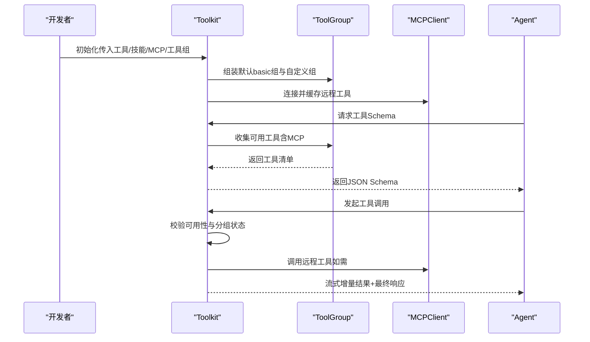
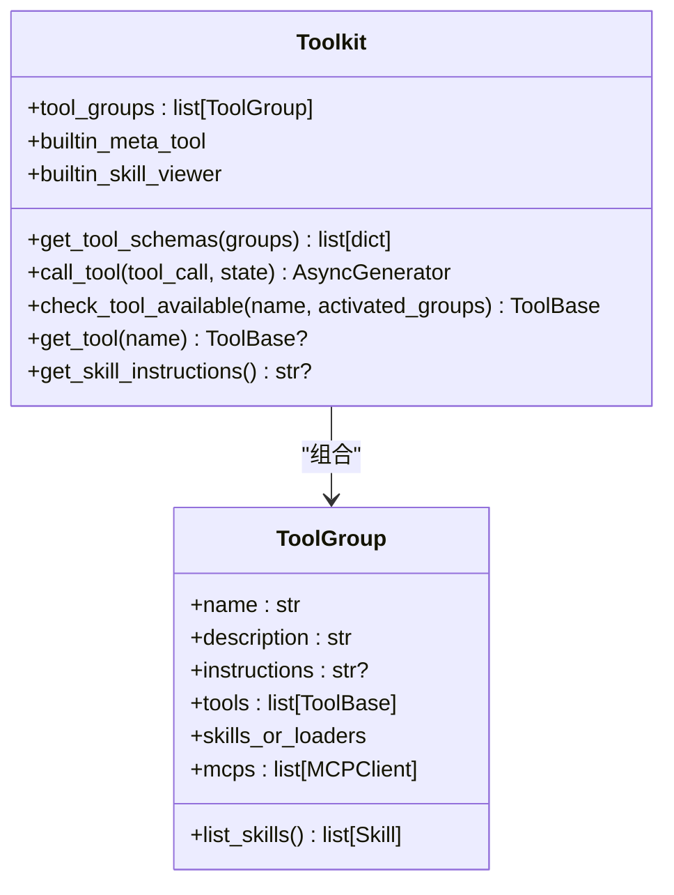
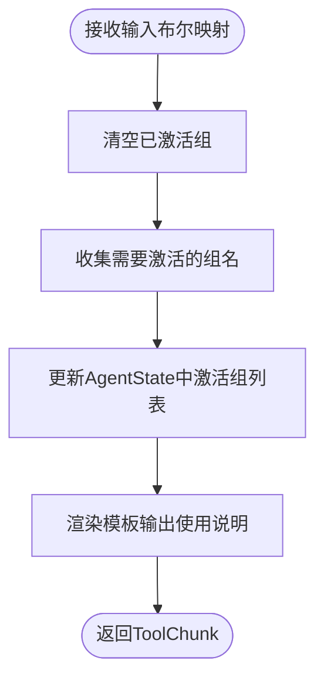
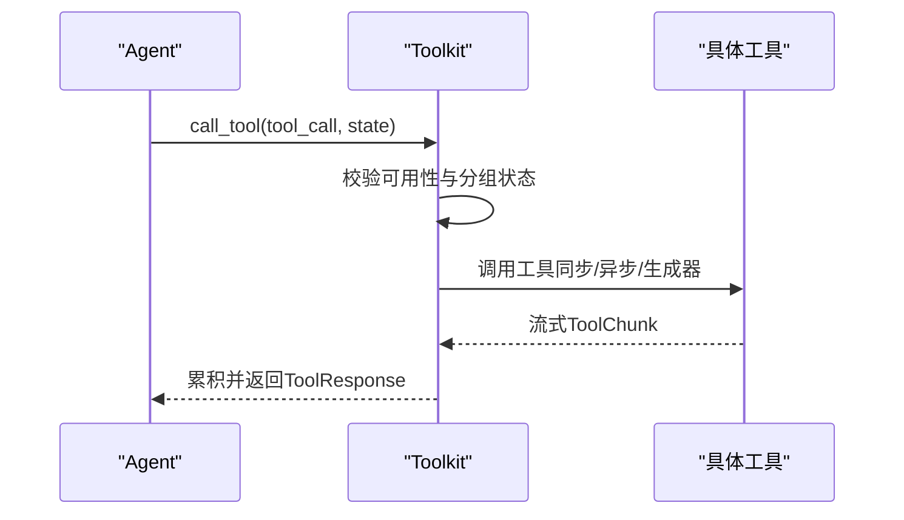
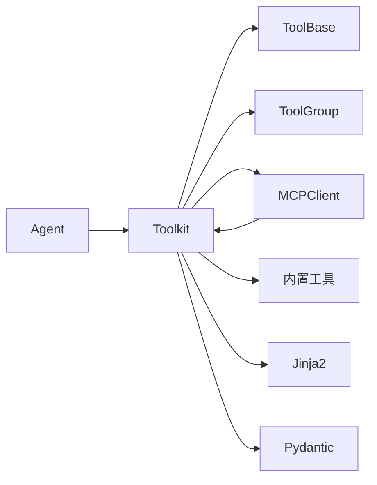

# 工具包管理

<cite>
**本文引用的文件**
- [src/agentscope/tool/_toolkit.py](file://src/agentscope/tool/_toolkit.py)
- [src/agentscope/tool/_tool_group.py](file://src/agentscope/tool/_tool_group.py)
- [src/agentscope/tool/_base.py](file://src/agentscope/tool/_base.py)
- [src/agentscope/tool/_builtin/_meta.py](file://src/agentscope/tool/_builtin/_meta.py)
- [src/agentscope/tool/__init__.py](file://src/agentscope/tool/__init__.py)
- [src/agentscope/mcp/_mcp_client.py](file://src/agentscope/mcp/_mcp_client.py)
- [src/agentscope/agent/_agent.py](file://src/agentscope/agent/_agent.py)
- [src/agentscope/agent/_utils.py](file://src/agentscope/agent/_utils.py)
- [src/agentscope/tool/_constants.py](file://src/agentscope/tool/_constants.py)
- [tests/toolkit_test.py](file://tests/toolkit_test.py)
- [tests/toolkit_task_test.py](file://tests/toolkit_task_test.py)
- [tests/toolkit_skill_test.py](file://tests/toolkit_skill_test.py)
- [scripts/model_examples/openai_chat_call.py](file://scripts/model_examples/openai_chat_call.py)
</cite>

## 目录
1. [简介](#简介)
2. [项目结构](#项目结构)
3. [核心组件](#核心组件)
4. [架构总览](#架构总览)
5. [详细组件分析](#详细组件分析)
6. [依赖分析](#依赖分析)
7. [性能考虑](#性能考虑)
8. [故障排查指南](#故障排查指南)
9. [结论](#结论)
10. [附录：使用示例与最佳实践](#附录使用示例与最佳实践)

## 简介
本文件面向AgentScope工具包管理系统，系统性阐述“工具包（Toolkit）”与“工具组（ToolGroup）”的概念、差异与协作方式；详解工具包的创建、注册、加载与卸载流程（含本地工具与远程MCP工具），以及工具组的批量调度、并发执行与结果聚合机制；并给出配置管理、版本控制与依赖处理建议，辅以可直接定位到源码的路径示例，帮助读者快速构建与扩展复杂的工具包系统。

## 项目结构
围绕工具包与工具组的关键模块分布如下：
- 工具与工具组：工具基类、工具组容器、工具包编排器
- 元工具与内置工具：元工具用于动态激活/停用工具组，内置工具提供文件读写等常用能力
- MCP客户端：连接远程工具服务，统一纳入工具包管理
- 智能体执行层：根据工具属性进行批处理与并发调度

```mermaid
graph TB
subgraph "工具与工具组"
TBase["ToolBase<br/>工具协议"]
TGroup["ToolGroup<br/>工具组容器"]
Toolkit["Toolkit<br/>工具包编排器"]
end
subgraph "内置与元工具"
Meta["ResetTools<br/>元工具"]
Builtin["内置工具集<br/>Read/Write/Bash等"]
end
subgraph "MCP"
MCP["MCPClient<br/>远程工具客户端"]
end
subgraph "智能体"
Agent["Agent<br/>批处理与并发调度"]
end
TBase --> Toolkit
TGroup --> Toolkit
Meta --> Toolkit
Builtin --> Toolkit
MCP --> Toolkit
Toolkit --> Agent
```

图表来源
- [src/agentscope/tool/_toolkit.py:66-170](file://src/agentscope/tool/_toolkit.py#L66-L170)
- [src/agentscope/tool/_tool_group.py:10-40](file://src/agentscope/tool/_tool_group.py#L10-L40)
- [src/agentscope/tool/_base.py:35-62](file://src/agentscope/tool/_base.py#L35-L62)
- [src/agentscope/tool/_builtin/_meta.py:21-47](file://src/agentscope/tool/_builtin/_meta.py#L21-L47)
- [src/agentscope/mcp/_mcp_client.py:361-400](file://src/agentscope/mcp/_mcp_client.py#L361-L400)
- [src/agentscope/agent/_agent.py:1078-1115](file://src/agentscope/agent/_agent.py#L1078-L1115)

章节来源
- [src/agentscope/tool/__init__.py:4-25](file://src/agentscope/tool/__init__.py#L4-L25)

## 核心组件
- 工具（ToolBase）
  - 定义工具协议，包含名称、描述、输入模式、并发安全标记、只读标记、外部工具标记、状态注入标记、MCP标识等
  - 提供权限检查接口与危险路径保护策略
- 工具组（ToolGroup）
  - 将一组工具、技能加载器与MCP客户端归并为逻辑单元，支持描述与使用说明
- 工具包（Toolkit）
  - 聚合工具组，动态生成可用工具清单，统一执行入口，支持元工具激活/停用、技能指令生成、工具可用性校验与查询
- 元工具（ResetTools）
  - 动态切换工具组激活状态，返回对应使用说明
- MCP客户端（MCPClient）
  - 远程工具发现与调用，缓存工具列表，按状态性创建适配器

章节来源
- [src/agentscope/tool/_base.py:35-212](file://src/agentscope/tool/_base.py#L35-L212)
- [src/agentscope/tool/_tool_group.py:10-109](file://src/agentscope/tool/_tool_group.py#L10-L109)
- [src/agentscope/tool/_toolkit.py:66-170](file://src/agentscope/tool/_toolkit.py#L66-L170)
- [src/agentscope/tool/_builtin/_meta.py:21-129](file://src/agentscope/tool/_builtin/_meta.py#L21-L129)
- [src/agentscope/mcp/_mcp_client.py:361-400](file://src/agentscope/mcp/_mcp_client.py#L361-L400)

## 架构总览
工具包管理的端到端流程如下：



图表来源
- [src/agentscope/tool/_toolkit.py:171-223](file://src/agentscope/tool/_toolkit.py#L171-L223)
- [src/agentscope/tool/_toolkit.py:225-388](file://src/agentscope/tool/_toolkit.py#L225-L388)
- [src/agentscope/mcp/_mcp_client.py:361-400](file://src/agentscope/mcp/_mcp_client.py#L361-L400)
- [src/agentscope/agent/_agent.py:1078-1115](file://src/agentscope/agent/_agent.py#L1078-L1115)

## 详细组件分析

### 工具包（Toolkit）设计与职责
- 组织与管理
  - 默认“basic”工具组与用户自定义工具组并存，禁止重复命名
  - 对状态性MCP客户端进行连接性校验
- 可用工具收集
  - 合并Python工具、MCP工具与技能视图工具，解决同名冲突并标注来源组
- 工具调用
  - 基于当前激活的工具组过滤可用工具
  - 支持同步/异步/生成器式工具调用，统一流式输出与最终响应
  - 异常分级处理：MCP错误、开发期异常、运行时异常与取消中断
- 元工具与技能
  - 注册内置元工具与技能查看器，动态生成Schema与技能说明
- 查询与校验
  - 获取工具Schema、查询工具实例、校验工具可用性



图表来源
- [src/agentscope/tool/_toolkit.py:66-170](file://src/agentscope/tool/_toolkit.py#L66-L170)
- [src/agentscope/tool/_tool_group.py:10-109](file://src/agentscope/tool/_tool_group.py#L10-L109)

章节来源
- [src/agentscope/tool/_toolkit.py:88-170](file://src/agentscope/tool/_toolkit.py#L88-L170)
- [src/agentscope/tool/_toolkit.py:171-223](file://src/agentscope/tool/_toolkit.py#L171-L223)
- [src/agentscope/tool/_toolkit.py:225-388](file://src/agentscope/tool/_toolkit.py#L225-L388)
- [src/agentscope/tool/_toolkit.py:390-454](file://src/agentscope/tool/_toolkit.py#L390-L454)
- [src/agentscope/tool/_toolkit.py:456-525](file://src/agentscope/tool/_toolkit.py#L456-L525)
- [src/agentscope/tool/_toolkit.py:527-582](file://src/agentscope/tool/_toolkit.py#L527-L582)
- [src/agentscope/tool/_toolkit.py:584-597](file://src/agentscope/tool/_toolkit.py#L584-L597)

### 工具组（ToolGroup）组织与生命周期
- 角色定位
  - 将工具、技能加载器与MCP客户端封装为可激活/停用的逻辑单元
  - “basic”组为默认激活组，其余组需通过元工具显式启用
- 技能加载
  - 接受字符串目录、Skill对象或SkillLoaderBase实例，统一转为加载器
- 工具枚举
  - 汇聚工具与MCP工具，合并技能清单

章节来源
- [src/agentscope/tool/_tool_group.py:10-109](file://src/agentscope/tool/_tool_group.py#L10-L109)

### 元工具（ResetTools）与工具组激活
- 动态Schema
  - 基于当前工具组集合生成布尔参数Schema，键名为组名
- 激活语义
  - 输入布尔值代表目标组的最终状态，未显式置位的组将被停用
- 结果渲染
  - 使用模板渲染激活组的使用说明，指导智能体正确使用工具



图表来源
- [src/agentscope/tool/_builtin/_meta.py:88-129](file://src/agentscope/tool/_builtin/_meta.py#L88-L129)

章节来源
- [src/agentscope/tool/_builtin/_meta.py:21-129](file://src/agentscope/tool/_builtin/_meta.py#L21-L129)

### 工具调用与并发调度
- 调用流程
  - 解析参数，按需注入AgentState
  - 分发至同步/异步/生成器式工具，统一累积为ToolResponse
  - 异常分类处理，支持取消中断
- 并发调度
  - 根据工具的并发安全与只读属性，将工具调用批处理为“顺序/并发”
  - 顺序批：非并发安全工具串行执行
  - 并发批：并发安全工具并行执行，支持外部确认与交互事件



图表来源
- [src/agentscope/tool/_toolkit.py:225-388](file://src/agentscope/tool/_toolkit.py#L225-L388)
- [src/agentscope/agent/_agent.py:1078-1115](file://src/agentscope/agent/_agent.py#L1078-L1115)
- [src/agentscope/agent/_agent.py:1117-1163](file://src/agentscope/agent/_agent.py#L1117-L1163)

章节来源
- [src/agentscope/agent/_agent.py:1078-1115](file://src/agentscope/agent/_agent.py#L1078-L1115)
- [src/agentscope/agent/_agent.py:1117-1163](file://src/agentscope/agent/_agent.py#L1117-L1163)
- [src/agentscope/agent/_utils.py:9-17](file://src/agentscope/agent/_utils.py#L9-L17)

### MCP工具集成
- 工具发现与缓存
  - 首次调用时拉取远程工具列表并缓存，避免递归调用
- 工具适配
  - 根据是否状态性创建MCPTool包装，透传客户端生成器
- 错误处理
  - MCP异常统一转换为ToolChunk错误块

章节来源
- [src/agentscope/mcp/_mcp_client.py:361-400](file://src/agentscope/mcp/_mcp_client.py#L361-L400)
- [src/agentscope/tool/_toolkit.py:339-350](file://src/agentscope/tool/_toolkit.py#L339-L350)

## 依赖分析
- 组件耦合
  - Toolkit强依赖ToolGroup、ToolBase、MCPClient与内置工具
  - Agent通过Toolkit间接依赖MCPClient与工具组
- 外部依赖
  - MCP库用于远程工具通信
  - Jinja2用于模板渲染（元工具说明与技能说明）
  - Pydantic用于动态Schema生成与参数校验
- 循环依赖规避
  - MCPClient在运行时导入MCPTool，避免循环导入



图表来源
- [src/agentscope/tool/_toolkit.py:13-39](file://src/agentscope/tool/_toolkit.py#L13-L39)
- [src/agentscope/mcp/_mcp_client.py:375-375](file://src/agentscope/mcp/_mcp_client.py#L375-L375)

章节来源
- [src/agentscope/tool/_toolkit.py:13-39](file://src/agentscope/tool/_toolkit.py#L13-L39)
- [src/agentscope/mcp/_mcp_client.py:375-375](file://src/agentscope/mcp/_mcp_client.py#L375-L375)

## 性能考虑
- 工具调用
  - 优先使用并发安全工具进行并行执行，减少整体延迟
  - 对生成器式工具采用流式累积，降低内存峰值
- MCP工具
  - 利用缓存的工具列表避免重复拉取
  - 状态性客户端需保持连接，避免频繁重建
- Schema生成
  - 动态Schema基于当前工具组生成，避免不必要的重复计算

## 故障排查指南
- 工具不存在
  - 现象：调用时报错提示工具不存在
  - 处理：确认工具是否注册到对应工具组，或是否被停用
- 工具组未激活
  - 现象：调用时报错提示工具所在组未激活
  - 处理：通过元工具激活对应组，或检查AgentState中的激活组列表
- MCP异常
  - 现象：调用远程工具时报MCP错误
  - 处理：检查MCP服务器连通性与认证配置
- 开发期异常
  - 现象：工具实现抛出开发期异常
  - 处理：修正工具实现，确保返回正确的ToolChunk或生成器
- 取消中断
  - 现象：用户中断导致工具调用被取消
  - 处理：捕获中断事件并进行清理

章节来源
- [src/agentscope/tool/_toolkit.py:254-291](file://src/agentscope/tool/_toolkit.py#L254-L291)
- [src/agentscope/tool/_toolkit.py:339-384](file://src/agentscope/tool/_toolkit.py#L339-L384)
- [src/agentscope/tool/_toolkit.py:527-563](file://src/agentscope/tool/_toolkit.py#L527-L563)

## 结论
AgentScope通过“工具组+工具包”的分层设计，实现了本地工具与远程MCP工具的统一编排；借助元工具的动态激活与智能体的批处理/并发调度，既保证了灵活性，又兼顾了安全性与性能。配合完善的权限控制与错误处理机制，能够支撑复杂场景下的工具化智能体系统。

## 附录：使用示例与最佳实践

### 创建与注册工具包
- 初始化工具包（含本地工具、技能与MCP）
  - 参考路径：[初始化工具包:88-115](file://src/agentscope/tool/_toolkit.py#L88-L115)
- 注册自定义工具组
  - 参考路径：[注册工具组:117-134](file://src/agentscope/tool/_toolkit.py#L117-L134)
- 获取工具Schema
  - 参考路径：[获取Schema:171-223](file://src/agentscope/tool/_toolkit.py#L171-L223)
- 获取技能说明
  - 参考路径：[技能说明:427-454](file://src/agentscope/tool/_toolkit.py#L427-L454)

章节来源
- [src/agentscope/tool/_toolkit.py:88-115](file://src/agentscope/tool/_toolkit.py#L88-L115)
- [src/agentscope/tool/_toolkit.py:171-223](file://src/agentscope/tool/_toolkit.py#L171-L223)
- [src/agentscope/tool/_toolkit.py:427-454](file://src/agentscope/tool/_toolkit.py#L427-L454)

### 工具调用与并发执行
- 单工具调用
  - 参考路径：[工具调用:225-388](file://src/agentscope/tool/_toolkit.py#L225-L388)
- 批处理与并发调度
  - 参考路径：[批处理与并发:1078-1115](file://src/agentscope/agent/_agent.py#L1078-L1115)
  - 参考路径：[顺序执行:1117-1163](file://src/agentscope/agent/_agent.py#L1117-L1163)

章节来源
- [src/agentscope/tool/_toolkit.py:225-388](file://src/agentscope/tool/_toolkit.py#L225-L388)
- [src/agentscope/agent/_agent.py:1078-1115](file://src/agentscope/agent/_agent.py#L1078-L1115)
- [src/agentscope/agent/_agent.py:1117-1163](file://src/agentscope/agent/_agent.py#L1117-L1163)

### 元工具激活与使用说明
- 动态激活工具组
  - 参考路径：[元工具激活:88-129](file://src/agentscope/tool/_builtin/_meta.py#L88-L129)
- 渲染使用说明
  - 参考路径：[说明渲染:120-128](file://src/agentscope/tool/_toolkit.py#L120-L128)

章节来源
- [src/agentscope/tool/_builtin/_meta.py:88-129](file://src/agentscope/tool/_builtin/_meta.py#L88-L129)
- [src/agentscope/tool/_toolkit.py:120-128](file://src/agentscope/tool/_toolkit.py#L120-L128)

### MCP工具集成
- 获取远程工具
  - 参考路径：[获取远程工具:361-400](file://src/agentscope/mcp/_mcp_client.py#L361-L400)
- 错误处理
  - 参考路径：[MCP异常处理:339-350](file://src/agentscope/tool/_toolkit.py#L339-L350)

章节来源
- [src/agentscope/mcp/_mcp_client.py:361-400](file://src/agentscope/mcp/_mcp_client.py#L361-L400)
- [src/agentscope/tool/_toolkit.py:339-350](file://src/agentscope/tool/_toolkit.py#L339-L350)

### 配置管理、版本控制与依赖处理
- 配置管理
  - 使用模板变量控制元工具说明与技能说明输出
  - 参考路径：[模板变量:153-154](file://src/agentscope/tool/_toolkit.py#L153-L154)
- 版本控制
  - 工具Schema基于当前工具组动态生成，随工具组变更自动反映
  - 参考路径：[动态Schema:58-75](file://src/agentscope/tool/_builtin/_meta.py#L58-L75)
- 依赖处理
  - MCP客户端缓存工具列表，避免重复拉取
  - 参考路径：[缓存工具列表:379-380](file://src/agentscope/mcp/_mcp_client.py#L379-L380)

章节来源
- [src/agentscope/tool/_toolkit.py:153-154](file://src/agentscope/tool/_toolkit.py#L153-L154)
- [src/agentscope/tool/_builtin/_meta.py:58-75](file://src/agentscope/tool/_builtin/_meta.py#L58-L75)
- [src/agentscope/mcp/_mcp_client.py:379-380](file://src/agentscope/mcp/_mcp_client.py#L379-L380)

### 实际测试与示例脚本
- 工具包基础用法与断言
  - 参考路径：[工具包测试:140-179](file://tests/toolkit_test.py#L140-L179)
- 任务工具链路
  - 参考路径：[任务工具测试:21-62](file://tests/toolkit_task_test.py#L21-L62)
- 技能说明生成
  - 参考路径：[技能测试:42-152](file://tests/toolkit_skill_test.py#L42-L152)
- 示例脚本中获取Schema
  - 参考路径：[示例脚本:72-72](file://scripts/model_examples/openai_chat_call.py#L72-L72)

章节来源
- [tests/toolkit_test.py:140-179](file://tests/toolkit_test.py#L140-L179)
- [tests/toolkit_task_test.py:21-62](file://tests/toolkit_task_test.py#L21-L62)
- [tests/toolkit_skill_test.py:42-152](file://tests/toolkit_skill_test.py#L42-L152)
- [scripts/model_examples/openai_chat_call.py:72-72](file://scripts/model_examples/openai_chat_call.py#L72-L72)