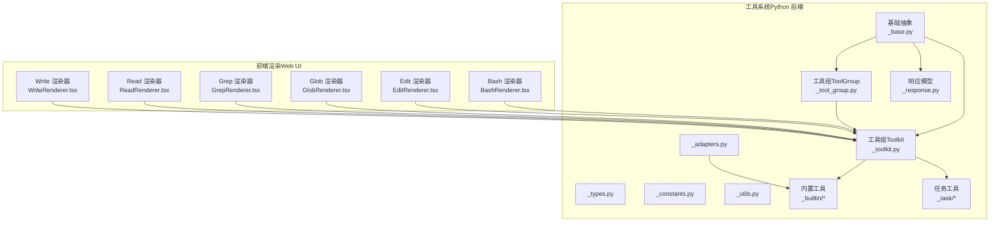
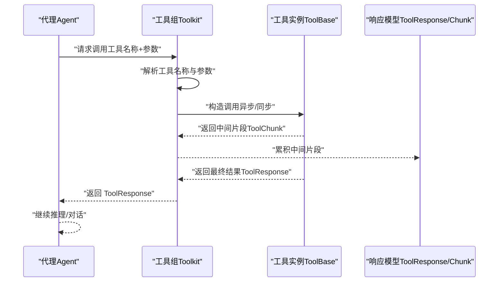
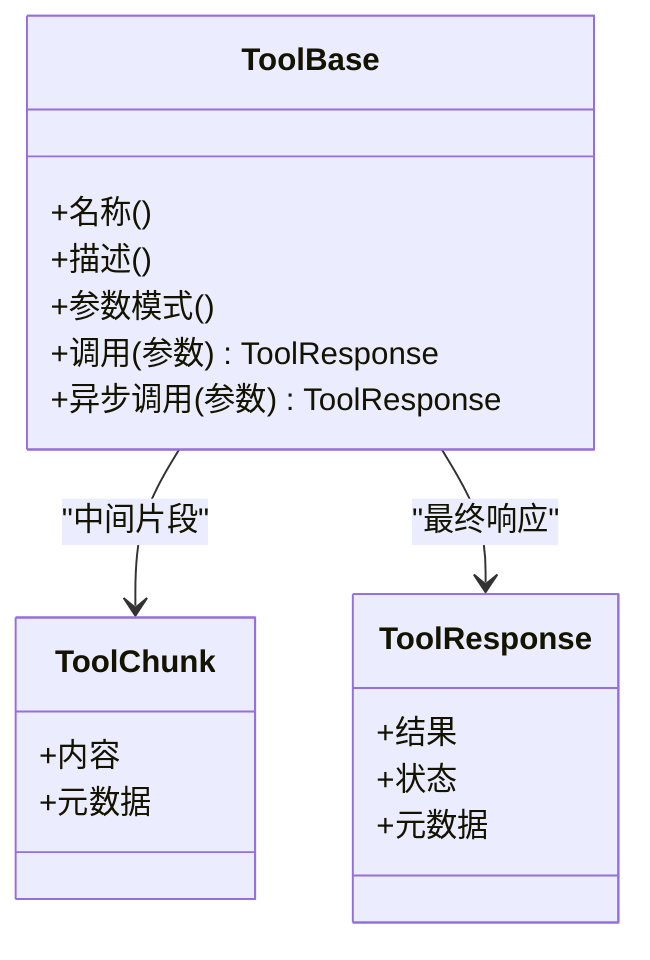
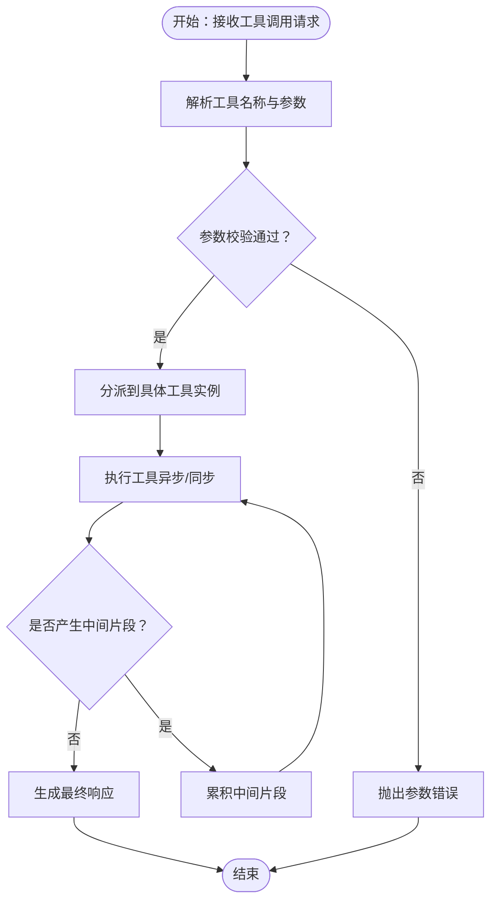
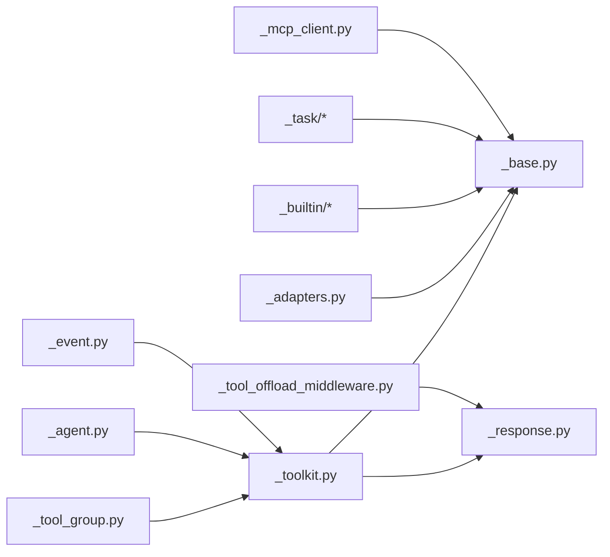

# 工具系统（Tool）

<cite>
**本文引用的文件**
- [tool/__init__.py](file://src/agentscope/tool/__init__.py)
- [tool/_base.py](file://src/agentscope/tool/_base.py)
- [tool/_toolkit.py](file://src/agentscope/tool/_toolkit.py)
- [tool/_tool_group.py](file://src/agentscope/tool/_tool_group.py)
- [tool/_response.py](file://src/agentscope/tool/_response.py)
- [tool/_types.py](file://src/agentscope/tool/_types.py)
- [tool/_constants.py](file://src/agentscope/tool/_constants.py)
- [tool/_utils.py](file://src/agentscope/tool/_utils.py)
- [tool/_adapters.py](file://src/agentscope/tool/_adapters.py)
- [tool/_builtin/_bash.py](file://src/agentscope/tool/_builtin/_bash.py)
- [tool/_builtin/_bash_parser.py](file://src/agentscope/tool/_builtin/_bash_parser.py)
- [tool/_builtin/_edit.py](file://src/agentscope/tool/_builtin/_edit.py)
- [tool/_builtin/_glob.py](file://src/agentscope/tool/_builtin/_glob.py)
- [tool/_builtin/_grep.py](file://src/agentscope/tool/_builtin/_grep.py)
- [tool/_builtin/_read.py](file://src/agentscope/tool/_builtin/_read.py)
- [tool/_builtin/_write.py](file://src/agentscope/tool/_builtin/_write.py)
- [tool/_builtin/_meta.py](file://src/agentscope/tool/_builtin/_meta.py)
- [tool/_builtin/_skill.py](file://src/agentscope/tool/_builtin/_skill.py)
- [tool/_task/_task_tool_base.py](file://src/agentscope/tool/_task/_task_tool_base.py)
- [tool/_task/_create_task.py](file://src/agentscope/tool/_task/_create_task.py)
- [tool/_task/_get_task.py](file://src/agentscope/tool/_task/_get_task.py)
- [tool/_task/_list_task.py](file://src/agentscope/tool/_task/_list_task.py)
- [tool/_task/_update_task.py](file://src/agentscope/tool/_task/_update_task.py)
- [mcp/_mcp_client.py](file://src/agentscope/mcp/_mcp_client.py)
- [app/_middleware/_tool_offload_middleware.py](file://src/agentscope/app/_middleware/_tool_offload_middleware.py)
- [app/_manager/_scheduler/_tools/_schedule_create.py](file://src/agentscope/app/_manager/_scheduler/_tools/_schedule_create.py)
- [app/_manager/_scheduler/_tools/_schedule_list.py](file://src/agentscope/app/_manager/_scheduler/_tools/_schedule_list.py)
- [app/_manager/_scheduler/_tools/_schedule_stop.py](file://src/agentscope/app/_manager/_scheduler/_tools/_schedule_stop.py)
- [app/_manager/_scheduler/_tools/_schedule_view.py](file://src/agentscope/app/_manager/_scheduler/_tools/_schedule_view.py)
- [agent/_agent.py](file://src/agentscope/agent/_agent.py)
- [event/_event.py](file://src/agentscope/event/_event.py)
- [exception/_tool.py](file://src/agentscope/exception/_tool.py)
- [tests/toolkit_test.py](file://tests/toolkit_test.py)
- [tests/builtin_bash_test.py](file://tests/builtin_bash_test.py)
- [tests/builtin_edit_test.py](file://tests/builtin_edit_test.py)
- [tests/builtin_glob_test.py](file://tests/builtin_glob_test.py)
- [tests/builtin_grep_test.py](file://tests/builtin_grep_test.py)
- [tests/builtin_read_test.py](file://tests/builtin_read_test.py)
- [tests/builtin_write_test.py](file://tests/builtin_write_test.py)
- [examples/web_ui/frontend/src/components/chat/tool-renderers/BashRenderer.tsx](file://examples/web_ui/frontend/src/components/chat/tool-renderers/BashRenderer.tsx)
- [examples/web_ui/frontend/src/components/chat/tool-renderers/EditRenderer.tsx](file://examples/web_ui/frontend/src/components/chat/tool-renderers/EditRenderer.tsx)
- [examples/web_ui/frontend/src/components/chat/tool-renderers/GlobRenderer.tsx](file://examples/web_ui/frontend/src/components/chat/tool-renderers/GlobRenderer.tsx)
- [examples/web_ui/frontend/src/components/chat/tool-renderers/GrepRenderer.tsx](file://examples/web_ui/frontend/src/components/chat/tool-renderers/GrepRenderer.tsx)
- [examples/web_ui/frontend/src/components/chat/tool-renderers/ReadRenderer.tsx](file://examples/web_ui/frontend/src/components/chat/tool-renderers/ReadRenderer.tsx)
- [examples/web_ui/frontend/src/components/chat/tool-renderers/WriteRenderer.tsx](file://examples/web_ui/frontend/src/components/chat/tool-renderers/WriteRenderer.tsx)
</cite>

## 目录
1. [引言](#引言)
2. [项目结构](#项目结构)
3. [核心组件](#核心组件)
4. [架构总览](#架构总览)
5. [详细组件分析](#详细组件分析)
6. [依赖关系分析](#依赖关系分析)
7. [性能考量](#性能考量)
8. [故障排查指南](#故障排查指南)
9. [结论](#结论)
10. [附录](#附录)

## 引言
本文件系统性梳理 AgentScope 的工具系统（Tool），覆盖工具的定义、注册、调用与结果处理机制；内置工具（Bash、Read/Write、Edit、Glob、Grep 等）的功能与使用方式；参数校验、错误处理与安全控制；工具组（Toolkit）与工具包（ToolKit）概念及批量/并发调用；并提供自定义工具开发指导与参考路径。

## 项目结构
工具系统位于 src/agentscope/tool 目录下，包含基础抽象、响应模型、工具组与工具包、内置工具、任务工具、适配器与常量等模块。前端 Web UI 提供多种工具渲染器，用于可视化展示工具调用与结果。

图示来源
- [tool/__init__.py](file://src/agentscope/tool/__init__.py)
- [tool/_base.py](file://src/agentscope/tool/_base.py)
- [tool/_toolkit.py](file://src/agentscope/tool/_toolkit.py)
- [tool/_tool_group.py](file://src/agentscope/tool/_tool_group.py)
- [tool/_response.py](file://src/agentscope/tool/_response.py)
- [tool/_adapters.py](file://src/agentscope/tool/_adapters.py)
- [tool/_builtin/_bash.py](file://src/agentscope/tool/_builtin/_bash.py)
- [tool/_builtin/_edit.py](file://src/agentscope/tool/_builtin/_edit.py)
- [tool/_builtin/_glob.py](file://src/agentscope/tool/_builtin/_glob.py)
- [tool/_builtin/_grep.py](file://src/agentscope/tool/_builtin/_grep.py)
- [tool/_builtin/_read.py](file://src/agentscope/tool/_builtin/_read.py)
- [tool/_builtin/_write.py](file://src/agentscope/tool/_builtin/_write.py)
- [tool/_task/_task_tool_base.py](file://src/agentscope/tool/_task/_task_tool_base.py)
- [examples/web_ui/frontend/src/components/chat/tool-renderers/BashRenderer.tsx](file://examples/web_ui/frontend/src/components/chat/tool-renderers/BashRenderer.tsx)
- [examples/web_ui/frontend/src/components/chat/tool-renderers/EditRenderer.tsx](file://examples/web_ui/frontend/src/components/chat/tool-renderers/EditRenderer.tsx)
- [examples/web_ui/frontend/src/components/chat/tool-renderers/GlobRenderer.tsx](file://examples/web_ui/frontend/src/components/chat/tool-renderers/GlobRenderer.tsx)
- [examples/web_ui/frontend/src/components/chat/tool-renderers/GrepRenderer.tsx](file://examples/web_ui/frontend/src/components/chat/tool-renderers/GrepRenderer.tsx)
- [examples/web_ui/frontend/src/components/chat/tool-renderers/ReadRenderer.tsx](file://examples/web_ui/frontend/src/components/chat/tool-renderers/ReadRenderer.tsx)
- [examples/web_ui/frontend/src/components/chat/tool-renderers/WriteRenderer.tsx](file://examples/web_ui/frontend/src/components/chat/tool-renderers/WriteRenderer.tsx)

章节来源
- [tool/__init__.py](file://src/agentscope/tool/__init__.py)
- [tool/_base.py](file://src/agentscope/tool/_base.py)
- [tool/_toolkit.py](file://src/agentscope/tool/_toolkit.py)
- [tool/_tool_group.py](file://src/agentscope/tool/_tool_group.py)
- [tool/_response.py](file://src/agentscope/tool/_response.py)
- [tool/_adapters.py](file://src/agentscope/tool/_adapters.py)

## 核心组件
- 基础抽象与协议：定义工具基类、调用协议、参数模式与返回类型，确保工具具备统一的接口契约。
- 工具组（Toolkit）：负责工具的注册、发现、调度与批量执行，支持按名称获取工具、生成 OpenAI 风格函数调用模式等。
- 工具组（ToolGroup）：对工具进行分组管理，便于按功能域组织工具集合。
- 响应模型：封装工具调用的中间片段（chunk）与最终响应（response），支持流式增量输出与数据块传输。
- 内置工具：提供常用能力（命令执行、文件读写、内容编辑、文件匹配、文本搜索等），满足典型自动化场景。
- 任务工具：围绕任务生命周期（创建、查询、更新、列表）提供工具化封装。
- 适配器与常量：提供工具调用适配、通用常量与工具元信息。

章节来源
- [tool/_base.py](file://src/agentscope/tool/_base.py)
- [tool/_toolkit.py](file://src/agentscope/tool/_toolkit.py)
- [tool/_tool_group.py](file://src/agentscope/tool/_tool_group.py)
- [tool/_response.py](file://src/agentscope/tool/_response.py)
- [tool/_types.py](file://src/agentscope/tool/_types.py)
- [tool/_constants.py](file://src/agentscope/tool/_constants.py)
- [tool/_utils.py](file://src/agentscope/tool/_utils.py)
- [tool/_adapters.py](file://src/agentscope/tool/_adapters.py)

## 架构总览
工具系统采用“协议驱动 + 组合编排”的架构设计。Agent 通过工具组发起工具调用，工具组根据名称解析到具体工具实例，工具执行后以 chunk 流形式返回中间结果，最终汇总为 ToolResponse。前端渲染器基于工具类型选择对应组件进行可视化展示。

图示来源
- [tool/_toolkit.py](file://src/agentscope/tool/_toolkit.py)
- [tool/_base.py](file://src/agentscope/tool/_base.py)
- [tool/_response.py](file://src/agentscope/tool/_response.py)
- [agent/_agent.py](file://src/agentscope/agent/_agent.py)

## 详细组件分析

### 基础抽象与协议（ToolBase）
- 职责：定义工具的统一接口，包括名称、描述、参数模式、调用协议与返回类型。
- 关键点：支持同步/异步调用；参数校验与类型约束；返回值封装为 ToolChunk 或 ToolResponse。
- 设计要点：通过协议约束保证工具可组合、可替换、可测试。

图示来源
- [tool/_base.py](file://src/agentscope/tool/_base.py)
- [tool/_response.py](file://src/agentscope/tool/_response.py)

章节来源
- [tool/_base.py](file://src/agentscope/tool/_base.py)
- [tool/_response.py](file://src/agentscope/tool/_response.py)

### 工具组（Toolkit）
- 职责：注册、发现、调度工具；生成工具模式（OpenAI 函数调用风格）；支持批量执行与并发调用。
- 关键点：名称到工具实例映射；参数校验与错误传播；事件与中间态通知。
- 并发与批量：支持多工具并发执行与结果聚合；提供工具选择策略（如自动选择）。

图示来源
- [tool/_toolkit.py](file://src/agentscope/tool/_toolkit.py)
- [tool/_base.py](file://src/agentscope/tool/_base.py)

章节来源
- [tool/_toolkit.py](file://src/agentscope/tool/_toolkit.py)
- [tests/toolkit_test.py](file://tests/toolkit_test.py)

### 工具组（ToolGroup）
- 职责：对工具进行逻辑分组，便于按领域或权限域管理工具集合。
- 关键点：与 Toolkit 协同工作，支持分组内工具的统一调度与访问控制。

章节来源
- [tool/_tool_group.py](file://src/agentscope/tool/_tool_group.py)

### 响应模型（ToolChunk/ToolResponse）
- 职责：封装工具调用过程中的增量输出与最终结果，支持文本与二进制数据块。
- 关键点：流式传输、数据块去重与合并、元数据携带。

章节来源
- [tool/_response.py](file://src/agentscope/tool/_response.py)

### 内置工具概览
- Bash 工具：执行命令行命令，支持参数解析与安全控制。
- Read/Write 工具：文件读取与写入，支持路径校验与权限控制。
- Edit 工具：对文件内容进行编辑（插入、替换、删除等）。
- Glob 工具：基于通配符匹配文件路径。
- Grep 工具：在文件中进行文本搜索与匹配。
- 元信息与技能工具：提供工具元数据与技能加载能力。

章节来源
- [tool/_builtin/_bash.py](file://src/agentscope/tool/_builtin/_bash.py)
- [tool/_builtin/_bash_parser.py](file://src/agentscope/tool/_builtin/_bash_parser.py)
- [tool/_builtin/_read.py](file://src/agentscope/tool/_builtin/_read.py)
- [tool/_builtin/_write.py](file://src/agentscope/tool/_builtin/_write.py)
- [tool/_builtin/_edit.py](file://src/agentscope/tool/_builtin/_edit.py)
- [tool/_builtin/_glob.py](file://src/agentscope/tool/_builtin/_glob.py)
- [tool/_builtin/_grep.py](file://src/agentscope/tool/_builtin/_grep.py)
- [tool/_builtin/_meta.py](file://src/agentscope/tool/_builtin/_meta.py)
- [tool/_builtin/_skill.py](file://src/agentscope/tool/_builtin/_skill.py)

### 任务工具（Task Tools）
- 职责：围绕任务生命周期提供工具化封装，包括创建、查询、更新、列表等。
- 关键点：与任务管理器协同，支持状态流转与并发控制。

章节来源
- [tool/_task/_task_tool_base.py](file://src/agentscope/tool/_task/_task_tool_base.py)
- [tool/_task/_create_task.py](file://src/agentscope/tool/_task/_create_task.py)
- [tool/_task/_get_task.py](file://src/agentscope/tool/_task/_get_task.py)
- [tool/_task/_list_task.py](file://src/agentscope/tool/_task/_list_task.py)
- [tool/_task/_update_task.py](file://src/agentscope/tool/_task/_update_task.py)

### MCP 工具集成
- 职责：通过 MCP 客户端动态发现与调用外部工具，支持有状态/无状态连接。
- 关键点：工具缓存、名称解析、异常处理与客户端生成器。

章节来源
- [mcp/_mcp_client.py](file://src/agentscope/mcp/_mcp_client.py)

### 工具离线中间件
- 职责：在工具执行失败时生成合成响应，保障流程连续性。
- 关键点：拦截工具调用异常，返回结构化响应，避免中断。

章节来源
- [app/_middleware/_tool_offload_middleware.py](file://src/agentscope/app/_middleware/_tool_offload_middleware.py)

### 前端工具渲染器
- 职责：根据工具类型渲染调用界面与结果展示，提升用户体验。
- 关键点：Bash、Edit、Glob、Grep、Read、Write 等专用渲染器。

章节来源
- [examples/web_ui/frontend/src/components/chat/tool-renderers/BashRenderer.tsx](file://examples/web_ui/frontend/src/components/chat/tool-renderers/BashRenderer.tsx)
- [examples/web_ui/frontend/src/components/chat/tool-renderers/EditRenderer.tsx](file://examples/web_ui/frontend/src/components/chat/tool-renderers/EditRenderer.tsx)
- [examples/web_ui/frontend/src/components/chat/tool-renderers/GlobRenderer.tsx](file://examples/web_ui/frontend/src/components/chat/tool-renderers/GlobRenderer.tsx)
- [examples/web_ui/frontend/src/components/chat/tool-renderers/GrepRenderer.tsx](file://examples/web_ui/frontend/src/components/chat/tool-renderers/GrepRenderer.tsx)
- [examples/web_ui/frontend/src/components/chat/tool-renderers/ReadRenderer.tsx](file://examples/web_ui/frontend/src/components/chat/tool-renderers/ReadRenderer.tsx)
- [examples/web_ui/frontend/src/components/chat/tool-renderers/WriteRenderer.tsx](file://examples/web_ui/frontend/src/components/chat/tool-renderers/WriteRenderer.tsx)

## 依赖关系分析
- 模块耦合：工具组依赖工具基类与响应模型；内置工具与任务工具均实现工具基类；前端渲染器依赖工具组提供的模式与结果。
- 外部依赖：MCP 客户端用于外部工具集成；事件系统用于工具调用生命周期通知；异常体系用于错误传播与恢复。
- 循环依赖：通过延迟导入避免循环依赖（例如 MCP 工具的导入）。

图示来源
- [tool/_toolkit.py](file://src/agentscope/tool/_toolkit.py)
- [tool/_base.py](file://src/agentscope/tool/_base.py)
- [tool/_response.py](file://src/agentscope/tool/_response.py)
- [tool/_tool_group.py](file://src/agentscope/tool/_tool_group.py)
- [tool/_adapters.py](file://src/agentscope/tool/_adapters.py)
- [tool/_builtin/_bash.py](file://src/agentscope/tool/_builtin/_bash.py)
- [tool/_task/_task_tool_base.py](file://src/agentscope/tool/_task/_task_tool_base.py)
- [mcp/_mcp_client.py](file://src/agentscope/mcp/_mcp_client.py)
- [app/_middleware/_tool_offload_middleware.py](file://src/agentscope/app/_middleware/_tool_offload_middleware.py)
- [agent/_agent.py](file://src/agentscope/agent/_agent.py)
- [event/_event.py](file://src/agentscope/event/_event.py)

章节来源
- [tool/_toolkit.py](file://src/agentscope/tool/_toolkit.py)
- [tool/_base.py](file://src/agentscope/tool/_base.py)
- [tool/_response.py](file://src/agentscope/tool/_response.py)
- [tool/_tool_group.py](file://src/agentscope/tool/_tool_group.py)
- [tool/_adapters.py](file://src/agentscope/tool/_adapters.py)
- [tool/_builtin/_bash.py](file://src/agentscope/tool/_builtin/_bash.py)
- [tool/_task/_task_tool_base.py](file://src/agentscope/tool/_task/_task_tool_base.py)
- [mcp/_mcp_client.py](file://src/agentscope/mcp/_mcp_client.py)
- [app/_middleware/_tool_offload_middleware.py](file://src/agentscope/app/_middleware/_tool_offload_middleware.py)
- [agent/_agent.py](file://src/agentscope/agent/_agent.py)
- [event/_event.py](file://src/agentscope/event/_event.py)

## 性能考量
- 并发执行：工具组支持多工具并发调用，建议结合资源限制与队列策略，避免阻塞与资源争用。
- 流式输出：ToolChunk 支持增量返回，前端可逐步渲染，降低等待时间。
- 缓存与复用：MCP 工具列表可缓存，减少重复拉取；工具组可缓存已注册工具，提高查找效率。
- I/O 优化：文件相关工具（Read/Write/Edit/Glob/Grep）应避免大文件全量读取，优先分块处理与范围读取。

## 故障排查指南
- 工具未找到：检查工具名称拼写与注册顺序；确认工具组已正确注册目标工具。
- 参数校验失败：核对参数类型与必填项；查看工具模式定义与前端表单一致性。
- 执行异常：捕获工具异常并记录上下文；必要时启用离线中间件生成合成响应。
- 权限与安全：Bash 工具需严格参数解析与白名单控制；文件工具需路径校验与权限检查。
- 事件与日志：利用事件系统定位工具调用阶段（开始、增量、结束），辅助问题定位。

章节来源
- [exception/_tool.py](file://src/agentscope/exception/_tool.py)
- [tool/_builtin/_bash_parser.py](file://src/agentscope/tool/_builtin/_bash_parser.py)
- [app/_middleware/_tool_offload_middleware.py](file://src/agentscope/app/_middleware/_tool_offload_middleware.py)
- [event/_event.py](file://src/agentscope/event/_event.py)

## 结论
AgentScope 的工具系统以协议驱动为核心，通过工具组实现统一编排与调度，内置工具覆盖常见自动化需求，并提供任务工具与 MCP 集成扩展能力。配合流式响应与前端渲染器，形成从调用到可视化的完整闭环。建议在生产环境中重视参数校验、安全控制与并发治理，以获得稳定高效的工具执行体验。

## 附录

### 内置工具使用指引
- Bash 工具
  - 功能：执行命令行命令，支持参数解析与安全控制。
  - 使用要点：严格校验命令与参数，避免危险操作；合理设置超时与输出截断。
  - 参考路径：[tool/_builtin/_bash.py](file://src/agentscope/tool/_builtin/_bash.py)，[tests/builtin_bash_test.py](file://tests/builtin_bash_test.py)
- Read 工具
  - 功能：读取文件内容，支持路径校验与大小限制。
  - 使用要点：限定允许读取的目录范围；避免读取敏感文件。
  - 参考路径：[tool/_builtin/_read.py](file://src/agentscope/tool/_builtin/_read.py)，[tests/builtin_read_test.py](file://tests/builtin_read_test.py)
- Write 工具
  - 功能：写入文件内容，支持覆盖与追加模式。
  - 使用要点：校验目标路径与权限；防止覆盖关键配置。
  - 参考路径：[tool/_builtin/_write.py](file://src/agentscope/tool/_builtin/_write.py)，[tests/builtin_write_test.py](file://tests/builtin_write_test.py)
- Edit 工具
  - 功能：对文件内容进行编辑（插入、替换、删除等）。
  - 使用要点：提供原子性操作与回滚策略；记录变更历史。
  - 参考路径：[tool/_builtin/_edit.py](file://src/agentscope/tool/_builtin/_edit.py)，[tests/builtin_edit_test.py](file://tests/builtin_edit_test.py)
- Glob 工具
  - 功能：基于通配符匹配文件路径。
  - 使用要点：限制匹配范围与深度；避免递归过深导致性能问题。
  - 参考路径：[tool/_builtin/_glob.py](file://src/agentscope/tool/_builtin/_glob.py)，[tests/builtin_glob_test.py](file://tests/builtin_glob_test.py)
- Grep 工具
  - 功能：在文件中进行文本搜索与匹配。
  - 使用要点：支持正则表达式与大小写控制；限制搜索范围与结果数量。
  - 参考路径：[tool/_builtin/_grep.py](file://src/agentscope/tool/_builtin/_grep.py)，[tests/builtin_grep_test.py](file://tests/builtin_grep_test.py)

### 自定义工具开发步骤
- 实现工具基类：继承工具基类，实现名称、描述、参数模式与调用逻辑。
- 参数校验：在调用前进行参数类型与范围校验，必要时抛出明确异常。
- 错误处理：捕获内部异常并转换为标准响应；提供可诊断的错误信息。
- 流式输出：对于耗时操作，分批返回中间片段，提升交互体验。
- 注册与测试：将工具注册到工具组，编写单元测试覆盖正常与异常分支。
- 参考路径：[tool/_base.py](file://src/agentscope/tool/_base.py)，[tool/_toolkit.py](file://src/agentscope/tool/_toolkit.py)，[tests/toolkit_test.py](file://tests/toolkit_test.py)