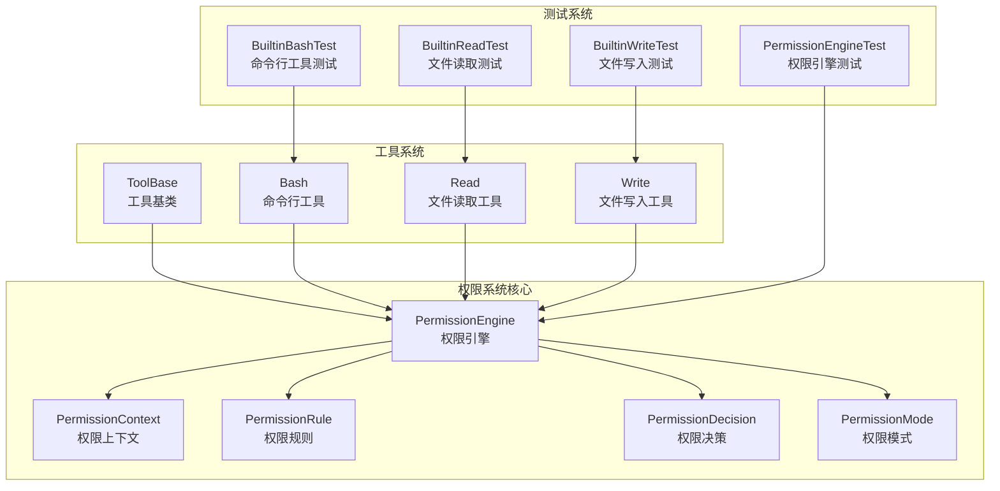
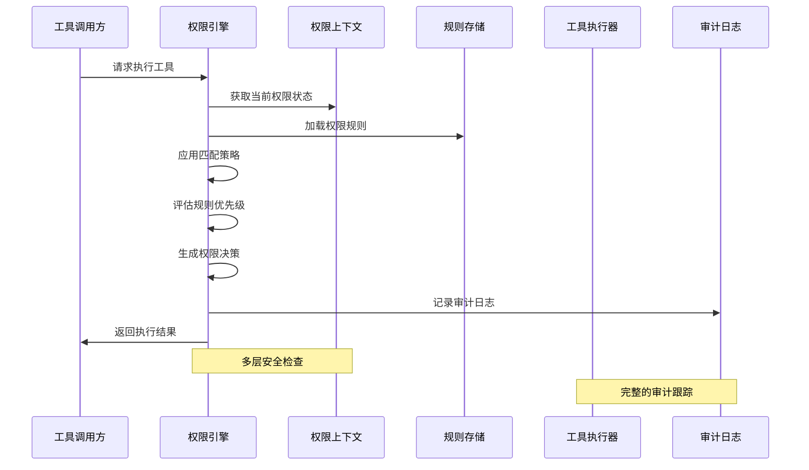
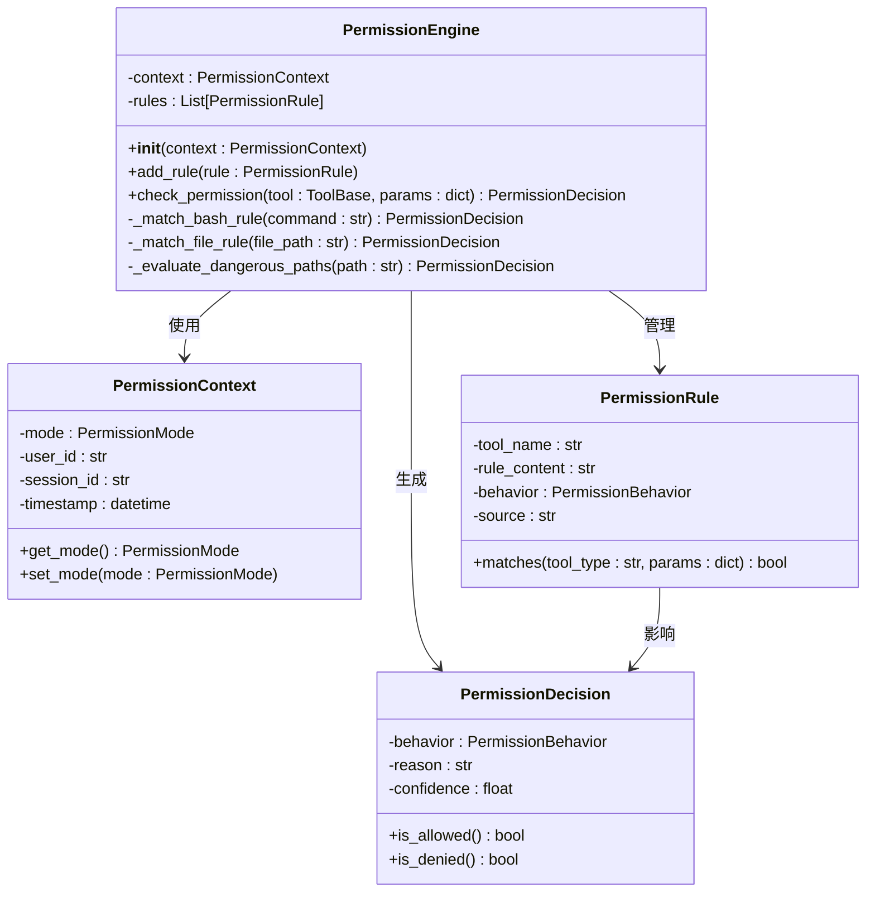
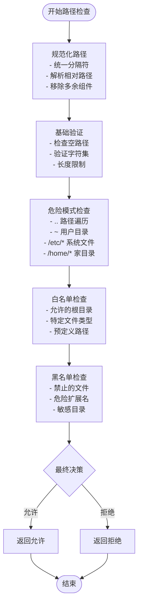
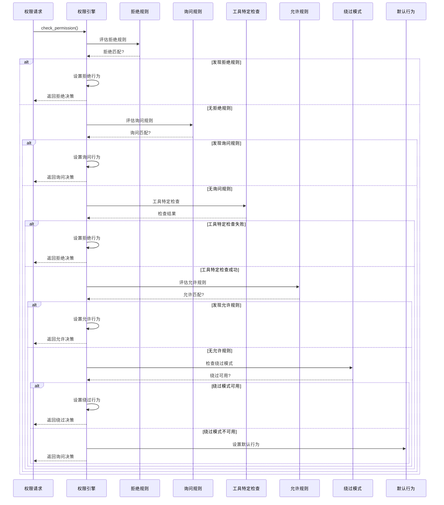
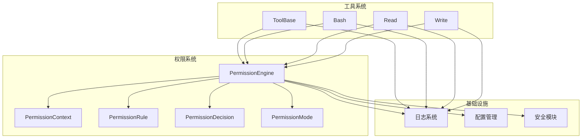

# 权限与安全控制

<cite>
**本文档引用的文件**
- [_engine.py](file://src/agentscope/permission/_engine.py)
- [_context.py](file://src/agentscope/permission/_context.py)
- [_rule.py](file://src/agentscope/permission/_rule.py)
- [_decision.py](file://src/agentscope/permission/_decision.py)
- [_types.py](file://src/agentscope/permission/_types.py)
- [_base.py](file://src/agentscope/tool/_base.py)
- [_bash.py](file://src/agentscope/tool/_builtin/_bash.py)
- [_read.py](file://src/agentscope/tool/_builtin/_read.py)
- [_write.py](file://src/agentscope/tool/_builtin/_write.py)
- [permission_engine_test.py](file://tests/permission_engine_test.py)
- [builtin_bash_test.py](file://tests/builtin_bash_test.py)
- [builtin_read_test.py](file://tests/builtin_read_test.py)
- [builtin_write_test.py](file://tests/builtin_write_test.py)
</cite>

## 目录
1. [简介](#简介)
2. [项目结构](#项目结构)
3. [核心组件](#核心组件)
4. [架构概览](#架构概览)
5. [详细组件分析](#详细组件分析)
6. [依赖关系分析](#依赖关系分析)
7. [性能考虑](#性能考虑)
8. [故障排除指南](#故障排除指南)
9. [结论](#结论)

## 简介

AgentScope工具系统的权限与安全控制是一个多层次的保护机制，旨在确保工具执行的安全性和可控性。该系统通过权限引擎对各种工具操作进行实时检查，包括危险文件和目录保护、命令行工具安全限制、文件操作权限验证等。

系统采用基于规则的权限控制模型，支持不同工具类型的特定匹配策略，并提供了灵活的权限模式配置，以适应从开发环境到生产环境的不同安全需求。

## 项目结构

权限与安全控制系统在AgentScope项目中的组织结构如下：

**图表来源**
- [_engine.py:16-35](file://src/agentscope/permission/_engine.py#L16-L35)
- [_context.py](file://src/agentscope/permission/_context.py)
- [_rule.py](file://src/agentscope/permission/_rule.py)
- [_decision.py](file://src/agentscope/permission/_decision.py)
- [_types.py:18-29](file://src/agentscope/permission/_types.py#L18-L29)

**章节来源**
- [_engine.py:1-44](file://src/agentscope/permission/_engine.py#L1-L44)
- [_types.py:1-29](file://src/agentscope/permission/_types.py#L1-L29)

## 核心组件

### 权限引擎（PermissionEngine）

权限引擎是整个权限控制系统的核心，负责评估工具执行请求并应用相应的权限规则。其主要特点包括：

- **多策略匹配**：针对不同工具类型采用不同的匹配策略
- **优先级排序**：按照预定义的顺序评估各种规则
- **实时决策**：对每个工具执行请求进行即时响应

### 权限上下文（PermissionContext）

权限上下文管理权限系统运行时的状态和配置，包括：
- 当前权限模式
- 用户身份信息
- 工具执行历史
- 安全策略配置

### 权限规则（PermissionRule）

权限规则定义了工具执行的允许或拒绝条件，支持多种匹配模式：
- **通配符匹配**：支持`*`和`?`通配符
- **正则表达式**：复杂的模式匹配
- **范围匹配**：数值范围和集合匹配

**章节来源**
- [_engine.py:16-35](file://src/agentscope/permission/_engine.py#L16-L35)
- [_context.py](file://src/agentscope/permission/_context.py)
- [_rule.py](file://src/agentscope/permission/_rule.py)

## 架构概览

权限与安全控制系统的整体架构采用分层设计，确保了模块间的清晰分离和高内聚低耦合：

**图表来源**
- [_engine.py:16-35](file://src/agentscope/permission/_engine.py#L16-L35)
- [_context.py](file://src/agentscope/permission/_context.py)
- [_decision.py](file://src/agentscope/permission/_decision.py)

### 权限模式体系

系统支持多种权限模式，每种模式都有特定的行为特征：

| 模式 | 行为 | 使用场景 |
|------|------|----------|
| DEFAULT | 所有操作都需要显式权限（除非有明确的允许规则） | 默认模式，最安全 |
| ASK | 对未知操作询问用户确认 | 开发调试环境 |
| ALLOW | 允许所有操作 | 测试环境，开发阶段 |
| DENY | 拒绝所有操作 | 高安全要求的生产环境 |

**章节来源**
- [_types.py:18-29](file://src/agentscope/permission/_types.py#L18-L29)

## 详细组件分析

### 权限引擎实现分析

权限引擎采用了策略模式和责任链模式的组合，实现了灵活且高效的权限检查机制：

**图表来源**
- [_engine.py:16-35](file://src/agentscope/permission/_engine.py#L16-L35)
- [_context.py](file://src/agentscope/permission/_context.py)
- [_rule.py](file://src/agentscope/permission/_rule.py)
- [_decision.py](file://src/agentscope/permission/_decision.py)

#### 工具类型特定的权限检查

系统为不同类型的工具实现了专门的权限检查逻辑：

**命令行工具安全检查**
- 命令字符串验证
- 参数白名单过滤
- 危险命令识别
- 路径解析安全检查

**文件操作权限验证**
- 文件路径规范化
- 目录遍历攻击防护
- 文件扩展名验证
- 权限继承检查

**章节来源**
- [_engine.py:16-35](file://src/agentscope/permission/_engine.py#L16-L35)
- [_bash.py](file://src/agentscope/tool/_builtin/_bash.py)
- [_read.py](file://src/agentscope/tool/_builtin/_read.py)
- [_write.py](file://src/agentscope/tool/_builtin/_write.py)

### 危险路径检测算法

系统实现了多层次的危险路径检测机制：

**图表来源**
- [_engine.py:16-35](file://src/agentscope/permission/_engine.py#L16-L35)

### 权限规则匹配流程

权限规则的匹配过程遵循严格的优先级顺序：

**图表来源**
- [_engine.py:27-35](file://src/agentscope/permission/_engine.py#L27-L35)

**章节来源**
- [_engine.py:16-35](file://src/agentscope/permission/_engine.py#L16-L35)

### 用户确认机制

系统提供了灵活的用户确认机制，支持不同级别的交互方式：

- **自动确认**：对于已知的允许操作，无需用户干预
- **交互确认**：对于潜在危险的操作，弹出确认对话框
- **批量确认**：对于连续的操作序列，提供批量确认选项
- **静默模式**：在自动化环境中禁用用户交互

### 审计日志记录

完整的审计日志系统记录所有权限相关的活动：

- **操作记录**：记录每次工具执行请求
- **决策详情**：记录权限决策的依据和过程
- **用户行为**：跟踪用户的确认和拒绝行为
- **异常事件**：记录安全违规和系统错误

**章节来源**
- [_decision.py](file://src/agentscope/permission/_decision.py)
- [_engine.py:16-35](file://src/agentscope/permission/_engine.py#L16-L35)

## 依赖关系分析

权限系统与其他组件的依赖关系如下：

**图表来源**
- [_engine.py:1-14](file://src/agentscope/permission/_engine.py#L1-L14)
- [_base.py](file://src/agentscope/tool/_base.py)

### 组件耦合度分析

权限系统的设计遵循了低耦合原则：
- **权限引擎**独立于具体工具实现
- **规则系统**与工具类型解耦
- **上下文管理**提供统一的状态访问
- **决策生成**与外部系统隔离

**章节来源**
- [_engine.py:1-14](file://src/agentscope/permission/_engine.py#L1-L14)
- [_base.py](file://src/agentscope/tool/_base.py)

## 性能考虑

### 权限检查优化

为了确保权限检查的高效性，系统采用了以下优化策略：

- **规则缓存**：缓存已匹配的规则结果
- **路径索引**：为常用路径建立索引
- **异步处理**：支持异步权限检查
- **批量处理**：合并相似的权限请求

### 内存管理

- **规则生命周期**：合理管理规则对象的内存使用
- **上下文清理**：定期清理过期的权限上下文
- **垃圾回收**：避免内存泄漏和资源浪费

## 故障排除指南

### 常见问题及解决方案

**问题1：权限规则不生效**
- 检查规则的工具名称是否正确
- 验证规则内容的语法格式
- 确认规则的优先级设置

**问题2：危险路径误报**
- 检查路径规范化逻辑
- 验证白名单配置
- 调整危险模式检测阈值

**问题3：性能问题**
- 分析规则匹配效率
- 优化规则存储结构
- 实施规则缓存策略

### 调试技巧

- 启用详细日志记录
- 使用单元测试验证规则
- 监控权限检查性能指标
- 分析审计日志中的异常模式

**章节来源**
- [permission_engine_test.py:332-373](file://tests/permission_engine_test.py#L332-L373)
- [builtin_bash_test.py](file://tests/builtin_bash_test.py)
- [builtin_read_test.py](file://tests/builtin_read_test.py)
- [builtin_write_test.py](file://tests/builtin_write_test.py)

## 结论

AgentScope的权限与安全控制系统通过多层次的设计实现了全面的工具执行保护。系统的核心优势包括：

1. **灵活性**：支持多种权限模式和自定义规则
2. **安全性**：提供深度的路径检查和威胁防护
3. **可扩展性**：模块化设计便于功能扩展
4. **可观测性**：完整的审计日志和监控能力

该系统为AI代理工具的安全使用提供了坚实的基础，既保证了功能的完整性，又确保了操作的安全性。通过合理的配置和持续的监控，可以有效防范各种安全威胁，保护系统和数据的安全。