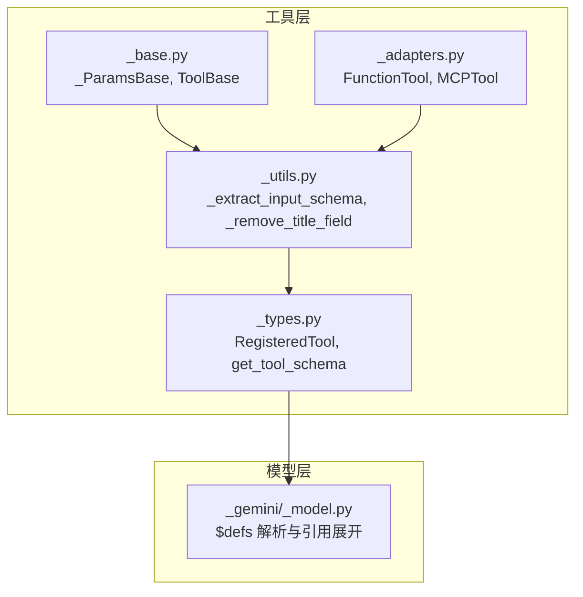
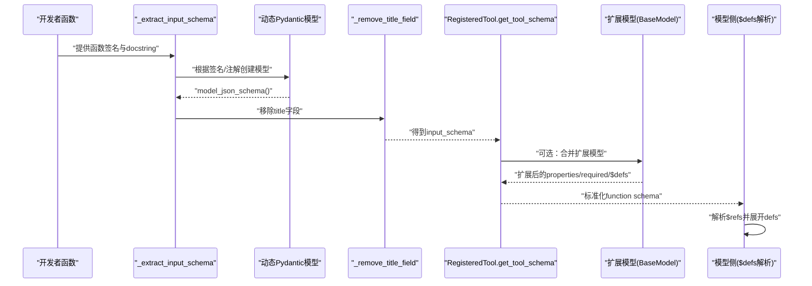
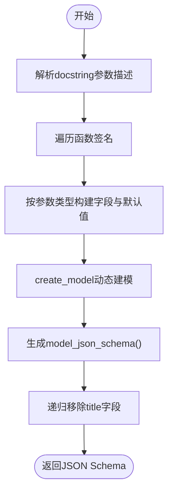
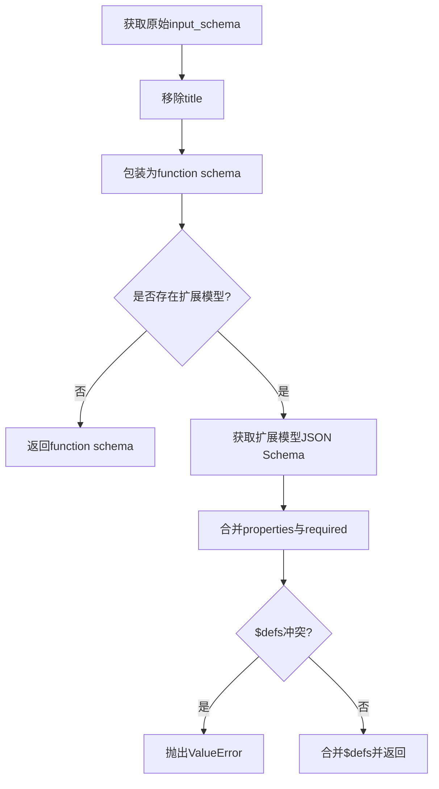
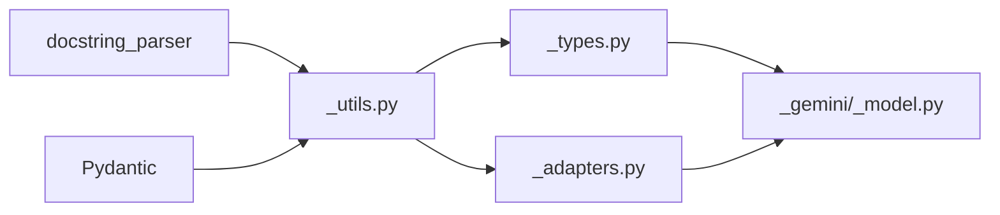

# 参数验证与模式定义

<cite>
**本文引用的文件**   
- [tool/_base.py](file://src/agentscope/tool/_base.py)
- [tool/_utils.py](file://src/agentscope/tool/_utils.py)
- [tool/_types.py](file://src/agentscope/tool/_types.py)
- [tool/_adapters.py](file://src/agentscope/tool/_adapters.py)
- [model/_gemini/_model.py](file://src/agentscope/model/_gemini/_model.py)
- [toolkit_test.py](file://tests/toolkit_test.py)
</cite>

## 目录
1. [引言](#引言)
2. [项目结构](#项目结构)
3. [核心组件](#核心组件)
4. [架构总览](#架构总览)
5. [详细组件分析](#详细组件分析)
6. [依赖分析](#依赖分析)
7. [性能考虑](#性能考虑)
8. [故障排查指南](#故障排查指南)
9. [结论](#结论)
10. [附录：实用示例与最佳实践](#附录实用示例与最佳实践)

## 引言
本指南围绕 AgentScope 的工具参数验证与 JSON Schema 模式定义展开，重点解释 _params_base 类（基于 Pydantic）的设计与用法，以及如何通过函数签名与 docstring 自动推导输入参数的 JSON Schema。文档涵盖以下主题：
- 基于 Pydantic 的参数模型设计与 JSON Schema 输出
- JSON Schema 的模式定义（类型、必填、范围、格式等）
- 默认值处理与动态扩展（通过扩展模型合并）
- 复杂参数结构（嵌套对象、$defs、引用）的定义与验证
- 实用示例与最佳实践

## 项目结构
与参数验证直接相关的核心模块位于 src/agentscope/tool 下，配合模型侧对 Schema 的解析与处理：
- 工具协议与基础类：tool/_base.py
- 参数 Schema 提取与清洗：tool/_utils.py
- 工具类型与 Schema 合并：tool/_types.py
- 函数适配器与 MCP 工具适配：tool/_adapters.py
- 模型侧 Schema 解析（含 $defs 解析）：model/_gemini/_model.py
- 测试用例（验证 Schema 行为）：tests/toolkit_test.py

图表来源
- [tool/_base.py:1-212](file://src/agentscope/tool/_base.py#L1-L212)
- [tool/_utils.py:1-161](file://src/agentscope/tool/_utils.py#L1-L161)
- [tool/_types.py:1-204](file://src/agentscope/tool/_types.py#L1-L204)
- [tool/_adapters.py:1-371](file://src/agentscope/tool/_adapters.py#L1-L371)
- [model/_gemini/_model.py:41-75](file://src/agentscope/model/_gemini/_model.py#L41-L75)

章节来源
- [tool/_base.py:1-212](file://src/agentscope/tool/_base.py#L1-L212)
- [tool/_utils.py:1-161](file://src/agentscope/tool/_utils.py#L1-L161)
- [tool/_types.py:1-204](file://src/agentscope/tool/_types.py#L1-L204)
- [tool/_adapters.py:1-371](file://src/agentscope/tool/_adapters.py#L1-L371)
- [model/_gemini/_model.py:41-75](file://src/agentscope/model/_gemini/_model.py#L41-L75)

## 核心组件
- _ParamsBase：继承自 Pydantic 的 BaseModel，重写 model_json_schema，移除顶层 title 字段，避免误导 LLM。
- _extract_input_schema：从函数签名与 docstring 中提取参数描述与类型，动态构建 Pydantic 模型并生成 JSON Schema。
- RegisteredTool：封装工具与可选扩展模型，负责将工具的 input_schema 包装为标准函数调用 Schema，并支持与扩展模型合并。
- FunctionTool：将普通 Python 函数包装为工具，自动提取描述与输入 Schema。
- MCPTool：将 MCP 工具的输入 Schema 原样保留（含 $defs、anyOf、oneOf 等），确保嵌套类型与引用完整传递。

章节来源
- [tool/_base.py:22-33](file://src/agentscope/tool/_base.py#L22-L33)
- [tool/_utils.py:68-161](file://src/agentscope/tool/_utils.py#L68-L161)
- [tool/_types.py:56-153](file://src/agentscope/tool/_types.py#L56-L153)
- [tool/_adapters.py:30-84](file://src/agentscope/tool/_adapters.py#L30-L84)
- [tool/_adapters.py:162-241](file://src/agentscope/tool/_adapters.py#L162-L241)

## 架构总览
下图展示了从函数到最终 Schema 的关键流程：签名与 docstring → 动态 Pydantic 模型 → JSON Schema → 清洗 title → 合并扩展模型 → 模型侧解析 $defs。

图表来源
- [tool/_utils.py:68-161](file://src/agentscope/tool/_utils.py#L68-L161)
- [tool/_types.py:56-153](file://src/agentscope/tool/_types.py#L56-L153)
- [model/_gemini/_model.py:41-75](file://src/agentscope/model/_gemini/_model.py#L41-L75)

## 详细组件分析

### _ParamsBase：基于 Pydantic 的参数基类
- 设计要点
  - 继承自 BaseModel，复用 Pydantic 的类型检查、序列化与反序列化能力。
  - 重写 model_json_schema，统一移除 title 字段，避免 LLM 将其误认为标题或提示词。
- 适用场景
  - 所有需要以 JSON Schema 暴露给模型的参数结构，均可继承该基类，保证输出一致。

章节来源
- [tool/_base.py:22-33](file://src/agentscope/tool/_base.py#L22-L33)

### _extract_input_schema：从函数签名与 docstring 提取 Schema
- 关键逻辑
  - 解析 docstring 的参数段落，提取每个参数的描述。
  - 遍历函数签名，按参数种类（位置参数、*args、**kwargs）映射到 Pydantic 字段与默认值。
  - 使用 create_model 动态创建模型，再生成 JSON Schema。
  - 递归移除所有层级的 title 字段，确保 Schema 干净。
- 默认值与可选项
  - 若参数未提供默认值，则在 Schema 中视为必填字段；若提供默认值（含空集合/字典），则作为可选字段。
- 变长参数
  - 支持控制是否包含 *args/**kwargs 到 Schema 中，便于灵活暴露参数接口。

图表来源
- [tool/_utils.py:68-161](file://src/agentscope/tool/_utils.py#L68-L161)

章节来源
- [tool/_utils.py:68-161](file://src/agentscope/tool/_utils.py#L68-L161)

### RegisteredTool 与 get_tool_schema：Schema 合并与扩展
- 职责
  - 校验原始 input_schema 结构合法性（必须是 object 类型且包含 properties）。
  - 将工具的 input_schema 包装为标准 function 调用 Schema。
  - 可选地合并扩展模型（Extended BaseModel）的 JSON Schema：
    - 合并 properties 与 required。
    - 合并 $defs，冲突检测（同名但定义不同则报错）。
- 错误处理
  - 当扩展字段与原 Schema 冲突时抛出异常，防止覆盖或隐藏字段。
  - 当 $defs 冲突时抛出异常，保证嵌套类型的唯一性与一致性。

图表来源
- [tool/_types.py:56-153](file://src/agentscope/tool/_types.py#L56-L153)

章节来源
- [tool/_types.py:43-55](file://src/agentscope/tool/_types.py#L43-L55)
- [tool/_types.py:56-153](file://src/agentscope/tool/_types.py#L56-L153)

### FunctionTool：函数适配器与参数 Schema
- 初始化
  - 从函数 docstring 提取描述；从签名提取输入 Schema。
- 调用
  - 支持同步/异步函数与生成器返回值，统一封装为 ToolChunk 或流式结果。
- 权限检查
  - 默认策略要求人工确认，可按需覆盖。

章节来源
- [tool/_adapters.py:30-84](file://src/agentscope/tool/_adapters.py#L30-L84)
- [tool/_adapters.py:104-160](file://src/agentscope/tool/_adapters.py#L104-L160)

### MCPTool：MCP 工具 Schema 的保留与解析
- 输入 Schema 保留
  - 原样保留 MCP 工具的 inputSchema，包括 $defs、anyOf、oneOf 等，避免丢失嵌套类型定义。
- 运行时解析
  - 模型侧（如 Gemini）对 $refs 进行解析与展开，处理循环引用并给出警告。

章节来源
- [tool/_adapters.py:162-241](file://src/agentscope/tool/_adapters.py#L162-L241)
- [model/_gemini/_model.py:41-75](file://src/agentscope/model/_gemini/_model.py#L41-L75)

## 依赖分析
- 组件耦合
  - _extract_input_schema 依赖 docstring_parser 与 Pydantic Field/create_model。
  - RegisteredTool 依赖 _remove_title_field 与 Pydantic 模型的 model_json_schema。
  - FunctionTool 依赖 _extract_input_schema 与工具响应类型。
  - 模型侧依赖 $defs 解析逻辑，确保 Schema 在推理端可用。
- 外部依赖
  - Pydantic：类型系统、默认值、JSON Schema 生成。
  - docstring_parser：从 docstring 中抽取参数描述。
  - mcp（可选）：MCP 工具集成。

图表来源
- [tool/_utils.py:6-8](file://src/agentscope/tool/_utils.py#L6-L8)
- [tool/_types.py:17-21](file://src/agentscope/tool/_types.py#L17-L21)
- [tool/_adapters.py:9-11](file://src/agentscope/tool/_adapters.py#L9-L11)
- [model/_gemini/_model.py:41-75](file://src/agentscope/model/_gemini/_model.py#L41-L75)

章节来源
- [tool/_utils.py:6-8](file://src/agentscope/tool/_utils.py#L6-L8)
- [tool/_types.py:17-21](file://src/agentscope/tool/_types.py#L17-L21)
- [tool/_adapters.py:9-11](file://src/agentscope/tool/_adapters.py#L9-L11)
- [model/_gemini/_model.py:41-75](file://src/agentscope/model/_gemini/_model.py#L41-L75)

## 性能考虑
- Schema 生成
  - 动态模型创建仅在注册工具时发生，通常为一次性开销。
  - _remove_title_field 采用递归遍历，复杂度与 Schema 层级成正比。
- 扩展模型合并
  - 合并 properties 与 required 为线性操作；$defs 冲突检测为哈希比较，整体开销可控。
- 模型侧解析
  - $defs 解析与 $ref 展开在推理阶段进行，注意避免深层嵌套导致的解析成本上升。

## 故障排查指南
- “字段已存在”错误
  - 现象：合并扩展模型时与原 Schema 字段名冲突。
  - 排查：修改扩展模型字段名，避免覆盖原 Schema 字段。
  - 参考：[tool/_types.py:99-104](file://src/agentscope/tool/_types.py#L99-L104)
- “$defs 冲突”错误
  - 现象：扩展模型与现有 $defs 定义不一致。
  - 排查：保持同一子模型在不同扩展中定义一致；必要时重构共享子模型。
  - 参考：[tool/_types.py:140-146](file://src/agentscope/tool/_types.py#L140-L146)
- “无效 input_schema”错误
  - 现象：RegisteredTool 校验失败。
  - 排查：确保 input_schema 为 object 类型且包含 properties。
  - 参考：[tool/_types.py:46-54](file://src/agentscope/tool/_types.py#L46-L54)
- “循环引用”警告
  - 现象：模型侧解析 $refs 时检测到循环引用。
  - 排查：简化嵌套结构或拆分子模型，避免相互引用。
  - 参考：[model/_gemini/_model.py:54-62](file://src/agentscope/model/_gemini/_model.py#L54-L62)

章节来源
- [tool/_types.py:46-54](file://src/agentscope/tool/_types.py#L46-L54)
- [tool/_types.py:99-104](file://src/agentscope/tool/_types.py#L99-L104)
- [tool/_types.py:140-146](file://src/agentscope/tool/_types.py#L140-L146)
- [model/_gemini/_model.py:54-62](file://src/agentscope/model/_gemini/_model.py#L54-L62)

## 结论
AgentScope 通过 _ParamsBase 与 _extract_input_schema 将函数签名与 docstring 转换为规范化的 JSON Schema，并在 RegisteredTool 中完成与扩展模型的合并与校验。配合模型侧的 $defs 解析，实现了从简单到复杂的参数结构定义与验证闭环。遵循本文的最佳实践，可在保证类型安全的同时，提升工具 Schema 的可读性与可维护性。

## 附录：实用示例与最佳实践

### 示例一：必填字段与默认值
- 必填字段
  - 当函数参数未提供默认值时，Schema 将该字段标记为 required。
  - 参考测试断言：[tests/toolkit_test.py:920-943](file://tests/toolkit_test.py#L920-L943)
- 默认值
  - 提供默认值（如空列表/字典）时，字段为可选；未传入时由后端应用默认行为。
  - 参考实现：[tool/_utils.py:112-134](file://src/agentscope/tool/_utils.py#L112-L134)

章节来源
- [tool/_utils.py:112-134](file://src/agentscope/tool/_utils.py#L112-L134)
- [tests/toolkit_test.py:920-943](file://tests/toolkit_test.py#L920-L943)

### 示例二：复杂参数结构（嵌套对象与 $defs）
- 使用 Pydantic 子模型作为参数类型，生成 $defs 并被上游 Schema 引用。
- 模型侧解析 $refs，支持多层嵌套与循环引用检测。
- 参考实现与测试：
  - [tool/_adapters.py:205-213](file://src/agentscope/tool/_adapters.py#L205-L213)
  - [model/_gemini/_model.py:41-75](file://src/agentscope/model/_gemini/_model.py#L41-L75)
  - [tests/mcp_sse_client_test.py:312-332](file://tests/mcp_sse_client_test.py#L312-L332)

章节来源
- [tool/_adapters.py:205-213](file://src/agentscope/tool/_adapters.py#L205-L213)
- [model/_gemini/_model.py:41-75](file://src/agentscope/model/_gemini/_model.py#L41-L75)
- [tests/mcp_sse_client_test.py:312-332](file://tests/mcp_sse_client_test.py#L312-L332)

### 示例三：扩展模型合并（动态 Schema 调整）
- 通过扩展模型向工具 Schema 注入额外字段与约束，同时合并 required 与 $defs。
- 冲突检测：字段名冲突或 $defs 冲突会触发异常。
- 参考实现：[tool/_types.py:56-153](file://src/agentscope/tool/_types.py#L56-L153)

章节来源
- [tool/_types.py:56-153](file://src/agentscope/tool/_types.py#L56-L153)

### 最佳实践清单
- 使用清晰的 docstring 参数描述，便于生成可读的 Schema。
- 对复杂参数优先使用 Pydantic 子模型，减少重复定义并生成 $defs。
- 避免在扩展模型中重定义已有字段或 $defs，保持 Schema 的唯一性与一致性。
- 对必填字段尽量提供合理的默认值，降低调用门槛。
- 在模型侧启用 $defs 解析与引用展开，确保嵌套类型在推理端可用。