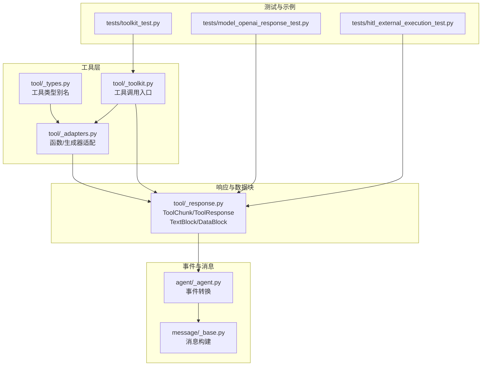
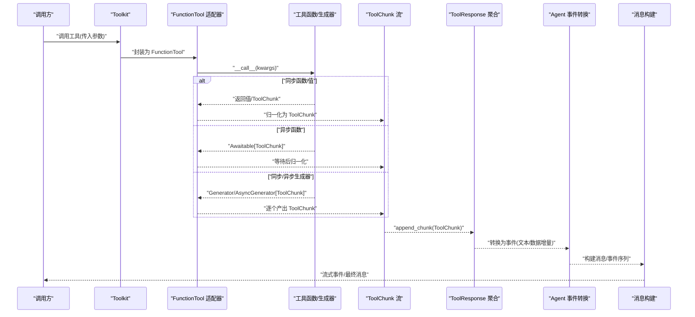
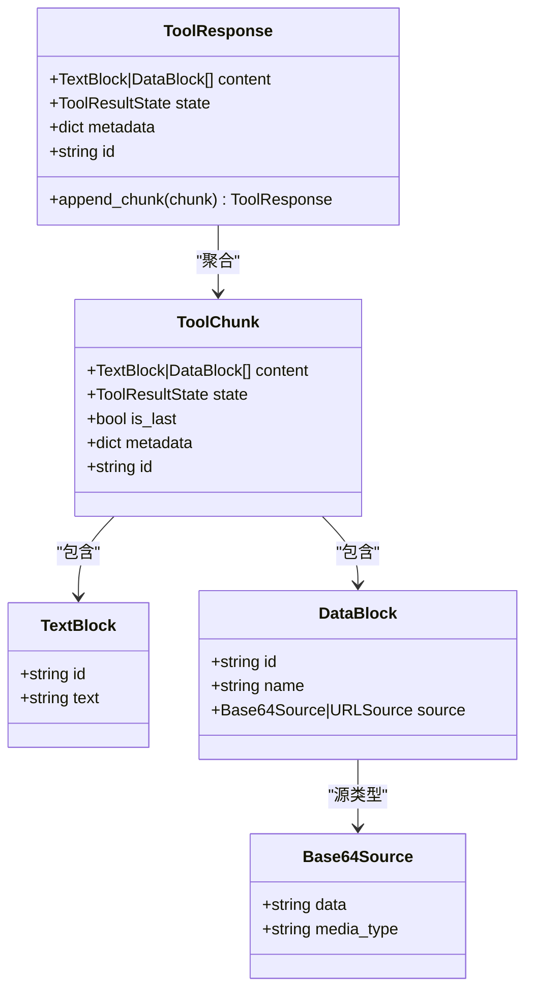
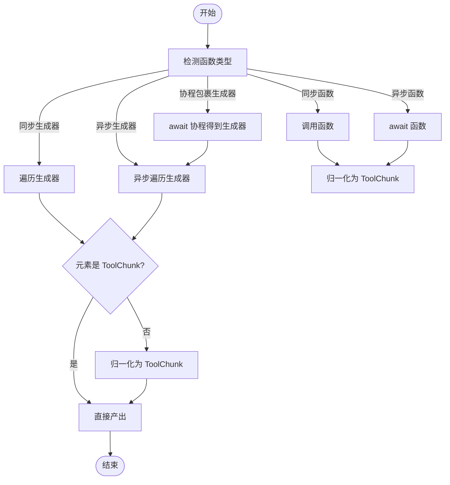
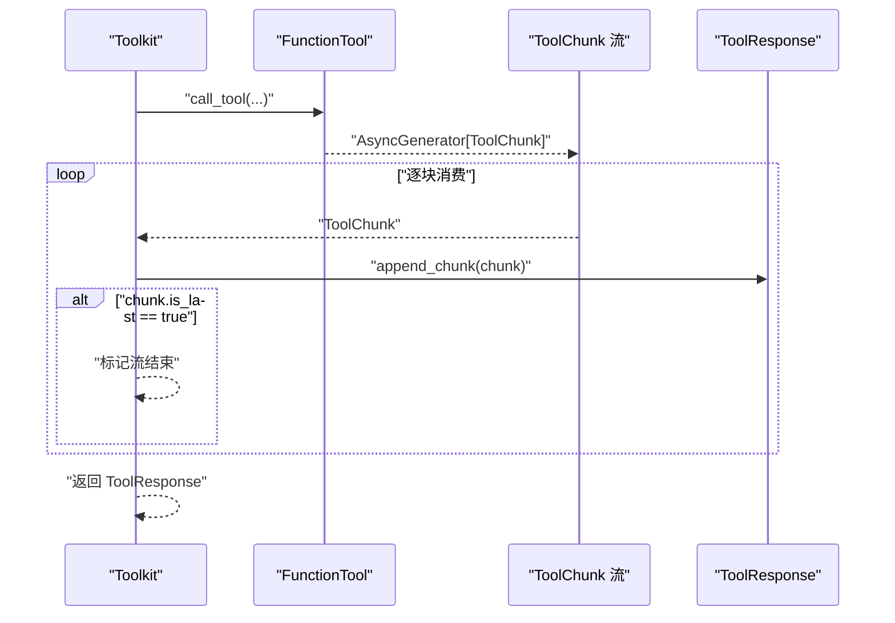
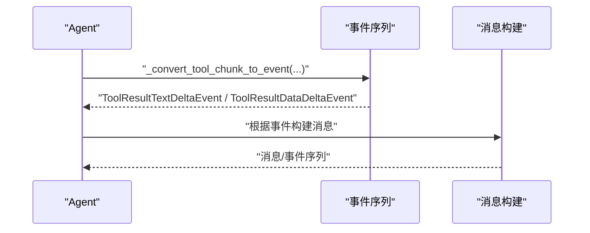
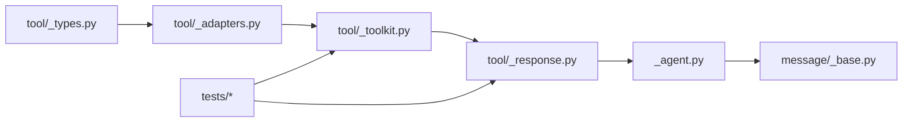

# 工具响应格式

<cite>
**本文引用的文件**
- [tool/_response.py](file://src/agentscope/tool/_response.py)
- [tool/_adapters.py](file://src/agentscope/tool/_adapters.py)
- [tool/_types.py](file://src/agentscope/tool/_types.py)
- [tool/_toolkit.py](file://src/agentscope/tool/_toolkit.py)
- [agent/_agent.py](file://src/agentscope/agent/_agent.py)
- [message/_base.py](file://src/agentscope/message/_base.py)
- [tests/toolkit_test.py](file://tests/toolkit_test.py)
- [tests/model_openai_response_test.py](file://tests/model_openai_response_test.py)
- [tests/hitl_external_execution_test.py](file://tests/hitl_external_execution_test.py)
</cite>

## 目录
1. [简介](#简介)
2. [项目结构](#项目结构)
3. [核心组件](#核心组件)
4. [架构总览](#架构总览)
5. [详细组件分析](#详细组件分析)
6. [依赖关系分析](#依赖关系分析)
7. [性能考量](#性能考量)
8. [故障排查指南](#故障排查指南)
9. [结论](#结论)
10. [附录](#附录)

## 简介
本文件系统性阐述 AgentScope 中“工具响应格式”的设计与实现，重点围绕 ToolChunk 类及其配套的 ToolResponse、数据块（TextBlock、DataBlock）以及状态机（ToolResultState），并结合异步生成器模式与工具调用的流式响应处理流程，给出标准化的数据结构、状态标识、错误处理机制与进度报告能力。文档同时提供同步响应、异步流式响应与错误响应等典型场景的实现要点与参考路径。

## 项目结构
与工具响应格式直接相关的核心模块与文件如下：
- 响应模型与数据块：tool/_response.py
- 工具适配与结果归一化：tool/_adapters.py
- 工具类型与签名：tool/_types.py
- 工具调用入口与流式聚合：tool/_toolkit.py
- 事件转换与消息构建：agent/_agent.py、message/_base.py
- 行为验证与示例：tests/toolkit_test.py、tests/model_openai_response_test.py、tests/hitl_external_execution_test.py

图表来源
- [tool/_adapters.py](file://src/agentscope/tool/_adapters.py)
- [tool/_types.py](file://src/agentscope/tool/_types.py)
- [tool/_toolkit.py](file://src/agentscope/tool/_toolkit.py)
- [tool/_response.py](file://src/agentscope/tool/_response.py)
- [agent/_agent.py](file://src/agentscope/agent/_agent.py)
- [message/_base.py](file://src/agentscope/message/_base.py)
- [tests/toolkit_test.py](file://tests/toolkit_test.py)
- [tests/model_openai_response_test.py](file://tests/model_openai_response_test.py)
- [tests/hitl_external_execution_test.py](file://tests/hitl_external_execution_test.py)

章节来源
- [tool/_response.py](file://src/agentscope/tool/_response.py)
- [tool/_adapters.py](file://src/agentscope/tool/_adapters.py)
- [tool/_types.py](file://src/agentscope/tool/_types.py)
- [tool/_toolkit.py](file://src/agentscope/tool/_toolkit.py)
- [agent/_agent.py](file://src/agentscope/agent/_agent.py)
- [message/_base.py](file://src/agentscope/message/_base.py)
- [tests/toolkit_test.py](file://tests/toolkit_test.py)
- [tests/model_openai_response_test.py](file://tests/model_openai_response_test.py)
- [tests/hitl_external_execution_test.py](file://tests/hitl_external_execution_test.py)

## 核心组件
- ToolChunk：工具执行的增量响应单元，包含内容块列表、执行状态、是否最后一块、元数据与唯一标识。
- ToolResponse：工具执行的完整结果容器，支持将多个 ToolChunk 聚合为最终结果；内置合并策略（如连续文本块合并、同ID数据块合并）。
- 数据块：
  - TextBlock：文本内容块，支持增量拼接。
  - DataBlock：多模态数据块，当前支持 Base64 源，具备媒体类型与名称信息。
- 状态机（ToolResultState）：运行中（RUNNING）、成功（SUCCESS）、错误（ERROR）、拒绝（DENIED）、中断（INTERRUPTED）等。
- 异步生成器模式：工具可返回同步/异步函数、同步/异步生成器或协程包裹的生成器，统一通过适配器归一化为 ToolChunk 流。

章节来源
- [tool/_response.py](file://src/agentscope/tool/_response.py)
- [tool/_adapters.py](file://src/agentscope/tool/_adapters.py)
- [tool/_types.py](file://src/agentscope/tool/_types.py)

## 架构总览
下图展示从工具调用到事件转换再到消息构建的整体链路，体现流式响应的产生、聚合与消费过程。

图表来源
- [tool/_toolkit.py](file://src/agentscope/tool/_toolkit.py)
- [tool/_adapters.py](file://src/agentscope/tool/_adapters.py)
- [tool/_response.py](file://src/agentscope/tool/_response.py)
- [agent/_agent.py](file://src/agentscope/agent/_agent.py)
- [message/_base.py](file://src/agentscope/message/_base.py)

## 详细组件分析

### ToolChunk 设计与字段语义
- 字段与职责
  - content：内容块列表，元素为 TextBlock 或 DataBlock。同一多模态数据需保证相同 id 以便后续合并。
  - state：执行状态，默认 RUNNING，支持 SUCCESS/ERROR/DENIED/INTERRUPTED。
  - is_last：是否为流中的最后一块，用于指示完成信号。
  - metadata：供代理内部使用的元数据字典，避免二次解析。
  - id：块级唯一标识，便于跨组件追踪与关联。
- 关键行为
  - 与 ToolResponse 的 append_chunk 协作，按 id 合并同类型块，对连续 TextBlock 进行拼接，对 DataBlock 的 Base64 数据进行拼接并更新媒体类型/名称。
  - 状态传播：仅在更严重的情况下覆盖（例如 ERROR 优先于其他状态）。

图表来源
- [tool/_response.py](file://src/agentscope/tool/_response.py)

章节来源
- [tool/_response.py](file://src/agentscope/tool/_response.py)

### 异步生成器模式与适配
- 支持的工具签名
  - 同步函数/值：返回任意对象，适配器会将其序列化为 ToolChunk（字符串保持原样，非字符串尝试 JSON 序列化）。
  - 异步函数：返回 Awaitable，等待后同样归一化。
  - 同步/异步生成器：逐个产出 ToolChunk 或普通值，适配器自动归一化。
  - 协程包裹的生成器：先等待协程得到生成器，再逐块产出。
- 适配器职责
  - 统一输出为 AsyncGenerator[ToolChunk, None]，确保上层调用一致性。
  - 对非 ToolChunk 的中间产物进行归一化（字符串或 JSON 化文本块）。

图表来源
- [tool/_adapters.py](file://src/agentscope/tool/_adapters.py)
- [tool/_types.py](file://src/agentscope/tool/_types.py)

章节来源
- [tool/_adapters.py](file://src/agentscope/tool/_adapters.py)
- [tool/_types.py](file://src/agentscope/tool/_types.py)

### 工具调用与流式聚合
- Toolkit 调用流程
  - 接收 ToolCallBlock，委托给 FunctionTool 适配器执行。
  - 以异步迭代方式消费 ToolChunk 流，逐步调用 ToolResponse.append_chunk 进行聚合。
  - 当某块 is_last 为真时，表示流结束，最终结果可用。
- 合并策略
  - 同 id 的 DataBlock：Base64 数据拼接，媒体类型/名称取最新提供者。
  - 连续 TextBlock：直接拼接文本。
  - 不同类型但同 id：为避免冲突，复制新块并分配新 id。

图表来源
- [tool/_toolkit.py](file://src/agentscope/tool/_toolkit.py)
- [tool/_adapters.py](file://src/agentscope/tool/_adapters.py)
- [tool/_response.py](file://src/agentscope/tool/_response.py)

章节来源
- [tool/_toolkit.py](file://src/agentscope/tool/_toolkit.py)
- [tool/_response.py](file://src/agentscope/tool/_response.py)

### 事件转换与消息构建
- Agent 层将 ToolChunk 转换为事件序列，支持文本增量与数据增量两类事件。
- message/_base.py 根据事件类型构建消息体，包含 Thinking、DataBlock、ToolCall、ToolResult 等块的增量与结束事件。

图表来源
- [agent/_agent.py](file://src/agentscope/agent/_agent.py)
- [message/_base.py](file://src/agentscope/message/_base.py)

章节来源
- [agent/_agent.py](file://src/agentscope/agent/_agent.py)
- [message/_base.py](file://src/agentscope/message/_base.py)

### 错误处理与状态传播
- 状态优先级：ERROR > INTERRUPTED > DENIED > SUCCESS（仅在更严重情况下覆盖）。
- DataBlock 合并限制：仅支持 Base64 源拼接，若类型不一致或为 URL 源则抛出异常，避免数据损坏。
- 元数据保留：每块的 metadata 会合并到 ToolResponse，便于代理侧访问。

章节来源
- [tool/_response.py](file://src/agentscope/tool/_response.py)

### 响应类型与示例参考
- 同步响应
  - 场景：工具返回字符串或可 JSON 化对象。
  - 处理：适配器将其归一化为单个 ToolChunk（state 默认 RUNNING），随后由 Toolkit 聚合为 ToolResponse。
  - 参考路径：[tool/_adapters.py](file://src/agentscope/tool/_adapters.py)，[tests/toolkit_test.py](file://tests/toolkit_test.py)
- 异步流式响应
  - 场景：工具返回异步生成器，逐块产出 ToolChunk。
  - 处理：适配器包装为异步流，Toolkit 逐块 append_chunk，is_last 为真时结束。
  - 参考路径：[tool/_adapters.py](file://src/agentscope/tool/_adapters.py)，[tests/toolkit_test.py](file://tests/toolkit_test.py)
- 错误响应
  - 场景：工具执行失败或被拒绝。
  - 处理：ToolChunk.state 设置为 ERROR/DENIED/INTERRUPTED，ToolResponse 保留最严重状态；DataBlock 合并失败时抛出异常。
  - 参考路径：[tool/_response.py](file://src/agentscope/tool/_response.py)，[tests/toolkit_test.py](file://tests/toolkit_test.py)
- 多模态数据
  - 场景：文本与图片等混合输出。
  - 处理：DataBlock 使用相同 id 实现跨块拼接；连续 TextBlock 自动合并。
  - 参考路径：[tests/toolkit_test.py](file://tests/toolkit_test.py)

章节来源
- [tool/_adapters.py](file://src/agentscope/tool/_adapters.py)
- [tool/_response.py](file://src/agentscope/tool/_response.py)
- [tests/toolkit_test.py](file://tests/toolkit_test.py)

## 依赖关系分析
- 模块耦合
  - tool/_adapters.py 依赖 tool/_types.py 的函数签名定义，统一工具输入输出形态。
  - tool/_toolkit.py 依赖 tool/_adapters.py 与 tool/_response.py，负责调用与聚合。
  - agent/_agent.py 依赖 tool/_response.py 与 message/_base.py，负责事件转换与消息构建。
- 外部依赖
  - 测试用例展示了与 OpenAI Response 流式解析的集成，体现 ToolChunk 在外部流中的应用。
- 循环依赖
  - 未发现循环导入；各模块职责清晰，接口边界明确。

图表来源
- [tool/_types.py](file://src/agentscope/tool/_types.py)
- [tool/_adapters.py](file://src/agentscope/tool/_adapters.py)
- [tool/_toolkit.py](file://src/agentscope/tool/_toolkit.py)
- [tool/_response.py](file://src/agentscope/tool/_response.py)
- [agent/_agent.py](file://src/agentscope/agent/_agent.py)
- [message/_base.py](file://src/agentscope/message/_base.py)
- [tests/toolkit_test.py](file://tests/toolkit_test.py)
- [tests/model_openai_response_test.py](file://tests/model_openai_response_test.py)
- [tests/hitl_external_execution_test.py](file://tests/hitl_external_execution_test.py)

章节来源
- [tool/_types.py](file://src/agentscope/tool/_types.py)
- [tool/_adapters.py](file://src/agentscope/tool/_adapters.py)
- [tool/_toolkit.py](file://src/agentscope/tool/_toolkit.py)
- [tool/_response.py](file://src/agentscope/tool/_response.py)
- [agent/_agent.py](file://src/agentscope/agent/_agent.py)
- [message/_base.py](file://src/agentscope/message/_base.py)
- [tests/toolkit_test.py](file://tests/toolkit_test.py)
- [tests/model_openai_response_test.py](file://tests/model_openai_response_test.py)
- [tests/hitl_external_execution_test.py](file://tests/hitl_external_execution_test.py)

## 性能考量
- 流式处理优势：通过异步生成器逐块产出，降低内存峰值，提升交互延迟表现。
- 合并策略优化：连续 TextBlock 拼接与同 id DataBlock 合并减少消息体碎片，提高下游渲染效率。
- 序列化成本：非字符串值通过 JSON 序列化为文本块，建议工具侧尽量直接返回字符串或结构化对象以减少序列化开销。
- 并发场景：并发工具调用会产生多条 ToolChunk 流，需注意事件顺序与去重（基于 id）。

## 故障排查指南
- DataBlock 合并异常
  - 现象：合并时报错，提示不同源类型或 URL 源不可合并。
  - 处理：确保同一多模态数据块使用相同 id，并且均为 Base64 源；必要时在上游转换为 Base64。
  - 参考路径：[tool/_response.py](file://src/agentscope/tool/_response.py)
- 状态覆盖不符合预期
  - 现象：最终状态未按预期为 ERROR 或 DENIED。
  - 处理：确认各块的状态设置逻辑，遵循 ERROR > INTERRUPTED > DENIED > SUCCESS 的优先级。
  - 参考路径：[tool/_response.py](file://src/agentscope/tool/_response.py)
- 文本块未合并
  - 现象：连续文本块未自动拼接。
  - 处理：检查是否为不同 id 的文本块；合并规则仅针对连续且同类型块生效。
  - 参考路径：[tool/_response.py](file://src/agentscope/tool/_response.py)
- 事件缺失或乱序
  - 现象：消息中缺少 ToolResultTextDeltaEvent/ToolResultDataDeltaEvent。
  - 处理：确认 Agent 层的事件转换逻辑已启用；检查 is_last 标志与块 id 设置。
  - 参考路径：[agent/_agent.py](file://src/agentscope/agent/_agent.py)，[message/_base.py](file://src/agentscope/message/_base.py)

章节来源
- [tool/_response.py](file://src/agentscope/tool/_response.py)
- [agent/_agent.py](file://src/agentscope/agent/_agent.py)
- [message/_base.py](file://src/agentscope/message/_base.py)

## 结论
ToolChunk 作为 AgentScope 工具响应的核心抽象，通过标准化的数据块、状态机与异步生成器模式，实现了对同步/异步、单次/流式、文本/多模态等多种场景的一致化处理。配合 ToolResponse 的智能合并策略与 Agent 层的事件转换，能够高效地支撑工具调用的实时反馈与最终聚合。建议在实际工程中：
- 明确块 id 规范，确保多模态与增量输出的正确合并；
- 严格控制状态设置，避免状态覆盖导致的误判；
- 优先使用字符串或结构化对象，减少不必要的序列化；
- 在并发场景下关注事件顺序与幂等性。

## 附录
- 关键实现路径参考
  - ToolChunk 定义与 ToolResponse 合并：[tool/_response.py](file://src/agentscope/tool/_response.py)
  - 工具适配与归一化：[tool/_adapters.py](file://src/agentscope/tool/_adapters.py)
  - 工具类型签名：[tool/_types.py](file://src/agentscope/tool/_types.py)
  - 工具调用入口与聚合：[tool/_toolkit.py](file://src/agentscope/tool/_toolkit.py)
  - 事件转换与消息构建：[agent/_agent.py](file://src/agentscope/agent/_agent.py)，[message/_base.py](file://src/agentscope/message/_base.py)
  - 行为验证与示例：[tests/toolkit_test.py](file://tests/toolkit_test.py)，[tests/model_openai_response_test.py](file://tests/model_openai_response_test.py)，[tests/hitl_external_execution_test.py](file://tests/hitl_external_execution_test.py)