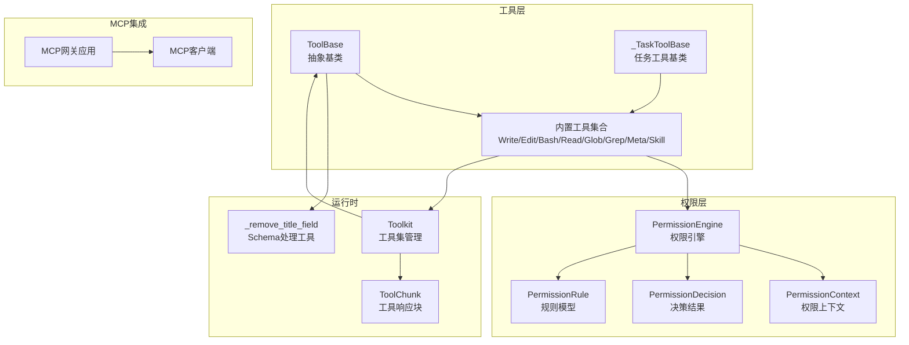
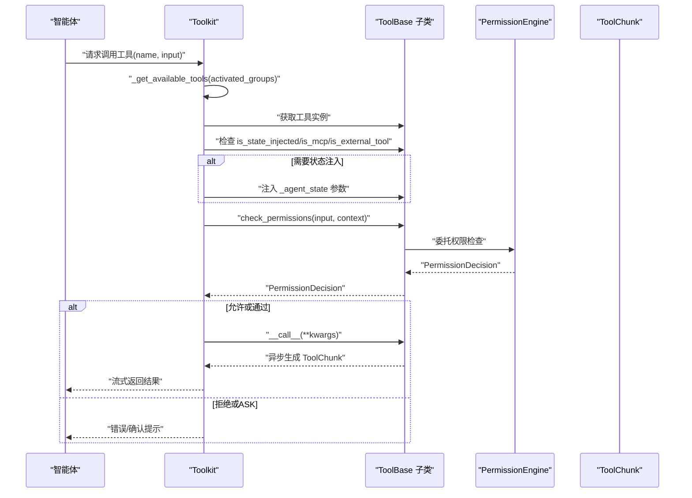
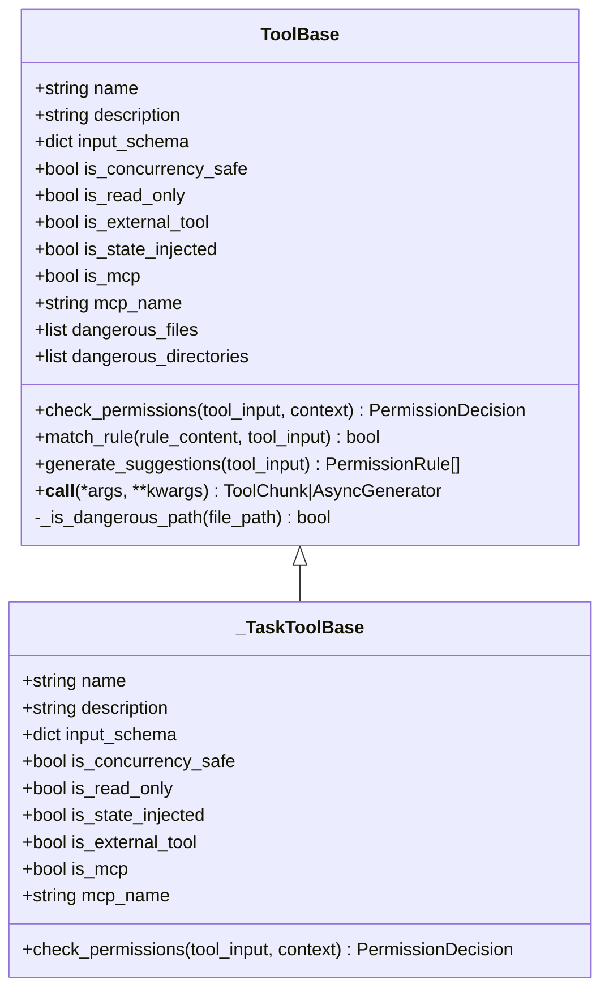
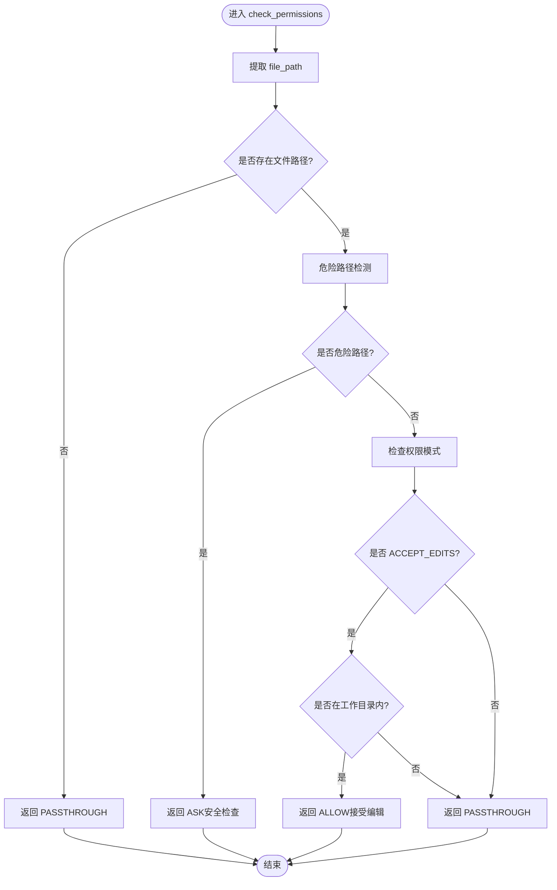
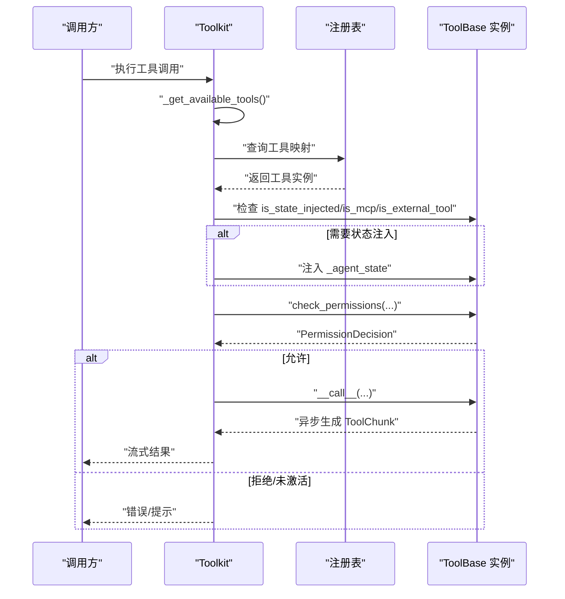
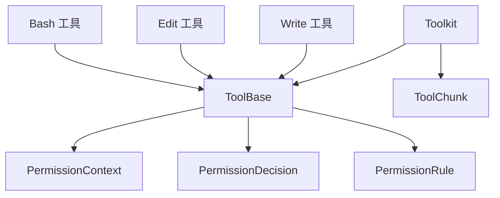

# 工具基类设计

<cite>
**本文引用的文件**
- [tool/_base.py](file://src/agentscope/tool/_base.py)
- [_task_tool_base.py](file://src/agentscope/tool/_task/_task_tool_base.py)
- [tool/_constants.py](file://src/agentscope/tool/_constants.py)
- [permission/_engine.py](file://src/agentscope/permission/_engine.py)
- [permission/_context.py](file://src/agentscope/permission/_context.py)
- [permission/_decision.py](file://src/agentscope/permission/_decision.py)
- [permission/_rule.py](file://src/agentscope/permission/_rule.py)
- [tool/_builtin/_write.py](file://src/agentscope/tool/_builtin/_write.py)
- [tool/_builtin/_edit.py](file://src/agentscope/tool/_builtin/_edit.py)
- [tool/_builtin/_bash.py](file://src/agentscope/tool/_builtin/_bash.py)
- [tool/_builtin/_read.py](file://src/agentscope/tool/_builtin/_read.py)
- [tool/_builtin/_glob.py](file://src/agentscope/tool/_builtin/_glob.py)
- [tool/_builtin/_grep.py](file://src/agentscope/tool/_builtin/_grep.py)
- [tool/_builtin/_meta.py](file://src/agentscope/tool/_builtin/_meta.py)
- [tool/_builtin/_skill.py](file://src/agentscope/tool/_builtin/_skill.py)
- [tool/_toolkit.py](file://src/agentscope/tool/_toolkit.py)
- [tool/_response.py](file://src/agentscope/tool/_response.py)
- [tool/_utils.py](file://src/agentscope/tool/_utils.py)
- [workspace/_mcp_gateway/_mcp_gateway_app.py](file://src/agentscope/workspace/_mcp_gateway/_mcp_gateway_app.py)
- [mcp/_mcp_client.py](file://src/agentscope/mcp/_mcp_client.py)
- [tests/permission_engine_test.py](file://tests/permission_engine_test.py)
- [tests/toolkit_test.py](file://tests/toolkit_test.py)
</cite>

## 目录
1. [简介](#简介)
2. [项目结构](#项目结构)
3. [核心组件](#核心组件)
4. [架构总览](#架构总览)
5. [详细组件分析](#详细组件分析)
6. [依赖分析](#依赖分析)
7. [性能考虑](#性能考虑)
8. [故障排查指南](#故障排查指南)
9. [结论](#结论)
10. [附录](#附录)

## 简介
本文件围绕 AgentScope 的工具基类设计进行系统化说明，重点阐述 ToolBase 抽象类的设计原则、工具属性定义（如 name、description、input_schema 等）、核心方法接口（如 check_permissions、__call__）的实现规范，并深入解析工具参数验证机制、JSON Schema 模式定义、权限检查流程、危险路径检测等安全机制。同时提供工具基类继承的最佳实践，包括必需属性设置、可选方法重写指导，以及工具状态注入和 MCP 工具支持的技术细节。

## 项目结构
AgentScope 的工具体系由“抽象基类 + 具体工具实现 + 权限引擎 + 工具集管理”构成，核心文件分布如下：
- 工具抽象与通用能力：tool/_base.py、tool/_task/_task_tool_base.py、tool/_constants.py、tool/_response.py、tool/_utils.py
- 权限控制：permission/_engine.py、permission/_context.py、permission/_decision.py、permission/_rule.py
- 内置工具：tool/_builtin/_write.py、tool/_builtin/_edit.py、tool/_builtin/_bash.py、tool/_builtin/_read.py、tool/_builtin/_glob.py、tool/_builtin/_grep.py、tool/_builtin/_meta.py、tool/_builtin/_skill.py
- 工具集与调用：tool/_toolkit.py
- MCP 支持：workspace/_mcp_gateway/_mcp_gateway_app.py、mcp/_mcp_client.py
- 测试：tests/permission_engine_test.py、tests/toolkit_test.py

图表来源
- [tool/_base.py:35-212](file://src/agentscope/tool/_base.py#L35-L212)
- [tool/_task/_task_tool_base.py:14-43](file://src/agentscope/tool/_task/_task_tool_base.py#L14-L43)
- [tool/_builtin/_write.py:91-167](file://src/agentscope/tool/_builtin/_write.py#L91-L167)
- [tool/_builtin/_edit.py:113-142](file://src/agentscope/tool/_builtin/_edit.py#L113-L142)
- [permission/_engine.py](file://src/agentscope/permission/_engine.py)
- [permission/_context.py](file://src/agentscope/permission/_context.py)
- [permission/_decision.py](file://src/agentscope/permission/_decision.py)
- [permission/_rule.py](file://src/agentscope/permission/_rule.py)
- [tool/_toolkit.py:293-306](file://src/agentscope/tool/_toolkit.py#L293-L306)
- [tool/_response.py](file://src/agentscope/tool/_response.py)
- [tool/_utils.py](file://src/agentscope/tool/_utils.py)
- [workspace/_mcp_gateway/_mcp_gateway_app.py](file://src/agentscope/workspace/_mcp_gateway/_mcp_gateway_app.py)
- [mcp/_mcp_client.py](file://src/agentscope/mcp/_mcp_client.py)

章节来源
- [tool/_base.py:35-212](file://src/agentscope/tool/_base.py#L35-L212)
- [tool/_task/_task_tool_base.py:14-43](file://src/agentscope/tool/_task/_task_tool_base.py#L14-L43)
- [tool/_constants.py](file://src/agentscope/tool/_constants.py)

## 核心组件
本节聚焦 ToolBase 抽象类及其派生类，梳理工具属性、方法接口与安全机制。

- 工具属性
  - name：向智能体展示的工具名称
  - description：面向智能体的工具描述
  - input_schema：遵循 JSON Schema 规范的输入模式定义
  - is_concurrency_safe：并发安全性标记
  - is_read_only：只读标记，用于权限检查
  - is_external_tool：外部工具标记，不强制实现 __call__
  - is_state_injected：是否需要注入 AgentState 到调用参数
  - is_mcp：是否为 MCP 工具
  - mcp_name：MCP 服务器名称（当 is_mcp=True 时必填）
  - dangerous_files / dangerous_directories：危险文件/目录列表，用于危险路径检测

- 核心方法
  - check_permissions(tool_input, context)：权限检查入口，返回 PermissionDecision
  - match_rule(rule_content, tool_input)：可选，细粒度规则匹配，默认仅支持工具名级规则
  - generate_suggestions(tool_input)：可选，生成建议规则（默认工具名级允许）
  - __call__(*args, **kwargs)：工具执行入口；若非外部工具则必须在子类实现，否则抛出异常

- 安全机制
  - 危险路径检测：基于文件名与路径段的大小写不敏感匹配，覆盖敏感文件与敏感目录
  - 权限决策：结合规则引擎与工作目录策略，确保安全检查不可绕过

章节来源
- [tool/_base.py:35-212](file://src/agentscope/tool/_base.py#L35-L212)
- [tool/_constants.py](file://src/agentscope/tool/_constants.py)

## 架构总览
下图展示了工具调用从 Toolkit 到具体工具再到权限引擎的整体流程，以及 MCP 工具的特殊处理路径。

图表来源
- [tool/_toolkit.py:293-306](file://src/agentscope/tool/_toolkit.py#L293-L306)
- [tool/_base.py:70-212](file://src/agentscope/tool/_base.py#L70-L212)
- [permission/_engine.py](file://src/agentscope/permission/_engine.py)
- [tool/_response.py](file://src/agentscope/tool/_response.py)

## 详细组件分析

### 抽象基类：ToolBase
- 设计要点
  - 使用抽象基类约束工具行为契约，统一工具属性与方法签名
  - 提供危险路径检测与 JSON Schema 处理工具，降低重复实现成本
  - 通过 is_external_tool、is_state_injected、is_mcp 等标志位支持多样化工具形态

- 关键接口说明
  - check_permissions：权限检查入口，子类可按需覆盖以实现细粒度控制
  - match_rule/generate_suggestions：为规则引擎提供匹配与建议能力
  - __call__：默认拒绝直接调用外部工具，子类需实现实际逻辑

- JSON Schema 与参数验证
  - input_schema 遵循 JSON Schema 规范，便于与大模型对接
  - 参数校验通过 PermissionEngine 与规则系统完成，ToolBase 提供基础安全检查

- 危险路径检测
  - 基于文件名与路径段的大小写不敏感匹配，覆盖敏感文件与敏感目录
  - 安全检查不可绕过，即使在 BYPASS 或 ACCEPT_EDITS 模式下亦适用

图表来源
- [tool/_base.py:35-212](file://src/agentscope/tool/_base.py#L35-L212)
- [tool/_task/_task_tool_base.py:14-43](file://src/agentscope/tool/_task/_task_tool_base.py#L14-L43)

章节来源
- [tool/_base.py:35-212](file://src/agentscope/tool/_base.py#L35-L212)
- [tool/_task/_task_tool_base.py:14-43](file://src/agentscope/tool/_task/_task_tool_base.py#L14-L43)

### 内置工具：Write 与 Edit 的权限检查
- Write 工具
  - 危险路径检测：对敏感文件与敏感目录进行安全检查，不可绕过
  - ACCEPT_EDITS 模式：仅在工作目录内且非危险路径时允许
  - 规则放行：未命中上述条件时返回 PASSTHROUGH，交由规则引擎判定

- Edit 工具
  - 同样具备危险路径检测与工作目录策略
  - 在无文件路径时返回 PASSTHROUGH，避免误判

图表来源
- [tool/_builtin/_write.py:91-167](file://src/agentscope/tool/_builtin/_write.py#L91-L167)
- [tool/_builtin/_edit.py:113-142](file://src/agentscope/tool/_builtin/_edit.py#L113-L142)

章节来源
- [tool/_builtin/_write.py:91-167](file://src/agentscope/tool/_builtin/_write.py#L91-L167)
- [tool/_builtin/_edit.py:113-142](file://src/agentscope/tool/_builtin/_edit.py#L113-L142)
- [tests/permission_engine_test.py:549-655](file://tests/permission_engine_test.py#L549-L655)

### 工具集管理：Toolkit 调用链与状态注入
- 工具可用性检查
  - 根据激活的工具组过滤可用工具
  - 若工具不存在或组未激活，抛出对应异常

- 状态注入与 MCP 处理
  - 当 is_state_injected 为真且非 MCP/外部工具时，自动注入 _agent_state
  - 外部工具与 MCP 工具不直接调用 __call__，由上层事件驱动

图表来源
- [tool/_toolkit.py:293-306](file://src/agentscope/tool/_toolkit.py#L293-L306)
- [tool/_toolkit.py:527-557](file://src/agentscope/tool/_toolkit.py#L527-L557)

章节来源
- [tool/_toolkit.py:293-306](file://src/agentscope/tool/_toolkit.py#L293-L306)
- [tool/_toolkit.py:527-557](file://src/agentscope/tool/_toolkit.py#L527-L557)

### MCP 工具支持
- 标志位与命名
  - is_mcp 标记为 MCP 工具，mcp_name 指定所属 MCP 服务器
- 运行时处理
  - MCP 工具不走本地 __call__，由 MCP 网关与客户端协同完成调用
  - Toolkit 在调用前识别 MCP 工具并跳过本地状态注入与直接调用

章节来源
- [tool/_base.py:57-61](file://src/agentscope/tool/_base.py#L57-L61)
- [workspace/_mcp_gateway/_mcp_gateway_app.py](file://src/agentscope/workspace/_mcp_gateway/_mcp_gateway_app.py)
- [mcp/_mcp_client.py](file://src/agentscope/mcp/_mcp_client.py)

## 依赖分析
- 组件耦合
  - ToolBase 与权限模块松耦合：通过 PermissionContext/Decision/Rule 传递信息
  - 内置工具对 ToolBase 的继承与覆写形成清晰扩展点
  - Toolkit 作为编排器，依赖工具注册表与权限引擎

- 外部依赖
  - JSON Schema 生成与处理依赖 pydantic
  - 工具响应采用异步生成器，提升交互体验

图表来源
- [tool/_base.py:11-19](file://src/agentscope/tool/_base.py#L11-L19)
- [tool/_toolkit.py:293-306](file://src/agentscope/tool/_toolkit.py#L293-L306)
- [tool/_builtin/_write.py:91-167](file://src/agentscope/tool/_builtin/_write.py#L91-L167)
- [tool/_builtin/_edit.py:113-142](file://src/agentscope/tool/_builtin/_edit.py#L113-L142)
- [tool/_builtin/_bash.py](file://src/agentscope/tool/_builtin/_bash.py)

章节来源
- [tool/_base.py:11-19](file://src/agentscope/tool/_base.py#L11-L19)
- [tool/_toolkit.py:293-306](file://src/agentscope/tool/_toolkit.py#L293-L306)

## 性能考虑
- 异步生成器返回工具结果，避免阻塞主线程，适合长耗时操作
- 危险路径检测为轻量字符串匹配，开销极低
- 规则匹配与权限决策在权限引擎中集中处理，减少重复计算
- 并发安全标记 is_concurrency_safe 可帮助上层优化调度策略

## 故障排查指南
- 工具未实现 __call__ 或被标记为外部工具
  - 现象：直接调用时报错
  - 排查：确认 is_external_tool 与子类实现
  - 参考：[tool/_base.py:197-212](file://src/agentscope/tool/_base.py#L197-L212)

- 工具不存在或组未激活
  - 现象：ToolNotFoundError/ToolGroupInactiveError
  - 排查：检查工具注册与激活组配置
  - 参考：[tool/_toolkit.py:527-557](file://src/agentscope/tool/_toolkit.py#L527-L557)

- 危险路径导致权限拒绝
  - 现象：ASK 行为，提示安全检查
  - 排查：确认文件路径是否命中危险文件/目录
  - 参考：[tool/_builtin/_write.py:121-128](file://src/agentscope/tool/_builtin/_write.py#L121-L128)、[tests/permission_engine_test.py:549-655](file://tests/permission_engine_test.py#L549-L655)

- 状态注入失败
  - 现象：工具无法接收 _agent_state
  - 排查：确认 is_state_injected 与调用路径
  - 参考：[tool/_toolkit.py:293-306](file://src/agentscope/tool/_toolkit.py#L293-L306)

章节来源
- [tool/_base.py:197-212](file://src/agentscope/tool/_base.py#L197-L212)
- [tool/_toolkit.py:527-557](file://src/agentscope/tool/_toolkit.py#L527-L557)
- [tool/_builtin/_write.py:121-128](file://src/agentscope/tool/_builtin/_write.py#L121-L128)
- [tests/permission_engine_test.py:549-655](file://tests/permission_engine_test.py#L549-L655)

## 结论
ToolBase 抽象类通过统一的属性与方法接口，结合权限引擎与安全检查机制，为 AgentScope 的工具体系提供了高内聚、低耦合的扩展框架。内置工具在该框架下实现了细粒度的安全控制与灵活的权限策略，而 Toolkit 则负责工具生命周期与调用编排。MCP 工具的支持进一步拓展了工具生态的边界。遵循本文最佳实践，开发者可以快速、安全地实现自定义工具。

## 附录

### 工具基类继承最佳实践
- 必备属性
  - 明确 name、description、input_schema（遵循 JSON Schema）
  - 根据工具特性设置 is_concurrency_safe、is_read_only
- 可选方法
  - 覆盖 match_rule 以支持细粒度规则匹配
  - 覆盖 generate_suggestions 以提供规则建议
- 安全与合规
  - 对涉及文件/命令/网络的工具，优先复用危险路径检测
  - 将敏感操作置于权限引擎控制之下
- 状态与 MCP
  - 需要访问 AgentState 时启用 is_state_injected
  - MCP 工具需设置 is_mcp 与 mcp_name，并避免本地 __call__ 实现

### JSON Schema 模式定义要点
- 使用 input_schema 描述输入参数类型、必填项与约束
- 通过 _ParamsBase 自定义参数模型，导出不含 title 字段的 Schema
- 与大模型对接时保持字段命名一致，避免歧义

### 权限检查流程要点
- 先进行安全检查（危险路径），再评估模式与规则
- 默认返回 PASSTHROUGH 以便规则引擎进一步判定
- 严格区分 BYPASS 与安全检查的不可绕过性