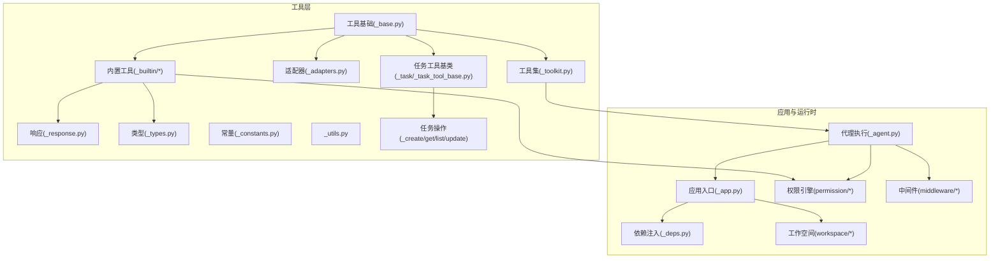
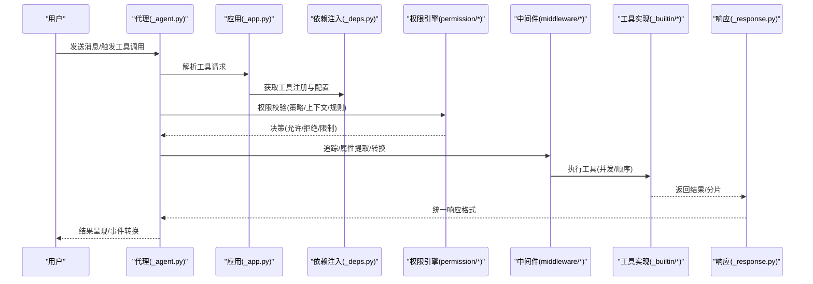
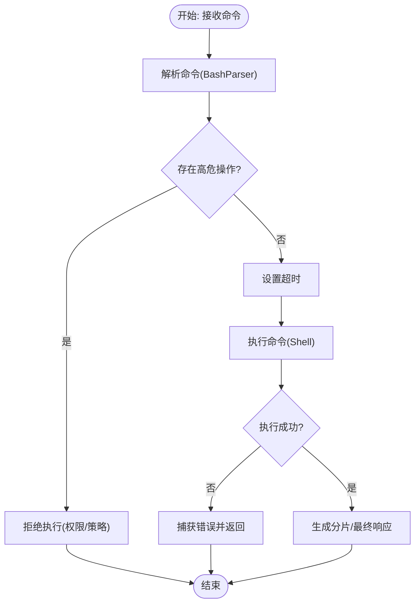
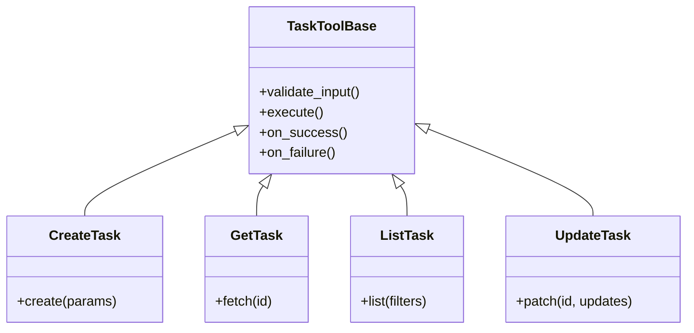
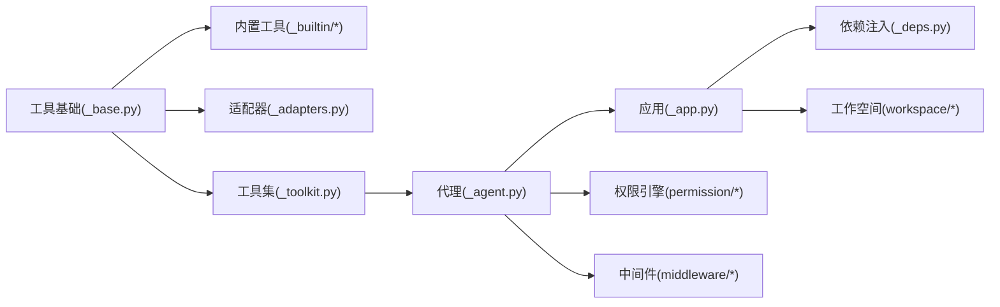

# 开发实例与最佳实践

<cite>
**本文引用的文件**
- [src/agentscope/tool/_base.py](file://src/agentscope/tool/_base.py)
- [src/agentscope/tool/_builtin/__init__.py](file://src/agentscope/tool/_builtin/__init__.py)
- [src/agentscope/tool/_builtin/_bash.py](file://src/agentscope/tool/_builtin/_bash.py)
- [src/agentscope/tool/_builtin/_bash_parser.py](file://src/agentscope/tool/_builtin/_bash_parser.py)
- [src/agentscope/tool/_builtin/_edit.py](file://src/agentscope/tool/_builtin/_edit.py)
- [src/agentscope/tool/_builtin/_glob.py](file://src/agentscope/tool/_builtin/_glob.py)
- [src/agentscope/tool/_builtin/_grep.py](file://src/agentscope/tool/_builtin/_grep.py)
- [src/agentscope/tool/_builtin/_meta.py](file://src/agentscope/tool/_builtin/_meta.py)
- [src/agentscope/tool/_builtin/_read.py](file://src/agentscope/tool/_builtin/_read.py)
- [src/agentscope/tool/_builtin/_skill.py](file://src/agentscope/tool/_builtin/_skill.py)
- [src/agentscope/tool/_builtin/_write.py](file://src/agentscope/tool/_builtin/_write.py)
- [src/agentscope/tool/_adapters.py](file://src/agentscope/tool/_adapters.py)
- [src/agentscope/tool/_response.py](file://src/agentscope/tool/_response.py)
- [src/agentscope/tool/_constants.py](file://src/agentscope/tool/_constants.py)
- [src/agentscope/tool/_types.py](file://src/agentscope/tool/_types.py)
- [src/agentscope/tool/_utils.py](file://src/agentscope/tool/_utils.py)
- [src/agentscope/tool/_toolkit.py](file://src/agentscope/tool/_toolkit.py)
- [src/agentscope/tool/_task/_task_tool_base.py](file://src/agentscope/tool/_task/_task_tool_base.py)
- [src/agentscope/tool/_task/_create_task.py](file://src/agentscope/tool/_task/_create_task.py)
- [src/agentscope/tool/_task/_get_task.py](file://src/agentscope/tool/_task/_get_task.py)
- [src/agentscope/tool/_task/_list_task.py](file://src/agentscope/tool/_task/_list_task.py)
- [src/agentscope/tool/_task/_update_task.py](file://src/agentscope/tool/_task/_update_task.py)
- [src/agentscope/agent/_agent.py](file://src/agentscope/agent/_agent.py)
- [src/agentscope/app/_app.py](file://src/agentscope/app/_app.py)
- [src/agentscope/app/_deps.py](file://src/agentscope/app/_deps.py)
- [src/agentscope/permission/_engine.py](file://src/agentscope/permission/_engine.py)
- [src/agentscope/permission/_context.py](file://src/agentscope/permission/_context.py)
- [src/agentscope/permission/_decision.py](file://src/agentscope/permission/_decision.py)
- [src/agentscope/permission/_rule.py](file://src/agentscope/permission/_rule.py)
- [src/agentscope/permission/_types.py](file://src/agentscope/permission/_types.py)
- [src/agentscope/middleware/_base.py](file://src/agentscope/middleware/_base.py)
- [src/agentscope/middleware/_tracing/_trace.py](file://src/agentscope/middleware/_tracing/_trace.py)
- [src/agentscope/middleware/_tracing/_converter.py](file://src/agentscope/middleware/_tracing/_converter.py)
- [src/agentscope/middleware/_tracing/_extractor.py](file://src/agentscope/middleware/_tracing/_extractor.py)
- [src/agentscope/middleware/_tracing/_setup.py](file://src/agentscope/middleware/_tracing/_setup.py)
- [src/agentscope/middleware/_tracing/_utils.py](file://src/agentscope/middleware/_tracing/_utils.py)
- [src/agentscope/workspace/_base.py](file://src/agentscope/workspace/_base.py)
- [src/agentscope/workspace/_local_workspace.py](file://src/agentscope/workspace/_local_workspace.py)
- [src/agentscope/workspace/_gateway_client.py](file://src/agentscope/workspace/_gateway_client.py)
- [src/agentscope/workspace/_offload_protocol.py](file://src/agentscope/workspace/_offload_protocol.py)
- [src/agentscope/workspace/_mcp_gateway/_mcp_gateway_app.py](file://src/agentscope/workspace/_mcp_gateway/_mcp_gateway_app.py)
- [src/agentscope/workspace/_mcp_gateway/__main__.py](file://src/agentscope/workspace/_mcp_gateway/__main__.py)
- [src/agentscope/workspace/_docker/_docker_workspace.py](file://src/agentscope/workspace/_docker/_docker_workspace.py)
- [src/agentscope/workspace/_e2b/_e2b_workspace.py](file://src/agentscope/workspace/_e2b/_e2b_workspace.py)
- [src/agentscope/workspace/_mcp_gateway/Dockerfile.install_pypi.template](file://src/agentscope/workspace/_mcp_gateway/Dockerfile.install_pypi.template)
- [src/agentscope/workspace/_mcp_gateway/Dockerfile.install_src.template](file://src/agentscope/workspace/_mcp_gateway/Dockerfile.install_src.template)
- [src/agentscope/workspace/_mcp_gateway/Dockerfile.node_copy.template](file://src/agentscope/workspace/_mcp_gateway/Dockerfile.node_copy.template)
- [src/agentscope/workspace/_mcp_gateway/Dockerfile.node_from.template](file://src/agentscope/workspace/_mcp_gateway/Dockerfile.node_from.template)
- [src/agentscope/workspace/_mcp_gateway/Dockerfile.template](file://src/agentscope/workspace/_mcp_gateway/Dockerfile.template)
- [src/agentscope/_version.py](file://src/agentscope/_version.py)
- [src/agentscope/_logging.py](file://src/agentscope/_logging.py)
- [src/agentscope/_utils/_common.py](file://src/agentscope/_utils/_common.py)
- [src/agentscope/_utils/_mixin.py](file://src/agentscope/_utils/_mixin.py)
- [tests/builtin_bash_test.py](file://tests/builtin_bash_test.py)
- [tests/builtin_edit_test.py](file://tests/builtin_edit_test.py)
- [tests/builtin_glob_test.py](file://tests/builtin_glob_test.py)
- [tests/builtin_grep_test.py](file://tests/builtin_grep_test.py)
- [tests/builtin_read_test.py](file://tests/builtin_read_test.py)
- [tests/builtin_write_test.py](file://tests/builtin_write_test.py)
- [examples/web_ui/frontend/src/components/chat/tool-renderers/BashRenderer.tsx](file://examples/web_ui/frontend/src/components/chat/tool-renderers/BashRenderer.tsx)
- [examples/web_ui/frontend/src/components/chat/tool-renderers/EditRenderer.tsx](file://examples/web_ui/frontend/src/components/chat/tool-renderers/EditRenderer.tsx)
- [examples/web_ui/frontend/src/components/chat/tool-renderers/GlobRenderer.tsx](file://examples/web_ui/frontend/src/components/chat/tool-renderers/GlobRenderer.tsx)
- [examples/web_ui/frontend/src/components/chat/tool-renderers/GrepRenderer.tsx](file://examples/web_ui/frontend/src/components/chat/tool-renderers/GrepRenderer.tsx)
- [examples/web_ui/frontend/src/components/chat/tool-renderers/ReadRenderer.tsx](file://examples/web_ui/frontend/src/components/chat/tool-renderers/ReadRenderer.tsx)
- [examples/web_ui/frontend/src/components/chat/tool-renderers/WriteRenderer.tsx](file://examples/web_ui/frontend/src/components/chat/tool-renderers/WriteRenderer.tsx)
- [examples/web_ui/frontend/src/components/chat/tool-renderers/DefaultRenderer.tsx](file://examples/web_ui/frontend/src/components/chat/tool-renderers/DefaultRenderer.tsx)
- [examples/web_ui/frontend/src/components/chat/tool-renderers/_shared.tsx](file://examples/web_ui/frontend/src/components/chat/tool-renderers/_shared.tsx)
- [examples/web_ui/frontend/src/components/chat/tool-renderers/types.ts](file://examples/web_ui/frontend/src/components/chat/tool-renderers/types.ts)
</cite>

## 目录
1. [引言](#引言)
2. [项目结构](#项目结构)
3. [核心组件](#核心组件)
4. [架构总览](#架构总览)
5. [详细组件分析](#详细组件分析)
6. [依赖关系分析](#依赖关系分析)
7. [性能考量](#性能考量)
8. [故障排查指南](#故障排查指南)
9. [结论](#结论)
10. [附录](#附录)

## 引言
本指南面向希望在AgentScope中开发自定义工具的工程师与研究者，系统梳理从简单到复杂的工具开发流程：需求分析、设计规划、代码实现、测试验证、部署集成，并总结最佳实践（代码组织、错误处理、性能优化、安全性考虑）。文档以内置工具（Bash、Read、Write、Edit、Glob、Grep等）为实例，展示不同类型的工具开发模式与技巧，帮助读者快速上手并构建高质量的工具生态。

## 项目结构
AgentScope的工具体系位于src/agentscope/tool目录下，包含基础抽象、内置工具、适配器、响应模型、常量与类型定义、任务型工具基类与具体实现等模块；同时配合权限引擎、中间件、工作空间与应用层进行集成。

图表来源
- [src/agentscope/tool/_base.py](file://src/agentscope/tool/_base.py)
- [src/agentscope/tool/_builtin/_bash.py](file://src/agentscope/tool/_builtin/_bash.py)
- [src/agentscope/tool/_builtin/_read.py](file://src/agentscope/tool/_builtin/_read.py)
- [src/agentscope/tool/_builtin/_write.py](file://src/agentscope/tool/_builtin/_write.py)
- [src/agentscope/tool/_builtin/_edit.py](file://src/agentscope/tool/_builtin/_edit.py)
- [src/agentscope/tool/_builtin/_glob.py](file://src/agentscope/tool/_builtin/_glob.py)
- [src/agentscope/tool/_builtin/_grep.py](file://src/agentscope/tool/_builtin/_grep.py)
- [src/agentscope/tool/_adapters.py](file://src/agentscope/tool/_adapters.py)
- [src/agentscope/tool/_response.py](file://src/agentscope/tool/_response.py)
- [src/agentscope/tool/_types.py](file://src/agentscope/tool/_types.py)
- [src/agentscope/tool/_constants.py](file://src/agentscope/tool/_constants.py)
- [src/agentscope/tool/_utils.py](file://src/agentscope/tool/_utils.py)
- [src/agentscope/tool/_toolkit.py](file://src/agentscope/tool/_toolkit.py)
- [src/agentscope/tool/_task/_task_tool_base.py](file://src/agentscope/tool/_task/_task_tool_base.py)
- [src/agentscope/tool/_task/_create_task.py](file://src/agentscope/tool/_task/_create_task.py)
- [src/agentscope/tool/_task/_get_task.py](file://src/agentscope/tool/_task/_get_task.py)
- [src/agentscope/tool/_task/_list_task.py](file://src/agentscope/tool/_task/_list_task.py)
- [src/agentscope/tool/_task/_update_task.py](file://src/agentscope/tool/_task/_update_task.py)
- [src/agentscope/agent/_agent.py](file://src/agentscope/agent/_agent.py)
- [src/agentscope/app/_app.py](file://src/agentscope/app/_app.py)
- [src/agentscope/app/_deps.py](file://src/agentscope/app/_deps.py)
- [src/agentscope/permission/_engine.py](file://src/agentscope/permission/_engine.py)
- [src/agentscope/middleware/_base.py](file://src/agentscope/middleware/_base.py)
- [src/agentscope/workspace/_base.py](file://src/agentscope/workspace/_base.py)

章节来源
- [src/agentscope/tool/_base.py](file://src/agentscope/tool/_base.py)
- [src/agentscope/tool/_builtin/__init__.py](file://src/agentscope/tool/_builtin/__init__.py)
- [src/agentscope/tool/_adapters.py](file://src/agentscope/tool/_adapters.py)
- [src/agentscope/tool/_response.py](file://src/agentscope/tool/_response.py)
- [src/agentscope/tool/_constants.py](file://src/agentscope/tool/_constants.py)
- [src/agentscope/tool/_types.py](file://src/agentscope/tool/_types.py)
- [src/agentscope/tool/_utils.py](file://src/agentscope/tool/_utils.py)
- [src/agentscope/tool/_toolkit.py](file://src/agentscope/tool/_toolkit.py)
- [src/agentscope/tool/_task/_task_tool_base.py](file://src/agentscope/tool/_task/_task_tool_base.py)
- [src/agentscope/agent/_agent.py](file://src/agentscope/agent/_agent.py)
- [src/agentscope/app/_app.py](file://src/agentscope/app/_app.py)
- [src/agentscope/app/_deps.py](file://src/agentscope/app/_deps.py)
- [src/agentscope/permission/_engine.py](file://src/agentscope/permission/_engine.py)
- [src/agentscope/middleware/_base.py](file://src/agentscope/middleware/_base.py)
- [src/agentscope/workspace/_base.py](file://src/agentscope/workspace/_base.py)

## 核心组件
- 工具基础与协议
  - 工具抽象与调用协议：定义工具的输入输出规范、执行生命周期、流式结果分片与最终响应等。
  - 关键职责：统一工具接口、支持并发/顺序执行、错误传播与恢复、结果压缩与事件转换。
- 内置工具族
  - 文件与文本类：Read、Write、Edit、Glob、Grep。
  - 系统命令类：Bash及其解析器。
  - 元数据与技能：Meta、Skill。
  - 任务型工具：基于TaskToolBase的创建、查询、列表、更新等。
- 工具适配器与工具集
  - 将外部服务或SDK适配为工具接口，便于统一调度与权限控制。
  - 工具集封装多个工具，支持按需组合与批量执行。
- 权限与安全
  - 权限引擎负责策略评估、上下文提取、决策生成与规则定义。
- 中间件与追踪
  - 提供工具调用链路的追踪、属性提取与转换，便于可观测性与审计。
- 应用与工作空间
  - 应用层注册工具、注入依赖、管理会话与工作区。
  - 工作空间支持本地、Docker、E2B与MCP网关等多种执行环境。

章节来源
- [src/agentscope/tool/_base.py](file://src/agentscope/tool/_base.py)
- [src/agentscope/tool/_builtin/_bash.py](file://src/agentscope/tool/_builtin/_bash.py)
- [src/agentscope/tool/_builtin/_read.py](file://src/agentscope/tool/_builtin/_read.py)
- [src/agentscope/tool/_builtin/_write.py](file://src/agentscope/tool/_builtin/_write.py)
- [src/agentscope/tool/_builtin/_edit.py](file://src/agentscope/tool/_builtin/_edit.py)
- [src/agentscope/tool/_builtin/_glob.py](file://src/agentscope/tool/_builtin/_glob.py)
- [src/agentscope/tool/_builtin/_grep.py](file://src/agentscope/tool/_builtin/_grep.py)
- [src/agentscope/tool/_builtin/_meta.py](file://src/agentscope/tool/_builtin/_meta.py)
- [src/agentscope/tool/_builtin/_skill.py](file://src/agentscope/tool/_builtin/_skill.py)
- [src/agentscope/tool/_adapters.py](file://src/agentscope/tool/_adapters.py)
- [src/agentscope/tool/_toolkit.py](file://src/agentscope/tool/_toolkit.py)
- [src/agentscope/tool/_task/_task_tool_base.py](file://src/agentscope/tool/_task/_task_tool_base.py)
- [src/agentscope/permission/_engine.py](file://src/agentscope/permission/_engine.py)
- [src/agentscope/middleware/_base.py](file://src/agentscope/middleware/_base.py)
- [src/agentscope/workspace/_base.py](file://src/agentscope/workspace/_base.py)

## 架构总览
AgentScope的工具执行链路由代理触发，经应用层注册与依赖注入，进入权限校验与中间件追踪，随后由工具执行器选择合适的工具实现，最后返回结果并进行事件转换与压缩。

图表来源
- [src/agentscope/agent/_agent.py](file://src/agentscope/agent/_agent.py)
- [src/agentscope/app/_app.py](file://src/agentscope/app/_app.py)
- [src/agentscope/app/_deps.py](file://src/agentscope/app/_deps.py)
- [src/agentscope/permission/_engine.py](file://src/agentscope/permission/_engine.py)
- [src/agentscope/middleware/_base.py](file://src/agentscope/middleware/_base.py)
- [src/agentscope/tool/_builtin/_bash.py](file://src/agentscope/tool/_builtin/_bash.py)
- [src/agentscope/tool/_response.py](file://src/agentscope/tool/_response.py)

## 详细组件分析

### 工具基础与协议（ToolBase）
- 职责与接口
  - 定义工具的输入参数、输出结构、执行方法、流式分片与最终响应类型。
  - 支持异步执行、并发/顺序调度、错误传播与状态管理。
- 设计要点
  - 输入/输出Schema化，便于权限校验与UI渲染。
  - 流式结果分片用于长耗时工具的增量反馈。
  - 统一的响应包装，保证上层一致性处理。
- 复杂度与性能
  - 执行时间取决于具体工具实现；分片机制降低等待时间，提升交互体验。
- 错误处理
  - 明确异常类型与错误码，结合权限引擎进行分级处理。
- 安全性
  - 通过Schema与权限策略限制危险参数与操作范围。

章节来源
- [src/agentscope/tool/_base.py](file://src/agentscope/tool/_base.py)
- [src/agentscope/tool/_response.py](file://src/agentscope/tool/_response.py)
- [src/agentscope/tool/_types.py](file://src/agentscope/tool/_types.py)
- [src/agentscope/tool/_constants.py](file://src/agentscope/tool/_constants.py)

### Bash工具（系统命令执行）
- 功能概述
  - 提供通用Shell命令执行能力，强调优先使用专用工具（如Glob、Grep、Read、Write、Edit）以获得更好的用户体验与权限审查。
- 关键特性
  - 命令超时控制、工作目录维护、路径转义与安全提示。
  - 与BashParser协作，解析命令行参数与潜在风险。
- 最佳实践
  - 避免直接使用find/cat/head/tail/sed/awk/echo等命令，优先使用专用工具。
  - 使用绝对路径避免cd带来的状态漂移。
  - 合理设置超时，防止长时间阻塞。
- 安全性
  - 严格限制可执行命令集合与参数范围，结合权限策略。
  - 对含空格路径进行双引号转义。

图表来源
- [src/agentscope/tool/_builtin/_bash.py](file://src/agentscope/tool/_builtin/_bash.py)
- [src/agentscope/tool/_builtin/_bash_parser.py](file://src/agentscope/tool/_builtin/_bash_parser.py)
- [src/agentscope/permission/_engine.py](file://src/agentscope/permission/_engine.py)

章节来源
- [src/agentscope/tool/_builtin/_bash.py](file://src/agentscope/tool/_builtin/_bash.py)
- [src/agentscope/tool/_builtin/_bash_parser.py](file://src/agentscope/tool/_builtin/_bash_parser.py)
- [tests/builtin_bash_test.py](file://tests/builtin_bash_test.py)

### Read工具（文件读取）
- 功能概述
  - 读取指定文件内容，支持路径匹配与大小限制。
- 关键特性
  - 路径白名单/黑名单策略、大小上限控制、编码检测与错误处理。
- 最佳实践
  - 优先使用Glob定位目标文件，再用Read读取，确保最小权限与可审计性。
  - 对大文件采用分块读取与压缩策略，避免内存压力。
- UI渲染
  - 前端提供ReadRenderer，支持富文本展示与复制。

章节来源
- [src/agentscope/tool/_builtin/_read.py](file://src/agentscope/tool/_builtin/_read.py)
- [tests/builtin_read_test.py](file://tests/builtin_read_test.py)
- [examples/web_ui/frontend/src/components/chat/tool-renderers/ReadRenderer.tsx](file://examples/web_ui/frontend/src/components/chat/tool-renderers/ReadRenderer.tsx)

### Write工具（文件写入）
- 功能概述
  - 将内容写入指定文件，支持覆盖与追加模式。
- 关键特性
  - 路径与内容长度校验、原子写入与回滚策略。
- 最佳实践
  - 仅在必要时使用Write，优先Edit进行增量修改。
  - 对敏感文件采用只读保护与权限校验。
- UI渲染
  - 前端提供WriteRenderer，展示写入摘要与确认流程。

章节来源
- [src/agentscope/tool/_builtin/_write.py](file://src/agentscope/tool/_builtin/_write.py)
- [tests/builtin_write_test.py](file://tests/builtin_write_test.py)
- [examples/web_ui/frontend/src/components/chat/tool-renderers/WriteRenderer.tsx](file://examples/web_ui/frontend/src/components/chat/tool-renderers/WriteRenderer.tsx)

### Edit工具（文件编辑）
- 功能概述
  - 在不破坏原文件的前提下进行内容替换与插入。
- 关键特性
  - 正则/字符串替换、上下文保留、冲突检测与回滚。
- 最佳实践
  - 使用精确的匹配模式，避免全局替换导致的副作用。
  - 编辑前先Read预览，编辑后Write保存，形成闭环。
- UI渲染
  - 前端提供EditRenderer，展示差异对比与确认对话框。

章节来源
- [src/agentscope/tool/_builtin/_edit.py](file://src/agentscope/tool/_builtin/_edit.py)
- [tests/builtin_edit_test.py](file://tests/builtin_edit_test.py)
- [examples/web_ui/frontend/src/components/chat/tool-renderers/EditRenderer.tsx](file://examples/web_ui/frontend/src/components/chat/tool-renderers/EditRenderer.tsx)

### Glob工具（文件搜索）
- 功能概述
  - 基于通配符搜索文件，替代find/ls等命令。
- 关键特性
  - 支持多模式匹配、深度限制、排除规则、结果排序。
- 最佳实践
  - 优先使用Glob定位文件，再用Read/Grep处理内容，提高可审计性。
- UI渲染
  - 前端提供GlobRenderer，展示文件树与筛选选项。

章节来源
- [src/agentscope/tool/_builtin/_glob.py](file://src/agentscope/tool/_builtin/_glob.py)
- [tests/builtin_glob_test.py](file://tests/builtin_glob_test.py)
- [examples/web_ui/frontend/src/components/chat/tool-renderers/GlobRenderer.tsx](file://examples/web_ui/frontend/src/components/chat/tool-renderers/GlobRenderer.tsx)

### Grep工具（内容搜索）
- 功能概述
  - 在文件中搜索匹配模式，支持正则表达式与上下文行数。
- 关键特性
  - 多文件并行搜索、结果聚合、高亮与截断策略。
- 最佳实践
  - 限定搜索范围（通过Glob先行过滤），避免全盘扫描。
  - 对大文件采用分块读取与流式输出。
- UI渲染
  - 前端提供GrepRenderer，展示匹配高亮与跳转链接。

章节来源
- [src/agentscope/tool/_builtin/_grep.py](file://src/agentscope/tool/_builtin/_grep.py)
- [tests/builtin_grep_test.py](file://tests/builtin_grep_test.py)
- [examples/web_ui/frontend/src/components/chat/tool-renderers/GrepRenderer.tsx](file://examples/web_ui/frontend/src/components/chat/tool-renderers/GrepRenderer.tsx)

### Meta与Skill工具（元信息与技能）
- Meta工具
  - 提供工具元数据查询与版本信息，辅助工具发现与兼容性检查。
- Skill工具
  - 将本地或远程技能封装为工具，便于统一调度与权限控制。
- 最佳实践
  - Meta用于工具清单与版本管理；Skill用于能力扩展与插件化。

章节来源
- [src/agentscope/tool/_builtin/_meta.py](file://src/agentscope/tool/_builtin/_meta.py)
- [src/agentscope/tool/_builtin/_skill.py](file://src/agentscope/tool/_builtin/_skill.py)

### 任务型工具（Task工具族）
- 基类与职责
  - TaskToolBase定义任务工具的通用行为：输入校验、状态机、并发控制、结果归并。
- 具体实现
  - 创建任务、查询任务、列出任务、更新任务。
- 最佳实践
  - 任务状态机清晰，支持暂停/恢复/重试。
  - 并发执行时注意资源竞争与幂等性。

图表来源
- [src/agentscope/tool/_task/_task_tool_base.py](file://src/agentscope/tool/_task/_task_tool_base.py)
- [src/agentscope/tool/_task/_create_task.py](file://src/agentscope/tool/_task/_create_task.py)
- [src/agentscope/tool/_task/_get_task.py](file://src/agentscope/tool/_task/_get_task.py)
- [src/agentscope/tool/_task/_list_task.py](file://src/agentscope/tool/_task/_list_task.py)
- [src/agentscope/tool/_task/_update_task.py](file://src/agentscope/tool/_task/_update_task.py)

章节来源
- [src/agentscope/tool/_task/_task_tool_base.py](file://src/agentscope/tool/_task/_task_tool_base.py)
- [src/agentscope/tool/_task/_create_task.py](file://src/agentscope/tool/_task/_create_task.py)
- [src/agentscope/tool/_task/_get_task.py](file://src/agentscope/tool/_task/_get_task.py)
- [src/agentscope/tool/_task/_list_task.py](file://src/agentscope/tool/_task/_list_task.py)
- [src/agentscope/tool/_task/_update_task.py](file://src/agentscope/tool/_task/_update_task.py)

### 工具适配器与工具集
- 适配器
  - 将第三方服务或SDK封装为工具接口，屏蔽底层差异。
- 工具集
  - 将多个工具组合为逻辑单元，支持批量执行与依赖编排。
- 最佳实践
  - 适配器内部保持幂等与可重试；工具集内明确依赖关系与错误传播。

章节来源
- [src/agentscope/tool/_adapters.py](file://src/agentscope/tool/_adapters.py)
- [src/agentscope/tool/_toolkit.py](file://src/agentscope/tool/_toolkit.py)

### 权限与安全
- 权限引擎
  - 策略定义、上下文提取、决策生成与规则评估。
- 上下文与规则
  - 基于调用者身份、工具类型、参数内容与目标资源建立访问矩阵。
- 最佳实践
  - 默认拒绝（最小权限）、显式授权（白名单）、细粒度控制（参数级限制）。

章节来源
- [src/agentscope/permission/_engine.py](file://src/agentscope/permission/_engine.py)
- [src/agentscope/permission/_context.py](file://src/agentscope/permission/_context.py)
- [src/agentscope/permission/_decision.py](file://src/agentscope/permission/_decision.py)
- [src/agentscope/permission/_rule.py](file://src/agentscope/permission/_rule.py)
- [src/agentscope/permission/_types.py](file://src/agentscope/permission/_types.py)

### 中间件与追踪
- 追踪链路
  - 属性提取、格式转换、链路追踪与可观测性增强。
- 最佳实践
  - 保留必要的调用上下文，避免泄露敏感信息；对大对象进行采样或压缩。

章节来源
- [src/agentscope/middleware/_base.py](file://src/agentscope/middleware/_base.py)
- [src/agentscope/middleware/_tracing/_trace.py](file://src/agentscope/middleware/_tracing/_trace.py)
- [src/agentscope/middleware/_tracing/_converter.py](file://src/agentscope/middleware/_tracing/_converter.py)
- [src/agentscope/middleware/_tracing/_extractor.py](file://src/agentscope/middleware/_tracing/_extractor.py)
- [src/agentscope/middleware/_tracing/_setup.py](file://src/agentscope/middleware/_tracing/_setup.py)
- [src/agentscope/middleware/_tracing/_utils.py](file://src/agentscope/middleware/_tracing/_utils.py)

### 应用与工作空间
- 应用层
  - 注册工具、注入依赖、管理会话与工作区；支持工具离线/在线执行。
- 工作空间
  - 本地、Docker、E2B与MCP网关等多执行环境，支持沙箱隔离与资源编排。

章节来源
- [src/agentscope/app/_app.py](file://src/agentscope/app/_app.py)
- [src/agentscope/app/_deps.py](file://src/agentscope/app/_deps.py)
- [src/agentscope/workspace/_base.py](file://src/agentscope/workspace/_base.py)
- [src/agentscope/workspace/_local_workspace.py](file://src/agentscope/workspace/_local_workspace.py)
- [src/agentscope/workspace/_gateway_client.py](file://src/agentscope/workspace/_gateway_client.py)
- [src/agentscope/workspace/_offload_protocol.py](file://src/agentscope/workspace/_offload_protocol.py)
- [src/agentscope/workspace/_mcp_gateway/_mcp_gateway_app.py](file://src/agentscope/workspace/_mcp_gateway/_mcp_gateway_app.py)
- [src/agentscope/workspace/_mcp_gateway/__main__.py](file://src/agentscope/workspace/_mcp_gateway/__main__.py)
- [src/agentscope/workspace/_docker/_docker_workspace.py](file://src/agentscope/workspace/_docker/_docker_workspace.py)
- [src/agentscope/workspace/_e2b/_e2b_workspace.py](file://src/agentscope/workspace/_e2b/_e2b_workspace.py)

## 依赖关系分析
工具层与运行时层的耦合度较低，通过统一接口与适配器解耦第三方能力；权限与中间件横切关注点贯穿执行链路，确保安全与可观测性。

图表来源
- [src/agentscope/tool/_base.py](file://src/agentscope/tool/_base.py)
- [src/agentscope/tool/_builtin/_bash.py](file://src/agentscope/tool/_builtin/_bash.py)
- [src/agentscope/tool/_adapters.py](file://src/agentscope/tool/_adapters.py)
- [src/agentscope/tool/_toolkit.py](file://src/agentscope/tool/_toolkit.py)
- [src/agentscope/agent/_agent.py](file://src/agentscope/agent/_agent.py)
- [src/agentscope/app/_app.py](file://src/agentscope/app/_app.py)
- [src/agentscope/app/_deps.py](file://src/agentscope/app/_deps.py)
- [src/agentscope/permission/_engine.py](file://src/agentscope/permission/_engine.py)
- [src/agentscope/middleware/_base.py](file://src/agentscope/middleware/_base.py)
- [src/agentscope/workspace/_base.py](file://src/agentscope/workspace/_base.py)

章节来源
- [src/agentscope/tool/_base.py](file://src/agentscope/tool/_base.py)
- [src/agentscope/agent/_agent.py](file://src/agentscope/agent/_agent.py)
- [src/agentscope/app/_app.py](file://src/agentscope/app/_app.py)
- [src/agentscope/app/_deps.py](file://src/agentscope/app/_deps.py)
- [src/agentscope/permission/_engine.py](file://src/agentscope/permission/_engine.py)
- [src/agentscope/middleware/_base.py](file://src/agentscope/middleware/_base.py)
- [src/agentscope/workspace/_base.py](file://src/agentscope/workspace/_base.py)

## 性能考量
- 分片与流式输出
  - 对长耗时工具采用分片与增量返回，减少前端等待时间。
- 并发与队列
  - 合理设置并发度，避免资源争用；对IO密集型工具优先并发。
- 压缩与缓存
  - 对重复结果进行缓存；对大对象进行压缩传输。
- 超时与重试
  - 为外部依赖设置合理超时与指数退避重试。
- 资源隔离
  - 使用工作空间沙箱执行高风险工具，避免影响宿主系统。

## 故障排查指南
- 常见问题
  - 权限拒绝：检查策略是否允许该工具与参数组合。
  - 超时失败：调整超时阈值或拆分子任务。
  - 路径错误：确认相对/绝对路径与工作目录。
  - 编码问题：统一文件编码，避免乱码。
- 调试建议
  - 启用追踪日志，定位工具执行阶段。
  - 使用最小化输入复现问题，逐步扩大范围。
  - 对比前后端渲染差异，确认UI与工具结果一致性。
- 单元测试参考
  - 参考内置工具测试用例，编写对应场景的断言与边界测试。

章节来源
- [tests/builtin_bash_test.py](file://tests/builtin_bash_test.py)
- [tests/builtin_edit_test.py](file://tests/builtin_edit_test.py)
- [tests/builtin_glob_test.py](file://tests/builtin_glob_test.py)
- [tests/builtin_grep_test.py](file://tests/builtin_grep_test.py)
- [tests/builtin_read_test.py](file://tests/builtin_read_test.py)
- [tests/builtin_write_test.py](file://tests/builtin_write_test.py)

## 结论
通过内置工具的实现模式与运行时架构，AgentScope为自定义工具开发提供了清晰的范式：以ToolBase为核心抽象，结合权限与中间件保障安全与可观测性，利用适配器与工具集实现能力扩展与编排。遵循本文的最佳实践，开发者可以高效地完成从需求到上线的全流程，构建稳定、安全、高性能的工具生态。

## 附录
- 开发流程建议
  - 需求分析：明确输入/输出、边界条件、安全约束。
  - 设计规划：定义Schema、选择执行模型（同步/异步/流式）、确定权限策略。
  - 代码实现：遵循ToolBase接口，实现输入校验、执行逻辑、错误处理与分片。
  - 测试验证：覆盖正常/异常/边界场景，结合单测与集成测试。
  - 部署集成：注册到应用层，配置工作空间与权限策略，接入追踪与监控。
- UI渲染参考
  - 前端工具渲染器提供一致的交互体验，建议复用现有渲染器或扩展共享组件。