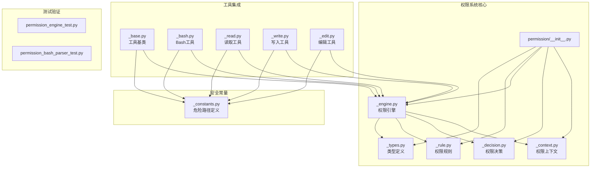
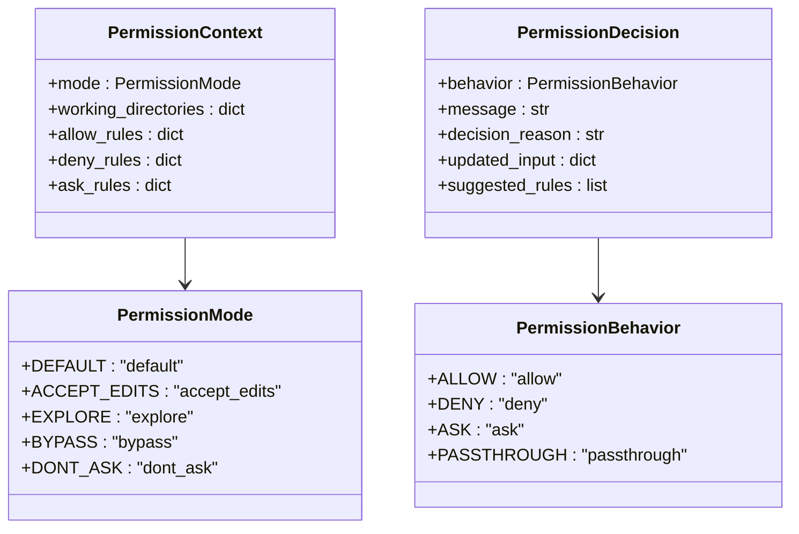
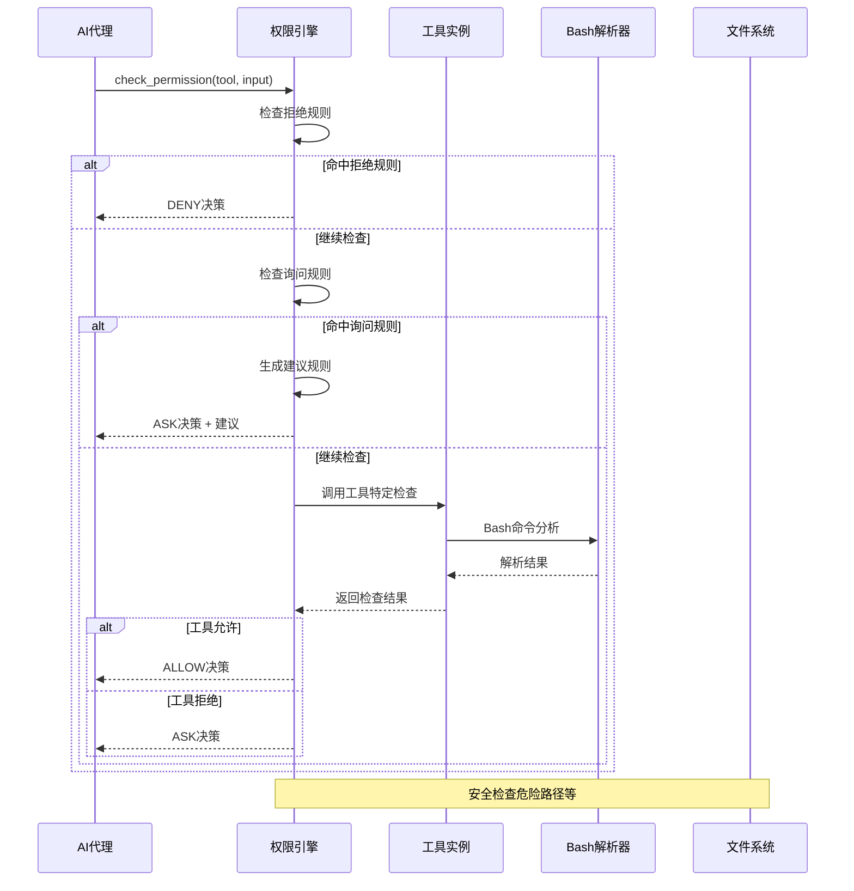
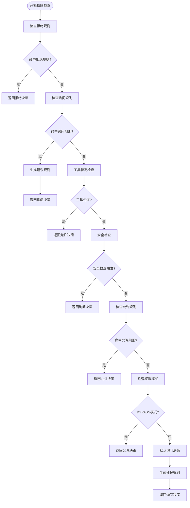
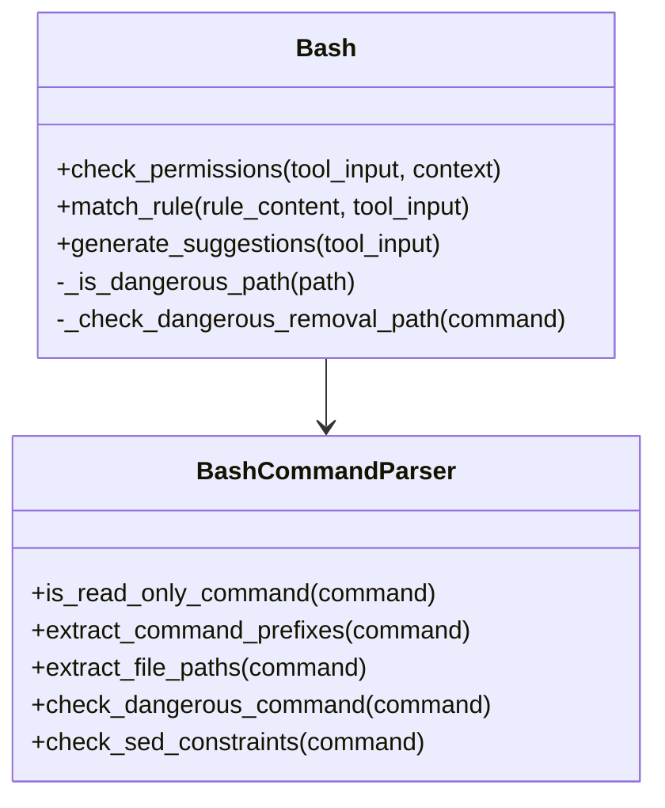
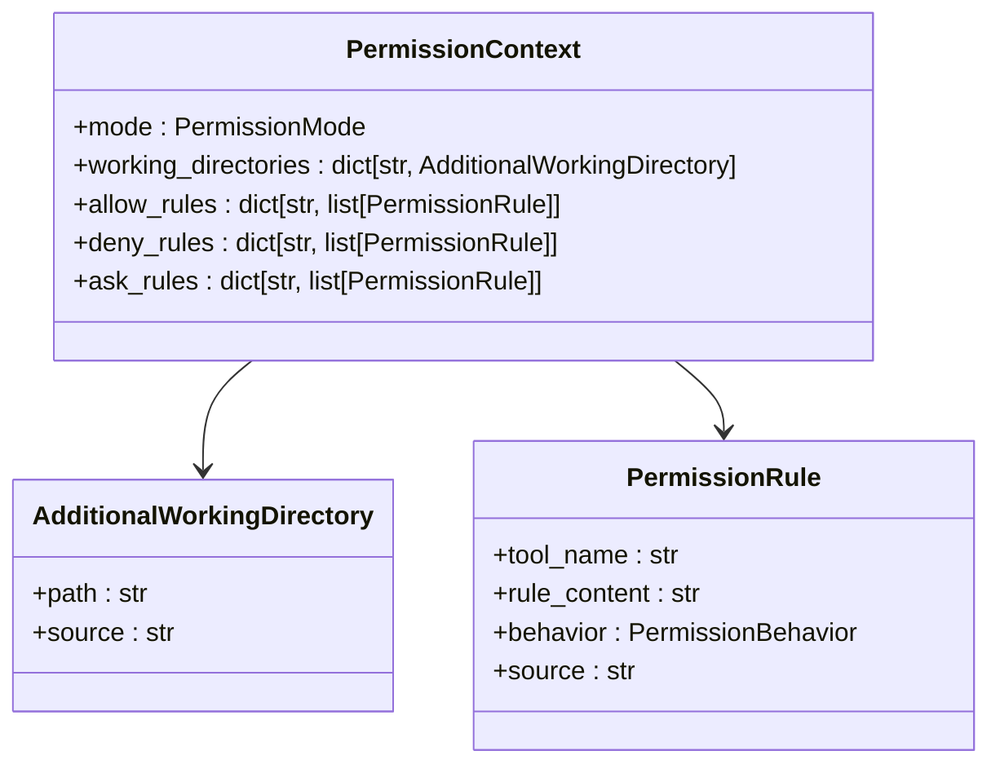
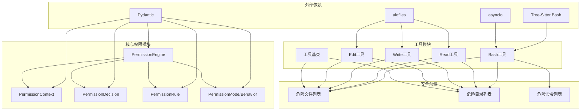

# 权限控制系统

<cite>
**本文档引用的文件**
- [permission/__init__.py](file://src/agentscope/permission/__init__.py)
- [permission/_context.py](file://src/agentscope/permission/_context.py)
- [permission/_decision.py](file://src/agentscope/permission/_decision.py)
- [permission/_engine.py](file://src/agentscope/permission/_engine.py)
- [permission/_rule.py](file://src/agentscope/permission/_rule.py)
- [permission/_types.py](file://src/agentscope/permission/_types.py)
- [tool/_base.py](file://src/agentscope/tool/_base.py)
- [_bash.py](file://src/agentscope/tool/_builtin/_bash.py)
- [_bash_parser.py](file://src/agentscope/tool/_builtin/_bash_parser.py)
- [_read.py](file://src/agentscope/tool/_builtin/_read.py)
- [_write.py](file://src/agentscope/tool/_builtin/_write.py)
- [_edit.py](file://src/agentscope/tool/_builtin/_edit.py)
- [_constants.py](file://src/agentscope/tool/_constants.py)
- [permission_engine_test.py](file://tests/permission_engine_test.py)
- [permission_bash_parser_test.py](file://tests/permission_bash_parser_test.py)
</cite>

## 目录
1. [简介](#简介)
2. [项目结构](#项目结构)
3. [核心组件](#核心组件)
4. [架构概览](#架构概览)
5. [详细组件分析](#详细组件分析)
6. [依赖关系分析](#依赖关系分析)
7. [性能考虑](#性能考虑)
8. [故障排除指南](#故障排除指南)
9. [结论](#结论)
10. [附录](#附录)

## 简介

AgentScope权限控制系统是一个基于规则的工具执行权限管理框架，旨在为AI代理在执行各种工具操作时提供细粒度的安全控制。该系统支持多种权限模式、规则匹配策略和安全检查机制，能够有效防止恶意或意外的操作。

系统的核心目标是：
- 提供多层安全防护，包括危险路径检测、命令注入检查等
- 支持灵活的权限规则配置，从粗粒度到细粒度的权限控制
- 实现智能的权限决策流程，平衡安全性与可用性
- 提供自动化的规则建议生成功能

## 项目结构

权限控制系统主要位于`src/agentscope/permission/`目录下，包含以下核心模块：



**图表来源**
- [permission/__init__.py:1-19](file://src/agentscope/permission/__init__.py#L1-L19)
- [permission/_engine.py:1-450](file://src/agentscope/permission/_engine.py#L1-L450)

**章节来源**
- [permission/__init__.py:1-19](file://src/agentscope/permission/__init__.py#L1-L19)
- [permission/_context.py:1-47](file://src/agentscope/permission/_context.py#L1-L47)
- [permission/_decision.py:1-32](file://src/agentscope/permission/_decision.py#L1-L32)
- [permission/_engine.py:1-450](file://src/agentscope/permission/_engine.py#L1-L450)
- [permission/_rule.py:1-37](file://src/agentscope/permission/_rule.py#L1-L37)
- [permission/_types.py:1-76](file://src/agentscope/permission/_types.py#L1-L76)

## 核心组件

### 权限模式系统

权限系统定义了五种不同的权限模式，每种模式都有特定的安全策略和行为：



**图表来源**
- [permission/_types.py:18-76](file://src/agentscope/permission/_types.py#L18-L76)
- [permission/_context.py:24-47](file://src/agentscope/permission/_context.py#L24-L47)
- [permission/_decision.py:10-32](file://src/agentscope/permission/_decision.py#L10-L32)

### 规则匹配机制

系统支持三种主要的规则匹配策略：

1. **Bash命令匹配**：使用通配符和前缀匹配
2. **文件路径匹配**：使用glob模式匹配
3. **通用匹配**：基于工具自定义的匹配逻辑

**章节来源**
- [permission/_engine.py:361-390](file://src/agentscope/permission/_engine.py#L361-L390)
- [permission/_rule.py:8-37](file://src/agentscope/permission/_rule.py#L8-L37)

## 架构概览

权限控制系统采用分层架构设计，确保安全性和可扩展性：



**图表来源**
- [permission/_engine.py:81-178](file://src/agentscope/permission/_engine.py#L81-L178)
- [_bash.py:181-320](file://src/agentscope/tool/_builtin/_bash.py#L181-L320)

## 详细组件分析

### 权限引擎（PermissionEngine）

权限引擎是整个系统的核心，负责协调所有权限检查逻辑：

#### 决策流程



**图表来源**
- [permission/_engine.py:81-178](file://src/agentscope/permission/_engine.py#L81-L178)

#### 关键方法实现

**check_permissions方法**：
- 实现完整的权限检查流程
- 遵循严格的优先级顺序：拒绝规则 > 询问规则 > 工具特定检查 > 允许规则 > 权限模式 > 默认询问
- 支持异步调用，适用于并发场景

**_rule_matches方法**：
- 实现智能的规则匹配逻辑
- 支持不同工具类型的特殊匹配策略
- 处理通配符、前缀匹配等复杂模式

**章节来源**
- [permission/_engine.py:81-450](file://src/agentscope/permission/_engine.py#L81-L450)

### 工具权限检查

#### Bash工具权限检查

Bash工具实现了最复杂的权限检查逻辑：



**图表来源**
- [_bash.py:181-320](file://src/agentscope/tool/_builtin/_bash.py#L181-L320)
- [_bash_parser.py:136-800](file://src/agentscope/tool/_builtin/_bash_parser.py#L136-L800)

**关键安全检查**：

1. **命令注入风险检查**：检测动态shell结构（命令替换、进程替换等）
2. **只读命令自动放行**：识别安全的只读操作
3. **危险命令模式检查**：阻止破坏性命令
4. **sed约束检查**：限制sed的危险用法
5. **危险路径检查**：保护敏感文件和目录
6. **系统级删除检查**：防止删除关键系统路径

**章节来源**
- [_bash.py:181-320](file://src/agentscope/tool/_builtin/_bash.py#L181-L320)
- [_bash_parser.py:596-800](file://src/agentscope/tool/_builtin/_bash_parser.py#L596-L800)

#### 文件操作工具权限检查

**Read工具**：
- 作为只读工具，主要用于探索模式
- 使用glob模式匹配文件路径
- 生成目录级别的权限建议

**Write工具**：
- 实现危险路径检测
- 支持工作目录内的自动放行
- 提供精确的文件路径匹配

**Edit工具**：
- 基于Write工具的权限检查
- 额外的字符串替换验证
- 严格的内容变更控制

**章节来源**
- [_read.py:89-135](file://src/agentscope/tool/_builtin/_read.py#L89-L135)
- [_write.py:91-147](file://src/agentscope/tool/_builtin/_write.py#L91-L147)
- [_edit.py:113-169](file://src/agentscope/tool/_builtin/_edit.py#L113-L169)

### 权限上下文管理

权限上下文负责维护当前的权限状态和配置：



**图表来源**
- [permission/_context.py:24-47](file://src/agentscope/permission/_context.py#L24-L47)
- [permission/_rule.py:8-37](file://src/agentscope/permission/_rule.py#L8-L37)

**章节来源**
- [permission/_context.py:9-47](file://src/agentscope/permission/_context.py#L9-L47)
- [permission/_rule.py:8-37](file://src/agentscope/permission/_rule.py#L8-L37)

## 依赖关系分析

权限控制系统具有清晰的模块化设计，各组件之间的依赖关系如下：



**图表来源**
- [_bash.py:1-23](file://src/agentscope/tool/_builtin/_bash.py#L1-L23)
- [_read.py:1-19](file://src/agentscope/tool/_builtin/_read.py#L1-L19)
- [_write.py:1-25](file://src/agentscope/tool/_builtin/_write.py#L1-L25)
- [_edit.py:1-24](file://src/agentscope/tool/_builtin/_edit.py#L1-L24)

**章节来源**
- [_bash.py:1-23](file://src/agentscope/tool/_builtin/_bash.py#L1-L23)
- [_read.py:1-19](file://src/agentscope/tool/_builtin/_read.py#L1-L19)
- [_write.py:1-25](file://src/agentscope/tool/_builtin/_write.py#L1-L25)
- [_edit.py:1-24](file://src/agentscope/tool/_builtin/_edit.py#L1-L24)

## 性能考虑

权限控制系统在设计时充分考虑了性能优化：

### 异步处理
- 所有权限检查都支持异步调用
- Bash工具的命令执行使用异步子进程管理
- 文件操作使用异步文件库减少阻塞

### 缓存机制
- 工具状态缓存避免重复读取
- 路径规范化结果缓存
- 规则匹配结果的短期缓存

### 内存优化
- 流式文件读取避免大文件内存占用
- 有限的规则数量限制
- 及时释放临时对象

### 并发安全
- 工具基类提供并发安全标识
- 状态管理器确保线程安全
- 异步锁保护共享资源

## 故障排除指南

### 常见问题及解决方案

**问题1：权限检查过于严格**
- 检查是否处于EXPLORE模式
- 添加适当的允许规则
- 调整权限模式设置

**问题2：Bash命令被错误拒绝**
- 检查命令是否包含危险模式
- 验证是否为只读命令
- 查看安全检查原因

**问题3：文件操作权限异常**
- 确认文件路径是否在工作目录内
- 检查危险路径列表配置
- 验证权限规则匹配逻辑

**问题4：规则不生效**
- 检查规则优先级顺序
- 验证规则内容格式
- 确认工具名称匹配

**章节来源**
- [permission_engine_test.py:1-946](file://tests/permission_engine_test.py#L1-L946)
- [permission_bash_parser_test.py:1-1318](file://tests/permission_bash_parser_test.py#L1-L1318)

## 结论

AgentScope权限控制系统通过多层次的安全防护、灵活的规则配置和智能的决策机制，为AI代理提供了全面的工具执行安全保障。系统的设计充分考虑了安全性、可用性和可扩展性，能够适应各种复杂的使用场景。

关键优势包括：
- **多层安全防护**：从规则匹配到具体工具检查的完整防护链
- **灵活的权限模式**：支持从严格到宽松的不同安全级别
- **智能规则建议**：自动化的规则生成减少配置负担
- **完善的测试覆盖**：全面的单元测试确保系统稳定性

## 附录

### 配置示例

**基础权限配置**：
```python
# 创建权限上下文
context = PermissionContext(
    mode=PermissionMode.DEFAULT,
    working_directories={
        "/home/user/project": AdditionalWorkingDirectory(
            path="/home/user/project",
            source="session"
        )
    }
)

# 创建权限引擎
engine = PermissionEngine(context)

# 添加规则
engine.add_rule(PermissionRule(
    tool_name="Bash",
    rule_content="git:*",
    behavior=PermissionBehavior.ALLOW,
    source="user"
))

engine.add_rule(PermissionRule(
    tool_name="Read",
    rule_content="/home/user/project/**",
    behavior=PermissionBehavior.ALLOW,
    source="user"
))
```

**高级安全配置**：
```python
# 自定义危险文件列表
custom_dangerous_files = [
    ".bashrc",
    ".ssh/config",
    ".env"
]

# 创建Bash工具实例
bash_tool = Bash(
    dangerous_files=custom_dangerous_files,
    dangerous_directories=[".git", ".ssh"]
)
```

### 最佳实践

1. **最小权限原则**：仅授予必要的权限
2. **分层防护**：结合多种安全检查机制
3. **定期审查**：定期审查和更新权限规则
4. **监控日志**：记录权限检查结果用于审计
5. **用户教育**：向用户提供权限控制的培训