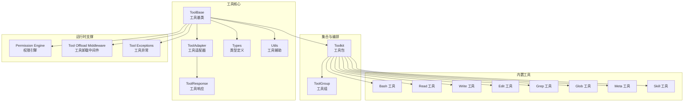
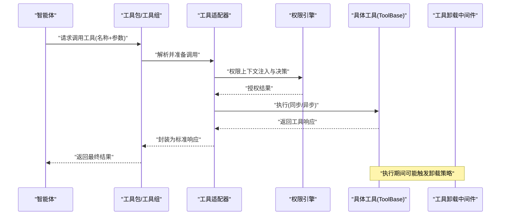
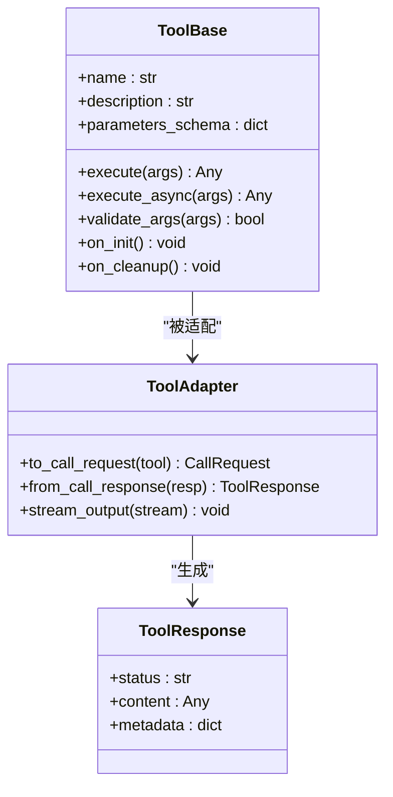
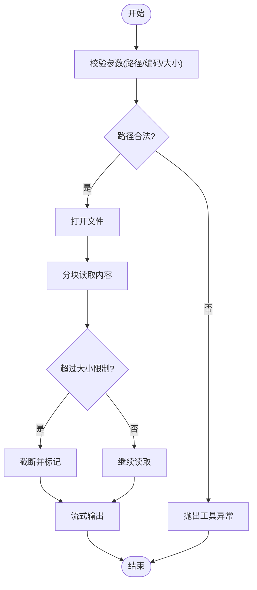
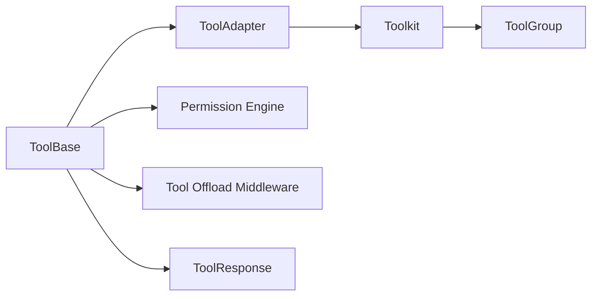

# 自定义工具开发

<cite>
**本文档引用的文件**
- [tool/_base.py](file://src/agentscope/tool/_base.py)
- [tool/__init__.py](file://src/agentscope/tool/__init__.py)
- [tool/_adapters.py](file://src/agentscope/tool/_adapters.py)
- [tool/_builtin/_bash.py](file://src/agentscope/tool/_builtin/_bash.py)
- [tool/_builtin/_read.py](file://src/agentscope/tool/_builtin/_read.py)
- [tool/_builtin/_write.py](file://src/agentscope/tool/_builtin/_write.py)
- [tool/_builtin/_edit.py](file://src/agentscope/tool/_builtin/_edit.py)
- [tool/_builtin/_grep.py](file://src/agentscope/tool/_builtin/_grep.py)
- [tool/_builtin/_glob.py](file://src/agentscope/tool/_builtin/_glob.py)
- [tool/_builtin/_meta.py](file://src/agentscope/tool/_builtin/_meta.py)
- [tool/_builtin/_skill.py](file://src/agentscope/tool/_builtin/_skill.py)
- [tool/_toolkit.py](file://src/agentscope/tool/_toolkit.py)
- [tool/_tool_group.py](file://src/agentscope/tool/_tool_group.py)
- [tool/_response.py](file://src/agentscope/tool/_response.py)
- [tool/_types.py](file://src/agentscope/tool/_types.py)
- [tool/_utils.py](file://src/agentscope/tool/_utils.py)
- [exception/_tool.py](file://src/agentscope/exception/_tool.py)
- [permission/_engine.py](file://src/agentscope/permission/_engine.py)
- [permission/_context.py](file://src/agentscope/permission/_context.py)
- [permission/_rule.py](file://src/agentscope/permission/_decision.py](file://src/agentscope/permission/_decision.py)
- [app/_middleware/_tool_offload_middleware.py](file://src/agentscope/app/_middleware/_tool_offload_middleware.py)
- [tests/toolkit_test.py](file://tests/toolkit_test.py)
- [tests/builtin_read_test.py](file://tests/builtin_read_test.py)
- [tests/builtin_write_test.py](file://tests/builtin_write_test.py)
- [tests/builtin_bash_test.py](file://tests/builtin_bash_test.py)
- [tests/builtin_edit_test.py](file://tests/builtin_edit_test.py)
- [tests/builtin_grep_test.py](file://tests/builtin_grep_test.py)
- [tests/builtin_glob_test.py](file://tests/builtin_glob_test.py)
- [tests/builtin_file_cache_test.py](file://tests/builtin_file_cache_test.py)
- [README.md](file://README.md)
</cite>

## 目录
1. [简介](#简介)
2. [项目结构](#项目结构)
3. [核心组件](#核心组件)
4. [架构总览](#架构总览)
5. [详细组件分析](#详细组件分析)
6. [依赖关系分析](#依赖关系分析)
7. [性能考量](#性能考量)
8. [故障排查指南](#故障排查指南)
9. [结论](#结论)
10. [附录](#附录)

## 简介
本指南面向希望在AgentScope中开发自定义工具的工程师与研究者，系统讲解ToolBase类的设计原理与继承规范，涵盖工具参数验证、权限检查、异步调用等核心机制；同时给出最佳实践（JSON Schema定义、工具描述与文档编写、错误处理与异常管理、性能优化与并发安全），并通过从简单到复杂的完整示例帮助快速上手。最后覆盖工具的注册、测试与部署流程，以及与智能体系统的集成方法。

## 项目结构
AgentScope的工具体系围绕工具基类、内置工具、工具集合（Toolkit）、工具组（ToolGroup）与适配器展开，并通过权限引擎与中间件实现安全与执行控制。下图展示工具相关模块的组织关系与交互：

图表来源
- [tool/_base.py](file://src/agentscope/tool/_base.py)
- [tool/_adapters.py](file://src/agentscope/tool/_adapters.py)
- [tool/_response.py](file://src/agentscope/tool/_response.py)
- [tool/_types.py](file://src/agentscope/tool/_types.py)
- [tool/_utils.py](file://src/agentscope/tool/_utils.py)
- [tool/_builtin/_bash.py](file://src/agentscope/tool/_builtin/_bash.py)
- [tool/_builtin/_read.py](file://src/agentscope/tool/_builtin/_read.py)
- [tool/_builtin/_write.py](file://src/agentscope/tool/_builtin/_write.py)
- [tool/_builtin/_edit.py](file://src/agentscope/tool/_builtin/_edit.py)
- [tool/_builtin/_grep.py](file://src/agentscope/tool/_builtin/_grep.py)
- [tool/_builtin/_glob.py](file://src/agentscope/tool/_builtin/_glob.py)
- [tool/_builtin/_meta.py](file://src/agentscope/tool/_builtin/_meta.py)
- [tool/_builtin/_skill.py](file://src/agentscope/tool/_builtin/_skill.py)
- [tool/_toolkit.py](file://src/agentscope/tool/_toolkit.py)
- [tool/_tool_group.py](file://src/agentscope/tool/_tool_group.py)
- [permission/_engine.py](file://src/agentscope/permission/_engine.py)
- [app/_middleware/_tool_offload_middleware.py](file://src/agentscope/app/_middleware/_tool_offload_middleware.py)
- [exception/_tool.py](file://src/agentscope/exception/_tool.py)

章节来源
- [tool/_base.py](file://src/agentscope/tool/_base.py)
- [tool/_adapters.py](file://src/agentscope/tool/_adapters.py)
- [tool/_builtin/_bash.py](file://src/agentscope/tool/_builtin/_bash.py)
- [tool/_builtin/_read.py](file://src/agentscope/tool/_builtin/_read.py)
- [tool/_builtin/_write.py](file://src/agentscope/tool/_builtin/_write.py)
- [tool/_builtin/_edit.py](file://src/agentscope/tool/_builtin/_edit.py)
- [tool/_builtin/_grep.py](file://src/agentscope/tool/_builtin/_grep.py)
- [tool/_builtin/_glob.py](file://src/agentscope/tool/_builtin/_glob.py)
- [tool/_builtin/_meta.py](file://src/agentscope/tool/_builtin/_meta.py)
- [tool/_builtin/_skill.py](file://src/agentscope/tool/_builtin/_skill.py)
- [tool/_toolkit.py](file://src/agentscope/tool/_toolkit.py)
- [tool/_tool_group.py](file://src/agentscope/tool/_tool_group.py)
- [tool/_response.py](file://src/agentscope/tool/_response.py)
- [tool/_types.py](file://src/agentscope/tool/_types.py)
- [tool/_utils.py](file://src/agentscope/tool/_utils.py)
- [permission/_engine.py](file://src/agentscope/permission/_engine.py)
- [app/_middleware/_tool_offload_middleware.py](file://src/agentscope/app/_middleware/_tool_offload_middleware.py)
- [exception/_tool.py](file://src/agentscope/exception/_tool.py)

## 核心组件
- 工具基类（ToolBase）
  - 定义工具的标准接口：名称、描述、参数Schema、执行入口（同步/异步）、结果封装等。
  - 提供参数校验、权限上下文注入、执行生命周期钩子等能力。
- 工具适配器（ToolAdapter）
  - 将ToolBase实例适配为可被智能体调用的形式，负责序列化/反序列化、流式输出、错误转换等。
- 工具集合（Toolkit/ToolGroup）
  - Toolkit用于聚合多个工具并暴露统一的Schema与调用入口；ToolGroup支持分组与条件选择。
- 内置工具族
  - 文件操作（read/write/edit/glob/grep）、命令执行（bash）、元信息（meta）、技能（skill）等。
- 权限引擎与中间件
  - 在工具执行前进行权限决策与上下文注入；在执行后进行卸载与资源回收。
- 异常体系
  - 工具专用异常类型，便于区分工具内部错误与系统级错误。

章节来源
- [tool/_base.py](file://src/agentscope/tool/_base.py)
- [tool/_adapters.py](file://src/agentscope/tool/_adapters.py)
- [tool/_toolkit.py](file://src/agentscope/tool/_toolkit.py)
- [tool/_tool_group.py](file://src/agentscope/tool/_tool_group.py)
- [tool/_builtin/_read.py](file://src/agentscope/tool/_builtin/_read.py)
- [tool/_builtin/_write.py](file://src/agentscope/tool/_builtin/_write.py)
- [tool/_builtin/_bash.py](file://src/agentscope/tool/_builtin/_bash.py)
- [tool/_builtin/_edit.py](file://src/agentscope/tool/_builtin/_edit.py)
- [tool/_builtin/_grep.py](file://src/agentscope/tool/_builtin/_grep.py)
- [tool/_builtin/_glob.py](file://src/agentscope/tool/_builtin/_glob.py)
- [tool/_builtin/_meta.py](file://src/agentscope/tool/_builtin/_meta.py)
- [tool/_builtin/_skill.py](file://src/agentscope/tool/_builtin/_skill.py)
- [permission/_engine.py](file://src/agentscope/permission/_engine.py)
- [app/_middleware/_tool_offload_middleware.py](file://src/agentscope/app/_middleware/_tool_offload_middleware.py)
- [exception/_tool.py](file://src/agentscope/exception/_tool.py)

## 架构总览
下图展示了从智能体发起工具调用到工具返回结果的端到端流程，包含参数校验、权限检查、执行与结果封装的关键节点：

图表来源
- [tool/_toolkit.py](file://src/agentscope/tool/_toolkit.py)
- [tool/_adapters.py](file://src/agentscope/tool/_adapters.py)
- [permission/_engine.py](file://src/agentscope/permission/_engine.py)
- [tool/_base.py](file://src/agentscope/tool/_base.py)
- [app/_middleware/_tool_offload_middleware.py](file://src/agentscope/app/_middleware/_tool_offload_middleware.py)

## 详细组件分析

### ToolBase 设计与继承规范
- 接口契约
  - 名称与描述：用于工具注册表与对话展示。
  - 参数Schema：基于JSON Schema定义输入约束（必填、类型、范围、枚举等）。
  - 执行入口：支持同步与异步两种模式，异步模式需正确处理协程生命周期。
  - 结果封装：统一使用工具响应对象，支持文本、数据块、流式片段等。
- 参数验证
  - 建议在构造阶段或执行前对Schema进行校验，确保入参合法。
  - 对于复杂Schema，可拆分为多个子Schema并组合校验。
- 权限检查
  - 在执行前注入权限上下文，由权限引擎进行决策；失败时抛出工具异常。
- 异步调用
  - 异步工具应避免阻塞主线程，合理使用事件循环与并发控制。
  - 对外部资源访问（网络、文件）建议使用超时与重试策略。
- 生命周期钩子
  - 可扩展初始化、清理、错误恢复等钩子，便于资源管理与可观测性。

图表来源
- [tool/_base.py](file://src/agentscope/tool/_base.py)
- [tool/_adapters.py](file://src/agentscope/tool/_adapters.py)
- [tool/_response.py](file://src/agentscope/tool/_response.py)

章节来源
- [tool/_base.py](file://src/agentscope/tool/_base.py)
- [tool/_adapters.py](file://src/agentscope/tool/_adapters.py)
- [tool/_response.py](file://src/agentscope/tool/_response.py)

### 内置工具示例与最佳实践

#### 文件读取工具（Read）
- 功能：按路径读取文件内容，支持编码与大小限制。
- 参数Schema：路径、编码、最大长度等。
- 最佳实践：严格校验路径合法性，防止越权访问；对大文件进行分块读取与流式输出。
- 错误处理：文件不存在、无权限、编码错误、超长等场景需明确抛出工具异常。

图表来源
- [tool/_builtin/_read.py](file://src/agentscope/tool/_builtin/_read.py)

章节来源
- [tool/_builtin/_read.py](file://src/agentscope/tool/_builtin/_read.py)
- [tests/builtin_read_test.py](file://tests/builtin_read_test.py)

#### 文件写入工具（Write）
- 功能：向指定路径写入内容，支持覆盖与追加。
- 参数Schema：路径、内容、是否追加、权限掩码等。
- 最佳实践：仅允许写入受控目录；对敏感路径进行白名单校验；写入前先创建父目录。
- 错误处理：磁盘空间不足、权限不足、路径不可写等。

章节来源
- [tool/_builtin/_write.py](file://src/agentscope/tool/_builtin/_write.py)
- [tests/builtin_write_test.py](file://tests/builtin_write_test.py)

#### 文本编辑工具（Edit）
- 功能：在指定范围内插入/替换/删除文本。
- 参数Schema：文件路径、起始行、结束行、新内容等。
- 最佳实践：原子性写入，失败回滚；对多行编辑进行一致性校验。
- 错误处理：行号越界、文件锁定、编码不一致等。

章节来源
- [tool/_builtin/_edit.py](file://src/agentscope/tool/_builtin/_edit.py)
- [tests/builtin_edit_test.py](file://tests/builtin_edit_test.py)

#### 搜索工具（Grep）
- 功能：在文件或目录中按正则/关键词搜索。
- 参数Schema：目标路径、模式、大小写敏感、文件过滤等。
- 最佳实践：对大目录使用并行扫描与进度反馈；限制匹配数量与耗时。
- 错误处理：无效模式、权限不足、IO错误等。

章节来源
- [tool/_builtin/_grep.py](file://src/agentscope/tool/_builtin/_grep.py)
- [tests/builtin_grep_test.py](file://tests/builtin_grep_test.py)

#### 路径匹配工具（Glob）
- 功能：根据通配符匹配文件路径。
- 参数Schema：模式、根目录、递归深度、排除列表等。
- 最佳实践：限制递归深度与匹配数量；避免匹配到敏感路径。
- 错误处理：模式非法、路径不存在、权限不足等。

章节来源
- [tool/_builtin/_glob.py](file://src/agentscope/tool/_builtin/_glob.py)
- [tests/builtin_glob_test.py](file://tests/builtin_glob_test.py)

#### 命令执行工具（Bash）
- 功能：在受限环境中执行命令。
- 参数Schema：命令字符串、工作目录、环境变量、超时、输出限制等。
- 最佳实践：命令白名单与参数转义；限制资源占用；输出分片流式返回。
- 安全性：禁止危险命令；沙箱隔离；日志审计。
- 错误处理：命令不存在、超时、非零退出码、内存/CPU限制等。

章节来源
- [tool/_builtin/_bash.py](file://src/agentscope/tool/_builtin/_bash.py)
- [tests/builtin_bash_test.py](file://tests/builtin_bash_test.py)

#### 元信息工具（Meta）与技能工具（Skill）
- Meta：返回工具自身元信息（Schema、描述、版本等），用于动态发现。
- Skill：桥接外部技能或脚本，作为工具统一接入点。
- 最佳实践：Meta的Schema应与实际工具保持一致；Skill需提供清晰的调用协议与错误映射。

章节来源
- [tool/_builtin/_meta.py](file://src/agentscope/tool/_builtin/_meta.py)
- [tool/_builtin/_skill.py](file://src/agentscope/tool/_builtin/_skill.py)

### 工具集合与编排（Toolkit/ToolGroup）
- Toolkit
  - 聚合多个工具，提供统一的Schema导出与调用路由。
  - 支持动态加载与热更新；可按命名空间分组。
- ToolGroup
  - 支持条件选择与优先级排序；适合多候选工具的场景。
- 最佳实践
  - 合理划分工具边界，避免单工具功能过重；
  - 使用命名空间与标签组织工具，提升可发现性；
  - 对复杂工具链采用ToolGroup进行编排。

章节来源
- [tool/_toolkit.py](file://src/agentscope/tool/_toolkit.py)
- [tool/_tool_group.py](file://src/agentscope/tool/_tool_group.py)
- [tests/toolkit_test.py](file://tests/toolkit_test.py)

### 权限检查与执行控制
- 权限引擎
  - 基于规则集与上下文进行授权决策；支持白名单/黑名单、角色/租户隔离。
- 中间件
  - 工具卸载中间件负责在执行前后进行资源回收与状态同步，保障并发安全。
- 最佳实践
  - 将权限检查前置到适配器层，减少工具内部重复逻辑；
  - 对高风险工具（如Bash）启用更严格的权限与审计策略。

章节来源
- [permission/_engine.py](file://src/agentscope/permission/_engine.py)
- [permission/_context.py](file://src/agentscope/permission/_context.py)
- [permission/_rule.py](file://src/agentscope/permission/_rule.py)
- [permission/_decision.py](file://src/agentscope/permission/_decision.py)
- [app/_middleware/_tool_offload_middleware.py](file://src/agentscope/app/_middleware/_tool_offload_middleware.py)

### 错误处理与异常管理
- 工具异常
  - 使用专用异常类型区分工具内部错误与外部依赖错误；
  - 异常应包含可追踪的ID、上下文信息与建议修复步骤。
- 响应封装
  - 统一使用工具响应对象承载错误信息，便于前端展示与日志记录。
- 最佳实践
  - 在工具内部尽早失败并返回明确错误；
  - 对可恢复错误提供重试策略与退避算法。

章节来源
- [exception/_tool.py](file://src/agentscope/exception/_tool.py)
- [tool/_response.py](file://src/agentscope/tool/_response.py)

## 依赖关系分析
- 模块耦合
  - ToolBase与ToolAdapter强耦合，前者提供能力后者提供接口；
  - Toolkit/ToolGroup依赖工具Schema与调用协议，形成松耦合的编排层。
- 外部依赖
  - 文件系统、进程管理（Bash）、网络访问（如需要）等；
  - 权限引擎与中间件作为横切关注点，贯穿执行链路。
- 循环依赖
  - 当前设计避免了直接循环依赖，通过接口抽象与工厂模式解耦。

图表来源
- [tool/_base.py](file://src/agentscope/tool/_base.py)
- [tool/_adapters.py](file://src/agentscope/tool/_adapters.py)
- [tool/_toolkit.py](file://src/agentscope/tool/_toolkit.py)
- [tool/_tool_group.py](file://src/agentscope/tool/_tool_group.py)
- [permission/_engine.py](file://src/agentscope/permission/_engine.py)
- [app/_middleware/_tool_offload_middleware.py](file://src/agentscope/app/_middleware/_tool_offload_middleware.py)
- [tool/_response.py](file://src/agentscope/tool/_response.py)

## 性能考量
- 并发安全
  - 工具执行应尽量无状态或使用线程安全的数据结构；对共享资源使用锁或队列保护。
- I/O优化
  - 文件与网络I/O建议使用异步与流式处理，避免一次性加载大文件；
  - 对频繁调用的小工具进行缓存与去重。
- 资源限制
  - 设置超时、内存与CPU上限，防止工具成为系统瓶颈；
  - 对外部进程（如Bash）设置工作目录与环境隔离。
- 监控与可观测性
  - 记录执行时间、资源消耗、错误率等指标，便于定位性能问题。

## 故障排查指南
- 常见问题
  - 参数校验失败：检查JSON Schema定义与入参类型是否匹配。
  - 权限拒绝：确认权限规则与上下文是否正确注入。
  - 超时与资源不足：调整超时阈值与资源配额。
  - 异步工具卡顿：检查事件循环与阻塞调用。
- 排查步骤
  - 启用详细日志，定位工具执行阶段；
  - 使用最小化复现用例，逐步缩小问题范围；
  - 对比内置工具行为，确认自定义工具实现差异。
- 单元测试参考
  - 参考内置工具测试用例，建立相似的断言与边界测试。

章节来源
- [tests/builtin_read_test.py](file://tests/builtin_read_test.py)
- [tests/builtin_write_test.py](file://tests/builtin_write_test.py)
- [tests/builtin_bash_test.py](file://tests/builtin_bash_test.py)
- [tests/builtin_edit_test.py](file://tests/builtin_edit_test.py)
- [tests/builtin_grep_test.py](file://tests/builtin_grep_test.py)
- [tests/builtin_glob_test.py](file://tests/builtin_glob_test.py)
- [tests/builtin_file_cache_test.py](file://tests/builtin_file_cache_test.py)
- [tests/toolkit_test.py](file://tests/toolkit_test.py)

## 结论
通过遵循ToolBase的设计原则与继承规范，结合严谨的参数Schema、完善的权限控制与异常管理，开发者可以在AgentScope中高效构建从简单到复杂的自定义工具。借助Toolkit/ToolGroup实现工具编排，配合权限引擎与中间件保障安全与稳定性，最终实现与智能体系统的无缝集成。

## 附录

### 开发流程清单
- 设计工具Schema：明确输入参数、默认值、约束与示例。
- 编写工具实现：继承ToolBase，实现执行逻辑与异步支持。
- 编写文档：工具描述、使用示例、注意事项与常见问题。
- 编写测试：覆盖正常路径、边界条件与异常路径。
- 注册与编排：将工具加入Toolkit/ToolGroup，配置命名空间与标签。
- 部署与集成：在应用侧启用权限策略与中间件，完成上线验证。

### 示例索引
- 简单工具：参考文件读取工具的Schema与实现方式。
- 复杂工具：参考命令执行工具的异步与资源限制策略。
- 复合工具：参考Toolkit/ToolGroup的编排思路，将多个工具组合为流水线。

章节来源
- [tool/_builtin/_read.py](file://src/agentscope/tool/_builtin/_read.py)
- [tool/_builtin/_bash.py](file://src/agentscope/tool/_builtin/_bash.py)
- [tool/_toolkit.py](file://src/agentscope/tool/_toolkit.py)
- [tool/_tool_group.py](file://src/agentscope/tool/_tool_group.py)
- [README.md](file://README.md)