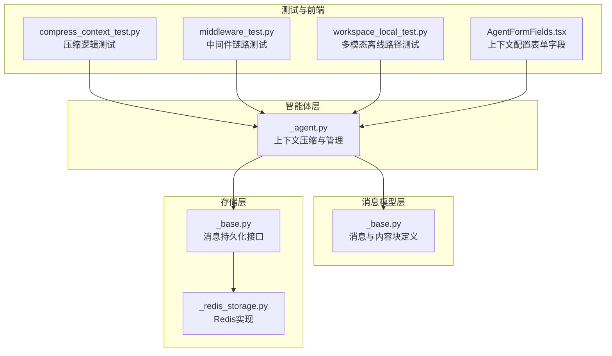
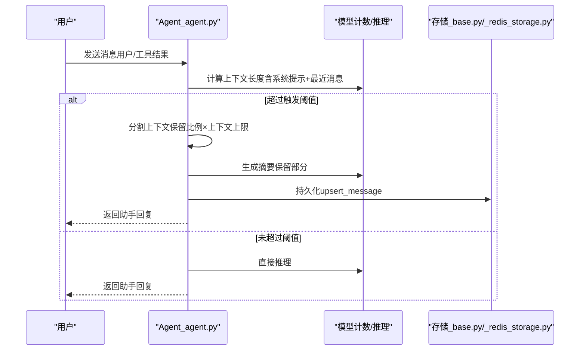
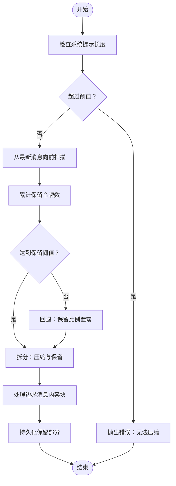
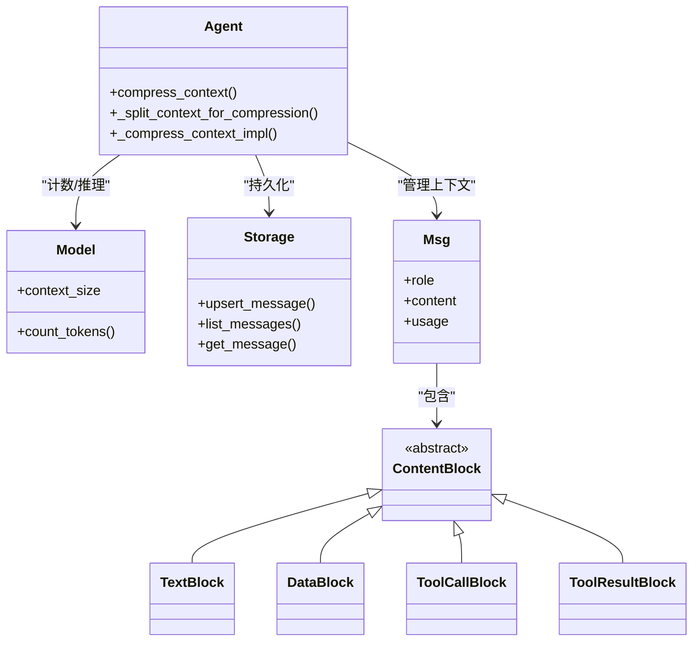

# 智能体上下文管理

<cite>
**本文引用的文件**
- [src/agentscope/agent/_agent.py](file://src/agentscope/agent/_agent.py)
- [src/agentscope/message/_base.py](file://src/agentscope/message/_base.py)
- [src/agentscope/app/storage/_base.py](file://src/agentscope/app/storage/_base.py)
- [src/agentscope/app/storage/_redis_storage.py](file://src/agentscope/app/storage/_redis_storage.py)
- [tests/compress_context_test.py](file://tests/compress_context_test.py)
- [tests/middleware_test.py](file://tests/middleware_test.py)
- [tests/workspace_local_test.py](file://tests/workspace_local_test.py)
- [examples/web_ui/frontend/src/components/form/AgentFormFields.tsx](file://examples/web_ui/frontend/src/components/form/AgentFormFields.tsx)
</cite>

## 目录
1. [引言](#引言)
2. [项目结构](#项目结构)
3. [核心组件](#核心组件)
4. [架构总览](#架构总览)
5. [详细组件分析](#详细组件分析)
6. [依赖关系分析](#依赖关系分析)
7. [性能考量](#性能考量)
8. [故障排查指南](#故障排查指南)
9. [结论](#结论)
10. [附录](#附录)

## 引言
本文件围绕 AgentScope 的智能体上下文管理进行系统化说明，重点涵盖以下方面：
- 上下文存储与持久化：消息历史的保存、压缩与恢复路径
- 上下文压缩算法：触发条件、压缩策略与保留规则
- 对话历史组织：系统提示、用户消息、助手回复、工具调用与结果的结构化管理
- 上下文长度限制与溢出处理：阈值设定、压缩执行与回退策略
- 最佳实践：优化上下文使用效率与降低内存占用的方法

## 项目结构
AgentScope 将上下文管理分布在多个层次：
- 智能体层：负责上下文的生成、压缩、持久化与恢复
- 消息模型层：定义消息类型（系统、用户、助手）与内容块（文本、数据、工具调用/结果）
- 存储层：抽象的消息持久化接口与 Redis 实现，支持按会话维护消息列表
- 测试与前端：验证压缩逻辑、中间件链路与多模态离线（offload）路径

图表来源
- [src/agentscope/agent/_agent.py](file://src/agentscope/agent/_agent.py)
- [src/agentscope/message/_base.py](file://src/agentscope/message/_base.py)
- [src/agentscope/app/storage/_base.py](file://src/agentscope/app/storage/_base.py)
- [src/agentscope/app/storage/_redis_storage.py](file://src/agentscope/app/storage/_redis_storage.py)
- [tests/compress_context_test.py](file://tests/compress_context_test.py)
- [tests/middleware_test.py](file://tests/middleware_test.py)
- [tests/workspace_local_test.py](file://tests/workspace_local_test.py)
- [examples/web_ui/frontend/src/components/form/AgentFormFields.tsx](file://examples/web_ui/frontend/src/components/form/AgentFormFields.tsx)

章节来源
- [src/agentscope/agent/_agent.py](file://src/agentscope/agent/_agent.py)
- [src/agentscope/message/_base.py](file://src/agentscope/message/_base.py)
- [src/agentscope/app/storage/_base.py](file://src/agentscope/app/storage/_base.py)
- [src/agentscope/app/storage/_redis_storage.py](file://src/agentscope/app/storage/_redis_storage.py)
- [tests/compress_context_test.py](file://tests/compress_context_test.py)
- [tests/middleware_test.py](file://tests/middleware_test.py)
- [tests/workspace_local_test.py](file://tests/workspace_local_test.py)
- [examples/web_ui/frontend/src/components/form/AgentFormFields.tsx](file://examples/web_ui/frontend/src/components/form/AgentFormFields.tsx)

## 核心组件
- 上下文压缩器：根据触发比例与保留比例，将历史消息拆分为“压缩”和“保留”两部分，并生成摘要
- 消息模型：统一的 Msg 类型及内容块（文本、数据、工具调用/结果），支持多模态与分块
- 存储接口：按会话维护消息列表，支持插入、替换、分页查询与 TTL 管理
- 中间件链：在压缩前/后注入钩子，支持短路跳过或顺序执行
- 多模态离线：对大体积内容（如图片）进行离线落盘与引用替换

章节来源
- [src/agentscope/agent/_agent.py](file://src/agentscope/agent/_agent.py)
- [src/agentscope/message/_base.py](file://src/agentscope/message/_base.py)
- [src/agentscope/app/storage/_base.py](file://src/agentscope/app/storage/_base.py)
- [src/agentscope/app/storage/_redis_storage.py](file://src/agentscope/app/storage/_redis_storage.py)
- [tests/compress_context_test.py](file://tests/compress_context_test.py)
- [tests/middleware_test.py](file://tests/middleware_test.py)
- [tests/workspace_local_test.py](file://tests/workspace_local_test.py)

## 架构总览
AgentScope 的上下文管理采用“智能体驱动 + 模型计数 + 存储持久化”的闭环：
- 智能体在回复前后评估当前上下文长度，决定是否触发压缩
- 压缩时以系统提示与最近消息为基准，计算保留阈值，分割消息序列
- 对边界消息中的内容块进行细粒度拆分（文本可截断、工具结果按调用/结果配对）
- 压缩后的消息被持久化到存储层，保留的消息用于后续推理
- 可选的中间件链允许在压缩前后扩展行为（如日志、限流、短路）

图表来源
- [src/agentscope/agent/_agent.py](file://src/agentscope/agent/_agent.py)
- [src/agentscope/app/storage/_base.py](file://src/agentscope/app/storage/_base.py)
- [src/agentscope/app/storage/_redis_storage.py](file://src/agentscope/app/storage/_redis_storage.py)

## 详细组件分析

### 上下文压缩算法与触发条件
- 触发条件
  - 当系统提示与当前上下文的总长度超过模型上下文上限乘以触发比例时，触发压缩
  - 若仅系统提示就超过阈值，则抛出错误，提示无法压缩
- 保留策略
  - 保留比例 = 保留令牌数 / 模型上下文上限
  - 从最新消息向前扫描，累计保留令牌数，直到达到阈值
  - 若扫描完毕仍无有效压缩空间，则回退：将保留比例降至 0，强制压缩
- 边界消息处理
  - 若边界消息包含多内容块（如文本、工具调用/结果），优先保证未匹配的工具结果完整保留
  - 文本内容可按剩余令牌预算进行比例截断，确保摘要质量与长度控制

图表来源
- [src/agentscope/agent/_agent.py](file://src/agentscope/agent/_agent.py)

章节来源
- [src/agentscope/agent/_agent.py](file://src/agentscope/agent/_agent.py)
- [tests/compress_context_test.py](file://tests/compress_context_test.py)

### 消息历史组织与内容块
- 消息类型
  - 系统消息：用于设定角色与约束
  - 用户消息：包含纯文本或多模态内容块
  - 助手消息：包含文本、工具调用/结果等多模态内容块
- 内容块
  - 文本块：支持截断与拼接
  - 数据块：多模态输入（如图片），可离线落盘并替换为远程引用
  - 工具调用/结果块：成对出现，压缩时需保证调用与结果的完整性
- 组织方式
  - 上下文按时间顺序排列，系统提示与摘要作为“系统侧”信息参与计数
  - 工具结果与对应调用通过 ID 关联，压缩时优先保留未完成的调用链

章节来源
- [src/agentscope/message/_base.py](file://src/agentscope/message/_base.py)
- [src/agentscope/agent/_agent.py](file://src/agentscope/agent/_agent.py)
- [tests/workspace_local_test.py](file://tests/workspace_local_test.py)

### 上下文长度限制与溢出处理
- 长度限制
  - 由模型上下文上限与触发/保留比例共同决定
  - 压缩前先计数系统提示与最近消息，若总长度超阈则压缩
- 溢出处理
  - 回退策略：当保留比例过大导致无法压缩时，自动将保留比例降为 0 并强制压缩
  - 错误保护：若仅系统提示就超过阈值，直接报错，避免不可压缩状态

章节来源
- [src/agentscope/agent/_agent.py](file://src/agentscope/agent/_agent.py)

### 存储与恢复（消息历史）
- 接口能力
  - upsert_message：若最后一条消息 ID 一致则替换，否则追加
  - list_messages：支持偏移与限制的分页查询
  - get_message：按 ID 获取指定消息
- Redis 实现要点
  - 使用列表结构维护会话消息队列
  - TTL 管理：更新消息会刷新过期时间，避免热数据丢失
- 恢复流程
  - 启动时按会话拉取消息列表，重建智能体上下文
  - 与压缩后的保留部分配合，实现跨轮次的上下文延续

章节来源
- [src/agentscope/app/storage/_base.py](file://src/agentscope/app/storage/_base.py)
- [src/agentscope/app/storage/_redis_storage.py](file://src/agentscope/app/storage/_redis_storage.py)
- [tests/storage_redis_test.py](file://tests/storage_redis_test.py)

### 中间件链与压缩钩子
- 执行顺序
  - 支持注册多个中间件，按洋葱模型顺序执行
  - 可在压缩前短路跳过实际压缩逻辑，便于调试或特殊场景
- 典型用途
  - 日志记录、限流、权限校验、A/B 策略切换
- 行为验证
  - 单测覆盖了中间件链顺序、短路行为与直接调用路径

章节来源
- [tests/middleware_test.py](file://tests/middleware_test.py)
- [src/agentscope/agent/_agent.py](file://src/agentscope/agent/_agent.py)

### 多模态离线（Offload）与大内容管理
- 触发场景
  - 当消息中包含大体积数据块（如图片）且超出保留预算时，进行离线落盘
- 处理流程
  - 在首次压缩时将数据块写入工作目录并替换为远程引用
  - 保留部分仅包含文本与必要的元信息，减少令牌占用
- 测试验证
  - 通过多模态消息的首次压缩，验证数据块落盘与后续消息序列的正确性

章节来源
- [tests/workspace_local_test.py](file://tests/workspace_local_test.py)
- [src/agentscope/agent/_agent.py](file://src/agentscope/agent/_agent.py)

## 依赖关系分析
- 智能体依赖模型进行令牌计数，依赖存储进行消息持久化
- 消息模型独立于存储与模型，提供统一的数据结构
- 中间件与智能体解耦，通过钩子扩展压缩流程
- 前端表单提供上下文配置入口，影响触发与保留比例

图表来源
- [src/agentscope/agent/_agent.py](file://src/agentscope/agent/_agent.py)
- [src/agentscope/message/_base.py](file://src/agentscope/message/_base.py)
- [src/agentscope/app/storage/_base.py](file://src/agentscope/app/storage/_base.py)

## 性能考量
- 令牌计数开销
  - 压缩前的计数操作与压缩后的摘要生成均涉及模型调用，建议在高频会话中缓存系统提示与摘要
- 存储写放大
  - upsert_message 在替换时可能产生重复键，应确保 ID 设计唯一且稳定
- 多模态成本
  - 大体积数据块会显著增加令牌占用，优先启用离线落盘与引用替换
- 中间件链
  - 过长的中间件链会增加延迟，建议按需启用与合并相似逻辑

## 故障排查指南
- 系统提示过长导致无法压缩
  - 现象：抛出运行时错误，提示系统提示与摘要超过阈值
  - 处理：缩短系统提示或提高模型上下文上限
- 保留比例过高导致无压缩空间
  - 现象：压缩判定为空，触发回退策略
  - 处理：适当降低保留比例或提升模型上下文上限
- 消息持久化异常
  - 现象：upsert/get/list 行为不符合预期
  - 处理：检查会话 ID、消息 ID 一致性与 TTL 设置；确认 Redis 连接与键命名规范
- 中间件短路
  - 现象：压缩未执行
  - 处理：检查中间件 on_compress_context 是否正确转发 next_handler

章节来源
- [src/agentscope/agent/_agent.py](file://src/agentscope/agent/_agent.py)
- [src/agentscope/app/storage/_base.py](file://src/agentscope/app/storage/_base.py)
- [src/agentscope/app/storage/_redis_storage.py](file://src/agentscope/app/storage/_redis_storage.py)
- [tests/middleware_test.py](file://tests/middleware_test.py)

## 结论
AgentScope 的上下文管理通过“智能体驱动 + 模型计数 + 存储持久化”的架构，在保证推理质量的同时有效控制上下文长度。其压缩算法以保留比例为核心参数，结合边界消息的细粒度处理与多模态离线策略，实现了高性价比的上下文管理方案。配合中间件链与完善的存储接口，系统具备良好的可扩展性与可运维性。

## 附录
- 最佳实践清单
  - 合理设置触发比例与保留比例，避免频繁压缩或过度保留
  - 使用摘要与系统提示缓存，减少重复计数与生成开销
  - 对多模态输入启用离线落盘，优先保留必要文本与元信息
  - 在生产环境启用 TTL 与分页查询，保障存储性能与稳定性
  - 通过中间件链实现灰度发布与行为审计，便于问题定位