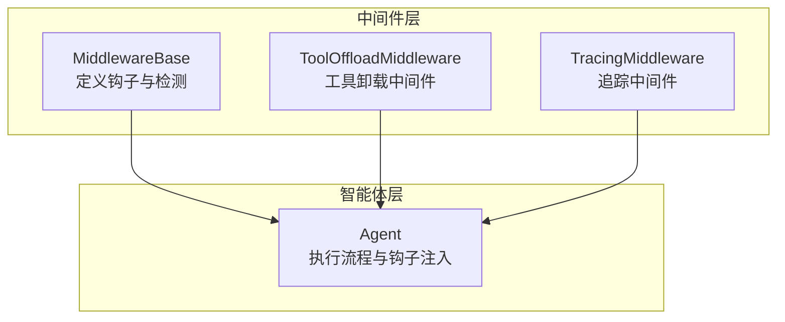
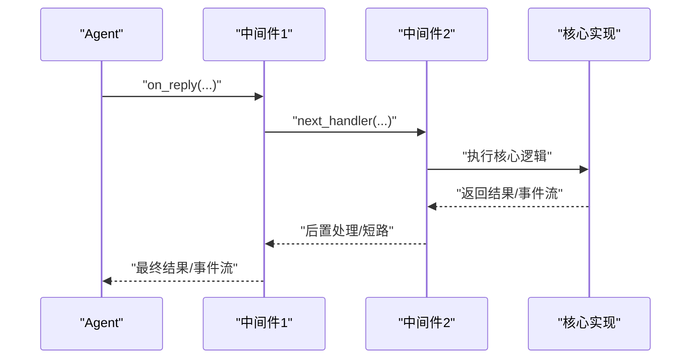
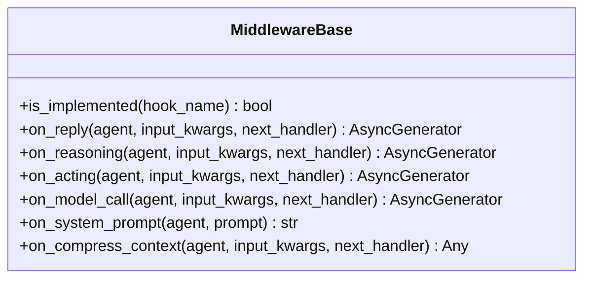
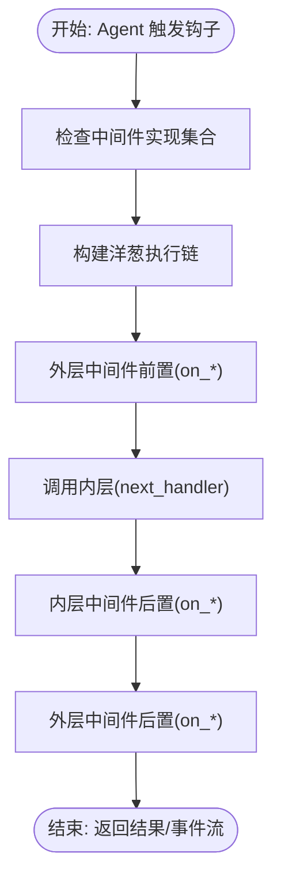
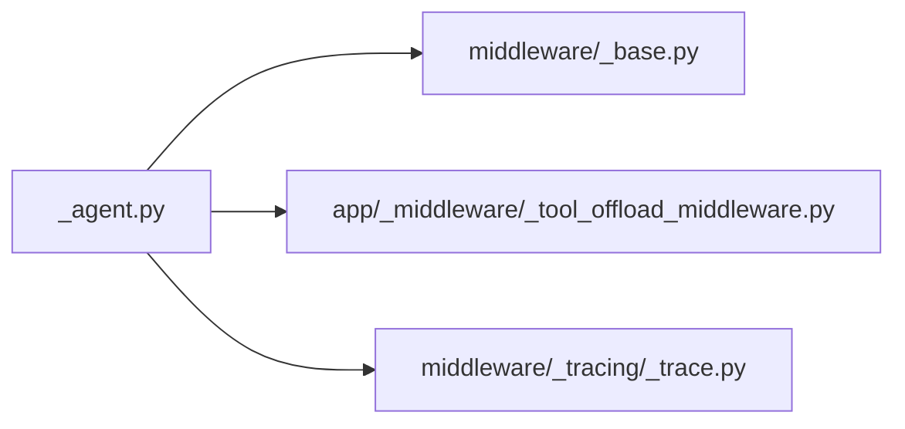

# 智能体中间件系统

<cite>
**本文引用的文件**
- [middleware/_base.py](file://src/agentscope/middleware/_base.py)
- [agent/_agent.py](file://src/agentscope/agent/_agent.py)
- [app/_middleware/_tool_offload_middleware.py](file://src/agentscope/app/_middleware/_tool_offload_middleware.py)
- [middleware/_tracing/_trace.py](file://src/agentscope/middleware/_tracing/_trace.py)
- [tests/middleware_test.py](file://tests/middleware_test.py)
</cite>

## 目录
1. [引言](#引言)
2. [项目结构](#项目结构)
3. [核心组件](#核心组件)
4. [架构总览](#架构总览)
5. [详细组件分析](#详细组件分析)
6. [依赖关系分析](#依赖关系分析)
7. [性能考量](#性能考量)
8. [故障排查指南](#故障排查指南)
9. [结论](#结论)
10. [附录](#附录)

## 引言
本文件面向AgentScope智能体中间件系统，系统性阐述中间件的设计理念与实现机制，重点覆盖以下主题：
- 钩子点（hook points）的概念与分类：洋葱模型钩子（on_reply、on_reasoning、on_acting、on_model_call）与变换器模型钩子（on_system_prompt、on_compress_context）。
- 中间件的执行顺序与链式调用机制（洋葱模式）。
- 中间件如何在不侵入核心代码的前提下修改智能体行为。
- 自定义中间件的开发方法、生命周期管理与错误处理建议。

## 项目结构
AgentScope中间件体系由“中间件基类”“智能体执行流程”“具体中间件实现”三部分构成：
- 中间件基类：定义通用接口与钩子规范，提供运行时检测能力。
- 智能体执行流程：在关键阶段注入中间件，形成洋葱式链式调用。
- 具体中间件：如工具卸载中间件、追踪中间件等，按需扩展。

图表来源
- [middleware/_base.py:12-76](file://src/agentscope/middleware/_base.py#L12-L76)
- [agent/_agent.py:166-185](file://src/agentscope/agent/_agent.py#L166-L185)
- [app/_middleware/_tool_offload_middleware.py:20-170](file://src/agentscope/app/_middleware/_tool_offload_middleware.py#L20-L170)
- [middleware/_tracing/_trace.py:115-120](file://src/agentscope/middleware/_tracing/_trace.py#L115-L120)

章节来源
- [middleware/_base.py:12-76](file://src/agentscope/middleware/_base.py#L12-L76)
- [agent/_agent.py:166-185](file://src/agentscope/agent/_agent.py#L166-L185)

## 核心组件
- 中间件基类（MiddlewareBase）
  - 定义五类洋葱模型钩子：on_reply、on_reasoning、on_acting、on_model_call。
  - 定义两类变换器模型钩子：on_system_prompt、on_compress_context。
  - 提供运行时钩子检测方法，用于筛选参与执行的中间件。
- Agent执行流程
  - 在回复、推理、行动、模型调用、系统提示词生成、上下文压缩等关键节点，按洋葱顺序调用已注册中间件。
  - 支持短路（skip）与链式转发（next_handler），保证中间件可插拔与可组合。

章节来源
- [middleware/_base.py:15-29](file://src/agentscope/middleware/_base.py#L15-L29)
- [middleware/_base.py:52-63](file://src/agentscope/middleware/_base.py#L52-L63)
- [agent/_agent.py:166-185](file://src/agentscope/agent/_agent.py#L166-L185)
- [agent/_agent.py:506-542](file://src/agentscope/agent/_agent.py#L506-L542)

## 架构总览
中间件系统采用“洋葱模型”与“变换器模型”相结合的架构：
- 洋葱模型钩子：在流程前后分别执行，支持前置处理、后置处理与短路。
- 变换器模型钩子：以串行管线形式依次变换输入/输出（如系统提示词）。

图表来源
- [agent/_agent.py:511-540](file://src/agentscope/agent/_agent.py#L511-L540)
- [middleware/_base.py:65-76](file://src/agentscope/middleware/_base.py#L65-L76)

## 详细组件分析

### 中间件基类与钩子定义
- 设计要点
  - 钩子可选：仅实现需要的钩子，系统自动检测。
  - 洋葱模型钩子均接收 agent、input_kwargs、next_handler，并返回异步生成器，便于流式处理。
  - 变换器模型钩子（如 on_system_prompt）以串行管线形式对输入进行变换。
- 生命周期
  - 初始化：构造函数完成资源准备。
  - 执行：在对应钩子被调用时执行；可通过 next_handler 转发到下一个中间件或核心实现。
  - 销毁：随 Agent 或应用生命周期结束释放资源（如连接、缓存）。

图表来源
- [middleware/_base.py:12-76](file://src/agentscope/middleware/_base.py#L12-L76)

章节来源
- [middleware/_base.py:12-76](file://src/agentscope/middleware/_base.py#L12-L76)

### Agent中的中间件注入与执行顺序
- 注入策略
  - Agent启动时根据中间件是否实现特定钩子进行分组过滤。
  - 不同钩子对应不同执行链，确保只加载必要的中间件。
- 执行顺序（洋葱模式）
  - 多个中间件按注册顺序“包裹式”执行：外层先 on_* 前置，再进入内层；内层完成后，外层执行 on_* 后置。
  - 测试用例验证了多中间件的洋葱式执行顺序与短路行为。

图表来源
- [agent/_agent.py:166-185](file://src/agentscope/agent/_agent.py#L166-L185)
- [agent/_agent.py:511-540](file://src/agentscope/agent/_agent.py#L511-L540)

章节来源
- [agent/_agent.py:166-185](file://src/agentscope/agent/_agent.py#L166-L185)
- [agent/_agent.py:506-542](file://src/agentscope/agent/_agent.py#L506-L542)

### 支持的中间件钩子详解
- on_reply
  - 作用：拦截整个回复过程，适合日志、限流、鉴权、结果改写等。
  - 执行位置：Agent 回复主流程入口。
- on_reasoning
  - 作用：拦截推理/模型调用阶段，适合调试、埋点、参数校验、结果预处理。
- on_acting
  - 作用：拦截单次工具调用执行，适合权限控制、审计、重试策略。
- on_model_call
  - 作用：拦截原始模型 API 调用，适合网络代理、缓存、速率限制。
- on_system_prompt
  - 作用：变换系统提示词字符串，采用串行管线模式，适合多级提示词增强。
- on_compress_context
  - 作用：压缩上下文，适合长对话优化；可短路跳过实际压缩逻辑。

章节来源
- [middleware/_base.py:15-29](file://src/agentscope/middleware/_base.py#L15-L29)
- [agent/_agent.py:191-203](file://src/agentscope/agent/_agent.py#L191-L203)
- [agent/_agent.py:1968-1968](file://src/agentscope/agent/_agent.py#L1968-L1968)
- [agent/_agent.py:291-291](file://src/agentscope/agent/_agent.py#L291-L291)

### 链式调用与短路机制
- 链式调用
  - 通过 next_handler 将控制权传递给下一个中间件或核心实现。
  - 支持异步生成器流式返回，保证事件/消息的实时性。
- 短路
  - 中间件可选择不调用 next_handler，直接返回自定义结果，从而跳过后续中间件与核心实现。
  - 测试用例验证了短路行为与洋葱顺序的一致性。

章节来源
- [agent/_agent.py:511-540](file://src/agentscope/agent/_agent.py#L511-L540)
- [tests/middleware_test.py:896-922](file://tests/middleware_test.py#L896-L922)

### 典型中间件实现示例
- 工具卸载中间件（ToolOffloadMiddleware）
  - 场景：将工具执行迁移到远程工作空间，减少本地资源占用。
  - 关键点：在 on_reasoning/on_acting 中判断工具是否可卸载，必要时通过协议与远端交互。
- 追踪中间件（TracingMiddleware）
  - 场景：为推理/行动/模型调用添加分布式追踪属性，便于可观测性。
  - 关键点：在钩子中注入/提取追踪上下文，保持与核心逻辑解耦。

章节来源
- [app/_middleware/_tool_offload_middleware.py:20-170](file://src/agentscope/app/_middleware/_tool_offload_middleware.py#L20-L170)
- [middleware/_tracing/_trace.py:115-120](file://src/agentscope/middleware/_tracing/_trace.py#L115-L120)

### 开发自定义中间件最佳实践
- 钩子选择
  - 仅实现需要的钩子，避免无谓开销。
- 参数与状态
  - 使用 input_kwargs 传递上下文；避免在中间件实例上保存过多跨请求状态。
- 错误处理
  - 在钩子内部捕获异常并记录日志；必要时向下游传播或返回兜底结果。
- 性能与并发
  - 对于流式事件，尽量保持低延迟；避免阻塞 next_handler。
- 生命周期管理
  - 在初始化中建立资源，在 Agent 生命周期结束时释放；避免资源泄漏。

章节来源
- [middleware/_base.py:52-63](file://src/agentscope/middleware/_base.py#L52-L63)
- [tests/middleware_test.py:74-116](file://tests/middleware_test.py#L74-L116)

## 依赖关系分析
- 组件耦合
  - Agent 与中间件通过接口解耦：Agent 仅依赖中间件接口与运行时检测。
  - 中间件彼此独立，通过 next_handler 组合，避免环状依赖。
- 外部集成
  - 工具卸载中间件与应用层工作区协议对接。
  - 追踪中间件与追踪工具链集成。

图表来源
- [agent/_agent.py:166-185](file://src/agentscope/agent/_agent.py#L166-L185)
- [middleware/_base.py:12-76](file://src/agentscope/middleware/_base.py#L12-L76)
- [app/_middleware/_tool_offload_middleware.py:20-170](file://src/agentscope/app/_middleware/_tool_offload_middleware.py#L20-L170)
- [middleware/_tracing/_trace.py:115-120](file://src/agentscope/middleware/_tracing/_trace.py#L115-L120)

## 性能考量
- 洋葱深度
  - 中间件数量与嵌套层级增加会带来额外的协程切换与序列化成本，应合理裁剪。
- 流式处理
  - 利用异步生成器尽早返回事件，降低端到端延迟。
- 缓存与短路
  - 对重复计算或昂贵操作进行缓存；在满足业务需求前提下允许短路以减少调用。
- 并发安全
  - 注意共享资源的并发访问，避免竞态条件。

## 故障排查指南
- 症状：中间件未生效
  - 排查：确认中间件是否实现对应钩子；检查 is_implemented 的检测逻辑。
- 症状：执行顺序异常
  - 排查：核对中间件注册顺序；验证洋葱链构建逻辑与 next_handler 调用。
- 症状：短路导致核心逻辑未执行
  - 排查：检查中间件是否意外跳过 next_handler；必要时添加日志定位。
- 症状：流式事件丢失
  - 排查：确保中间件正确转发/产出事件；避免吞掉生成器中的值。

章节来源
- [middleware/_base.py:52-63](file://src/agentscope/middleware/_base.py#L52-L63)
- [agent/_agent.py:511-540](file://src/agentscope/agent/_agent.py#L511-L540)
- [tests/middleware_test.py:74-116](file://tests/middleware_test.py#L74-L116)

## 结论
AgentScope中间件系统通过“洋葱模型+变换器模型”的双轨设计，实现了对智能体行为的灵活扩展与无侵入改造。借助运行时钩子检测、链式调用与短路机制，开发者可以快速构建可组合、可维护的中间件生态，满足从日志审计、权限控制到性能优化等多样化场景。

## 附录
- 示例参考路径
  - 洋葱模型钩子测试：[tests/middleware_test.py:74-116](file://tests/middleware_test.py#L74-L116)
  - 推理阶段钩子测试：[tests/middleware_test.py:117-188](file://tests/middleware_test.py#L117-L188)
  - 模型调用钩子测试：[tests/middleware_test.py:192-327](file://tests/middleware_test.py#L192-L327)
  - 系统提示词钩子测试：[tests/middleware_test.py:330-395](file://tests/middleware_test.py#L330-L395)
  - 上下文压缩钩子测试：[tests/middleware_test.py:829-894](file://tests/middleware_test.py#L829-L894)
  - 工具卸载中间件实现：[app/_middleware/_tool_offload_middleware.py:20-170](file://src/agentscope/app/_middleware/_tool_offload_middleware.py#L20-L170)
  - 追踪中间件实现：[middleware/_tracing/_trace.py:115-120](file://src/agentscope/middleware/_tracing/_trace.py#L115-L120)