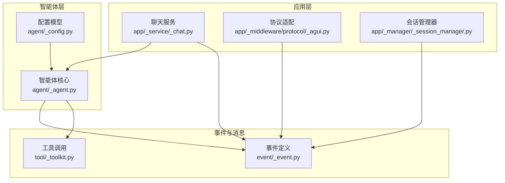
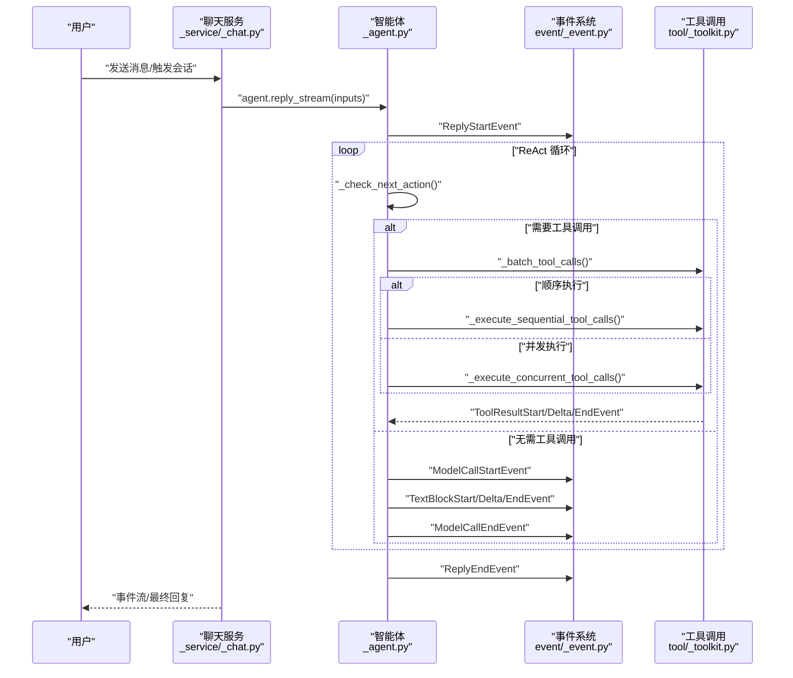
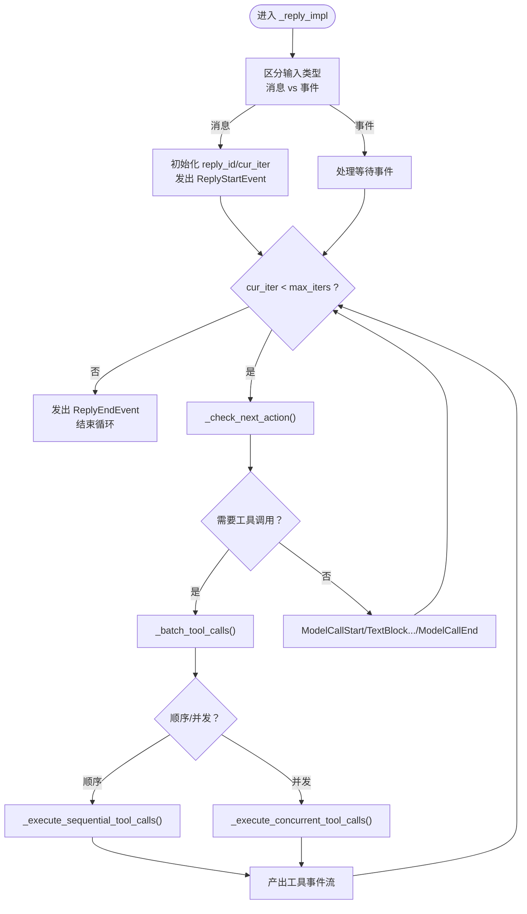
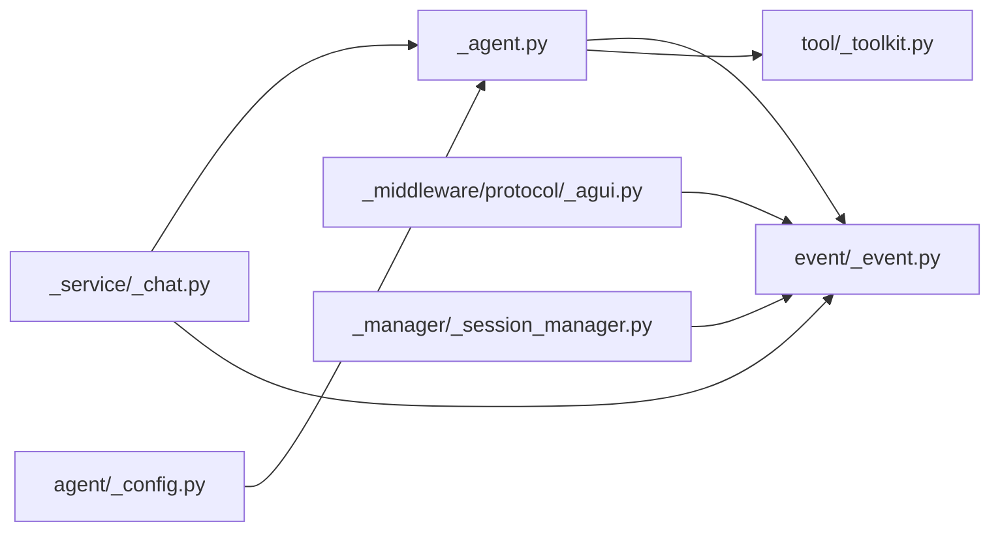

# 智能体回复循环

<cite>
**本文引用的文件**
- [src/agentscope/agent/_agent.py](file://src/agentscope/agent/_agent.py)
- [src/agentscope/event/_event.py](file://src/agentscope/event/_event.py)
- [src/agentscope/app/_service/_chat.py](file://src/agentscope/app/_service/_chat.py)
- [src/agentscope/app/_middleware/protocol/_agui.py](file://src/agentscope/app/_middleware/protocol/_agui.py)
- [src/agentscope/tool/_toolkit.py](file://src/agentscope/tool/_toolkit.py)
- [src/agentscope/app/_manager/_session_manager.py](file://src/agentscope/app/_manager/_session_manager.py)
- [src/agentscope/agent/_config.py](file://src/agentscope/agent/_config.py)
- [tests/hitl_external_execution_test.py](file://tests/hitl_external_execution_test.py)
</cite>

## 目录
1. [引言](#引言)
2. [项目结构](#项目结构)
3. [核心组件](#核心组件)
4. [架构总览](#架构总览)
5. [详细组件分析](#详细组件分析)
6. [依赖关系分析](#依赖关系分析)
7. [性能考虑](#性能考虑)
8. [故障排查指南](#故障排查指南)
9. [结论](#结论)
10. [附录](#附录)

## 引言
本文件围绕 AgentScope 的“智能体回复循环”进行系统化说明，重点阐释 ReAct（推理-行动）循环在智能体中的工作机制，覆盖输入处理、推理阶段、工具调用阶段、外部交互阶段以及循环终止条件。同时，文档详细描述事件驱动的消息流处理机制，包括各类 AgentEvent 的产生与传播，并通过序列图与流程图展示完整回复循环过程，包含错误处理与异常场景。

## 项目结构
与回复循环直接相关的模块主要分布在以下位置：
- 智能体核心逻辑：src/agentscope/agent/_agent.py
- 事件定义与类型：src/agentscope/event/_event.py
- 服务层集成与事件发布：src/agentscope/app/_service/_chat.py
- 协议适配（如 AGUI）：src/agentscope/app/_middleware/protocol/_agui.py
- 工具调用与批处理执行：src/agentscope/tool/_toolkit.py
- 会话与事件订阅：src/agentscope/app/_manager/_session_manager.py
- 配置模型（上下文与 ReAct 参数）：src/agentscope/agent/_config.py
- 测试用例（含外部执行与用户确认事件）：tests/hitl_external_execution_test.py

**图表来源**
- [src/agentscope/app/_service/_chat.py](file://src/agentscope/app/_service/_chat.py)
- [src/agentscope/app/_middleware/protocol/_agui.py](file://src/agentscope/app/_middleware/protocol/_agui.py)
- [src/agentscope/app/_manager/_session_manager.py](file://src/agentscope/app/_manager/_session_manager.py)
- [src/agentscope/agent/_agent.py](file://src/agentscope/agent/_agent.py)
- [src/agentscope/agent/_config.py](file://src/agentscope/agent/_config.py)
- [src/agentscope/event/_event.py](file://src/agentscope/event/_event.py)
- [src/agentscope/tool/_toolkit.py](file://src/agentscope/tool/_toolkit.py)

**章节来源**
- [src/agentscope/agent/_agent.py](file://src/agentscope/agent/_agent.py)
- [src/agentscope/event/_event.py](file://src/agentscope/event/_event.py)
- [src/agentscope/app/_service/_chat.py](file://src/agentscope/app/_service/_chat.py)
- [src/agentscope/app/_middleware/protocol/_agui.py](file://src/agentscope/app/_middleware/protocol/_agui.py)
- [src/agentscope/tool/_toolkit.py](file://src/agentscope/tool/_toolkit.py)
- [src/agentscope/app/_manager/_session_manager.py](file://src/agentscope/app/_manager/_session_manager.py)
- [src/agentscope/agent/_config.py](file://src/agentscope/agent/_config.py)

## 核心组件
- 智能体回复主流程：_reply_impl 方法负责统一输入分发、事件检查、状态初始化与 ReAct 循环推进。
- ReAct 循环控制：_check_next_action 决定下一步动作（继续推理、调用工具、生成最终回复），并受迭代次数上限限制。
- 工具批处理与并发执行：_batch_tool_calls 将工具调用按顺序/并发分组，_execute_sequential_tool_calls 与 _execute_concurrent_tool_calls 分别处理。
- 事件驱动的消息流：ReplyStartEvent、ModelCallStartEvent/EndEvent、TextBlockStart/Delta/EndEvent、ToolCallStart/Delta/EndEvent、ToolResultStart/TextDelta/DataDelta/EndEvent、RequireUserConfirmEvent、RequireExternalExecutionEvent 等贯穿整个回复过程。
- 服务层集成：聊天服务在收到用户输入或外部事件后，通过 agent.reply_stream 发出事件流，并持久化消息与状态。

**章节来源**
- [src/agentscope/agent/_agent.py](file://src/agentscope/agent/_agent.py)
- [src/agentscope/event/_event.py](file://src/agentscope/event/_event.py)
- [src/agentscope/app/_service/_chat.py](file://src/agentscope/app/_service/_chat.py)
- [src/agentscope/tool/_toolkit.py](file://src/agentscope/tool/_toolkit.py)

## 架构总览
下图展示了从用户输入到最终回复的端到端事件流，以及智能体内部的 ReAct 循环与工具调用链路。

**图表来源**
- [src/agentscope/app/_service/_chat.py](file://src/agentscope/app/_service/_chat.py)
- [src/agentscope/agent/_agent.py](file://src/agentscope/agent/_agent.py)
- [src/agentscope/event/_event.py](file://src/agentscope/event/_event.py)
- [src/agentscope/tool/_toolkit.py](file://src/agentscope/tool/_toolkit.py)

## 详细组件分析

### 回复循环入口与输入处理
- 统一输入分发：_reply_impl 接收 Msg、列表或特定事件类型，将其拆分为消息与事件两类分支。
- 事件等待检查：_check_incoming_event 判断当前是否处于等待事件状态；若等待则进入事件处理分支，否则进入消息处理分支。
- 初始化与启动事件：非等待状态下，写入新的 reply_id 与 cur_iter，并发出 ReplyStartEvent，标记一次回复流程开始。

关键行为参考：
- 输入分发与等待检查：[src/agentscope/agent/_agent.py](file://src/agentscope/agent/_agent.py)
- 初始化与启动事件：[src/agentscope/agent/_agent.py](file://src/agentscope/agent/_agent.py)

**章节来源**
- [src/agentscope/agent/_agent.py](file://src/agentscope/agent/_agent.py)

### 推理阶段
- 动作决策：_check_next_action 返回下一步动作与数据，决定是继续推理还是进入工具调用阶段。
- 文本块事件：当无需工具调用时，智能体会发出 ModelCallStartEvent、TextBlockStart/Delta/EndEvent、ModelCallEndEvent，形成连续的文本生成事件流。
- 迭代计数：cur_iter 增长，受 ReActConfig.max_iters 限制，超过则发出 ExceedMaxItersEvent 并结束循环。

关键行为参考：
- 动作决策与循环推进：[src/agentscope/agent/_agent.py](file://src/agentscope/agent/_agent.py)
- 文本块事件序列：[src/agentscope/event/_event.py](file://src/agentscope/event/_event.py)

**章节来源**
- [src/agentscope/agent/_agent.py](file://src/agentscope/agent/_agent.py)
- [src/agentscope/event/_event.py](file://src/agentscope/event/_event.py)

### 工具调用阶段
- 批处理策略：_batch_tool_calls 将待执行工具按顺序/并发分组，返回批次对象。
- 顺序执行：_execute_sequential_tool_calls 逐个调用工具，产出 ToolCallStart/Delta/EndEvent 与 ToolResultStart/TextDelta/DataDelta/EndEvent。
- 并发执行：_execute_concurrent_tool_calls 并行调用工具，产出对应事件。
- 工具函数解析与参数注入：工具调用由 _toolkit 负责解析名称、构造参数并注入状态，支持内置工具与外部工具。

关键行为参考：
- 工具批处理与执行：[src/agentscope/agent/_agent.py](file://src/agentscope/agent/_agent.py)
- 工具调用实现细节：[src/agentscope/tool/_toolkit.py](file://src/agentscope/tool/_toolkit.py)

**章节来源**
- [src/agentscope/agent/_agent.py](file://src/agentscope/agent/_agent.py)
- [src/agentscope/tool/_toolkit.py](file://src/agentscope/tool/_toolkit.py)

### 外部交互阶段
- 用户确认：当工具调用需要人工确认时，智能体发出 RequireUserConfirmEvent；服务层收到后可暂停并等待用户确认结果（UserConfirmResultEvent），再继续回复循环。
- 外部执行：当工具调用需要外部系统执行时，智能体发出 RequireExternalExecutionEvent；服务层收到 ExternalExecutionResultEvent 后恢复回复循环。
- 事件持久化：服务层在收到事件后，会将事件附加到当前回复消息中，确保状态变更被持久化。

关键行为参考：
- 用户确认与外部执行事件：[src/agentscope/agent/_agent.py](file://src/agentscope/agent/_agent.py)
- 事件持久化与恢复：[src/agentscope/app/_service/_chat.py](file://src/agentscope/app/_service/_chat.py)
- 测试用例验证事件序列：[tests/hitl_external_execution_test.py](file://tests/hitl_external_execution_test.py)

**章节来源**
- [src/agentscope/agent/_agent.py](file://src/agentscope/agent/_agent.py)
- [src/agentscope/app/_service/_chat.py](file://src/agentscope/app/_service/_chat.py)
- [tests/hitl_external_execution_test.py](file://tests/hitl_external_execution_test.py)

### 循环终止条件
- 达到最大迭代次数：ExceedMaxItersEvent 触发，结束回复循环。
- 无工具调用且完成文本生成：自然退出循环，发出 ReplyEndEvent。
- 外部交互中断：在等待用户确认或外部执行期间，收到相应事件后恢复并继续。

关键行为参考：
- 终止条件与事件：[src/agentscope/agent/_agent.py](file://src/agentscope/agent/_agent.py)
- AGUI 协议映射：[src/agentscope/app/_middleware/protocol/_agui.py](file://src/agentscope/app/_middleware/protocol/_agui.py)

**章节来源**
- [src/agentscope/agent/_agent.py](file://src/agentscope/agent/_agent.py)
- [src/agentscope/app/_middleware/protocol/_agui.py](file://src/agentscope/app/_middleware/protocol/_agui.py)

### 事件驱动的消息流处理机制
- 事件类型体系：ReplyStartEvent、ReplyEndEvent、ModelCallStartEvent/EndEvent、TextBlockStart/Delta/EndEvent、ThinkingBlockStart/Delta/EndEvent、ToolCallStart/Delta/EndEvent、ToolResultStart/TextDelta/DataDelta/EndEvent、RequireUserConfirmEvent、RequireExternalExecutionEvent 等。
- 事件传播：服务层通过 run.publish 将事件推送到订阅者队列，支持重放与实时订阅。
- 协议适配：AGUI 协议将 AgentEvent 映射为 UI 友好的运行/步骤事件，便于前端渲染。

关键行为参考：
- 事件定义与类型：[src/agentscope/event/_event.py](file://src/agentscope/event/_event.py)
- 事件订阅与重放：[src/agentscope/app/_manager/_session_manager.py](file://src/agentscope/app/_manager/_session_manager.py)
- AGUI 协议映射：[src/agentscope/app/_middleware/protocol/_agui.py](file://src/agentscope/app/_middleware/protocol/_agui.py)

**章节来源**
- [src/agentscope/event/_event.py](file://src/agentscope/event/_event.py)
- [src/agentscope/app/_manager/_session_manager.py](file://src/agentscope/app/_manager/_session_manager.py)
- [src/agentscope/app/_middleware/protocol/_agui.py](file://src/agentscope/app/_middleware/protocol/_agui.py)

### 完整回复循环流程图

**图表来源**
- [src/agentscope/agent/_agent.py](file://src/agentscope/agent/_agent.py)
- [src/agentscope/tool/_toolkit.py](file://src/agentscope/tool/_toolkit.py)

## 依赖关系分析
- 智能体对事件系统的依赖：通过事件类型驱动 UI 渲染与状态更新。
- 智能体对工具系统的依赖：工具调用由工具包统一解析与执行。
- 服务层对智能体与事件系统的依赖：负责事件发布、持久化与会话管理。
- 协议适配层对事件系统的依赖：将 AgentEvent 映射为 UI 事件。

**图表来源**
- [src/agentscope/agent/_agent.py](file://src/agentscope/agent/_agent.py)
- [src/agentscope/event/_event.py](file://src/agentscope/event/_event.py)
- [src/agentscope/tool/_toolkit.py](file://src/agentscope/tool/_toolkit.py)
- [src/agentscope/app/_service/_chat.py](file://src/agentscope/app/_service/_chat.py)
- [src/agentscope/app/_middleware/protocol/_agui.py](file://src/agentscope/app/_middleware/protocol/_agui.py)
- [src/agentscope/app/_manager/_session_manager.py](file://src/agentscope/app/_manager/_session_manager.py)
- [src/agentscope/agent/_config.py](file://src/agentscope/agent/_config.py)

**章节来源**
- [src/agentscope/agent/_agent.py](file://src/agentscope/agent/_agent.py)
- [src/agentscope/event/_event.py](file://src/agentscope/event/_event.py)
- [src/agentscope/tool/_toolkit.py](file://src/agentscope/tool/_toolkit.py)
- [src/agentscope/app/_service/_chat.py](file://src/agentscope/app/_service/_chat.py)
- [src/agentscope/app/_middleware/protocol/_agui.py](file://src/agentscope/app/_middleware/protocol/_agui.py)
- [src/agentscope/app/_manager/_session_manager.py](file://src/agentscope/app/_manager/_session_manager.py)
- [src/agentscope/agent/_config.py](file://src/agentscope/agent/_config.py)

## 性能考虑
- 工具调用批处理：顺序与并发策略的选择直接影响吞吐与延迟，应根据工具特性与外部系统能力权衡。
- 事件重放与订阅：会话管理器采用队列与缓冲区结合的方式，保证订阅一致性与低延迟。
- 上下文窗口与迭代上限：合理设置 ContextConfig 与 ReActConfig.max_iters，避免过长循环导致资源占用过高。
- 文本块增量事件：TextBlockStart/Delta/EndEvent 的增量传输有助于前端快速响应与节省带宽。

## 故障排查指南
- 工具未找到：工具名称不存在或未激活时，工具包会返回错误事件与响应，需检查工具注册与状态。
- 外部执行超时：RequireExternalExecutionEvent 未及时收到 ExternalExecutionResultEvent 时，建议检查外部系统健康与回调机制。
- 用户确认阻塞：RequireUserConfirmEvent 未收到 UserConfirmResultEvent 时，需确认前端交互流程与服务层事件回传。
- 事件丢失或重复：通过会话管理器的事件缓冲与订阅机制定位问题，确保订阅注册早于事件重放。

**章节来源**
- [src/agentscope/tool/_toolkit.py](file://src/agentscope/tool/_toolkit.py)
- [src/agentscope/app/_service/_chat.py](file://src/agentscope/app/_service/_chat.py)
- [src/agentscope/app/_manager/_session_manager.py](file://src/agentscope/app/_manager/_session_manager.py)
- [tests/hitl_external_execution_test.py](file://tests/hitl_external_execution_test.py)

## 结论
AgentScope 的智能体回复循环以 ReAct 为核心，通过事件驱动的消息流串联起推理与工具调用两大阶段，并在需要时引入外部交互（用户确认与外部执行）。该设计既保证了灵活性与可扩展性，又提供了完善的事件可观测性与持久化能力，适用于复杂任务编排与人机协同场景。

## 附录
- 关键配置项：ContextConfig（上下文窗口）、ReActConfig（迭代上限等）
- 事件类型清单：参见事件定义文件
- 服务层集成点：聊天服务负责事件发布与消息持久化

**章节来源**
- [src/agentscope/agent/_config.py](file://src/agentscope/agent/_config.py)
- [src/agentscope/event/_event.py](file://src/agentscope/event/_event.py)
- [src/agentscope/app/_service/_chat.py](file://src/agentscope/app/_service/_chat.py)