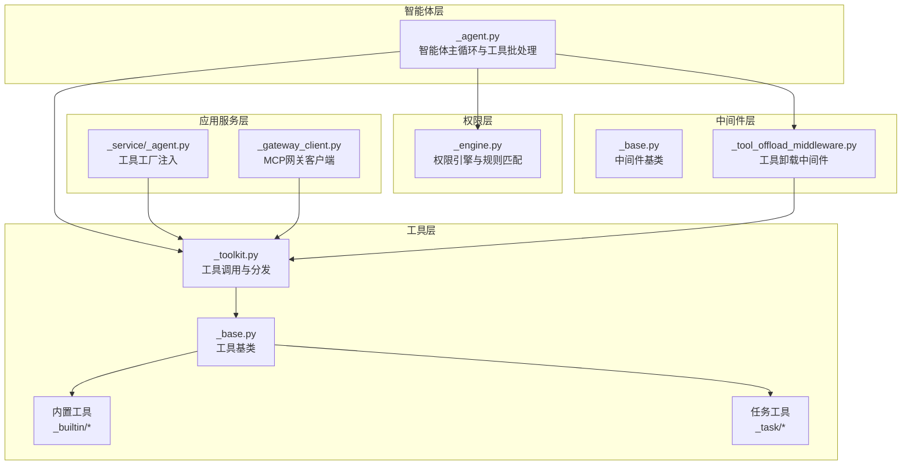
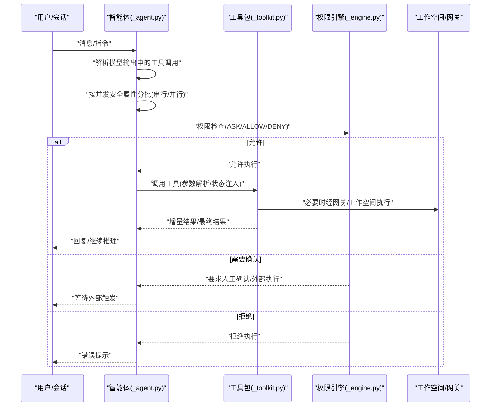
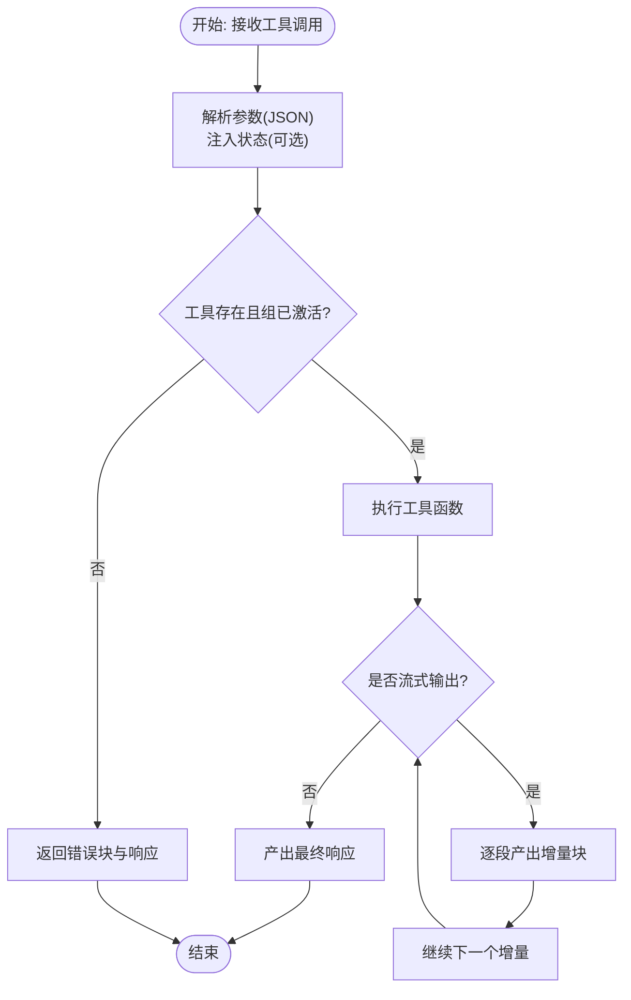
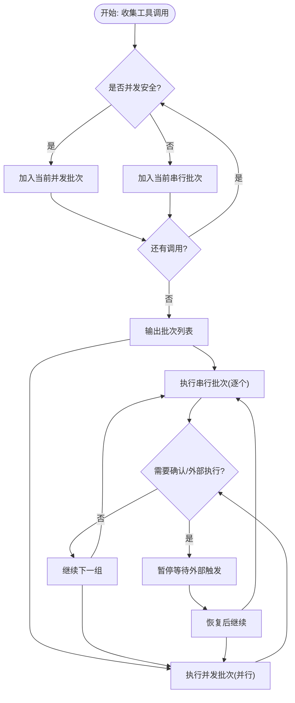
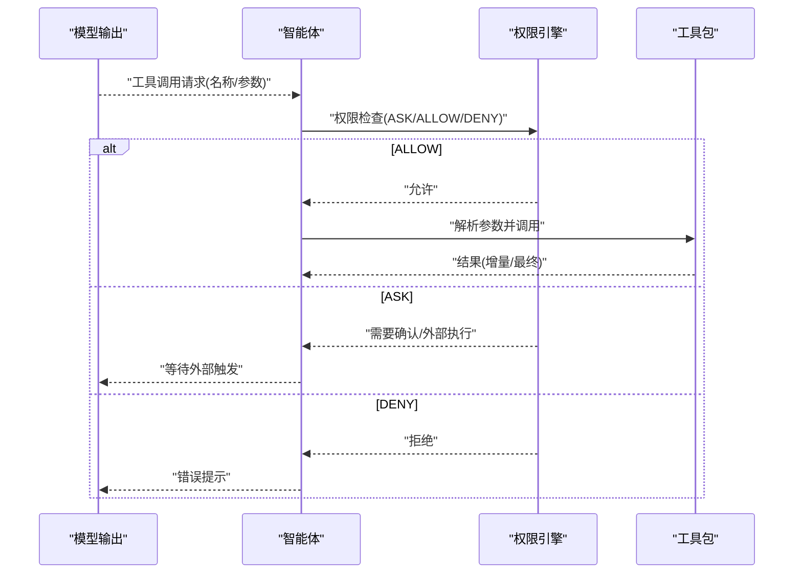
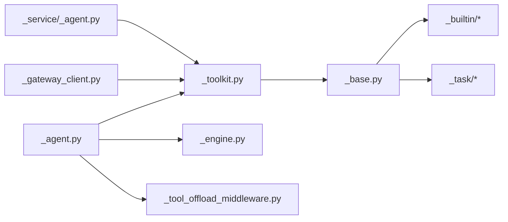

# 智能体工具集成

<cite>
**本文引用的文件**
- [src/agentscope/agent/_agent.py](file://src/agentscope/agent/_agent.py)
- [src/agentscope/tool/_toolkit.py](file://src/agentscope/tool/_toolkit.py)
- [src/agentscope/tool/_base.py](file://src/agentscope/tool/_base.py)
- [src/agentscope/permission/_engine.py](file://src/agentscope/permission/_engine.py)
- [src/agentscope/app/_service/_agent.py](file://src/agentscope/app/_service/_agent.py)
- [src/agentscope/workspace/_gateway_client.py](file://src/agentscope/workspace/_gateway_client.py)
- [src/agentscope/middleware/_base.py](file://src/agentscope/middleware/_base.py)
- [src/agentscope/app/_middleware/_tool_offload_middleware.py](file://src/agentscope/app/_middleware/_tool_offload_middleware.py)
- [tests/toolkit_test.py](file://tests/toolkit_test.py)
- [tests/agent_basic_test.py](file://tests/agent_basic_test.py)
- [tests/hitl_user_confirmation_test.py](file://tests/hitl_user_confirmation_test.py)
- [tests/hitl_external_execution_test.py](file://tests/hitl_external_execution_test.py)
</cite>

## 目录
1. [简介](#简介)
2. [项目结构](#项目结构)
3. [核心组件](#核心组件)
4. [架构总览](#架构总览)
5. [详细组件分析](#详细组件分析)
6. [依赖关系分析](#依赖关系分析)
7. [性能考量](#性能考量)
8. [故障排查指南](#故障排查指南)
9. [结论](#结论)
10. [附录：集成示例与最佳实践](#附录集成示例与最佳实践)

## 简介
本文件面向需要在AgentScope中集成“工具”的开发者与使用者，系统性阐述以下主题：
- 工具注册、调用与结果处理机制
- 工具调用的批处理策略（串行与并行）及其适用场景
- 工具选择与决策（含ToolChoice相关流程）
- 安全检查与权限控制
- 自定义工具的集成步骤（定义、参数校验、结果格式化）

目标是帮助读者在不深入源码细节的前提下，快速理解并正确使用AgentScope的工具系统。

## 项目结构
围绕“工具集成”，本仓库的关键模块分布如下：
- 智能体层：负责工具选择、批处理调度、事件驱动的执行与结果回传
- 工具层：工具基类、工具组/工具包、内置工具与任务型工具
- 权限层：权限引擎、规则匹配与建议生成
- 应用服务层：工具工厂注入、工作空间与网关客户端
- 中间件层：工具卸载中间件等扩展点

图表来源
- [src/agentscope/agent/_agent.py](file://src/agentscope/agent/_agent.py)
- [src/agentscope/tool/_toolkit.py](file://src/agentscope/tool/_toolkit.py)
- [src/agentscope/tool/_base.py](file://src/agentscope/tool/_base.py)
- [src/agentscope/permission/_engine.py](file://src/agentscope/permission/_engine.py)
- [src/agentscope/app/_service/_agent.py](file://src/agentscope/app/_service/_agent.py)
- [src/agentscope/workspace/_gateway_client.py](file://src/agentscope/workspace/_gateway_client.py)
- [src/agentscope/middleware/_base.py](file://src/agentscope/middleware/_base.py)
- [src/agentscope/app/_middleware/_tool_offload_middleware.py](file://src/agentscope/app/_middleware/_tool_offload_middleware.py)

章节来源
- [src/agentscope/agent/_agent.py](file://src/agentscope/agent/_agent.py)
- [src/agentscope/tool/_toolkit.py](file://src/agentscope/tool/_toolkit.py)
- [src/agentscope/tool/_base.py](file://src/agentscope/tool/_base.py)
- [src/agentscope/permission/_engine.py](file://src/agentscope/permission/_engine.py)
- [src/agentscope/app/_service/_agent.py](file://src/agentscope/app/_service/_agent.py)
- [src/agentscope/workspace/_gateway_client.py](file://src/agentscope/workspace/_gateway_client.py)
- [src/agentscope/middleware/_base.py](file://src/agentscope/middleware/_base.py)
- [src/agentscope/app/_middleware/_tool_offload_middleware.py](file://src/agentscope/app/_middleware/_tool_offload_middleware.py)

## 核心组件
- 工具基类与工具包
  - 工具基类定义了工具的元信息、输入模式、并发安全标记以及可选的状态注入能力
  - 工具包负责工具注册、查找、参数解析与调用分发，并支持错误与增量结果流式输出
- 智能体主循环
  - 负责从模型输出中提取工具调用请求，进行批处理（串行/并行），逐个或批量执行工具，并将结果回传给模型
- 权限引擎
  - 基于上下文模式与规则集合，对工具调用进行ASK/ALLOW/DENY判定，并可生成建议规则
- 应用服务与工作空间
  - 通过工具工厂动态注入工具；MCP网关客户端封装上游工具的名称、描述与权限提示
- 中间件
  - 提供工具卸载中间件等扩展点，支持将工具执行迁移到工作空间或外部环境

章节来源
- [src/agentscope/tool/_base.py](file://src/agentscope/tool/_base.py)
- [src/agentscope/tool/_toolkit.py](file://src/agentscope/tool/_toolkit.py)
- [src/agentscope/agent/_agent.py](file://src/agentscope/agent/_agent.py)
- [src/agentscope/permission/_engine.py](file://src/agentscope/permission/_engine.py)
- [src/agentscope/app/_service/_agent.py](file://src/agentscope/app/_service/_agent.py)
- [src/agentscope/workspace/_gateway_client.py](file://src/agentscope/workspace/_gateway_client.py)
- [src/agentscope/middleware/_base.py](file://src/agentscope/middleware/_base.py)
- [src/agentscope/app/_middleware/_tool_offload_middleware.py](file://src/agentscope/app/_middleware/_tool_offload_middleware.py)

## 架构总览
下图展示了从智能体到工具调用、权限检查与结果回传的整体流程。

图表来源
- [src/agentscope/agent/_agent.py](file://src/agentscope/agent/_agent.py)
- [src/agentscope/tool/_toolkit.py](file://src/agentscope/tool/_toolkit.py)
- [src/agentscope/permission/_engine.py](file://src/agentscope/permission/_engine.py)
- [src/agentscope/workspace/_gateway_client.py](file://src/agentscope/workspace/_gateway_client.py)

## 详细组件分析

### 工具注册与调用
- 注册方式
  - 工具可通过工具包直接注册，或由应用服务在每次会话中通过工厂注入
  - 工厂接口支持异步创建工具列表，并合并到“basic”组
- 调用流程
  - 工具包接收工具调用块，解析JSON参数，注入状态（如适用），执行工具函数
  - 工具可返回增量块与最终响应，形成流式结果
  - 若工具不存在或组未激活，工具包会返回错误块与响应
- 结果处理
  - 工具结果以块形式回传，包含文本、数据或其他媒体类型
  - 智能体根据结果决定是否继续推理或等待外部交互

图表来源
- [src/agentscope/tool/_toolkit.py](file://src/agentscope/tool/_toolkit.py)

章节来源
- [src/agentscope/tool/_toolkit.py](file://src/agentscope/tool/_toolkit.py)
- [src/agentscope/app/_service/_agent.py](file://src/agentscope/app/_service/_agent.py)
- [tests/toolkit_test.py](file://tests/toolkit_test.py)

### 工具批处理策略：串行与并行
- 分批依据
  - 智能体会根据工具的并发安全属性（如是否标记为并发安全）将连续的工具调用归并为批次
  - 并发安全的工具会被放入“concurrent”批次，否则放入“sequential”批次
- 执行差异
  - 串行批次：逐个执行，遇到需要人工确认或外部执行时暂停
  - 并行批次：同时发起多个工具调用，适合无状态或互不干扰的工具
- 适用场景
  - 串行：有副作用、共享资源或需要顺序依赖的工具
  - 并行：独立、无状态、可并发的工具（如多次查询）

图表来源
- [src/agentscope/agent/_agent.py](file://src/agentscope/agent/_agent.py)

章节来源
- [src/agentscope/agent/_agent.py](file://src/agentscope/agent/_agent.py)
- [tests/agent_basic_test.py](file://tests/agent_basic_test.py)
- [tests/hitl_user_confirmation_test.py](file://tests/hitl_user_confirmation_test.py)
- [tests/hitl_external_execution_test.py](file://tests/hitl_external_execution_test.py)

### 工具选择与决策（含ToolChoice）
- 工具选择
  - 智能体从模型输出中提取工具调用请求（名称、参数、唯一ID等）
  - 工具包根据名称查找可用工具，若不存在则返回错误
- 决策流程
  - 在执行前，权限引擎对工具调用进行检查
  - 可能出现ASK（需要确认）、ALLOW（直接允许）、DENY（拒绝）三种行为
  - 不同模式（如BYPASS、DONT_ASK）会影响默认决策
- 建议规则
  - 引擎可基于调用内容生成更广泛的建议规则，减少未来重复确认

图表来源
- [src/agentscope/agent/_agent.py](file://src/agentscope/agent/_agent.py)
- [src/agentscope/permission/_engine.py](file://src/agentscope/permission/_engine.py)
- [src/agentscope/tool/_toolkit.py](file://src/agentscope/tool/_toolkit.py)

章节来源
- [src/agentscope/agent/_agent.py](file://src/agentscope/agent/_agent.py)
- [src/agentscope/permission/_engine.py](file://src/agentscope/permission/_engine.py)
- [src/agentscope/tool/_toolkit.py](file://src/agentscope/tool/_toolkit.py)

### 安全检查与权限控制
- 规则匹配
  - 引擎根据工具名与输入数据匹配ASK/ALLOW规则
  - 不同工具类型（如Bash、文件读写）采用不同的匹配策略
- 默认行为
  - 当无明确规则时，根据上下文模式返回ASK或转换为DENY（DONT_ASK）
- 建议生成
  - 引擎可从调用中生成更广义的建议规则，帮助用户一次性放行类似操作

章节来源
- [src/agentscope/permission/_engine.py](file://src/agentscope/permission/_engine.py)

### 工具卸载与工作空间集成
- 工具卸载中间件
  - 通过中间件机制，将工具执行迁移到工作空间或外部环境，避免阻塞主线程
- MCP网关客户端
  - 将上游MCP工具包装为本地工具，保留只读提示与权限策略
  - 通过统一的网关URL与Bearer Token进行调用

章节来源
- [src/agentscope/app/_middleware/_tool_offload_middleware.py](file://src/agentscope/app/_middleware/_tool_offload_middleware.py)
- [src/agentscope/workspace/_gateway_client.py](file://src/agentscope/workspace/_gateway_client.py)
- [src/agentscope/middleware/_base.py](file://src/agentscope/middleware/_base.py)

## 依赖关系分析
- 组件耦合
  - 智能体依赖工具包进行工具调用；工具包依赖工具基类与内置/任务工具
  - 权限引擎独立于工具实现，仅通过工具名与输入数据进行规则匹配
  - 应用服务通过工厂注入工具，工作空间通过网关客户端桥接上游工具
- 外部依赖
  - HTTP客户端用于MCP网关调用
  - 中间件提供扩展点，便于接入新的执行后端

图表来源
- [src/agentscope/agent/_agent.py](file://src/agentscope/agent/_agent.py)
- [src/agentscope/tool/_toolkit.py](file://src/agentscope/tool/_toolkit.py)
- [src/agentscope/tool/_base.py](file://src/agentscope/tool/_base.py)
- [src/agentscope/permission/_engine.py](file://src/agentscope/permission/_engine.py)
- [src/agentscope/app/_service/_agent.py](file://src/agentscope/app/_service/_agent.py)
- [src/agentscope/workspace/_gateway_client.py](file://src/agentscope/workspace/_gateway_client.py)
- [src/agentscope/app/_middleware/_tool_offload_middleware.py](file://src/agentscope/app/_middleware/_tool_offload_middleware.py)

## 性能考量
- 并行执行提升吞吐
  - 对于无状态且并发安全的工具，使用并发批次可显著缩短总耗时
- 流式结果降低延迟
  - 工具返回增量块可提前展示部分结果，改善用户体验
- 权限检查前置
  - 在工具执行前完成权限判定，避免无效调用造成的资源浪费
- 工具卸载
  - 将重负载工具卸载至工作空间或外部环境，减轻主线程压力

## 故障排查指南
- 工具不存在
  - 现象：返回“工具不存在”错误
  - 排查：确认工具名称、组是否激活、是否通过工厂正确注入
- 并发安全导致串行
  - 现象：工具被串行执行，耗时较长
  - 排查：为工具设置并发安全标记，或拆分为多个独立工具
- 权限拒绝
  - 现象：工具调用被拒绝
  - 排查：检查ASK/ALLOW规则，必要时调整上下文模式或添加规则
- 人工确认/外部执行
  - 现象：智能体暂停等待外部触发
  - 排查：确认权限引擎配置与外部交互流程

章节来源
- [src/agentscope/tool/_toolkit.py](file://src/agentscope/tool/_toolkit.py)
- [src/agentscope/permission/_engine.py](file://src/agentscope/permission/_engine.py)
- [tests/hitl_user_confirmation_test.py](file://tests/hitl_user_confirmation_test.py)
- [tests/hitl_external_execution_test.py](file://tests/hitl_external_execution_test.py)

## 结论
AgentScope的工具系统通过清晰的职责划分与事件驱动的执行模型，实现了从工具注册、调用、权限控制到结果回传的完整闭环。合理利用串行/并行批处理策略、严格的权限控制与中间件扩展点，可以在保证安全性的同时最大化工具的执行效率与灵活性。

## 附录：集成示例与最佳实践
- 定义自定义工具
  - 实现工具基类，声明名称、描述、输入模式与并发安全标记
  - 如需访问智能体状态，启用状态注入
- 参数验证
  - 在工具内部对输入进行严格校验，必要时抛出明确的错误信息
- 结果格式化
  - 使用文本块、数据块等方式组织输出，确保与智能体的消息块兼容
- 注入与测试
  - 通过应用服务的工具工厂在会话级注入工具
  - 使用测试用例验证工具的注册、调用与流式输出

章节来源
- [src/agentscope/tool/_base.py](file://src/agentscope/tool/_base.py)
- [src/agentscope/app/_service/_agent.py](file://src/agentscope/app/_service/_agent.py)
- [tests/toolkit_test.py](file://tests/toolkit_test.py)