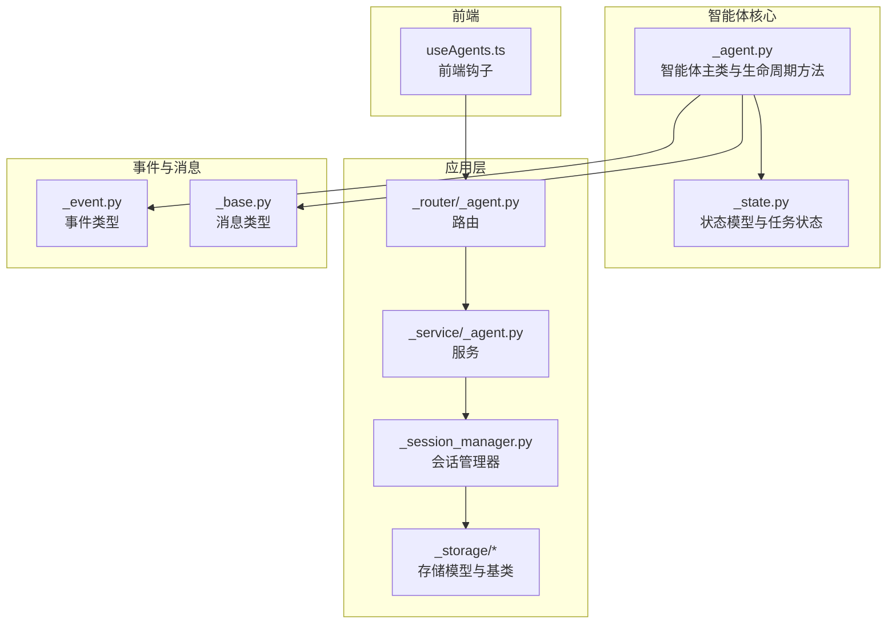
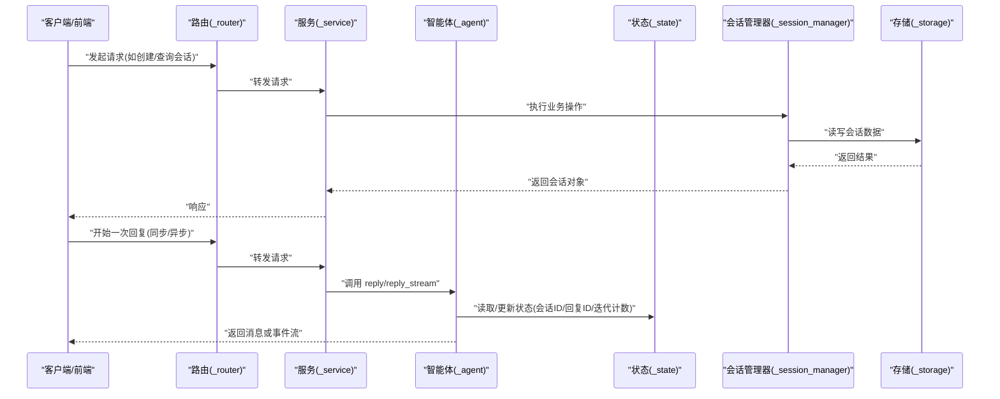
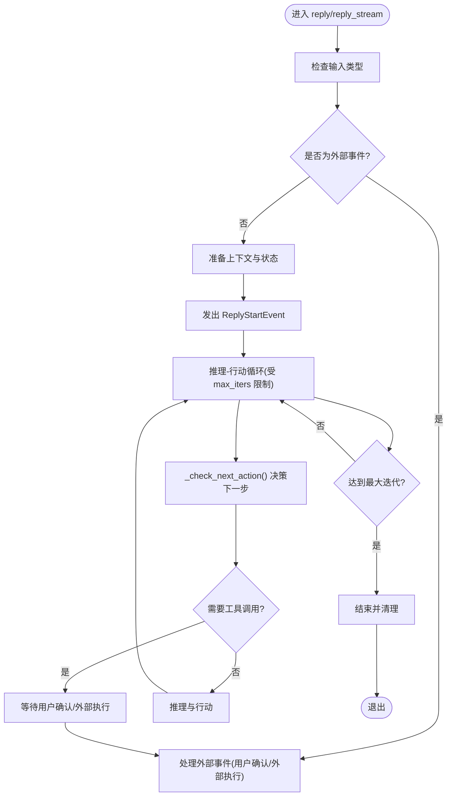
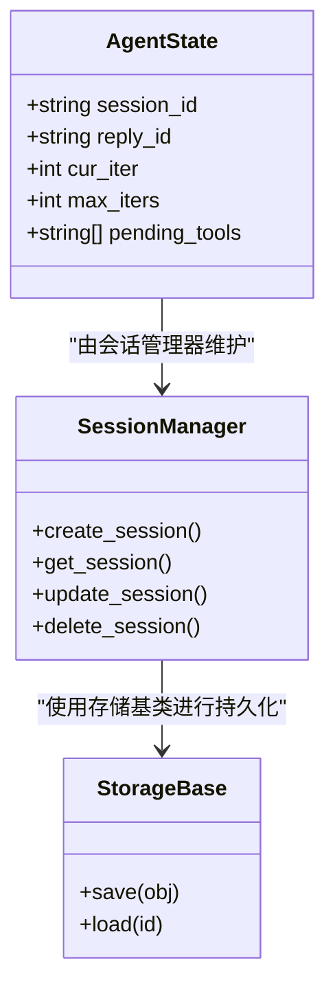
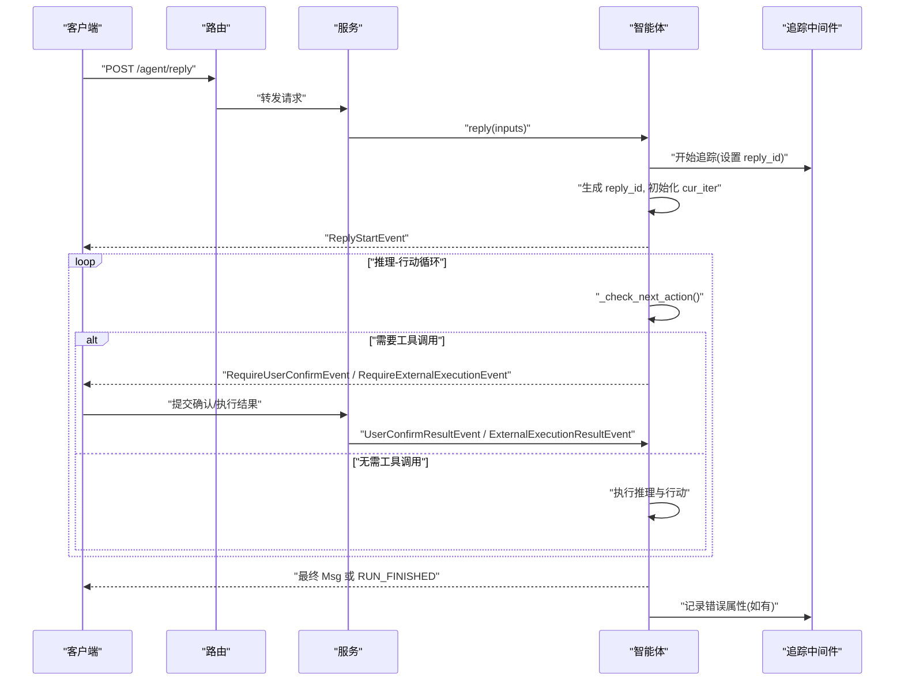
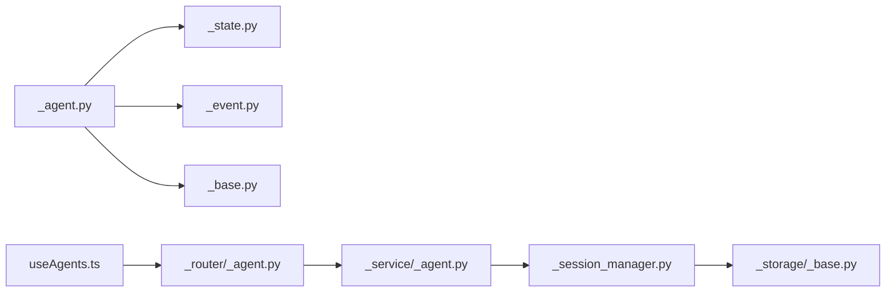

# 智能体生命周期

<cite>
**本文引用的文件**
- [agent/_agent.py](file://src/agentscope/agent/_agent.py)
- [state/_state.py](file://src/agentscope/state/_state.py)
- [app/_manager/_session_manager.py](file://src/agentscope/app/_manager/_session_manager.py)
- [middleware/_tracing/_trace.py](file://src/agentscope/middleware/_tracing/_trace.py)
- [app/_router/_agent.py](file://src/agentscope/app/_router/_agent.py)
- [app/_service/_agent.py](file://src/agentscope/app/_service/_agent.py)
- [message/_base.py](file://src/agentscope/message/_base.py)
- [event/_event.py](file://src/agentscope/event/_event.py)
- [app/storage/_model/_agent.py](file://src/agentscope/app/storage/_model/_agent.py)
- [app/storage/_base.py](file://src/agentscope/app/storage/_base.py)
- [examples/web_ui/frontend/src/hooks/useAgents.ts](file://examples/web_ui/frontend/src/hooks/useAgents.ts)
</cite>

## 目录
1. [引言](#引言)
2. [项目结构](#项目结构)
3. [核心组件](#核心组件)
4. [架构总览](#架构总览)
5. [详细组件分析](#详细组件分析)
6. [依赖关系分析](#依赖关系分析)
7. [性能考量](#性能考量)
8. [故障排查指南](#故障排查指南)
9. [结论](#结论)
10. [附录](#附录)

## 引言
本文件围绕 AgentScope 的智能体生命周期进行系统化说明，覆盖从初始化到运行、观察、再到清理的完整流程；解释状态管理（AgentState）及其持久化与恢复机制；阐述启动流程、运行时状态转换与终止条件；说明智能体与会话（session）的关系及多轮对话中的状态保持；并提供同步与异步两种操作模式下的使用要点与参考路径。

## 项目结构
AgentScope 将智能体能力与应用层解耦，核心逻辑集中在 agent 子模块，状态管理在 state 子模块，会话管理在 app._manager._session_manager 中，事件与消息模型在 event 与 message 子模块中定义，应用路由与服务在 app 子模块中实现，前端通过 hooks 管理智能体列表等资源。

图表来源
- [agent/_agent.py](file://src/agentscope/agent/_agent.py)
- [state/_state.py](file://src/agentscope/state/_state.py)
- [app/_manager/_session_manager.py](file://src/agentscope/app/_manager/_session_manager.py)
- [app/_router/_agent.py](file://src/agentscope/app/_router/_agent.py)
- [app/_service/_agent.py](file://src/agentscope/app/_service/_agent.py)
- [app/storage/_model/_agent.py](file://src/agentscope/app/storage/_model/_agent.py)
- [app/storage/_base.py](file://src/agentscope/app/storage/_base.py)
- [event/_event.py](file://src/agentscope/event/_event.py)
- [message/_base.py](file://src/agentscope/message/_base.py)
- [examples/web_ui/frontend/src/hooks/useAgents.ts](file://examples/web_ui/frontend/src/hooks/useAgents.ts)

章节来源
- [agent/_agent.py](file://src/agentscope/agent/_agent.py)
- [state/_state.py](file://src/agentscope/state/_state.py)
- [app/_manager/_session_manager.py](file://src/agentscope/app/_manager/_session_manager.py)
- [app/_router/_agent.py](file://src/agentscope/app/_router/_agent.py)
- [app/_service/_agent.py](file://src/agentscope/app/_service/_agent.py)
- [app/storage/_model/_agent.py](file://src/agentscope/app/storage/_model/_agent.py)
- [app/storage/_base.py](file://src/agentscope/app/storage/_base.py)
- [event/_event.py](file://src/agentscope/event/_event.py)
- [message/_base.py](file://src/agentscope/message/_base.py)
- [examples/web_ui/frontend/src/hooks/useAgents.ts](file://examples/web_ui/frontend/src/hooks/useAgents.ts)

## 核心组件
- 智能体主类：负责生命周期方法（初始化、回复、观察、清理），内部维护状态与中间件链路，支持同步与异步两种调用模式。
- 状态管理：包含会话 ID、回复 ID、当前迭代次数、最大迭代次数、工具调用等待队列等关键字段，支撑多轮对话与中断恢复。
- 会话管理：负责会话的创建、查询、更新与删除，并与存储层交互以实现状态持久化。
- 事件与消息：定义了 ReplyStartEvent、RequireUserConfirmEvent、RequireExternalExecutionEvent 等事件类型，以及 Msg 消息类型，贯穿整个生命周期。
- 应用路由与服务：提供 REST 风格接口，封装对智能体与会话的操作。
- 前端钩子：提供智能体列表的增删改查与自动刷新能力。

章节来源
- [agent/_agent.py](file://src/agentscope/agent/_agent.py)
- [state/_state.py](file://src/agentscope/state/_state.py)
- [app/_manager/_session_manager.py](file://src/agentscope/app/_manager/_session_manager.py)
- [event/_event.py](file://src/agentscope/event/_event.py)
- [message/_base.py](file://src/agentscope/message/_base.py)
- [app/_router/_agent.py](file://src/agentscope/app/_router/_agent.py)
- [app/_service/_agent.py](file://src/agentscope/app/_service/_agent.py)
- [app/storage/_model/_agent.py](file://src/agentscope/app/storage/_model/_agent.py)
- [app/storage/_base.py](file://src/agentscope/app/storage/_base.py)
- [examples/web_ui/frontend/src/hooks/useAgents.ts](file://examples/web_ui/frontend/src/hooks/useAgents.ts)

## 架构总览
下图展示了智能体生命周期在系统中的位置与交互关系：智能体通过路由与服务对外暴露接口，内部通过状态机推进运行阶段，事件驱动中间件与外部交互，会话管理器负责状态持久化与恢复。

图表来源
- [app/_router/_agent.py](file://src/agentscope/app/_router/_agent.py)
- [app/_service/_agent.py](file://src/agentscope/app/_service/_agent.py)
- [agent/_agent.py](file://src/agentscope/agent/_agent.py)
- [state/_state.py](file://src/agentscope/state/_state.py)
- [app/_manager/_session_manager.py](file://src/agentscope/app/_manager/_session_manager.py)
- [app/storage/_base.py](file://src/agentscope/app/storage/_base.py)

## 详细组件分析

### 智能体生命周期与状态管理
- 初始化阶段（__init__）
  - 智能体在构造时完成中间件过滤与注册，准备 on_reply、on_reasoning、on_acting、on_model_call、on_system_prompt、on_compress_context 等钩子链路，确保后续运行阶段可按需扩展。
  - 参考路径：[agent/_agent.py](file://src/agentscope/agent/_agent.py)
- 运行阶段（reply/reply_stream）
  - 同步模式：通过 reply 聚合事件流，返回最终 Msg。
  - 异步模式：通过 reply_stream 返回事件流，便于前端实时渲染与外部交互。
  - 在运行过程中，智能体会根据输入类型（Msg、UserConfirmResultEvent、ExternalExecutionResultEvent 等）决定是否继续或重启推理-行动循环。
  - 参考路径：[agent/_agent.py](file://src/agentscope/agent/_agent.py)
- 观察阶段（observe）
  - observe 并非独立方法，而是通过事件与消息模型在运行阶段自然产生与消费，例如 RequireUserConfirmEvent、RequireExternalExecutionEvent 等，形成“观察-决策-行动”的闭环。
  - 参考路径：[event/_event.py](file://src/agentscope/event/_event.py)，[message/_base.py](file://src/agentscope/message/_base.py)
- 清理阶段
  - 生命周期结束时，智能体会在 finally 分支中释放资源，同时事件追踪中间件会记录回复 ID、用户确认与外部执行待处理项等元信息，便于可观测性与恢复。
  - 参考路径：[agent/_agent.py](file://src/agentscope/agent/_agent.py)，[middleware/_tracing/_trace.py](file://src/agentscope/middleware/_tracing/_trace.py)

图表来源
- [agent/_agent.py](file://src/agentscope/agent/_agent.py)

章节来源
- [agent/_agent.py](file://src/agentscope/agent/_agent.py)
- [middleware/_tracing/_trace.py](file://src/agentscope/middleware/_tracing/_trace.py)
- [event/_event.py](file://src/agentscope/event/_event.py)
- [message/_base.py](file://src/agentscope/message/_base.py)

### AgentState 的作用、持久化与恢复
- AgentState 关键字段
  - session_id：标识所属会话，用于多轮对话的状态保持。
  - reply_id：标识当前回复的唯一 ID，便于事件追踪与恢复。
  - cur_iter/max_iters：当前迭代计数与最大迭代上限，控制推理-行动循环的边界。
  - 工具调用等待队列：记录待确认/待执行的工具调用名称，支持部分确认场景。
  - 参考路径：[state/_state.py](file://src/agentscope/state/_state.py)
- 持久化与恢复
  - 会话管理器与存储模型共同实现状态的持久化与恢复，前端通过 useAgents.ts 自动刷新列表，保证 UI 与后端状态一致。
  - 参考路径：[app/_manager/_session_manager.py](file://src/agentscope/app/_manager/_session_manager.py)，[app/storage/_model/_agent.py](file://src/agentscope/app/storage/_model/_agent.py)，[app/storage/_base.py](file://src/agentscope/app/storage/_base.py)，[examples/web_ui/frontend/src/hooks/useAgents.ts](file://examples/web_ui/frontend/src/hooks/useAgents.ts)

图表来源
- [state/_state.py](file://src/agentscope/state/_state.py)
- [app/_manager/_session_manager.py](file://src/agentscope/app/_manager/_session_manager.py)
- [app/storage/_base.py](file://src/agentscope/app/storage/_base.py)

章节来源
- [state/_state.py](file://src/agentscope/state/_state.py)
- [app/_manager/_session_manager.py](file://src/agentscope/app/_manager/_session_manager.py)
- [app/storage/_model/_agent.py](file://src/agentscope/app/storage/_model/_agent.py)
- [app/storage/_base.py](file://src/agentscope/app/storage/_base.py)
- [examples/web_ui/frontend/src/hooks/useAgents.ts](file://examples/web_ui/frontend/src/hooks/useAgents.ts)

### 启动流程、运行时状态转换与终止条件
- 启动流程
  - 客户端通过路由与服务发起请求，服务调用智能体的 reply 或 reply_stream 方法。
  - 智能体根据输入类型判断是否需要外部交互；若需要，则发出 RequireUserConfirmEvent 或 RequireExternalExecutionEvent，等待外部结果。
  - 参考路径：[app/_router/_agent.py](file://src/agentscope/app/_router/_agent.py)，[app/_service/_agent.py](file://src/agentscope/app/_service/_agent.py)，[agent/_agent.py](file://src/agentscope/agent/_agent.py)
- 运行时状态转换
  - 初始：收到输入后，生成新的 reply_id，清零迭代计数，发出 ReplyStartEvent。
  - 推理-行动循环：每轮根据 _check_next_action() 决策是否继续，直至达到 max_iters 或无更多工具调用。
  - 外部交互：当检测到需要用户确认或外部执行时，暂停并等待对应事件回调。
  - 参考路径：[agent/_agent.py](file://src/agentscope/agent/_agent.py)
- 终止条件
  - 达到最大迭代次数（max_iters）。
  - 无更多工具调用且无需进一步推理。
  - 发生异常并在追踪中间件中记录错误属性。
  - 参考路径：[agent/_agent.py](file://src/agentscope/agent/_agent.py)，[middleware/_tracing/_trace.py](file://src/agentscope/middleware/_tracing/_trace.py)

图表来源
- [agent/_agent.py](file://src/agentscope/agent/_agent.py)
- [middleware/_tracing/_trace.py](file://src/agentscope/middleware/_tracing/_trace.py)
- [app/_router/_agent.py](file://src/agentscope/app/_router/_agent.py)
- [app/_service/_agent.py](file://src/agentscope/app/_service/_agent.py)

章节来源
- [agent/_agent.py](file://src/agentscope/agent/_agent.py)
- [middleware/_tracing/_trace.py](file://src/agentscope/middleware/_tracing/_trace.py)
- [app/_router/_agent.py](file://src/agentscope/app/_router/_agent.py)
- [app/_service/_agent.py](file://src/agentscope/app/_service/_agent.py)

### 智能体与会话的关系、多轮对话与状态保持
- 会话关系
  - 智能体通过 session_id 与会话绑定，同一会话内的多次回复共享上下文与状态，确保多轮对话的一致性。
  - 参考路径：[state/_state.py](file://src/agentscope/state/_state.py)，[app/_manager/_session_manager.py](file://src/agentscope/app/_manager/_session_manager.py)
- 多轮对话中的状态保持
  - 每次回复开始前，智能体会重置 cur_iter 并生成新的 reply_id；但 session_id 保持不变，从而延续历史消息与上下文。
  - 参考路径：[agent/_agent.py](file://src/agentscope/agent/_agent.py)
- 前端状态保持
  - 前端通过 useAgents.ts 自动拉取最新智能体列表，避免 UI 与后端状态不一致。
  - 参考路径：[examples/web_ui/frontend/src/hooks/useAgents.ts](file://examples/web_ui/frontend/src/hooks/useAgents.ts)

章节来源
- [state/_state.py](file://src/agentscope/state/_state.py)
- [app/_manager/_session_manager.py](file://src/agentscope/app/_manager/_session_manager.py)
- [agent/_agent.py](file://src/agentscope/agent/_agent.py)
- [examples/web_ui/frontend/src/hooks/useAgents.ts](file://examples/web_ui/frontend/src/hooks/useAgents.ts)

### 同步与异步操作模式
- 同步模式（reply）
  - 适用于一次性获取最终结果的场景，内部会消费所有事件流并返回 Msg。
  - 参考路径：[agent/_agent.py](file://src/agentscope/agent/_agent.py)
- 异步模式（reply_stream）
  - 适用于需要实时渲染或与外部交互的场景，逐个产出事件，前端可边接收边显示。
  - 参考路径：[agent/_agent.py](file://src/agentscope/agent/_agent.py)

章节来源
- [agent/_agent.py](file://src/agentscope/agent/_agent.py)

## 依赖关系分析
- 智能体对状态与事件的依赖：智能体通过 AgentState 控制运行边界，通过事件与消息模型与外部交互。
- 应用层对存储的依赖：会话管理器与存储基类共同实现状态的持久化与恢复。
- 前端对路由与服务的依赖：前端通过路由访问服务，实现智能体的全量管理。

图表来源
- [agent/_agent.py](file://src/agentscope/agent/_agent.py)
- [state/_state.py](file://src/agentscope/state/_state.py)
- [event/_event.py](file://src/agentscope/event/_event.py)
- [message/_base.py](file://src/agentscope/message/_base.py)
- [app/_manager/_session_manager.py](file://src/agentscope/app/_manager/_session_manager.py)
- [app/storage/_base.py](file://src/agentscope/app/storage/_base.py)
- [app/_router/_agent.py](file://src/agentscope/app/_router/_agent.py)
- [app/_service/_agent.py](file://src/agentscope/app/_service/_agent.py)
- [examples/web_ui/frontend/src/hooks/useAgents.ts](file://examples/web_ui/frontend/src/hooks/useAgents.ts)

章节来源
- [agent/_agent.py](file://src/agentscope/agent/_agent.py)
- [state/_state.py](file://src/agentscope/state/_state.py)
- [event/_event.py](file://src/agentscope/event/_event.py)
- [message/_base.py](file://src/agentscope/message/_base.py)
- [app/_manager/_session_manager.py](file://src/agentscope/app/_manager/_session_manager.py)
- [app/storage/_base.py](file://src/agentscope/app/storage/_base.py)
- [app/_router/_agent.py](file://src/agentscope/app/_router/_agent.py)
- [app/_service/_agent.py](file://src/agentscope/app/_service/_agent.py)
- [examples/web_ui/frontend/src/hooks/useAgents.ts](file://examples/web_ui/frontend/src/hooks/useAgents.ts)

## 性能考量
- 事件流式输出（reply_stream）有助于降低前端等待时间，提升交互体验。
- 合理设置 max_iters，避免长时间推理-行动循环导致资源占用过高。
- 使用中间件进行上下文压缩与系统提示注入，减少不必要的计算开销。
- 对外部交互（用户确认/外部执行）采用增量处理，避免重复发送相同事件。

## 故障排查指南
- 无法收到事件流
  - 检查路由与服务是否正确转发请求至智能体的 reply_stream。
  - 参考路径：[app/_router/_agent.py](file://src/agentscope/app/_router/_agent.py)，[app/_service/_agent.py](file://src/agentscope/app/_service/_agent.py)
- 回复 ID 缺失或不一致
  - 确认智能体在每次回复开始时生成新的 reply_id，并在追踪中间件中记录。
  - 参考路径：[agent/_agent.py](file://src/agentscope/agent/_agent.py)，[middleware/_tracing/_trace.py](file://src/agentscope/middleware/_tracing/_trace.py)
- 会话状态不同步
  - 检查会话管理器与存储层的读写流程，确保 session_id 与状态一致。
  - 参考路径：[app/_manager/_session_manager.py](file://src/agentscope/app/_manager/_session_manager.py)，[app/storage/_base.py](file://src/agentscope/app/storage/_base.py)
- 前端列表不同步
  - 确保 useAgents.ts 在每次变更后触发 refetch，保持 UI 与后端一致。
  - 参考路径：[examples/web_ui/frontend/src/hooks/useAgents.ts](file://examples/web_ui/frontend/src/hooks/useAgents.ts)

章节来源
- [app/_router/_agent.py](file://src/agentscope/app/_router/_agent.py)
- [app/_service/_agent.py](file://src/agentscope/app/_service/_agent.py)
- [agent/_agent.py](file://src/agentscope/agent/_agent.py)
- [middleware/_tracing/_trace.py](file://src/agentscope/middleware/_tracing/_trace.py)
- [app/_manager/_session_manager.py](file://src/agentscope/app/_manager/_session_manager.py)
- [app/storage/_base.py](file://src/agentscope/app/storage/_base.py)
- [examples/web_ui/frontend/src/hooks/useAgents.ts](file://examples/web_ui/frontend/src/hooks/useAgents.ts)

## 结论
AgentScope 的智能体生命周期以状态驱动为核心，结合事件与消息模型实现与外部的解耦交互；通过会话管理与存储层保障多轮对话的状态一致性；借助路由与服务提供统一的接入点；前端通过钩子实现资源的自动刷新与一致展示。该设计既满足同步与异步两种使用场景，又具备良好的可观测性与可扩展性。

## 附录
- 关键实现参考路径汇总
  - 智能体生命周期与方法：[agent/_agent.py](file://src/agentscope/agent/_agent.py)
  - 状态模型：[state/_state.py](file://src/agentscope/state/_state.py)
  - 会话管理与存储：[app/_manager/_session_manager.py](file://src/agentscope/app/_manager/_session_manager.py)，[app/storage/_model/_agent.py](file://src/agentscope/app/storage/_model/_agent.py)，[app/storage/_base.py](file://src/agentscope/app/storage/_base.py)
  - 事件与消息：[event/_event.py](file://src/agentscope/event/_event.py)，[message/_base.py](file://src/agentscope/message/_base.py)
  - 应用路由与服务：[app/_router/_agent.py](file://src/agentscope/app/_router/_agent.py)，[app/_service/_agent.py](file://src/agentscope/app/_service/_agent.py)
  - 前端钩子：[examples/web_ui/frontend/src/hooks/useAgents.ts](file://examples/web_ui/frontend/src/hooks/useAgents.ts)