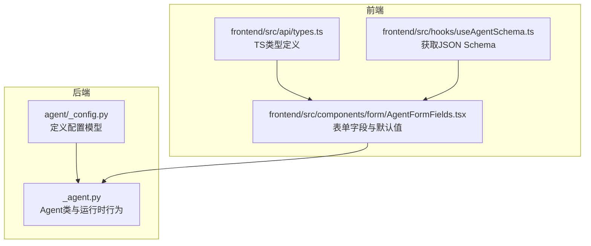
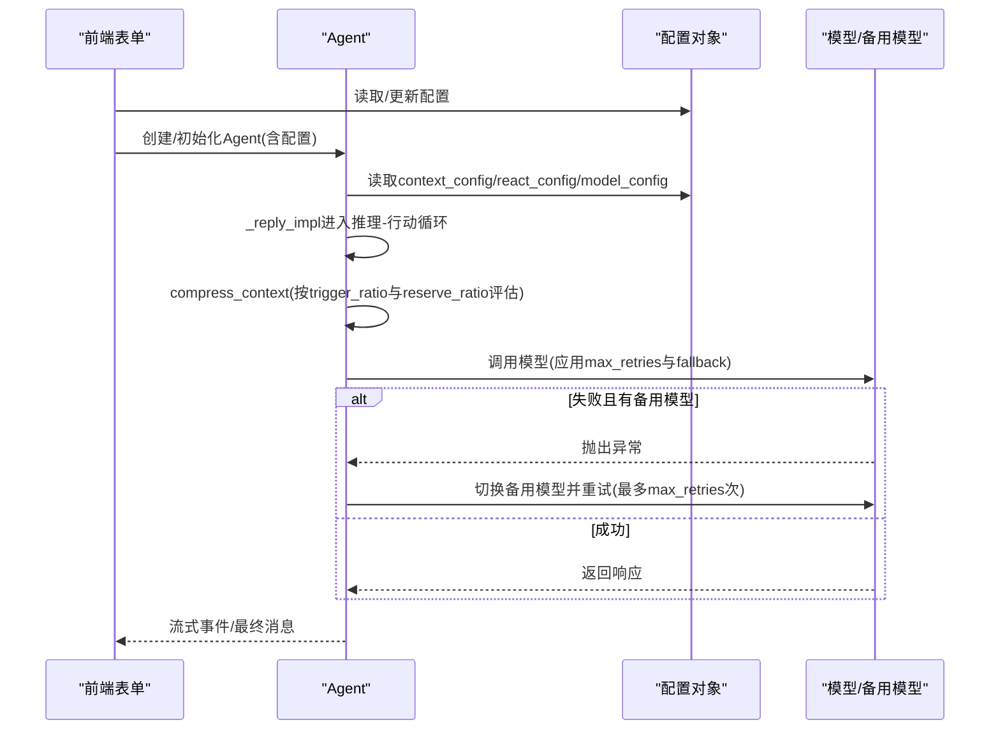
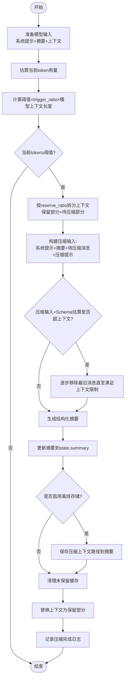
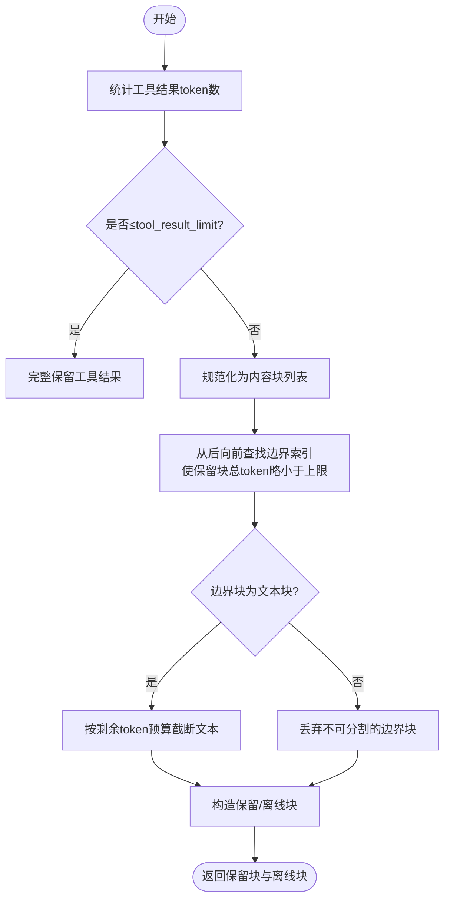
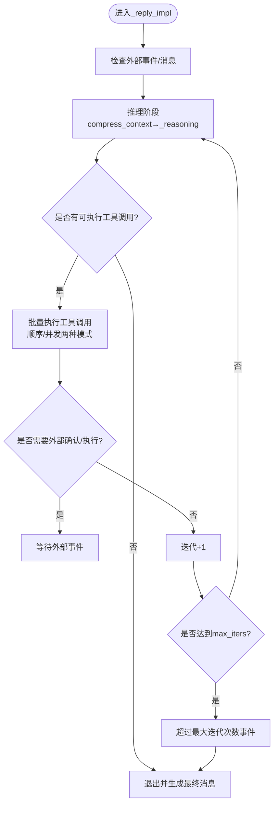
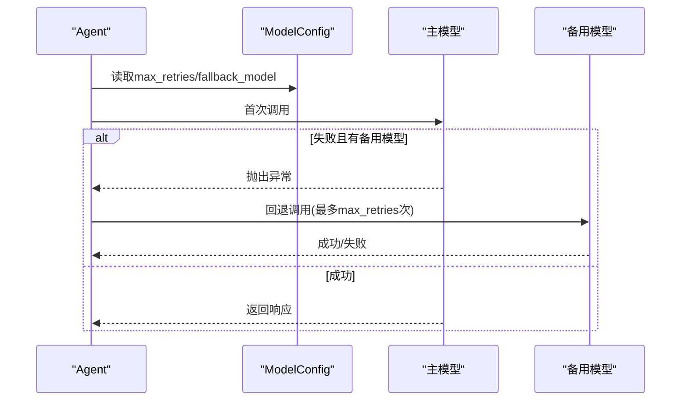
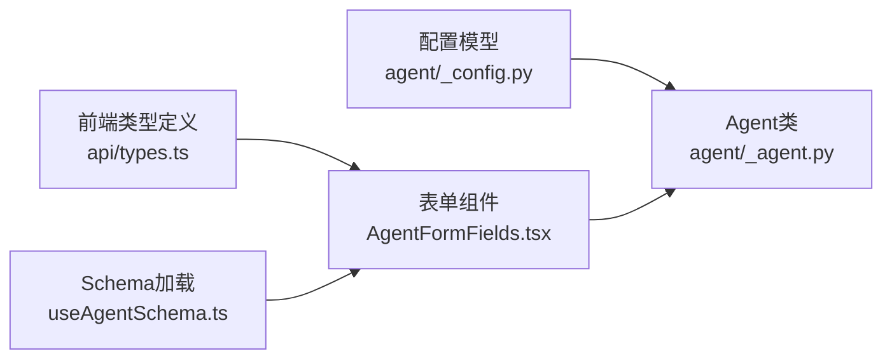

# 智能体配置系统

<cite>
**本文引用的文件**
- [agent/_config.py](file://src/agentscope/agent/_config.py)
- [agent/_agent.py](file://src/agentscope/agent/_agent.py)
- [examples/web_ui/frontend/src/api/types.ts](file://examples/web_ui/frontend/src/api/types.ts)
- [examples/web_ui/frontend/src/components/form/AgentFormFields.tsx](file://examples/web_ui/frontend/src/components/form/AgentFormFields.tsx)
- [examples/web_ui/frontend/src/hooks/useAgentSchema.ts](file://examples/web_ui/frontend/src/hooks/useAgentSchema.ts)
</cite>

## 目录
1. [简介](#简介)
2. [项目结构](#项目结构)
3. [核心组件](#核心组件)
4. [架构总览](#架构总览)
5. [详细组件分析](#详细组件分析)
6. [依赖关系分析](#依赖关系分析)
7. [性能考量](#性能考量)
8. [故障排查指南](#故障排查指南)
9. [结论](#结论)
10. [附录](#附录)

## 简介
本文件面向AgentScope智能体配置系统，聚焦三大核心配置组件：ModelConfig（模型配置）、ContextConfig（上下文配置）与ReActConfig（推理-行动配置）。文档从代码实现出发，系统阐述各配置类的参数语义、默认值、典型使用场景、参数间的相互作用关系（尤其是上下文压缩阈值与模型上下文长度的关系），并给出配置优先级与覆盖机制说明。最后提供面向不同应用场景的配置优化建议，兼顾性能与成本控制。

## 项目结构
AgentScope的配置系统主要位于Python后端的agent模块中，前端Web UI通过类型定义与表单逻辑映射这些配置结构，形成“后端Pydantic模型 + 前端Schema驱动UI”的闭环。

图表来源
- [agent/_config.py:1-178](file://src/agentscope/agent/_config.py#L1-L178)
- [agent/_agent.py:94-186](file://src/agentscope/agent/_agent.py#L94-L186)
- [examples/web_ui/frontend/src/api/types.ts:9-27](file://examples/web_ui/frontend/src/api/types.ts#L9-L27)
- [examples/web_ui/frontend/src/components/form/AgentFormFields.tsx:13-93](file://examples/web_ui/frontend/src/components/form/AgentFormFields.tsx#L13-L93)
- [examples/web_ui/frontend/src/hooks/useAgentSchema.ts:14-38](file://examples/web_ui/frontend/src/hooks/useAgentSchema.ts#L14-L38)

章节来源
- [agent/_config.py:1-178](file://src/agentscope/agent/_config.py#L1-L178)
- [agent/_agent.py:94-186](file://src/agentscope/agent/_agent.py#L94-L186)
- [examples/web_ui/frontend/src/api/types.ts:9-27](file://examples/web_ui/frontend/src/api/types.ts#L9-L27)
- [examples/web_ui/frontend/src/components/form/AgentFormFields.tsx:13-93](file://examples/web_ui/frontend/src/components/form/AgentFormFields.tsx#L13-L93)
- [examples/web_ui/frontend/src/hooks/useAgentSchema.ts:14-38](file://examples/web_ui/frontend/src/hooks/useAgentSchema.ts#L14-L38)

## 核心组件
本节对三大配置类进行逐项解析，包括参数含义、默认值、约束范围与典型用途。

- ModelConfig（模型配置）
  - max_retries：重试次数（非负整数）。语义与底层ChatModelBase一致，表示初始调用外的额外重试次数；总尝试次数为max_retries+1。默认0，避免与模型自身重试叠加。
  - fallback_model：备用模型实例。当主模型失败且存在备用模型时，按顺序尝试调用。
  - 使用场景：在不稳定网络或上游服务波动环境下提升可用性；对关键任务进行降级兜底。

- ContextConfig（上下文配置）
  - trigger_ratio：触发压缩的比例阈值（0, 0.9），默认0.8。当前token用量超过该比例×模型上下文长度时启动压缩。
  - reserve_ratio：保留比例（0, 0.9），默认0.1。用于在压缩前保留一定量的上下文，确保压缩提示与摘要生成有足够空间。
  - compression_prompt：压缩提示词模板，默认包含结构化摘要生成的系统提示。作为用户消息附加到压缩输入末尾。
  - summary_template：压缩摘要呈现模板，默认包含任务概要、当前状态、重要发现、下一步、需保留的上下文等占位段落。
  - summary_schema：结构化摘要的JSON Schema，默认来自内部SummarySchema模型，指导模型生成结构化摘要。
  - tool_result_limit：工具结果的token上限，默认3000。超过则截断或分块处理，避免工具输出撑爆上下文。
  - 使用场景：长对话、多轮工具调用、高并发工具输出等易导致上下文膨胀的场景。

- ReActConfig（推理-行动配置）
  - max_iters：推理-行动循环的最大迭代次数，默认20。防止无限循环或过长推理路径。
  - stop_on_reject：当工具调用被拒绝时是否停止回复，默认False。若为True，遇到外部拒绝会暂停等待人工确认或外部执行结果。
  - 使用场景：需要严格控制对话轮次与交互节奏的任务；对安全性要求高的场景可启用stop_on_reject以强制人工确认。

章节来源
- [agent/_config.py:56-126](file://src/agentscope/agent/_config.py#L56-L126)
- [agent/_config.py:128-147](file://src/agentscope/agent/_config.py#L128-L147)
- [agent/_config.py:150-178](file://src/agentscope/agent/_config.py#L150-L178)

## 架构总览
Agent在运行时根据配置决定上下文压缩策略、模型调用与回退策略、以及推理-行动循环的行为。前端通过类型与Schema驱动表单，将配置持久化到后端。

图表来源
- [agent/_agent.py:594-686](file://src/agentscope/agent/_agent.py#L594-L686)
- [agent/_agent.py:300-492](file://src/agentscope/agent/_agent.py#L300-L492)
- [agent/_agent.py:2003-2126](file://src/agentscope/agent/_agent.py#L2003-L2126)
- [agent/_config.py:56-126](file://src/agentscope/agent/_config.py#L56-L126)
- [agent/_config.py:150-178](file://src/agentscope/agent/_config.py#L150-L178)

## 详细组件分析

### 上下文压缩流程（ContextConfig）
上下文压缩是基于当前token估算与阈值比较决定是否压缩，并在保留一定上下文的前提下生成结构化摘要，替换旧的历史消息。

图表来源
- [agent/_agent.py:300-492](file://src/agentscope/agent/_agent.py#L300-L492)
- [agent/_config.py:56-126](file://src/agentscope/agent/_config.py#L56-L126)

章节来源
- [agent/_agent.py:300-492](file://src/agentscope/agent/_agent.py#L300-L492)
- [agent/_config.py:56-126](file://src/agentscope/agent/_config.py#L56-L126)

### 工具结果压缩与截断（ContextConfig.tool_result_limit）
当工具返回内容过大时，Agent会对工具结果进行分块与截断，确保不超过配置的token上限。

图表来源
- [agent/_agent.py:1805-1951](file://src/agentscope/agent/_agent.py#L1805-L1951)
- [agent/_config.py:117-125](file://src/agentscope/agent/_config.py#L117-L125)

章节来源
- [agent/_agent.py:1805-1951](file://src/agentscope/agent/_agent.py#L1805-L1951)
- [agent/_config.py:117-125](file://src/agentscope/agent/_config.py#L117-L125)

### 推理-行动循环（ReActConfig）
Agent在每次回复中进入推理-行动循环，依据工具调用状态与迭代次数推进。

图表来源
- [agent/_agent.py:594-686](file://src/agentscope/agent/_agent.py#L594-L686)
- [agent/_config.py:128-147](file://src/agentscope/agent/_config.py#L128-L147)

章节来源
- [agent/_agent.py:594-686](file://src/agentscope/agent/_agent.py#L594-L686)
- [agent/_config.py:128-147](file://src/agentscope/agent/_config.py#L128-L147)

### 模型调用与回退（ModelConfig）
Agent在调用模型时支持重试与备用模型回退，遵循max_retries与fallback_model配置。

图表来源
- [agent/_agent.py:2003-2126](file://src/agentscope/agent/_agent.py#L2003-L2126)
- [agent/_config.py:150-178](file://src/agentscope/agent/_config.py#L150-L178)

章节来源
- [agent/_agent.py:2003-2126](file://src/agentscope/agent/_agent.py#L2003-L2126)
- [agent/_config.py:150-178](file://src/agentscope/agent/_config.py#L150-L178)

## 依赖关系分析
- 配置类与Agent的耦合
  - Agent在初始化时接收三个配置对象，并在运行时读取其字段决定行为。
  - 上下文压缩依赖模型的context_size与count_tokens能力；工具结果压缩依赖模型的count_tokens能力。
  - 模型调用链路受ModelConfig的max_retries与fallback_model影响。
- 前后端映射
  - 前端TS类型与后端Pydantic模型保持一致字段名与语义，便于Schema驱动的表单渲染与默认值填充。
  - 前端Hook加载后端Schema，再由表单组件按Section提取默认值，形成“默认值→用户修改→持久化”的闭环。

图表来源
- [agent/_config.py:56-178](file://src/agentscope/agent/_config.py#L56-L178)
- [agent/_agent.py:94-186](file://src/agentscope/agent/_agent.py#L94-L186)
- [examples/web_ui/frontend/src/api/types.ts:9-27](file://examples/web_ui/frontend/src/api/types.ts#L9-L27)
- [examples/web_ui/frontend/src/components/form/AgentFormFields.tsx:13-93](file://examples/web_ui/frontend/src/components/form/AgentFormFields.tsx#L13-L93)
- [examples/web_ui/frontend/src/hooks/useAgentSchema.ts:14-38](file://examples/web_ui/frontend/src/hooks/useAgentSchema.ts#L14-L38)

章节来源
- [agent/_config.py:56-178](file://src/agentscope/agent/_config.py#L56-L178)
- [agent/_agent.py:94-186](file://src/agentscope/agent/_agent.py#L94-L186)
- [examples/web_ui/frontend/src/api/types.ts:9-27](file://examples/web_ui/frontend/src/api/types.ts#L9-L27)
- [examples/web_ui/frontend/src/components/form/AgentFormFields.tsx:13-93](file://examples/web_ui/frontend/src/components/form/AgentFormFields.tsx#L13-L93)
- [examples/web_ui/frontend/src/hooks/useAgentSchema.ts:14-38](file://examples/web_ui/frontend/src/hooks/useAgentSchema.ts#L14-L38)

## 性能考量
- 上下文压缩阈值与模型上下文长度
  - 触发阈值=trigger_ratio×模型上下文长度。合理设置trigger_ratio可在“压缩频率”和“压缩收益”之间平衡。
  - 保留比例reserve_ratio应小于trigger_ratio，确保压缩提示与摘要生成有足够空间。
- 工具结果截断
  - tool_result_limit过小会导致频繁截断与信息丢失；过大则可能挤占上下文。建议结合任务复杂度与模型上下文长度动态调整。
- 迭代次数与稳定性
  - max_iters过大会增加推理时间与成本；stop_on_reject可降低风险但可能延长交互周期。
- 重试与回退
  - max_retries建议保持较低值以避免与模型内重试叠加；fallback_model可提升可用性但需关注成本差异。

## 故障排查指南
- 上下文压缩失败或溢出
  - 现象：压缩过程中出现“上下文长度超出模型上下文长度”的警告，或压缩失败。
  - 可能原因：保留比例过高导致压缩空间不足；压缩提示过长；历史系统提示+摘要已接近阈值。
  - 处理建议：降低reserve_ratio；缩短compression_prompt；必要时允许移除最旧上下文以满足压缩需求。
- 工具结果过大导致截断
  - 现象：工具输出被截断或丢弃。
  - 可能原因：tool_result_limit过小；工具输出为不可分割块。
  - 处理建议：适当提高tool_result_limit；对工具输出进行预处理或分页返回。
- 推理-行动循环提前终止
  - 现象：超过最大迭代次数事件，任务未完成。
  - 可能原因：max_iters过低；工具调用阻塞或外部确认未及时返回。
  - 处理建议：提高max_iters；优化工具权限与外部交互流程；必要时启用stop_on_reject以获得人工干预。
- 模型调用失败
  - 现象：模型调用抛出异常。
  - 可能原因：网络抖动、上游限流、模型不可用。
  - 处理建议：启用fallback_model；合理设置max_retries；监控日志并定位失败根因。

章节来源
- [agent/_agent.py:300-492](file://src/agentscope/agent/_agent.py#L300-L492)
- [agent/_agent.py:1805-1951](file://src/agentscope/agent/_agent.py#L1805-L1951)
- [agent/_agent.py:594-686](file://src/agentscope/agent/_agent.py#L594-L686)
- [agent/_agent.py:2003-2126](file://src/agentscope/agent/_agent.py#L2003-L2126)

## 结论
AgentScope的配置系统通过清晰的三元结构（ModelConfig、ContextConfig、ReActConfig）实现了对模型调用、上下文管理与推理-行动循环的精细化控制。正确理解参数语义与相互作用关系，有助于在不同应用场景中取得性能与成本的最佳平衡。前端Schema驱动的表单体系进一步提升了配置的可维护性与一致性。

## 附录

### 配置优先级与覆盖机制
- 初始化优先级
  - Agent初始化时接收的配置对象优先于默认配置；后续可通过方法参数覆盖一次性的上下文压缩配置。
- 运行时覆盖
  - compress_context(context_config=None)：若传入新的ContextConfig，则仅本次压缩使用该配置；否则使用Agent持有的context_config。
  - 其他流程（如模型调用）直接读取Agent持有的配置对象，不支持临时覆盖。
- 前端默认值
  - 表单默认值来源于后端Schema的默认值，确保前后端一致。

章节来源
- [agent/_agent.py:106-150](file://src/agentscope/agent/_agent.py#L106-L150)
- [agent/_agent.py:259-298](file://src/agentscope/agent/_agent.py#L259-L298)
- [examples/web_ui/frontend/src/components/form/AgentFormFields.tsx:77-93](file://examples/web_ui/frontend/src/components/form/AgentFormFields.tsx#L77-L93)

### 参数与默认值速览
- ModelConfig
  - max_retries：默认0
  - fallback_model：默认None
- ContextConfig
  - trigger_ratio：默认0.8（范围(0, 0.9)）
  - reserve_ratio：默认0.1（范围(0, 0.9)，且小于trigger_ratio）
  - compression_prompt：默认结构化摘要引导提示
  - summary_template：默认包含任务概要、当前状态、重要发现、下一步、需保留上下文等段落
  - summary_schema：默认来自内部结构化摘要Schema
  - tool_result_limit：默认3000
- ReActConfig
  - max_iters：默认20
  - stop_on_reject：默认False

章节来源
- [agent/_config.py:56-178](file://src/agentscope/agent/_config.py#L56-L178)