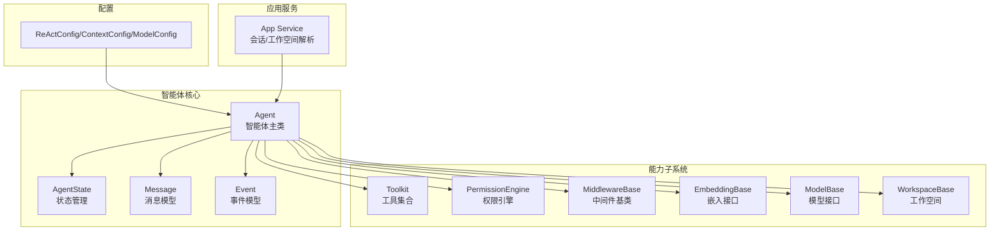
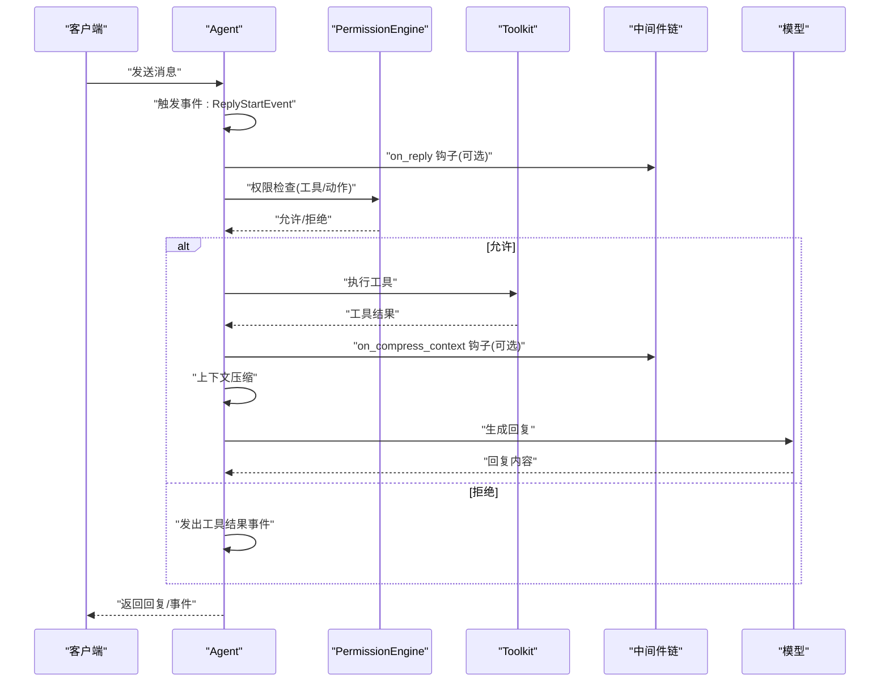
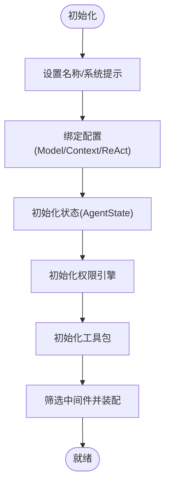
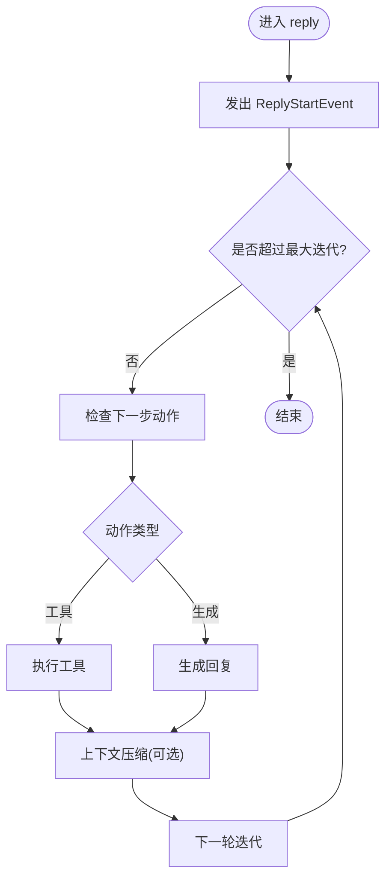
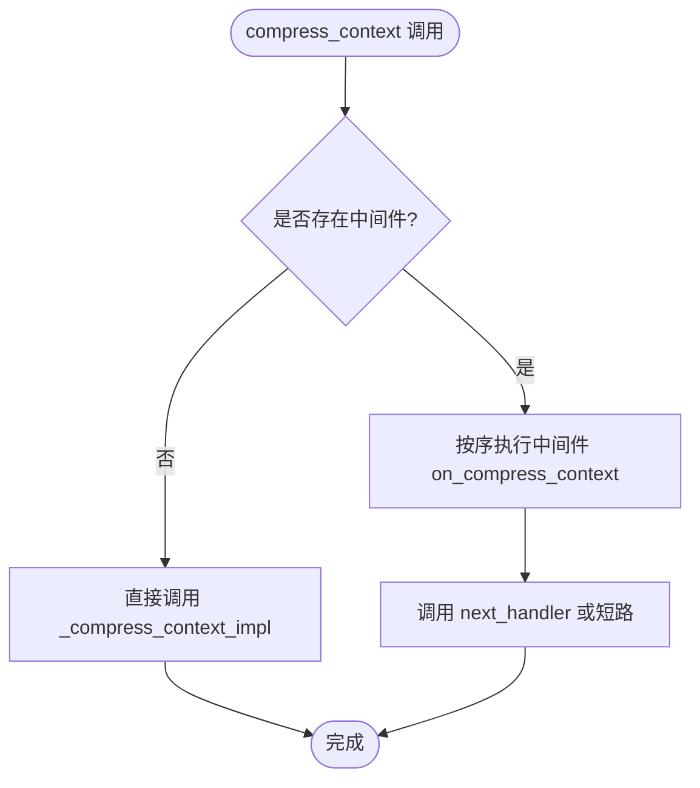
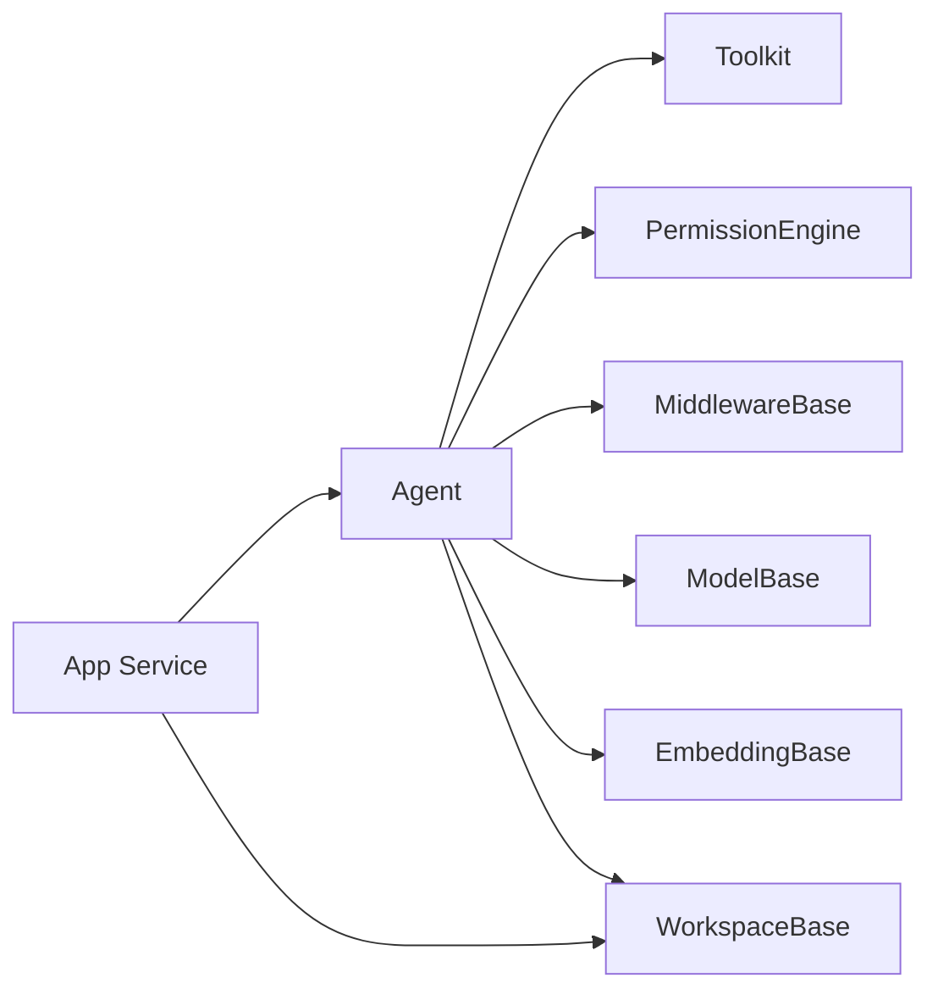

# 智能体（Agent）

<cite>
**本文引用的文件**
- [src/agentscope/agent/_agent.py](file://src/agentscope/agent/_agent.py)
- [src/agentscope/agent/_config.py](file://src/agentscope/agent/_config.py)
- [src/agentscope/tool/_toolkit.py](file://src/agentscope/tool/_toolkit.py)
- [src/agentscope/middleware/_base.py](file://src/agentscope/middleware/_base.py)
- [src/agentscope/permission/_engine.py](file://src/agentscope/permission/_engine.py)
- [src/agentscope/app/_service/_agent.py](file://src/agentscope/app/_service/_agent.py)
- [src/agentscope/message/_base.py](file://src/agentscope/message/_base.py)
- [src/agentscope/state/_state.py](file://src/agentscope/state/_state.py)
- [src/agentscope/embedding/_embedding_base.py](file://src/agentscope/embedding/_embedding_base.py)
- [src/agentscope/model/_base.py](file://src/agentscope/model/_base.py)
- [src/agentscope/event/_event.py](file://src/agentscope/event/_event.py)
- [src/agentscope/workspace/_base.py](file://src/agentscope/workspace/_base.py)
- [examples/web_ui/frontend/src/api/types.ts](file://examples/web_ui/frontend/src/api/types.ts)
- [tests/middleware_test.py](file://tests/middleware_test.py)
</cite>

## 目录
1. [简介](#简介)
2. [项目结构](#项目结构)
3. [核心组件](#核心组件)
4. [架构总览](#架构总览)
5. [详细组件分析](#详细组件分析)
6. [依赖分析](#依赖分析)
7. [性能考虑](#性能考虑)
8. [故障排查指南](#故障排查指南)
9. [结论](#结论)
10. [附录](#附录)

## 简介
本文件系统性阐述 AgentScope 中“智能体（Agent）”的概念与实现，覆盖其核心架构、生命周期管理、状态管理、消息处理机制、初始化与配置（ModelConfig、ContextConfig、ReActConfig）、回复流程（reply）、观察机制（observe）、上下文压缩、以及与工具包（Toolkit）、中间件（Middleware）、权限引擎（PermissionEngine）的交互关系。同时给出同步与异步调用方式的实践指引，并通过图示帮助读者建立从概念到实现的完整认知。

## 项目结构
AgentScope 的智能体位于 agent 子模块中，围绕智能体类（Agent）组织了配置、状态、消息、工具、中间件、权限等子系统。应用侧的服务层负责会话与工作空间的解析与装配，前端类型定义用于统一配置结构。

图表来源
- [src/agentscope/agent/_agent.py](file://src/agentscope/agent/_agent.py)
- [src/agentscope/agent/_config.py](file://src/agentscope/agent/_config.py)
- [src/agentscope/tool/_toolkit.py](file://src/agentscope/tool/_toolkit.py)
- [src/agentscope/middleware/_base.py](file://src/agentscope/middleware/_base.py)
- [src/agentscope/permission/_engine.py](file://src/agentscope/permission/_engine.py)
- [src/agentscope/app/_service/_agent.py](file://src/agentscope/app/_service/_agent.py)
- [src/agentscope/message/_base.py](file://src/agentscope/message/_base.py)
- [src/agentscope/state/_state.py](file://src/agentscope/state/_state.py)
- [src/agentscope/embedding/_embedding_base.py](file://src/agentscope/embedding/_embedding_base.py)
- [src/agentscope/model/_base.py](file://src/agentscope/model/_base.py)
- [src/agentscope/workspace/_base.py](file://src/agentscope/workspace/_base.py)

章节来源
- [src/agentscope/agent/_agent.py](file://src/agentscope/agent/_agent.py)
- [src/agentscope/agent/_config.py](file://src/agentscope/agent/_config.py)
- [src/agentscope/app/_service/_agent.py](file://src/agentscope/app/_service/_agent.py)

## 核心组件
- 智能体主类：封装生命周期、状态、消息处理、工具调用、权限控制、中间件链路与上下文压缩等。
- 配置体系：ModelConfig（模型与回退）、ContextConfig（上下文压缩阈值与保留比例等）、ReActConfig（最大迭代次数、拒绝时停止等）。
- 工具包：统一注册与执行工具，支持本地与远程工具。
- 权限引擎：基于会话上下文进行决策，控制工具调用与行为。
- 中间件：可插拔钩子（如 on_compress_context），支持洋葱式链路与短路。
- 应用服务：解析会话、工作空间、工具与中间件工厂，驱动智能体运行。

章节来源
- [src/agentscope/agent/_agent.py](file://src/agentscope/agent/_agent.py)
- [src/agentscope/agent/_config.py](file://src/agentscope/agent/_config.py)
- [src/agentscope/tool/_toolkit.py](file://src/agentscope/tool/_toolkit.py)
- [src/agentscope/permission/_engine.py](file://src/agentscope/permission/_engine.py)
- [src/agentscope/middleware/_base.py](file://src/agentscope/middleware/_base.py)
- [src/agentscope/app/_service/_agent.py](file://src/agentscope/app/_service/_agent.py)

## 架构总览
下图展示了智能体在一次对话中的典型交互：接收消息 → 触发事件 → 进入 ReAct 循环 → 权限校验 → 工具调用 → 上下文压缩 → 生成回复 → 发出事件。

图表来源
- [src/agentscope/agent/_agent.py](file://src/agentscope/agent/_agent.py)
- [src/agentscope/permission/_engine.py](file://src/agentscope/permission/_engine.py)
- [src/agentscope/tool/_toolkit.py](file://src/agentscope/tool/_toolkit.py)
- [src/agentscope/middleware/_base.py](file://src/agentscope/middleware/_base.py)
- [src/agentscope/model/_base.py](file://src/agentscope/model/_base.py)
- [src/agentscope/event/_event.py](file://src/agentscope/event/_event.py)

## 详细组件分析

### 智能体生命周期与初始化
- 初始化阶段：设置名称、系统提示、模型、状态、配置；构建权限引擎；准备工具包；筛选并装配中间件；绑定工作空间/卸载器。
- 生命周期入口：reply（同步/异步）作为对外统一接口，内部维护会话与迭代状态，驱动 ReAct 循环。
- 事件驱动：在开始回复、工具调用前后发出事件，便于观测与调试。

图表来源
- [src/agentscope/agent/_agent.py](file://src/agentscope/agent/_agent.py)
- [src/agentscope/state/_state.py](file://src/agentscope/state/_state.py)
- [src/agentscope/permission/_engine.py](file://src/agentscope/permission/_engine.py)
- [src/agentscope/tool/_toolkit.py](file://src/agentscope/tool/_toolkit.py)
- [src/agentscope/middleware/_base.py](file://src/agentscope/middleware/_base.py)

章节来源
- [src/agentscope/agent/_agent.py](file://src/agentscope/agent/_agent.py)

### 状态管理（AgentState）
- 作用：记录会话标识、当前回复标识、当前迭代次数、权限上下文等，贯穿一次或多轮对话。
- 关键字段：session_id、reply_id、cur_iter、permission_context 等。
- 使用场景：在回复开始前生成新的 reply_id 并重置 cur_iter；在循环中递增迭代计数；与权限引擎共享上下文。

章节来源
- [src/agentscope/state/_state.py](file://src/agentscope/state/_state.py)
- [src/agentscope/agent/_agent.py](file://src/agentscope/agent/_agent.py)

### 消息处理与观察机制（observe）
- 接收输入：支持同步或异步消息流；在异步模式下逐条处理事件并可能产生等待态。
- 观察与事件：在进入回复前发出 ReplyStartEvent；根据工具调用结果发出工具事件；在循环中持续推进。
- 事件类型：ReplyStartEvent、工具结果事件等，用于外部监听与可观测性。

章节来源
- [src/agentscope/agent/_agent.py](file://src/agentscope/agent/_agent.py)
- [src/agentscope/event/_event.py](file://src/agentscope/event/_event.py)
- [src/agentscope/message/_base.py](file://src/agentscope/message/_base.py)

### 回复流程（reply）
- 同步与异步：支持同步调用与异步生成器两种模式；异步模式适合长回复与流式输出。
- ReAct 循环：在每次迭代中检查下一步动作（推理/行动），执行工具或生成回复，直到达到最大迭代次数或无待执行动作。
- 事件与状态：每次回复开始生成新的 reply_id；在循环中更新 cur_iter；根据权限与工具结果决定后续步骤。

图表来源
- [src/agentscope/agent/_agent.py](file://src/agentscope/agent/_agent.py)
- [src/agentscope/event/_event.py](file://src/agentscope/event/_event.py)

章节来源
- [src/agentscope/agent/_agent.py](file://src/agentscope/agent/_agent.py)

### 上下文压缩（Context Compression）
- 触发条件：当消息/工具结果累积到一定阈值（trigger_ratio）时触发压缩。
- 压缩策略：保留指定比例（reserve_ratio）的最新内容，对历史进行摘要或裁剪；可自定义摘要模板与压缩提示。
- 中间件链：支持 on_compress_context 钩子，按洋葱顺序执行，允许短路跳过实际压缩逻辑。
- 测试验证：测试覆盖多中间件串联、短路与直连三种情形，确保链路正确性与可扩展性。

图表来源
- [src/agentscope/agent/_agent.py](file://src/agentscope/agent/_agent.py)
- [tests/middleware_test.py](file://tests/middleware_test.py)

章节来源
- [src/agentscope/agent/_agent.py](file://src/agentscope/agent/_agent.py)
- [tests/middleware_test.py](file://tests/middleware_test.py)

### 配置详解（ModelConfig、ContextConfig、ReActConfig）
- ModelConfig：包含主模型与可选回退模型、重试策略等，用于在主模型失败时自动切换。
- ContextConfig：控制上下文压缩的触发比例、保留比例、工具结果大小限制、摘要模板与压缩提示。
- ReActConfig：控制最大迭代次数、遇到拒绝时是否提前停止等。

章节来源
- [src/agentscope/agent/_config.py](file://src/agentscope/agent/_config.py)
- [examples/web_ui/frontend/src/api/types.ts](file://examples/web_ui/frontend/src/api/types.ts)

### 与工具包（Toolkit）的交互
- 注册与发现：工具包统一注册工具，智能体通过名称或签名查找并执行。
- 执行流程：权限引擎先做校验，再交由工具包执行；工具结果回传给智能体，参与上下文压缩与回复生成。
- 任务型工具：支持任务创建/查询/更新等操作，便于复杂流程编排。

章节来源
- [src/agentscope/tool/_toolkit.py](file://src/agentscope/tool/_toolkit.py)
- [src/agentscope/agent/_agent.py](file://src/agentscope/agent/_agent.py)

### 与中间件（Middleware）的交互
- 钩子机制：支持 on_reply、on_compress_context 等钩子；中间件以洋葱方式组合，支持短路。
- 链式执行：通过 next_handler 传递输入参数，实现前置/后置处理与条件跳过。
- 测试保障：测试覆盖多中间件串联、短路与直连三种场景，验证链路与参数传递。

章节来源
- [src/agentscope/middleware/_base.py](file://src/agentscope/middleware/_base.py)
- [src/agentscope/agent/_agent.py](file://src/agentscope/agent/_agent.py)
- [tests/middleware_test.py](file://tests/middleware_test.py)

### 与权限引擎（PermissionEngine）的交互
- 决策依据：基于会话上下文（AgentState.permission_context）进行工具/动作的允许/拒绝判断。
- 集成点：在回复流程中检查下一步动作前执行权限校验；拒绝时发出工具结果事件，避免执行非法动作。
- 可扩展：规则与决策模块可替换，适配不同安全策略。

章节来源
- [src/agentscope/permission/_engine.py](file://src/agentscope/permission/_engine.py)
- [src/agentscope/agent/_agent.py](file://src/agentscope/agent/_agent.py)

### 与模型（Model）与嵌入（Embedding）的交互
- 模型接口：统一 Chat/Embedding 接口，支持 OpenAI、DashScope、Anthropic 等多家厂商。
- 嵌入缓存：提供嵌入缓存与用量统计，优化上下文压缩与相似度计算。
- 应用服务：在会话初始化时解析并注入模型实例，支持回退模型与重试策略。

章节来源
- [src/agentscope/model/_base.py](file://src/agentscope/model/_base.py)
- [src/agentscope/embedding/_embedding_base.py](file://src/agentscope/embedding/_embedding_base.py)
- [src/agentscope/app/_service/_agent.py](file://src/agentscope/app/_service/_agent.py)

### 与工作空间（Workspace）的交互
- 工作空间职责：提供工具列表、文件系统、进程执行环境等，支持本地、Docker、E2B 等多种后端。
- 卸载协议：支持工具离线执行与结果回传，提升安全性与隔离性。
- 应用服务：在会话启动时解析工作空间并注入工具与中间件工厂。

章节来源
- [src/agentscope/workspace/_base.py](file://src/agentscope/workspace/_base.py)
- [src/agentscope/app/_service/_agent.py](file://src/agentscope/app/_service/_agent.py)

## 依赖分析
- 组件耦合：智能体与工具包、中间件、权限引擎松耦合，通过接口与事件解耦；与模型/嵌入/工作空间通过抽象接口连接。
- 外部依赖：应用服务负责会话与工作空间解析，前端类型定义统一配置结构。
- 潜在风险：中间件链过长可能影响延迟；上下文压缩策略不当可能导致信息丢失；权限规则过于严格可能阻碍工具调用。

图表来源
- [src/agentscope/agent/_agent.py](file://src/agentscope/agent/_agent.py)
- [src/agentscope/tool/_toolkit.py](file://src/agentscope/tool/_toolkit.py)
- [src/agentscope/permission/_engine.py](file://src/agentscope/permission/_engine.py)
- [src/agentscope/middleware/_base.py](file://src/agentscope/middleware/_base.py)
- [src/agentscope/model/_base.py](file://src/agentscope/model/_base.py)
- [src/agentscope/embedding/_embedding_base.py](file://src/agentscope/embedding/_embedding_base.py)
- [src/agentscope/workspace/_base.py](file://src/agentscope/workspace/_base.py)
- [src/agentscope/app/_service/_agent.py](file://src/agentscope/app/_service/_agent.py)

## 性能考虑
- 上下文压缩：合理设置 trigger_ratio 与 reserve_ratio，避免频繁压缩带来的额外开销；优先保留关键上下文。
- 中间件链：减少不必要的钩子与 IO 操作；短路可显著降低延迟。
- 工具执行：优先选择轻量工具；对耗时工具采用异步执行与结果缓存。
- 模型调用：启用回退模型与重试策略，平衡成功率与延迟；对长回复采用流式输出。
- 嵌入与缓存：利用嵌入缓存减少重复计算；控制摘要模板长度以降低 Token 消耗。

## 故障排查指南
- 权限拒绝：检查权限规则与会话上下文；确认工具签名与参数匹配。
- 中间件异常：逐个禁用中间件定位问题；关注 on_compress_context 链路的短路与参数传递。
- 上下文压缩无效：核对 trigger_ratio 与 reserve_ratio 设置；确认摘要模板与压缩提示有效。
- 工具执行失败：查看工具返回码与日志；确认工作空间与卸载协议配置正确。
- 模型调用错误：检查凭证与模型参数；启用回退模型以提高可用性。

章节来源
- [src/agentscope/agent/_agent.py](file://src/agentscope/agent/_agent.py)
- [src/agentscope/permission/_engine.py](file://src/agentscope/permission/_engine.py)
- [src/agentscope/middleware/_base.py](file://src/agentscope/middleware/_base.py)
- [src/agentscope/workspace/_base.py](file://src/agentscope/workspace/_base.py)
- [src/agentscope/app/_service/_agent.py](file://src/agentscope/app/_service/_agent.py)

## 结论
AgentScope 的智能体以“配置驱动 + 插件化中间件 + 权限控制 + 工具编排”的架构实现了高扩展与高可控的对话智能体。通过清晰的状态管理、事件驱动的消息处理、可插拔的中间件链与严谨的权限校验，智能体能够在复杂场景中稳定运行。结合上下文压缩与工作空间卸载能力，进一步提升了性能与安全性。建议在生产环境中合理配置三类配置参数，谨慎设计中间件链与权限规则，并充分利用事件与日志进行可观测性建设。

## 附录

### 配置参数与使用要点
- ModelConfig：主模型与回退模型配置，用于容灾与稳定性。
- ContextConfig：触发与保留比例、工具结果限制、摘要模板与压缩提示，用于控制上下文规模与质量。
- ReActConfig：最大迭代次数与拒绝停止策略，用于平衡效果与成本。

章节来源
- [src/agentscope/agent/_config.py](file://src/agentscope/agent/_config.py)
- [examples/web_ui/frontend/src/api/types.ts](file://examples/web_ui/frontend/src/api/types.ts)

### 同步与异步调用示例（路径参考）
- 同步回复：调用智能体的同步接口，适用于简单场景与快速响应。
- 异步回复：使用异步生成器，适用于长回复与流式输出；可在循环中逐步产出中间结果。
- 事件监听：订阅 ReplyStartEvent 与工具结果事件，实现可观测与可观测性增强。

章节来源
- [src/agentscope/agent/_agent.py](file://src/agentscope/agent/_agent.py)
- [src/agentscope/event/_event.py](file://src/agentscope/event/_event.py)