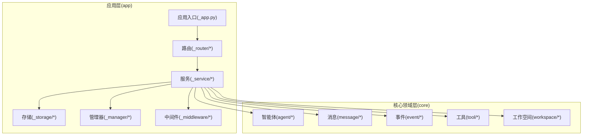
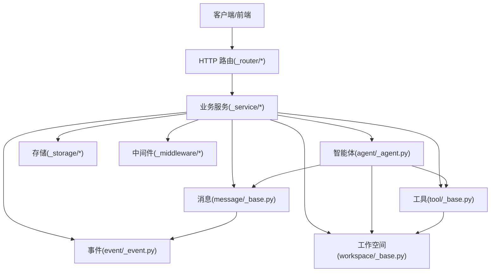
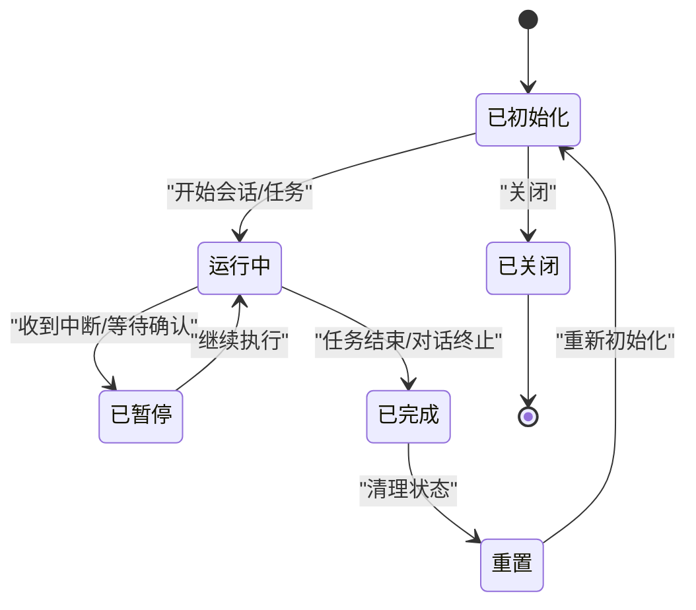
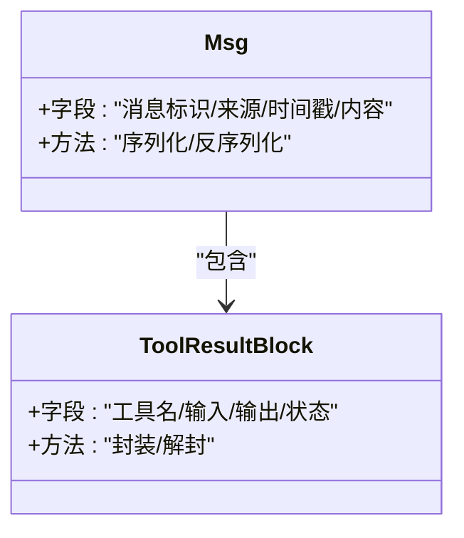
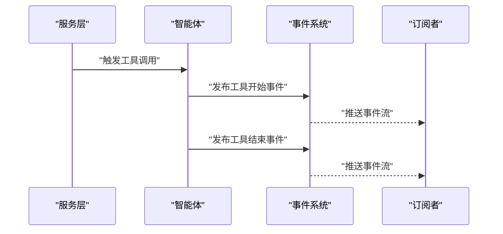
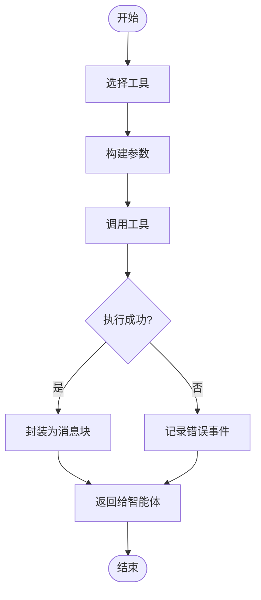
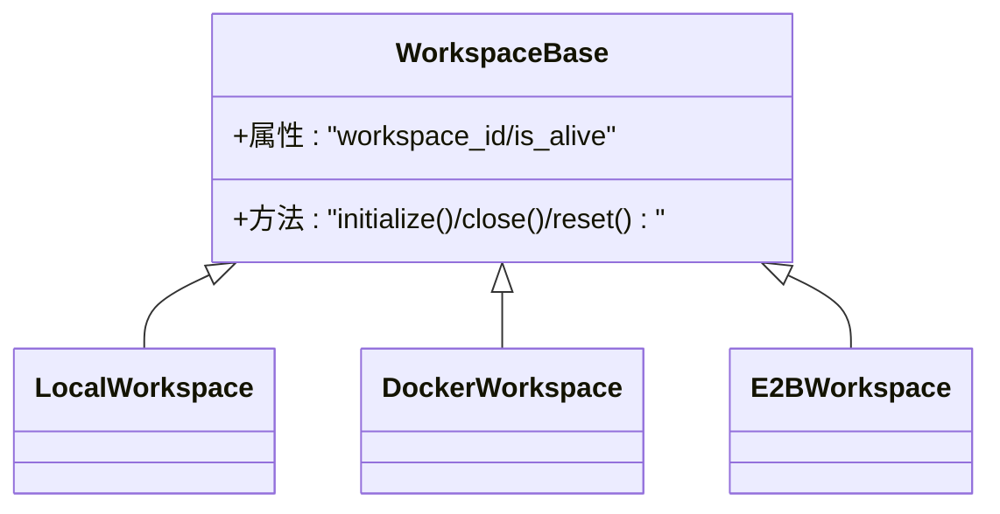
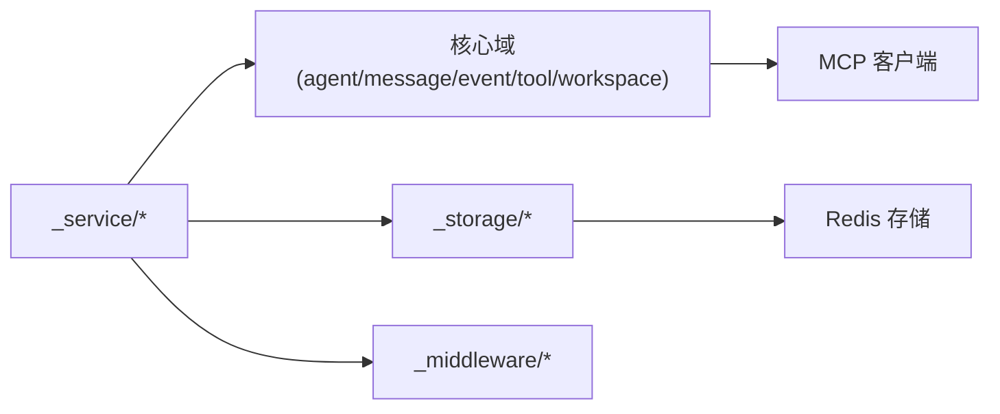

# 核心概念

<cite>
**本文引用的文件**
- [workspace/_base.py](file://src/agentscope/workspace/_base.py)
- [message/_base.py](file://src/agentscope/message/_base.py)
- [event/_event.py](file://src/agentscope/event/_event.py)
- [tool/_base.py](file://src/agentscope/tool/_base.py)
- [agent/_agent.py](file://src/agentscope/agent/_agent.py)
- [_utils/_common.py](file://src/agentscope/_utils/_common.py)
- [_utils/_mixin.py](file://src/agentscope/_utils/_mixin.py)
- [app/_app.py](file://src/agentscope/app/_app.py)
- [app/_lifespan.py](file://src/agentscope/app/_lifespan.py)
- [app/_types.py](file://src/agentscope/app/_types.py)
- [app/_deps.py](file://src/agentscope/app/_deps.py)
- [app/_router/_agent.py](file://src/agentscope/app/_router/_agent.py)
- [app/_router/_workspace.py](file://src/agentscope/app/_router/_workspace.py)
- [app/_router/_chat.py](file://src/agentscope/app/_router/_chat.py)
- [app/_router/_session.py](file://src/agentscope/app/_router/_session.py)
- [app/_router/_schedule.py](file://src/agentscope/app/_router/_schedule.py)
- [app/_router/_credential.py](file://src/agentscope/app/_router/_credential.py)
- [app/_router/_model.py](file://src/agentscope/app/_router/_model.py)
- [app/_middleware/_tool_offload_middleware.py](file://src/agentscope/app/_middleware/_tool_offload_middleware.py)
- [app/_middleware/_protocol/_base.py](file://src/agentscope/app/_middleware/_protocol/_base.py)
- [app/_middleware/_protocol/_agui.py](file://src/agentscope/app/_middleware/_protocol/_agui.py)
- [app/storage/_base.py](file://src/agentscope/app/storage/_base.py)
- [app/storage/_redis_storage.py](file://src/agentscope/app/storage/_redis_storage.py)
- [app/storage/_model/_agent.py](file://src/agentscope/app/storage/_model/_agent.py)
- [app/storage/_model/_base.py](file://src/agentscope/app/storage/_model/_base.py)
- [app/storage/_model/_credential.py](file://src/agentscope/app/storage/_model/_credential.py)
- [app/storage/_model/_schedule.py](file://src/agentscope/app/storage/_model/_schedule.py)
- [app/storage/_model/_session.py](file://src/agentscope/app/storage/_model/_session.py)
- [app/storage/_model/_user.py](file://src/agentscope/app/storage/_model/_user.py)
- [app/_manager/_workspace_manager.py](file://src/agentscope/app/_manager/_workspace_manager.py)
- [app/_manager/_scheduler_manager.py](file://src/agentscope/app/_manager/_scheduler_manager.py)
- [app/_manager/_background_task_manager.py](file://src/agentscope/app/_manager/_background_task_manager.py)
- [app/_manager/_session_manager.py](file://src/agentscope/app/_manager/_session_manager.py)
- [app/_manager/_docker_workspace_manager.py](file://src/agentscope/app/_manager/_docker_workspace_manager.py)
- [app/_manager/_e2b_workspace_manager.py](file://src/agentscope/app/_manager/_e2b_workspace_manager.py)
- [app/_manager/_scheduler/_tools/_schedule_create.py](file://src/agentscope/app/_manager/_scheduler/_tools/_schedule_create.py)
- [app/_manager/_scheduler/_tools/_schedule_list.py](file://src/agentscope/app/_manager/_scheduler/_tools/_schedule_list.py)
- [app/_manager/_scheduler/_tools/_schedule_stop.py](file://src/agentscope/app/_manager/_scheduler/_tools/_schedule_stop.py)
- [app/_manager/_scheduler/_tools/_schedule_view.py](file://src/agentscope/app/_manager/_scheduler/_tools/_schedule_view.py)
- [app/_schema/_agent.py](file://src/agentscope/app/_schema/_agent.py)
- [app/_schema/_background_task.py](file://src/agentscope/app/_schema/_background_task.py)
- [app/_schema/_chat.py](file://src/agentscope/app/_schema/_chat.py)
- [app/_schema/_credential.py](file://src/agentscope/app/_schema/_credential.py)
- [app/_schema/_mcp.py](file://src/agentscope/app/_schema/_mcp.py)
- [app/_schema/_model.py](file://src/agentscope/app/_schema/_model.py)
- [app/_schema/_schedule.py](file://src/agentscope/app/_schema/_schedule.py)
- [app/_schema/_session.py](file://src/agentscope/app/_schema/_session.py)
- [app/_service/_agent.py](file://src/agentscope/app/_service/_agent.py)
- [app/_service/_chat.py](file://src/agentscope/app/_service/_chat.py)
- [app/_service/_model.py](file://src/agentscope/app/_service/_model.py)
- [app/_service/_background_task.py](file://src/agentscope/app/_service/_background_task.py)
- [app/_service/_schedule.py](file://src/agentscope/app/_service/_schedule.py)
- [app/_service/_session.py](file://src/agentscope/app/_service/_session.py)
- [app/_service/_credential.py](file://src/agentscope/app/_service/_credential.py)
- [app/_service/_workspace.py](file://src/agentscope/app/_service/_workspace.py)
- [app/_service/_mcp.py](file://src/agentscope/app/_service/_mcp.py)
- [app/_service/_model.py](file://src/agentscope/app/_service/_model.py)
- [app/_service/_background_task.py](file://src/agentscope/app/_service/_background_task.py)
- [app/_service/_schedule.py](file://src/agentscope/app/_service/_schedule.py)
- [app/_service/_session.py](file://src/agentscope/app/_service/_session.py)
- [app/_service/_credential.py](file://src/agentscope/app/_service/_credential.py)
- [app/_service/_workspace.py](file://src/agentscope/app/_service/_workspace.py)
- [app/_service/_mcp.py](file://src/agentscope/app/_service/_mcp.py)
- [app/_service/_model.py](file://src/agentscope/app/_service/_model.py)
- [app/_service/_background_task.py](file://src/agentscope/app/_service/_background_task.py)
- [app/_service/_schedule.py](file://src/agentscope/app/_service/_schedule.py)
- [app/_service/_session.py](file://src/agentscope/app/_service/_session.py)
- [app/_service/_credential.py](file://src/agentscope/app/_service/_credential.py)
- [app/_service/_workspace.py](file://src/agentscope/app/_service/_workspace.py)
- [app/_service/_mcp.py](file://src/agentscope/app/_service/_mcp.py)
- [app/_service/_model.py](file://src/agentscope/app/_service/_model.py)
- [app/_service/_background_task.py](file://src/agentscope/app/_service/_background_task.py)
- [app/_service/_schedule.py](file://src/agentscope/app/_service/_schedule.py)
- [app/_service/_session.py](file://src/agentscope/app/_service/_session.py)
- [app/_service/_credential.py](file://src/agentscope/app/_service/_credential.py)
- [app/_service/_workspace.py](file://src/agentscope/app/_service/_workspace.py)
- [app/_service/_mcp.py](file://src/agentscope/app/_service/_mcp.py)
- [app/_service/_model.py](file://src/agentscope/app/_service/_model.py)
- [app/_service/_background_task.py](file://src/agentscope/app/_service/_background_task.py)
- [app/_service/_schedule.py](file://src/agentscope/app/_service/_schedule.py)
- [app/_service/_session.py](file://src/agentscope/app/_service/_session.py)
- [app/_service/_credential.py](file://src/agentscope/app/_service/_credential.py)
- [app/_service/_workspace.py](file://src/agentscope/app/_service/_workspace.py)
- [app/_service/_mcp.py](file://src/agentscope/app/_service/_mcp.py)
- [app/_service/_model.py](file://src/agentscope/app/_service/_model.py)
- [app/_service/_background_task.py](file://src/agentscope/app/_service/_background_task.py)
- [app/_service/_schedule.py](file://src/agentscope/app/_service/_schedule.py)
- [app/_service/_session.py](file://src/agentscope/app/_service/_session.py)
- [app/_service/_credential.py](file://src/agentscope/app/_service/_credential.py)
- [app/_service/_workspace.py](file://src/agentscope/app/_service/_workspace.py)
- [app/_service/_mcp.py](file://src/agentscope/app/_service/_mcp.py)
- [app/_service/_model.py](file://src/agentscope/app/_service/_model.py)
- [app/_service/_background_task.py](file://src/agentscope/app/_service/_background_task.py)
- [app/_service/_schedule.py](file://src/agentscope/app/_service/_schedule.py)
- [app/_service/_session.py](file://src/agentscope/app/_......
</cite>

## 目录
1. 引言
2. 项目结构
3. 核心组件
4. 架构总览
5. 详细组件分析
6. 依赖关系分析
7. 性能考量
8. 故障排查指南
9. 结论
10. 附录

## 引言
本文件面向希望深入理解 AgentScope 2.0 的开发者与架构师，系统性阐述以下核心概念与实现原理：智能体（Agent）的生命周期与状态管理、消息系统（Message）的设计与传递协议、事件系统（Event）的作用与监听机制、工具系统（Tool）的定义与调用流程、工作空间（Workspace）的职责与管理方式，并结合仓库中的真实模块与接口，给出可操作的使用模式与参考路径，帮助快速落地。

## 项目结构
AgentScope 2.0 采用分层清晰的模块化组织方式：
- 应用层（app）：包含路由、服务、存储、中间件、管理器等，负责业务编排与持久化。
- 核心领域层（agent、message、event、tool、workspace 等）：提供智能体、消息、事件、工具、工作空间等核心能力抽象与实现。
- 工具与适配层（skill、formatter、permission、embedding、mcp 等）：支撑多模型厂商与外部协议对接。
- 通用工具与类型（_utils、types）：提供通用混入、钩子、JSON/对象序列化等基础能力。
- 文档与示例（docs、examples、scripts）：提供路线图、示例脚本与前端 Web UI。

图表来源
- [app/_app.py](file://src/agentscope/app/_app.py)
- [app/_router/_agent.py](file://src/agentscope/app/_router/_agent.py)
- [app/_service/_agent.py](file://src/agentscope/app/_service/_agent.py)
- [agent/_agent.py](file://src/agentscope/agent/_agent.py)
- [message/_base.py](file://src/agentscope/message/_base.py)
- [event/_event.py](file://src/agentscope/event/_event.py)
- [tool/_base.py](file://src/agentscope/tool/_base.py)
- [workspace/_base.py](file://src/agentscope/workspace/_base.py)

章节来源
- [app/_app.py](file://src/agentscope/app/_app.py)
- [app/_lifespan.py](file://src/agentscope/app/_lifespan.py)
- [app/_types.py](file://src/agentscope/app/_types.py)
- [app/_deps.py](file://src/agentscope/app/_deps.py)

## 核心组件
本节聚焦四大核心域：智能体、消息、事件、工具，并简述工作空间在生命周期与资源管理中的作用。

- 智能体（Agent）
  - 职责：封装状态、接收消息、执行推理与工具调用、生成回复。
  - 生命周期：初始化、运行、重置、关闭；支持异步上下文管理。
  - 状态管理：通过状态对象与任务对象维护对话与任务进度。
- 消息（Message）
  - 职责：承载文本、数据块、工具结果等信息，作为跨组件通信载体。
  - 设计：消息基类定义统一字段与序列化规范；消息块（Block）用于结构化数据传输。
- 事件（Event）
  - 职责：记录系统内发生的各类事件，便于追踪、审计与流式处理。
  - 类型：包含会话事件、工具事件、调度事件等；支持事件监听与订阅。
- 工具（Tool）
  - 职责：封装可复用的操作能力，如文件读写、命令执行、技能调用等。
  - 注册与调用：通过工具包/工具组进行注册，按名称或签名调用，返回标准化结果。
- 工作空间（Workspace）
  - 职责：提供资源、工具与离线缓存能力，支持本地、Docker、云沙箱三种后端。
  - 生命周期：初始化、关闭、重置；支持动态增删 MCP 与技能。

章节来源
- [agent/_agent.py](file://src/agentscope/agent/_agent.py)
- [message/_base.py](file://src/agentscope/message/_base.py)
- [event/_event.py](file://src/agentscope/event/_event.py)
- [tool/_base.py](file://src/agentscope/tool/_base.py)
- [workspace/_base.py](file://src/agentscope/workspace/_base.py)

## 架构总览
下图展示从应用入口到各核心域的交互关系，以及中间件与存储层的集成点。

图表来源
- [app/_router/_agent.py](file://src/agentscope/app/_router/_agent.py)
- [app/_router/_workspace.py](file://src/agentscope/app/_router/_workspace.py)
- [app/_router/_chat.py](file://src/agentscope/app/_router/_chat.py)
- [app/_router/_session.py](file://src/agentscope/app/_router/_session.py)
- [app/_router/_schedule.py](file://src/agentscope/app/_router/_schedule.py)
- [app/_router/_credential.py](file://src/agentscope/app/_router/_credential.py)
- [app/_router/_model.py](file://src/agentscope/app/_router/_model.py)
- [app/_service/_agent.py](file://src/agentscope/app/_service/_agent.py)
- [app/_service/_chat.py](file://src/agentscope/app/_service/_chat.py)
- [app/_service/_workspace.py](file://src/agentscope/app/_service/_workspace.py)
- [agent/_agent.py](file://src/agentscope/agent/_agent.py)
- [message/_base.py](file://src/agentscope/message/_base.py)
- [event/_event.py](file://src/agentscope/event/_event.py)
- [tool/_base.py](file://src/agentscope/tool/_base.py)
- [workspace/_base.py](file://src/agentscope/workspace/_base.py)
- [app/storage/_base.py](file://src/agentscope/app/storage/_base.py)

## 详细组件分析

### 智能体（Agent）生命周期与状态管理
- 生命周期契约
  - 初始化：准备内部状态、加载配置、连接工作空间与工具。
  - 运行：接收消息，执行推理与工具调用，产出回复。
  - 重置：清理临时状态，保留持久配置。
  - 关闭：释放资源，断开连接。
  - 支持异步上下文管理，便于在应用生命周期中自动管理。
- 状态管理
  - 使用状态对象与任务对象维护会话与任务进度，确保多轮对话与后台任务的一致性。
  - 状态变更通过事件系统进行广播，供监听者同步。

图表来源
- [agent/_agent.py](file://src/agentscope/agent/_agent.py)
- [app/_manager/_background_task_manager.py](file://src/agentscope/app/_manager/_background_task_manager.py)
- [app/_manager/_session_manager.py](file://src/agentscope/app/_manager/_session_manager.py)

章节来源
- [agent/_agent.py](file://src/agentscope/agent/_agent.py)
- [app/_manager/_background_task_manager.py](file://src/agentscope/app/_manager/_background_task_manager.py)
- [app/_manager/_session_manager.py](file://src/agentscope/app/_manager/_session_manager.py)

### 消息系统（Message）设计与传递协议
- 设计目标
  - 统一消息格式，支持文本、数据块、工具结果等多形态内容。
  - 明确消息字段与序列化规范，保证跨组件一致性。
- 消息类型与结构
  - 基类定义通用字段与序列化/反序列化接口。
  - 消息块（Block）用于承载结构化数据，如工具结果块、多媒体内容等。
- 传递协议
  - 通过服务层路由到智能体，智能体解析消息并触发相应处理逻辑。
  - 工具调用产生的结果以消息块形式回传，形成闭环。

图表来源
- [message/_base.py](file://src/agentscope/message/_base.py)

章节来源
- [message/_base.py](file://src/agentscope/message/_base.py)
- [app/_router/_chat.py](file://src/agentscope/app/_router/_chat.py)
- [app/_service/_chat.py](file://src/agentscope/app/_service/_chat.py)

### 事件系统（Event）的作用与监听机制
- 事件类型
  - 会话事件：消息发送、接收、确认等。
  - 工具事件：工具调用开始、结束、失败等。
  - 调度事件：定时任务创建、停止、查看等。
- 事件流处理
  - 事件产生后进入事件系统，按类型分发至订阅者。
  - 支持事件到消息的转换，便于在消息通道中传播。
- 监听机制
  - 提供事件订阅接口，允许服务层与前端实时感知系统状态变化。

图表来源
- [event/_event.py](file://src/agentscope/event/_event.py)
- [app/_service/_agent.py](file://src/agentscope/app/_service/_agent.py)

章节来源
- [event/_event.py](file://src/agentscope/event/_event.py)
- [app/_service/_agent.py](file://src/agentscope/app/_service/_agent.py)

### 工具系统（Tool）的定义、注册、调用与结果处理
- 定义与注册
  - 工具基类定义统一接口，工具包/工具组用于批量注册与命名管理。
  - 内置工具覆盖文件读写、命令执行、Glob/Grep 等常用能力。
- 调用流程
  - 智能体根据上下文选择合适工具，构造参数并发起调用。
  - 工具执行完成后，结果以标准化消息块返回。
- 结果处理
  - 将工具结果封装为消息块，参与后续消息处理与事件记录。

图表来源
- [tool/_base.py](file://src/agentscope/tool/_base.py)
- [app/_middleware/_tool_offload_middleware.py](file://src/agentscope/app/_middleware/_tool_offload_middleware.py)

章节来源
- [tool/_base.py](file://src/agentscope/tool/_base.py)
- [app/_middleware/_tool_offload_middleware.py](file://src/agentscope/app/_middleware/_tool_offload_middleware.py)

### 工作空间（Workspace）的职责与管理
- 职责
  - 提供资源、工具与离线缓存能力，支持多后端（本地、Docker、E2B）。
  - 为智能体提供 MCP 列表、技能列表、工具列表与上下文/结果离线缓存。
- 生命周期与管理
  - 初始化：准备资源、连接 MCP 服务器、复制技能。
  - 关闭：释放资源与连接。
  - 重置：清理到干净状态。
  - 支持动态增删 MCP 与技能，满足用户与开发者的运维需求。

图表来源
- [workspace/_base.py](file://src/agentscope/workspace/_base.py)

章节来源
- [workspace/_base.py](file://src/agentscope/workspace/_base.py)
- [app/_manager/_workspace_manager.py](file://src/agentscope/app/_manager/_workspace_manager.py)
- [app/_manager/_docker_workspace_manager.py](file://src/agentscope/app/_manager/_docker_workspace_manager.py)
- [app/_manager/_e2b_workspace_manager.py](file://src/agentscope/app/_manager/_e2b_workspace_manager.py)

## 依赖关系分析
- 组件耦合
  - 服务层对核心域（Agent/Message/Event/Tool/Workspace）存在直接依赖，用于编排业务流程。
  - 中间件与协议层为服务层提供横切能力（如工具离线、AGUI 协议）。
  - 存储层为服务层提供持久化能力，支撑会话、任务、凭证等实体。
- 外部依赖
  - MCP 客户端用于与外部工具/服务交互。
  - Redis 存储用于会话与任务状态的共享与持久化。

图表来源
- [app/_service/_agent.py](file://src/agentscope/app/_service/_agent.py)
- [app/storage/_redis_storage.py](file://src/agentscope/app/storage/_redis_storage.py)
- [app/_middleware/_tool_offload_middleware.py](file://src/agentscope/app/_middleware/_tool_offload_middleware.py)

章节来源
- [app/_service/_agent.py](file://src/agentscope/app/_service/_agent.py)
- [app/storage/_redis_storage.py](file://src/agentscope/app/storage/_redis_storage.py)
- [app/_middleware/_tool_offload_middleware.py](file://src/agentscope/app/_middleware/_tool_offload_middleware.py)

## 性能考量
- 消息与事件的序列化/反序列化应尽量轻量，避免大对象频繁拷贝。
- 工具调用结果建议进行压缩与分页传输，减少网络与内存压力。
- 工作空间的上下文与工具结果应启用离线缓存，提升重复场景的响应速度。
- 事件流采用异步分发，避免阻塞主业务线程。

## 故障排查指南
- 智能体无响应
  - 检查生命周期是否正确：初始化、运行、重置、关闭。
  - 核对消息路由与服务层调用链路。
- 工具调用失败
  - 查看工具注册与命名是否一致。
  - 检查工作空间是否已初始化且 MCP 可用。
- 事件未到达订阅者
  - 确认事件类型与订阅范围匹配。
  - 检查事件到消息的转换逻辑是否生效。
- 存储异常
  - 核对 Redis 配置与连通性。
  - 检查实体模型映射与字段约束。

章节来源
- [agent/_agent.py](file://src/agentscope/agent/_agent.py)
- [event/_event.py](file://src/agentscope/event/_event.py)
- [app/storage/_redis_storage.py](file://src/agentscope/app/storage/_redis_storage.py)

## 结论
AgentScope 2.0 通过清晰的分层与模块化设计，将智能体、消息、事件、工具与工作空间有机整合。借助中间件与存储层，系统实现了可扩展、可观测、可运维的智能体平台。开发者可基于本文档提供的概念与参考路径，快速实现自定义智能体、消息处理与工具集成，并在不同工作空间后端之间灵活切换。

## 附录
- 使用模式参考
  - 智能体：通过服务层路由创建会话，注入消息，驱动工具调用与事件记录。
  - 工具：在工作空间中注册内置工具或 MCP，按名称调用并处理结果。
  - 工作空间：根据部署环境选择本地/Docker/E2B，按生命周期管理资源。
- 关键接口与文件路径
  - 智能体：[agent/_agent.py](file://src/agentscope/agent/_agent.py)
  - 消息：[message/_base.py](file://src/agentscope/message/_base.py)
  - 事件：[event/_event.py](file://src/agentscope/event/_event.py)
  - 工具：[tool/_base.py](file://src/agentscope/tool/_base.py)
  - 工作空间：[workspace/_base.py](file://src/agentscope/workspace/_base.py)
  - 应用入口：[app/_app.py](file://src/agentscope/app/_app.py)
  - 路由与服务：[app/_router/_agent.py](file://src/agentscope/app/_router/_agent.py), [app/_service/_agent.py](file://src/agentscope/app/_service/_agent.py)
  - 存储与中间件：[app/storage/_redis_storage.py](file://src/agentscope/app/storage/_redis_storage.py), [app/_middleware/_tool_offload_middleware.py](file://src/agentscope/app/_middleware/_tool_offload_middleware.py)