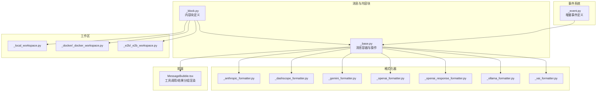
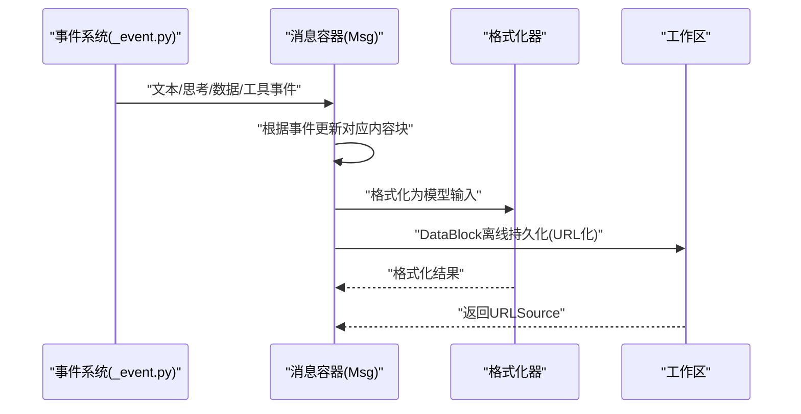
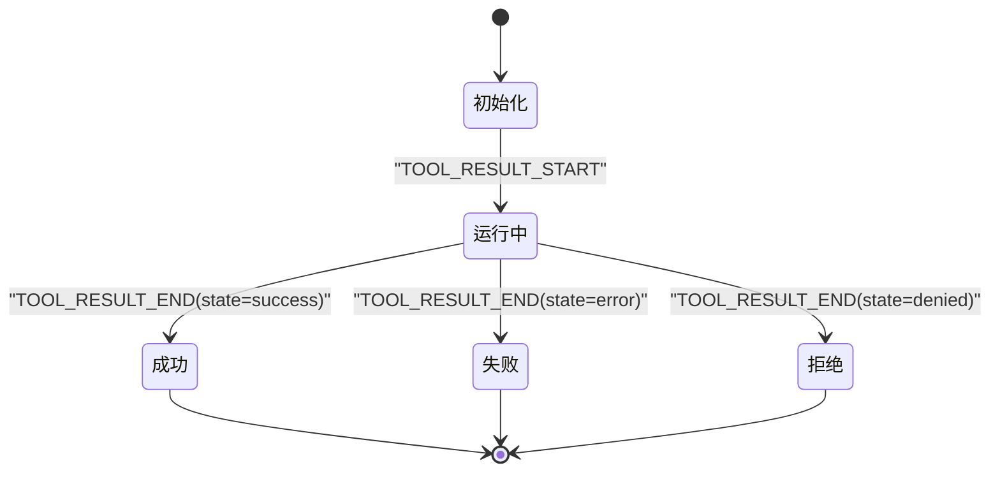
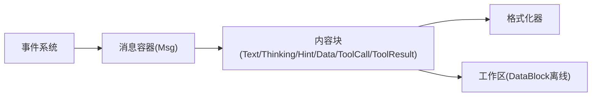

# 内容块系统

<cite>
**本文引用的文件**
- [message/_block.py](file://src/agentscope/message/_block.py)
- [message/_base.py](file://src/agentscope/message/_base.py)
- [event/_event.py](file://src/agentscope/event/_event.py)
- [workspace/_local_workspace.py](file://src/agentscope/workspace/_local_workspace.py)
- [workspace/_docker/_docker_workspace.py](file://src/agentscope/workspace/_docker/_docker_workspace.py)
- [workspace/_e2b/_e2b_workspace.py](file://src/agentscope/workspace/_e2b/_e2b_workspace.py)
- [formatter/_anthropic_formatter.py](file://src/agentscope/formatter/_anthropic_formatter.py)
- [formatter/_dashscope_formatter.py](file://src/agentscope/formatter/_dashscope_formatter.py)
- [formatter/_gemini_formatter.py](file://src/agentscope/formatter/_gemini_formatter.py)
- [formatter/_openai_formatter.py](file://src/agentscope/formatter/_openai_formatter.py)
- [formatter/_openai_response_formatter.py](file://src/agentscope/formatter/_openai_response_formatter.py)
- [formatter/_ollama_formatter.py](file://src/agentscope/formatter/_ollama_formatter.py)
- [formatter/_xai_formatter.py](file://src/agentscope/formatter/_xai_formatter.py)
- [tests/workspace_local_test.py](file://tests/workspace_local_test.py)
- [tests/workspace_docker_test.py](file://tests/workspace_docker_test.py)
- [tests/agui_protocol_test.py](file://tests/agui_protocol_test.py)
- [tests/formatter_deepseek_test.py](file://tests/formatter_deepseek_test.py)
- [tests/formatter_anthropic_test.py](file://tests/formatter_anthropic_test.py)
- [tests/formatter_dashscope_test.py](file://tests/formatter_dashscope_test.py)
- [tests/formatter_openai_chat_test.py](file://tests/formatter_openai_chat_test.py)
- [tests/formatter_xai_test.py](file://tests/formatter_xai_test.py)
- [tests/formatter_gemini_test.py](file://tests/formatter_gemini_test.py)
- [tests/formatter_ollama_test.py](file://tests/formatter_ollama_test.py)
- [tests/formatter_openai_response_test.py](file://tests/formatter_openai_response_test.py)
- [examples/web_ui/frontend/src/components/chat/MessageBubble.tsx](file://examples/web_ui/frontend/src/components/chat/MessageBubble.tsx)
</cite>

## 目录
1. [简介](#简介)
2. [项目结构](#项目结构)
3. [核心组件](#核心组件)
4. [架构总览](#架构总览)
5. [详细组件分析](#详细组件分析)
6. [依赖关系分析](#依赖关系分析)
7. [性能考虑](#性能考虑)
8. [故障排查指南](#故障排查指南)
9. [结论](#结论)
10. [附录](#附录)

## 简介
本文件系统性介绍 AgentScope 的内容块系统，围绕 ContentBlock 基类及其子类（TextBlock、ThinkingBlock、HintBlock、DataBlock、ToolCallBlock、ToolResultBlock）进行设计与实现解析。重点涵盖：
- 数据结构与属性定义
- 类型系统与类型检查机制
- 创建、访问与操作方法
- 在消息中的组合方式
- 状态管理与生命周期
- 与事件系统、格式化器、工作区离线存储的集成

## 项目结构
内容块系统主要位于消息模块与事件模块，并通过格式化器与工作区模块进行跨层协作：
- 消息与内容块：message/_block.py 定义内容块类型；message/_base.py 提供消息容器与内容块操作接口
- 事件系统：event/_event.py 定义文本、思考、数据、工具调用/结果等增量事件
- 格式化器：各模型适配器将内容块转换为具体 API 输入格式
- 工作区：对 DataBlock 进行离线持久化与 URL 化处理
- 前端渲染：Web UI 将内容块与工具调用/结果进行分组与展示

图表来源
- [message/_block.py:11-196](file://src/agentscope/message/_block.py#L11-L196)
- [message/_base.py:176-402](file://src/agentscope/message/_base.py#L176-L402)
- [event/_event.py:23-33](file://src/agentscope/event/_event.py#L23-L33)
- [workspace/_local_workspace.py:437-476](file://src/agentscope/workspace/_local_workspace.py#L437-L476)
- [examples/web_ui/frontend/src/components/chat/MessageBubble.tsx:32-87](file://examples/web_ui/frontend/src/components/chat/MessageBubble.tsx#L32-L87)

章节来源
- [message/_block.py:11-196](file://src/agentscope/message/_block.py#L11-L196)
- [message/_base.py:176-402](file://src/agentscope/message/_base.py#L176-L402)

## 核心组件
- ContentBlock 类型别名：聚合六种内容块类型，作为消息内容的统一集合
- ContentBlockTypes 字符串字面量联合：限定内容块类型枚举值
- 六大内容块类型：
  - TextBlock：纯文本内容块
  - ThinkingBlock：推理/思考内容块，支持额外字段
  - HintBlock：提示/指令内容块，用于在推理-行动循环中插入用户提示
  - DataBlock：二进制数据内容块，支持 Base64Source 与 URLSource
  - ToolCallBlock：工具调用请求内容块
  - ToolResultBlock：工具执行结果内容块，包含状态字段

章节来源
- [message/_block.py:180-196](file://src/agentscope/message/_block.py#L180-L196)

## 架构总览
内容块系统围绕“消息容器 + 内容块类型 + 事件驱动 + 格式化器 + 工作区”的架构运行：
- 消息容器 Msg 维护 content 列表，提供按类型筛选、拼接文本等操作
- 事件系统提供增量事件（如文本增量、思考增量、数据增量、工具调用/结果状态），消息容器根据事件动态更新内容块
- 格式化器将内容块映射到不同模型 API 的输入结构
- 工作区负责 DataBlock 的离线持久化与 URL 化，避免将大体量 Base64 数据直接写入日志文件

图表来源
- [event/_event.py:23-33](file://src/agentscope/event/_event.py#L23-L33)
- [message/_base.py:271-402](file://src/agentscope/message/_base.py#L271-L402)
- [workspace/_local_workspace.py:437-476](file://src/agentscope/workspace/_local_workspace.py#L437-L476)

## 详细组件分析

### ContentBlock 基类与类型系统
- ContentBlock 类型别名：将 TextBlock、ThinkingBlock、HintBlock、ToolCallBlock、ToolResultBlock、DataBlock 聚合为统一类型
- ContentBlockTypes：限定类型字符串字面量集合，确保类型检查严格
- 类型检查机制：消息容器的 get_content_blocks 支持按单个类型或类型列表过滤，内部以 block.type 进行匹配

章节来源
- [message/_block.py:180-196](file://src/agentscope/message/_block.py#L180-L196)
- [message/_base.py:176-197](file://src/agentscope/message/_base.py#L176-L197)

### TextBlock（文本块）
- 数据结构与属性
  - type: 固定为 "text"
  - text: 文本内容
  - id: 唯一标识符（默认自动生成）
- 使用场景
  - 承载对话文本、回答、提示等纯文本内容
  - 可通过消息容器的 get_text_content 方法拼接所有 TextBlock 的文本
- 事件驱动
  - TextBlockStartEvent、TextBlockDeltaEvent、TextBlockEndEvent 驱动增量渲染与协议转换

章节来源
- [message/_block.py:11-19](file://src/agentscope/message/_block.py#L11-L19)
- [message/_base.py:122-125](file://src/agentscope/message/_base.py#L122-L125)
- [event/_event.py:125-135](file://src/agentscope/event/_event.py#L125-L135)
- [tests/agui_protocol_test.py:135-168](file://tests/agui_protocol_test.py#L135-L168)

### ThinkingBlock（思考块）
- 数据结构与属性
  - type: 固定为 "thinking"
  - thinking: 思考/推理内容
  - id: 唯一标识符
  - 额外字段：允许额外字段（如签名等），便于特定模型扩展
- 使用场景
  - 在多模型格式化器中映射到专用的 reasoning_content 字段
  - 支持多个 ThinkingBlock 连续出现并按换行拼接
- 事件驱动
  - ThinkingBlockStartEvent、ThinkingBlockDeltaEvent、ThinkingBlockEndEvent

章节来源
- [message/_block.py:22-37](file://src/agentscope/message/_block.py#L22-L37)
- [tests/formatter_deepseek_test.py:232-254](file://tests/formatter_deepseek_test.py#L232-L254)
- [tests/formatter_dashscope_test.py:538-566](file://tests/formatter_dashscope_test.py#L538-L566)
- [event/_event.py:188-224](file://src/agentscope/event/_event.py#L188-L224)
- [tests/agui_protocol_test.py:181-215](file://tests/agui_protocol_test.py#L181-L215)

### HintBlock（提示块）
- 数据结构与属性
  - type: 固定为 "hint"
  - hint: 提示内容
  - id: 唯一标识符
- 使用场景
  - 在推理-行动循环中插入用户提示，格式化器会将其转换为独立的用户消息，打断前序内容
- 事件驱动
  - 通常不产生增量事件，但在格式化阶段会被拆分为独立消息

章节来源
- [message/_block.py:40-51](file://src/agentscope/message/_block.py#L40-L51)
- [tests/formatter_deepseek_test.py:462-494](file://tests/formatter_deepseek_test.py#L462-L494)
- [tests/formatter_anthropic_test.py:750-786](file://tests/formatter_anthropic_test.py#L750-L786)
- [tests/formatter_dashscope_test.py:957-993](file://tests/formatter_dashscope_test.py#L957-L993)
- [tests/formatter_openai_chat_test.py:692-730](file://tests/formatter_openai_chat_test.py#L692-L730)
- [tests/formatter_xai_test.py:539-560](file://tests/formatter_xai_test.py#L539-L560)
- [tests/formatter_gemini_test.py:641-677](file://tests/formatter_gemini_test.py#L641-L677)
- [tests/formatter_ollama_test.py:512-542](file://tests/formatter_ollama_test.py#L512-L542)
- [tests/formatter_openai_response_test.py:692-737](file://tests/formatter_openai_response_test.py#L692-L737)

### DataBlock（数据块）
- 数据结构与属性
  - type: 固定为 "data"
  - id: 唯一标识符
  - source: Base64Source 或 URLSource
  - name: 可选名称
- 使用场景
  - 图片、音频、视频等二进制数据的承载
  - 在工作区中进行离线持久化，将 Base64Source 转换为 URLSource，避免日志过大
- 事件驱动
  - DataBlockStartEvent、DataBlockDeltaEvent、DataBlockEndEvent

章节来源
- [message/_block.py:81-92](file://src/agentscope/message/_block.py#L81-L92)
- [workspace/_local_workspace.py:437-476](file://src/agentscope/workspace/_local_workspace.py#L437-L476)
- [workspace/_docker/_docker_workspace.py:1197-1229](file://src/agentscope/workspace/_docker/_docker_workspace.py#L1197-L1229)
- [workspace/_e2b/_e2b_workspace.py:1009-1034](file://src/agentscope/workspace/_e2b/_e2b_workspace.py#L1009-L1034)
- [tests/workspace_local_test.py:181-257](file://tests/workspace_local_test.py#L181-L257)
- [tests/workspace_docker_test.py:240-299](file://tests/workspace_docker_test.py#L240-L299)
- [event/_event.py:149-185](file://src/agentscope/event/_event.py#L149-L185)

### ToolCallBlock（工具调用块）
- 数据结构与属性
  - type: 固定为 "tool_call"
  - id: 唯一标识符
  - name: 工具名称
  - input: 工具输入参数
  - state: 调用状态（例如 finished）
  - suggested_rules: 推荐规则（用于权限控制）
- 使用场景
  - 表达一次工具调用请求，可与 ToolResultBlock 通过 id 关联
- 事件驱动
  - TOOL_CALL_START、TOOL_CALL_DELTA、TOOL_CALL_END 等事件（在消息容器中处理）

章节来源
- [message/_block.py:105-149](file://src/agentscope/message/_block.py#L105-L149)
- [message/_base.py:309-360](file://src/agentscope/message/_base.py#L309-L360)

### ToolResultBlock（工具结果块）
- 数据结构与属性
  - type: 固定为 "tool_result"
  - id: 唯一标识符（与对应 ToolCallBlock 的 id 对应）
  - name: 工具名称
  - output: 结果内容列表（通常包含 TextBlock 等）
  - state: 执行状态（如 success、error、denied、running）
- 使用场景
  - 表达一次工具调用的执行结果，支持增量输出（如文本增量）
- 事件驱动
  - TOOL_RESULT_START、TOOL_RESULT_TEXT_DELTA、TOOL_RESULT_END 等事件
  - 消息容器根据事件更新 ToolResultBlock 的状态与内容

章节来源
- [message/_block.py:162-177](file://src/agentscope/message/_block.py#L162-L177)
- [message/_base.py:361-395](file://src/agentscope/message/_base.py#L361-L395)

### 内容块的创建、访问与操作
- 创建
  - 通过构造函数实例化各类内容块对象
  - 系统消息（SystemMsg）会自动将字符串内容包装为 TextBlock
- 访问与过滤
  - get_content_blocks 支持按类型或类型列表过滤
  - get_text_content 可拼接所有 TextBlock 的文本
- 组合
  - 将多种内容块放入消息的 content 列表，形成复合消息
- 示例路径
  - [消息容器与内容块过滤:176-197](file://src/agentscope/message/_base.py#L176-L197)
  - [系统消息创建与 TextBlock 包装:528-573](file://src/agentscope/message/_base.py#L528-L573)

章节来源
- [message/_base.py:176-197](file://src/agentscope/message/_base.py#L176-L197)
- [message/_base.py:528-573](file://src/agentscope/message/_base.py#L528-L573)

### 状态管理与生命周期
- 状态字段
  - ThinkingBlock：无显式状态字段
  - HintBlock：无显式状态字段
  - DataBlock：无显式状态字段
  - ToolCallBlock：state（如 finished、asking）
  - ToolResultBlock：state（如 success、error、denied、running）
- 生命周期
  - 事件驱动：通过事件系统逐步构建与更新内容块
  - 离线持久化：DataBlock 在工作区中被持久化为本地文件并替换为 URLSource
  - 渲染与分组：前端将 ToolCallBlock 与 ToolResultBlock 按 id 关联并分组展示

图表来源
- [message/_base.py:385-395](file://src/agentscope/message/_base.py#L385-L395)
- [message/_block.py:162-177](file://src/agentscope/message/_block.py#L162-L177)

## 依赖关系分析
- 消息容器与内容块类型
  - Msg 维护 content 列表，提供类型过滤与文本拼接
- 事件系统与消息容器
  - 通过事件驱动更新内容块（文本、思考、数据、工具调用/结果）
- 格式化器与内容块
  - 各模型格式化器将内容块映射到特定 API 输入结构（如 reasoning_content、parts 等）
- 工作区与 DataBlock
  - 将 Base64Source 的 DataBlock 持久化为本地文件并转换为 URLSource

图表来源
- [message/_base.py:271-402](file://src/agentscope/message/_base.py#L271-L402)
- [formatter/_dashscope_formatter.py:63-119](file://src/agentscope/formatter/_dashscope_formatter.py#L63-L119)
- [workspace/_local_workspace.py:437-476](file://src/agentscope/workspace/_local_workspace.py#L437-L476)

章节来源
- [message/_base.py:271-402](file://src/agentscope/message/_base.py#L271-L402)
- [formatter/_dashscope_formatter.py:63-119](file://src/agentscope/formatter/_dashscope_formatter.py#L63-L119)
- [workspace/_local_workspace.py:437-476](file://src/agentscope/workspace/_local_workspace.py#L437-L476)

## 性能考虑
- DataBlock 离线持久化
  - 将 Base64 数据写入独立文件，避免将大体量数据直接写入日志文件，降低 IO 压力与日志体积
- 事件驱动增量更新
  - 文本、思考、数据、工具结果均采用增量事件，减少一次性传输与解析开销
- 类型过滤与拼接
  - 通过类型过滤与文本拼接避免全量遍历，提升消息处理效率

## 故障排查指南
- DataBlock 未正确离线持久化
  - 检查工作区是否将 Base64Source 转换为 URLSource，并确认文件存在
  - 参考测试用例验证行为
- 工具结果状态异常
  - 确认 TOOL_RESULT_END 事件携带正确的 state 字段
  - 检查消息容器对 ToolResultBlock 的状态更新逻辑
- 前端工具调用/结果未正确分组
  - 确保 ToolCallBlock 与 ToolResultBlock 的 id 对应一致
  - 检查前端分组逻辑是否正确处理缺失匹配的情况

章节来源
- [tests/workspace_local_test.py:181-257](file://tests/workspace_local_test.py#L181-L257)
- [tests/workspace_docker_test.py:240-299](file://tests/workspace_docker_test.py#L240-L299)
- [message/_base.py:385-395](file://src/agentscope/message/_base.py#L385-L395)
- [examples/web_ui/frontend/src/components/chat/MessageBubble.tsx:32-87](file://examples/web_ui/frontend/src/components/chat/MessageBubble.tsx#L32-L87)

## 结论
内容块系统通过明确的类型定义、严格的类型检查、事件驱动的增量更新以及与格式化器和工作区的协同，实现了对多模态与工具调用场景的高效支持。开发者可通过统一的 Msg 接口组合多种内容块，并借助事件系统与工作区能力实现稳定、可扩展的消息处理流程。

## 附录
- 代码示例路径（不含具体代码内容）
  - 创建与组合内容块：[消息容器与内容块过滤:176-197](file://src/agentscope/message/_base.py#L176-L197)
  - 系统消息创建：[SystemMsg:528-573](file://src/agentscope/message/_base.py#L528-L573)
  - DataBlock 离线持久化：[LocalWorkspace:437-476](file://src/agentscope/workspace/_local_workspace.py#L437-L476)、[DockerWorkspace:1197-1229](file://src/agentscope/workspace/_docker/_docker_workspace.py#L1197-L1229)、[E2BWorkspace:1009-1034](file://src/agentscope/workspace/_e2b/_e2b_workspace.py#L1009-L1034)
  - 事件驱动更新：[消息容器事件处理:271-402](file://src/agentscope/message/_base.py#L271-L402)
  - 前端工具调用/结果分组：[MessageBubble.tsx:32-87](file://examples/web_ui/frontend/src/components/chat/MessageBubble.tsx#L32-L87)