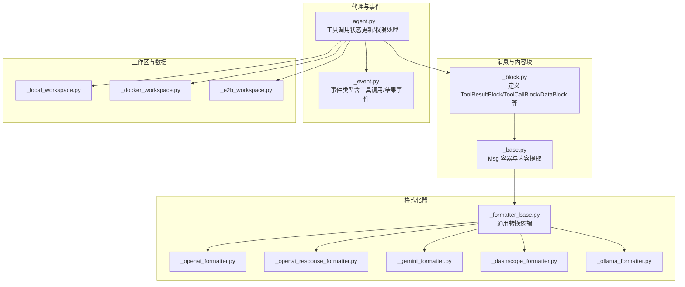
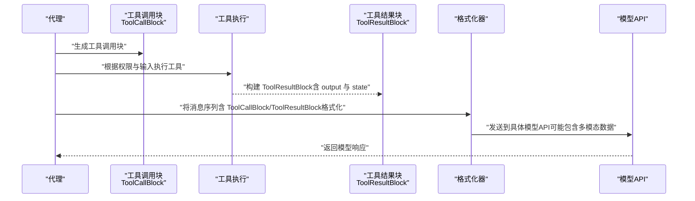
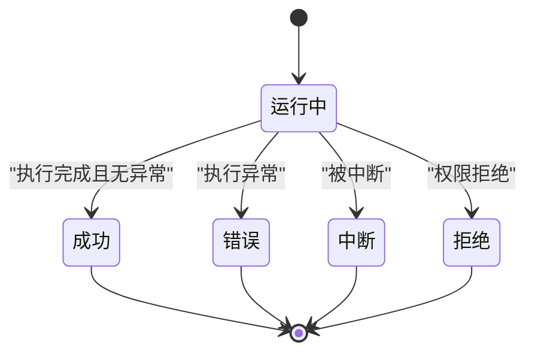
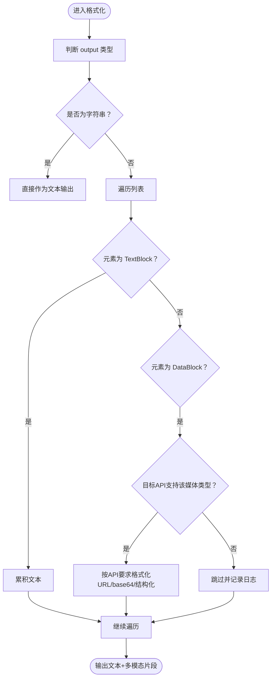
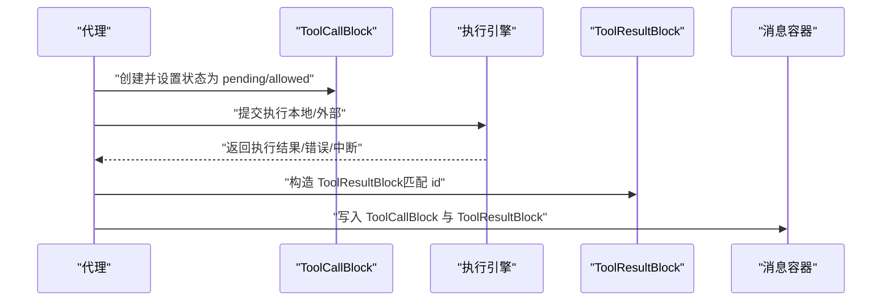
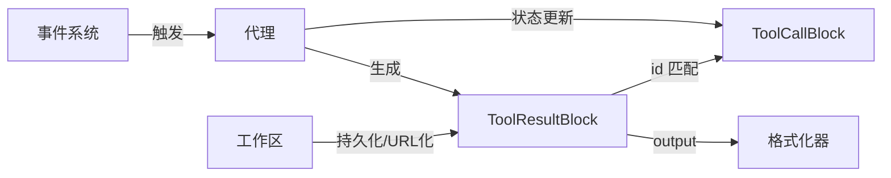

# 工具结果块（ToolResultBlock）

<cite>
**本文引用的文件**
- [message/_block.py](file://src/agentscope/message/_block.py)
- [message/_base.py](file://src/agentscope/message/_base.py)
- [formatter/_formatter_base.py](file://src/agentscope/formatter/_formatter_base.py)
- [formatter/_openai_formatter.py](file://src/agentscope/formatter/_openai_formatter.py)
- [formatter/_openai_response_formatter.py](file://src/agentscope/formatter/_openai_response_formatter.py)
- [formatter/_gemini_formatter.py](file://src/agentscope/formatter/_gemini_formatter.py)
- [formatter/_dashscope_formatter.py](file://src/agentscope/formatter/_dashscope_formatter.py)
- [formatter/_ollama_formatter.py](file://src/agentscope/formatter/_ollama_formatter.py)
- [agent/_agent.py](file://src/agentscope/agent/_agent.py)
- [event/_event.py](file://src/agentscope/event/_event.py)
- [workspace/_local_workspace.py](file://src/agentscope/workspace/_local_workspace.py)
- [workspace/_docker/_docker_workspace.py](file://src/agentscope/workspace/_docker/_docker_workspace.py)
- [workspace/_e2b/_e2b_workspace.py](file://src/agentscope/workspace/_e2b/_e2b_workspace.py)
- [tool/_response.py](file://src/agentscope/tool/_response.py)
- [tests/agent_basic_test.py](file://tests/agent_basic_test.py)
- [tests/hitl_mixed_interrupt.py](file://tests/hitl_mixed_interrupt.py)
- [tests/hitl_external_execution_test.py](file://tests/hitl_external_execution_test.py)
- [tests/workspace_local_test.py](file://tests/workspace_local_test.py)
- [tests/workspace_docker_test.py](file://tests/workspace_docker_test.py)
- [examples/web_ui/frontend/src/components/chat/tool-renderers/_shared.tsx](file://examples/web_ui/frontend/src/components/chat/tool-renderers/_shared.tsx)
</cite>

## 目录
1. [简介](#简介)
2. [项目结构](#项目结构)
3. [核心组件](#核心组件)
4. [架构总览](#架构总览)
5. [详细组件分析](#详细组件分析)
6. [依赖分析](#依赖分析)
7. [性能考虑](#性能考虑)
8. [故障排查指南](#故障排查指南)
9. [结论](#结论)
10. [附录](#附录)

## 简介
本文件围绕 AgentScope 的“工具结果块”（ToolResultBlock）进行系统化说明，目标包括：
- 解释 ToolResultBlock 的设计目的：统一承载工具执行结果，支持文本与多模态数据混合输出，并以明确的状态机表达执行阶段与结果性质。
- 深入解析状态系统：ToolResultState 枚举覆盖 success、error、interrupted、denied、running 五种状态。
- 详解 output 字段的灵活性：既可为原始字符串，也可为 TextBlock 与 DataBlock 的列表组合；并说明多模态数据在不同模型适配器中的呈现方式。
- 提供典型处理示例：成功响应、错误处理、中断与拒绝等场景。
- 说明工具结果块与工具调用块（ToolCallBlock）的对应关系与消息传递流程。
- 讨论在多模态输出中的应用与数据格式选择。

## 项目结构
与 ToolResultBlock 相关的核心模块分布如下：
- 消息与内容块定义：message/_block.py
- 消息容器与内容提取：message/_base.py
- 格式化器（面向不同模型 API）：formatter/_*.py
- 工具响应聚合：tool/_response.py
- 代理执行与状态更新：agent/_agent.py
- 事件系统：event/_event.py
- 工作区与数据落盘：workspace/_local_workspace.py、workspace/_docker/_docker_workspace.py、workspace/_e2b/_e2b_workspace.py
- 测试与前端渲染：tests/*、examples/web_ui/frontend/src/components/chat/tool-renderers/_shared.tsx

图表来源
- [message/_block.py:11-196](file://src/agentscope/message/_block.py#L11-L196)
- [message/_base.py:176-197](file://src/agentscope/message/_base.py#L176-L197)
- [formatter/_formatter_base.py:76-112](file://src/agentscope/formatter/_formatter_base.py#L76-L112)
- [formatter/_openai_formatter.py:284-316](file://src/agentscope/formatter/_openai_formatter.py#L284-L316)
- [formatter/_openai_response_formatter.py:258-288](file://src/agentscope/formatter/_openai_response_formatter.py#L258-L288)
- [formatter/_gemini_formatter.py:192-224](file://src/agentscope/formatter/_gemini_formatter.py#L192-L224)
- [formatter/_dashscope_formatter.py:63-119](file://src/agentscope/formatter/_dashscope_formatter.py#L63-L119)
- [formatter/_ollama_formatter.py:31-68](file://src/agentscope/formatter/_ollama_formatter.py#L31-L68)
- [agent/_agent.py:2127-2150](file://src/agentscope/agent/_agent.py#L2127-L2150)
- [event/_event.py:95-185](file://src/agentscope/event/_event.py#L95-L185)
- [workspace/_local_workspace.py:437-476](file://src/agentscope/workspace/_local_workspace.py#L437-L476)
- [workspace/_docker/_docker_workspace.py:1197-1229](file://src/agentscope/workspace/_docker/_docker_workspace.py#L1197-L1229)
- [workspace/_e2b/_e2b_workspace.py:1009-1034](file://src/agentscope/workspace/_e2b/_e2b_workspace.py#L1009-L1034)

章节来源
- [message/_block.py:11-196](file://src/agentscope/message/_block.py#L11-L196)
- [message/_base.py:176-197](file://src/agentscope/message/_base.py#L176-L197)

## 核心组件
- ToolResultBlock：封装一次工具调用的最终结果，包含类型标识、唯一 ID、工具名、输出内容与执行状态。
- ToolResultState：结果状态枚举，覆盖 success、error、interrupted、denied、running。
- 输出类型：output 可为原始字符串或 TextBlock/DataBlock 列表，后者支持多模态数据。
- 内容块别名：ContentBlock 统一了多种内容块类型，便于消息容器管理。

章节来源
- [message/_block.py:152-177](file://src/agentscope/message/_block.py#L152-L177)
- [message/_block.py:180-187](file://src/agentscope/message/_block.py#L180-L187)

## 架构总览
ToolResultBlock 在系统中的位置与交互如下：

图表来源
- [message/_block.py:105-177](file://src/agentscope/message/_block.py#L105-L177)
- [formatter/_formatter_base.py:76-112](file://src/agentscope/formatter/_formatter_base.py#L76-L112)
- [formatter/_openai_formatter.py:284-316](file://src/agentscope/formatter/_openai_formatter.py#L284-L316)
- [formatter/_gemini_formatter.py:192-224](file://src/agentscope/formatter/_gemini_formatter.py#L192-L224)
- [formatter/_dashscope_formatter.py:63-119](file://src/agentscope/formatter/_dashscope_formatter.py#L63-L119)
- [formatter/_ollama_formatter.py:31-68](file://src/agentscope/formatter/_ollama_formatter.py#L31-L68)

## 详细组件分析

### 状态系统（ToolResultState）
ToolResultState 枚举定义了工具结果的五种状态：
- success：工具执行成功，输出有效。
- error：工具执行过程中发生错误。
- interrupted：工具执行被中断。
- denied：工具未被允许执行（权限拒绝）。
- running：工具仍在执行中（初始默认状态）。

状态之间的流转通常由代理层根据权限决策与外部执行事件驱动。例如：
- 权限拒绝时，代理会生成 ToolResultBlock 并将 state 设为 denied。
- 外部执行完成后，代理接收结果事件并生成 ToolResultBlock，state 为 success 或 error。
- 若执行被取消或超时，state 为 interrupted。

图表来源
- [message/_block.py:152-159](file://src/agentscope/message/_block.py#L152-L159)
- [agent/_agent.py:1384-1394](file://src/agentscope/agent/_agent.py#L1384-L1394)

章节来源
- [message/_block.py:152-159](file://src/agentscope/message/_block.py#L152-L159)
- [agent/_agent.py:1384-1394](file://src/agentscope/agent/_agent.py#L1384-L1394)

### 输出字段（output）的灵活性
- 原始字符串：最简形式，适用于纯文本结果。
- 文本与多模态组合：output 为 TextBlock 与 DataBlock 的列表，支持混合文本与图像、音频、视频等数据。
- 多模态数据在不同格式化器中的处理：
  - 文本优先：当 output 为字符串时，直接作为文本输出。
  - 列表形式：遍历列表，将 TextBlock 聚合为文本，DataBlock 根据媒体类型与目标 API 支持度进行格式化（如 base64、URL、特定结构等）。
  - 部分 API 仅支持图片等特定类型，格式化器会进行过滤与警告。

图表来源
- [formatter/_formatter_base.py:76-112](file://src/agentscope/formatter/_formatter_base.py#L76-L112)
- [formatter/_openai_formatter.py:31-84](file://src/agentscope/formatter/_openai_formatter.py#L31-L84)
- [formatter/_openai_formatter.py:284-316](file://src/agentscope/formatter/_openai_formatter.py#L284-L316)
- [formatter/_openai_response_formatter.py:38-88](file://src/agentscope/formatter/_openai_response_formatter.py#L38-L88)
- [formatter/_gemini_formatter.py:31-60](file://src/agentscope/formatter/_gemini_formatter.py#L31-L60)
- [formatter/_gemini_formatter.py:192-224](file://src/agentscope/formatter/_gemini_formatter.py#L192-L224)
- [formatter/_dashscope_formatter.py:63-119](file://src/agentscope/formatter/_dashscope_formatter.py#L63-L119)
- [formatter/_ollama_formatter.py:31-68](file://src/agentscope/formatter/_ollama_formatter.py#L31-L68)

章节来源
- [message/_block.py:173-175](file://src/agentscope/message/_block.py#L173-L175)
- [formatter/_formatter_base.py:76-112](file://src/agentscope/formatter/_formatter_base.py#L76-L112)

### 工具调用与结果的对应关系及消息传递流程
- 对应关系：ToolResultBlock 的 id 与对应的 ToolCallBlock 的 id 必须一致，以便在消息序列中建立“调用-结果”的配对。
- 流程要点：
  - 代理生成 ToolCallBlock 并维护其状态（pending/asking/allowed/submitted/finished）。
  - 当权限允许或用户确认后，代理触发工具执行；若为本地工具则直接执行，否则提交至外部执行环境。
  - 外部执行完成后，代理接收结果事件并生成 ToolResultBlock，设置 state 与 output。
  - 代理将 ToolResultBlock 与原 ToolCallBlock 一起放入消息容器，供后续格式化与模型消费。

图表来源
- [message/_block.py:105-177](file://src/agentscope/message/_block.py#L105-L177)
- [agent/_agent.py:2127-2150](file://src/agentscope/agent/_agent.py#L2127-L2150)
- [event/_event.py:227-237](file://src/agentscope/event/_event.py#L227-L237)

章节来源
- [message/_block.py:105-177](file://src/agentscope/message/_block.py#L105-L177)
- [agent/_agent.py:2127-2150](file://src/agentscope/agent/_agent.py#L2127-L2150)
- [event/_event.py:227-237](file://src/agentscope/event/_event.py#L227-L237)

### 多模态输出中的应用与数据格式选择
- 数据落盘与 URL 化：当 DataBlock 为 Base64Source 时，工作区会在持久化时将其转为 URLSource，避免将大块二进制数据直接写入上下文文件。
- 不同模型 API 的格式差异：
  - OpenAI：支持 image_url、input_audio 等，格式化器会将 DataBlock 转换为相应结构或 base64。
  - Gemini：通过 function_response 包裹输出，同时支持多模态片段。
  - DashScope：支持 image_url、video_url、input_audio 等，按主类型映射。
  - Ollama：主要支持 image，格式化器会检查媒体类型并进行 base64 编码。
- 前端渲染：工具状态图标会综合多个 ToolResultBlock 的 state，决定显示运行中、成功、错误或中断的视觉状态。

章节来源
- [workspace/_local_workspace.py:437-476](file://src/agentscope/workspace/_local_workspace.py#L437-L476)
- [workspace/_docker/_docker_workspace.py:1197-1229](file://src/agentscope/workspace/_docker/_docker_workspace.py#L1197-L1229)
- [workspace/_e2b/_e2b_workspace.py:1009-1034](file://src/agentscope/workspace/_e2b/_e2b_workspace.py#L1009-L1034)
- [formatter/_openai_formatter.py:31-84](file://src/agentscope/formatter/_openai_formatter.py#L31-L84)
- [formatter/_openai_formatter.py:284-316](file://src/agentscope/formatter/_openai_formatter.py#L284-L316)
- [formatter/_openai_response_formatter.py:38-88](file://src/agentscope/formatter/_openai_response_formatter.py#L38-L88)
- [formatter/_gemini_formatter.py:31-60](file://src/agentscope/formatter/_gemini_formatter.py#L31-L60)
- [formatter/_gemini_formatter.py:192-224](file://src/agentscope/formatter/_gemini_formatter.py#L192-L224)
- [formatter/_dashscope_formatter.py:63-119](file://src/agentscope/formatter/_dashscope_formatter.py#L63-L119)
- [formatter/_ollama_formatter.py:31-68](file://src/agentscope/formatter/_ollama_formatter.py#L31-L68)
- [examples/web_ui/frontend/src/components/chat/tool-renderers/_shared.tsx:44-82](file://examples/web_ui/frontend/src/components/chat/tool-renderers/_shared.tsx#L44-L82)

### 处理示例与用法指引
- 成功响应：ToolResultState 为 success，output 为 TextBlock 列表，表示工具执行成功并返回文本结果。
- 错误处理：ToolResultState 为 error，output 可为错误信息文本或空列表，配合元数据字段记录错误详情。
- 中断情况：ToolResultState 为 interrupted，表示执行被中断（如取消、超时），output 可为空或简要说明。
- 拒绝处理：ToolResultState 为 denied，通常由权限系统触发，output 可包含拒绝原因或建议。
- 多模态结果：output 为 TextBlock 与 DataBlock 的混合列表，前端可同时展示文本与图片/音频等。

章节来源
- [tests/agent_basic_test.py:984-1018](file://tests/agent_basic_test.py#L984-L1018)
- [tests/hitl_mixed_interrupt.py:291-304](file://tests/hitl_mixed_interrupt.py#L291-L304)
- [tests/hitl_external_execution_test.py:1023-1056](file://tests/hitl_external_execution_test.py#L1023-L1056)

## 依赖分析
- 组件耦合与内聚：
  - ToolResultBlock 与 ToolCallBlock 通过 id 关联，形成强内聚的消息单元。
  - 格式化器依赖 ToolResultBlock 的 output 结构，针对不同模型 API 进行差异化处理。
  - 代理层负责状态更新与事件驱动，确保 ToolResultBlock 的 state 与实际执行一致。
- 外部依赖与集成点：
  - 工作区模块负责 DataBlock 的持久化与 URL 化，影响多模态数据的最终传输格式。
  - 事件系统提供工具调用与结果的生命周期事件，支撑状态机演进。

图表来源
- [message/_block.py:105-177](file://src/agentscope/message/_block.py#L105-L177)
- [agent/_agent.py:2127-2150](file://src/agentscope/agent/_agent.py#L2127-L2150)
- [workspace/_local_workspace.py:437-476](file://src/agentscope/workspace/_local_workspace.py#L437-L476)
- [event/_event.py:227-237](file://src/agentscope/event/_event.py#L227-L237)

章节来源
- [message/_block.py:105-177](file://src/agentscope/message/_block.py#L105-L177)
- [agent/_agent.py:2127-2150](file://src/agentscope/agent/_agent.py#L2127-L2150)
- [workspace/_local_workspace.py:437-476](file://src/agentscope/workspace/_local_workspace.py#L437-L476)
- [event/_event.py:227-237](file://src/agentscope/event/_event.py#L227-L237)

## 性能考虑
- 输出聚合：当 output 为列表时，格式化器会对相邻 TextBlock 进行合并，减少冗余片段数量，提升下游处理效率。
- 多模态数据优化：Base64 数据通过工作区持久化为 URL，避免将大块二进制数据写入上下文文件，降低存储与传输开销。
- 状态机驱动：通过事件与状态更新，避免重复执行与无效轮询，提高整体吞吐。

## 故障排查指南
- 状态不一致：若 ToolCallBlock 与 ToolResultBlock 的 id 不匹配，会导致消息序列无法正确关联。请核对生成与传递过程中的 id 设置。
- 多模态数据缺失：若 DataBlock 未被持久化或媒体类型不受目标 API 支持，格式化器会跳过该块并记录日志。请检查工作区配置与 API 支持范围。
- 权限拒绝导致的结果：当 state 为 denied 时，output 应包含拒绝原因或建议规则，便于前端提示与用户确认。
- 外部执行未返回：若 ToolCallBlock 长时间处于 submitted 状态，需检查外部执行环境与事件回调是否正常。

章节来源
- [agent/_agent.py:2127-2150](file://src/agentscope/agent/_agent.py#L2127-L2150)
- [formatter/_formatter_base.py:76-112](file://src/agentscope/formatter/_formatter_base.py#L76-L112)
- [workspace/_local_workspace.py:437-476](file://src/agentscope/workspace/_local_workspace.py#L437-L476)

## 结论
ToolResultBlock 通过统一的结构与明确的状态机，实现了工具执行结果的标准化表达；其灵活的 output 设计兼顾了纯文本与多模态场景。结合代理层的状态更新、事件驱动与工作区的数据持久化能力，系统能够在不同模型 API 间稳定地传递与呈现工具结果，满足从基础文本到复杂多模态输出的多样化需求。

## 附录
- 相关测试与示例：
  - 成功并发工具调用与结果聚合示例。
  - 中断与拒绝场景下的 ToolResultBlock 构造与状态设置。
  - 多模态数据在本地与容器工作区的持久化行为验证。
- 前端渲染参考：工具状态图标根据 ToolResultBlock 的 state 列表进行聚合显示，帮助用户直观感知工具执行的整体状态。

章节来源
- [tests/agent_basic_test.py:984-1018](file://tests/agent_basic_test.py#L984-L1018)
- [tests/hitl_mixed_interrupt.py:291-304](file://tests/hitl_mixed_interrupt.py#L291-L304)
- [tests/workspace_local_test.py:181-257](file://tests/workspace_local_test.py#L181-L257)
- [tests/workspace_docker_test.py:240-299](file://tests/workspace_docker_test.py#L240-L299)
- [examples/web_ui/frontend/src/components/chat/tool-renderers/_shared.tsx:44-82](file://examples/web_ui/frontend/src/components/chat/tool-renderers/_shared.tsx#L44-L82)