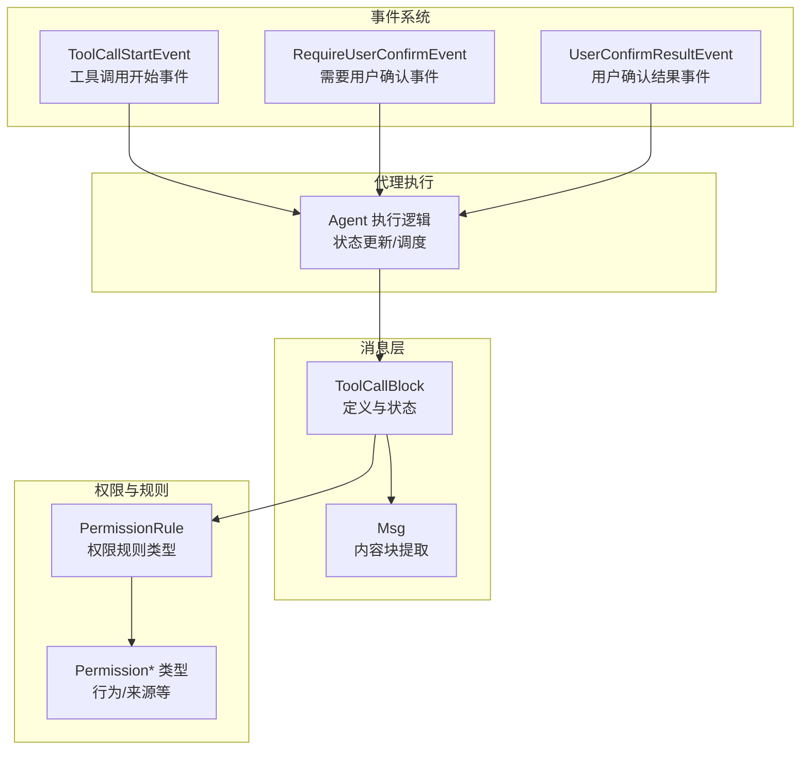
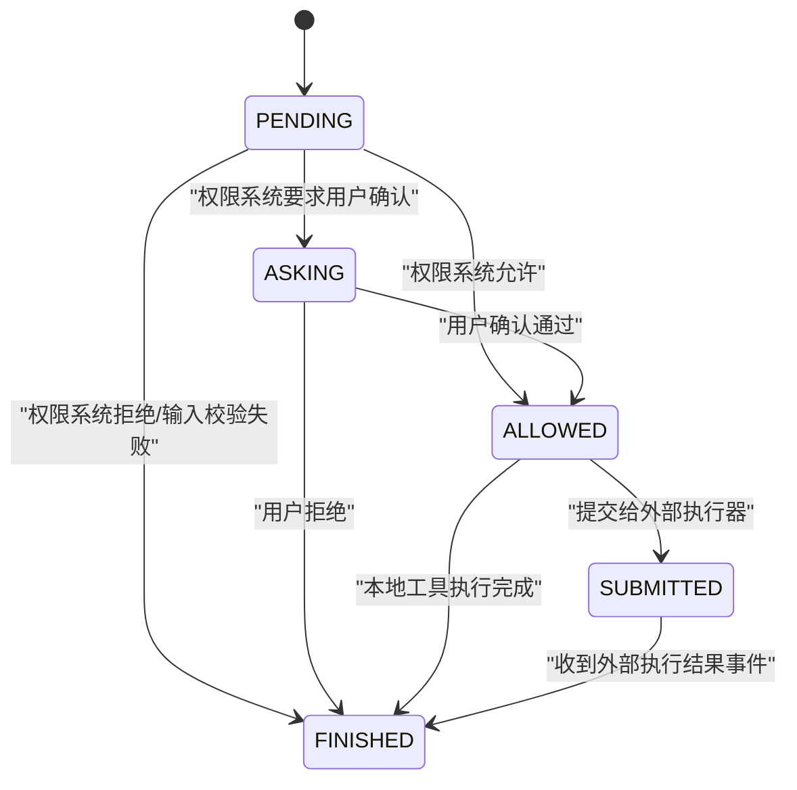
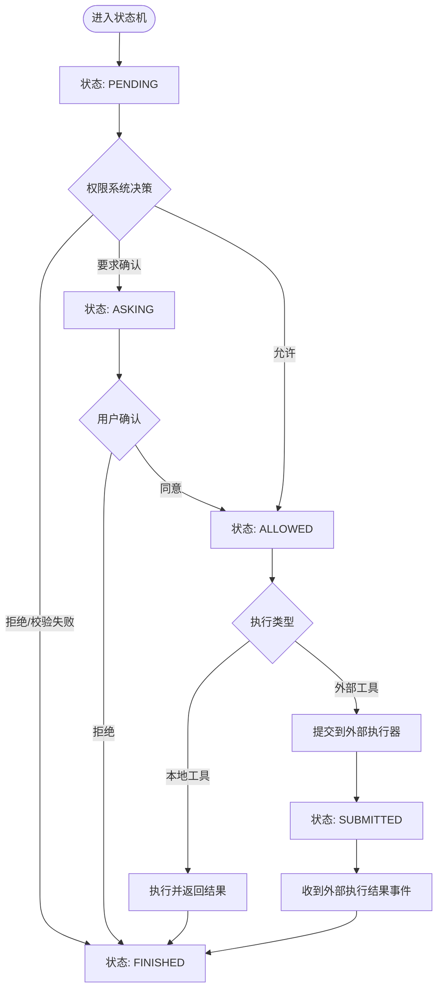
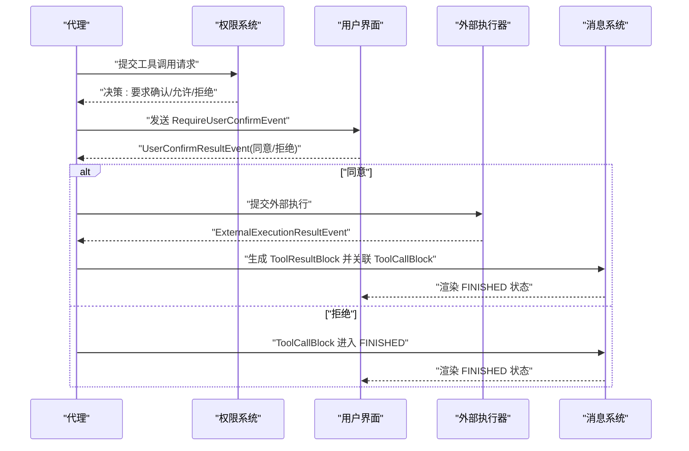
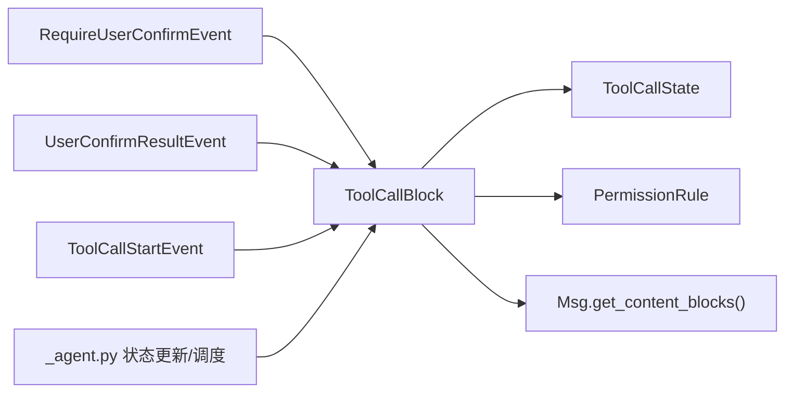

# 工具调用块（ToolCallBlock）

<cite>
**本文引用的文件**
- [message/_block.py](file://src/agentscope/message/_block.py)
- [message/_base.py](file://src/agentscope/message/_base.py)
- [agent/_agent.py](file://src/agentscope/agent/_agent.py)
- [event/_event.py](file://src/agentscope/event/_event.py)
- [permission/_types.py](file://src/agentscope/permission/_types.py)
- [tests/event_to_message_test.py](file://tests/event_to_message_test.py)
- [tests/formatter_openai_chat_test.py](file://tests/formatter_openai_chat_test.py)
- [tests/hitl_user_confirmation_test.py](file://tests/hitl_user_confirmation_test.py)
</cite>

## 目录
1. [简介](#简介)
2. [项目结构](#项目结构)
3. [核心组件](#核心组件)
4. [架构总览](#架构总览)
5. [详细组件分析](#详细组件分析)
6. [依赖关系分析](#依赖关系分析)
7. [性能考量](#性能考量)
8. [故障排查指南](#故障排查指南)
9. [结论](#结论)
10. [附录](#附录)

## 简介
本文件围绕 AgentScope 的“工具调用块”（ToolCallBlock）进行系统化说明，重点阐述其设计理念、复杂的状态机模型（ToolCallState 枚举）、状态转换规则、与 ToolResultBlock 的配对使用方式、错误处理策略，以及 suggested_rules 字段在跨请求中维持建议规则的机制。同时给出工具调用的完整生命周期示例，覆盖权限检查、用户确认、外部执行与结果回传等关键环节。

## 项目结构
ToolCallBlock 属于消息内容块体系的一部分，位于消息模块中，并与权限系统、事件系统、代理执行流程紧密协作。下图展示与 ToolCallBlock 相关的关键文件与交互关系：

图表来源
- [message/_block.py:95-149](file://src/agentscope/message/_block.py#L95-L149)
- [message/_base.py:176-197](file://src/agentscope/message/_base.py#L176-L197)
- [permission/_types.py](file://src/agentscope/permission/_types.py)
- [event/_event.py:227-237](file://src/agentscope/event/_event.py#L227-L237)
- [agent/_agent.py:2127-2150](file://src/agentscope/agent/_agent.py#L2127-L2150)

章节来源
- [message/_block.py:95-149](file://src/agentscope/message/_block.py#L95-L149)
- [message/_base.py:176-197](file://src/agentscope/message/_base.py#L176-L197)

## 核心组件
- ToolCallBlock：表示一次智能体计划执行的工具调用，包含唯一标识、工具名称、原始输入（JSON 字符串，支持流式累积）、当前状态（ToolCallState），以及 suggested_rules（跨请求维持的建议规则列表）。
- ToolCallState：工具调用状态枚举，包含 PENDING、ASKING、ALLOWED、SUBMITTED、FINISHED 五种状态，定义了清晰的转换规则。
- 权限规则（PermissionRule）：用于描述允许/拒绝/询问等行为及来源，驱动从 PENDING 到 ASKING/ALLOWED/FINISHED 的决策。
- 事件系统：通过 ToolCallStartEvent、RequireUserConfirmEvent、UserConfirmResultEvent 等事件驱动状态流转与 UI/用户交互。
- 代理执行：Agent 在运行时根据状态选择执行本地工具或等待外部执行结果，并负责更新 ToolCallBlock 的状态。

章节来源
- [message/_block.py:95-149](file://src/agentscope/message/_block.py#L95-L149)
- [permission/_types.py](file://src/agentscope/permission/_types.py)
- [event/_event.py:227-237](file://src/agentscope/event/_event.py#L227-L237)
- [agent/_agent.py:2127-2150](file://src/agentscope/agent/_agent.py#L2127-L2150)

## 架构总览
ToolCallBlock 的状态机是整个工具调用生命周期的核心。下图展示了从 PENDING 开始，经由权限系统与用户交互，最终进入 FINISHED 的完整路径。

图表来源
- [message/_block.py:122-146](file://src/agentscope/message/_block.py#L122-L146)

## 详细组件分析

### ToolCallBlock 数据模型与字段语义
- 类型与标识
  - type 固定为 "tool_call"，id 唯一标识该次调用。
- 名称与输入
  - name 表示要调用的工具名称；input 为原始 JSON 字符串，支持在流式生成过程中逐步累积。
- 状态字段
  - state 使用 ToolCallState 枚举，默认为 PENDING。
- 建议规则
  - suggested_rules 为 PermissionRule 列表，用于在“需要用户确认”的场景中向用户提供可复用的建议规则，并在跨请求中保持该建议，以提升交互效率与一致性。

章节来源
- [message/_block.py:105-149](file://src/agentscope/message/_block.py#L105-L149)

### ToolCallState 状态机详解
- PENDING（待处理）
  - 含义：工具调用尚未被权限系统处理。
  - 触发条件：
    - 权限系统评估后决定“拒绝”或“输入校验失败” → 转为 FINISHED。
    - 权限系统要求“用户确认” → 转为 ASKING。
    - 权限系统“允许” → 转为 ALLOWED。
- ASKING（待确认）
  - 含义：等待用户确认是否允许执行。
  - 触发条件：
    - 用户拒绝 → 转为 FINISHED。
    - 用户同意 → 转为 ALLOWED。
- ALLOWED（已允许）
  - 含义：已获得权限系统或用户许可，等待执行。
  - 触发条件：
    - 本地工具执行 → 完成后转为 FINISHED。
    - 外部工具执行 → 转为 SUBMITTED。
- SUBMITTED（已提交）
  - 含义：已提交至外部执行器，等待结果事件。
  - 触发条件：收到外部执行结果事件 → 转为 FINISHED。
- FINISHED（已完成）
  - 含义：工具调用结束，通常伴随 ToolResultBlock 的出现。

章节来源
- [message/_block.py:95-146](file://src/agentscope/message/_block.py#L95-L146)

### 状态转换图（面向代码的精确映射）

图表来源
- [message/_block.py:122-146](file://src/agentscope/message/_block.py#L122-L146)

### 与 ToolResultBlock 的配对使用与错误处理
- 配对关系
  - 每个 ToolCallBlock 必须与一个 ToolResultBlock 对应，二者通过 id/name 关联。
  - ToolResultBlock 的 state 通常为 RUNNING → SUCCESS/ERROR，作为 ToolCallBlock 进入 FINISHED 的信号之一。
- 错误处理
  - 当 ToolCallBlock 处于 PENDING 且权限系统拒绝或输入校验失败时，直接进入 FINISHED。
  - 当 ToolCallBlock 处于 ASKING 且用户拒绝时，进入 FINISHED。
  - 当 ToolResultBlock 的 state 为 ERROR 或外部执行结果异常时，ToolCallBlock 也应进入 FINISHED，并在 UI 中体现错误信息。

章节来源
- [tests/formatter_openai_chat_test.py:563-595](file://tests/formatter_openai_chat_test.py#L563-L595)
- [tests/formatter_dashscope_test.py:831-863](file://tests/formatter_dashscope_test.py#L831-L863)
- [tests/formatter_anthropic_test.py:595-627](file://tests/formatter_anthropic_test.py#L595-L627)
- [tests/formatter_ollama_test.py:405-438](file://tests/formatter_ollama_test.py#L405-L438)
- [tests/formatter_deepseek_test.py:326-359](file://tests/formatter_deepseek_test.py#L326-L359)

### suggested_rules 字段与跨请求保持建议机制
- 作用
  - 在“需要用户确认”的场景中，suggested_rules 提供预设的权限规则，帮助用户快速做出确认决策。
- 跨请求保持
  - 通过在 ToolCallBlock 上携带 suggested_rules，即使在后续请求中重新渲染或恢复上下文，也能保留之前的建议，减少重复确认成本。
- 示例证据
  - 测试中可见 ToolCallBlock 的 suggested_rules 字段在不同并发/顺序场景下被设置为允许行为，并随消息序列传输。

章节来源
- [message/_block.py:147-149](file://src/agentscope/message/_block.py#L147-L149)
- [tests/hitl_user_confirmation_test.py:760-790](file://tests/hitl_user_confirmation_test.py#L760-L790)
- [tests/hitl_user_confirmation_test.py:1101-1127](file://tests/hitl_user_confirmation_test.py#L1101-L1127)
- [tests/hitl_user_confirmation_test.py:1264-1295](file://tests/hitl_user_confirmation_test.py#L1264-L1295)

### 完整生命周期示例（权限检查 → 用户确认 → 外部执行）
以下序列图基于测试与事件定义，展示一次典型的工具调用生命周期：

图表来源
- [event/_event.py:227-237](file://src/agentscope/event/_event.py#L227-L237)
- [tests/event_to_message_test.py:345-384](file://tests/event_to_message_test.py#L345-L384)
- [message/_block.py:122-146](file://src/agentscope/message/_block.py#L122-L146)

### 代理侧状态更新与上下文管理
- 代理在运行时会根据 ToolCallState 决策下一步动作（例如是否继续执行、是否等待用户确认或外部结果）。
- 为避免浅拷贝导致的状态更新未反映在上下文中，代理提供了专门的状态更新函数，确保 ToolCallBlock 的 state 在消息上下文中得到同步。

章节来源
- [agent/_agent.py:2127-2150](file://src/agentscope/agent/_agent.py#L2127-L2150)
- [agent/_agent.py:2262-2301](file://src/agentscope/agent/_agent.py#L2262-L2301)

## 依赖关系分析
- 模块内依赖
  - ToolCallBlock 依赖 ToolCallState 枚举与 PermissionRule 类型。
  - 事件系统（RequireUserConfirmEvent、UserConfirmResultEvent、ToolCallStartEvent）驱动状态流转。
  - 代理执行逻辑负责状态更新与调度。
- 消息层依赖
  - Msg 提供内容块提取能力，便于按类型筛选 ToolCallBlock/ToolResultBlock。

图表来源
- [message/_block.py:95-149](file://src/agentscope/message/_block.py#L95-L149)
- [message/_base.py:176-197](file://src/agentscope/message/_base.py#L176-L197)
- [event/_event.py:227-237](file://src/agentscope/event/_event.py#L227-L237)
- [agent/_agent.py:2127-2150](file://src/agentscope/agent/_agent.py#L2127-L2150)

## 性能考量
- 状态更新的局部性：代理通过定位最后一条 assistant 消息中的 ToolCallBlock 进行状态更新，避免全量扫描，降低开销。
- 流式输入累积：ToolCallBlock 的 input 采用 JSON 字符串累积，适合流式拼接，减少中间对象创建。
- 事件驱动解耦：通过事件系统解耦权限决策、用户交互与执行器，有利于异步扩展与并行处理。

## 故障排查指南
- 现象：ToolCallBlock 一直停留在 ASKING
  - 可能原因：用户未确认或 UI 未正确回传 UserConfirmResultEvent。
  - 排查步骤：检查 RequireUserConfirmEvent 是否发出、UserConfirmResultEvent 是否接收、代理是否更新为 ALLOWED/FAILED。
- 现象：ToolCallBlock 进入 FINISHED 但无 ToolResultBlock
  - 可能原因：外部执行器未返回结果事件或代理未生成 ToolResultBlock。
  - 排查步骤：确认 ToolCallStartEvent 是否产生、外部执行器是否成功、事件监听是否生效。
- 现象：suggested_rules 未在后续请求中保留
  - 可能原因：消息序列未携带 ToolCallBlock 或序列化/反序列化丢失字段。
  - 排查步骤：核对 ToolCallBlock 的 suggested_rules 序列化输出、消息上下文传递链路。

章节来源
- [tests/event_to_message_test.py:345-384](file://tests/event_to_message_test.py#L345-L384)
- [tests/hitl_user_confirmation_test.py:760-790](file://tests/hitl_user_confirmation_test.py#L760-L790)

## 结论
ToolCallBlock 通过严谨的状态机设计与事件驱动机制，实现了从权限决策、用户确认到外部执行与结果回传的完整生命周期管理。配合 suggested_rules 的跨请求保持能力，显著提升了交互效率与一致性。与 ToolResultBlock 的严格配对使用，确保了工具调用结果的完整性与可观测性。在实际工程中，建议重点关注事件链路的健壮性、状态更新的原子性与上下文同步，以及错误分支的明确收敛。

## 附录
- 相关测试参考
  - 事件到消息序列测试：验证 RequireUserConfirmEvent → ASKING → UserConfirmResultEvent → ALLOWED 的状态链路。
  - 格式化器测试：验证 ToolCallBlock 与 ToolResultBlock 的配对渲染。
  - HITL 用户确认测试：验证 suggested_rules 的存在与跨请求保持。

章节来源
- [tests/event_to_message_test.py:345-384](file://tests/event_to_message_test.py#L345-L384)
- [tests/formatter_openai_chat_test.py:563-595](file://tests/formatter_openai_chat_test.py#L563-L595)
- [tests/formatter_dashscope_test.py:831-863](file://tests/formatter_dashscope_test.py#L831-L863)
- [tests/formatter_anthropic_test.py:595-627](file://tests/formatter_anthropic_test.py#L595-L627)
- [tests/formatter_ollama_test.py:405-438](file://tests/formatter_ollama_test.py#L405-L438)
- [tests/formatter_deepseek_test.py:326-359](file://tests/formatter_deepseek_test.py#L326-L359)
- [tests/hitl_user_confirmation_test.py:760-790](file://tests/hitl_user_confirmation_test.py#L760-L790)
- [tests/hitl_user_confirmation_test.py:1101-1127](file://tests/hitl_user_confirmation_test.py#L1101-L1127)
- [tests/hitl_user_confirmation_test.py:1264-1295](file://tests/hitl_user_confirmation_test.py#L1264-L1295)