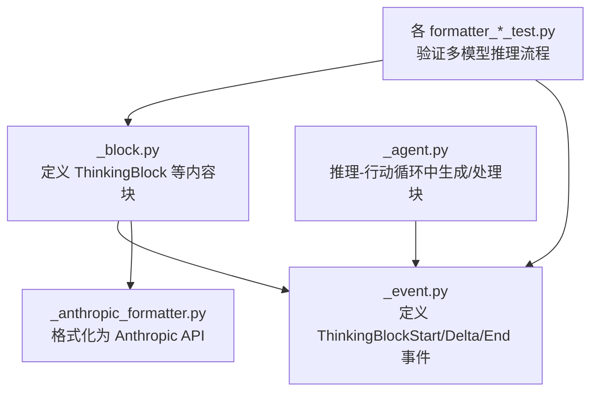
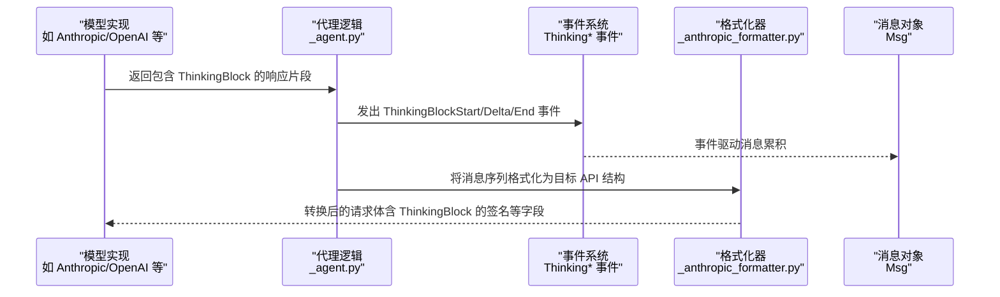
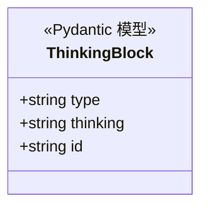
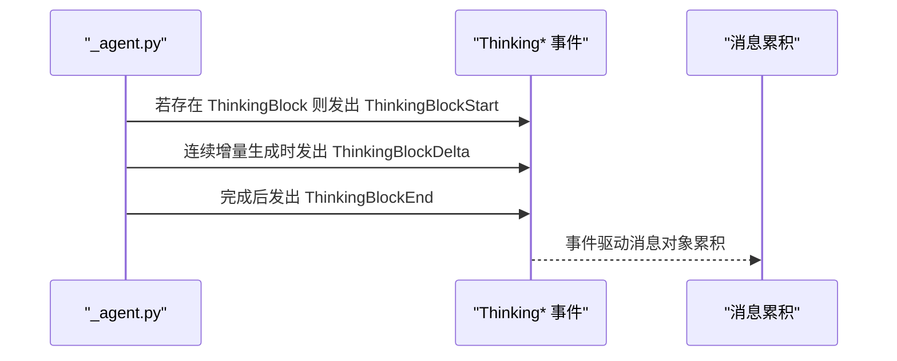
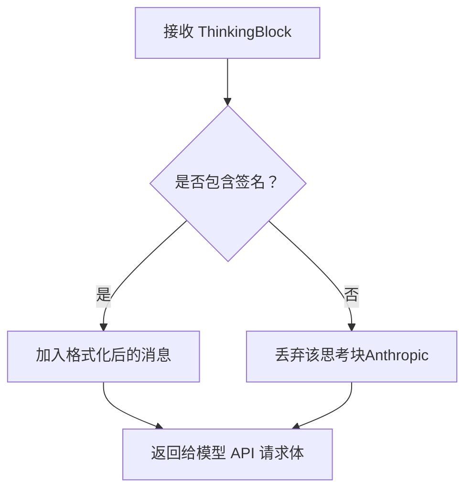

# 思考块 (ThinkingBlock)

<cite>
**本文引用的文件**
- [message/_block.py](file://src/agentscope/message/_block.py)
- [event/_event.py](file://src/agentscope/event/_event.py)
- [formatter/_anthropic_formatter.py](file://src/agentscope/formatter/_anthropic_formatter.py)
- [_agent.py](file://src/agentscope/agent/_agent.py)
- [formatter_dashscope_test.py](file://tests/formatter_dashscope_test.py)
- [formatter_gemini_test.py](file://tests/formatter_gemini_test.py)
- [formatter_ollama_test.py](file://tests/formatter_ollama_test.py)
- [formatter_deepseek_test.py](file://tests/formatter_deepseek_test.py)
- [formatter_openai_chat_test.py](file://tests/formatter_openai_chat_test.py)
- [event_to_message_test.py](file://tests/event_to_message_test.py)
</cite>

## 目录
1. [简介](#简介)
2. [项目结构](#项目结构)
3. [核心组件](#核心组件)
4. [架构总览](#架构总览)
5. [组件详解](#组件详解)
6. [依赖关系分析](#依赖关系分析)
7. [性能考量](#性能考量)
8. [故障排查指南](#故障排查指南)
9. [结论](#结论)
10. [附录](#附录)

## 简介
本文件围绕 AgentScope 中的“思考块”(ThinkingBlock)展开，系统阐述其设计目的、数据结构、配置特性、与文本块(TextBlock)的区别，以及在多模态推理场景下的使用方式与不同模型 API 的转换规则。特别地，ThinkingBlock 通过 Pydantic 的 ConfigDict 允许额外字段，使供应商（例如 Anthropic 的 signature）可直接携带任意元数据而无需继承子类，从而提升扩展性与兼容性。

## 项目结构
与 ThinkingBlock 相关的核心文件分布如下：
- 数据模型定义：message/_block.py
- 事件类型定义：event/_event.py
- 模型格式化器（以 Anthropic 为例）：formatter/_anthropic_formatter.py
- 推理-行动循环中的使用：agent/_agent.py
- 测试用例（覆盖多模型与流式事件）：各 formatter_*_test.py 与 event_to_message_test.py

图表来源
- [message/_block.py:22-37](file://src/agentscope/message/_block.py#L22-L37)
- [event/_event.py:188-225](file://src/agentscope/event/_event.py#L188-L225)
- [formatter/_anthropic_formatter.py:78-98](file://src/agentscope/formatter/_anthropic_formatter.py#L78-L98)
- [_agent.py:2397-2405](file://src/agentscope/agent/_agent.py#L2397-L2405)

章节来源
- [message/_block.py:1-197](file://src/agentscope/message/_block.py#L1-L197)
- [event/_event.py:1-432](file://src/agentscope/event/_event.py#L1-L432)

## 核心组件
- ThinkingBlock：用于承载智能体内部“思考”内容的数据结构，支持额外字段注入，便于供应商传递签名或元数据。
- ThinkingBlockStart/Delta/End 事件：用于在流式输出中分阶段广播思考块的开始、增量更新与结束。
- 与其他内容块的关系：与 TextBlock、HintBlock、ToolCallBlock、ToolResultBlock、DataBlock 并列，统一纳入 ContentBlock 类型别名。

章节来源
- [message/_block.py:22-37](file://src/agentscope/message/_block.py#L22-L37)
- [message/_block.py:180-196](file://src/agentscope/message/_block.py#L180-L196)
- [event/_event.py:188-225](file://src/agentscope/event/_event.py#L188-L225)

## 架构总览
下图展示了从模型响应到事件、再到消息组装的整体链路，重点体现 ThinkingBlock 在推理-行动循环中的位置与作用。

图表来源
- [_agent.py:2397-2405](file://src/agentscope/agent/_agent.py#L2397-L2405)
- [event/_event.py:188-225](file://src/agentscope/event/_event.py#L188-L225)
- [formatter/_anthropic_formatter.py:78-98](file://src/agentscope/formatter/_anthropic_formatter.py#L78-L98)

## 组件详解

### 设计目的与用途
- 表达智能体内在推理过程：ThinkingBlock 作为独立的内容块，承载“思考”文本，便于在多模态对话中显式展示或保留推理轨迹。
- 供应商无关的扩展机制：通过 ConfigDict(extra="allow")，允许在不修改基类的前提下注入供应商特定字段（如 Anthropic 的 signature），避免为每个供应商单独派生子类。
- 多模态推理中的连续性：某些供应商（如 Anthropic）建议在后续调用中回传历史思考块以保持推理连贯性。

章节来源
- [message/_block.py:22-37](file://src/agentscope/message/_block.py#L22-L37)
- [formatter/_anthropic_formatter.py:45-50](file://src/agentscope/formatter/_anthropic_formatter.py#L45-L50)

### 数据结构与字段
- 关键字段
  - type：固定为 "thinking"
  - thinking：实际的思考文本
  - id：唯一标识符（默认自动生成）
- 配置特性
  - model_config = ConfigDict(extra="allow")：允许任意额外字段，供供应商注入元数据

图表来源
- [message/_block.py:22-37](file://src/agentscope/message/_block.py#L22-L37)

章节来源
- [message/_block.py:22-37](file://src/agentscope/message/_block.py#L22-L37)

### 与 TextBlock 的区别
- TextBlock：承载纯文本内容，常用于最终回复或提示信息；在事件系统中对应 TextBlockStart/Delta/End。
- ThinkingBlock：承载推理过程中的“思考”文本；在事件系统中对应 ThinkingBlockStart/Delta/End。
- 在多模态场景中，两者可并存于同一消息中，分别表达“对外可见的文本”和“对内/对外展示的思考”。

章节来源
- [message/_block.py:11-20](file://src/agentscope/message/_block.py#L11-L20)
- [message/_block.py:22-37](file://src/agentscope/message/_block.py#L22-L37)
- [event/_event.py:114-147](file://src/agentscope/event/_event.py#L114-L147)
- [event/_event.py:188-225](file://src/agentscope/event/_event.py#L188-L225)

### 在推理-行动循环中的使用
- 事件驱动：当检测到存在 ThinkingBlock 时，代理会发出 ThinkingBlockStart 事件，随后在增量生成时发出 ThinkingBlockDelta 事件，最后在完成时发出 ThinkingBlockEnd 事件。
- 块 ID 管理：首次出现 ThinkingBlock 时分配新块 ID，并在后续增量中复用该 ID，确保事件与消息的正确拼接。

图表来源
- [_agent.py:2397-2405](file://src/agentscope/agent/_agent.py#L2397-L2405)
- [event/_event.py:188-225](file://src/agentscope/event/_event.py#L188-L225)

章节来源
- [_agent.py:2397-2405](file://src/agentscope/agent/_agent.py#L2397-L2405)

### 不同模型 API 的转换规则
- Anthropic
  - 要求思考块必须包含有效签名（signature），否则会被拒绝；若来源思考块不含签名则会被丢弃。
  - 建议在后续调用中回传所有历史思考块以保持推理连贯性。
- 其他模型（如 DashScope、Gemini、Ollama、DeepSeek、OpenAI Chat 等）
  - 测试用例显示这些模型在消息中可直接包含 ThinkingBlock，且在格式化阶段按各自规则进行处理或忽略。

图表来源
- [formatter/_anthropic_formatter.py:78-98](file://src/agentscope/formatter/_anthropic_formatter.py#L78-L98)
- [formatter/_anthropic_formatter.py:45-50](file://src/agentscope/formatter/_anthropic_formatter.py#L45-L50)

章节来源
- [formatter/_anthropic_formatter.py:78-98](file://src/agentscope/formatter/_anthropic_formatter.py#L78-L98)
- [formatter/_anthropic_formatter.py:45-50](file://src/agentscope/formatter/_anthropic_formatter.py#L45-L50)
- [formatter_dashscope_test.py:662-863](file://tests/formatter_dashscope_test.py#L662-L863)
- [formatter_gemini_test.py:475-509](file://tests/formatter_gemini_test.py#L475-L509)
- [formatter_ollama_test.py:405-438](file://tests/formatter_ollama_test.py#L405-L438)
- [formatter_deepseek_test.py:326-359](file://tests/formatter_deepseek_test.py#L326-L359)
- [formatter_openai_chat_test.py:563-595](file://tests/formatter_openai_chat_test.py#L563-L595)

### 创建示例与最佳实践
- 直接实例化：可直接创建 ThinkingBlock(thinking="...")，并在需要时附加供应商特定字段（如 signature）。
- 流式事件：在推理过程中，先发出 ThinkingBlockStart，再多次发出 ThinkingBlockDelta，最后发出 ThinkingBlockEnd。
- 多模态组合：可在同一消息中同时包含 TextBlock、ThinkingBlock、DataBlock、ToolCallBlock 等，形成丰富的多模态交互。

章节来源
- [event_to_message_test.py:204-248](file://tests/event_to_message_test.py#L204-L248)
- [message/_block.py:22-37](file://src/agentscope/message/_block.py#L22-L37)

## 依赖关系分析
- 内聚与耦合
  - ThinkingBlock 与事件系统紧密耦合，通过 ThinkingBlockStart/Delta/End 事件参与流式渲染。
  - 与格式化器解耦：格式化器仅根据目标 API 规则处理 ThinkingBlock，ThinkingBlock 本身不依赖具体供应商。
- 外部依赖
  - 使用 Pydantic 的 ConfigDict 控制额外字段行为。
  - 事件系统依赖 UUID 与时间戳，保证事件的唯一性与时序。

图表来源
- [message/_block.py:22-37](file://src/agentscope/message/_block.py#L22-L37)
- [event/_event.py:188-225](file://src/agentscope/event/_event.py#L188-L225)
- [formatter/_anthropic_formatter.py:78-98](file://src/agentscope/formatter/_anthropic_formatter.py#L78-L98)

章节来源
- [message/_block.py:22-37](file://src/agentscope/message/_block.py#L22-L37)
- [event/_event.py:188-225](file://src/agentscope/event/_event.py#L188-L225)

## 性能考量
- 额外字段开销：ConfigDict(extra="allow") 提升了灵活性，但需注意字段数量与大小，避免无谓的元数据膨胀。
- 事件频率：在高吞吐场景下，频繁发出 ThinkingBlockDelta 事件可能带来序列化与传输成本，应结合业务需求控制增量粒度。
- 格式化成本：不同供应商对 ThinkingBlock 的处理差异较大（如 Anthropic 的签名校验与丢弃策略），应在格式化阶段尽早过滤无效内容，减少后续处理负担。

## 故障排查指南
- Anthropic 报错“缺少签名”
  - 现象：发送包含 ThinkingBlock 的请求被拒绝。
  - 原因：Anthropic 要求思考块必须包含有效 signature 字段。
  - 解决：在创建 ThinkingBlock 时附带 signature，或在格式化阶段跳过无签名的思考块。
- 推理连贯性问题
  - 现象：后续调用中推理上下文断裂。
  - 原因：未回传历史思考块。
  - 解决：遵循供应商建议，在后续调用中携带全部历史 ThinkingBlock。
- 事件与消息不一致
  - 现象：消息中缺少最终的 ThinkingBlockEnd 对应内容。
  - 原因：事件未正确发出或消息累积逻辑未处理结束事件。
  - 解决：检查代理逻辑中 ThinkingBlock 的事件生成与消息拼接流程。

章节来源
- [formatter/_anthropic_formatter.py:78-98](file://src/agentscope/formatter/_anthropic_formatter.py#L78-L98)
- [formatter/_anthropic_formatter.py:45-50](file://src/agentscope/formatter/_anthropic_formatter.py#L45-L50)
- [_agent.py:2397-2405](file://src/agentscope/agent/_agent.py#L2397-L2405)

## 结论
ThinkingBlock 通过简洁的数据结构与灵活的额外字段配置，为多模态推理提供了清晰的“思考”表达能力。配合事件系统与格式化器，它能在不同供应商 API 之间保持一致性与扩展性。在实际使用中，应关注供应商对签名与连贯性的要求，并合理控制事件粒度与元数据规模，以获得更稳定高效的推理-行动循环体验。

## 附录
- 相关测试用例路径（用于参考与验证）
  - [formatter_dashscope_test.py:662-863](file://tests/formatter_dashscope_test.py#L662-L863)
  - [formatter_gemini_test.py:475-509](file://tests/formatter_gemini_test.py#L475-L509)
  - [formatter_ollama_test.py:405-438](file://tests/formatter_ollama_test.py#L405-L438)
  - [formatter_deepseek_test.py:326-359](file://tests/formatter_deepseek_test.py#L326-L359)
  - [formatter_openai_chat_test.py:563-595](file://tests/formatter_openai_chat_test.py#L563-L595)
  - [event_to_message_test.py:204-248](file://tests/event_to_message_test.py#L204-L248)