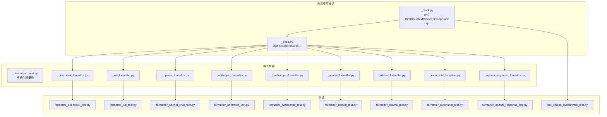
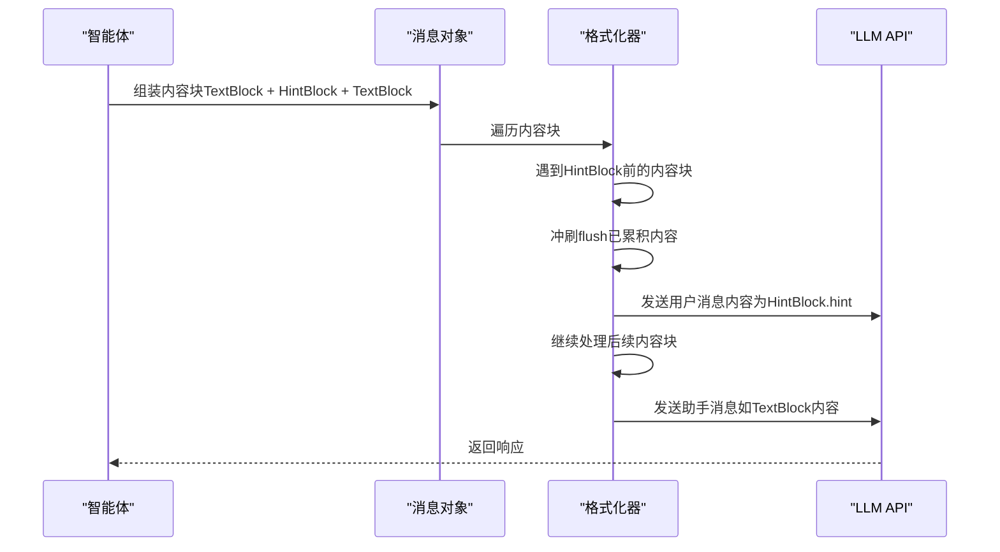
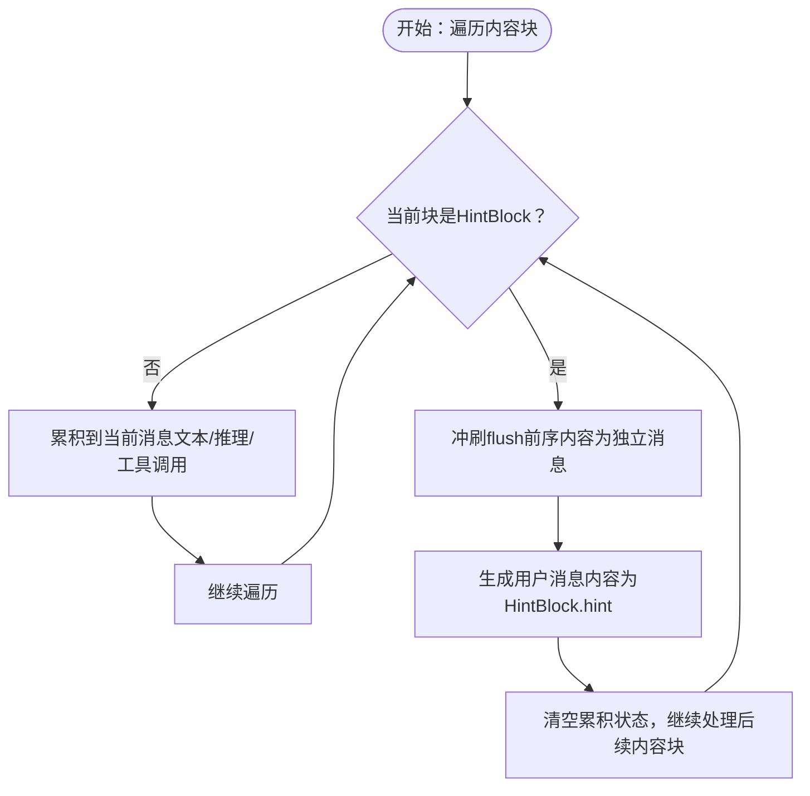
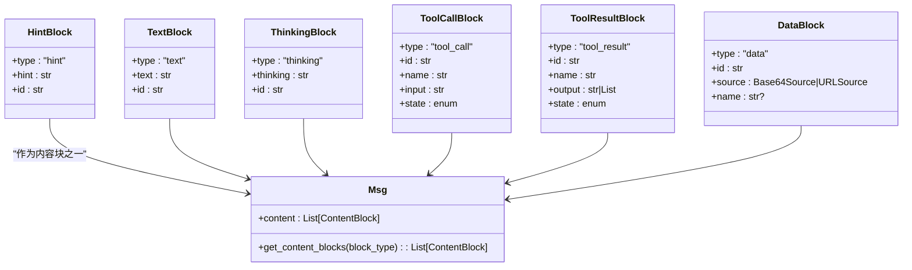

# 提示块（HintBlock）

<cite>
**本文引用的文件**
- [message/_block.py](file://src/agentscope/message/_block.py)
- [formatter/_deepseek_formatter.py](file://src/agentscope/formatter/_deepseek_formatter.py)
- [formatter/_xai_formatter.py](file://src/agentscope/formatter/_xai_formatter.py)
- [formatter/_openai_formatter.py](file://src/agentscope/formatter/_openai_formatter.py)
- [formatter/_anthropic_formatter.py](file://src/agentscope/formatter/_anthropic_formatter.py)
- [formatter/_dashscope_formatter.py](file://src/agentscope/formatter/_dashscope_formatter.py)
- [formatter/_gemini_formatter.py](file://src/agentscope/formatter/_gemini_formatter.py)
- [formatter/_ollama_formatter.py](file://src/agentscope/formatter/_ollama_formatter.py)
- [formatter/_moonshot_formatter.py](file://src/agentscope/formatter/_moonshot_formatter.py)
- [formatter/_openai_response_formatter.py](file://src/agentscope/formatter/_openai_response_formatter.py)
- [formatter/_formatter_base.py](file://src/agentscope/formatter/_formatter_base.py)
- [message/_base.py](file://src/agentscope/message/_base.py)
- [formatter_deepseek_test.py](file://tests/formatter_deepseek_test.py)
- [formatter_xai_test.py](file://tests/formatter_xai_test.py)
- [formatter_openai_chat_test.py](file://tests/formatter_openai_chat_test.py)
- [formatter_anthropic_test.py](file://tests/formatter_anthropic_test.py)
- [formatter_dashscope_test.py](file://tests/formatter_dashscope_test.py)
- [formatter_gemini_test.py](file://tests/formatter_gemini_test.py)
- [formatter_ollama_test.py](file://tests/formatter_ollama_test.py)
- [formatter_moonshot_test.py](file://tests/formatter_moonshot_test.py)
- [formatter_openai_response_test.py](file://tests/formatter_openai_response_test.py)
- [tool_offload_middleware_test.py](file://tests/tool_offload_middleware_test.py)
</cite>

## 目录
1. [简介](#简介)
2. [项目结构](#项目结构)
3. [核心组件](#核心组件)
4. [架构总览](#架构总览)
5. [组件详解](#组件详解)
6. [依赖关系分析](#依赖关系分析)
7. [性能考量](#性能考量)
8. [故障排查指南](#故障排查指南)
9. [结论](#结论)
10. [附录](#附录)

## 简介
本文件聚焦于AgentScope中的“提示块”（HintBlock），系统性阐述其设计理念、数据结构、与格式化器（Formatter）的协作机制、与其他内容块（TextBlock、ThinkingBlock）的关系与差异，以及在智能体交互中的典型应用场景与最佳实践。HintBlock用于在推理-行动循环中向大语言模型（LLM）提供指令或提示，当传递给LLM API时，HintBlock会被转换为“用户消息”，从而引导模型行为。

## 项目结构
围绕HintBlock的相关代码主要分布在以下模块：
- 内容块定义：message/_block.py
- 消息与内容块的访问接口：message/_base.py
- 各厂商格式化器：formatter/_xxx_formatter.py
- 单元测试：tests/formatter_*_test.py 与 tests/tool_offload_middleware_test.py

图表来源
- [message/_block.py:1-197](file://src/agentscope/message/_block.py#L1-L197)
- [message/_base.py:176-197](file://src/agentscope/message/_base.py#L176-L197)
- [formatter/_formatter_base.py](file://src/agentscope/formatter/_formatter_base.py)
- [formatter/_deepseek_formatter.py:78-111](file://src/agentscope/formatter/_deepseek_formatter.py#L78-L111)
- [formatter/_xai_formatter.py:214-238](file://src/agentscope/formatter/_xai_formatter.py#L214-L238)
- [formatter/_openai_formatter.py](file://src/agentscope/formatter/_openai_formatter.py)
- [formatter/_anthropic_formatter.py](file://src/agentscope/formatter/_anthropic_formatter.py)
- [formatter/_dashscope_formatter.py](file://src/agentscope/formatter/_dashscope_formatter.py)
- [formatter/_gemini_formatter.py](file://src/agentscope/formatter/_gemini_formatter.py)
- [formatter/_ollama_formatter.py](file://src/agentscope/formatter/_ollama_formatter.py)
- [formatter/_moonshot_formatter.py](file://src/agentscope/formatter/_moonshot_formatter.py)
- [formatter/_openai_response_formatter.py](file://src/agentscope/formatter/_openai_response_formatter.py)
- [formatter_deepseek_test.py:462-494](file://tests/formatter_deepseek_test.py#L462-L494)
- [formatter_xai_test.py:539-560](file://tests/formatter_xai_test.py#L539-L560)
- [formatter_openai_chat_test.py:692-730](file://tests/formatter_openai_chat_test.py#L692-L730)
- [formatter_anthropic_test.py:750-786](file://tests/formatter_anthropic_test.py#L750-L786)
- [formatter_dashscope_test.py:957-993](file://tests/formatter_dashscope_test.py#L957-L993)
- [formatter_gemini_test.py:641-677](file://tests/formatter_gemini_test.py#L641-L677)
- [formatter_ollama_test.py:512-542](file://tests/formatter_ollama_test.py#L512-L542)
- [formatter_moonshot_test.py:744-784](file://tests/formatter_moonshot_test.py#L744-L784)
- [formatter_openai_response_test.py:692-737](file://tests/formatter_openai_response_test.py#L692-L737)
- [tool_offload_middleware_test.py:243-279](file://tests/tool_offload_middleware_test.py#L243-L279)

章节来源
- [message/_block.py:40-51](file://src/agentscope/message/_block.py#L40-L51)
- [message/_base.py:176-197](file://src/agentscope/message/_base.py#L176-L197)

## 核心组件
- HintBlock：用于在推理-行动循环中向LLM提供指令或提示的内容块。其类型标识为“hint”，包含提示文本字段与唯一标识符。当通过格式化器转为API消息时，HintBlock会成为“用户消息”。
- ContentBlock类型别名：聚合了TextBlock、ThinkingBlock、HintBlock、ToolCallBlock、ToolResultBlock、DataBlock等，作为消息内容的统一类型约束。
- 消息接口：Msg.get_content_blocks支持按类型筛选内容块，便于在格式化与渲染阶段进行分组与处理。

章节来源
- [message/_block.py:40-51](file://src/agentscope/message/_block.py#L40-L51)
- [message/_block.py:180-197](file://src/agentscope/message/_block.py#L180-L197)
- [message/_base.py:176-197](file://src/agentscope/message/_base.py#L176-L197)

## 架构总览
HintBlock在消息流转中的关键路径如下：
- 定义阶段：在消息内容列表中插入HintBlock，通常夹在TextBlock与后续TextBlock之间，用于临时插入指令。
- 格式化阶段：各格式化器在遍历内容块时，遇到HintBlock会“冲刷”（flush）之前的文本/推理/工具调用内容，然后单独输出一条“用户消息”，随后继续处理后续内容块。
- 推理阶段：LLM接收由多条消息组成的上下文，其中包含由HintBlock生成的用户指令，从而影响后续回答风格或策略。

图表来源
- [formatter/_deepseek_formatter.py:78-111](file://src/agentscope/formatter/_deepseek_formatter.py#L78-L111)
- [formatter/_xai_formatter.py:214-238](file://src/agentscope/formatter/_xai_formatter.py#L214-L238)
- [formatter_deepseek_test.py:462-494](file://tests/formatter_deepseek_test.py#L462-L494)
- [formatter_xai_test.py:539-560](file://tests/formatter_xai_test.py#L539-L560)

## 组件详解

### HintBlock 数据模型与语义
- 类型标识：固定为“hint”，确保在格式化阶段可被识别并单独处理。
- 字段含义：hint为字符串，承载对模型行为的约束或指导，例如风格、长度、格式、安全策略等。
- 唯一标识：id用于区分不同内容块，便于事件追踪与调试。

章节来源
- [message/_block.py:40-51](file://src/agentscope/message/_block.py#L40-L51)

### 与TextBlock和ThinkingBlock的关系与区别
- 与TextBlock的区别
  - TextBlock承载普通文本内容，通常作为助手消息发送。
  - HintBlock承载“指令/提示”，在格式化时被转换为“用户消息”，用于引导模型行为。
- 与ThinkingBlock的区别
  - ThinkingBlock承载推理过程或中间思考内容，常用于特定厂商的特殊字段或结构。
  - HintBlock不承载推理内容，而是直接作为用户指令注入上下文。
- 共同点
  - 三者均属于ContentBlock集合，均可在消息中顺序组合，参与格式化与渲染流程。

章节来源
- [message/_block.py:11-19](file://src/agentscope/message/_block.py#L11-L19)
- [message/_block.py:22-37](file://src/agentscope/message/_block.py#L22-L37)
- [message/_block.py:40-51](file://src/agentscope/message/_block.py#L40-L51)
- [message/_block.py:180-197](file://src/agentscope/message/_block.py#L180-L197)

### 在格式化器中的处理流程
- 冲刷与拆分
  - 当格式化器遇到HintBlock时，会先将之前累积的文本/推理/工具调用内容冲刷为独立消息，再将HintBlock转换为“用户消息”单独发送。
  - 这保证了提示指令与先前内容的解耦，避免提示被嵌入到模型的推理或文本中。
- 多厂商适配
  - 不同格式化器对“用户消息”的表达方式略有差异（如字段名、结构），但均遵循“先冲刷，后插入用户指令”的通用模式。
- 测试验证
  - 多个格式化器的单元测试覆盖了该行为，断言结果中HintBlock对应位置为“用户消息”。

图表来源
- [formatter/_deepseek_formatter.py:78-111](file://src/agentscope/formatter/_deepseek_formatter.py#L78-L111)
- [formatter/_xai_formatter.py:214-238](file://src/agentscope/formatter/_xai_formatter.py#L214-L238)
- [formatter_deepseek_test.py:462-494](file://tests/formatter_deepseek_test.py#L462-L494)
- [formatter_xai_test.py:539-560](file://tests/formatter_xai_test.py#L539-L560)

章节来源
- [formatter/_deepseek_formatter.py:78-111](file://src/agentscope/formatter/_deepseek_formatter.py#L78-L111)
- [formatter/_xai_formatter.py:214-238](file://src/agentscope/formatter/_xai_formatter.py#L214-L238)
- [formatter_deepseek_test.py:462-494](file://tests/formatter_deepseek_test.py#L462-L494)
- [formatter_xai_test.py:539-560](file://tests/formatter_xai_test.py#L539-L560)

### 实际应用场景与最佳实践
- 场景一：控制回答风格
  - 在一段推理后插入HintBlock，要求模型“保持简洁”“仅输出最终答案”，以减少冗余与幻觉。
- 场景二：注入安全与合规约束
  - 在工具调用前后插入HintBlock，强调“不得泄露内部信息”“必须遵守隐私政策”等。
- 场景三：引导多轮对话策略
  - 在复杂任务中，通过HintBlock提示模型“先总结已知信息，再提出下一步计划”，提升结构化输出质量。
- 最佳实践
  - 将HintBlock置于需要“强制性干预”的位置，避免过度频繁插入导致上下文碎片化。
  - 提示内容应具体、可执行，避免模糊指令；必要时给出正反示例。
  - 与ThinkingBlock配合使用，先用ThinkingBlock记录推理过程，再用HintBlock统一输出最终结论。

章节来源
- [formatter_openai_chat_test.py:692-730](file://tests/formatter_openai_chat_test.py#L692-L730)
- [formatter_anthropic_test.py:750-786](file://tests/formatter_anthropic_test.py#L750-L786)
- [formatter_dashscope_test.py:957-993](file://tests/formatter_dashscope_test.py#L957-L993)
- [formatter_gemini_test.py:641-677](file://tests/formatter_gemini_test.py#L641-L677)
- [formatter_ollama_test.py:512-542](file://tests/formatter_ollama_test.py#L512-L542)
- [formatter_moonshot_test.py:744-784](file://tests/formatter_moonshot_test.py#L744-L784)
- [formatter_openai_response_test.py:692-737](file://tests/formatter_openai_response_test.py#L692-L737)

### 代码示例（路径指引）
- DeepSeek格式化器中HintBlock的处理与测试
  - 参考：[formatter/_deepseek_formatter.py:78-111](file://src/agentscope/formatter/_deepseek_formatter.py#L78-L111)
  - 测试：[formatter_deepseek_test.py:462-494](file://tests/formatter_deepseek_test.py#L462-L494)
- XAI格式化器中HintBlock的处理与测试
  - 参考：[formatter/_xai_formatter.py:214-238](file://src/agentscope/formatter/_xai_formatter.py#L214-L238)
  - 测试：[formatter_xai_test.py:539-560](file://tests/formatter_xai_test.py#L539-L560)
- OpenAI、Anthropic、DashScope、Gemini、Ollama、Moonshot、OpenAI Response等格式化器与测试
  - 参考：[formatter/_openai_formatter.py](file://src/agentscope/formatter/_openai_formatter.py)、[formatter/_anthropic_formatter.py](file://src/agentscope/formatter/_anthropic_formatter.py)、[formatter/_dashscope_formatter.py](file://src/agentscope/formatter/_dashscope_formatter.py)、[formatter/_gemini_formatter.py](file://src/agentscope/formatter/_gemini_formatter.py)、[formatter/_ollama_formatter.py](file://src/agentscope/formatter/_ollama_formatter.py)、[formatter/_moonshot_formatter.py](file://src/agentscope/formatter/_moonshot_formatter.py)、[formatter/_openai_response_formatter.py](file://src/agentscope/formatter/_openai_response_formatter.py)
  - 测试：[formatter_openai_chat_test.py:692-730](file://tests/formatter_openai_chat_test.py#L692-L730)、[formatter_anthropic_test.py:750-786](file://tests/formatter_anthropic_test.py#L750-L786)、[formatter_dashscope_test.py:957-993](file://tests/formatter_dashscope_test.py#L957-L993)、[formatter_gemini_test.py:641-677](file://tests/formatter_gemini_test.py#L641-L677)、[formatter_ollama_test.py:512-542](file://tests/formatter_ollama_test.py#L512-L542)、[formatter_moonshot_test.py:744-784](file://tests/formatter_moonshot_test.py#L744-L784)、[formatter_openai_response_test.py:692-737](file://tests/formatter_openai_response_test.py#L692-L737)

### 从后台任务注入HintBlock
- 背景：当工具执行为后台任务时，完成后会将结果以HintBlock形式注入到上下文中，作为“系统通知”引导后续对话。
- 行为验证：测试断言后台任务完成后的Pending结果为HintBlock，且包含预期提示文本与标记。

章节来源
- [tool_offload_middleware_test.py:243-279](file://tests/tool_offload_middleware_test.py#L243-L279)

## 依赖关系分析
- 内容块与消息接口
  - HintBlock属于ContentBlock集合，可通过Msg.get_content_blocks按类型提取，便于在格式化与渲染阶段进行分组处理。
- 格式化器与厂商适配
  - 各格式化器均需遵循“遇到HintBlock即冲刷并插入用户消息”的通用协议，同时适配各自API的消息结构（如角色字段、内容结构等）。
- 测试驱动的契约
  - 多个格式化器的测试共同验证了HintBlock的行为一致性，确保跨厂商的一致体验。

图表来源
- [message/_block.py:11-19](file://src/agentscope/message/_block.py#L11-L19)
- [message/_block.py:22-37](file://src/agentscope/message/_block.py#L22-L37)
- [message/_block.py:40-51](file://src/agentscope/message/_block.py#L40-L51)
- [message/_block.py:105-177](file://src/agentscope/message/_block.py#L105-L177)
- [message/_block.py:81-93](file://src/agentscope/message/_block.py#L81-L93)
- [message/_base.py:176-197](file://src/agentscope/message/_base.py#L176-L197)

章节来源
- [message/_block.py:180-197](file://src/agentscope/message/_block.py#L180-L197)
- [message/_base.py:176-197](file://src/agentscope/message/_base.py#L176-L197)

## 性能考量
- 冲刷频率与消息数量
  - 频繁插入HintBlock会导致消息数量增加，可能影响上下文长度与延迟。建议在关键节点插入，避免过度拆分。
- 内容块合并策略
  - 对相邻的文本块可考虑合并后再冲刷，减少消息边界切换带来的开销。
- 工具调用与提示的协同
  - 在工具调用前后插入HintBlock时，注意避免重复提示，保持上下文简洁。

## 故障排查指南
- 现象：HintBlock未生效或被忽略
  - 检查格式化器是否正确识别HintBlock类型；确认消息结构中是否存在“用户消息”片段。
  - 参考测试用例断言，核对各厂商格式化器的输出结构。
- 现象：提示被嵌入到模型输出而非作为外部指令
  - 确认格式化器在遇到HintBlock时执行了“冲刷”操作；检查测试用例中用户消息的位置是否在提示文本之后。
- 现象：后台任务完成后未注入系统通知
  - 检查工具卸载中间件是否将结果封装为HintBlock并注入上下文；参考相关测试断言。

章节来源
- [formatter_deepseek_test.py:462-494](file://tests/formatter_deepseek_test.py#L462-L494)
- [formatter_xai_test.py:539-560](file://tests/formatter_xai_test.py#L539-L560)
- [formatter_openai_chat_test.py:692-730](file://tests/formatter_openai_chat_test.py#L692-L730)
- [formatter_anthropic_test.py:750-786](file://tests/formatter_anthropic_test.py#L750-L786)
- [formatter_dashscope_test.py:957-993](file://tests/formatter_dashscope_test.py#L957-L993)
- [formatter_gemini_test.py:641-677](file://tests/formatter_gemini_test.py#L641-L677)
- [formatter_ollama_test.py:512-542](file://tests/formatter_ollama_test.py#L512-L542)
- [formatter_moonshot_test.py:744-784](file://tests/formatter_moonshot_test.py#L744-L784)
- [formatter_openai_response_test.py:692-737](file://tests/formatter_openai_response_test.py#L692-L737)
- [tool_offload_middleware_test.py:243-279](file://tests/tool_offload_middleware_test.py#L243-L279)

## 结论
HintBlock为AgentScope提供了可控、可移植的提示注入机制。通过在推理-行动循环中插入HintBlock，开发者可以以统一的方式向不同厂商的LLM API注入用户级指令，从而稳定地引导模型行为。结合TextBlock与ThinkingBlock，HintBlock能够与推理过程无缝衔接，在保证上下文连贯的同时实现精确的策略控制。建议在关键节点使用HintBlock，并遵循具体格式化器的输出约定，以获得一致的跨平台体验。

## 附录
- 相关类型别名与消息接口
  - ContentBlock与ContentBlockTypes用于统一约束内容块类型。
  - Msg.get_content_blocks支持按类型筛选，便于在格式化与渲染阶段进行分组处理。

章节来源
- [message/_block.py:180-197](file://src/agentscope/message/_block.py#L180-L197)
- [message/_base.py:176-197](file://src/agentscope/message/_base.py#L176-L197)