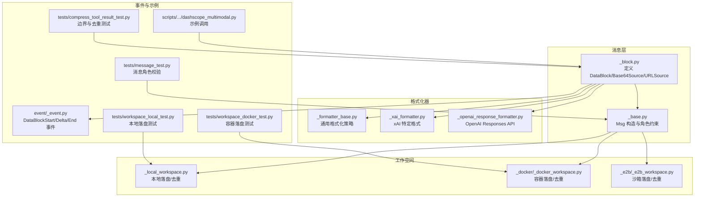
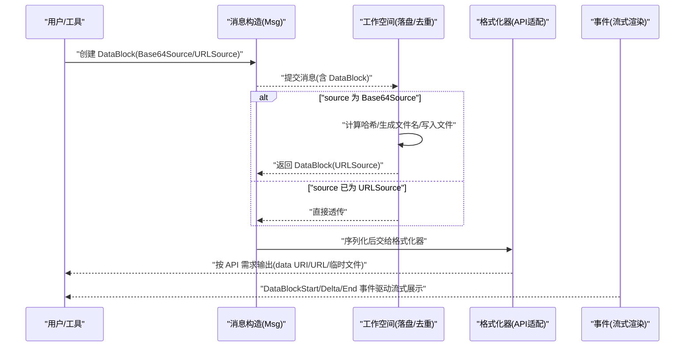
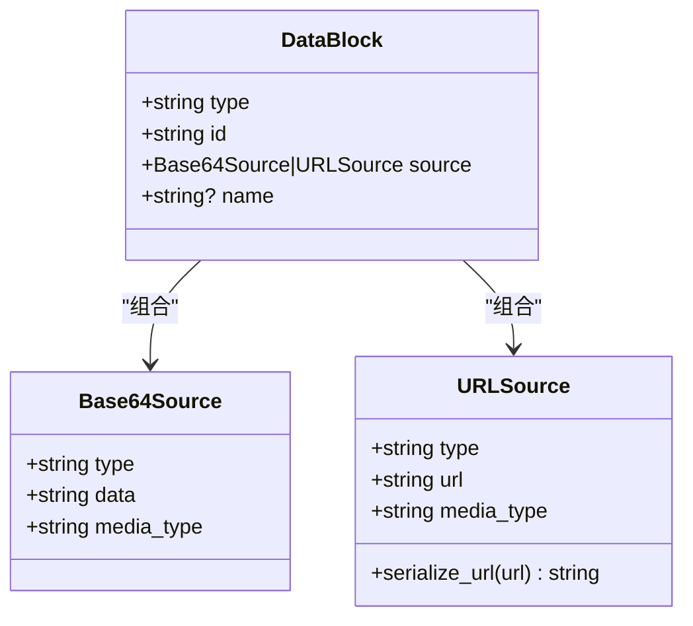
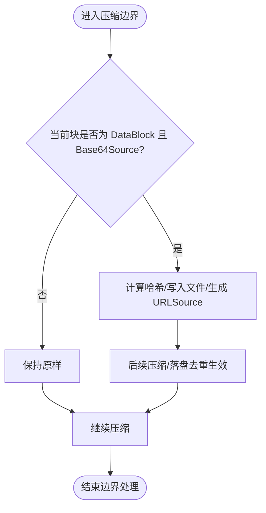
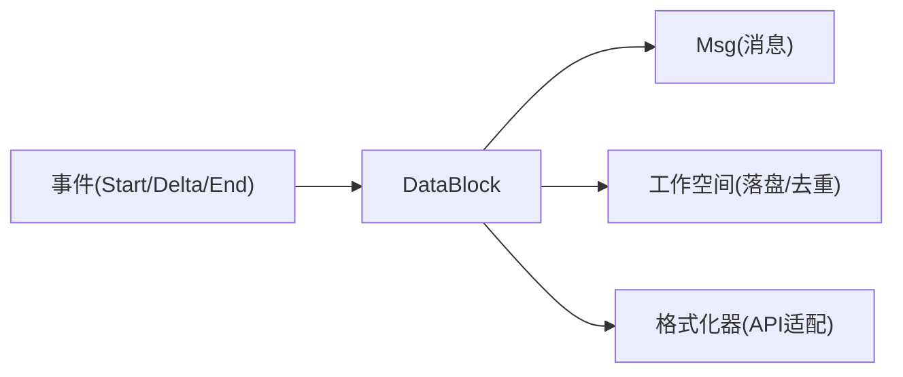

# 数据块 (DataBlock)

<cite>
**本文引用的文件**
- [message/_block.py](file://src/agentscope/message/_block.py)
- [message/_base.py](file://src/agentscope/message/_base.py)
- [workspace/_local_workspace.py](file://src/agentscope/workspace/_local_workspace.py)
- [workspace/_docker/_docker_workspace.py](file://src/agentscope/workspace/_docker/_docker_workspace.py)
- [workspace/_e2b/_e2b_workspace.py](file://src/agentscope/workspace/_e2b/_e2b_workspace.py)
- [formatter/_formatter_base.py](file://src/agentscope/formatter/_formatter_base.py)
- [formatter/_xai_formatter.py](file://src/agentscope/formatter/_xai_formatter.py)
- [formatter/_openai_response_formatter.py](file://src/agentscope/formatter/_openai_response_formatter.py)
- [event/_event.py](file://src/agentscope/event/_event.py)
- [scripts/model_examples/dashscope_multimodal.py](file://scripts/model_examples/dashscope_multimodal.py)
- [tests/workspace_local_test.py](file://tests/workspace_local_test.py)
- [tests/workspace_docker_test.py](file://tests/workspace_docker_test.py)
- [tests/compress_tool_result_test.py](file://tests/compress_tool_result_test.py)
- [tests/message_test.py](file://tests/message_test.py)
</cite>

## 目录
1. [引言](#引言)
2. [项目结构](#项目结构)
3. [核心组件](#核心组件)
4. [架构总览](#架构总览)
5. [组件详解](#组件详解)
6. [依赖关系分析](#依赖关系分析)
7. [性能与体积优化](#性能与体积优化)
8. [故障排查指南](#故障排查指南)
9. [结论](#结论)
10. [附录](#附录)

## 引言
本文件系统性阐述 AgentScope 中“数据块”（DataBlock）的设计与用法，聚焦于二进制内容（图像、音频、视频等）的统一建模与跨组件传递。DataBlock 通过复合结构支持两种数据源：Base64Source 与 URLSource；同时提供可选的 name 字段以标识数据块用途或来源。本文将从架构、数据流、序列化/反序列化、多模态消息中的角色、性能考量到实践示例进行深入说明。

## 项目结构
围绕 DataBlock 的关键代码分布在以下模块：
- 消息与数据块定义：message/_block.py
- 消息构造入口：message/_base.py
- 工作空间离线落盘与去重：workspace/_local_workspace.py、workspace/_docker/_docker_workspace.py、workspace/_e2b/_e2b_workspace.py
- 格式化器适配不同模型 API：formatter/_formatter_base.py、formatter/_xai_formatter.py、formatter/_openai_response_formatter.py
- 事件与流式渲染：event/_event.py
- 示例与测试：scripts/model_examples/dashscope_multimodal.py、tests 下多类测试

图表来源
- [message/_block.py:81-92](file://src/agentscope/message/_block.py#L81-L92)
- [message/_base.py:432-464](file://src/agentscope/message/_base.py#L432-L464)
- [workspace/_local_workspace.py:437-463](file://src/agentscope/workspace/_local_workspace.py#L437-L463)
- [workspace/_docker/_docker_workspace.py:1219-1229](file://src/agentscope/workspace/_docker/_docker_workspace.py#L1219-L1229)
- [workspace/_e2b/_e2b_workspace.py:1017-1034](file://src/agentscope/workspace/_e2b/_e2b_workspace.py#L1017-L1034)
- [formatter/_formatter_base.py:136-164](file://src/agentscope/formatter/_formatter_base.py#L136-L164)
- [formatter/_xai_formatter.py:110-134](file://src/agentscope/formatter/_xai_formatter.py#L110-L134)
- [formatter/_openai_response_formatter.py:45-73](file://src/agentscope/formatter/_openai_response_formatter.py#L45-L73)
- [event/_event.py:148-176](file://src/agentscope/event/_event.py#L148-L176)
- [scripts/model_examples/dashscope_multimodal.py:87-154](file://scripts/model_examples/dashscope_multimodal.py#L87-L154)
- [tests/workspace_local_test.py:259-284](file://tests/workspace_local_test.py#L259-L284)
- [tests/workspace_docker_test.py:301-351](file://tests/workspace_docker_test.py#L301-L351)
- [tests/compress_tool_result_test.py:153-158](file://tests/compress_tool_result_test.py#L153-L158)
- [tests/message_test.py:214-243](file://tests/message_test.py#L214-L243)

章节来源
- [message/_block.py:1-197](file://src/agentscope/message/_block.py#L1-L197)
- [message/_base.py:432-464](file://src/agentscope/message/_base.py#L432-L464)

## 核心组件
- DataBlock：承载二进制内容的复合块，包含 type、id、source、name 等字段。其中 source 为联合类型，可为 Base64Source 或 URLSource。
- Base64Source：内含媒体类型与 base64 编码数据字符串，适用于内存中已有二进制数据或需要显式控制编码流程的场景。
- URLSource：内含媒体类型与 AnyUrl 类型的 URL 字符串，适用于网络资源或已持久化的本地文件路径（如 file://）。
- ContentBlock 类型别名：DataBlock 作为内容块之一，与 TextBlock、ThinkingBlock、HintBlock、ToolCallBlock、ToolResultBlock 统一参与消息内容列表。

章节来源
- [message/_block.py:54-92](file://src/agentscope/message/_block.py#L54-L92)
- [message/_block.py:180-197](file://src/agentscope/message/_block.py#L180-L197)

## 架构总览
DataBlock 在系统中的流转路径如下：
- 创建阶段：通过 Msg 构造函数传入 DataBlock 列表，或直接构造 DataBlock 并放入消息内容。
- 序列化阶段：DataBlock 及其 source 字段被 Pydantic 序列化为 JSON；URLSource 的 url 字段通过自定义序列化器输出为字符串。
- 落盘/去重阶段：当 DataBlock 为 Base64Source 时，工作空间将其持久化为文件并替换为 URLSource（file://），同时对相同内容进行哈希去重。
- 格式化阶段：不同格式化器根据 source 类型选择 data URI、URL 或临时文件路径进行输出。
- 事件阶段：在流式渲染中，DataBlockStart/Delta/End 事件驱动前端或中间件逐步拼接 base64 数据。

图表来源
- [message/_base.py:432-464](file://src/agentscope/message/_base.py#L432-L464)
- [workspace/_local_workspace.py:437-463](file://src/agentscope/workspace/_local_workspace.py#L437-L463)
- [workspace/_docker/_docker_workspace.py:1219-1229](file://src/agentscope/workspace/_docker/_docker_workspace.py#L1219-L1229)
- [workspace/_e2b/_e2b_workspace.py:1017-1034](file://src/agentscope/workspace/_e2b/_e2b_workspace.py#L1017-L1034)
- [formatter/_formatter_base.py:136-164](file://src/agentscope/formatter/_formatter_base.py#L136-L164)
- [event/_event.py:148-176](file://src/agentscope/event/_event.py#L148-L176)

## 组件详解

### DataBlock 复合结构与字段语义
- type：固定为 "data"，用于区分内容块类型。
- id：唯一标识符，便于去重、事件追踪与合并。
- source：二选一的数据源
  - Base64Source：data 为 base64 字符串，media_type 为 MIME 类型。
  - URLSource：url 为 AnyUrl，media_type 为 MIME 类型。
- name：可选名称，用于标识数据块用途或来源（例如文件名）。

图表来源
- [message/_block.py:54-92](file://src/agentscope/message/_block.py#L54-L92)

章节来源
- [message/_block.py:54-92](file://src/agentscope/message/_block.py#L54-L92)

### source 字段选择逻辑与使用场景
- 优先使用 URLSource 的场景
  - 已有网络资源或本地文件路径（file://），避免将大二进制数据嵌入 JSON。
  - 工作空间会直接透传 URLSource，不触发落盘。
- 使用 Base64Source 的场景
  - 内存中已有二进制数据，或需要显式控制编码步骤。
  - 工作空间会将其持久化为文件并替换为 URLSource，确保上下文文件轻量化。
- 选择建议
  - 大体量二进制（图像/视频/音频）优先 URLSource。
  - 小体量或临时数据可用 Base64Source，但注意 JSON 体积膨胀。

章节来源
- [workspace/_local_workspace.py:451-452](file://src/agentscope/workspace/_local_workspace.py#L451-L452)
- [workspace/_docker/_docker_workspace.py:1219-1229](file://src/agentscope/workspace/_docker/_docker_workspace.py#L1219-L1229)
- [workspace/_e2b/_e2b_workspace.py:1017-1034](file://src/agentscope/workspace/_e2b/_e2b_workspace.py#L1017-L1034)

### 序列化与反序列化
- 序列化
  - DataBlock 与子对象（Base64Source/URLSource）由 Pydantic 自动序列化。
  - URLSource 的 url 字段通过 field_serializer 输出为字符串，保证 JSON 兼容。
- 反序列化
  - 从 JSON 还原时，Pydantic 会自动识别 type 并构造对应对象。
  - URLSource 的 url 字段会被解析为 AnyUrl，确保格式合法。
- 实践要点
  - 保持 media_type 正确设置，以便格式化器与下游模型正确识别。
  - name 字段仅用于标识，不影响序列化/反序列化行为。

章节来源
- [message/_block.py:75-78](file://src/agentscope/message/_block.py#L75-L78)
- [tests/workspace_local_test.py:221-234](file://tests/workspace_local_test.py#L221-L234)

### 在多模态消息中的作用
- 消息内容列表
  - 用户消息（role=user）允许 TextBlock 与 DataBlock 混合出现。
  - 系统消息不允许 DataBlock，否则抛出异常，确保系统消息的纯文本性质。
- 流式渲染
  - DataBlockStart/Delta/End 事件用于逐步拼接 base64 数据，最终形成完整数据块。
- 边界压缩与去重
  - 当 DataBlock 位于压缩边界且为 Base64Source 时，会先落盘并替换为 URLSource，随后继续压缩。
  - 对相同内容的多个 DataBlock，工作空间基于哈希去重，共享同一文件路径。

图表来源
- [tests/compress_tool_result_test.py:153-158](file://tests/compress_tool_result_test.py#L153-L158)
- [tests/workspace_local_test.py:1029-1080](file://tests/workspace_local_test.py#L1029-L1080)

章节来源
- [message/_base.py:432-464](file://src/agentscope/message/_base.py#L432-L464)
- [tests/message_test.py:214-243](file://tests/message_test.py#L214-L243)
- [event/_event.py:148-176](file://src/agentscope/event/_event.py#L148-L176)
- [tests/compress_tool_result_test.py:153-158](file://tests/compress_tool_result_test.py#L153-L158)

### 文件上传与网络资源引用的实际应用
- 本地文件上传（file://）
  - 使用 URLSource 指向 file:// 路径，格式化器可直接读取或转换为 data URI。
- 显式 base64 编码
  - 使用 Base64Source，适合内存中已有二进制数据或需要精确控制编码。
- 网络资源引用
  - 使用 URLSource 指向公网 URL，避免本地存储与传输开销。
- 示例参考
  - 图像（本地路径、base64、URL）、视频、音频等调用示例参见脚本文件。

章节来源
- [scripts/model_examples/dashscope_multimodal.py:87-154](file://scripts/model_examples/dashscope_multimodal.py#L87-L154)
- [scripts/model_examples/dashscope_multimodal.py:157-232](file://scripts/model_examples/dashscope_multimodal.py#L157-L232)

### 格式化器适配与兼容性
- 通用格式化器
  - 对 URLSource：输出系统提醒文本，提示可通过 URL 访问。
  - 对 Base64Source：解码后保存到临时文件，并输出本地路径提醒。
- xAI 格式器
  - 若 source 为 URLSource 且非 file://，直接使用 URL；若为 file://，读取本地文件并生成 data URI。
- OpenAI Responses API 格式器
  - 对音频输入给出明确警告（Responses API 不支持音频输入），建议改用 Chat Completions API。

章节来源
- [formatter/_formatter_base.py:136-164](file://src/agentscope/formatter/_formatter_base.py#L136-L164)
- [formatter/_xai_formatter.py:110-134](file://src/agentscope/formatter/_xai_formatter.py#L110-L134)
- [formatter/_openai_response_formatter.py:45-73](file://src/agentscope/formatter/_openai_response_formatter.py#L45-L73)

## 依赖关系分析
- 组件耦合
  - DataBlock 与消息层（Msg）强耦合，必须出现在允许的内容列表中。
  - 工作空间与 DataBlock 强耦合，负责落盘与去重。
  - 格式化器与 DataBlock 解耦，通过 source 类型判断输出策略。
- 外部依赖
  - URLSource 依赖 AnyUrl（RFC 3986 合法性校验）。
  - 工作空间依赖文件系统与哈希算法，确保去重与幂等。
- 循环依赖
  - 未发现循环导入；各模块职责清晰。

图表来源
- [message/_block.py:81-92](file://src/agentscope/message/_block.py#L81-L92)
- [message/_base.py:432-464](file://src/agentscope/message/_base.py#L432-L464)
- [workspace/_local_workspace.py:437-463](file://src/agentscope/workspace/_local_workspace.py#L437-L463)
- [formatter/_formatter_base.py:136-164](file://src/agentscope/formatter/_formatter_base.py#L136-L164)
- [event/_event.py:148-176](file://src/agentscope/event/_event.py#L148-L176)

章节来源
- [message/_block.py:81-92](file://src/agentscope/message/_block.py#L81-L92)
- [message/_base.py:432-464](file://src/agentscope/message/_base.py#L432-L464)
- [workspace/_local_workspace.py:437-463](file://src/agentscope/workspace/_local_workspace.py#L437-L463)
- [formatter/_formatter_base.py:136-164](file://src/agentscope/formatter/_formatter_base.py#L136-L164)
- [event/_event.py:148-176](file://src/agentscope/event/_event.py#L148-L176)

## 性能与体积优化
- 去重与持久化
  - Base64Source 在工作空间中按 data 的哈希生成文件名，相同内容共享文件，显著降低重复存储与传输成本。
- JSON 体积控制
  - 优先使用 URLSource，避免将大体量 base64 字符串直接写入 JSON；必要时再转为 data URI。
- 边界压缩
  - 在压缩边界处，优先将 DataBlock 落盘并替换为 URLSource，减少上下文文件体积。
- 事件流式渲染
  - 通过 DataBlockStart/Delta/End 事件逐步拼接 base64，避免一次性加载全部数据。

章节来源
- [tests/workspace_local_test.py:259-284](file://tests/workspace_local_test.py#L259-L284)
- [tests/workspace_docker_test.py:301-351](file://tests/workspace_docker_test.py#L301-L351)
- [tests/compress_tool_result_test.py:153-158](file://tests/compress_tool_result_test.py#L153-L158)
- [event/_event.py:148-176](file://src/agentscope/event/_event.py#L148-L176)

## 故障排查指南
- 系统消息包含 DataBlock 抛错
  - 现象：构造系统消息时包含 DataBlock 导致异常。
  - 原因：系统消息不允许 DataBlock。
  - 处理：将二进制信息改为文本描述或拆分为用户消息。
- URLSource 无法访问
  - 现象：格式化器提示无法访问 URL。
  - 原因：URL 不可达或权限不足。
  - 处理：确认 URL 可达性与访问权限，必要时改用本地 file://。
- Base64Source 体积过大
  - 现象：JSON 上下文体积膨胀。
  - 原因：base64 字符串过长。
  - 处理：改用 URLSource 并启用工作空间落盘；或在工具执行前完成格式转换。
- 事件流式渲染异常
  - 现象：前端显示乱码或空白。
  - 原因：media_type 与实际数据不一致，或事件顺序错误。
  - 处理：核对 media_type 与 source 类型匹配，确保事件按 Start→Delta→End 顺序触发。

章节来源
- [tests/message_test.py:214-243](file://tests/message_test.py#L214-L243)
- [formatter/_formatter_base.py:136-164](file://src/agentscope/formatter/_formatter_base.py#L136-L164)
- [event/_event.py:148-176](file://src/agentscope/event/_event.py#L148-L176)

## 结论
DataBlock 通过统一的复合结构与灵活的 source 选择，实现了对多模态二进制内容的高效建模与跨组件传递。配合工作空间的落盘与去重、格式化器的适配策略以及事件驱动的流式渲染，既保证了性能与体积控制，又提升了可维护性与扩展性。在实际工程中，应优先采用 URLSource 承载大体量二进制，必要时在工具层完成格式转换，以获得最佳的系统表现。

## 附录

### 创建、序列化与反序列化的实践指引
- 创建 DataBlock
  - 本地文件：使用 URLSource，指向 file:// 路径。
  - 内存数据：使用 Base64Source，提供 media_type 与 base64 字符串。
- 序列化
  - 使用 Pydantic 的 model_dump()/model_dump_json() 获取 JSON 表示；URLSource 的 url 将自动序列化为字符串。
- 反序列化
  - 从 JSON 还原时，Pydantic 会自动识别 type 并构造对象；AnyUrl 将被解析为合法 URL。
- 示例参考
  - 本地图片、网络图片、视频、音频等调用示例可参考脚本文件。

章节来源
- [message/_block.py:75-78](file://src/agentscope/message/_block.py#L75-L78)
- [scripts/model_examples/dashscope_multimodal.py:87-154](file://scripts/model_examples/dashscope_multimodal.py#L87-L154)
- [scripts/model_examples/dashscope_multimodal.py:157-232](file://scripts/model_examples/dashscope_multimodal.py#L157-L232)