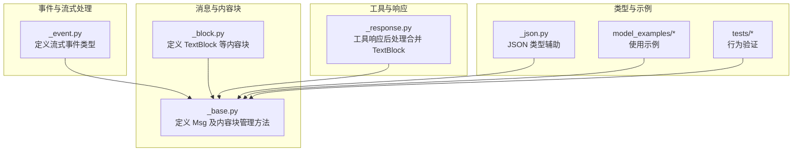
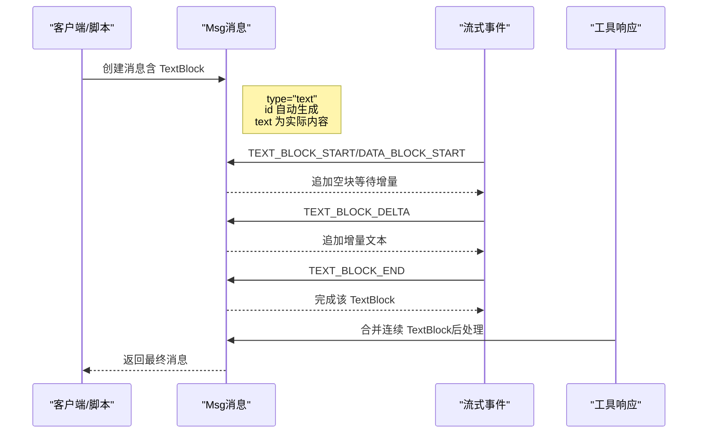
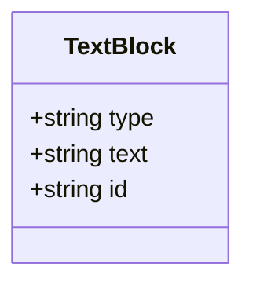
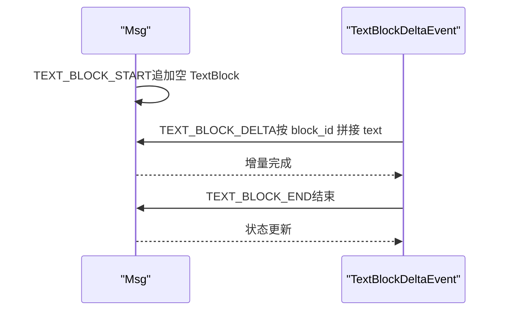
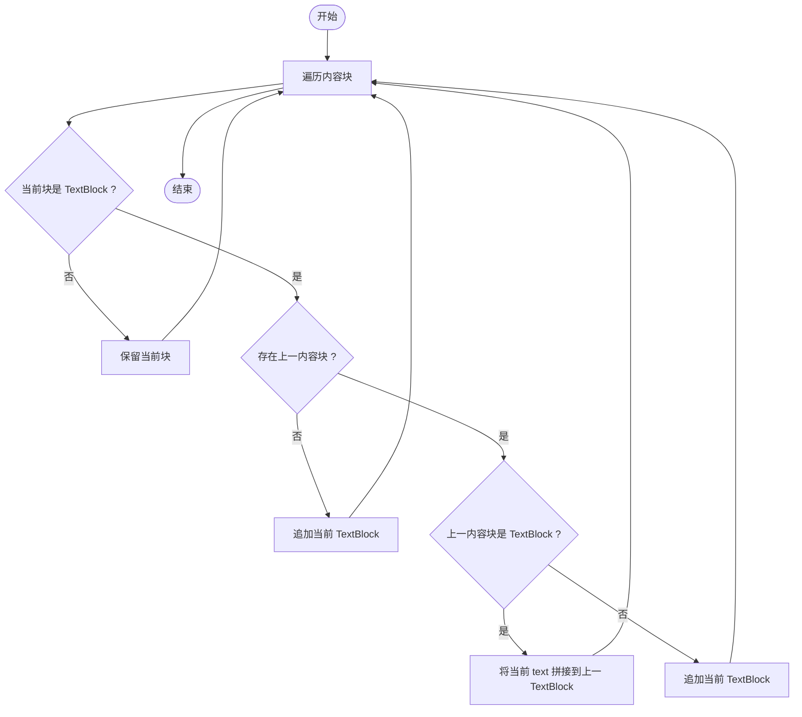
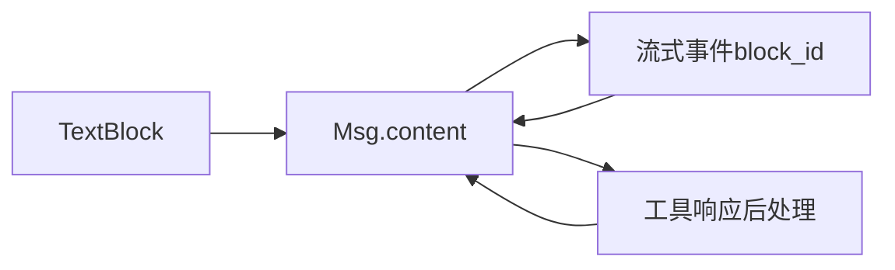

# 文本块（TextBlock）

<cite>
**本文引用的文件**
- [src/agentscope/message/_block.py](file://src/agentscope/message/_block.py)
- [src/agentscope/message/_base.py](file://src/agentscope/message/_base.py)
- [src/agentscope/event/_event.py](file://src/agentscope/event/_event.py)
- [src/agentscope/tool/_response.py](file://src/agentscope/tool/_response.py)
- [src/agentscope/types/_json.py](file://src/agentscope/types/_json.py)
- [scripts/model_examples/anthropic_call.py](file://scripts/model_examples/anthropic_call.py)
- [tests/event_to_message_test.py](file://tests/event_to_message_test.py)
- [tests/toolkit_test.py](file://tests/toolkit_test.py)
</cite>

## 目录
1. [简介](#简介)
2. [项目结构](#项目结构)
3. [核心组件](#核心组件)
4. [架构总览](#架构总览)
5. [详细组件分析](#详细组件分析)
6. [依赖关系分析](#依赖关系分析)
7. [性能考量](#性能考量)
8. [故障排查指南](#故障排查指南)
9. [结论](#结论)
10. [附录](#附录)

## 简介
TextBlock 是 AgentScope 中最基础的内容块类型，专门用于承载纯文本内容。它通过严格的字段约束与类型标注确保在消息传递、流式渲染、工具调用结果拼接等场景下的一致性与可解析性。本文将系统阐述 TextBlock 的设计理念、数据结构、生成与使用方式、与其他内容块类型的差异与组合使用场景，并提供创建与使用的参考路径。

## 项目结构
围绕 TextBlock 的相关代码主要分布在以下模块：
- 消息内容块定义：message/_block.py
- 消息类与内容块管理：message/_base.py
- 流式事件模型：event/_event.py
- 工具响应后处理（合并 TextBlock）：tool/_response.py
- JSON 类型辅助：types/_json.py
- 使用示例与测试：scripts/model_examples/* 与 tests/*

图表来源
- [src/agentscope/message/_block.py:11-19](file://src/agentscope/message/_block.py#L11-L19)
- [src/agentscope/message/_base.py:65-85](file://src/agentscope/message/_base.py#L65-L85)
- [src/agentscope/event/_event.py:14-51](file://src/agentscope/event/_event.py#L14-L51)
- [src/agentscope/tool/_response.py:124-144](file://src/agentscope/tool/_response.py#L124-L144)
- [src/agentscope/types/_json.py:1-15](file://src/agentscope/types/_json.py#L1-L15)

章节来源
- [src/agentscope/message/_block.py:11-19](file://src/agentscope/message/_block.py#L11-L19)
- [src/agentscope/message/_base.py:65-85](file://src/agentscope/message/_base.py#L65-L85)

## 核心组件
- TextBlock：承载纯文本内容的数据结构，包含 type、text、id 字段，其中 type 固定为 "text"，id 自动生成，text 存储实际文本。
- Msg：消息容器，content 为 ContentBlock 列表，支持按类型筛选、提取文本内容等操作。
- 流式事件：TextBlockStartEvent、TextBlockDeltaEvent、TextBlockEndEvent，驱动 Msg 在流式场景下的增量更新。
- 工具响应后处理：自动合并连续的 TextBlock，提升输出可读性。

章节来源
- [src/agentscope/message/_block.py:11-19](file://src/agentscope/message/_block.py#L11-L19)
- [src/agentscope/message/_base.py:65-85](file://src/agentscope/message/_base.py#L65-L85)
- [src/agentscope/event/_event.py:114-147](file://src/agentscope/event/_event.py#L114-L147)
- [src/agentscope/tool/_response.py:124-144](file://src/agentscope/tool/_response.py#L124-L144)

## 架构总览
TextBlock 作为最小语义单元，贯穿消息构建、流式渲染与工具结果拼接的全链路。下图展示了从事件到消息再到工具响应的典型流程。

图表来源
- [src/agentscope/message/_base.py:251-266](file://src/agentscope/message/_base.py#L251-L266)
- [src/agentscope/event/_event.py:114-147](file://src/agentscope/event/_event.py#L114-L147)
- [src/agentscope/tool/_response.py:124-144](file://src/agentscope/tool/_response.py#L124-L144)

## 详细组件分析

### 数据结构与字段语义
- type：字面量 "text"，用于区分内容块类型。
- text：字符串，承载实际文本内容。
- id：字符串，唯一标识符，未显式传入时由默认工厂函数生成十六进制 UUID。

图表来源
- [src/agentscope/message/_block.py:11-19](file://src/agentscope/message/_block.py#L11-L19)

章节来源
- [src/agentscope/message/_block.py:11-19](file://src/agentscope/message/_block.py#L11-L19)

### 创建与使用示例（参考路径）
- 在消息中嵌入单行或纯文本内容：参考用户消息构造与工具调用示例。
  - [scripts/model_examples/anthropic_call.py:42-48](file://scripts/model_examples/anthropic_call.py#L42-L48)
  - [scripts/model_examples/anthropic_call.py:89-95](file://scripts/model_examples/anthropic_call.py#L89-L95)
- 多行文本与复杂文本内容：参考结构化输出示例。
  - [scripts/model_examples/anthropic_call.py:165-178](file://scripts/model_examples/anthropic_call.py#L165-L178)

章节来源
- [scripts/model_examples/anthropic_call.py:42-48](file://scripts/model_examples/anthropic_call.py#L42-L48)
- [scripts/model_examples/anthropic_call.py:89-95](file://scripts/model_examples/anthropic_call.py#L89-L95)
- [scripts/model_examples/anthropic_call.py:165-178](file://scripts/model_examples/anthropic_call.py#L165-L178)

### 流式处理与增量更新
- 事件驱动的消息增量更新：Msg 支持根据事件类型追加或拼接 TextBlock 内容。
- 典型事件序列：TEXT_BLOCK_START → TEXT_BLOCK_DELTA* → TEXT_BLOCK_END。
- 查找与更新逻辑：基于 block_id 精准定位目标块进行增量拼接。

图表来源
- [src/agentscope/message/_base.py:251-266](file://src/agentscope/message/_base.py#L251-L266)
- [src/agentscope/event/_event.py:114-147](file://src/agentscope/event/_event.py#L114-L147)

章节来源
- [src/agentscope/message/_base.py:251-266](file://src/agentscope/message/_base.py#L251-L266)
- [src/agentscope/event/_event.py:114-147](file://src/agentscope/event/_event.py#L114-L147)

### 工具结果中的 TextBlock 合并
- 后处理阶段自动合并连续的 TextBlock，避免碎片化输出。
- 合并策略：若相邻两块均为 TextBlock，则将后一块文本拼接到前一块；否则保持分隔。

图表来源
- [src/agentscope/tool/_response.py:124-144](file://src/agentscope/tool/_response.py#L124-L144)

章节来源
- [src/agentscope/tool/_response.py:124-144](file://src/agentscope/tool/_response.py#L124-L144)

### 文本提取与过滤
- 提取全部文本：Msg 提供 get_text_content 方法，按顺序拼接所有 TextBlock 的 text。
- 按类型筛选：get_content_blocks 支持仅返回 TextBlock 列表，便于下游格式化或处理。

章节来源
- [src/agentscope/message/_base.py:122-125](file://src/agentscope/message/_base.py#L122-L125)
- [src/agentscope/message/_base.py:176-197](file://src/agentscope/message/_base.py#L176-L197)

### 特殊字符与编码注意事项
- TextBlock 的 text 字段为普通字符串，建议在上游统一编码（如 UTF-8），并在下游序列化时遵循标准 JSON 编码规则。
- JSON 序列化类型范围：字符串、数字、布尔、null、数组、对象，确保与标准兼容。

章节来源
- [src/agentscope/types/_json.py:5-14](file://src/agentscope/types/_json.py#L5-L14)

### 与其他内容块类型的区别与组合
- 与 ThinkingBlock/HintBlock 的区别：前者仅承载推理过程或提示信息，后者承载纯文本；二者均属于 ContentBlock，但用途不同。
- 与 DataBlock 的区别：DataBlock 承载二进制数据（Base64 或 URL），而 TextBlock 承载纯文本。
- 与 ToolCallBlock/ToolResultBlock 的区别：前者描述工具调用意图与参数，后者承载工具执行结果；它们与 TextBlock 可在同一消息中混合使用。
- 组合使用场景：在一次消息中同时包含多段文本、图片、工具调用与结果，形成“多模态+工具”的复合消息。

章节来源
- [src/agentscope/message/_block.py:22-51](file://src/agentscope/message/_block.py#L22-L51)
- [src/agentscope/message/_block.py:81-93](file://src/agentscope/message/_block.py#L81-L93)
- [src/agentscope/message/_block.py:105-178](file://src/agentscope/message/_block.py#L105-L178)

## 依赖关系分析
- TextBlock 依赖于 Pydantic 的 BaseModel 与 Field，保证字段校验与序列化一致性。
- Msg 对 ContentBlock 的统一管理，使 TextBlock 能与其它块类型协同工作。
- 流式事件通过 block_id 将增量内容映射到具体块，确保并发与乱序场景下的正确拼接。
- 工具响应后处理依赖 ContentBlock 的类型判断，确保仅对 TextBlock 进行合并。

图表来源
- [src/agentscope/message/_block.py:11-19](file://src/agentscope/message/_block.py#L11-L19)
- [src/agentscope/message/_base.py:65-85](file://src/agentscope/message/_base.py#L65-L85)
- [src/agentscope/event/_event.py:114-147](file://src/agentscope/event/_event.py#L114-L147)
- [src/agentscope/tool/_response.py:124-144](file://src/agentscope/tool/_response.py#L124-L144)

章节来源
- [src/agentscope/message/_block.py:11-19](file://src/agentscope/message/_block.py#L11-L19)
- [src/agentscope/message/_base.py:65-85](file://src/agentscope/message/_base.py#L65-L85)
- [src/agentscope/event/_event.py:114-147](file://src/agentscope/event/_event.py#L114-L147)
- [src/agentscope/tool/_response.py:124-144](file://src/agentscope/tool/_response.py#L124-L144)

## 性能考量
- 文本拼接：在流式场景中频繁拼接字符串可能带来额外开销，建议在事件粒度合理控制增量大小。
- 合并策略：工具响应后处理仅对连续 TextBlock 合并，避免不必要的遍历成本。
- 序列化：TextBlock 为简单结构体，序列化开销较低；在高吞吐场景中建议批量处理消息以减少序列化次数。

## 故障排查指南
- 文本缺失或错位：检查事件是否按 START → DELTA* → END 的顺序到达，且 block_id 一致。
  - 参考：[src/agentscope/message/_base.py:251-266](file://src/agentscope/message/_base.py#L251-L266)
- 文本块未找到：当事件的目标块不存在时，消息会记录警告并跳过更新。
  - 参考：[src/agentscope/message/_base.py:254-262](file://src/agentscope/message/_base.py#L254-L262)
- 工具结果碎片化：确认后处理是否启用，以及是否存在非连续的 TextBlock。
  - 参考：[src/agentscope/tool/_response.py:124-144](file://src/agentscope/tool/_response.py#L124-L144)
- 行为验证示例：可参考测试用例对 TextBlock 流式行为与合并逻辑的断言。
  - 参考：[tests/event_to_message_test.py:192-426](file://tests/event_to_message_test.py#L192-L426)
  - 参考：[tests/toolkit_test.py:266-314](file://tests/toolkit_test.py#L266-L314)

章节来源
- [src/agentscope/message/_base.py:251-266](file://src/agentscope/message/_base.py#L251-L266)
- [src/agentscope/tool/_response.py:124-144](file://src/agentscope/tool/_response.py#L124-L144)
- [tests/event_to_message_test.py:192-426](file://tests/event_to_message_test.py#L192-L426)
- [tests/toolkit_test.py:266-314](file://tests/toolkit_test.py#L266-L314)

## 结论
TextBlock 以简洁稳定的结构承担纯文本承载职责，在消息构建、流式渲染与工具结果拼接中发挥关键作用。通过明确的字段语义、事件驱动的增量更新与后处理合并策略，TextBlock 与其他内容块类型协同，支撑起 AgentScope 的多模态与工具调用能力。在实际使用中，建议关注事件顺序、block_id 一致性与编码规范，以获得稳定可靠的文本输出。

## 附录
- 快速参考路径
  - 创建与使用：[scripts/model_examples/anthropic_call.py:42-48](file://scripts/model_examples/anthropic_call.py#L42-L48)
  - 多行文本示例：[scripts/model_examples/anthropic_call.py:165-178](file://scripts/model_examples/anthropic_call.py#L165-L178)
  - 流式行为验证：[tests/event_to_message_test.py:192-426](file://tests/event_to_message_test.py#L192-L426)
  - 合并策略验证：[tests/toolkit_test.py:266-314](file://tests/toolkit_test.py#L266-L314)