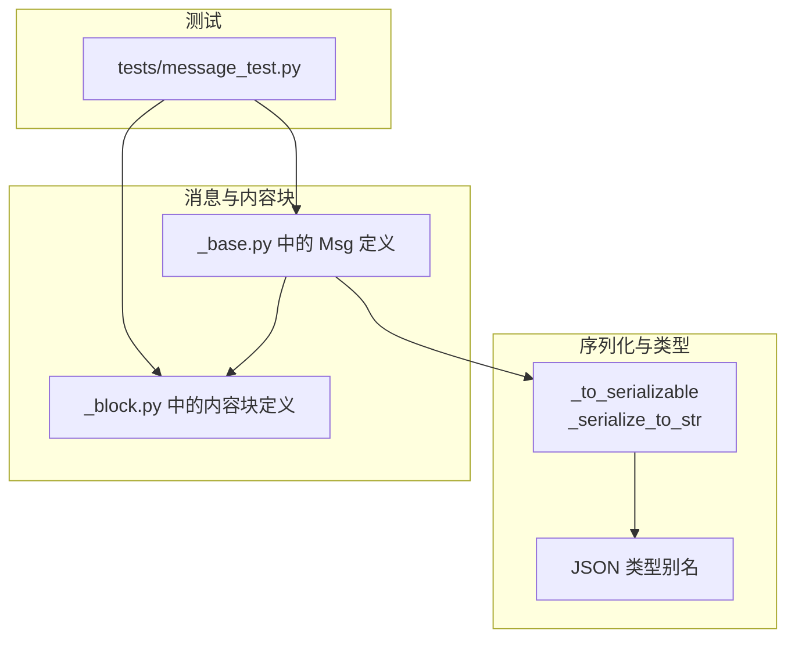
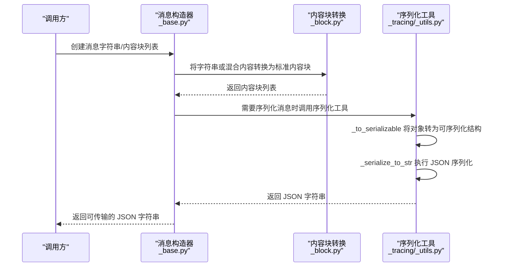
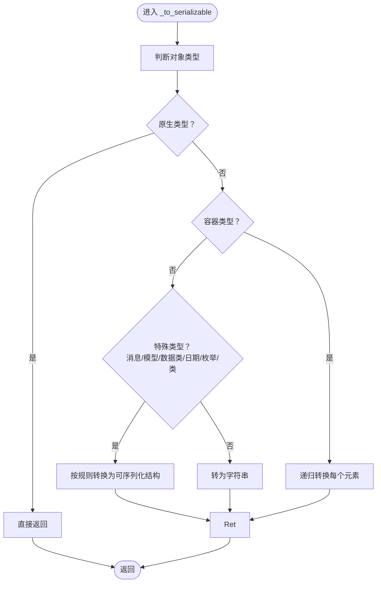
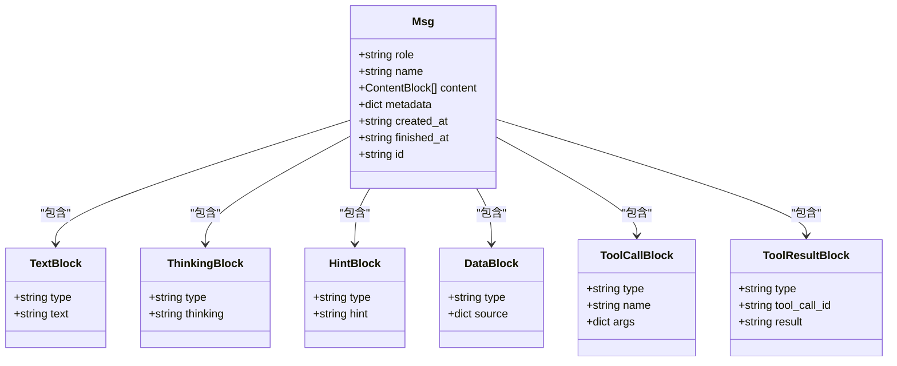
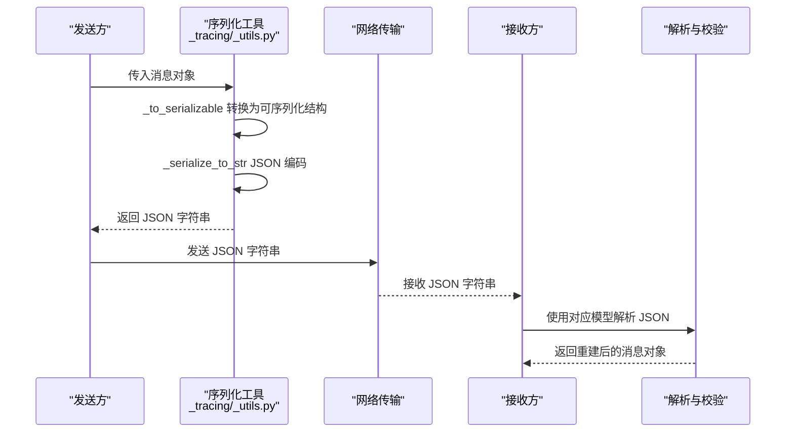
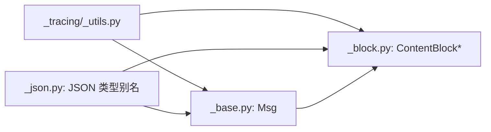

# 序列化与反序列化

<cite>
**本文引用的文件**
- [src/agentscope/middleware/_tracing/_utils.py](file://src/agentscope/middleware/_tracing/_utils.py)
- [src/agentscope/types/_json.py](file://src/agentscope/types/_json.py)
- [src/agentscope/message/_base.py](file://src/agentscope/message/_base.py)
- [src/agentscope/message/_block.py](file://src/agentscope/message/_block.py)
- [tests/message_test.py](file://tests/message_test.py)
</cite>

## 目录
1. [引言](#引言)
2. [项目结构](#项目结构)
3. [核心组件](#核心组件)
4. [架构总览](#架构总览)
5. [详细组件分析](#详细组件分析)
6. [依赖关系分析](#依赖关系分析)
7. [性能考量](#性能考量)
8. [故障排查指南](#故障排查指南)
9. [结论](#结论)
10. [附录](#附录)

## 引言
本文件聚焦于 AgentScope 的消息与内容块（Content Block）的 JSON 序列化与反序列化机制，系统性阐述以下主题：
- 如何将复杂 Python 对象（如消息、内容块、时间类型、枚举、Pydantic 模型、数据类等）转换为可网络传输的 JSON 字符串；
- 反序列化与类型验证策略，确保接收端能正确重建原始对象；
- 在消息在网络传输中的完整流程中，序列化与反序列化的触发点与调用链；
- 性能优化建议与兼容性注意事项。

## 项目结构
围绕消息与序列化的核心文件分布如下：
- 中间件追踪工具：提供通用的对象到 JSON 可序列化对象的转换函数，以及最终的字符串序列化封装；
- 类型定义：对 JSON 原生类型与递归 JSON 可序列化对象进行类型别名定义；
- 消息模型与内容块：定义消息与内容块的数据结构，并在消息构造时进行内容块转换；
- 测试：覆盖消息序列化与内容块行为的单元测试。

**图表来源**
- [src/agentscope/middleware/_tracing/_utils.py:15-78](file://src/agentscope/middleware/_tracing/_utils.py#L15-L78)
- [src/agentscope/types/_json.py:1-14](file://src/agentscope/types/_json.py#L1-L14)
- [src/agentscope/message/_base.py:64-573](file://src/agentscope/message/_base.py#L64-L573)
- [src/agentscope/message/_block.py:10-161](file://src/agentscope/message/_block.py#L10-L161)
- [tests/message_test.py](file://tests/message_test.py)

**章节来源**
- [src/agentscope/middleware/_tracing/_utils.py:15-78](file://src/agentscope/middleware/_tracing/_utils.py#L15-L78)
- [src/agentscope/types/_json.py:1-14](file://src/agentscope/types/_json.py#L1-L14)
- [src/agentscope/message/_base.py:64-573](file://src/agentscope/message/_base.py#L64-L573)
- [src/agentscope/message/_block.py:10-161](file://src/agentscope/message/_block.py#L10-L161)
- [tests/message_test.py](file://tests/message_test.py)

## 核心组件
- 通用序列化工具
  - 将任意对象安全地转换为 JSON 可序列化结构（字符串、数字、布尔、None、列表、字典），并支持日期时间、枚举、Pydantic 模型、数据类等类型；
  - 提供最终的字符串序列化封装，包含回退逻辑以保证可序列化。
- JSON 类型别名
  - 明确定义 JSON 原生类型与递归 JSON 可序列化对象，便于静态类型检查与接口契约约束。
- 消息与内容块
  - 消息对象内部维护内容块列表，构造时会将字符串或混合内容转换为标准内容块；
  - 内容块涵盖文本、思考、提示、数据、工具调用与结果等类型，均基于 Pydantic 模型实现，天然具备序列化能力。

**章节来源**
- [src/agentscope/middleware/_tracing/_utils.py:15-78](file://src/agentscope/middleware/_tracing/_utils.py#L15-L78)
- [src/agentscope/types/_json.py:1-14](file://src/agentscope/types/_json.py#L1-L14)
- [src/agentscope/message/_base.py:64-573](file://src/agentscope/message/_base.py#L64-L573)
- [src/agentscope/message/_block.py:10-161](file://src/agentscope/message/_block.py#L10-L161)

## 架构总览
下图展示了消息与内容块从构造到序列化的整体流程，以及序列化工具在其中的作用位置。

**图表来源**
- [src/agentscope/message/_base.py:432-573](file://src/agentscope/message/_base.py#L432-L573)
- [src/agentscope/message/_block.py:10-161](file://src/agentscope/message/_block.py#L10-L161)
- [src/agentscope/middleware/_tracing/_utils.py:15-78](file://src/agentscope/middleware/_tracing/_utils.py#L15-L78)

## 详细组件分析

### 通用序列化工具：_to_serializable 与 _serialize_to_str
- 职责
  - 将任意 Python 对象转换为 JSON 可序列化结构（字符串、数字、布尔、None、列表、字典）；
  - 对日期时间、枚举、Pydantic 模型、数据类、类本身（Pydantic 子类）等进行特殊处理；
  - 最终通过 JSON 编码生成字符串，若直接编码失败则先进行对象到可序列化结构的转换再编码。
- 关键处理分支
  - 原生类型：直接返回；
  - 容器类型：递归转换元素；
  - 字典：键转为字符串，值递归转换；
  - 消息、Pydantic 模型、数据类：使用字符串表示；
  - 日期/时间/时长：分别转为 ISO 字符串或秒数；
  - 枚举：递归转换其底层值；
  - 其他：统一转为字符串。
- 错误处理
  - 当 JSON 编码抛出类型错误时，先执行对象到可序列化结构的转换，再进行编码，确保兼容性。

**图表来源**
- [src/agentscope/middleware/_tracing/_utils.py:15-78](file://src/agentscope/middleware/_tracing/_utils.py#L15-L78)

**章节来源**
- [src/agentscope/middleware/_tracing/_utils.py:15-78](file://src/agentscope/middleware/_tracing/_utils.py#L15-L78)

### JSON 类型别名：JSONPrimitive 与 JSONSerializableObject
- 作用
  - 明确定义 JSON 原生类型与递归 JSON 可序列化对象，便于在类型注解中表达“仅包含 JSON 可序列化字段”的结构；
  - 有助于静态类型检查与接口契约约束，减少运行时序列化错误。
- 使用场景
  - 在消息元数据、内容块元信息等字段上，确保只包含可 JSON 序列化的数据。

**章节来源**
- [src/agentscope/types/_json.py:1-14](file://src/agentscope/types/_json.py#L1-L14)

### 消息与内容块：Msg 与 ContentBlock
- 消息（Msg）
  - 角色（role）、名称（name）、内容（content，列表，元素为内容块）、元数据（metadata，字典）、时间戳（created_at/finished_at）、唯一标识（id）等；
  - 提供便捷构造器：用户消息、助手消息、系统消息，自动填充时间戳与 ID，并将字符串内容转换为内容块。
- 内容块（ContentBlock）
  - 文本块（TextBlock）、思考块（ThinkingBlock）、提示块（HintBlock）、数据块（DataBlock）、工具调用块（ToolCallBlock）、工具结果块（ToolResultBlock）等；
  - 均基于 Pydantic 模型，具备良好的序列化与校验能力。

**图表来源**
- [src/agentscope/message/_base.py:64-573](file://src/agentscope/message/_base.py#L64-L573)
- [src/agentscope/message/_block.py:10-161](file://src/agentscope/message/_block.py#L10-L161)

**章节来源**
- [src/agentscope/message/_base.py:64-573](file://src/agentscope/message/_base.py#L64-L573)
- [src/agentscope/message/_block.py:10-161](file://src/agentscope/message/_block.py#L10-L161)

### 序列化与反序列化流程（消息在网络传输中的完整过程）
- 序列化
  - 在需要发送消息时，调用序列化工具将消息对象转换为 JSON 字符串；
  - 工具会优先尝试直接 JSON 编码；若失败，则先将对象转换为可序列化结构，再进行编码。
- 反序列化与类型验证
  - 接收端应根据消息角色与内容块类型，使用对应的数据模型进行解析与校验；
  - 对时间戳、枚举、UUID 等字段进行类型转换与合法性检查，确保重建对象与原始一致。

**图表来源**
- [src/agentscope/middleware/_tracing/_utils.py:15-78](file://src/agentscope/middleware/_tracing/_utils.py#L15-L78)
- [src/agentscope/message/_base.py:64-573](file://src/agentscope/message/_base.py#L64-L573)
- [src/agentscope/message/_block.py:10-161](file://src/agentscope/message/_block.py#L10-L161)

## 依赖关系分析
- 组件耦合
  - 消息与内容块依赖 Pydantic 模型，具备内置的序列化与校验能力；
  - 通用序列化工具独立于消息与内容块，提供跨模块的可复用序列化能力；
  - JSON 类型别名用于约束与表达可序列化结构，提升类型安全性。
- 外部依赖
  - JSON 编码库用于最终字符串输出；
  - Pydantic 与数据类用于结构化建模与序列化；
  - 时间类型与枚举用于语义化表达。

**图表来源**
- [src/agentscope/middleware/_tracing/_utils.py:15-78](file://src/agentscope/middleware/_tracing/_utils.py#L15-L78)
- [src/agentscope/types/_json.py:1-14](file://src/agentscope/types/_json.py#L1-L14)
- [src/agentscope/message/_base.py:64-573](file://src/agentscope/message/_base.py#L64-L573)
- [src/agentscope/message/_block.py:10-161](file://src/agentscope/message/_block.py#L10-L161)

**章节来源**
- [src/agentscope/middleware/_tracing/_utils.py:15-78](file://src/agentscope/middleware/_tracing/_utils.py#L15-L78)
- [src/agentscope/types/_json.py:1-14](file://src/agentscope/types/_json.py#L1-L14)
- [src/agentscope/message/_base.py:64-573](file://src/agentscope/message/_base.py#L64-L573)
- [src/agentscope/message/_block.py:10-161](file://src/agentscope/message/_block.py#L10-L161)

## 性能考量
- 递归转换成本
  - 对容器与嵌套对象进行递归转换会产生额外开销；建议在高频路径中避免不必要的深度嵌套。
- 编码回退
  - 当直接 JSON 编码失败时，先进行对象到可序列化结构的转换再编码，虽然更安全，但会增加一次遍历；可在构造阶段尽量保证对象的可序列化性以减少回退。
- 字符串化策略
  - 对于 Pydantic 模型、数据类与类本身采用字符串化，可能丢失结构细节；如需保留结构，可考虑自定义编码器或扩展序列化工具。
- 时间与枚举
  - 日期时间与枚举转换为字符串或其底层值，通常开销很小；注意在接收端进行类型还原与校验。

[本节为通用性能讨论，不直接分析具体文件]

## 故障排查指南
- 常见问题
  - 序列化失败：检查对象是否包含不可 JSON 序列化的字段（如自定义类实例、文件句柄等）；必要时在构造阶段替换为可序列化类型。
  - 时间戳不一致：确认发送端与接收端的时间格式与时区设置一致；建议统一使用 ISO 字符串。
  - 枚举值丢失：确认接收端使用相同枚举定义进行解析；若枚举值为复合类型，需在序列化时显式转换。
- 定位方法
  - 在序列化前打印对象的关键字段，确认可序列化性；
  - 在反序列化后对比字段类型与值，定位差异点；
  - 使用单元测试覆盖典型消息与内容块组合，确保序列化与反序列化一致性。

**章节来源**
- [src/agentscope/middleware/_tracing/_utils.py:15-78](file://src/agentscope/middleware/_tracing/_utils.py#L15-L78)
- [tests/message_test.py](file://tests/message_test.py)

## 结论
AgentScope 的序列化体系通过通用序列化工具与明确的 JSON 类型约束，实现了对消息与内容块的稳定序列化；结合 Pydantic 模型与数据类，既保证了结构化表达，也兼顾了可扩展性。在实际网络传输中，遵循“构造即序列化”的原则，配合严格的类型验证与回退策略，可有效提升系统的可靠性与兼容性。

[本节为总结性内容，不直接分析具体文件]

## 附录
- 实际代码示例（以路径代替代码片段）
  - 序列化工具函数
    - [通用对象到可序列化结构：_to_serializable:15-57](file://src/agentscope/middleware/_tracing/_utils.py#L15-L57)
    - [最终字符串序列化封装：_serialize_to_str:60-78](file://src/agentscope/middleware/_tracing/_utils.py#L60-L78)
  - JSON 类型别名
    - [JSONPrimitive 与 JSONSerializableObject:1-14](file://src/agentscope/types/_json.py#L1-L14)
  - 消息与内容块
    - [消息构造器与便捷工厂函数:432-573](file://src/agentscope/message/_base.py#L432-L573)
    - [内容块类型定义:10-161](file://src/agentscope/message/_block.py#L10-L161)
  - 测试参考
    - [消息序列化与内容块行为测试](file://tests/message_test.py)