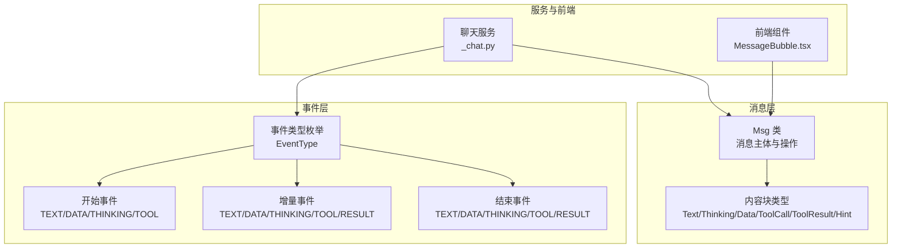
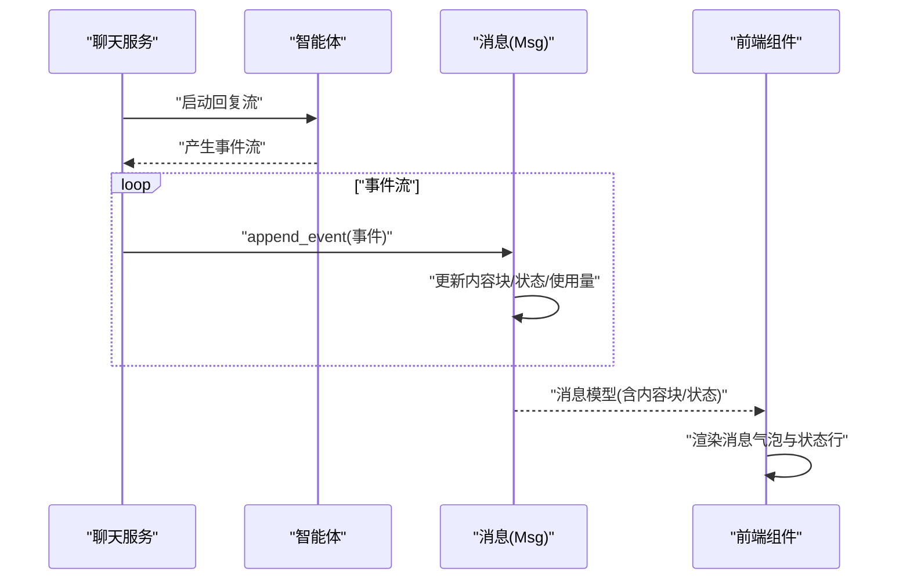
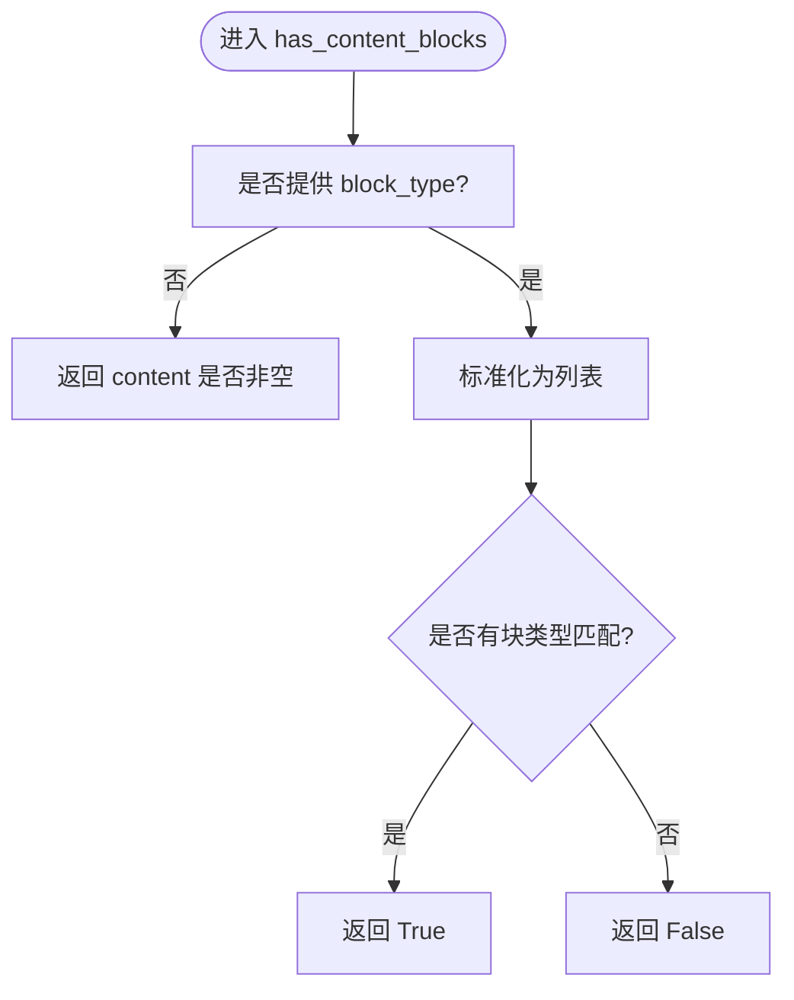
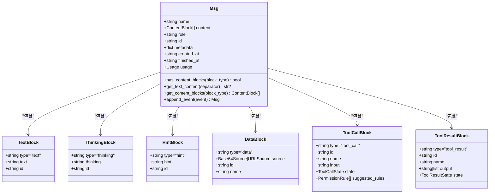
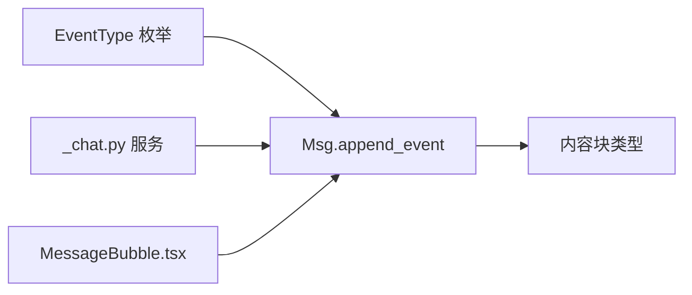

# 消息操作与处理

<cite>
**本文引用的文件**
- [消息基础实现 _base.py](file://src/agentscope/message/_base.py)
- [内容块定义 _block.py](file://src/agentscope/message/_block.py)
- [事件类型定义 _event.py](file://src/agentscope/event/_event.py)
- [消息测试用例 message_test.py](file://tests/message_test.py)
- [事件到消息转换测试 event_to_message_test.py](file://tests/event_to_message_test.py)
- [聊天服务集成 chat.py](file://src/agentscope/app/_service/_chat.py)
- [前端消息气泡组件 MessageBubble.tsx](file://examples/web_ui/frontend/src/components/chat/MessageBubble.tsx)
</cite>

## 目录
1. [简介](#简介)
2. [项目结构](#项目结构)
3. [核心组件](#核心组件)
4. [架构总览](#架构总览)
5. [详细组件分析](#详细组件分析)
6. [依赖关系分析](#依赖关系分析)
7. [性能考虑](#性能考虑)
8. [故障排查指南](#故障排查指南)
9. [结论](#结论)
10. [附录](#附录)

## 简介
本文件围绕 AgentScope 的消息操作与处理能力进行系统化说明，重点覆盖以下方面：
- 消息内容块的操作方法：has_content_blocks（检查内容块）、get_text_content（提取文本内容）、get_content_blocks（获取内容块）
- 消息的事件驱动处理机制：支持文本块、思维块、数据块、工具调用与结果的流式事件（开始/增量/结束）
- 消息的更新流程与状态变更：使用量统计、完成时间标记、工具调用状态机
- 实际代码示例路径：展示如何在智能体间传递与处理消息
- 验证机制与错误处理策略：角色与内容块合法性校验、事件匹配与容错

## 项目结构
AgentScope 的消息与事件处理主要分布在以下模块：
- 消息模型与操作：src/agentscope/message/_base.py、src/agentscope/message/_block.py
- 事件类型与序列：src/agentscope/event/_event.py
- 测试与验证：tests/message_test.py、tests/event_to_message_test.py
- 服务集成与前端展示：src/agentscope/app/_service/_chat.py、examples/web_ui/frontend/src/components/chat/MessageBubble.tsx

图表来源
- [消息基础实现 _base.py:65-574](file://src/agentscope/message/_base.py#L65-L574)
- [内容块定义 _block.py:11-197](file://src/agentscope/message/_block.py#L11-L197)
- [事件类型定义 _event.py:14-432](file://src/agentscope/event/_event.py#L14-L432)
- [聊天服务集成 chat.py:192-221](file://src/agentscope/app/_service/_chat.py#L192-L221)
- [前端消息气泡组件 MessageBubble.tsx:214-309](file://examples/web_ui/frontend/src/components/chat/MessageBubble.tsx#L214-L309)

章节来源
- [消息基础实现 _base.py:1-574](file://src/agentscope/message/_base.py#L1-L574)
- [内容块定义 _block.py:1-197](file://src/agentscope/message/_block.py#L1-L197)
- [事件类型定义 _event.py:1-432](file://src/agentscope/event/_event.py#L1-L432)
- [聊天服务集成 chat.py:192-221](file://src/agentscope/app/_service/_chat.py#L192-L221)
- [前端消息气泡组件 MessageBubble.tsx:214-309](file://examples/web_ui/frontend/src/components/chat/MessageBubble.tsx#L214-L309)

## 核心组件
- Msg：消息主体，包含名称、角色、内容块列表、元数据、时间戳、使用量等；提供 has_content_blocks、get_text_content、get_content_blocks 等操作方法，并通过 append_event 应用流式事件。
- 内容块：TextBlock、ThinkingBlock、HintBlock、DataBlock、ToolCallBlock、ToolResultBlock 等，统一通过 ContentBlock 类型别名聚合。
- 事件：EventType 枚举定义了流式事件类型，包括 TEXT_BLOCK_*、DATA_BLOCK_*、THINKING_BLOCK_*、TOOL_CALL_*、TOOL_RESULT_* 等。

章节来源
- [消息基础实现 _base.py:65-574](file://src/agentscope/message/_base.py#L65-L574)
- [内容块定义 _block.py:11-197](file://src/agentscope/message/_block.py#L11-L197)
- [事件类型定义 _event.py:14-51](file://src/agentscope/event/_event.py#L14-L51)

## 架构总览
消息与事件的交互流程如下：
- 服务端生成 AgentEvent 流（如 TEXT_BLOCK_DELTA、TOOL_CALL_START 等）
- 聊天服务将事件推送到客户端或存储中
- 客户端或后端通过 Msg.append_event 将事件逐步应用到消息对象
- 前端根据消息状态（finished_at、usage）渲染 UI

图表来源
- [聊天服务集成 chat.py:192-221](file://src/agentscope/app/_service/_chat.py#L192-L221)
- [消息基础实现 _base.py:210-428](file://src/agentscope/message/_base.py#L210-L428)
- [前端消息气泡组件 MessageBubble.tsx:214-309](file://examples/web_ui/frontend/src/components/chat/MessageBubble.tsx#L214-L309)

## 详细组件分析

### 消息类 Msg 的操作方法
- has_content_blocks：按类型检查是否存在内容块，支持单类型或多类型列表
- get_text_content：拼接所有 TextBlock 的文本内容，默认以换行符分隔
- get_content_blocks：按类型过滤返回内容块列表，支持单类型、多类型或全部

图表来源
- [消息基础实现 _base.py:98-120](file://src/agentscope/message/_base.py#L98-L120)

章节来源
- [消息基础实现 _base.py:98-197](file://src/agentscope/message/_base.py#L98-L197)

### 事件驱动的消息更新流程
- 匹配 reply_id：仅当事件的 reply_id 与消息 id 一致时才应用
- 流式事件处理：
  - 开始事件：为对应块类型追加空块
  - 增量事件：按块 id 查找并追加增量内容
  - 结束事件：通常不改变内容，但会触发状态更新
- 特殊事件：
  - REPLY_END：设置 finished_at
  - MODEL_CALL_END：初始化并累计 usage（输入/输出 token）
  - REQUIRE_USER_CONFIRM / USER_CONFIRM_RESULT：更新 ToolCallBlock 的状态与建议规则
  - REQUIRE_EXTERNAL_EXECUTION / EXTERNAL_EXECUTION_RESULT：更新外部执行状态并附加 ToolResultBlock

```mermaid
flowchart TD
Enter(["收到事件"]) --> MatchId{"reply_id 是否匹配?"}
MatchId --> |否| WarnSkip["记录警告并跳过"] --> End
MatchId --> |是| Switch["按事件类型分派"]
Switch --> ReplyEnd["REPLY_END → 设置 finished_at"]
Switch --> ModelEnd["MODEL_CALL_END → 初始化/累计 usage"]
Switch --> TextStart["TEXT_BLOCK_START → 追加空 TextBlock"]
Switch --> TextDelta["TEXT_BLOCK_DELTA → 按 id 合并增量"]
Switch --> TextEnd["TEXT_BLOCK_END → 无操作"]
Switch --> DataStart["DATA_BLOCK_START → 追加空 DataBlock"]
Switch --> DataDelta["DATA_BLOCK_DELTA → 按 id 合并增量"]
Switch --> DataEnd["DATA_BLOCK_END → 无操作"]
Switch --> ThinkStart["THINKING_BLOCK_START → 追加空 ThinkingBlock"]
Switch --> ThinkDelta["THINKING_BLOCK_DELTA → 按 id 合并增量"]
Switch --> ThinkEnd["THINKING_BLOCK_END → 无操作"]
Switch --> ToolStart["TOOL_CALL_START → 追加空 ToolCallBlock"]
Switch --> ToolDelta["TOOL_CALL_DELTA → 按 id 合并增量"]
Switch --> ToolEnd["TOOL_CALL_END → 无操作"]
Switch --> TRStart["TOOL_RESULT_START → 追加空 ToolResultBlock"]
Switch --> TRText["TOOL_RESULT_TEXT_DELTA → 追加/合并 TextBlock"]
Switch --> TRData["TOOL_RESULT_DATA_DELTA → 追加 DataBlock"]
Switch --> TREnd["TOOL_RESULT_END → 更新状态"]
Switch --> PermAsk["REQUIRE_USER_CONFIRM → 更新 ToolCallBlock 状态与建议规则"]
Switch --> PermRes["USER_CONFIRM_RESULT → 更新 ToolCallBlock 状态"]
Switch --> ExtReq["REQUIRE_EXTERNAL_EXECUTION → 标记提交状态"]
Switch --> ExtRes["EXTERNAL_EXECUTION_RESULT → 追加 ToolResultBlock"]
ReplyEnd --> End
ModelEnd --> End
TextStart --> End
TextDelta --> End
TextEnd --> End
DataStart --> End
DataDelta --> End
DataEnd --> End
ThinkStart --> End
ThinkDelta --> End
ThinkEnd --> End
ToolStart --> End
ToolDelta --> End
ToolEnd --> End
TRStart --> End
TRText --> End
TRData --> End
TREnd --> End
PermAsk --> End
PermRes --> End
ExtReq --> End
ExtRes --> End
```

图表来源
- [消息基础实现 _base.py:210-428](file://src/agentscope/message/_base.py#L210-L428)
- [事件类型定义 _event.py:14-51](file://src/agentscope/event/_event.py#L14-L51)

章节来源
- [消息基础实现 _base.py:210-428](file://src/agentscope/message/_base.py#L210-L428)
- [事件类型定义 _event.py:14-51](file://src/agentscope/event/_event.py#L14-L51)

### 内容块类型与状态
- 文本块 TextBlock：type="text"，包含 text 与 id
- 思维块 ThinkingBlock：type="thinking"，包含 thinking 与 id
- 提示块 HintBlock：type="hint"，用于向 LLM 提供提示
- 数据块 DataBlock：type="data"，包含 Base64Source 或 URLSource
- 工具调用块 ToolCallBlock：type="tool_call"，包含 id、name、input、state、suggested_rules
- 工具结果块 ToolResultBlock：type="tool_result"，包含 id、name、output（字符串或文本/数据块列表）、state

图表来源
- [消息基础实现 _base.py:65-84](file://src/agentscope/message/_base.py#L65-L84)
- [内容块定义 _block.py:11-197](file://src/agentscope/message/_block.py#L11-L197)

章节来源
- [内容块定义 _block.py:11-197](file://src/agentscope/message/_block.py#L11-L197)
- [消息基础实现 _base.py:65-84](file://src/agentscope/message/_base.py#L65-L84)

### 事件类型与流式处理
- 文本块：TEXT_BLOCK_START/DELTA/END
- 数据块：DATA_BLOCK_START/DELTA/END
- 思维块：THINKING_BLOCK_START/DELTA/END
- 工具调用：TOOL_CALL_START/DELTA/END
- 工具结果：TOOL_RESULT_START/TEXT_DELTA/DATA_DELTA/END
- 其他：REPLY_START/REPLY_END、MODEL_CALL_START/END、权限与外部执行相关事件

章节来源
- [事件类型定义 _event.py:14-51](file://src/agentscope/event/_event.py#L14-L51)
- [事件类型定义 _event.py:114-431](file://src/agentscope/event/_event.py#L114-L431)

### 使用量统计与完成时间标记
- MODEL_CALL_END 事件触发 usage 的初始化与累加（input_tokens、output_tokens）
- REPLY_END 事件触发 finished_at 的设置，表示消息生成完成

章节来源
- [消息基础实现 _base.py:238-249](file://src/agentscope/message/_base.py#L238-L249)
- [消息基础实现 _base.py:238-239](file://src/agentscope/message/_base.py#L238-L239)

### 角色与内容块验证机制
- 用户消息仅允许 text 与 data 块
- 系统消息仅允许 text 块
- 创建消息时通过模型校验器进行角色-内容一致性检查

章节来源
- [消息基础实现 _base.py:86-96](file://src/agentscope/message/_base.py#L86-L96)
- [消息测试用例 message_test.py:173-243](file://tests/message_test.py#L173-L243)

### 错误处理策略
- 事件 reply_id 不匹配：记录警告并跳过该事件
- 目标块不存在的增量事件：记录警告并跳过
- 非法角色-内容组合：抛出异常

章节来源
- [消息基础实现 _base.py:227-235](file://src/agentscope/message/_base.py#L227-L235)
- [消息基础实现 _base.py:256-260](file://src/agentscope/message/_base.py#L256-L260)
- [消息测试用例 message_test.py:173-243](file://tests/message_test.py#L173-L243)

### 实际代码示例（路径指引）
- 创建用户消息并添加文本块
  - 示例路径：[消息测试用例 message_test.py:25-47](file://tests/message_test.py#L25-L47)
- 在智能体间传递消息并应用事件
  - 示例路径：[聊天服务集成 chat.py:213-219](file://src/agentscope/app/_service/_chat.py#L213-L219)
- 前端渲染消息状态与使用量
  - 示例路径：[前端消息气泡组件 MessageBubble.tsx:231-304](file://examples/web_ui/frontend/src/components/chat/MessageBubble.tsx#L231-L304)

## 依赖关系分析
- Msg 依赖内容块类型（TextBlock、ThinkingBlock、DataBlock、ToolCallBlock、ToolResultBlock、HintBlock）
- 事件类型通过 EventType 枚举统一管理，Msg.append_event 根据事件类型分支处理
- 聊天服务在回复流中持续推送事件，Msg.append_event 逐条应用，最终持久化消息

图表来源
- [事件类型定义 _event.py:14-51](file://src/agentscope/event/_event.py#L14-L51)
- [消息基础实现 _base.py:210-428](file://src/agentscope/message/_base.py#L210-L428)
- [聊天服务集成 chat.py:192-221](file://src/agentscope/app/_service/_chat.py#L192-L221)
- [前端消息气泡组件 MessageBubble.tsx:214-309](file://examples/web_ui/frontend/src/components/chat/MessageBubble.tsx#L214-L309)

章节来源
- [事件类型定义 _event.py:14-51](file://src/agentscope/event/_event.py#L14-L51)
- [消息基础实现 _base.py:210-428](file://src/agentscope/message/_base.py#L210-L428)
- [聊天服务集成 chat.py:192-221](file://src/agentscope/app/_service/_chat.py#L192-L221)

## 性能考虑
- 事件应用采用按块 id 查找的方式，建议在高并发场景下确保块 id 唯一且稳定
- 累计使用量（usage）在 MODEL_CALL_END 事件中进行累加，避免重复计算
- 前端渲染基于消息模型的 finished_at 与 usage 字段，减少重复计算

## 故障排查指南
- 事件未生效：确认事件 reply_id 与消息 id 是否一致
  - 参考路径：[消息基础实现 _base.py:227-235](file://src/agentscope/message/_base.py#L227-L235)
- 增量事件导致内容缺失：目标块可能尚未开始或已结束，检查对应 START/END 事件顺序
  - 参考路径：[事件到消息转换测试 event_to_message_test.py:833-905](file://tests/event_to_message_test.py#L833-L905)
- 角色-内容不合法：检查消息角色与内容块类型组合是否符合约束
  - 参考路径：[消息测试用例 message_test.py:173-243](file://tests/message_test.py#L173-L243)

章节来源
- [消息基础实现 _base.py:227-235](file://src/agentscope/message/_base.py#L227-L235)
- [事件到消息转换测试 event_to_message_test.py:833-905](file://tests/event_to_message_test.py#L833-L905)
- [消息测试用例 message_test.py:173-243](file://tests/message_test.py#L173-L243)

## 结论
AgentScope 的消息系统通过 Msg 类与内容块类型抽象，结合 EventType 枚举与事件驱动的流式处理，实现了对多模态内容与工具调用的完整生命周期管理。其验证机制与错误处理策略保证了消息在不同角色与内容组合下的正确性，同时通过使用量统计与完成时间标记为上层应用提供了关键的状态信息。

## 附录
- 事件到消息的顺序验证与边界条件测试
  - 参考路径：[事件到消息转换测试 event_to_message_test.py:192-274](file://tests/event_to_message_test.py#L192-L274)
  - 参考路径：[事件到消息转换测试 event_to_message_test.py:833-905](file://tests/event_to_message_test.py#L833-L905)