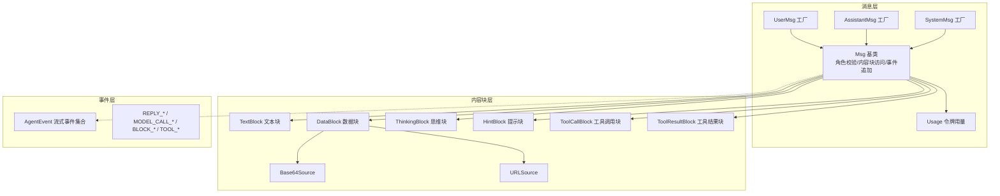
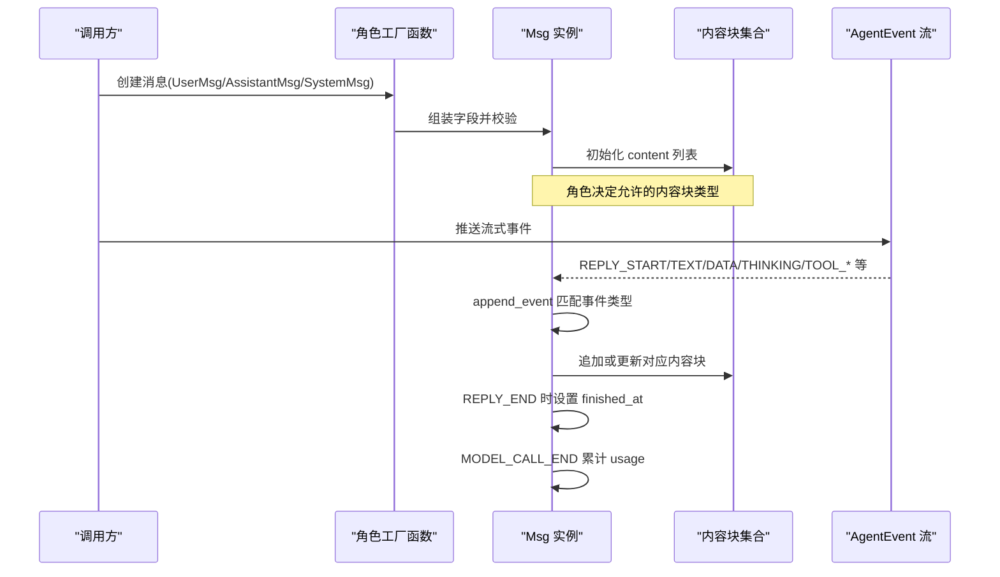
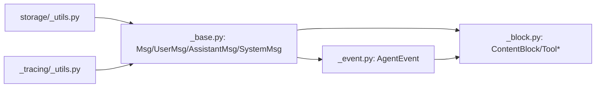

# 消息类型与角色

<cite>
**本文引用的文件**
- [消息模块入口](file://src/agentscope/message/__init__.py)
- [消息基础类与角色工厂函数](file://src/agentscope/message/_base.py)
- [内容块与工具调用类型定义](file://src/agentscope/message/_block.py)
- [消息单元测试](file://tests/message_test.py)
- [事件类型与事件模型](file://src/agentscope/event/_event.py)
- [序列化工具（追踪中间件）](file://src/agentscope/middleware/_tracing/_utils.py)
- [存储工具（含敏感字段处理）](file://src/agentscope/app/storage/_utils.py)
- [示例：Agent 使用消息](file://src/agentscope/agent/_agent.py)
</cite>

## 目录
1. [引言](#引言)
2. [项目结构](#项目结构)
3. [核心组件](#核心组件)
4. [架构总览](#架构总览)
5. [详细组件分析](#详细组件分析)
6. [依赖关系分析](#依赖关系分析)
7. [性能考量](#性能考量)
8. [故障排查指南](#故障排查指南)
9. [结论](#结论)
10. [附录](#附录)

## 引言
本文件面向AgentScope的消息类型系统，系统性阐述Msg基础类的设计理念、核心属性与职责边界；详解三种基本消息角色（UserMsg、AssistantMsg、SystemMsg）的差异与适用场景；明确各类消息的验证规则与限制条件；给出常见消息创建与复杂内容块组合的实践路径；并说明消息的序列化机制与元数据管理方式。

## 项目结构
消息系统主要由以下模块组成：
- 消息模块入口：导出消息与内容块相关类型与工厂函数
- 基础消息类与角色工厂：定义Msg与UserMsg/AssistantMsg/SystemMsg
- 内容块与工具调用类型：定义TextBlock、DataBlock、ThinkingBlock、HintBlock、ToolCallBlock、ToolResultBlock及其来源类型
- 事件系统：定义流式事件，驱动消息的增量更新与令牌用量统计
- 序列化与存储工具：提供对象到可序列化结构的转换与安全存储策略

图表来源
- [消息模块入口:1-40](file://src/agentscope/message/__init__.py#L1-L40)
- [消息基础类与角色工厂函数:65-574](file://src/agentscope/message/_base.py#L65-L574)
- [内容块与工具调用类型定义:1-197](file://src/agentscope/message/_block.py#L1-L197)
- [事件类型与事件模型:1-432](file://src/agentscope/event/_event.py#L1-L432)

章节来源
- [消息模块入口:1-40](file://src/agentscope/message/__init__.py#L1-L40)
- [消息基础类与角色工厂函数:65-574](file://src/agentscope/message/_base.py#L65-L574)
- [内容块与工具调用类型定义:1-197](file://src/agentscope/message/_block.py#L1-L197)
- [事件类型与事件模型:1-432](file://src/agentscope/event/_event.py#L1-L432)

## 核心组件
- Msg基础类：统一承载消息的发送者名称、内容块列表、角色、唯一ID、元数据、时间戳、令牌用量，并在构造时按角色进行内容块合法性校验。
- 角色工厂函数：UserMsg、AssistantMsg、SystemMsg，分别封装不同角色的默认行为与约束。
- 内容块体系：TextBlock、DataBlock（支持Base64Source与URLSource）、ThinkingBlock、HintBlock、ToolCallBlock、ToolResultBlock。
- Usage：记录输入/输出令牌用量，支持累计更新。
- 事件驱动更新：Msg通过append_event接收流式事件，动态拼接内容块、标记完成时间、累计令牌用量。

章节来源
- [消息基础类与角色工厂函数:65-574](file://src/agentscope/message/_base.py#L65-L574)
- [内容块与工具调用类型定义:1-197](file://src/agentscope/message/_block.py#L1-L197)

## 架构总览
消息系统围绕“消息-内容块-事件”三者协作展开：
- 消息（Msg）持有内容块列表，负责角色校验与内容块检索
- 内容块（ContentBlock）描述具体信息载体（文本、数据、思维、提示、工具调用、工具结果）
- 事件（AgentEvent）驱动消息的增量构建与状态变更（如文本增量、数据增量、工具调用/结果状态）

图表来源
- [消息基础类与角色工厂函数:431-574](file://src/agentscope/message/_base.py#L431-L574)
- [事件类型与事件模型:1-432](file://src/agentscope/event/_event.py#L1-L432)

## 详细组件分析

### Msg 基类与核心属性
- 名称（name）：发送者标识
- 内容（content）：内容块列表，类型为ContentBlock
- 角色（role）：限定为"user"、"assistant"、"system"
- ID（id）：消息唯一标识，默认UUID十六进制
- 元数据（metadata）：任意键值对，用于携带上下文或控制信息
- 创建时间（created_at）：ISO格式时间戳
- 完成时间（finished_at）：流式结束时填充
- 令牌用量（usage）：Usage对象，累计输入/输出令牌

角色校验逻辑：
- 用户消息仅允许文本块与数据块
- 系统消息仅允许文本块
- 助手消息允许所有内容块类型

内容块访问与检索：
- has_content_blocks：按类型判断是否存在内容块
- get_text_content：拼接所有文本块内容
- get_content_blocks：按类型过滤返回内容块列表

事件驱动更新：
- append_event根据事件类型追加/更新内容块，设置完成时间与累计令牌用量

章节来源
- [消息基础类与角色工厂函数:65-574](file://src/agentscope/message/_base.py#L65-L574)

### 角色工厂函数：UserMsg、AssistantMsg、SystemMsg
- UserMsg
  - 用途：用户输入消息，支持纯文本或文本+数据混合
  - 默认行为：created_at与finished_at相同，便于单轮对话
  - 验证：仅允许文本块与数据块
- AssistantMsg
  - 用途：模型/代理回复消息，支持文本、思维、提示、工具调用、工具结果、数据
  - 可选参数：usage用于记录令牌用量
  - 验证：不限制内容块类型
- SystemMsg
  - 用途：系统提示或上下文注入
  - 验证：仅允许文本块
  - 默认行为：created_at与finished_at相同

章节来源
- [消息基础类与角色工厂函数:431-574](file://src/agentscope/message/_base.py#L431-L574)

### 内容块与工具调用类型
- 文本块（TextBlock）：type="text"，包含文本内容与唯一ID
- 数据块（DataBlock）：type="data"，包含Base64Source或URLSource，支持媒体类型
- 思维块（ThinkingBlock）：type="thinking"，用于内部推理过程
- 提示块（HintBlock）：type="hint"，用于向LLM提供指令或提示
- 工具调用块（ToolCallBlock）：type="tool_call"，记录调用名、累积输入、状态机
- 工具结果块（ToolResultBlock）：type="tool_result"，记录输出与执行状态
- 工具调用状态（ToolCallState）：pending/asking/allowed/submitted/finished
- 工具结果状态（ToolResultState）：success/error/interrupted/denied/running

章节来源
- [内容块与工具调用类型定义:1-197](file://src/agentscope/message/_block.py#L1-L197)

### 验证规则与限制条件
- 用户消息（role=user）
  - 仅允许：TextBlock、DataBlock
  - 否则抛出异常
- 系统消息（role=system）
  - 仅允许：TextBlock
  - 否则抛出异常
- 助手消息（role=assistant）
  - 无内容块类型限制
- 辅助断言函数
  - _assert_user_content_blocks：校验用户消息内容块类型
  - _assert_system_content_blocks：校验系统消息内容块类型

章节来源
- [消息基础类与角色工厂函数:31-47](file://src/agentscope/message/_base.py#L31-L47)
- [消息基础类与角色工厂函数:86-96](file://src/agentscope/message/_base.py#L86-L96)
- [消息单元测试:173-267](file://tests/message_test.py#L173-L267)

### 消息创建与使用示例（路径指引）
- 简单字符串消息
  - 用户消息：参考 [UserMsg 工厂:431-476](file://src/agentscope/message/_base.py#L431-L476)
  - 助手消息：参考 [AssistantMsg 工厂:479-525](file://src/agentscope/message/_base.py#L479-L525)
  - 系统消息：参考 [SystemMsg 工厂:528-573](file://src/agentscope/message/_base.py#L528-L573)
- 复杂内容块消息
  - 文本块列表：参考 [测试用例（用户消息）:49-69](file://tests/message_test.py#L49-L69)
  - 文本+数据块混合：参考 [测试用例（用户消息）:71-125](file://tests/message_test.py#L71-L125)
  - 思维块/提示块：参考 [测试用例（助手消息）:127-171](file://tests/message_test.py#L127-L171)
- 在代理中使用
  - 系统消息与用户消息组合：参考 [Agent 示例:377-392](file://src/agentscope/agent/_agent.py#L377-L392)

章节来源
- [消息基础类与角色工厂函数:431-573](file://src/agentscope/message/_base.py#L431-L573)
- [消息单元测试:25-171](file://tests/message_test.py#L25-L171)
- [示例：Agent 使用消息:377-392](file://src/agentscope/agent/_agent.py#L377-L392)

### 序列化机制与元数据管理
- 模型序列化
  - 使用Pydantic的model_dump(mode="json")将消息转为字典，自动处理UUID、datetime等非JSON原生类型
  - 存储工具会将SecretStr字段还原为明文值以便持久化（注意安全）
- 事件到消息的增量序列化
  - 事件模型（EventBase）同样基于Pydantic，具备统一的时间戳与ID生成
- 追踪中间件序列化
  - 将Msg/BaseModel等对象转换为可JSON化的结构，必要时回退为字符串表示

章节来源
- [存储工具（含敏感字段处理）:7-29](file://src/agentscope/app/storage/_utils.py#L7-L29)
- [事件类型与事件模型:53-62](file://src/agentscope/event/_event.py#L53-L62)
- [序列化工具（追踪中间件）:15-78](file://src/agentscope/middleware/_tracing/_utils.py#L15-L78)

## 依赖关系分析
- 消息模块导出
  - 入口文件集中导出Msg、UserMsg、AssistantMsg、SystemMsg以及全部内容块与状态枚举
- 消息对事件的依赖
  - append_event依赖事件类型与事件字段（如reply_id、block_id、input_tokens等）
- 事件对消息的依赖
  - 事件模型中包含ToolCallBlock、ToolResultBlock等消息侧类型，形成双向引用
- 工具与存储
  - 存储工具依赖消息的model_dump(mode="json")进行序列化
  - 追踪中间件依赖消息的repr/JSON序列化能力

图表来源
- [消息模块入口:1-40](file://src/agentscope/message/__init__.py#L1-L40)
- [消息基础类与角色工厂函数:65-574](file://src/agentscope/message/_base.py#L65-L574)
- [内容块与工具调用类型定义:1-197](file://src/agentscope/message/_block.py#L1-L197)
- [事件类型与事件模型:1-432](file://src/agentscope/event/_event.py#L1-L432)
- [存储工具（含敏感字段处理）:7-29](file://src/agentscope/app/storage/_utils.py#L7-L29)
- [序列化工具（追踪中间件）:15-78](file://src/agentscope/middleware/_tracing/_utils.py#L15-L78)

章节来源
- [消息模块入口:1-40](file://src/agentscope/message/__init__.py#L1-L40)
- [消息基础类与角色工厂函数:65-574](file://src/agentscope/message/_base.py#L65-L574)
- [内容块与工具调用类型定义:1-197](file://src/agentscope/message/_block.py#L1-L197)
- [事件类型与事件模型:1-432](file://src/agentscope/event/_event.py#L1-L432)
- [存储工具（含敏感字段处理）:7-29](file://src/agentscope/app/storage/_utils.py#L7-L29)
- [序列化工具（追踪中间件）:15-78](file://src/agentscope/middleware/_tracing/_utils.py#L15-L78)

## 性能考量
- 内容块聚合与检索
  - get_text_content与get_content_blocks采用线性扫描，建议在高频调用场景下缓存结果或减少重复遍历
- 事件累计令牌用量
  - MODEL_CALL_END事件会累加Usage，避免重复计算开销
- 字符串拼接
  - 多文本块拼接使用分隔符连接，建议在大文本场景下考虑缓冲区策略

## 故障排查指南
- 角色与内容块不匹配
  - 现象：创建Msg或通过工厂函数时报错
  - 排查：确认用户消息仅包含文本块与数据块；系统消息仅包含文本块
  - 参考：[验证断言与错误触发点:31-47](file://src/agentscope/message/_base.py#L31-L47)、[单元测试覆盖:173-267](file://tests/message_test.py#L173-L267)
- 事件ID不匹配
  - 现象：日志警告“Event ... does not match message id”
  - 排查：确保事件的reply_id与消息ID一致
  - 参考：[事件追加逻辑:225-235](file://src/agentscope/message/_base.py#L225-L235)
- 缺失目标块
  - 现象：日志警告“... not found, skipping.”
  - 排查：确认事件block_id与消息内内容块ID一致
  - 参考：[事件追加逻辑:254-262](file://src/agentscope/message/_base.py#L254-L262)
- 令牌用量未更新
  - 现象：usage为None
  - 排查：确认是否收到MODEL_CALL_END事件
  - 参考：[事件追加逻辑:241-249](file://src/agentscope/message/_base.py#L241-L249)

章节来源
- [消息基础类与角色工厂函数:225-249](file://src/agentscope/message/_base.py#L225-L249)
- [消息单元测试:173-267](file://tests/message_test.py#L173-L267)

## 结论
AgentScope的消息类型系统以Msg为核心，通过严格的角色-内容块约束与事件驱动的增量构建，实现了多模态、可扩展且可追踪的消息传递。UserMsg、AssistantMsg、SystemMsg分别覆盖典型交互场景，配合Usage与元数据，满足从对话到工具编排的多样化需求。遵循本文档的验证规则与最佳实践，可在保证正确性的前提下高效使用消息系统。

## 附录

### 角色与内容块类型对照
- 用户消息（user）
  - 允许：TextBlock、DataBlock
  - 禁止：ThinkingBlock、HintBlock、ToolCallBlock、ToolResultBlock
- 助手消息（assistant）
  - 允许：全部内容块类型
- 系统消息（system）
  - 允许：TextBlock
  - 禁止：除TextBlock外的所有类型

章节来源
- [消息基础类与角色工厂函数:31-47](file://src/agentscope/message/_base.py#L31-L47)
- [消息基础类与角色工厂函数:86-96](file://src/agentscope/message/_base.py#L86-L96)
- [消息单元测试:173-267](file://tests/message_test.py#L173-L267)