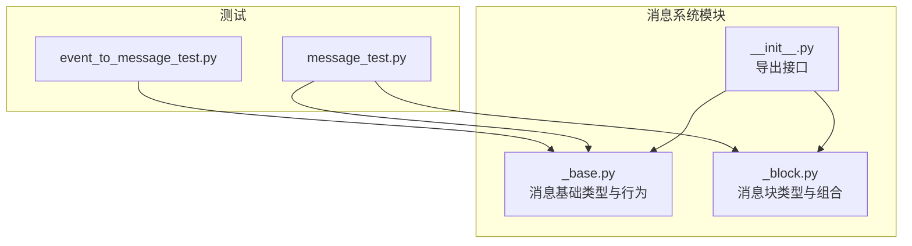
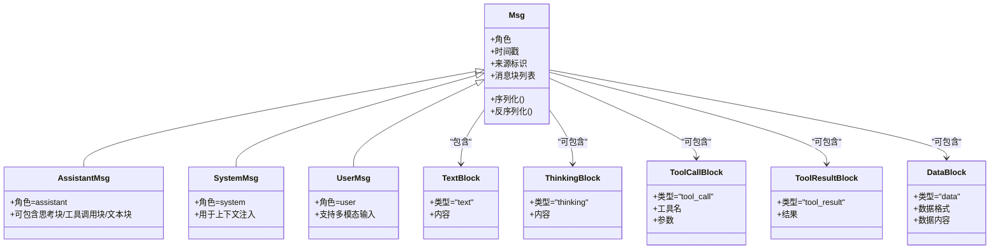
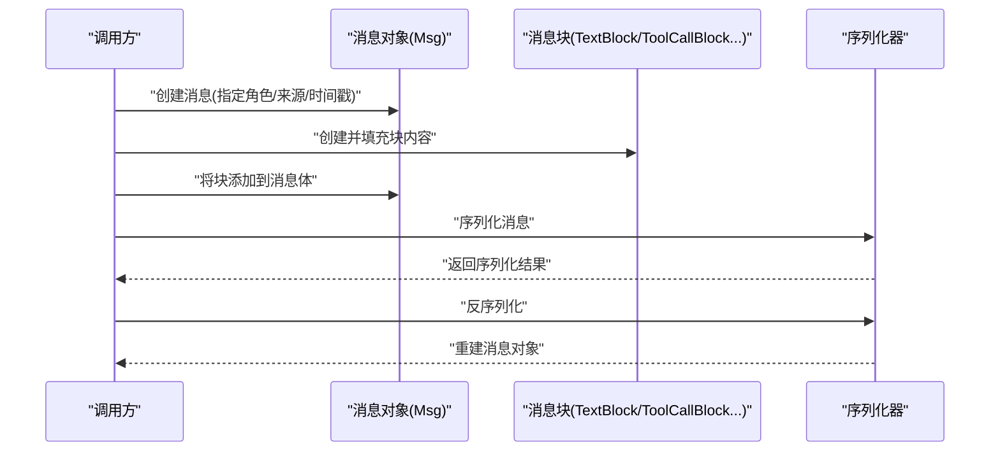
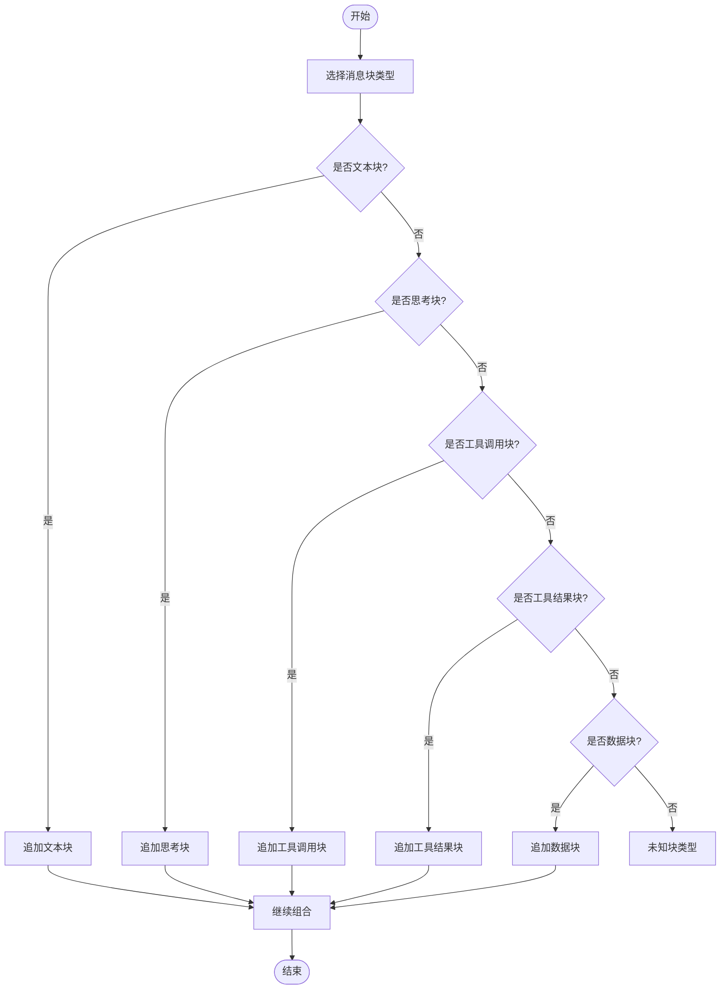
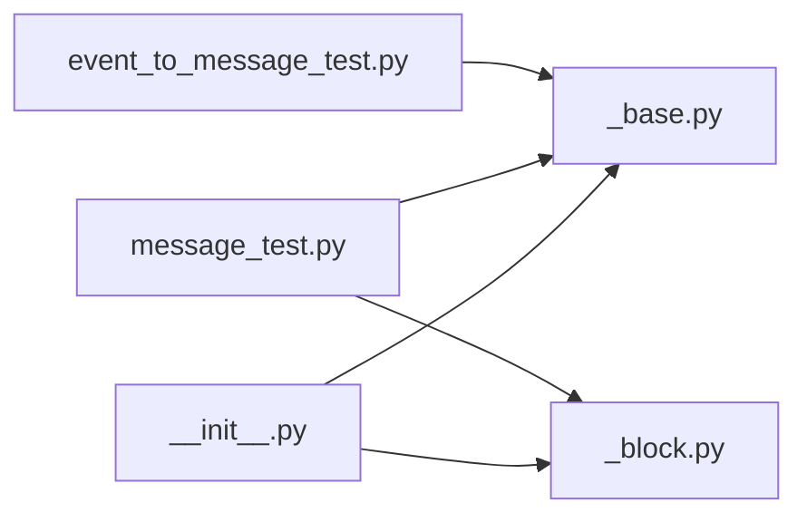

# 消息系统（Message）

<cite>
**本文引用的文件**
- [message/__init__.py](file://src/agentscope/message/__init__.py)
- [_base.py](file://src/agentscope/message/_base.py)
- [_block.py](file://src/agentscope/message/_block.py)
- [message_test.py](file://tests/message_test.py)
- [event_to_message_test.py](file://tests/event_to_message_test.py)
- [README.md](file://README.md)
- [README_zh.md](file://README_zh.md)
</cite>

## 目录
1. [引言](#引言)
2. [项目结构](#项目结构)
3. [核心组件](#核心组件)
4. [架构总览](#架构总览)
5. [详细组件分析](#详细组件分析)
6. [依赖关系分析](#依赖关系分析)
7. [性能考量](#性能考量)
8. [故障排查指南](#故障排查指南)
9. [结论](#结论)
10. [附录](#附录)

## 引言
本文件面向AgentScope的消息系统，系统性阐述消息模型与消息块（Message Block）的设计与实现，覆盖以下主题：
- 消息基础类型：Msg、AssistantMsg、SystemMsg、UserMsg 的职责与差异
- 消息块概念：文本块（TextBlock）、思考块（ThinkingBlock）、工具调用块（ToolCallBlock）、工具结果块（ToolResultBlock）、数据块（DataBlock）的作用与组合方式
- 序列化与反序列化机制：如何在不同智能体之间安全传递消息
- 多模态消息处理：文本、图像、音频等跨模态内容的组织与传输
- 实际使用建议与最佳实践：消息创建、修改、组合与调试

本文件旨在帮助开发者快速理解并正确使用消息系统，同时为维护者提供深入的技术参考。

## 项目结构
消息系统位于 src/agentscope/message 目录下，包含三个核心模块：
- __init__.py：导出消息系统对外接口
- _base.py：定义消息基础类型与通用行为
- _block.py：定义消息块类型及其组合规则

测试用例位于 tests 目录中，验证消息序列化、事件到消息转换等功能。

图表来源
- [message/__init__.py](file://src/agentscope/message/__init__.py)
- [_base.py](file://src/agentscope/message/_base.py)
- [_block.py](file://src/agentscope/message/_block.py)
- [message_test.py](file://tests/message_test.py)
- [event_to_message_test.py](file://tests/event_to_message_test.py)

章节来源
- [message/__init__.py](file://src/agentscope/message/__init__.py)
- [_base.py](file://src/agentscope/message/_base.py)
- [_block.py](file://src/agentscope/message/_block.py)

## 核心组件
本节从“消息”和“消息块”两个维度，系统梳理消息系统的核心抽象与职责边界。

- 消息（Msg）
  - 职责：承载一次对话或交互的基本单元，包含消息头（如角色、时间戳、来源）与消息体（由一个或多个消息块组成）
  - 关键属性：角色（如系统、用户、助手）、时间戳、来源标识、消息块列表等
  - 行为：序列化/反序列化、块的增删改查、多模态内容组织

- AssistantMsg
  - 职责：代表智能体的回复消息，通常包含自然语言回答、工具调用意图、推理过程等
  - 特点：可包含多个消息块，支持逐步输出与中间态展示

- SystemMsg
  - 职责：系统级提示或上下文注入，用于设定角色、约束、风格等
  - 特点：通常不直接参与工具调用，但会影响后续消息的生成策略

- UserMsg
  - 职责：代表用户的输入，可能包含文本、图片、音频等多模态内容
  - 特点：强调原始输入与上下文关联，便于后续检索与溯源

- 消息块（Message Block）
  - 职责：对消息体进行细粒度拆分与组合，支持不同类型的语义单元
  - 常见类型：
    - 文本块（TextBlock）：承载纯文本内容
    - 思考块（ThinkingBlock）：承载推理过程或内部思考内容（可选）
    - 工具调用块（ToolCallBlock）：描述需要执行的工具及参数
    - 工具结果块（ToolResultBlock）：承载工具执行后的返回结果
    - 数据块（DataBlock）：承载结构化数据或二进制数据（如图片、音频）

章节来源
- [_base.py](file://src/agentscope/message/_base.py)
- [_block.py](file://src/agentscope/message/_block.py)

## 架构总览
消息系统采用“消息 + 消息块”的分层设计：
- 上层：消息类型（Msg/AssistantMsg/SystemMsg/UserMsg）负责角色与语义层面的抽象
- 中层：消息块类型负责内容层面的抽象与组合
- 下层：序列化/反序列化机制确保消息在不同智能体之间的稳定传递

图表来源
- [_base.py](file://src/agentscope/message/_base.py)
- [_block.py](file://src/agentscope/message/_block.py)

## 详细组件分析

### 消息基础类型（Msg/AssistantMsg/SystemMsg/UserMsg）
- 设计要点
  - 角色区分：通过角色字段明确消息来源，便于下游格式器与渲染器适配
  - 时间戳与来源：便于审计、排序与溯源
  - 消息块聚合：将复杂内容拆分为可组合的块，提升灵活性与可扩展性
- 典型流程
  - 创建：根据场景选择合适的消息类型，并填充必要元信息
  - 组合：按顺序追加或插入消息块，形成最终消息体
  - 序列化：统一编码为可传输格式（JSON/字节流），保证跨端一致性
  - 反序列化：在接收端重建消息对象，恢复块结构与元信息

图表来源
- [_base.py](file://src/agentscope/message/_base.py)
- [_block.py](file://src/agentscope/message/_block.py)

章节来源
- [_base.py](file://src/agentscope/message/_base.py)

### 消息块类型与组合
- 文本块（TextBlock）
  - 用途：承载自然语言文本，支持长文本分段与增量输出
  - 组合策略：可与其他块并列，也可作为默认块类型
- 思考块（ThinkingBlock）
  - 用途：记录推理过程或中间思考，便于调试与可解释性
  - 组合策略：可选，通常与文本块配合使用
- 工具调用块（ToolCallBlock）
  - 用途：描述需要执行的工具名称与参数，支持批量调用
  - 组合策略：与工具结果块一一对应，便于追踪调用链
- 工具结果块（ToolResultBlock）
  - 用途：承载工具执行结果，支持结构化与非结构化数据
  - 组合策略：紧随对应工具调用块出现，保持调用-结果的语义闭包
- 数据块（DataBlock）
  - 用途：承载多模态数据（如图片、音频、视频）或结构化数据
  - 组合策略：需标注数据格式与编码方式，便于渲染器正确解析

图表来源
- [_block.py](file://src/agentscope/message/_block.py)

章节来源
- [_block.py](file://src/agentscope/message/_block.py)

### 序列化与反序列化机制
- 目标
  - 在不同智能体、格式器、存储系统之间稳定传递消息
  - 保持消息块的语义完整性与类型信息
- 策略
  - 统一编码：将消息对象编码为结构化格式（如 JSON），保留块类型与元信息
  - 类型标注：在序列化时写入块类型字段，在反序列化时据此重建具体块对象
  - 兼容性：新增块类型时，旧版本应能安全忽略未知类型，避免破坏通信
- 测试验证
  - 单元测试覆盖消息序列化/反序列化的正确性与健壮性
  - 事件到消息的转换测试确保外部事件能被正确映射为消息对象

章节来源
- [message_test.py](file://tests/message_test.py)
- [event_to_message_test.py](file://tests/event_to_message_test.py)

### 智能体间传递协议
- 角色约定
  - SystemMsg：系统提示与上下文注入，仅在会话初始化或需要重置上下文时使用
  - UserMsg：用户输入，支持多模态；建议携带会话ID与时间戳
  - AssistantMsg：智能体回复，可包含文本、思考、工具调用与结果
- 顺序与闭包
  - 工具调用与结果必须成对出现，且顺序与调用栈一致
  - 思考块可选，但一旦出现，建议与后续文本块或工具调用块相邻
- 多模态处理
  - 文本：直接放入 TextBlock
  - 图片/音频：放入 DataBlock，并标注数据格式与编码方式
  - 结构化数据：放入 DataBlock 或专用的数据块类型（视实现而定）

章节来源
- [_base.py](file://src/agentscope/message/_base.py)
- [_block.py](file://src/agentscope/message/_block.py)

### 多模态消息处理
- 设计原则
  - 明确区分文本与非文本内容，避免混杂导致解析困难
  - 对非文本内容提供元数据（如格式、尺寸、采样率等），便于渲染与处理
- 实践建议
  - 将多模态输入封装为 DataBlock，减少对文本块的污染
  - 在工具调用中显式声明期望的输入模态，降低歧义
  - 在工具结果中返回结构化元数据与数据引用，便于下游消费

章节来源
- [_block.py](file://src/agentscope/message/_block.py)

## 依赖关系分析
消息系统模块之间的依赖关系清晰，遵循“低耦合、高内聚”的设计原则：
- __init__.py 仅负责导出接口，不引入其他模块
- _base.py 定义消息类型与通用行为，不直接依赖具体块类型
- _block.py 定义块类型，不直接依赖消息类型
- 测试模块分别独立验证消息与块的行为

图表来源
- [message/__init__.py](file://src/agentscope/message/__init__.py)
- [_base.py](file://src/agentscope/message/_base.py)
- [_block.py](file://src/agentscope/message/_block.py)
- [message_test.py](file://tests/message_test.py)
- [event_to_message_test.py](file://tests/event_to_message_test.py)

章节来源
- [message/__init__.py](file://src/agentscope/message/__init__.py)
- [_base.py](file://src/agentscope/message/_base.py)
- [_block.py](file://src/agentscope/message/_block.py)

## 性能考量
- 序列化开销控制
  - 合理拆分大文本为多个 TextBlock，避免单个块过大导致序列化/网络传输压力
  - 对频繁出现的块类型采用紧凑编码，减少冗余字段
- 块数量与内存占用
  - 工具调用与结果成对出现时，注意块数量增长带来的内存压力
  - 对历史消息进行归档或压缩，避免长期会话内存膨胀
- 多模态数据优化
  - 非文本数据尽量以引用形式传输（如文件路径或URL），并在需要时按需加载
  - 对图片/音频等大体积数据进行分块传输或懒加载

## 故障排查指南
- 常见问题
  - 序列化失败：检查块类型字段是否完整，是否存在未知字段
  - 反序列化异常：确认序列化格式与版本兼容性，确保块类型映射正确
  - 工具调用与结果不匹配：核对调用顺序与配对关系，避免遗漏或错位
  - 多模态数据无法渲染：检查 DataBlock 的格式与编码标注是否正确
- 排查步骤
  - 使用单元测试定位问题范围（消息序列化/反序列化、事件到消息转换）
  - 打印关键元信息（角色、时间戳、块类型、块数量），辅助复现
  - 分离问题场景（文本/工具/多模态），缩小问题域
- 相关测试参考
  - 消息序列化/反序列化测试：验证消息对象在编码与解码后的一致性
  - 事件到消息转换测试：验证外部事件能否正确映射为消息对象

章节来源
- [message_test.py](file://tests/message_test.py)
- [event_to_message_test.py](file://tests/event_to_message_test.py)

## 结论
AgentScope的消息系统通过“消息 + 消息块”的分层设计，实现了对多模态、多角色、多状态消息的统一建模与灵活组合。借助完善的序列化/反序列化机制与严格的协议约定，消息可在不同智能体之间稳定传递。建议在实际工程中：
- 明确角色与块类型的使用边界，避免语义混淆
- 对工具调用与结果建立严格的配对与顺序约束
- 对多模态数据提供清晰的元数据标注与引用策略
- 在性能敏感场景中优化序列化与块拆分策略

## 附录
- 快速上手建议
  - 优先使用 TextBlock 承载主要文本内容
  - 工具调用与结果成对出现，保持调用链清晰
  - 多模态输入放入 DataBlock，并标注数据格式
  - 使用统一的序列化/反序列化流程，确保跨端一致性