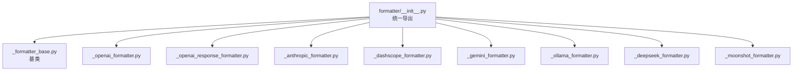
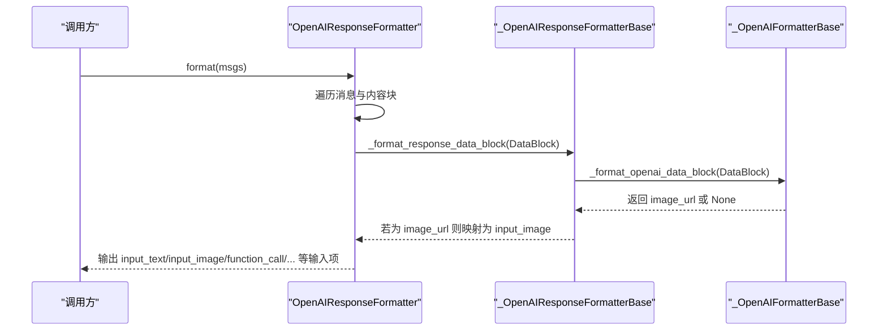
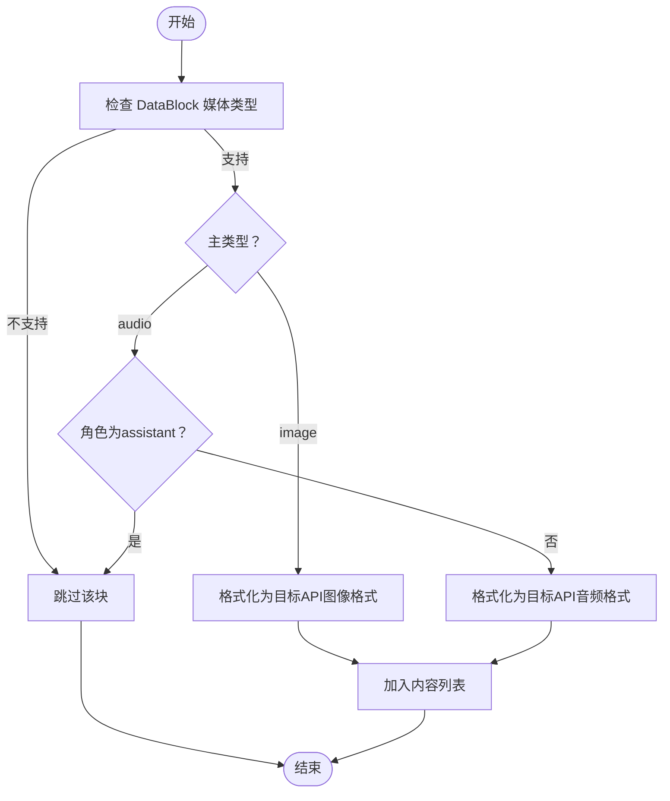

# 格式化器系统

<cite>
**本文引用的文件**
- [formatter/__init__.py](file://src/agentscope/formatter/__init__.py)
- [formatter/_formatter_base.py](file://src/agentscope/formatter/_formatter_base.py)
- [formatter/_openai_formatter.py](file://src/agentscope/formatter/_openai_formatter.py)
- [formatter/_openai_response_formatter.py](file://src/agentscope/formatter/_openai_response_formatter.py)
- [formatter/_anthropic_formatter.py](file://src/agentscope/formatter/_anthropic_formatter.py)
- [formatter/_dashscope_formatter.py](file://src/agentscope/formatter/_dashscope_formatter.py)
- [formatter/_gemini_formatter.py](file://src/agentscope/formatter/_gemini_formatter.py)
- [formatter/_ollama_formatter.py](file://src/agentscope/formatter/_ollama_formatter.py)
- [formatter/_deepseek_formatter.py](file://src/agentscope/formatter/_deepseek_formatter.py)
- [formatter/_moonshot_formatter.py](file://src/agentscope/formatter/_moonshot_formatter.py)
</cite>

## 目录
1. [简介](#简介)
2. [项目结构](#项目结构)
3. [核心组件](#核心组件)
4. [架构总览](#架构总览)
5. [详细组件分析](#详细组件分析)
6. [依赖分析](#依赖分析)
7. [性能考量](#性能考量)
8. [故障排查指南](#故障排查指南)
9. [结论](#结论)
10. [附录](#附录)

## 简介
本文件系统性梳理 agentscope 的“格式化器”体系，聚焦其在模型通信中的作用：将内部统一的消息对象（Msg）转换为不同大模型 API 所需的输入格式；同时在多模态场景下进行数据转换与兼容处理。文档覆盖以下重点：
- 基类设计与扩展机制（FormatterBase）
- 各模型提供商专用格式化器的实现原理（消息结构转换、参数映射、特殊字段处理）
- OpenAI Response 格式化器的特殊处理逻辑
- 配置项、自定义扩展方法与调试技巧
- 错误处理、兼容性与性能优化建议

## 项目结构
格式化器模块位于 src/agentscope/formatter，采用“按提供商分文件”的组织方式，并通过统一入口导出。

图表来源
- [formatter/__init__.py:1-63](file://src/agentscope/formatter/__init__.py#L1-L63)

章节来源
- [formatter/__init__.py:1-63](file://src/agentscope/formatter/__init__.py#L1-L63)

## 核心组件
- 基类 FormatterBase：定义通用输入类型约束、消息分组策略、工具结果文本化策略以及媒体类型过滤等能力。
- 各提供商格式化器：基于基类扩展，实现特定 API 的消息结构、参数映射与特殊字段处理。
- OpenAI Response 格式化器：针对 OpenAI Responses API 的输入项格式差异进行适配。

章节来源
- [formatter/_formatter_base.py:22-218](file://src/agentscope/formatter/_formatter_base.py#L22-L218)
- [formatter/_openai_formatter.py:27-508](file://src/agentscope/formatter/_openai_formatter.py#L27-L508)
- [formatter/_openai_response_formatter.py:21-473](file://src/agentscope/formatter/_openai_response_formatter.py#L21-L473)

## 架构总览
格式化器遵循“基类抽象 + 多实现”的设计模式，所有格式化器均实现异步 format 方法，接收 Msg 列表并输出目标 API 所需的字典列表或输入项列表。多模态数据通过统一的数据块（DataBlock）与来源（URLSource/Base64Source）进行抽象，由基类提供通用的媒体类型匹配与本地文件处理能力。

```mermaid
classDiagram
class FormatterBase {
+input_types : list[str]
+supported_input_media_types : list[str]
+format(*args, **kwargs) list[dict]
+assert_list_of_msgs(msgs)
+convert_tool_result_to_string(output) tuple[str, list]
+_group_messages(msgs) AsyncGenerator
}
class _OpenAIFormatterBase
class OpenAIChatFormatter
class OpenAIMultiAgentFormatter
class _OpenAIResponseFormatterBase
class OpenAIResponseFormatter
class OpenAIResponseMultiAgentFormatter
class _AnthropicFormatterBase
class AnthropicChatFormatter
class AnthropicMultiAgentFormatter
class _DashScopeFormatterBase
class DashScopeChatFormatter
class DashScopeMultiAgentFormatter
class _GeminiFormatterBase
class GeminiChatFormatter
class GeminiMultiAgentFormatter
class _OllamaFormatterBase
class OllamaChatFormatter
class OllamaMultiAgentFormatter
class _DeepSeekFormatter
class DeepSeekChatFormatter
class DeepSeekMultiAgentFormatter
class _MoonshotFormatter
class MoonshotChatFormatter
class MoonshotMultiAgentFormatter
FormatterBase <|-- _OpenAIFormatterBase
_OpenAIFormatterBase <|-- OpenAIChatFormatter
_OpenAIFormatterBase <|-- OpenAIMultiAgentFormatter
FormatterBase <|-- _OpenAIResponseFormatterBase
_OpenAIResponseFormatterBase <|-- OpenAIResponseFormatter
_OpenAIResponseFormatterBase <|-- OpenAIResponseMultiAgentFormatter
FormatterBase <|-- _AnthropicFormatterBase
_AnthropicFormatterBase <|-- AnthropicChatFormatter
_AnthropicFormatterBase <|-- AnthropicMultiAgentFormatter
FormatterBase <|-- _DashScopeFormatterBase
_DashScopeFormatterBase <|-- DashScopeChatFormatter
_DashScopeFormatterBase <|-- DashScopeMultiAgentFormatter
FormatterBase <|-- _GeminiFormatterBase
_GeminiFormatterBase <|-- GeminiChatFormatter
_GeminiFormatterBase <|-- GeminiMultiAgentFormatter
FormatterBase <|-- _OllamaFormatterBase
_OllamaFormatterBase <|-- OllamaChatFormatter
_OllamaFormatterBase <|-- OllamaMultiAgentFormatter
FormatterBase <|-- DeepSeekChatFormatter
FormatterBase <|-- DeepSeekMultiAgentFormatter
_OpenAIFormatterBase <|-- MoonshotChatFormatter
_OpenAIFormatterBase <|-- MoonshotMultiAgentFormatter
```

图表来源
- [formatter/_formatter_base.py:22-218](file://src/agentscope/formatter/_formatter_base.py#L22-L218)
- [formatter/_openai_formatter.py:27-508](file://src/agentscope/formatter/_openai_formatter.py#L27-L508)
- [formatter/_openai_response_formatter.py:21-473](file://src/agentscope/formatter/_openai_response_formatter.py#L21-L473)
- [formatter/_anthropic_formatter.py:27-482](file://src/agentscope/formatter/_anthropic_formatter.py#L27-L482)
- [formatter/_dashscope_formatter.py:26-553](file://src/agentscope/formatter/_dashscope_formatter.py#L26-L553)
- [formatter/_gemini_formatter.py:27-417](file://src/agentscope/formatter/_gemini_formatter.py#L27-L417)
- [formatter/_ollama_formatter.py:27-422](file://src/agentscope/formatter/_ollama_formatter.py#L27-L422)
- [formatter/_deepseek_formatter.py:19-295](file://src/agentscope/formatter/_deepseek_formatter.py#L19-L295)
- [formatter/_moonshot_formatter.py:24-406](file://src/agentscope/formatter/_moonshot_formatter.py#L24-L406)

## 详细组件分析

### 基类：FormatterBase 设计与扩展机制
- 输入类型约束：input_types 控制支持的媒体类型模式，基类提供 supported_input_media_types 属性用于过滤 DataBlock。
- 消息分组：_group_messages 将连续的工具调用/结果序列与普通消息序列分组，便于多代理场景下的历史折叠。
- 工具结果文本化：convert_tool_result_to_string 将工具输出（文本+多模态）转为纯文本提示，并对支持的媒体类型生成“提醒”列表以便后续以用户消息形式补充展示。
- 类型校验：assert_list_of_msgs 对输入进行严格校验，避免非 Msg 对象进入格式化流程。

章节来源
- [formatter/_formatter_base.py:22-218](file://src/agentscope/formatter/_formatter_base.py#L22-L218)

### OpenAI 格式化器
- 共享基类：_OpenAIFormatterBase 提供图像与音频的统一处理逻辑，确保不同来源（本地 file://、远程 URL、Base64）按 OpenAI 要求转换。
- 图像处理：_format_image_source 支持本地文件读取与 Base64 编码，远程 URL 直通；音频仅在用户消息中允许，助手消息中跳过以避免后续调用错误。
- 聊天格式：OpenAIChatFormatter 输出包含 role/name/content/tool_calls 的消息列表；工具结果以 tool 角色消息呈现，并可附加“提醒”用户消息以展示多模态数据。
- 多代理格式：OpenAIMultiAgentFormatter 使用历史标签 <history> 包裹多轮对话文本，媒体块单独列出；首次代理消息前插入历史提示。

章节来源
- [formatter/_openai_formatter.py:27-508](file://src/agentscope/formatter/_openai_formatter.py#L27-L508)

### OpenAI Response 格式化器
- 专用基类：_OpenAIResponseFormatterBase 定义 Responses API 的输入项格式差异，拦截音频输入并给出明确警告。
- 数据块映射：_format_response_data_block 将 image_url 映射为 input_image；保持其余类型不变。
- 聊天格式：OpenAIResponseFormatter 输出 input_text/input_image/function_call/function_call_output 等输入项；思维块（ThinkingBlock）若带 reasoning_item_id 则原样回显为 reasoning 类型。
- 多代理格式：OpenAIResponseMultiAgentFormatter 与聊天版类似，但将工具调用/结果序列委托给 OpenAIResponseFormatter 处理。

章节来源
- [formatter/_openai_response_formatter.py:21-473](file://src/agentscope/formatter/_openai_response_formatter.py#L21-L473)

### Anthropic 格式化器
- 思维块保留：仅当 ThinkingBlock 携带签名（signature）时才保留，否则丢弃以满足 Anthropic 对签名的要求。
- 工具调用/结果：tool_use 与 tool_result 的结构映射；tool_result 必须置于 user 角色消息中。
- 媒体类型限制：仅支持 image/*，非 image 主类型直接跳过。
- 多代理格式：将历史文本包裹于 <history> 标签内，媒体块单独列出。

章节来源
- [formatter/_anthropic_formatter.py:27-482](file://src/agentscope/formatter/_anthropic_formatter.py#L27-L482)

### DashScope 格式化器
- 多媒体支持：image_url、video_url、input_audio；音频在助手消息中跳过。
- 思维输入：通过 application/x-thinking 控制是否在历史中传递 reasoning_content。
- 多代理格式：与 OpenAI 类似，使用 <history> 标签折叠历史；工具调用/结果序列独立呈现。

章节来源
- [formatter/_dashscope_formatter.py:26-553](file://src/agentscope/formatter/_dashscope_formatter.py#L26-L553)

### Gemini 格式化器
- 思维块标记：通过 thought:true 标识思考内容，维持推理连贯性。
- 工具调用/结果：function_call 与 function_response 结构映射；工具结果以 user 角色消息呈现。
- 多媒体：inline_data 形式封装，支持本地/远程 URL 下载与 Base64 编码。
- 多代理格式：历史文本包裹 <history> 标签，媒体块与文本交替出现。

章节来源
- [formatter/_gemini_formatter.py:27-417](file://src/agentscope/formatter/_gemini_formatter.py#L27-L417)

### Ollama 格式化器
- 媒体类型限制：仅支持 image/*，非 image 主类型直接跳过。
- 输入格式：content 文本与 images 列表组合；工具调用/结果分别作为独立消息。
- 多代理格式：历史文本包裹 <history> 标签，媒体块以 base64 字符串形式追加到 images。

章节来源
- [formatter/_ollama_formatter.py:27-422](file://src/agentscope/formatter/_ollama_formatter.py#L27-L422)

### DeepSeek 格式化器
- 无多模态：input_types 默认仅 text/plain。
- 思维内容：reasoning_content 在助手消息中始终存在，即使为空字符串，以保证上下文一致性。
- 多代理格式：历史文本包裹 <history> 标签，工具调用/结果序列独立呈现。

章节来源
- [formatter/_deepseek_formatter.py:19-295](file://src/agentscope/formatter/_deepseek_formatter.py#L19-L295)

### Moonshot 格式化器
- 图像处理：强制将远程 URL 下载并编码为 data URI，以满足 Moonshot 视觉 API 的要求。
- 思维保留：助手消息始终携带 reasoning_content（空或非空），以支持“Preserved Thinking”特性。
- 多代理格式：与 OpenAI 多代理一致，历史折叠策略相同。

章节来源
- [formatter/_moonshot_formatter.py:24-406](file://src/agentscope/formatter/_moonshot_formatter.py#L24-L406)

### OpenAI Response 特殊处理流程（序列图）

图表来源
- [formatter/_openai_response_formatter.py:38-88](file://src/agentscope/formatter/_openai_response_formatter.py#L38-L88)
- [formatter/_openai_formatter.py:31-84](file://src/agentscope/formatter/_openai_formatter.py#L31-L84)

### 多模态数据转换流程（流程图）

图表来源
- [formatter/_openai_formatter.py:31-84](file://src/agentscope/formatter/_openai_formatter.py#L31-L84)
- [formatter/_dashscope_formatter.py:63-119](file://src/agentscope/formatter/_dashscope_formatter.py#L63-L119)
- [formatter/_anthropic_formatter.py:206-243](file://src/agentscope/formatter/_anthropic_formatter.py#L206-L243)
- [formatter/_gemini_formatter.py:31-60](file://src/agentscope/formatter/_gemini_formatter.py#L31-L60)
- [formatter/_ollama_formatter.py:31-68](file://src/agentscope/formatter/_ollama_formatter.py#L31-L68)

## 依赖分析
- 继承关系：各格式化器均继承自 FormatterBase 或其子类，复用媒体类型过滤、消息分组与工具结果文本化能力。
- 组件耦合：OpenAI 系列（含 Moonshot）共享 _OpenAIFormatterBase；Responses 系列共享 _OpenAIResponseFormatterBase；Anthropic/DashScope/Gemini/Ollama/DeepSeek 各自维护专用基类或直接继承基类。
- 外部依赖：requests 用于远程 URL 下载；base64/mimetypes/tempfile 用于本地文件处理与临时存储；shortuuid 用于生成多模态数据标识。

章节来源
- [formatter/_formatter_base.py:1-218](file://src/agentscope/formatter/_formatter_base.py#L1-L218)
- [formatter/_openai_formatter.py:1-25](file://src/agentscope/formatter/_openai_formatter.py#L1-L25)
- [formatter/_openai_response_formatter.py:1-19](file://src/agentscope/formatter/_openai_response_formatter.py#L1-L19)
- [formatter/_anthropic_formatter.py:1-25](file://src/agentscope/formatter/_anthropic_formatter.py#L1-L25)
- [formatter/_dashscope_formatter.py:1-24](file://src/agentscope/formatter/_dashscope_formatter.py#L1-L24)
- [formatter/_gemini_formatter.py:1-25](file://src/agentscope/formatter/_gemini_formatter.py#L1-L25)
- [formatter/_ollama_formatter.py:1-25](file://src/agentscope/formatter/_ollama_formatter.py#L1-L25)
- [formatter/_deepseek_formatter.py:1-17](file://src/agentscope/formatter/_deepseek_formatter.py#L1-L17)
- [formatter/_moonshot_formatter.py:1-22](file://src/agentscope/formatter/_moonshot_formatter.py#L1-L22)

## 性能考量
- 远程下载与编码：DashScope/OpenAI/Moonshot/Ollama 在处理远程 URL 时会触发网络请求与 base64 编码，建议在批量消息中合并请求、缓存已下载资源，减少重复 I/O。
- 本地文件写入：基类 convert_tool_result_to_string 在遇到 Base64Source 时会写入临时文件，建议控制多模态数据量与频率，避免频繁磁盘 IO。
- 媒体类型匹配：使用 glob 风格模式匹配媒体类型，建议在 input_types 中精确限定，减少不必要的块处理。
- 分组策略：多代理场景下，_group_messages 将工具序列与普通消息分组，有助于减少历史冗余，提升上下文效率。

## 故障排查指南
- 媒体类型不支持：日志会记录“不支持的媒体类型/主类型”，请检查 input_types 与 DataBlock 的媒体类型是否匹配。
- 音频输入问题：OpenAI Responses API 不支持音频输入；DashScope/OpenAI 在助手消息中会跳过音频；如遇异常，请确认角色与 API 类型。
- 思维块缺失：Anthropic 要求 ThinkingBlock 携带签名；DeepSeek/Gemini/Moonshot 对思维内容有不同要求，请确保消息块属性完整。
- 工具结果展示：convert_tool_result_to_string 会生成“提醒”列表，若未显示多模态数据，请检查 supported_input_media_types 与提示拼接逻辑。
- 远程 URL 访问失败：requests 下载超时或状态异常，建议检查网络与 URL 可达性，必要时改为本地 file:// 或 Base64Source。

章节来源
- [formatter/_formatter_base.py:70-173](file://src/agentscope/formatter/_formatter_base.py#L70-L173)
- [formatter/_openai_formatter.py:55-84](file://src/agentscope/formatter/_openai_formatter.py#L55-L84)
- [formatter/_openai_response_formatter.py:64-88](file://src/agentscope/formatter/_openai_response_formatter.py#L64-L88)
- [formatter/_anthropic_formatter.py:78-97](file://src/agentscope/formatter/_anthropic_formatter.py#L78-L97)
- [formatter/_gemini_formatter.py:156-160](file://src/agentscope/formatter/_gemini_formatter.py#L156-L160)
- [formatter/_moonshot_formatter.py:112-115](file://src/agentscope/formatter/_moonshot_formatter.py#L112-L115)

## 结论
格式化器系统通过统一的基类抽象与多提供商专用实现，实现了跨模型的输入格式兼容与多模态数据转换。OpenAI Response 格式化器在输入项类型、思维块回显与工具调用/结果映射方面提供了精细化适配。通过合理配置 input_types、利用消息分组与工具结果文本化策略，可在保证兼容性的前提下提升性能与可维护性。

## 附录
- 配置选项
  - input_types：定义支持的媒体类型模式（如 text/plain、image/*、audio/*、video/*、application/x-thinking 等）。
  - conversation_history_prompt：多代理场景下的历史提示模板（部分格式化器提供）。
- 自定义扩展方法
  - 新增提供商：继承 FormatterBase 或对应专用基类，实现 format 方法与必要的数据块格式化辅助函数。
  - 多模态处理：在 convert_tool_result_to_string 中扩展“提醒”列表与本地文件保存策略。
  - 媒体类型扩展：在 input_types 中添加新的媒体类型模式，并在数据块格式化函数中处理相应来源。
- 调试技巧
  - 开启日志：关注“不支持的媒体类型/主类型”“跳过”等警告信息，定位输入类型与来源问题。
  - 单元测试：参考 tests 目录下的各格式化器测试文件，验证不同消息块与多代理场景的行为。
  - 性能监控：统计远程下载次数、本地文件写入数量与分组命中率，识别瓶颈并优化。