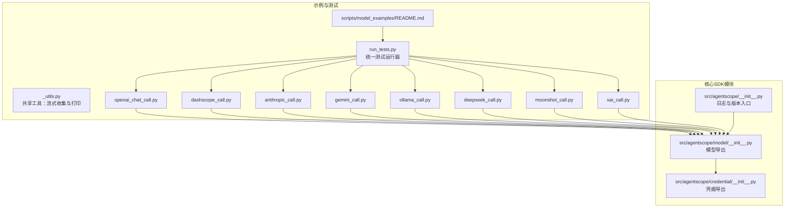
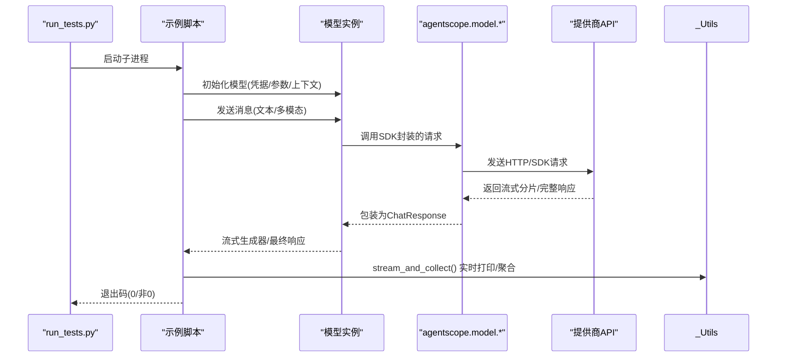
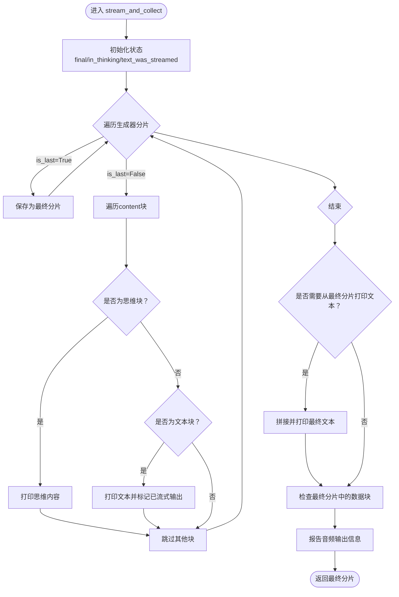
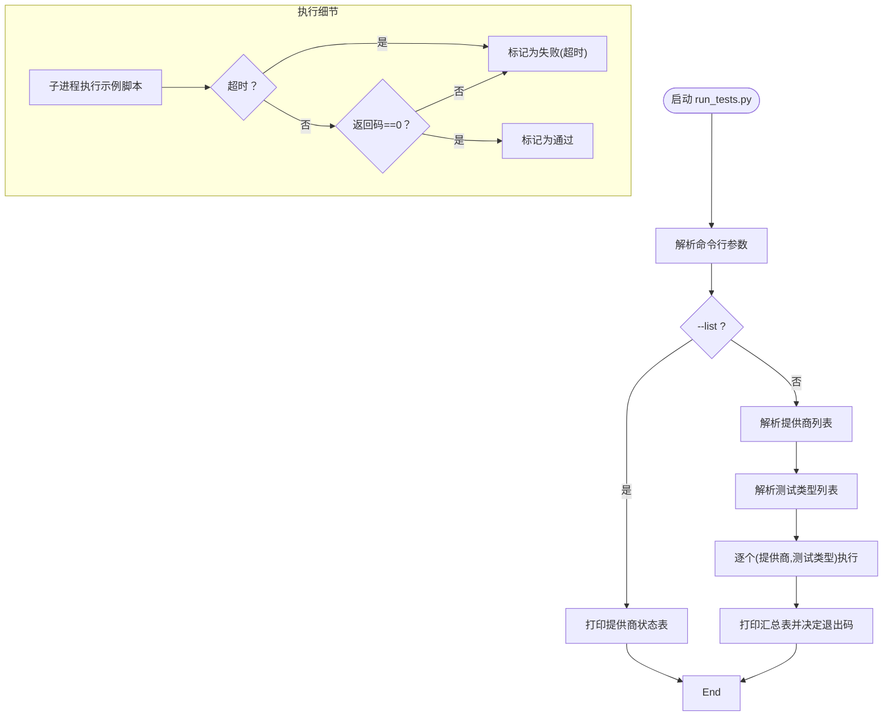
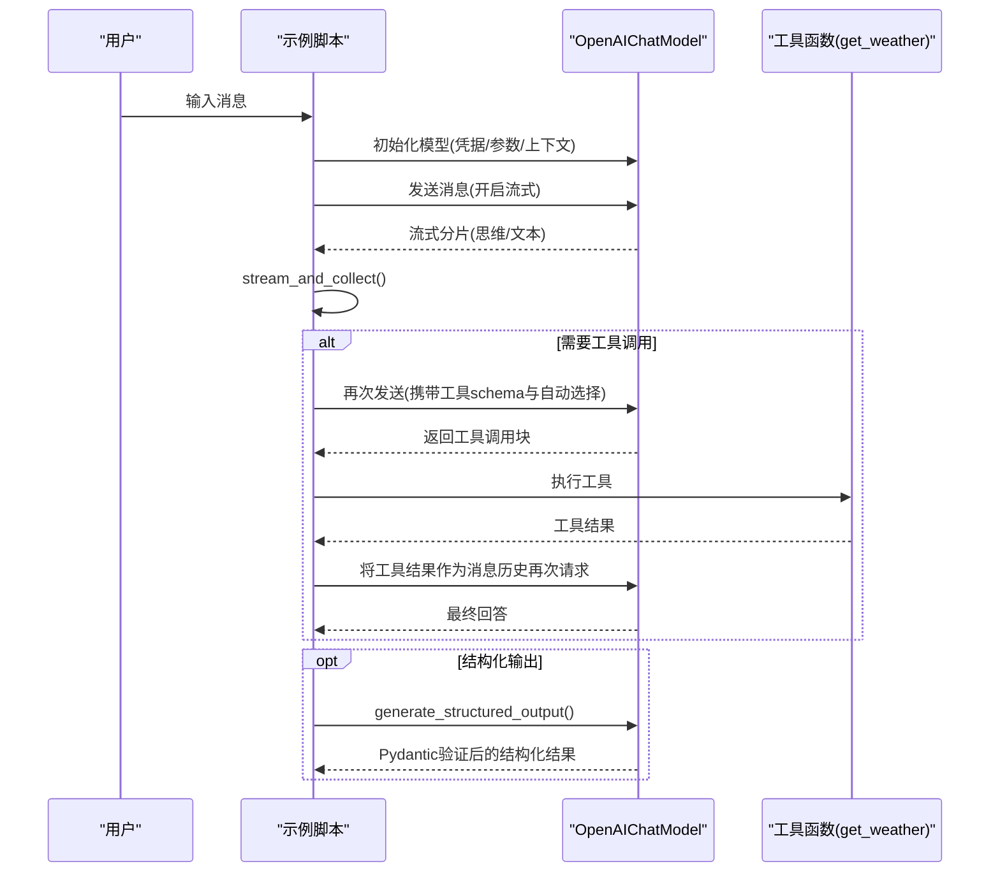
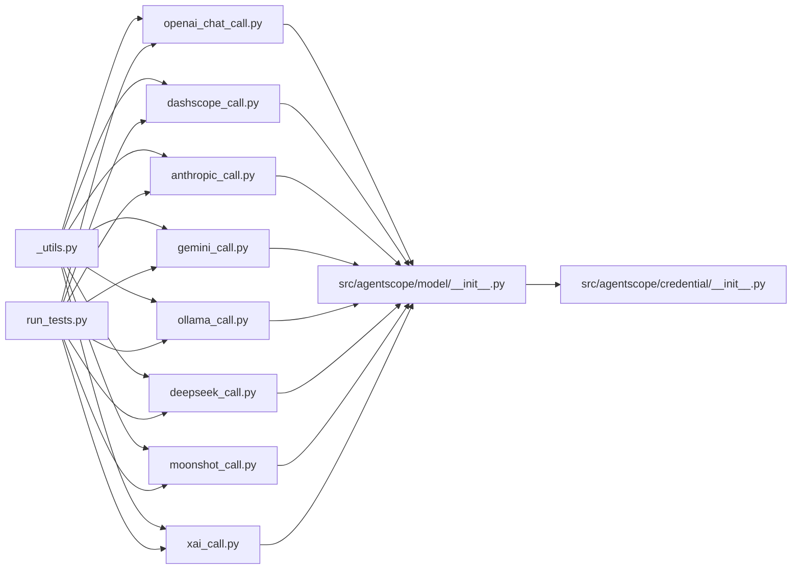

# 模型使用示例

<cite>
**本文引用的文件**
- [README.md](file://scripts/model_examples/README.md)
- [_utils.py](file://scripts/model_examples/_utils.py)
- [run_tests.py](file://scripts/model_examples/run_tests.py)
- [openai_chat_call.py](file://scripts/model_examples/openai_chat_call.py)
- [dashscope_call.py](file://scripts/model_examples/dashscope_call.py)
- [anthropic_call.py](file://scripts/model_examples/anthropic_call.py)
- [gemini_call.py](file://scripts/model_examples/gemini_call.py)
- [ollama_call.py](file://scripts/model_examples/ollama_call.py)
- [deepseek_call.py](file://scripts/model_examples/deepseek_call.py)
- [moonshot_call.py](file://scripts/model_examples/moonshot_call.py)
- [xai_call.py](file://scripts/model_examples/xai_call.py)
- [__init__.py](file://src/agentscope/__init__.py)
- [model/__init__.py](file://src/agentscope/model/__init__.py)
- [credential/__init__.py](file://src/agentscope/credential/__init__.py)
</cite>

## 目录
1. [简介](#简介)
2. [项目结构](#项目结构)
3. [核心组件](#核心组件)
4. [架构总览](#架构总览)
5. [详细组件分析](#详细组件分析)
6. [依赖关系分析](#依赖关系分析)
7. [性能与成本优化](#性能与成本优化)
8. [故障排查指南](#故障排查指南)
9. [结论](#结论)
10. [附录：渐进式学习路径与最佳实践](#附录渐进式学习路径与最佳实践)

## 简介
本指南面向希望在实际应用中高效、稳定地使用主流大模型（OpenAI Chat、DashScope/Qwen、Anthropic Claude、Google Gemini、Ollama、DeepSeek、Moonshot AI、xAI）的开发者与工程师。文档基于仓库中的示例脚本与统一测试运行器，系统性讲解以下内容：
- 标准调用流程：基础文本对话、多模态输入输出、流式响应处理
- 错误处理、重试机制与超时配置
- 批量调用、并发处理与资源管理
- 参数调优：温度、采样策略、思维链与推理控制
- 性能监控、成本控制与使用统计
- 从简单到复杂的渐进式学习路径与常见问题解答

## 项目结构
示例与测试集中在 scripts/model_examples 目录，按“提供商+任务类型”组织，辅以统一的测试运行器与共享工具函数。

图表来源
- [README.md:1-232](file://scripts/model_examples/README.md#L1-L232)
- [run_tests.py:1-586](file://scripts/model_examples/run_tests.py#L1-L586)
- [model/__init__.py:1-34](file://src/agentscope/model/__init__.py#L1-L34)
- [credential/__init__.py:1-28](file://src/agentscope/credential/__init__.py#L1-L28)

章节来源
- [README.md:1-232](file://scripts/model_examples/README.md#L1-L232)
- [run_tests.py:1-586](file://scripts/model_examples/run_tests.py#L1-L586)

## 核心组件
- 统一流式收集与打印：用于实时打印增量响应、识别思维块与最终块，并在必要时报告音频输出等附加信息。
- 统一测试运行器：自动检测环境变量或本地服务可用性，按需执行指定提供商与测试类型的脚本，支持超时、详细输出与汇总统计。
- 模型与凭据导出：通过模块导出统一入口，便于在示例脚本中直接引用具体模型类与凭据类。

章节来源
- [_utils.py:1-69](file://scripts/model_examples/_utils.py#L1-L69)
- [run_tests.py:1-586](file://scripts/model_examples/run_tests.py#L1-L586)
- [model/__init__.py:1-34](file://src/agentscope/model/__init__.py#L1-L34)
- [credential/__init__.py:1-28](file://src/agentscope/credential/__init__.py#L1-L28)

## 架构总览
下图展示了“测试运行器 → 示例脚本 → 模型SDK → 提供商API”的调用链路与数据流。

图表来源
- [run_tests.py:240-276](file://scripts/model_examples/run_tests.py#L240-L276)
- [openai_chat_call.py:27-51](file://scripts/model_examples/openai_chat_call.py#L27-L51)
- [_utils.py:9-69](file://scripts/model_examples/_utils.py#L9-L69)

## 详细组件分析

### 统一流式收集与打印（stream_and_collect）
- 功能要点
  - 遍历异步生成器返回的增量分片，仅打印非最终分片；最终分片用于提取工具调用与最终文本。
  - 自动识别思维块与文本块，支持思维阶段与回答阶段的分隔输出。
  - 若无任何增量文本，会在最终分片中一次性打印全部文本。
  - 检测最终分片中的数据块，报告音频输出的媒体类型与字节大小。
- 典型用途
  - 在所有示例脚本中，将模型返回的流式生成器传入该函数，即可获得一致的交互体验与调试输出。

图表来源
- [_utils.py:9-69](file://scripts/model_examples/_utils.py#L9-L69)

章节来源
- [_utils.py:1-69](file://scripts/model_examples/_utils.py#L1-L69)

### 统一测试运行器（run_tests.py）
- 自动发现与可用性检测
  - 基于环境变量判断云端提供商可用性；对本地Ollama通过HTTP探测其标签接口。
- 可配置执行范围
  - 支持选择提供商列表、测试类型列表、超时时间、是否实时输出。
- 结果统计与退出码
  - 输出汇总表，失败时返回非零退出码，便于CI集成。

图表来源
- [run_tests.py:477-586](file://scripts/model_examples/run_tests.py#L477-L586)
- [run_tests.py:293-388](file://scripts/model_examples/run_tests.py#L293-L388)
- [run_tests.py:240-276](file://scripts/model_examples/run_tests.py#L240-L276)

章节来源
- [run_tests.py:1-586](file://scripts/model_examples/run_tests.py#L1-L586)

### OpenAI Chat 示例（openai_chat_call.py）
- 基础文本对话：启用流式输出，设置上下文长度与推理努力等级。
- 工具调用：两轮对话，第一轮由模型决定调用工具，第二轮将工具结果注入消息历史后再次请求。
- 结构化输出：通过专用方法强制Pydantic模型输出JSON。

图表来源
- [openai_chat_call.py:27-51](file://scripts/model_examples/openai_chat_call.py#L27-L51)
- [openai_chat_call.py:70-131](file://scripts/model_examples/openai_chat_call.py#L70-L131)
- [openai_chat_call.py:148-182](file://scripts/model_examples/openai_chat_call.py#L148-L182)
- [_utils.py:9-69](file://scripts/model_examples/_utils.py#L9-L69)

章节来源
- [openai_chat_call.py:1-189](file://scripts/model_examples/openai_chat_call.py#L1-L189)

### DashScope（Qwen）示例（dashscope_call.py）
- 与OpenAI示例相似的三段式流程：基础对话、工具调用、结构化输出。
- 特点：支持思维开关与工具调用。

章节来源
- [dashscope_call.py:1-186](file://scripts/model_examples/dashscope_call.py#L1-L186)

### Anthropic Claude 示例（anthropic_call.py）
- 支持思维开关与思维预算，适合长链推理场景。
- 工具调用与结构化输出流程同上。

章节来源
- [anthropic_call.py:1-192](file://scripts/model_examples/anthropic_call.py#L1-L192)

### Google Gemini 示例（gemini_call.py）
- 支持思维开关与思维预算，适配多模态与工具调用。
- 结构化输出流程一致。

章节来源
- [gemini_call.py:1-192](file://scripts/model_examples/gemini_call.py#L1-L192)

### Ollama 本地示例（ollama_call.py）
- 无需API密钥，但需确保本地服务运行且可访问。
- 默认主机地址可通过环境变量覆盖。

章节来源
- [ollama_call.py:1-189](file://scripts/model_examples/ollama_call.py#L1-L189)

### DeepSeek 示例（deepseek_call.py）
- 使用“思考模式”增强推理能力，工具调用与结构化输出流程一致。

章节来源
- [deepseek_call.py:1-190](file://scripts/model_examples/deepseek_call.py#L1-L190)

### Moonshot AI 示例（moonshot_call.py）
- 支持思维开关与结构化输出，工具调用流程一致。

章节来源
- [moonshot_call.py:1-181](file://scripts/model_examples/moonshot_call.py#L1-L181)

### xAI Grok 示例（xai_call.py）
- 使用原生SDK特性，支持推理努力等级与工具调用。
- 与OpenAI兼容方式不同，强调原生能力。

章节来源
- [xai_call.py:1-190](file://scripts/model_examples/xai_call.py#L1-L190)

## 依赖关系分析
- 示例脚本依赖统一工具函数进行流式输出与聚合。
- 示例脚本通过模型导出入口引用具体模型类与凭据类。
- 运行器通过子进程方式调用示例脚本，实现跨提供商与跨测试类型的统一执行。

图表来源
- [_utils.py:1-69](file://scripts/model_examples/_utils.py#L1-L69)
- [run_tests.py:1-586](file://scripts/model_examples/run_tests.py#L1-L586)
- [model/__init__.py:1-34](file://src/agentscope/model/__init__.py#L1-L34)
- [credential/__init__.py:1-28](file://src/agentscope/credential/__init__.py#L1-L28)

章节来源
- [model/__init__.py:1-34](file://src/agentscope/model/__init__.py#L1-L34)
- [credential/__init__.py:1-28](file://src/agentscope/credential/__init__.py#L1-L28)

## 性能与成本优化
- 上下文与窗口
  - 合理设置上下文大小，避免不必要的长上下文导致延迟与费用上升。
- 流式响应
  - 开启流式可显著改善首字节延迟与交互体验；结合统一工具函数可实现边流式边打印。
- 超时与重试
  - 运行器支持每脚本超时；在生产中建议在SDK层增加指数退避重试与熔断策略。
- 并发与批处理
  - 使用运行器的并发执行能力；在业务层采用任务队列与连接池，限制并发度并复用连接。
- 成本控制
  - 记录用量与价格映射，定期统计；优先使用轻量模型完成预处理，再在必要时调用更强模型。
- 监控与统计
  - 记录请求耗时、成功率、错误类型、用量与费用；在统一运行器中扩展统计输出。

## 故障排查指南
- 环境变量缺失
  - 运行器会自动跳过不可用提供商；确认对应环境变量是否正确设置。
- Ollama 服务不可达
  - 运行器会检测标签接口；若失败则跳过相关测试；检查主机地址与端口。
- 超时
  - 增加每脚本超时时间或优化模型参数（如减少max_tokens）。
- 多模态不支持
  - 部分提供商不支持多模态；运行器会标注跳过。
- 工具调用失败
  - 检查工具schema与参数序列化；确保工具函数签名与调用一致。

章节来源
- [run_tests.py:63-88](file://scripts/model_examples/run_tests.py#L63-L88)
- [README.md:112-133](file://scripts/model_examples/README.md#L112-L133)

## 结论
通过统一的示例脚本与测试运行器，AgentScope为多提供商、多任务场景提供了标准化的调用范式。结合流式输出、工具调用与结构化输出能力，开发者可以快速构建从简单问答到复杂推理与多模态应用的完整链路。配合合理的参数调优、并发控制与成本监控，可在保证质量的同时提升稳定性与经济性。

## 附录：渐进式学习路径与最佳实践
- 初学者路径
  - 先运行统一测试，观察各提供商可用性与基本输出。
  - 逐个打开示例脚本，理解基础文本对话、工具调用与结构化输出的差异。
- 进阶路径
  - 引入多模态输入（图片/音频/视频），对比不同提供商的能力边界。
  - 设计重试与超时策略，结合运行器的超时参数进行压测。
- 生产落地
  - 建立统一的模型参数模板与凭据管理；接入连接池与限流熔断。
  - 增强监控与统计，形成成本与性能的闭环。

章节来源
- [README.md:1-232](file://scripts/model_examples/README.md#L1-L232)
- [run_tests.py:136-174](file://scripts/model_examples/run_tests.py#L136-L174)