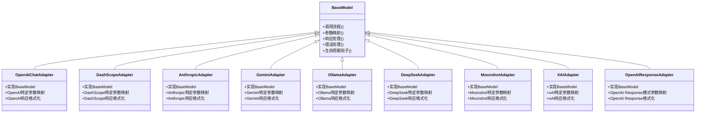
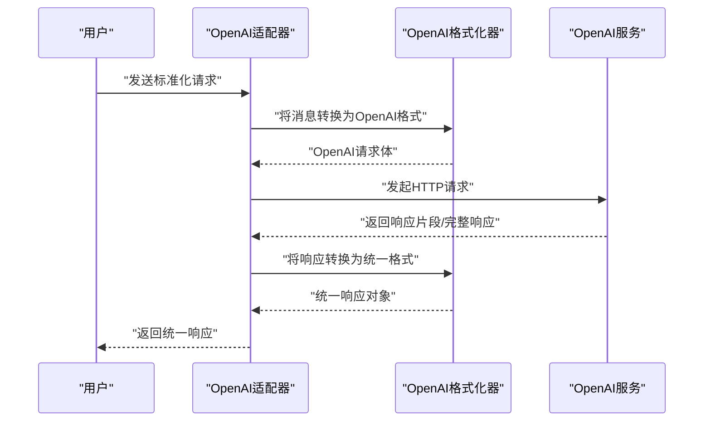
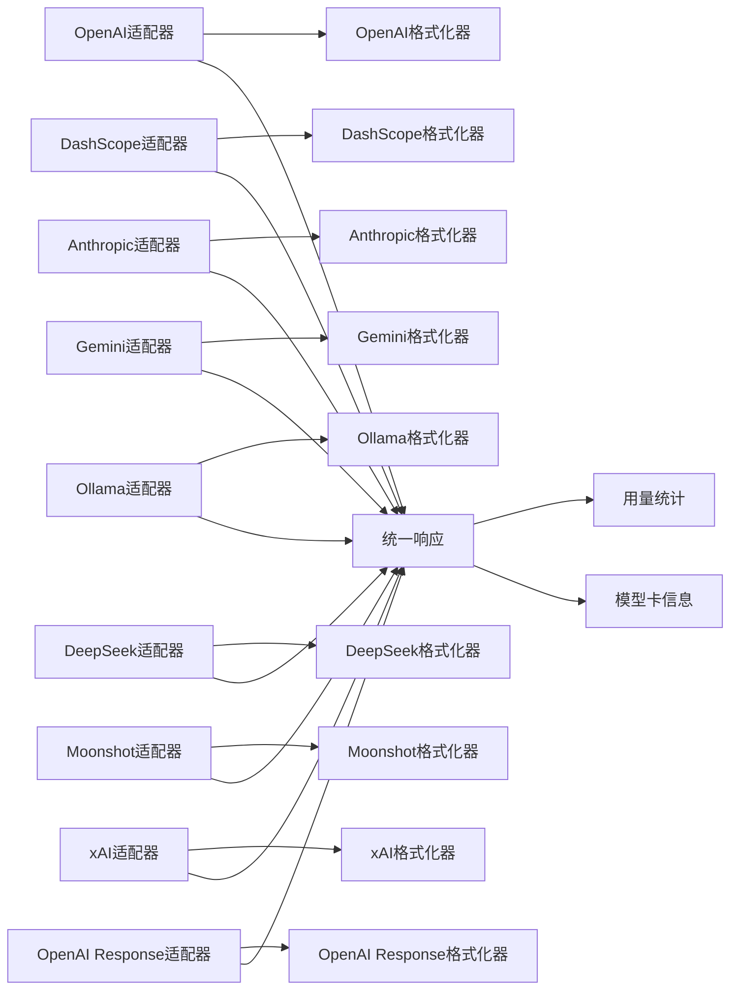

# 模型适配器

<cite>
**本文引用的文件**
- [model/_base.py](file://src/agentscope/model/_base.py)
- [credential/_factory.py](file://src/agentscope/credential/_factory.py)
- [credential/_base.py](file://src/agentscope/credential/_base.py)
- [formatter/_formatter_base.py](file://src/agentscope/formatter/_formatter_base.py)
- [formatter/_openai_formatter.py](file://src/agentscope/formatter/_openai_formatter.py)
- [formatter/_dashscope_formatter.py](file://src/agentscope/formatter/_dashscope_formatter.py)
- [formatter/_anthropic_formatter.py](file://src/agentscope/formatter/_anthropic_formatter.py)
- [formatter/_gemini_formatter.py](file://src/agentscope/formatter/_gemini_formatter.py)
- [formatter/_ollama_formatter.py](file://src/agentscope/formatter/_ollama_formatter.py)
- [formatter/_deepseek_formatter.py](file://src/agentscope/formatter/_deepseek_formatter.py)
- [formatter/_moonshot_formatter.py](file://src/agentscope/formatter/_moonshot_formatter.py)
- [formatter/_xai_formatter.py](file://src/agentscope/formatter/_xai_formatter.py)
- [formatter/_openai_response_formatter.py](file://src/agentscope/formatter/_openai_response_formatter.py)
- [model/_openai_chat/_model.py](file://src/agentscope/model/_openai_chat/_model.py)
- [model/_dashscope/_model.py](file://src/agentscope/model/_dashscope/_model.py)
- [model/_anthropic/_model.py](file://src/agentscope/model/_anthropic/_model.py)
- [model/_gemini/_model.py](file://src/agentscope/model/_gemini/_model.py)
- [model/_ollama/_model.py](file://src/agentscope/model/_ollama/_model.py)
- [model/_deepseek/_model.py](file://src/agentscope/model/_deepseek/_model.py)
- [model/_moonshot/_model.py](file://src/agentscope/model/_moonshot/_model.py)
- [model/_xai/_model.py](file://src/agentscope/model/_xai/_model.py)
- [model/_openai_response/_model.py](file://src/agentscope/model/_openai_response/_model.py)
- [model/_model_card.py](file://src/agentscope/model/_model_card.py)
- [model/_model_response.py](file://src/agentscope/model/_model_response.py)
- [model/_model_usage.py](file://src/agentscope/model/_model_usage.py)
- [scripts/model_examples/openai_chat_call.py](file://scripts/model_examples/openai_chat_call.py)
- [scripts/model_examples/dashscope_call.py](file://scripts/model_examples/dashscope_call.py)
- [scripts/model_examples/anthropic_call.py](file://scripts/model_examples/anthropic_call.py)
- [scripts/model_examples/gemini_call.py](file://scripts/model_examples/gemini_call.py)
- [scripts/model_examples/ollama_call.py](file://scripts/model_examples/ollama_call.py)
- [scripts/model_examples/deepseek_call.py](file://scripts/model_examples/deepseek_call.py)
- [scripts/model_examples/moonshot_call.py](file://scripts/model_examples/moonshot_call.py)
- [scripts/model_examples/xai_call.py](file://scripts/model_examples/xai_call.py)
- [scripts/model_examples/openai_response_call.py](file://scripts/model_examples/openai_response_call.py)
- [tests/model_openai_chat_test.py](file://tests/model_openai_chat_test.py)
- [tests/model_dashscope_test.py](file://tests/model_dashscope_test.py)
- [tests/model_anthropic_test.py](file://tests/model_anthropic_test.py)
- [tests/model_gemini_test.py](file://tests/model_gemini_test.py)
- [tests/model_ollama_test.py](file://tests/model_ollama_test.py)
- [tests/model_deepseek_test.py](file://tests/model_deepseek_test.py)
- [tests/model_moonshot_test.py](file://tests/model_moonshot_test.py)
- [tests/model_xai_test.py](file://tests/model_xai_test.py)
- [tests/model_openai_response_test.py](file://tests/model_openai_response_test.py)
</cite>

## 目录
1. [简介](#简介)
2. [项目结构](#项目结构)
3. [核心组件](#核心组件)
4. [架构总览](#架构总览)
5. [详细组件分析](#详细组件分析)
6. [依赖关系分析](#依赖关系分析)
7. [性能考虑](#性能考虑)
8. [故障排查指南](#故障排查指南)
9. [结论](#结论)
10. [附录](#附录)

## 简介
本文件系统性梳理模型适配器体系的设计与实现，围绕统一模型接口、适配器注册与发现机制、各主流模型提供商（OpenAI Chat、DashScope、Anthropic Claude、Google Gemini、Ollama、DeepSeek、Moonshot AI、xAI）的适配器实现、参数映射与响应处理、生命周期管理与错误处理策略展开，并提供自定义适配器的开发指南与最佳实践。

## 项目结构
模型适配器相关代码主要分布在以下模块：
- 统一接口与基础能力：model/_base.py、formatter/_formatter_base.py、credential/_factory.py、credential/_base.py
- 各适配器实现：model/_openai_chat/_model.py、model/_dashscope/_model.py、model/_anthropic/_model.py、model/_gemini/_model.py、model/_ollama/_model.py、model/_deepseek/_model.py、model/_moonshot/_model.py、model/_xai/_model.py、model/_openai_response/_model.py
- 响应与用量：model/_model_response.py、model/_model_usage.py、model/_model_card.py
- 示例与测试：scripts/model_examples/*、tests/model_*_test.py

```mermaid
graph TB
subgraph "统一接口层"
Base["model/_base.py<br/>统一模型接口"]
FBase["formatter/_formatter_base.py<br/>格式化器基类"]
CredBase["credential/_base.py<br/>凭据基类"]
CredFactory["credential/_factory.py<br/>凭据工厂"]
end
subgraph "适配器实现"
OA["model/_openai_chat/_model.py"]
DS["model/_dashscope/_model.py"]
AC["model/_anthropic/_model.py"]
GM["model/_gemini/_model.py"]
OL["model/_ollama/_model.py"]
DS2["model/_deepseek/_model.py"]
MK["model/_moonshot/_model.py"]
XA["model/_xai/_model.py"]
OR["model/_openai_response/_model.py"]
end
subgraph "格式化器"
FOA["formatter/_openai_formatter.py"]
FDS["formatter/_dashscope_formatter.py"]
FAC["formatter/_anthropic_formatter.py"]
FGM["formatter/_gemini_formatter.py"]
FOL["formatter/_ollama_formatter.py"]
FDS2["formatter/_deepseek_formatter.py"]
FMK["formatter/_moonshot_formatter.py"]
FXA["formatter/_xai_formatter.py"]
FOR["formatter/_openai_response_formatter.py"]
end
subgraph "响应与用量"
Resp["model/_model_response.py"]
Usage["model/_model_usage.py"]
Card["model/_model_card.py"]
end
Base --> OA
Base --> DS
Base --> AC
Base --> GM
Base --> OL
Base --> DS2
Base --> MK
Base --> XA
Base --> OR
FBase --> FOA
FBase --> FDS
FBase --> FAC
FBase --> FGM
FBase --> FOL
FBase --> FDS2
FBase --> FMK
FBase --> FXA
FBase --> FOR
OA --> FOA
DS --> FDS
AC --> FAC
GM --> FGM
OL --> FOL
DS2 --> FDS2
MK --> FMK
XA --> FXA
OR --> FOR
OA --> Resp
DS --> Resp
AC --> Resp
GM --> Resp
OL --> Resp
DS2 --> Resp
MK --> Resp
XA --> Resp
OR --> Resp
Resp --> Usage
Resp --> Card
```

图表来源
- [model/_base.py](file://src/agentscope/model/_base.py)
- [formatter/_formatter_base.py](file://src/agentscope/formatter/_formatter_base.py)
- [credential/_base.py](file://src/agentscope/credential/_base.py)
- [credential/_factory.py](file://src/agentscope/credential/_factory.py)
- [model/_openai_chat/_model.py](file://src/agentscope/model/_openai_chat/_model.py)
- [model/_dashscope/_model.py](file://src/agentscope/model/_dashscope/_model.py)
- [model/_anthropic/_model.py](file://src/agentscope/model/_anthropic/_model.py)
- [model/_gemini/_model.py](file://src/agentscope/model/_gemini/_model.py)
- [model/_ollama/_model.py](file://src/agentscope/model/_ollama/_model.py)
- [model/_deepseek/_model.py](file://src/agentscope/model/_deepseek/_model.py)
- [model/_moonshot/_model.py](file://src/agentscope/model/_moonshot/_model.py)
- [model/_xai/_model.py](file://src/agentscope/model/_xai/_model.py)
- [model/_openai_response/_model.py](file://src/agentscope/model/_openai_response/_model.py)
- [formatter/_openai_formatter.py](file://src/agentscope/formatter/_openai_formatter.py)
- [formatter/_dashscope_formatter.py](file://src/agentscope/formatter/_dashscope_formatter.py)
- [formatter/_anthropic_formatter.py](file://src/agentscope/formatter/_anthropic_formatter.py)
- [formatter/_gemini_formatter.py](file://src/agentscope/formatter/_gemini_formatter.py)
- [formatter/_ollama_formatter.py](file://src/agentscope/formatter/_ollama_formatter.py)
- [formatter/_deepseek_formatter.py](file://src/agentscope/formatter/_deepseek_formatter.py)
- [formatter/_moonshot_formatter.py](file://src/agentscope/formatter/_moonshot_formatter.py)
- [formatter/_xai_formatter.py](file://src/agentscope/formatter/_xai_formatter.py)
- [formatter/_openai_response_formatter.py](file://src/agentscope/formatter/_openai_response_formatter.py)
- [model/_model_response.py](file://src/agentscope/model/_model_response.py)
- [model/_model_usage.py](file://src/agentscope/model/_model_usage.py)
- [model/_model_card.py](file://src/agentscope/model/_model_card.py)

章节来源
- [model/_base.py](file://src/agentscope/model/_base.py)
- [formatter/_formatter_base.py](file://src/agentscope/formatter/_formatter_base.py)
- [credential/_base.py](file://src/agentscope/credential/_base.py)
- [credential/_factory.py](file://src/agentscope/credential/_factory.py)

## 核心组件
- 统一模型接口（BaseModel）
  - 抽象方法与标准协议：统一的调用入口、参数标准化、响应规范化、错误处理约定、生命周期钩子等。
  - 关键职责：屏蔽不同模型提供商差异，提供一致的调用体验；规范参数与响应结构，便于上层工具链复用。
- 格式化器（Formatter）
  - 将统一消息结构转换为各提供商期望的输入格式；将提供商返回的原始响应转换为统一的响应对象。
- 凭据与工厂
  - 凭据基类定义凭据结构与校验；工厂根据配置动态选择并构造对应凭据实例，支持多提供商密钥管理。
- 响应与用量
  - 统一响应对象封装消息内容、完成原因、耗时、token用量等；用量统计与模型卡信息用于计费与配额管理。

章节来源
- [model/_base.py](file://src/agentscope/model/_base.py)
- [formatter/_formatter_base.py](file://src/agentscope/formatter/_formatter_base.py)
- [credential/_base.py](file://src/agentscope/credential/_base.py)
- [credential/_factory.py](file://src/agentscope/credential/_factory.py)
- [model/_model_response.py](file://src/agentscope/model/_model_response.py)
- [model/_model_usage.py](file://src/agentscope/model/_model_usage.py)
- [model/_model_card.py](file://src/agentscope/model/_model_card.py)

## 架构总览
统一接口层通过BaseModel定义标准协议，各适配器实现具体提供商逻辑；格式化器负责消息与响应的双向转换；凭据工厂负责凭据解析与注入；响应与用量模块提供统一的数据载体与统计能力。

图表来源
- [model/_base.py](file://src/agentscope/model/_base.py)
- [model/_openai_chat/_model.py](file://src/agentscope/model/_openai_chat/_model.py)
- [model/_dashscope/_model.py](file://src/agentscope/model/_dashscope/_model.py)
- [model/_anthropic/_model.py](file://src/agentscope/model/_anthropic/_model.py)
- [model/_gemini/_model.py](file://src/agentscope/model/_gemini/_model.py)
- [model/_ollama/_model.py](file://src/agentscope/model/_ollama/_model.py)
- [model/_deepseek/_model.py](file://src/agentscope/model/_deepseek/_model.py)
- [model/_moonshot/_model.py](file://src/agentscope/model/_moonshot/_model.py)
- [model/_xai/_model.py](file://src/agentscope/model/_xai/_model.py)
- [model/_openai_response/_model.py](file://src/agentscope/model/_openai_response/_model.py)

## 详细组件分析

### 统一模型接口（BaseModel）
- 设计原则
  - 单一职责：聚焦“如何调用”和“如何处理结果”，不关心具体提供商细节。
  - 可扩展：通过抽象方法与钩子，允许适配器覆盖关键行为。
  - 可观测：统一记录耗时、用量、错误码等指标。
- 关键抽象点
  - 调用入口：接收标准化参数，内部进行参数映射与格式化。
  - 响应处理：将原始响应转为统一的响应对象，填充消息、完成原因、token用量等。
  - 错误处理：捕获网络异常、HTTP错误、业务错误，统一抛出或返回带错误信息的响应。
  - 生命周期：初始化、预处理、后处理、清理等阶段可插入钩子。
- 参数与响应约定
  - 输入参数：消息列表、模型名、温度、最大生成长度、是否流式等。
  - 输出响应：包含文本内容、完成原因、耗时、token用量、原始响应片段等字段。

章节来源
- [model/_base.py](file://src/agentscope/model/_base.py)

### OpenAI Chat 适配器
- 特有功能
  - 支持gpt-4系列、gpt-5系列、o3、o4等多型号；支持多模态（图像/文本混合）。
  - 支持流式输出与非流式输出两种模式。
- 参数映射规则
  - 将统一参数映射到OpenAI的messages、model、temperature、max_tokens、stream等字段。
  - 多模态场景下，将图片编码为base64并放入content数组。
- 响应处理机制
  - 非流式：聚合所有片段，构建完整响应对象。
  - 流式：逐段接收并拼接，同时更新token用量与实时状态。
- 示例与测试
  - 示例脚本展示调用流程与多模态用法。
  - 单元测试覆盖正常路径、错误路径与多模态分支。

图表来源
- [model/_openai_chat/_model.py](file://src/agentscope/model/_openai_chat/_model.py)
- [formatter/_openai_formatter.py](file://src/agentscope/formatter/_openai_formatter.py)
- [scripts/model_examples/openai_chat_call.py](file://scripts/model_examples/openai_chat_call.py)
- [tests/model_openai_chat_test.py](file://tests/model_openai_chat_test.py)

章节来源
- [model/_openai_chat/_model.py](file://src/agentscope/model/_openai_chat/_model.py)
- [formatter/_openai_formatter.py](file://src/agentscope/formatter/_openai_formatter.py)
- [scripts/model_examples/openai_chat_call.py](file://scripts/model_examples/openai_chat_call.py)
- [tests/model_openai_chat_test.py](file://tests/model_openai_chat_test.py)

### DashScope 适配器
- 特有功能
  - 支持Qwen系列多型号；支持多模态与工具调用。
- 参数映射规则
  - 将统一参数映射到DashScope的messages、model、temperature、max_tokens、stream等字段。
  - 多模态时，将媒体资源转换为DashScope期望的结构。
- 响应处理机制
  - 非流式：聚合片段，构建统一响应。
  - 流式：增量接收并更新用量与状态。
- 示例与测试
  - 示例脚本演示调用与多模态。
  - 单元测试覆盖正常与异常路径。

章节来源
- [model/_dashscope/_model.py](file://src/agentscope/model/_dashscope/_model.py)
- [formatter/_dashscope_formatter.py](file://src/agentscope/formatter/_dashscope_formatter.py)
- [scripts/model_examples/dashscope_call.py](file://scripts/model_examples/dashscope_call.py)
- [tests/model_dashscope_test.py](file://tests/model_dashscope_test.py)

### Anthropic Claude 适配器
- 特有功能
  - 支持Claude系列多型号；支持工具调用与多模态。
- 参数映射规则
  - 将统一参数映射到Anthropic的messages、model、temperature、max_tokens、stream等字段。
  - 多模态时，将媒体资源转换为Anthropic期望的结构。
- 响应处理机制
  - 非流式：聚合片段，构建统一响应。
  - 流式：增量接收并更新用量与状态。
- 示例与测试
  - 示例脚本演示调用与多模态。
  - 单元测试覆盖正常与异常路径。

章节来源
- [model/_anthropic/_model.py](file://src/agentscope/model/_anthropic/_model.py)
- [formatter/_anthropic_formatter.py](file://src/agentscope/formatter/_anthropic_formatter.py)
- [scripts/model_examples/anthropic_call.py](file://scripts/model_examples/anthropic_call.py)
- [tests/model_anthropic_test.py](file://tests/model_anthropic_test.py)

### Google Gemini 适配器
- 特有功能
  - 支持Gemini系列多型号；支持多模态与函数调用。
- 参数映射规则
  - 将统一参数映射到Gemini的contents、model、generationConfig等字段。
  - 多模态时，将媒体资源转换为Gemini期望的结构。
- 响应处理机制
  - 非流式：聚合片段，构建统一响应。
  - 流式：增量接收并更新用量与状态。
- 示例与测试
  - 示例脚本演示调用与多模态。
  - 单元测试覆盖正常与异常路径。

章节来源
- [model/_gemini/_model.py](file://src/agentscope/model/_gemini/_model.py)
- [formatter/_gemini_formatter.py](file://src/agentscope/formatter/_gemini_formatter.py)
- [scripts/model_examples/gemini_call.py](file://scripts/model_examples/gemini_call.py)
- [tests/model_gemini_test.py](file://tests/model_gemini_test.py)

### Ollama 适配器
- 特有功能
  - 支持本地或私有部署的Ollama服务；支持多模态与流式输出。
- 参数映射规则
  - 将统一参数映射到Ollama的messages、model、options等字段。
  - 多模态时，将媒体资源转换为Ollama期望的结构。
- 响应处理机制
  - 非流式：聚合片段，构建统一响应。
  - 流式：增量接收并更新用量与状态。
- 示例与测试
  - 示例脚本演示调用与多模态。
  - 单元测试覆盖正常与异常路径。

章节来源
- [model/_ollama/_model.py](file://src/agentscope/model/_ollama/_model.py)
- [formatter/_ollama_formatter.py](file://src/agentscope/formatter/_ollama_formatter.py)
- [scripts/model_examples/ollama_call.py](file://scripts/model_examples/ollama_call.py)
- [tests/model_ollama_test.py](file://tests/model_ollama_test.py)

### DeepSeek 适配器
- 特有功能
  - 支持DeepSeek系列多型号；支持Reasoner与Flash等变体。
- 参数映射规则
  - 将统一参数映射到DeepSeek的messages、model、temperature、max_tokens、stream等字段。
  - 多模态时，将媒体资源转换为DeepSeek期望的结构。
- 响应处理机制
  - 非流式：聚合片段，构建统一响应。
  - 流式：增量接收并更新用量与状态。
- 示例与测试
  - 示例脚本演示调用与多模态。
  - 单元测试覆盖正常与异常路径。

章节来源
- [model/_deepseek/_model.py](file://src/agentscope/model/_deepseek/_model.py)
- [formatter/_deepseek_formatter.py](file://src/agentscope/formatter/_deepseek_formatter.py)
- [scripts/model_examples/deepseek_call.py](file://scripts/model_examples/deepseek_call.py)
- [tests/model_deepseek_test.py](file://tests/model_deepseek_test.py)

### Moonshot AI 适配器
- 特有功能
  - 支持Moonshot系列多型号；支持长上下文与多模态。
- 参数映射规则
  - 将统一参数映射到Moonshot的messages、model、temperature、max_tokens、stream等字段。
  - 多模态时，将媒体资源转换为Moonshot期望的结构。
- 响应处理机制
  - 非流式：聚合片段，构建统一响应。
  - 流式：增量接收并更新用量与状态。
- 示例与测试
  - 示例脚本演示调用与多模态。
  - 单元测试覆盖正常与异常路径。

章节来源
- [model/_moonshot/_model.py](file://src/agentscope/model/_moonshot/_model.py)
- [formatter/_moonshot_formatter.py](file://src/agentscope/formatter/_moonshot_formatter.py)
- [scripts/model_examples/moonshot_call.py](file://scripts/model_examples/moonshot_call.py)
- [tests/model_moonshot_test.py](file://tests/model_moonshot_test.py)

### xAI（Grok）适配器
- 特有功能
  - 支持Grok系列多型号；支持多模态与流式输出。
- 参数映射规则
  - 将统一参数映射到xAI的messages、model、temperature、max_tokens、stream等字段。
  - 多模态时，将媒体资源转换为xAI期望的结构。
- 响应处理机制
  - 非流式：聚合片段，构建统一响应。
  - 流式：增量接收并更新用量与状态。
- 示例与测试
  - 示例脚本演示调用与多模态。
  - 单元测试覆盖正常与异常路径。

章节来源
- [model/_xai/_model.py](file://src/agentscope/model/_xai/_model.py)
- [formatter/_xai_formatter.py](file://src/agentscope/formatter/_xai_formatter.py)
- [scripts/model_examples/xai_call.py](file://scripts/model_examples/xai_call.py)
- [tests/model_xai_test.py](file://tests/model_xai_test.py)

### OpenAI Response 模式适配器
- 特有功能
  - 专门适配OpenAI Response模式（非Chat Completions），支持独立的参数与响应格式。
- 参数映射规则
  - 将统一参数映射到Response模式所需的字段集合。
- 响应处理机制
  - 非流式：聚合片段，构建统一响应。
  - 流式：增量接收并更新用量与状态。
- 示例与测试
  - 示例脚本演示调用与多模态。
  - 单元测试覆盖正常与异常路径。

章节来源
- [model/_openai_response/_model.py](file://src/agentscope/model/_openai_response/_model.py)
- [formatter/_openai_response_formatter.py](file://src/agentscope/formatter/_openai_response_formatter.py)
- [scripts/model_examples/openai_response_call.py](file://scripts/model_examples/openai_response_call.py)
- [tests/model_openai_response_test.py](file://tests/model_openai_response_test.py)

### 格式化器（Formatter）
- 设计原则
  - 将统一消息结构转换为各提供商期望的输入格式；将提供商返回的原始响应转换为统一的响应对象。
  - 保持参数映射与响应处理的一致性，避免在适配器中重复实现。
- 公共接口
  - 输入格式化：将消息列表转换为提供商的消息数组。
  - 输出格式化：将提供商响应转换为统一响应对象。
  - 多模态支持：对图片、音频、视频等媒体资源进行编码与结构转换。
- 适配器与格式化器的关系
  - 每个适配器绑定一个格式化器，二者共同完成“输入映射+输出映射”。

章节来源
- [formatter/_formatter_base.py](file://src/agentscope/formatter/_formatter_base.py)
- [formatter/_openai_formatter.py](file://src/agentscope/formatter/_openai_formatter.py)
- [formatter/_dashscope_formatter.py](file://src/agentscope/formatter/_dashscope_formatter.py)
- [formatter/_anthropic_formatter.py](file://src/agentscope/formatter/_anthropic_formatter.py)
- [formatter/_gemini_formatter.py](file://src/agentscope/formatter/_gemini_formatter.py)
- [formatter/_ollama_formatter.py](file://src/agentscope/formatter/_ollama_formatter.py)
- [formatter/_deepseek_formatter.py](file://src/agentscope/formatter/_deepseek_formatter.py)
- [formatter/_moonshot_formatter.py](file://src/agentscope/formatter/_moonshot_formatter.py)
- [formatter/_xai_formatter.py](file://src/agentscope/formatter/_xai_formatter.py)
- [formatter/_openai_response_formatter.py](file://src/agentscope/formatter/_openai_response_formatter.py)

### 凭据与工厂
- 凭据基类
  - 定义统一的凭据结构（如api_key、base_url等）与校验逻辑。
- 凭据工厂
  - 根据配置自动识别并构造对应提供商的凭据实例，支持从环境变量、配置文件或运行时参数加载。
- 适配器中的使用
  - 适配器在初始化时通过工厂获取凭据，确保安全与灵活的密钥管理。

章节来源
- [credential/_base.py](file://src/agentscope/credential/_base.py)
- [credential/_factory.py](file://src/agentscope/credential/_factory.py)

### 响应与用量
- 统一响应对象
  - 字段：文本内容、完成原因、耗时、token用量、原始响应片段、错误信息等。
- 用量统计
  - 记录输入/输出token数、时间戳、模型名等，便于计费与优化。
- 模型卡信息
  - 提供模型规格、价格、配额等信息，辅助上层决策。

章节来源
- [model/_model_response.py](file://src/agentscope/model/_model_response.py)
- [model/_model_usage.py](file://src/agentscope/model/_model_usage.py)
- [model/_model_card.py](file://src/agentscope/model/_model_card.py)

## 依赖关系分析
- 适配器与格式化器
  - 每个适配器绑定一个格式化器，二者通过统一接口协作。
- 适配器与凭据工厂
  - 适配器在初始化时通过工厂获取凭据，避免硬编码密钥。
- 适配器与响应/用量
  - 所有适配器共享统一的响应与用量模块，保证数据一致性。

图表来源
- [model/_openai_chat/_model.py](file://src/agentscope/model/_openai_chat/_model.py)
- [formatter/_openai_formatter.py](file://src/agentscope/formatter/_openai_formatter.py)
- [model/_dashscope/_model.py](file://src/agentscope/model/_dashscope/_model.py)
- [formatter/_dashscope_formatter.py](file://src/agentscope/formatter/_dashscope_formatter.py)
- [model/_anthropic/_model.py](file://src/agentscope/model/_anthropic/_model.py)
- [formatter/_anthropic_formatter.py](file://src/agentscope/formatter/_anthropic_formatter.py)
- [model/_gemini/_model.py](file://src/agentscope/model/_gemini/_model.py)
- [formatter/_gemini_formatter.py](file://src/agentscope/formatter/_gemini_formatter.py)
- [model/_ollama/_model.py](file://src/agentscope/model/_ollama/_model.py)
- [formatter/_ollama_formatter.py](file://src/agentscope/formatter/_ollama_formatter.py)
- [model/_deepseek/_model.py](file://src/agentscope/model/_deepseek/_model.py)
- [formatter/_deepseek_formatter.py](file://src/agentscope/formatter/_deepseek_formatter.py)
- [model/_moonshot/_model.py](file://src/agentscope/model/_moonshot/_model.py)
- [formatter/_moonshot_formatter.py](file://src/agentscope/formatter/_moonshot_formatter.py)
- [model/_xai/_model.py](file://src/agentscope/model/_xai/_model.py)
- [formatter/_xai_formatter.py](file://src/agentscope/formatter/_xai_formatter.py)
- [model/_openai_response/_model.py](file://src/agentscope/model/_openai_response/_model.py)
- [formatter/_openai_response_formatter.py](file://src/agentscope/formatter/_openai_response_formatter.py)
- [model/_model_response.py](file://src/agentscope/model/_model_response.py)
- [model/_model_usage.py](file://src/agentscope/model/_model_usage.py)
- [model/_model_card.py](file://src/agentscope/model/_model_card.py)

## 性能考虑
- 流式输出
  - 优先采用流式输出以降低首字延迟，提升交互体验；在非流式场景下注意聚合开销。
- 多模态处理
  - 对图片/音频/视频进行压缩与编码，减少传输体积；在格式化器中统一处理媒体资源。
- 用量统计
  - 在适配器中精确统计token用量，结合模型卡信息进行成本控制与配额预警。
- 连接与重试
  - 合理设置超时与重试策略，避免单次失败影响整体流程；对网络抖动与服务限流进行降级处理。

## 故障排查指南
- 常见问题
  - 凭据无效：检查api_key与base_url配置；确认凭据工厂是否正确解析。
  - 请求参数错误：核对消息格式、模型名、温度、最大长度等参数映射。
  - 网络异常：检查代理、防火墙与服务可用性；查看HTTP状态码与错误信息。
  - 响应解析失败：确认格式化器是否正确处理提供商返回的字段。
- 排查步骤
  - 开启调试日志，记录请求与响应片段。
  - 使用示例脚本最小化复现问题。
  - 查看单元测试中的断言与边界条件。
- 错误处理策略
  - 统一捕获网络异常、HTTP错误与业务错误，返回带错误信息的响应对象。
  - 对可恢复错误进行指数退避重试；对不可恢复错误提供明确的错误码与建议。

章节来源
- [tests/model_openai_chat_test.py](file://tests/model_openai_chat_test.py)
- [tests/model_dashscope_test.py](file://tests/model_dashscope_test.py)
- [tests/model_anthropic_test.py](file://tests/model_anthropic_test.py)
- [tests/model_gemini_test.py](file://tests/model_gemini_test.py)
- [tests/model_ollama_test.py](file://tests/model_ollama_test.py)
- [tests/model_deepseek_test.py](file://tests/model_deepseek_test.py)
- [tests/model_moonshot_test.py](file://tests/model_moonshot_test.py)
- [tests/model_xai_test.py](file://tests/model_xai_test.py)
- [tests/model_openai_response_test.py](file://tests/model_openai_response_test.py)

## 结论
模型适配器体系通过统一接口与格式化器，有效屏蔽了不同提供商的差异，实现了跨平台、多模态、可扩展的对话能力。配合凭据工厂与统一响应/用量模块，形成了从接入到观测的完整闭环。遵循本文档的参数映射与响应处理规范，可快速扩展新的适配器并保证一致性与可靠性。

## 附录
- 自定义模型适配器开发指南
  - 步骤
    1) 新建适配器类，继承统一接口，实现调用流程与错误处理。
    2) 新建格式化器类，实现输入与输出格式化。
    3) 在凭据工厂中注册新提供商的凭据类型。
    4) 编写示例脚本与单元测试，覆盖正常与异常路径。
  - 最佳实践
    - 参数映射尽量遵循统一命名；多模态资源在格式化器中集中处理。
    - 流式输出优先；在非流式场景下注意聚合性能。
    - 用量统计与模型卡信息保持一致口径；错误处理返回统一响应对象。
- 适配器注册与发现机制
  - 通过工厂按配置自动选择适配器与格式化器；在初始化时注入凭据。
  - 适配器与格式化器通过类名或标识符关联，确保一一对应。
- 生命周期管理
  - 初始化：加载凭据、校验参数、准备连接。
  - 调用：参数映射、格式化、发送请求、接收响应、反格式化。
  - 清理：关闭连接、释放资源、记录用量与日志。