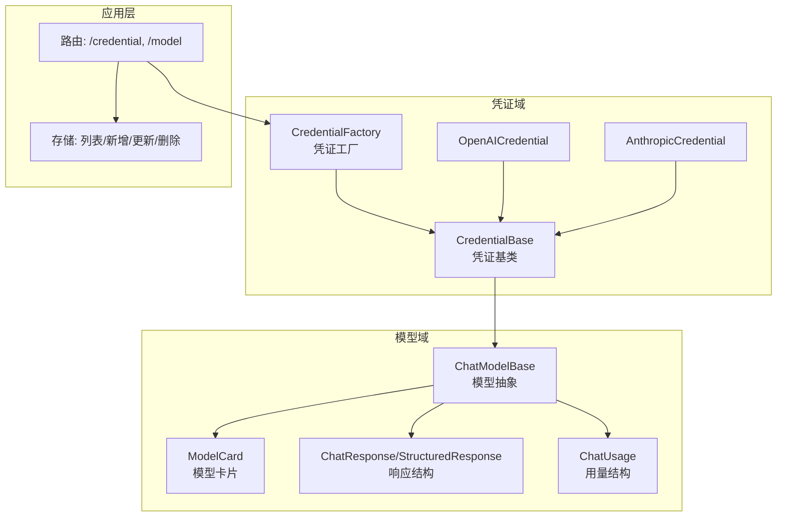
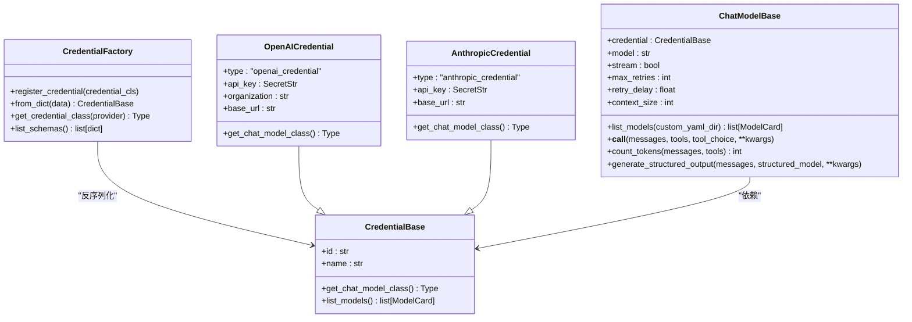
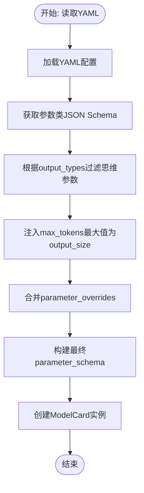
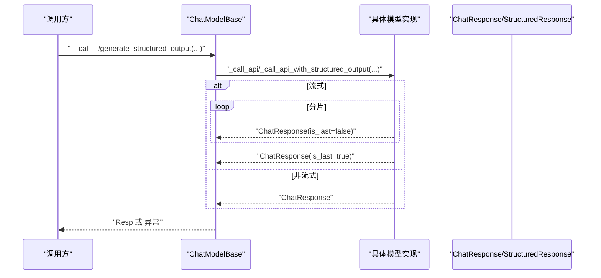
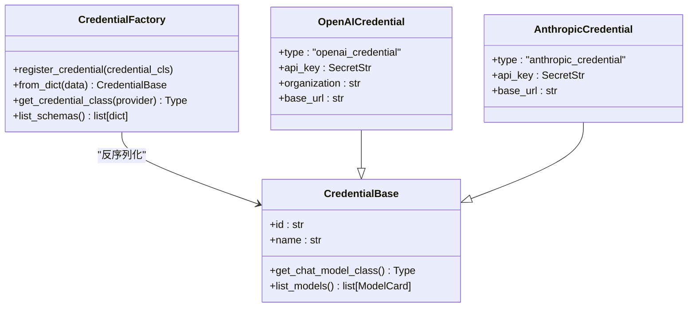
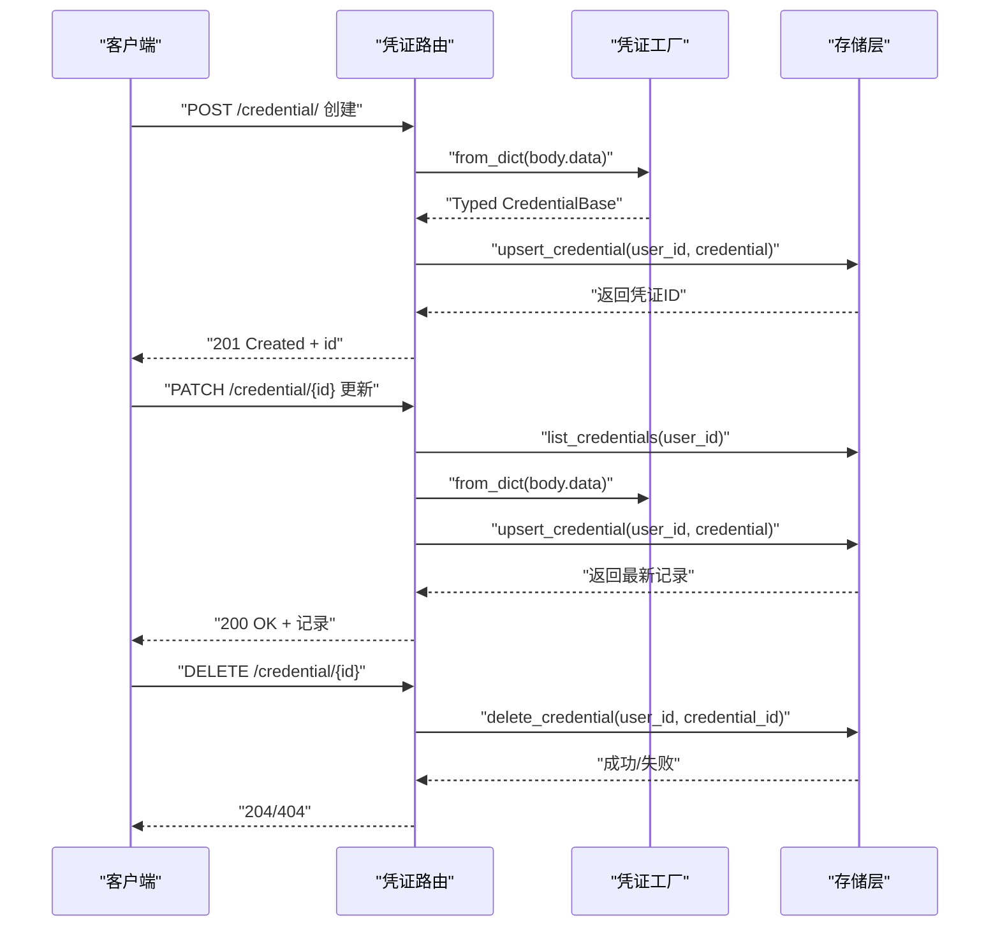
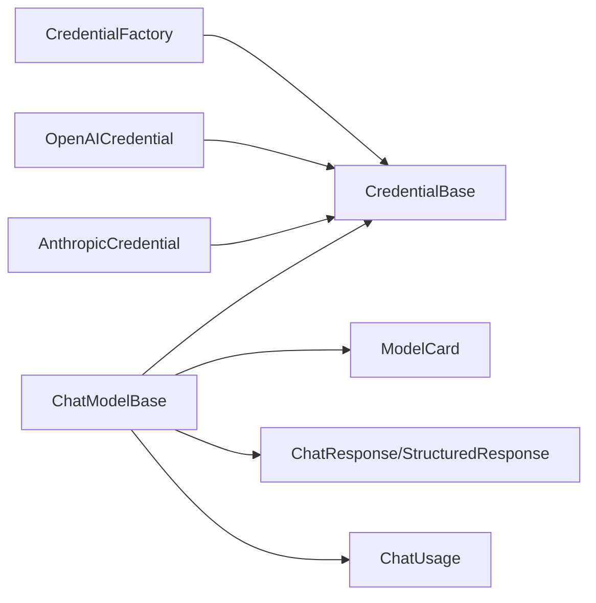

# 模型配置管理

<cite>
**本文引用的文件**
- [src/agentscope/model/_model_card.py](file://src/agentscope/model/_model_card.py)
- [src/agentscope/model/_model_response.py](file://src/agentscope/model/_model_response.py)
- [src/agentscope/model/_model_usage.py](file://src/agentscope/model/_model_usage.py)
- [src/agentscope/model/_base.py](file://src/agentscope/model/_base.py)
- [src/agentscope/credential/_base.py](file://src/agentscope/credential/_base.py)
- [src/agentscope/credential/_factory.py](file://src/agentscope/credential/_factory.py)
- [src/agentscope/credential/_openai.py](file://src/agentscope/credential/_openai.py)
- [src/agentscope/credential/_anthropic.py](file://src/agentscope/credential/_anthropic.py)
- [src/agentscope/app/_router/_credential.py](file://src/agentscope/app/_router/_credential.py)
- [src/agentscope/app/_router/_model.py](file://src/agentscope/app/_router/_model.py)
- [src/agentscope/app/storage/_model/_credential.py](file://src/agentscope/app/storage/_model/_credential.py)
- [src/agentscope/app/storage/_base.py](file://src/agentscope/app/storage/_base.py)
- [src/agentscope/model/_dashscope/_models/qwen-max-3.7.yaml](file://src/agentscope/model/_dashscope/_models/qwen-max-3.7.yaml)
- [src/agentscope/model/_openai_chat/_models/gpt-4o.yaml](file://src/agentscope/model/_openai_chat/_models/gpt-4o.yaml)
- [src/agentscope/model/_gemini/_models/gemini-2.5-flash.yaml](file://src/agentscope/model/_gemini/_models/gemini-2.5-flash.yaml)
- [src/agentscope/model/_ollama/_models/qwen3-14b.yaml](file://src/agentscope/model/_ollama/_models/qwen3-14b.yaml)
- [src/agentscope/model/_moonshot/_models/moonshot-v1-8k.yaml](file://src/agentscope/model/_moonshot/_models/moonshot-v1-8k.yaml)
- [src/agentscope/model/_deepseek/_models/deepseek-chat.yaml](file://src/agentscope/model/_deepseek/_models/deepseek-chat.yaml)
- [src/agentscope/model/_xai/_models/grok-3.yaml](file://src/agentscope/model/_xai/_models/grok-3.yaml)
- [src/agentscope/model/_anthropic/_models/claude-sonnet-4-6.yaml](file://src/agentscope/model/_anthropic/_models/claude-sonnet-4-6.yaml)
</cite>

## 目录
1. [简介](#简介)
2. [项目结构](#项目结构)
3. [核心组件](#核心组件)
4. [架构总览](#架构总览)
5. [详细组件分析](#详细组件分析)
6. [依赖关系分析](#依赖关系分析)
7. [性能考虑](#性能考虑)
8. [故障排查指南](#故障排查指南)
9. [结论](#结论)
10. [附录](#附录)

## 简介
本文件面向模型配置管理系统的使用者与维护者，系统性梳理以下主题：模型卡片（ModelCard）的数据结构与参数管理、模型响应解析与状态处理、用量统计与计费追踪、凭证管理（含BaseCredential基类、工厂模式与各提供商认证）、API密钥安全存储与访问控制、配置文件模板与动态更新最佳实践，以及配置验证、故障转移与降级策略。

## 项目结构
该系统围绕“模型”和“凭证”两大域展开：
- 模型域：统一的聊天模型抽象、模型卡片、响应与用量数据结构、各厂商具体实现与参数校验。
- 凭证域：凭证基类、凭证工厂、各提供商凭证类型及其与模型类的绑定关系。
- 应用层：路由与存储模块负责凭证的增删改查、序列化与反序列化。

图表来源
- [src/agentscope/model/_base.py:35-571](file://src/agentscope/model/_base.py#L35-L571)
- [src/agentscope/model/_model_card.py:11-151](file://src/agentscope/model/_model_card.py#L11-L151)
- [src/agentscope/model/_model_response.py:19-76](file://src/agentscope/model/_model_response.py#L19-L76)
- [src/agentscope/model/_model_usage.py:9-33](file://src/agentscope/model/_model_usage.py#L9-L33)
- [src/agentscope/credential/_base.py:12-51](file://src/agentscope/credential/_base.py#L12-L51)
- [src/agentscope/credential/_factory.py:18-115](file://src/agentscope/credential/_factory.py#L18-L115)
- [src/agentscope/credential/_openai.py:13-49](file://src/agentscope/credential/_openai.py#L13-L49)
- [src/agentscope/credential/_anthropic.py:13-40](file://src/agentscope/credential/_anthropic.py#L13-L40)
- [src/agentscope/app/_router/_credential.py:43-164](file://src/agentscope/app/_router/_credential.py#L43-L164)

章节来源
- [src/agentscope/model/__init__.py:1-34](file://src/agentscope/model/__init__.py#L1-L34)
- [src/agentscope/credential/__init__.py:1-28](file://src/agentscope/credential/__init__.py#L1-L28)

## 核心组件
- 模型卡片（ModelCard）：描述模型的基本属性、输入输出类型、上下文与输出长度限制、参数模式（schema）及覆盖项。
- 响应结构（ChatResponse/StructuredResponse）：封装内容块、唯一标识、时间戳、类型标记、用量与元数据。
- 用量结构（ChatUsage）：记录输入/输出token数、耗时、缓存相关token、类型与元数据。
- 凭证基类（CredentialBase）：统一凭证标识、显示名、与模型类的绑定接口。
- 凭证工厂（CredentialFactory）：注册内置凭证类型、按discriminator反序列化、查询类型、导出前端表单schema。
- 模型抽象（ChatModelBase）：统一初始化、重试策略、工具选择校验、令牌估算、结构化输出生成、调用流程。

章节来源
- [src/agentscope/model/_model_card.py:11-151](file://src/agentscope/model/_model_card.py#L11-L151)
- [src/agentscope/model/_model_response.py:19-76](file://src/agentscope/model/_model_response.py#L19-L76)
- [src/agentscope/model/_model_usage.py:9-33](file://src/agentscope/model/_model_usage.py#L9-L33)
- [src/agentscope/credential/_base.py:12-51](file://src/agentscope/credential/_base.py#L12-L51)
- [src/agentscope/credential/_factory.py:18-115](file://src/agentscope/credential/_factory.py#L18-L115)
- [src/agentscope/model/_base.py:35-571](file://src/agentscope/model/_base.py#L35-L571)

## 架构总览
系统采用“模型抽象 + 凭证抽象 + 工厂反序列化”的分层设计。模型通过凭证持有凭据并调用对应提供商API；凭证工厂负责类型识别与反序列化，供应用路由与存储模块使用。

图表来源
- [src/agentscope/credential/_base.py:12-51](file://src/agentscope/credential/_base.py#L12-L51)
- [src/agentscope/credential/_factory.py:18-115](file://src/agentscope/credential/_factory.py#L18-L115)
- [src/agentscope/credential/_openai.py:13-49](file://src/agentscope/credential/_openai.py#L13-L49)
- [src/agentscope/credential/_anthropic.py:13-40](file://src/agentscope/credential/_anthropic.py#L13-L40)
- [src/agentscope/model/_base.py:35-571](file://src/agentscope/model/_base.py#L35-L571)

## 详细组件分析

### 模型卡片（ModelCard）与参数管理
- 数据结构要点
  - 类型与名称：type固定为聊天模型类型，name用于标识，label用于前端展示。
  - 状态与弃用：status支持active/deprecated/sunset，deprecated_at记录弃用时间。
  - 输入输出类型：input_types与output_types默认文本类型，支持扩展。
  - 上下文与输出长度：context_size与output_size均为正整数约束。
  - 参数模式：parameter_schema由参数类JSON Schema与YAML覆盖合并而来；parameters_overrides允许在YAML中覆盖或隐藏字段。
- 参数合并逻辑
  - 自动过滤：若output_types不包含思维产物类型，则移除思维相关参数。
  - 自动注入：将max_tokens的最大值限制为output_size。
  - 覆盖合并：对overrides进行字典浅合并，支持隐藏字段（置空表示移除）。
- YAML加载与模型卡构建
  - 从YAML读取配置，结合参数类的JSON Schema生成最终参数模式，再实例化ModelCard。

图表来源
- [src/agentscope/model/_model_card.py:72-151](file://src/agentscope/model/_model_card.py#L72-L151)

章节来源
- [src/agentscope/model/_model_card.py:11-151](file://src/agentscope/model/_model_card.py#L11-L151)

### 模型响应处理机制
- 结构化响应
  - ChatResponse：包含内容块序列、是否最后片段、唯一ID、创建时间、类型标记、用量与元数据。
  - StructuredResponse：结构化输出字典、相同标识与类型字段。
- 解析与状态
  - 流式与非流式两种返回形态；is_last用于判断完整响应。
  - 元数据与用量可选，便于后续统计与追踪。
- 错误信息提取
  - 统一通过上层调用异常捕获与日志记录，结合重试策略进行恢复或失败上报。

图表来源
- [src/agentscope/model/_base.py:157-571](file://src/agentscope/model/_base.py#L157-L571)
- [src/agentscope/model/_model_response.py:19-76](file://src/agentscope/model/_model_response.py#L19-L76)

章节来源
- [src/agentscope/model/_model_response.py:19-76](file://src/agentscope/model/_model_response.py#L19-L76)
- [src/agentscope/model/_base.py:157-571](file://src/agentscope/model/_base.py#L157-L571)

### 用量统计与计费追踪
- ChatUsage结构
  - 输入/输出token计数、耗时、缓存相关token（创建与命中）、类型与可选元数据。
- 计费维度
  - 可基于input_tokens与output_tokens计算费用（需结合各提供商单价）。
  - 支持缓存命中场景下的token节省统计。
- 使用建议
  - 在响应解析后将ChatUsage写入持久化存储或指标系统，用于成本归集与告警。

章节来源
- [src/agentscope/model/_model_usage.py:9-33](file://src/agentscope/model/_model_usage.py#L9-L33)

### 凭证管理系统
- 基类与绑定
  - CredentialBase定义id/name，强制子类实现get_chat_model_class以绑定对应模型类；list_models默认委托给模型类。
- 工厂模式
  - 内置多种凭证类型，使用TypeAdapter配合discriminator字段进行反序列化；支持运行时注册自定义凭证类型。
  - 提供list_schemas导出前端表单schema，支持动态渲染。
- 各提供商凭证
  - OpenAICredential：API密钥、组织ID、可选自定义base_url。
  - AnthropicCredential：API密钥、可选自定义base_url。
  - 其他提供商（DashScope、DeepSeek、Gemini、Moonshot、Ollama、XAI）均遵循相同模式，通过工厂统一管理。

图表来源
- [src/agentscope/credential/_base.py:12-51](file://src/agentscope/credential/_base.py#L12-L51)
- [src/agentscope/credential/_factory.py:18-115](file://src/agentscope/credential/_factory.py#L18-L115)
- [src/agentscope/credential/_openai.py:13-49](file://src/agentscope/credential/_openai.py#L13-L49)
- [src/agentscope/credential/_anthropic.py:13-40](file://src/agentscope/credential/_anthropic.py#L13-L40)

章节来源
- [src/agentscope/credential/_base.py:12-51](file://src/agentscope/credential/_base.py#L12-L51)
- [src/agentscope/credential/_factory.py:18-115](file://src/agentscope/credential/_factory.py#L18-L115)
- [src/agentscope/credential/_openai.py:13-49](file://src/agentscope/credential/_openai.py#L13-L49)
- [src/agentscope/credential/_anthropic.py:13-40](file://src/agentscope/credential/_anthropic.py#L13-L40)

### API密钥安全存储、轮换与访问控制
- 安全存储
  - 使用SecretStr字段类型，避免明文泄露；序列化时自动屏蔽敏感信息。
  - 应用层路由提供凭证的增删改查接口，配合用户隔离与权限控制。
- 轮换策略
  - 通过更新凭证记录实现密钥轮换；旧密钥可保留过渡期，新密钥生效后逐步切换流量。
- 访问控制
  - 路由层基于当前用户ID进行凭证归属校验；更新/删除操作前先查询现有记录，确保仅操作本人凭证。

图表来源
- [src/agentscope/app/_router/_credential.py:43-164](file://src/agentscope/app/_router/_credential.py#L43-L164)
- [src/agentscope/credential/_factory.py:72-81](file://src/agentscope/credential/_factory.py#L72-L81)
- [src/agentscope/app/storage/_model/_credential.py](file://src/agentscope/app/storage/_model/_credential.py)

章节来源
- [src/agentscope/app/_router/_credential.py:43-164](file://src/agentscope/app/_router/_credential.py#L43-L164)
- [src/agentscope/app/storage/_base.py](file://src/agentscope/app/storage/_base.py)
- [src/agentscope/app/storage/_model/_credential.py](file://src/agentscope/app/storage/_model/_credential.py)

### 配置文件模板、环境变量与动态配置更新
- 模型配置模板
  - 各提供商的模型配置位于各自目录的_yaml文件中，包含name、label、status、input_types、output_types、context_size、output_size、parameter_overrides等字段。
  - 示例文件路径参考如下（节选）：
    - [src/agentscope/model/_dashscope/_models/qwen-max-3.7.yaml](file://src/agentscope/model/_dashscope/_models/qwen-max-3.7.yaml)
    - [src/agentscope/model/_openai_chat/_models/gpt-4o.yaml](file://src/agentscope/model/_openai_chat/_models/gpt-4o.yaml)
    - [src/agentscope/model/_gemini/_models/gemini-2.5-flash.yaml](file://src/agentscope/model/_gemini/_models/gemini-2.5-flash.yaml)
    - [src/agentscope/model/_ollama/_models/qwen3-14b.yaml](file://src/agentscope/model/_ollama/_models/qwen3-14b.yaml)
    - [src/agentscope/model/_moonshot/_models/moonshot-v1-8k.yaml](file://src/agentscope/model/_moonshot/_models/moonshot-v1-8k.yaml)
    - [src/agentscope/model/_deepseek/_models/deepseek-chat.yaml](file://src/agentscope/model/_deepseek/_models/deepseek-chat.yaml)
    - [src/agentscope/model/_xai/_models/grok-3.yaml](file://src/agentscope/model/_xai/_models/grok-3.yaml)
    - [src/agentscope/model/_anthropic/_models/claude-sonnet-4-6.yaml](file://src/agentscope/model/_anthropic/_models/claude-sonnet-4-6.yaml)
- 动态配置更新
  - ChatModelBase.list_models会扫描指定目录下的YAML文件，动态加载并构建ModelCard列表；支持自定义目录以实现热更新。
  - 凭证工厂支持运行时注册新类型，便于扩展新的提供商。

章节来源
- [src/agentscope/model/_base.py:110-155](file://src/agentscope/model/_base.py#L110-L155)
- [src/agentscope/credential/_factory.py:59-70](file://src/agentscope/credential/_factory.py#L59-L70)

### 配置验证、故障转移与降级策略
- 配置验证
  - ModelCard.from_yaml在构建参数schema时，结合参数类JSON Schema与YAML覆盖进行合并与校验；对思维参数与max_tokens上限进行自动处理。
- 故障转移
  - ChatModelBase.__call__与generate_structured_output提供统一的重试逻辑，可按提供商实现覆盖_get_retryable_exceptions以启用特定异常的自动重试。
- 降级策略
  - 对于不支持结构化输出的模型，系统通过注入“生成结构化输出”工具并在提示中强制调用的方式实现降级；若底层API拒绝强制工具调用，可改为依赖系统提醒提示。

章节来源
- [src/agentscope/model/_model_card.py:72-151](file://src/agentscope/model/_model_card.py#L72-L151)
- [src/agentscope/model/_base.py:99-108](file://src/agentscope/model/_base.py#L99-L108)
- [src/agentscope/model/_base.py:157-571](file://src/agentscope/model/_base.py#L157-L571)

## 依赖关系分析
- 模型层依赖
  - ChatModelBase依赖CredentialBase以获取凭据与模型列表；依赖消息与工具类型进行输入格式化与工具选择校验。
  - ModelCard依赖参数类JSON Schema与YAML覆盖，形成最终参数模式。
- 凭证层依赖
  - CredentialFactory依赖各提供商凭证类并通过TypeAdapter进行多态反序列化；CredentialBase依赖模型类进行绑定。
- 应用层依赖
  - 路由层依赖CredentialFactory进行凭证反序列化与类型查询；依赖存储层进行CRUD操作。

图表来源
- [src/agentscope/credential/_factory.py:18-115](file://src/agentscope/credential/_factory.py#L18-L115)
- [src/agentscope/credential/_base.py:12-51](file://src/agentscope/credential/_base.py#L12-L51)
- [src/agentscope/credential/_openai.py:13-49](file://src/agentscope/credential/_openai.py#L13-L49)
- [src/agentscope/credential/_anthropic.py:13-40](file://src/agentscope/credential/_anthropic.py#L13-L40)
- [src/agentscope/model/_base.py:35-571](file://src/agentscope/model/_base.py#L35-L571)
- [src/agentscope/model/_model_card.py:11-151](file://src/agentscope/model/_model_card.py#L11-L151)
- [src/agentscope/model/_model_response.py:19-76](file://src/agentscope/model/_model_response.py#L19-L76)
- [src/agentscope/model/_model_usage.py:9-33](file://src/agentscope/model/_model_usage.py#L9-L33)

## 性能考虑
- 令牌估算
  - ChatModelBase.count_tokens提供快速估算方法，适用于预估与限流；具体令牌数建议在实际调用后以用量结构为准。
- 流式输出
  - 流式响应可降低首字延迟，提升交互体验；需注意累积中间片段的内存占用。
- 重试与退避
  - 合理设置max_retries与retry_delay，避免对下游造成雪崩；对可重试异常进行精确分类。

## 故障排查指南
- 凭证相关
  - 若反序列化失败，检查凭证类型discriminator与字段完整性；确认CredentialFactory已注册对应类型。
  - 更新凭证后，确认存储层返回最新记录且路由层未抛出404。
- 模型配置
  - YAML加载失败时，检查字段类型与必填项；确认参数覆盖不会导致schema冲突。
  - 若结构化输出失败，检查底层模型是否支持工具调用或是否被强制工具调用阻断。
- 运行时异常
  - 查看重试日志与异常栈，定位网络超时、鉴权失败或参数非法等问题。

章节来源
- [src/agentscope/app/_router/_credential.py:100-135](file://src/agentscope/app/_router/_credential.py#L100-L135)
- [src/agentscope/model/_base.py:157-571](file://src/agentscope/model/_base.py#L157-L571)

## 结论
本系统通过统一的模型抽象与凭证抽象，结合工厂反序列化与动态配置加载，实现了跨提供商的模型卡片管理、响应解析与用量统计。凭证安全存储、轮换与访问控制由应用层路由与存储共同保障；配置验证、故障转移与降级策略确保了在复杂环境下的一致性与可靠性。建议在生产环境中配合监控与告警体系，持续优化重试与退避策略，并定期轮换密钥与更新模型配置。

## 附录
- 关键实现位置索引
  - 模型卡片：[src/agentscope/model/_model_card.py:11-151](file://src/agentscope/model/_model_card.py#L11-L151)
  - 响应结构：[src/agentscope/model/_model_response.py:19-76](file://src/agentscope/model/_model_response.py#L19-L76)
  - 用量结构：[src/agentscope/model/_model_usage.py:9-33](file://src/agentscope/model/_model_usage.py#L9-L33)
  - 模型抽象：[src/agentscope/model/_base.py:35-571](file://src/agentscope/model/_base.py#L35-L571)
  - 凭证基类：[src/agentscope/credential/_base.py:12-51](file://src/agentscope/credential/_base.py#L12-L51)
  - 凭证工厂：[src/agentscope/credential/_factory.py:18-115](file://src/agentscope/credential/_factory.py#L18-L115)
  - OpenAI凭证：[src/agentscope/credential/_openai.py:13-49](file://src/agentscope/credential/_openai.py#L13-L49)
  - Anthropic凭证：[src/agentscope/credential/_anthropic.py:13-40](file://src/agentscope/credential/_anthropic.py#L13-L40)
  - 凭证路由：[src/agentscope/app/_router/_credential.py:43-164](file://src/agentscope/app/_router/_credential.py#L43-L164)
  - 模型路由：[src/agentscope/app/_router/_model.py](file://src/agentscope/app/_router/_model.py)
  - 存储模型：[src/agentscope/app/storage/_model/_credential.py](file://src/agentscope/app/storage/_model/_credential.py)
  - 存储基类：[src/agentscope/app/storage/_base.py](file://src/agentscope/app/storage/_base.py)
  - 模型配置示例：参考各提供商_models目录下的.yaml文件