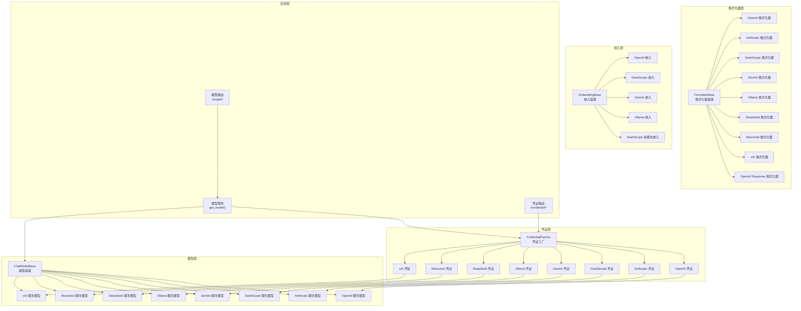
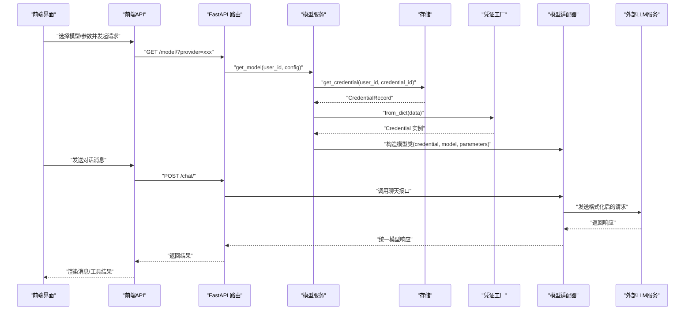
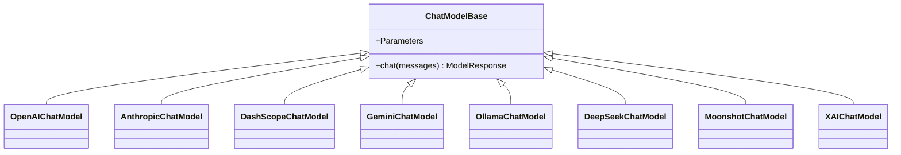
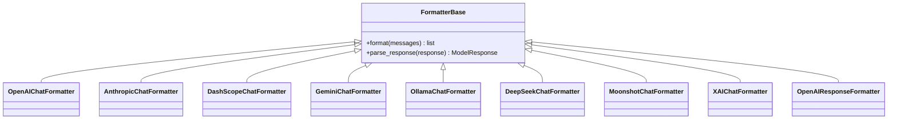
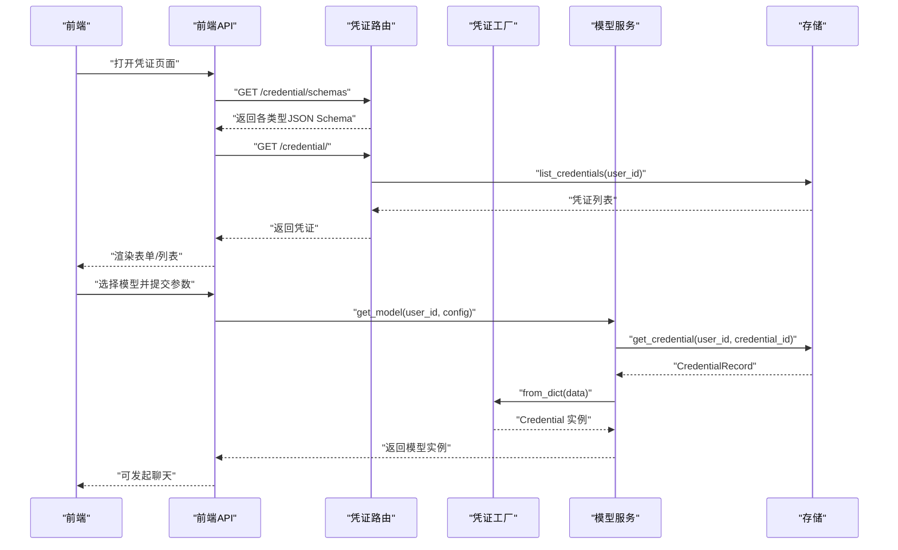
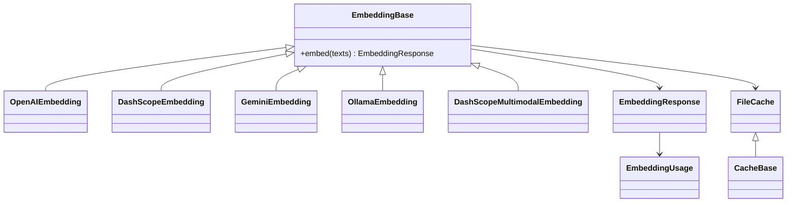
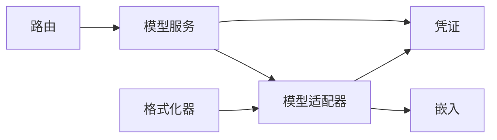

# 模型集成

<cite>
**本文引用的文件**
- [src/agentscope/formatter/__init__.py](file://src/agentscope/formatter/__init__.py)
- [src/agentscope/formatter/_formatter_base.py](file://src/agentscope/formatter/_formatter_base.py)
- [src/agentscope/formatter/_openai_formatter.py](file://src/agentscope/formatter/_openai_formatter.py)
- [src/agentscope/formatter/_anthropic_formatter.py](file://src/agentscope/formatter/_anthropic_formatter.py)
- [src/agentscope/formatter/_dashscope_formatter.py](file://src/agentscope/formatter/_dashscope_formatter.py)
- [src/agentscope/formatter/_gemini_formatter.py](file://src/agentscope/formatter/_gemini_formatter.py)
- [src/agentscope/formatter/_ollama_formatter.py](file://src/agentscope/formatter/_ollama_formatter.py)
- [src/agentscope/formatter/_deepseek_formatter.py](file://src/agentscope/formatter/_deepseek_formatter.py)
- [src/agentscope/formatter/_moonshot_formatter.py](file://src/agentscope/formatter/_moonshot_formatter.py)
- [src/agentscope/formatter/_xai_formatter.py](file://src/agentscope/formatter/_xai_formatter.py)
- [src/agentscope/formatter/_openai_response_formatter.py](file://src/agentscope/formatter/_openai_response_formatter.py)
- [src/agentscope/model/_base.py](file://src/agentscope/model/_base.py)
- [src/agentscope/model/_model_card.py](file://src/agentscope/model/_model_card.py)
- [src/agentscope/model/_openai_chat/_model.py](file://src/agentscope/model/_openai_chat/_model.py)
- [src/agentscope/model/_anthropic/_model.py](file://src/agentscope/model/_anthropic/_model.py)
- [src/agentscope/model/_dashscope/_model.py](file://src/agentscope/model/_dashscope/_model.py)
- [src/agentscope/model/_gemini/_model.py](file://src/agentscope/model/_gemini/_model.py)
- [src/agentscope/model/_ollama/_model.py](file://src/agentscope/model/_ollama/_model.py)
- [src/agentscope/model/_deepseek/_model.py](file://src/agentscope/model/_deepseek/_model.py)
- [src/agentscope/model/_moonshot/_model.py](file://src/agentscope/model/_moonshot/_model.py)
- [src/agentscope/model/_xai/_model.py](file://src/agentscope/model/_xai/_model.py)
- [src/agentscope/credential/_factory.py](file://src/agentscope/credential/_factory.py)
- [src/agentscope/credential/_base.py](file://src/agentscope/credential/_base.py)
- [src/agentscope/credential/_openai.py](file://src/agentscope/credential/_openai.py)
- [src/agentscope/credential/_anthropic.py](file://src/agentscope/credential/_anthropic.py)
- [src/agentscope/credential/_dashscope.py](file://src/agentscope/credential/_dashscope.py)
- [src/agentscope/credential/_gemini.py](file://src/agentscope/credential/_gemini.py)
- [src/agentscope/credential/_ollama.py](file://src/agentscope/credential/_ollama.py)
- [src/agentscope/credential/_deepseek.py](file://src/agentscope/credential/_deepseek.py)
- [src/agentscope/credential/_moonshot.py](file://src/agentscope/credential/_moonshot.py)
- [src/agentscope/credential/_xai.py](file://src/agentscope/credential/_xai.py)
- [src/agentscope/app/_service/_model.py](file://src/agentscope/app/_service/_model.py)
- [src/agentscope/app/_router/_credential.py](file://src/agentscope/app/_router/_credential.py)
- [src/agentscope/app/_router/_model.py](file://src/agentscope/app/_router/_model.py)
- [src/agentscope/embedding/_openai_embedding.py](file://src/agentscope/embedding/_openai_embedding.py)
- [src/agentscope/embedding/_dashscope_embedding.py](file://src/agentscope/embedding/_dashscope_embedding.py)
- [src/agentscope/embedding/_gemini_embedding.py](file://src/agentscope/embedding/_gemini_embedding.py)
- [src/agentscope/embedding/_ollama_embedding.py](file://src/agentscope/embedding/_ollama_embedding.py)
- [src/agentscope/embedding/_dashscope_multimodal_embedding.py](file://src/agentscope/embedding/_dashscope_multimodal_embedding.py)
- [src/agentscope/embedding/_embedding_base.py](file://src/agentscope/embedding/_embedding_base.py)
- [src/agentscope/embedding/_embedding_response.py](file://src/agentscope/embedding/_embedding_response.py)
- [src/agentscope/embedding/_embedding_usage.py](file://src/agentscope/embedding/_embedding_usage.py)
- [src/agentscope/embedding/_file_cache.py](file://src/agentscope/embedding/_file_cache.py)
- [src/agentscope/embedding/_cache_base.py](file://src/agentscope/embedding/_cache_base.py)
- [scripts/model_examples/openai_chat_call.py](file://scripts/model_examples/openai_chat_call.py)
- [scripts/model_examples/anthropic_call.py](file://scripts/model_examples/anthropic_call.py)
- [scripts/model_examples/dashscope_call.py](file://scripts/model_examples/dashscope_call.py)
- [scripts/model_examples/gemini_call.py](file://scripts/model_examples/gemini_call.py)
- [scripts/model_examples/ollama_call.py](file://scripts/model_examples/ollama_call.py)
- [scripts/model_examples/deepseek_call.py](file://scripts/model_examples/deepseek_call.py)
- [scripts/model_examples/moonshot_call.py](file://scripts/model_examples/moonshot_call.py)
- [scripts/model_examples/xai_call.py](file://scripts/model_examples/xai_call.py)
- [scripts/model_examples/openai_response_call.py](file://scripts/model_examples/openai_response_call.py)
- [examples/web_ui/frontend/src/api/model.ts](file://examples/web_ui/frontend/src/api/model.ts)
- [examples/web_ui/frontend/src/hooks/useAvailableModels.ts](file://examples/web_ui/frontend/src/hooks/useAvailableModels.ts)
- [examples/web_ui/frontend/src/components/popover/ModelParametersPopover.tsx](file://examples/web_ui/frontend/src/components/popover/ModelParametersPopover.tsx)
- [examples/web_ui/frontend/src/pages/credential/index.tsx](file://examples/web_ui/frontend/src/pages/credential/index.tsx)
- [examples/web_ui/frontend/src/api/credential.ts](file://examples/web_ui/frontend/src/api/credential.ts)
- [examples/web_ui/frontend/src/hooks/useCredentials.ts](file://examples/web_ui/frontend/src/hooks/useCredentials.ts)
- [tests/formatter_openai_response_test.py](file://tests/formatter_openai_response_test.py)
- [tests/formatter_gemini_test.py](file://tests/formatter_gemini_test.py)
- [tests/model_openai_chat_test.py](file://tests/model_openai_chat_test.py)
- [tests/model_gemini_test.py](file://tests/model_gemini_test.py)
- [tests/model_anthropic_test.py](file://tests/model_anthropic_test.py)
- [tests/model_dashscope_test.py](file://tests/model_dashscope_test.py)
- [tests/model_ollama_test.py](file://tests/model_ollama_test.py)
- [tests/model_deepseek_test.py](file://tests/model_deepseek_test.py)
- [tests/model_moonshot_test.py](file://tests/model_moonshot_test.py)
- [tests/model_xai_test.py](file://tests/model_xai_test.py)
</cite>

## 目录
1. [引言](#引言)
2. [项目结构](#项目结构)
3. [核心组件](#核心组件)
4. [架构总览](#架构总览)
5. [详细组件分析](#详细组件分析)
6. [依赖关系分析](#依赖关系分析)
7. [性能考虑](#性能考虑)
8. [故障排查指南](#故障排查指南)
9. [结论](#结论)
10. [附录](#附录)

## 引言
本文件系统性梳理 AgentScope 的模型集成体系，覆盖多厂商大语言模型（LLM）与嵌入模型的统一接入、格式化器（Formatter）、模型适配器设计、配置与凭证管理、以及前端交互与测试验证。重点说明 OpenAI、DashScope、Claude（Anthropic）、Gemini、Ollama、DeepSeek、Moonshot、xAI 等主流模型服务的集成方式与最佳实践，并提供性能优化、缓存策略与成本控制建议。

## 项目结构
AgentScope 将“凭证（Credential）—模型（Model）—格式化器（Formatter）—嵌入（Embedding）—应用服务（App Service/Router）”解耦为清晰层次：
- 凭证层：封装各平台 API 密钥与认证信息，提供工厂统一构建
- 模型层：面向不同厂商的聊天模型适配器，统一返回模型响应对象
- 格式化器层：将内部消息结构转换为各平台请求格式，或解析响应
- 嵌入层：提供各平台 Embedding 能力与缓存
- 应用层：FastAPI 路由与服务，负责从存储中加载凭证与配置，构造模型实例

图表来源
- [src/agentscope/credential/_factory.py](file://src/agentscope/credential/_factory.py)
- [src/agentscope/credential/_openai.py](file://src/agentscope/credential/_openai.py)
- [src/agentscope/credential/_anthropic.py](file://src/agentscope/credential/_anthropic.py)
- [src/agentscope/credential/_dashscope.py](file://src/agentscope/credential/_dashscope.py)
- [src/agentscope/credential/_gemini.py](file://src/agentscope/credential/_gemini.py)
- [src/agentscope/credential/_ollama.py](file://src/agentscope/credential/_ollama.py)
- [src/agentscope/credential/_deepseek.py](file://src/agentscope/credential/_deepseek.py)
- [src/agentscope/credential/_moonshot.py](file://src/agentscope/credential/_moonshot.py)
- [src/agentscope/credential/_xai.py](file://src/agentscope/credential/_xai.py)
- [src/agentscope/model/_base.py](file://src/agentscope/model/_base.py)
- [src/agentscope/model/_openai_chat/_model.py](file://src/agentscope/model/_openai_chat/_model.py)
- [src/agentscope/model/_anthropic/_model.py](file://src/agentscope/model/_anthropic/_model.py)
- [src/agentscope/model/_dashscope/_model.py](file://src/agentscope/model/_dashscope/_model.py)
- [src/agentscope/model/_gemini/_model.py](file://src/agentscope/model/_gemini/_model.py)
- [src/agentscope/model/_ollama/_model.py](file://src/agentscope/model/_ollama/_model.py)
- [src/agentscope/model/_deepseek/_model.py](file://src/agentscope/model/_deepseek/_model.py)
- [src/agentscope/model/_moonshot/_model.py](file://src/agentscope/model/_moonshot/_model.py)
- [src/agentscope/model/_xai/_model.py](file://src/agentscope/model/_xai/_model.py)
- [src/agentscope/formatter/_formatter_base.py](file://src/agentscope/formatter/_formatter_base.py)
- [src/agentscope/formatter/_openai_formatter.py](file://src/agentscope/formatter/_openai_formatter.py)
- [src/agentscope/formatter/_anthropic_formatter.py](file://src/agentscope/formatter/_anthropic_formatter.py)
- [src/agentscope/formatter/_dashscope_formatter.py](file://src/agentscope/formatter/_dashscope_formatter.py)
- [src/agentscope/formatter/_gemini_formatter.py](file://src/agentscope/formatter/_gemini_formatter.py)
- [src/agentscope/formatter/_ollama_formatter.py](file://src/agentscope/formatter/_ollama_formatter.py)
- [src/agentscope/formatter/_deepseek_formatter.py](file://src/agentscope/formatter/_deepseek_formatter.py)
- [src/agentscope/formatter/_moonshot_formatter.py](file://src/agentscope/formatter/_moonshot_formatter.py)
- [src/agentscope/formatter/_xai_formatter.py](file://src/agentscope/formatter/_xai_formatter.py)
- [src/agentscope/formatter/_openai_response_formatter.py](file://src/agentscope/formatter/_openai_response_formatter.py)
- [src/agentscope/embedding/_embedding_base.py](file://src/agentscope/embedding/_embedding_base.py)
- [src/agentscope/embedding/_openai_embedding.py](file://src/agentscope/embedding/_openai_embedding.py)
- [src/agentscope/embedding/_dashscope_embedding.py](file://src/agentscope/embedding/_dashscope_embedding.py)
- [src/agentscope/embedding/_gemini_embedding.py](file://src/agentscope/embedding/_gemini_embedding.py)
- [src/agentscope/embedding/_ollama_embedding.py](file://src/agentscope/embedding/_ollama_embedding.py)
- [src/agentscope/embedding/_dashscope_multimodal_embedding.py](file://src/agentscope/embedding/_dashscope_multimodal_embedding.py)
- [src/agentscope/app/_service/_model.py](file://src/agentscope/app/_service/_model.py)
- [src/agentscope/app/_router/_credential.py](file://src/agentscope/app/_router/_credential.py)
- [src/agentscope/app/_router/_model.py](file://src/agentscope/app/_router/_model.py)

章节来源
- [src/agentscope/formatter/__init__.py](file://src/agentscope/formatter/__init__.py)
- [src/agentscope/model/_base.py](file://src/agentscope/model/_base.py)
- [src/agentscope/model/_model_card.py](file://src/agentscope/model/_model_card.py)
- [src/agentscope/credential/_factory.py](file://src/agentscope/credential/_factory.py)
- [src/agentscope/app/_service/_model.py](file://src/agentscope/app/_service/_model.py)
- [src/agentscope/app/_router/_credential.py](file://src/agentscope/app/_router/_credential.py)
- [src/agentscope/app/_router/_model.py](file://src/agentscope/app/_router/_model.py)

## 核心组件
- 统一模型接口与参数映射
  - 模型基类定义统一的聊天接口与参数结构，各厂商模型通过适配器实现具体逻辑
  - 参数模式由模型卡（ModelCard）从 YAML 配置生成，自动注入最大输出、隐藏参数、思维开关等
- 格式化器（Formatter）
  - 将内部消息结构转换为各平台请求格式；解析响应并回写到统一的消息结构
  - 支持多模态输入（文本、图像）、工具调用、思维块（reasoning）等
- 凭证与配置管理
  - 凭证工厂根据类型动态构建对应凭证实例，支持 OpenAI、Anthropic、DashScope、Gemini、Ollama、DeepSeek、Moonshot、xAI
  - 模型服务按用户与配置从存储加载凭证，构造模型实例
- 嵌入模型与缓存
  - 提供 OpenAI、DashScope、Gemini、Ollama 及 DashScope 多模态嵌入能力
  - 支持文件缓存与通用缓存基类，降低重复计算与成本

章节来源
- [src/agentscope/model/_base.py](file://src/agentscope/model/_base.py)
- [src/agentscope/model/_model_card.py](file://src/agentscope/model/_model_card.py)
- [src/agentscope/formatter/_formatter_base.py](file://src/agentscope/formatter/_formatter_base.py)
- [src/agentscope/credential/_factory.py](file://src/agentscope/credential/_factory.py)
- [src/agentscope/app/_service/_model.py](file://src/agentscope/app/_service/_model.py)
- [src/agentscope/embedding/_embedding_base.py](file://src/agentscope/embedding/_embedding_base.py)
- [src/agentscope/embedding/_cache_base.py](file://src/agentscope/embedding/_cache_base.py)

## 架构总览
下图展示从 Web UI 到后端服务、凭证与模型适配器的完整调用链路。

图表来源
- [examples/web_ui/frontend/src/api/model.ts](file://examples/web_ui/frontend/src/api/model.ts)
- [examples/web_ui/frontend/src/hooks/useAvailableModels.ts](file://examples/web_ui/frontend/src/hooks/useAvailableModels.ts)
- [src/agentscope/app/_router/_model.py](file://src/agentscope/app/_router/_model.py)
- [src/agentscope/app/_service/_model.py](file://src/agentscope/app/_service/_model.py)
- [src/agentscope/credential/_factory.py](file://src/agentscope/credential/_factory.py)
- [src/agentscope/model/_base.py](file://src/agentscope/model/_base.py)

## 详细组件分析

### 统一模型接口与参数映射
- 模型基类
  - 定义统一的聊天接口与参数容器（Parameters），便于上层调用与序列化
- 模型卡（ModelCard）
  - 从 YAML 加载厂商模型配置，合并参数模式，自动过滤不支持的思维参数，注入最大输出上限
  - 输出模型名称、标签、上下文/输出大小、输入/输出类型、参数模式等元数据
- 各厂商模型适配器
  - OpenAI、Anthropic、DashScope、Gemini、Ollama、DeepSeek、Moonshot、xAI 分别在各自目录下实现适配器
  - 适配器负责调用对应 SDK 或 HTTP 接口，封装为统一的模型响应对象

图表来源
- [src/agentscope/model/_base.py](file://src/agentscope/model/_base.py)
- [src/agentscope/model/_openai_chat/_model.py](file://src/agentscope/model/_openai_chat/_model.py)
- [src/agentscope/model/_anthropic/_model.py](file://src/agentscope/model/_anthropic/_model.py)
- [src/agentscope/model/_dashscope/_model.py](file://src/agentscope/model/_dashscope/_model.py)
- [src/agentscope/model/_gemini/_model.py](file://src/agentscope/model/_gemini/_model.py)
- [src/agentscope/model/_ollama/_model.py](file://src/agentscope/model/_ollama/_model.py)
- [src/agentscope/model/_deepseek/_model.py](file://src/agentscope/model/_deepseek/_model.py)
- [src/agentscope/model/_moonshot/_model.py](file://src/agentscope/model/_moonshot/_model.py)
- [src/agentscope/model/_xai/_model.py](file://src/agentscope/model/_xai/_model.py)

章节来源
- [src/agentscope/model/_base.py](file://src/agentscope/model/_base.py)
- [src/agentscope/model/_model_card.py](file://src/agentscope/model/_model_card.py)
- [src/agentscope/model/_openai_chat/_model.py](file://src/agentscope/model/_openai_chat/_model.py)
- [src/agentscope/model/_anthropic/_model.py](file://src/agentscope/model/_anthropic/_model.py)
- [src/agentscope/model/_dashscope/_model.py](file://src/agentscope/model/_dashscope/_model.py)
- [src/agentscope/model/_gemini/_model.py](file://src/agentscope/model/_gemini/_model.py)
- [src/agentscope/model/_ollama/_model.py](file://src/agentscope/model/_ollama/_model.py)
- [src/agentscope/model/_deepseek/_model.py](file://src/agentscope/model/_deepseek/_model.py)
- [src/agentscope/model/_moonshot/_model.py](file://src/agentscope/model/_moonshot/_model.py)
- [src/agentscope/model/_xai/_model.py](file://src/agentscope/model/_xai/_model.py)

### 格式化器（Formatter）设计
- 设计原则
  - 输入：内部消息块（文本、工具调用、工具结果、思维块等）
  - 输出：各平台请求格式（如 OpenAI 的 messages、Gemini 的 contents 等）
  - 解析：将平台响应映射回统一消息结构，支持流式与非流式
- 统一基类
  - 提供通用的块类型识别、角色映射、多模态处理、工具调用/结果转换、思维块处理等
- 平台适配
  - OpenAI、Anthropic、DashScope、Gemini、Ollama、DeepSeek、Moonshot、xAI、OpenAI Response 等均有专用格式化器
  - 支持 Base64 图像、URL 图像、工具结果提升为后续用户消息、思维块拆分与回显等高级特性

图表来源
- [src/agentscope/formatter/_formatter_base.py](file://src/agentscope/formatter/_formatter_base.py)
- [src/agentscope/formatter/_openai_formatter.py](file://src/agentscope/formatter/_openai_formatter.py)
- [src/agentscope/formatter/_anthropic_formatter.py](file://src/agentscope/formatter/_anthropic_formatter.py)
- [src/agentscope/formatter/_dashscope_formatter.py](file://src/agentscope/formatter/_dashscope_formatter.py)
- [src/agentscope/formatter/_gemini_formatter.py](file://src/agentscope/formatter/_gemini_formatter.py)
- [src/agentscope/formatter/_ollama_formatter.py](file://src/agentscope/formatter/_ollama_formatter.py)
- [src/agentscope/formatter/_deepseek_formatter.py](file://src/agentscope/formatter/_deepseek_formatter.py)
- [src/agentscope/formatter/_moonshot_formatter.py](file://src/agentscope/formatter/_moonshot_formatter.py)
- [src/agentscope/formatter/_xai_formatter.py](file://src/agentscope/formatter/_xai_formatter.py)
- [src/agentscope/formatter/_openai_response_formatter.py](file://src/agentscope/formatter/_openai_response_formatter.py)

章节来源
- [src/agentscope/formatter/_formatter_base.py](file://src/agentscope/formatter/_formatter_base.py)
- [src/agentscope/formatter/_openai_formatter.py](file://src/agentscope/formatter/_openai_formatter.py)
- [src/agentscope/formatter/_anthropic_formatter.py](file://src/agentscope/formatter/_anthropic_formatter.py)
- [src/agentscope/formatter/_dashscope_formatter.py](file://src/agentscope/formatter/_dashscope_formatter.py)
- [src/agentscope/formatter/_gemini_formatter.py](file://src/agentscope/formatter/_gemini_formatter.py)
- [src/agentscope/formatter/_ollama_formatter.py](file://src/agentscope/formatter/_ollama_formatter.py)
- [src/agentscope/formatter/_deepseek_formatter.py](file://src/agentscope/formatter/_deepseek_formatter.py)
- [src/agentscope/formatter/_moonshot_formatter.py](file://src/agentscope/formatter/_moonshot_formatter.py)
- [src/agentscope/formatter/_xai_formatter.py](file://src/agentscope/formatter/_xai_formatter.py)
- [src/agentscope/formatter/_openai_response_formatter.py](file://src/agentscope/formatter/_openai_response_formatter.py)

### 凭证与配置管理
- 凭证工厂
  - 根据类型字典动态构建对应凭证实例，暴露统一的聊天模型类获取方法
- 凭证类型
  - OpenAI、Anthropic、DashScope、Gemini、Ollama、DeepSeek、Moonshot、xAI 各自实现认证与参数校验
- 模型服务
  - 从存储读取用户凭证，构造模型实例，完成参数校验与实例化
- 前端凭证管理
  - 提供凭证列表、模式、创建/更新/删除接口，前端 Hook 自动刷新列表

图表来源
- [src/agentscope/app/_router/_credential.py](file://src/agentscope/app/_router/_credential.py)
- [src/agentscope/app/_service/_model.py](file://src/agentscope/app/_service/_model.py)
- [src/agentscope/credential/_factory.py](file://src/agentscope/credential/_factory.py)
- [examples/web_ui/frontend/src/api/credential.ts](file://examples/web_ui/frontend/src/api/credential.ts)
- [examples/web_ui/frontend/src/hooks/useCredentials.ts](file://examples/web_ui/frontend/src/hooks/useCredentials.ts)

章节来源
- [src/agentscope/credential/_factory.py](file://src/agentscope/credential/_factory.py)
- [src/agentscope/credential/_openai.py](file://src/agentscope/credential/_openai.py)
- [src/agentscope/credential/_anthropic.py](file://src/agentscope/credential/_anthropic.py)
- [src/agentscope/credential/_dashscope.py](file://src/agentscope/credential/_dashscope.py)
- [src/agentscope/credential/_gemini.py](file://src/agentscope/credential/_gemini.py)
- [src/agentscope/credential/_ollama.py](file://src/agentscope/credential/_ollama.py)
- [src/agentscope/credential/_deepseek.py](file://src/agentscope/credential/_deepseek.py)
- [src/agentscope/credential/_moonshot.py](file://src/agentscope/credential/_moonshot.py)
- [src/agentscope/credential/_xai.py](file://src/agentscope/credential/_xai.py)
- [src/agentscope/app/_service/_model.py](file://src/agentscope/app/_service/_model.py)
- [src/agentscope/app/_router/_credential.py](file://src/agentscope/app/_router/_credential.py)
- [examples/web_ui/frontend/src/api/credential.ts](file://examples/web_ui/frontend/src/api/credential.ts)
- [examples/web_ui/frontend/src/hooks/useCredentials.ts](file://examples/web_ui/frontend/src/hooks/useCredentials.ts)

### 嵌入模型与缓存
- 嵌入基类
  - 统一嵌入接口与响应结构，支持批量向量生成与使用统计
- 平台实现
  - OpenAI、DashScope、Gemini、Ollama 及 DashScope 多模态嵌入
- 缓存策略
  - 文件缓存与通用缓存基类，支持键值映射与过期控制，减少重复请求

图表来源
- [src/agentscope/embedding/_embedding_base.py](file://src/agentscope/embedding/_embedding_base.py)
- [src/agentscope/embedding/_openai_embedding.py](file://src/agentscope/embedding/_openai_embedding.py)
- [src/agentscope/embedding/_dashscope_embedding.py](file://src/agentscope/embedding/_dashscope_embedding.py)
- [src/agentscope/embedding/_gemini_embedding.py](file://src/agentscope/embedding/_gemini_embedding.py)
- [src/agentscope/embedding/_ollama_embedding.py](file://src/agentscope/embedding/_ollama_embedding.py)
- [src/agentscope/embedding/_dashscope_multimodal_embedding.py](file://src/agentscope/embedding/_dashscope_multimodal_embedding.py)
- [src/agentscope/embedding/_embedding_response.py](file://src/agentscope/embedding/_embedding_response.py)
- [src/agentscope/embedding/_embedding_usage.py](file://src/agentscope/embedding/_embedding_usage.py)
- [src/agentscope/embedding/_file_cache.py](file://src/agentscope/embedding/_file_cache.py)
- [src/agentscope/embedding/_cache_base.py](file://src/agentscope/embedding/_cache_base.py)

章节来源
- [src/agentscope/embedding/_embedding_base.py](file://src/agentscope/embedding/_embedding_base.py)
- [src/agentscope/embedding/_openai_embedding.py](file://src/agentscope/embedding/_openai_embedding.py)
- [src/agentscope/embedding/_dashscope_embedding.py](file://src/agentscope/embedding/_dashscope_embedding.py)
- [src/agentscope/embedding/_gemini_embedding.py](file://src/agentscope/embedding/_gemini_embedding.py)
- [src/agentscope/embedding/_ollama_embedding.py](file://src/agentscope/embedding/_ollama_embedding.py)
- [src/agentscope/embedding/_dashscope_multimodal_embedding.py](file://src/agentscope/embedding/_dashscope_multimodal_embedding.py)
- [src/agentscope/embedding/_embedding_response.py](file://src/agentscope/embedding/_embedding_response.py)
- [src/agentscope/embedding/_embedding_usage.py](file://src/agentscope/embedding/_embedding_usage.py)
- [src/agentscope/embedding/_file_cache.py](file://src/agentscope/embedding/_file_cache.py)
- [src/agentscope/embedding/_cache_base.py](file://src/agentscope/embedding/_cache_base.py)

### 具体模型使用示例与最佳实践
- 示例脚本
  - OpenAI：聊天、多智能体、多模态
  - Anthropic：聊天、多智能体、多模态
  - DashScope：聊天、多智能体、多模态
  - Gemini：聊天、多智能体、多模态
  - Ollama：聊天、多智能体、多模态
  - DeepSeek：聊天、多智能体、多模态
  - Moonshot：聊天、多智能体、多模态
  - xAI：聊天、多智能体、多模态
  - OpenAI Response：响应式格式化
- 最佳实践
  - 使用模型卡参数模式约束参数范围，避免无效调用
  - 对多模态输入进行预处理（Base64/URL），确保格式化器正确识别
  - 工具调用与结果需成对出现，必要时将工具结果提升为后续用户消息
  - 控制上下文长度与输出长度，结合缓存与压缩策略降低成本

章节来源
- [scripts/model_examples/openai_chat_call.py](file://scripts/model_examples/openai_chat_call.py)
- [scripts/model_examples/anthropic_call.py](file://scripts/model_examples/anthropic_call.py)
- [scripts/model_examples/dashscope_call.py](file://scripts/model_examples/dashscope_call.py)
- [scripts/model_examples/gemini_call.py](file://scripts/model_examples/gemini_call.py)
- [scripts/model_examples/ollama_call.py](file://scripts/model_examples/ollama_call.py)
- [scripts/model_examples/deepseek_call.py](file://scripts/model_examples/deepseek_call.py)
- [scripts/model_examples/moonshot_call.py](file://scripts/model_examples/moonshot_call.py)
- [scripts/model_examples/xai_call.py](file://scripts/model_examples/xai_call.py)
- [scripts/model_examples/openai_response_call.py](file://scripts/model_examples/openai_response_call.py)

## 依赖关系分析
- 组件内聚与耦合
  - 凭证工厂与模型服务之间通过统一接口耦合，便于扩展新平台
  - 格式化器与模型适配器通过消息块协议解耦，便于维护与测试
- 外部依赖
  - 各平台 SDK 或 HTTP 接口调用，需关注超时、重试与限流策略
- 循环依赖
  - 当前结构未见循环导入，模块职责清晰

图表来源
- [src/agentscope/formatter/_formatter_base.py](file://src/agentscope/formatter/_formatter_base.py)
- [src/agentscope/model/_base.py](file://src/agentscope/model/_base.py)
- [src/agentscope/credential/_factory.py](file://src/agentscope/credential/_factory.py)
- [src/agentscope/app/_service/_model.py](file://src/agentscope/app/_service/_model.py)
- [src/agentscope/app/_router/_model.py](file://src/agentscope/app/_router/_model.py)

章节来源
- [src/agentscope/formatter/_formatter_base.py](file://src/agentscope/formatter/_formatter_base.py)
- [src/agentscope/model/_base.py](file://src/agentscope/model/_base.py)
- [src/agentscope/credential/_factory.py](file://src/agentscope/credential/_factory.py)
- [src/agentscope/app/_service/_model.py](file://src/agentscope/app/_service/_model.py)
- [src/agentscope/app/_router/_model.py](file://src/agentscope/app/_router/_model.py)

## 性能考虑
- 上下文压缩与截断
  - 在调用前对历史消息进行压缩，避免超出模型上下文上限
- 流式响应与并发
  - 对支持流式的平台启用流式传输，减少首字节延迟；合理控制并发数
- 缓存策略
  - 嵌入与图片/工具结果等中间产物使用文件缓存，命中则直接复用
- 参数优化
  - 使用模型卡参数模式限制 max_tokens、temperature 等，避免过度消耗
- 成本控制
  - 优先使用轻量模型处理简单任务；对高频查询开启缓存；监控输出长度与调用次数

## 故障排查指南
- 常见问题
  - 凭证缺失：检查凭证是否存在于存储中，模型服务会抛出未找到异常
  - 参数越界：模型卡参数模式会限制最大输出与范围，修正后重试
  - 多模态格式错误：确认 Base64/URL 是否被格式化器正确识别
  - 工具调用未闭合：工具调用与工具结果必须成对出现
- 单元测试参考
  - OpenAI Response 格式化器测试覆盖多步推理、思维块回显、工具结果提升等场景
  - Gemini 格式化器测试覆盖 Base64 图像、工具结果提升等场景
  - 各平台模型适配器测试覆盖聊天、多模态、多智能体等典型流程

章节来源
- [tests/formatter_openai_response_test.py](file://tests/formatter_openai_response_test.py)
- [tests/formatter_gemini_test.py](file://tests/formatter_gemini_test.py)
- [tests/model_openai_chat_test.py](file://tests/model_openai_chat_test.py)
- [tests/model_gemini_test.py](file://tests/model_gemini_test.py)
- [tests/model_anthropic_test.py](file://tests/model_anthropic_test.py)
- [tests/model_dashscope_test.py](file://tests/model_dashscope_test.py)
- [tests/model_ollama_test.py](file://tests/model_ollama_test.py)
- [tests/model_deepseek_test.py](file://tests/model_deepseek_test.py)
- [tests/model_moonshot_test.py](file://tests/model_moonshot_test.py)
- [tests/model_xai_test.py](file://tests/model_xai_test.py)

## 结论
AgentScope 通过“凭证—模型—格式化器—嵌入”的分层设计，实现了对多家 LLM 与嵌入服务的统一接入与管理。借助模型卡参数模式、格式化器协议与缓存机制，系统在易用性、可扩展性与成本控制方面取得平衡。建议在实际部署中结合业务场景选择合适模型与参数，并充分利用缓存与压缩策略以获得更优性能与更低开销。

## 附录
- 前端模型参数面板
  - 基于模型卡参数模式动态渲染参数表单，支持布尔、数值、字符串等类型
  - 支持必填项提示与范围限制，提升用户体验与参数正确率

章节来源
- [examples/web_ui/frontend/src/components/popover/ModelParametersPopover.tsx](file://examples/web_ui/frontend/src/components/popover/ModelParametersPopover.tsx)
- [examples/web_ui/frontend/src/hooks/useAvailableModels.ts](file://examples/web_ui/frontend/src/hooks/useAvailableModels.ts)
- [examples/web_ui/frontend/src/api/model.ts](file://examples/web_ui/frontend/src/api/model.ts)
- [examples/web_ui/frontend/src/pages/credential/index.tsx](file://examples/web_ui/frontend/src/pages/credential/index.tsx)