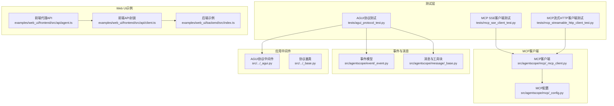
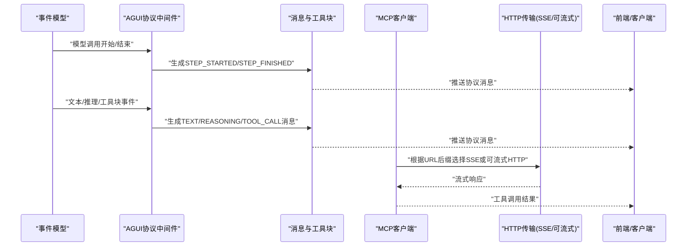
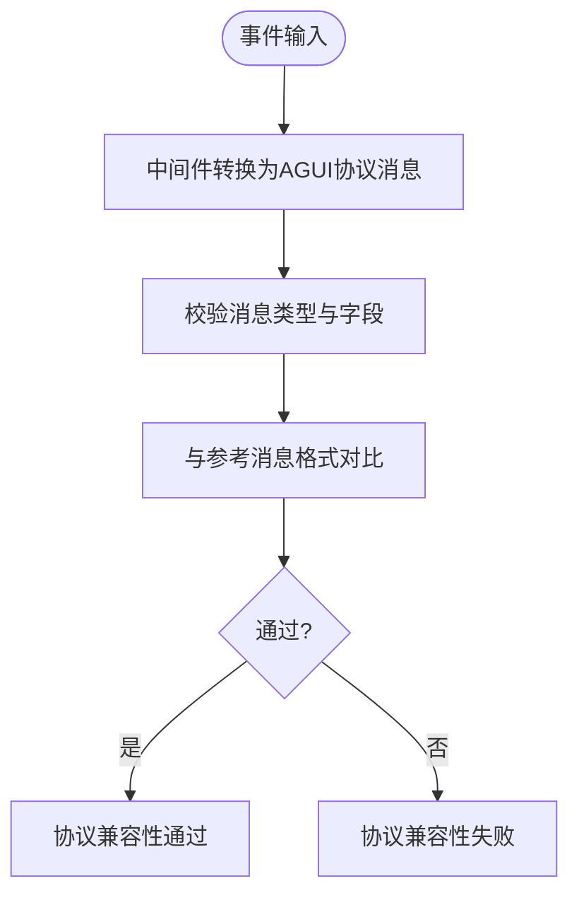
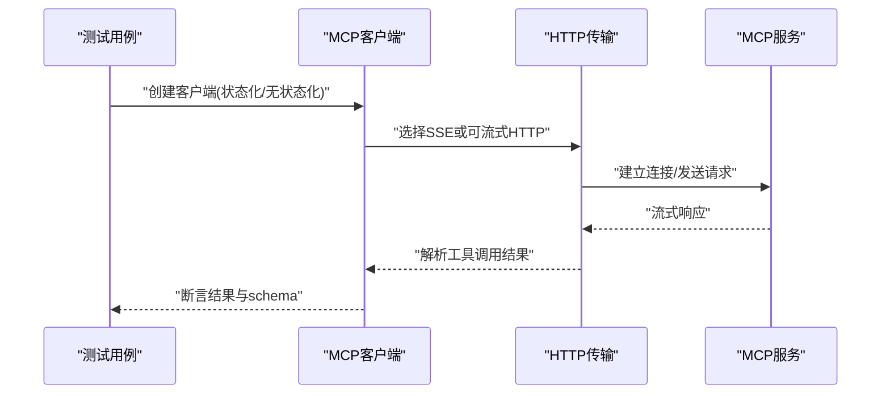
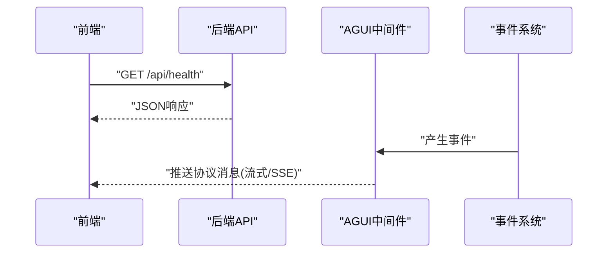
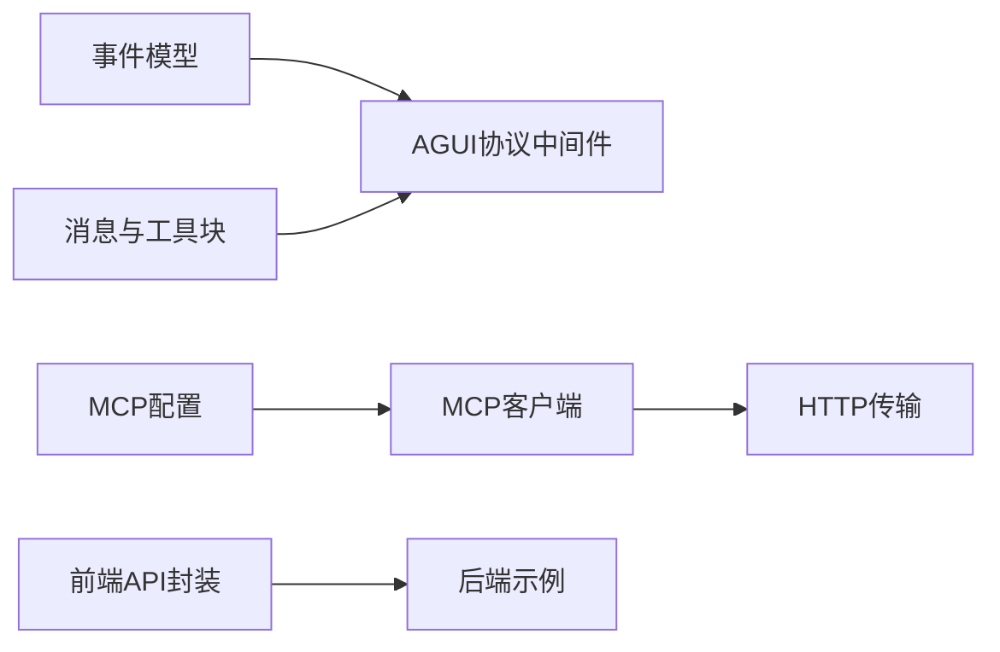

# API测试

<cite>
**本文引用的文件**
- [agui协议测试](file://tests/agui_protocol_test.py)
- [MCP SSE客户端测试](file://tests/mcp_sse_client_test.py)
- [MCP流式HTTP客户端测试](file://tests/mcp_streamable_http_client_test.py)
- [AGUI协议中间件](file://src/agentscope/app/_middleware/_protocol/_agui.py)
- [协议基类](file://src/agentscope/app/_middleware/_protocol/_base.py)
- [MCP客户端](file://src/agentscope/mcp/_mcp_client.py)
- [MCP配置](file://src/agentscope/mcp/_config.py)
- [事件模型](file://src/agentscope/event/_event.py)
- [消息与工具块](file://src/agentscope/message/_base.py)
- [Web UI后端示例](file://examples/web_ui/backend/src/index.ts)
- [Web UI前端API封装](file://examples/web_ui/frontend/src/api/client.ts)
- [Web UI前端代理API](file://examples/web_ui/frontend/src/api/agent.ts)
</cite>

## 目录
1. [引言](#引言)
2. [项目结构](#项目结构)
3. [核心组件](#核心组件)
4. [架构总览](#架构总览)
5. [详细组件分析](#详细组件分析)
6. [依赖关系分析](#依赖关系分析)
7. [性能考虑](#性能考虑)
8. [故障排查指南](#故障排查指南)
9. [结论](#结论)
10. [附录](#附录)

## 引言
本文件面向AgentScope的API测试实践，聚焦以下目标：
- AGUI协议测试：覆盖协议兼容性验证、消息格式测试与通信协议验证。
- MCP客户端测试：涵盖SSE客户端、可流式HTTP客户端与WebSocket连接测试策略。
- API端点测试：包含RESTful API、实时通信与协议转换测试。
- 安全性、性能与稳定性测试：提供可操作的实施方法与建议。
- 测试工具与测试数据使用指南：帮助快速搭建本地测试环境与复现实验场景。

## 项目结构
AgentScope在测试与应用层提供了完整的API测试支撑：
- 测试用例集中在tests目录，覆盖AGUI协议、MCP客户端（SSE/HTTP）、消息与事件等。
- 应用中间件与协议定义位于src/agentscope/app/_middleware/_protocol，负责事件到AGUI协议的消息映射。
- MCP客户端位于src/agentscope/mcp，支持HTTP(SSE)与可流式HTTP传输，并提供状态化/无状态化两种模式。
- Web UI示例展示了REST API与前端请求封装，便于进行端到端与实时通信测试。

图表来源
- [agui协议测试:1-393](file://tests/agui_protocol_test.py#L1-L393)
- [MCP SSE客户端测试:1-204](file://tests/mcp_sse_client_test.py#L1-L204)
- [MCP流式HTTP客户端测试:1-200](file://tests/mcp_streamable_http_client_test.py#L1-L200)
- [AGUI协议中间件:1-200](file://src/agentscope/app/_middleware/_protocol/_agui.py#L1-L200)
- [协议基类:1-200](file://src/agentscope/app/_middleware/_protocol/_base.py#L1-L200)
- [MCP客户端:176-220](file://src/agentscope/mcp/_mcp_client.py#L176-L220)
- [MCP配置:1-200](file://src/agentscope/mcp/_config.py#L1-L200)
- [事件模型:1-200](file://src/agentscope/event/_event.py#L1-L200)
- [消息与工具块:1-200](file://src/agentscope/message/_base.py#L1-L200)
- [Web UI后端示例:1-16](file://examples/web_ui/backend/src/index.ts#L1-L16)
- [Web UI前端API封装:39-111](file://examples/web_ui/frontend/src/api/client.ts#L39-L111)
- [Web UI前端代理API:1-22](file://examples/web_ui/frontend/src/api/agent.ts#L1-L22)

章节来源
- [agui协议测试:1-393](file://tests/agui_protocol_test.py#L1-L393)
- [MCP SSE客户端测试:1-204](file://tests/mcp_sse_client_test.py#L1-L204)
- [MCP流式HTTP客户端测试:1-200](file://tests/mcp_streamable_http_client_test.py#L1-L200)
- [AGUI协议中间件:1-200](file://src/agentscope/app/_middleware/_protocol/_agui.py#L1-L200)
- [协议基类:1-200](file://src/agentscope/app/_middleware/_protocol/_base.py#L1-L200)
- [MCP客户端:176-220](file://src/agentscope/mcp/_mcp_client.py#L176-L220)
- [MCP配置:1-200](file://src/agentscope/mcp/_config.py#L1-L200)
- [事件模型:1-200](file://src/agentscope/event/_event.py#L1-L200)
- [消息与工具块:1-200](file://src/agentscope/message/_base.py#L1-L200)
- [Web UI后端示例:1-16](file://examples/web_ui/backend/src/index.ts#L1-L16)
- [Web UI前端API封装:39-111](file://examples/web_ui/frontend/src/api/client.ts#L39-L111)
- [Web UI前端代理API:1-22](file://examples/web_ui/frontend/src/api/agent.ts#L1-L22)

## 核心组件
- AGUI协议中间件：将内部事件转换为AGUI协议消息，覆盖生命周期、文本消息、推理消息、工具调用与结果、数据块等类型。
- MCP客户端：根据URL后缀自动选择SSE或可流式HTTP传输；支持状态化/无状态化连接；提供统一的工具调用接口。
- 事件与消息：定义了丰富的事件类型（如模型调用开始/结束、文本块增量、工具调用、外部执行等）以及消息块结构。
- Web UI示例：提供基础健康检查端点与前端请求封装，便于进行端到端与实时通信测试。

章节来源
- [AGUI协议中间件:1-200](file://src/agentscope/app/_middleware/_protocol/_agui.py#L1-L200)
- [协议基类:1-200](file://src/agentscope/app/_middleware/_protocol/_base.py#L1-L200)
- [MCP客户端:176-220](file://src/agentscope/mcp/_mcp_client.py#L176-L220)
- [事件模型:1-200](file://src/agentscope/event/_event.py#L1-L200)
- [消息与工具块:1-200](file://src/agentscope/message/_base.py#L1-L200)
- [Web UI后端示例:1-16](file://examples/web_ui/backend/src/index.ts#L1-L16)
- [Web UI前端API封装:39-111](file://examples/web_ui/frontend/src/api/client.ts#L39-L111)

## 架构总览
下图展示从事件到AGUI协议消息的转换流程，以及MCP客户端与HTTP传输的关系：

图表来源
- [AGUI协议中间件:1-200](file://src/agentscope/app/_middleware/_protocol/_agui.py#L1-L200)
- [事件模型:1-200](file://src/agentscope/event/_event.py#L1-L200)
- [消息与工具块:1-200](file://src/agentscope/message/_base.py#L1-L200)
- [MCP客户端:176-220](file://src/agentscope/mcp/_mcp_client.py#L176-L220)

## 详细组件分析

### AGUI协议测试
- 协议兼容性验证：通过构造不同事件序列，验证中间件是否正确输出对应协议消息类型与字段。
- 消息格式测试：覆盖STEP_STARTED/STEP_FINISHED、TEXT_MESSAGE_START/CONTENT/END、REASONING_MESSAGE_START/CONTENT/END、TOOL_CALL_START/ARGS/END、TOOL_RESULT_*、DATA_BLOCK_*等。
- 通信协议验证：确保消息中的标识符（如reply_id、block_id、tool_call_id）与父消息关联一致。

图表来源
- [agui协议测试:39-393](file://tests/agui_protocol_test.py#L39-L393)
- [AGUI协议中间件:1-200](file://src/agentscope/app/_middleware/_protocol/_agui.py#L1-L200)

章节来源
- [agui协议测试:1-393](file://tests/agui_protocol_test.py#L1-L393)
- [AGUI协议中间件:1-200](file://src/agentscope/app/_middleware/_protocol/_agui.py#L1-L200)
- [事件模型:1-200](file://src/agentscope/event/_event.py#L1-L200)
- [消息与工具块:1-200](file://src/agentscope/message/_base.py#L1-L200)

### MCP客户端测试策略
- SSE客户端测试：验证无状态与有状态两种模式下的工具调用、幂等性与工具模式(schema)返回一致性。
- 可流式HTTP客户端测试：验证流式响应的连续性与工具调用结果的完整性。
- WebSocket连接测试：可通过扩展MCP客户端以支持WS（基于现有HTTP传输抽象），重点验证握手、心跳与断线重连。

图表来源
- [MCP SSE客户端测试:113-192](file://tests/mcp_sse_client_test.py#L113-L192)
- [MCP流式HTTP客户端测试:1-200](file://tests/mcp_streamable_http_client_test.py#L1-L200)
- [MCP客户端:176-220](file://src/agentscope/mcp/_mcp_client.py#L176-L220)

章节来源
- [MCP SSE客户端测试:1-204](file://tests/mcp_sse_client_test.py#L1-L204)
- [MCP流式HTTP客户端测试:1-200](file://tests/mcp_streamable_http_client_test.py#L1-L200)
- [MCP客户端:176-220](file://src/agentscope/mcp/_mcp_client.py#L176-L220)
- [MCP配置:1-200](file://src/agentscope/mcp/_config.py#L1-L200)

### API端点测试方法
- RESTful API测试：利用Web UI后端示例的健康检查端点，验证CORS、JSON解析与错误处理。
- 实时通信测试：结合前端请求封装与后端SSE/流式HTTP端点，验证流式响应的可读性与客户端解析逻辑。
- 协议转换测试：验证从内部事件到AGUI协议消息的转换是否符合预期，确保消息体结构与字段命名一致。

图表来源
- [Web UI后端示例:10-12](file://examples/web_ui/backend/src/index.ts#L10-L12)
- [Web UI前端API封装:49-71](file://examples/web_ui/frontend/src/api/client.ts#L49-L71)
- [Web UI前端代理API:11-22](file://examples/web_ui/frontend/src/api/agent.ts#L11-L22)
- [AGUI协议中间件:1-200](file://src/agentscope/app/_middleware/_protocol/_agui.py#L1-L200)

章节来源
- [Web UI后端示例:1-16](file://examples/web_ui/backend/src/index.ts#L1-L16)
- [Web UI前端API封装:39-111](file://examples/web_ui/frontend/src/api/client.ts#L39-L111)
- [Web UI前端代理API:1-22](file://examples/web_ui/frontend/src/api/agent.ts#L1-L22)

## 依赖关系分析
- 中间件依赖事件与消息模块，输出标准化的AGUI协议消息。
- MCP客户端依赖MCP配置，按URL后缀自动选择SSE或可流式HTTP传输。
- 前端API封装依赖后端端点，统一处理错误与流式响应。

图表来源
- [事件模型:1-200](file://src/agentscope/event/_event.py#L1-L200)
- [消息与工具块:1-200](file://src/agentscope/message/_base.py#L1-L200)
- [AGUI协议中间件:1-200](file://src/agentscope/app/_middleware/_protocol/_agui.py#L1-L200)
- [MCP配置:1-200](file://src/agentscope/mcp/_config.py#L1-L200)
- [MCP客户端:176-220](file://src/agentscope/mcp/_mcp_client.py#L176-L220)
- [Web UI前端API封装:39-111](file://examples/web_ui/frontend/src/api/client.ts#L39-L111)
- [Web UI后端示例:1-16](file://examples/web_ui/backend/src/index.ts#L1-L16)

章节来源
- [事件模型:1-200](file://src/agentscope/event/_event.py#L1-L200)
- [消息与工具块:1-200](file://src/agentscope/message/_base.py#L1-L200)
- [AGUI协议中间件:1-200](file://src/agentscope/app/_middleware/_protocol/_agui.py#L1-L200)
- [MCP配置:1-200](file://src/agentscope/mcp/_config.py#L1-L200)
- [MCP客户端:176-220](file://src/agentscope/mcp/_mcp_client.py#L176-L220)
- [Web UI前端API封装:39-111](file://examples/web_ui/frontend/src/api/client.ts#L39-L111)
- [Web UI后端示例:1-16](file://examples/web_ui/backend/src/index.ts#L1-L16)

## 性能考虑
- 连接复用：优先使用状态化MCP客户端以减少握手开销。
- 流式传输：对长文本或大对象采用SSE或可流式HTTP，避免一次性加载。
- 超时与重试：合理设置超时时间与指数退避重试，提升网络波动下的稳定性。
- 并发控制：限制并发工具调用数量，避免阻塞与资源争用。
- 缓存策略：对重复参数的工具调用结果进行缓存，降低后端压力。

## 故障排查指南
- AGUI协议消息异常
  - 现象：消息类型缺失或字段不匹配。
  - 排查：核对事件到协议的映射规则，确认标识符关联关系。
  - 参考：[AGUI协议中间件:1-200](file://src/agentscope/app/_middleware/_protocol/_agui.py#L1-L200)
- MCP客户端连接失败
  - 现象：SSE/HTTP连接超时或断开。
  - 排查：检查URL后缀、认证头、超时配置与服务器可达性。
  - 参考：[MCP客户端:176-220](file://src/agentscope/mcp/_mcp_client.py#L176-L220)，[MCP配置:1-200](file://src/agentscope/mcp/_config.py#L1-L200)
- 前端请求错误
  - 现象：HTTP 4xx/5xx，错误信息解析失败。
  - 排查：检查CORS、Content-Type、错误详情提取逻辑。
  - 参考：[Web UI前端API封装:39-111](file://examples/web_ui/frontend/src/api/client.ts#L39-L111)，[Web UI后端示例:10-12](file://examples/web_ui/backend/src/index.ts#L10-L12)

章节来源
- [AGUI协议中间件:1-200](file://src/agentscope/app/_middleware/_protocol/_agui.py#L1-L200)
- [MCP客户端:176-220](file://src/agentscope/mcp/_mcp_client.py#L176-L220)
- [MCP配置:1-200](file://src/agentscope/mcp/_config.py#L1-L200)
- [Web UI前端API封装:39-111](file://examples/web_ui/frontend/src/api/client.ts#L39-L111)
- [Web UI后端示例:10-12](file://examples/web_ui/backend/src/index.ts#L10-L12)

## 结论
通过上述测试策略与组件分析，可以系统性地验证AgentScope的API在协议兼容性、消息格式、实时通信与协议转换方面的质量。结合安全性、性能与稳定性测试建议，能够进一步提升系统的可靠性与用户体验。

## 附录
- 测试工具与命令
  - 使用pytest运行测试：pytest tests/agui_protocol_test.py
  - 运行MCP相关测试：pytest tests/mcp_sse_client_test.py tests/mcp_streamable_http_client_test.py
- 测试数据准备
  - 事件数据：参考事件模型与消息块定义，构造典型事件序列。
  - MCP工具schema：参考测试中schema定义，确保工具名称与参数结构一致。
- 端到端测试建议
  - 启动Web UI后端示例，使用前端API封装访问健康检查端点。
  - 在本地启动MCP服务，配置SSE或可流式HTTP端点，运行相应测试用例。