# 单元测试

<cite>
**本文引用的文件**
- [run_tests.py](file://scripts/model_examples/run_tests.py)
- [test_template.py](file://tests/test_template.py)
- [utils.py](file://tests/utils.py)
- [model_openai_chat_test.py](file://tests/model_openai_chat_test.py)
- [model_openai_response_test.py](file://tests/model_openai_response_test.py)
- [model_gemini_test.py](file://tests/model_gemini_test.py)
- [model_dashscope_test.py](file://tests/model_dashscope_test.py)
- [builtin_bash_test.py](file://tests/builtin_bash_test.py)
- [builtin_edit_test.py](file://tests/builtin_edit_test.py)
- [builtin_glob_test.py](file://tests/builtin_glob_test.py)
- [builtin_grep_test.py](file://tests/builtin_grep_test.py)
- [builtin_read_test.py](file://tests/builtin_read_test.py)
- [builtin_write_test.py](file://tests/builtin_write_test.py)
- [builtin_file_cache_test.py](file://tests/builtin_file_cache_test.py)
- [permission_engine_test.py](file://tests/permission_engine_test.py)
- [permission_bash_parser_test.py](file://tests/permission_bash_parser_test.py)
- [event_test.py](file://tests/event_test.py)
- [event_to_message_test.py](file://tests/event_to_message_test.py)
- [message_test.py](file://tests/message_test.py)
- [toolkit_test.py](file://tests/toolkit_test.py)
- [toolkit_skill_test.py](file://tests/toolkit_skill_test.py)
- [toolkit_task_test.py](file://tests/toolkit_task_test.py)
- [task_tool_test.py](file://tests/task_tool_test.py)
- [workspace_docker_test.py](file://tests/workspace_docker_test.py)
- [workspace_e2b_test.py](file://tests/workspace_e2b_test.py)
- [workspace_local_test.py](file://tests/workspace_local_test.py)
- [middleware_test.py](file://tests/middleware_test.py)
- [tracing_test.py](file://tests/tracing_test.py)
- [tool_offload_middleware_test.py](file://tests/tool_offload_middleware_test.py)
- [mcp_sse_client_test.py](file://tests/mcp_sse_client_test.py)
- [mcp_streamable_http_client_test.py](file://tests/mcp_streamable_http_client_test.py)
- [hitl_user_confirmation_test.py](file://tests/hitl_user_confirmation_test.py)
- [hitl_mixed_interrupt.py](file://tests/hitl_mixed_interrupt.py)
- [hitl_external_execution_test.py](file://tests/hitl_external_execution_test.py)
- [compress_context_test.py](file://tests/compress_context_test.py)
- [compress_tool_result_test.py](file://tests/compress_tool_result_test.py)
- [storage_redis_test.py](file://tests/storage_redis_test.py)
- [skill_loader_test.py](file://tests/skill_loader_test.py)
</cite>

## 目录
1. [简介](#简介)
2. [项目结构](#项目结构)
3. [核心组件](#核心组件)
4. [架构总览](#架构总览)
5. [详细组件分析](#详细组件分析)
6. [依赖关系分析](#依赖关系分析)
7. [性能考量](#性能考量)
8. [故障排查指南](#故障排查指南)
9. [结论](#结论)
10. [附录](#附录)

## 简介
本文件面向AgentScope项目的单元测试体系，系统性梳理测试设计原则与实现方法，覆盖单个组件功能测试与边界条件测试；重点阐述智能体、工具、事件系统、消息传递、权限控制等核心模块的单元测试策略，并给出可复用的测试用例模板与测试数据准备方法，帮助开发者高效编写高质量的单元测试。

## 项目结构
AgentScope的测试组织遵循“按模块分层”的策略：在tests目录下为每个子系统或特性提供独立的测试文件，同时通过统一的测试运行脚本进行批量执行与汇总统计。整体结构如下：

```mermaid
graph TB
subgraph "测试入口与运行器"
RT["scripts/model_examples/run_tests.py"]
end
subgraph "通用测试工具"
TU["tests/utils.py"]
TT["tests/test_template.py"]
end
subgraph "模型适配层测试"
MOC["tests/model_openai_chat_test.py"]
MOR["tests/model_openai_response_test.py"]
MG["tests/model_gemini_test.py"]
MD["tests/model_dashscope_test.py"]
end
subgraph "内置工具测试"
BB["tests/builtin_bash_test.py"]
BE["tests/builtin_edit_test.py"]
BG["tests/builtin_glob_test.py"]
BGrep["tests/builtin_grep_test.py"]
BR["tests/builtin_read_test.py"]
BW["tests/builtin_write_test.py"]
BFC["tests/builtin_file_cache_test.py"]
end
subgraph "权限与安全"
PE["tests/permission_engine_test.py"]
PBP["tests/permission_bash_parser_test.py"]
end
subgraph "事件与消息"
ET["tests/event_test.py"]
E2M["tests/event_to_message_test.py"]
MT["tests/message_test.py"]
end
subgraph "工具集与任务"
TK["tests/toolkit_test.py"]
TKS["tests/toolkit_skill_test.py"]
TKT["tests/toolkit_task_test.py"]
TTASK["tests/task_tool_test.py"]
end
subgraph "工作空间与中间件"
WD["tests/workspace_docker_test.py"]
WE["tests/workspace_e2b_test.py"]
WL["tests/workspace_local_test.py"]
MID["tests/middleware_test.py"]
TR["tests/tracing_test.py"]
TOM["tests/tool_offload_middleware_test.py"]
end
subgraph "MCP与人机交互"
MCPSSE["tests/mcp_sse_client_test.py"]
MCPHTTP["tests/mcp_streamable_http_client_test.py"]
HITL1["tests/hitl_user_confirmation_test.py"]
HITL2["tests/hitl_mixed_interrupt.py"]
HITL3["tests/hitl_external_execution_test.py"]
end
subgraph "压缩与存储"
CC["tests/compress_context_test.py"]
CTR["tests/compress_tool_result_test.py"]
SR["tests/storage_redis_test.py"]
end
RT --> MOC
RT --> MOR
RT --> MG
RT --> MD
RT --> BB
RT --> BE
RT --> BG
RT --> BGrep
RT --> BR
RT --> BW
RT --> BFC
RT --> PE
RT --> PBP
RT --> ET
RT --> E2M
RT --> MT
RT --> TK
RT --> TKS
RT --> TKT
RT --> TTASK
RT --> WD
RT --> WE
RT --> WL
RT --> MID
RT --> TR
RT --> TOM
RT --> MCPSSE
RT --> MCPHTTP
RT --> HITL1
RT --> HITL2
RT --> HITL3
RT --> CC
RT --> CTR
RT --> SR
RT --> TU
RT --> TT
```

图表来源
- [run_tests.py](file://scripts/model_examples/run_tests.py)
- [utils.py](file://tests/utils.py)
- [test_template.py](file://tests/test_template.py)
- [model_openai_chat_test.py](file://tests/model_openai_chat_test.py)
- [model_openai_response_test.py](file://tests/model_openai_response_test.py)
- [model_gemini_test.py](file://tests/model_gemini_test.py)
- [model_dashscope_test.py](file://tests/model_dashscope_test.py)
- [builtin_bash_test.py](file://tests/builtin_bash_test.py)
- [builtin_edit_test.py](file://tests/builtin_edit_test.py)
- [builtin_glob_test.py](file://tests/builtin_glob_test.py)
- [builtin_grep_test.py](file://tests/builtin_grep_test.py)
- [builtin_read_test.py](file://tests/builtin_read_test.py)
- [builtin_write_test.py](file://tests/builtin_write_test.py)
- [builtin_file_cache_test.py](file://tests/builtin_file_cache_test.py)
- [permission_engine_test.py](file://tests/permission_engine_test.py)
- [permission_bash_parser_test.py](file://tests/permission_bash_parser_test.py)
- [event_test.py](file://tests/event_test.py)
- [event_to_message_test.py](file://tests/event_to_message_test.py)
- [message_test.py](file://tests/message_test.py)
- [toolkit_test.py](file://tests/toolkit_test.py)
- [toolkit_skill_test.py](file://tests/toolkit_skill_test.py)
- [toolkit_task_test.py](file://tests/toolkit_task_test.py)
- [task_tool_test.py](file://tests/task_tool_test.py)
- [workspace_docker_test.py](file://tests/workspace_docker_test.py)
- [workspace_e2b_test.py](file://tests/workspace_e2b_test.py)
- [workspace_local_test.py](file://tests/workspace_local_test.py)
- [middleware_test.py](file://tests/middleware_test.py)
- [tracing_test.py](file://tests/tracing_test.py)
- [tool_offload_middleware_test.py](file://tests/tool_offload_middleware_test.py)
- [mcp_sse_client_test.py](file://tests/mcp_sse_client_test.py)
- [mcp_streamable_http_client_test.py](file://tests/mcp_streamable_http_client_test.py)
- [hitl_user_confirmation_test.py](file://tests/hitl_user_confirmation_test.py)
- [hitl_mixed_interrupt.py](file://tests/hitl_mixed_interrupt.py)
- [hitl_external_execution_test.py](file://tests/hitl_external_execution_test.py)
- [compress_context_test.py](file://tests/compress_context_test.py)
- [compress_tool_result_test.py](file://tests/compress_tool_result_test.py)
- [storage_redis_test.py](file://tests/storage_redis_test.py)

章节来源
- [run_tests.py](file://scripts/model_examples/run_tests.py)
- [utils.py](file://tests/utils.py)
- [test_template.py](file://tests/test_template.py)

## 核心组件
- 测试运行器与报告
  - 统一入口：通过脚本对各模块测试进行批量执行、超时控制、输出捕获与汇总。
  - 关键能力：支持按提供方（provider）与测试类型筛选、静默/实时输出切换、失败时打印捕获输出。
- 测试模板与工具
  - 模板：基于异步TestCase的模板类，便于统一setUp/tearDown与异步测试编排。
  - 工具：提供AnyString断言辅助、Mock模型与凭证、消息与响应比较工具等，降低测试复杂度。
- 模型适配层测试
  - 针对不同大模型SDK（如OpenAI Chat、OpenAI Responses、Gemini、DashScope）构建模拟响应与流式片段，覆盖非流式与流式两种路径。
- 内置工具测试
  - 覆盖文件读写、编辑、查找、匹配、Bash执行、缓存等常用工具，关注错误处理与边界条件。
- 权限与安全
  - 权限引擎与Bash解析器的规则校验与异常分支测试。
- 事件与消息
  - 事件生命周期、事件到消息转换、消息格式与字段校验。
- 工具集与任务
  - 工具包、技能加载、任务工具的组合与状态管理。
- 工作空间与中间件
  - Docker/E2B/本地工作空间、中间件链路、追踪与工具卸载中间件。
- MCP与人机交互
  - SSE客户端、可流式HTTP客户端、用户确认、混合中断与外部执行。
- 压缩与存储
  - 上下文压缩、工具结果压缩、Redis存储。
  
章节来源
- [run_tests.py](file://scripts/model_examples/run_tests.py)
- [test_template.py](file://tests/test_template.py)
- [utils.py](file://tests/utils.py)

## 架构总览
下图展示测试运行器如何调度各模块测试，并以统一方式收集结果与输出：

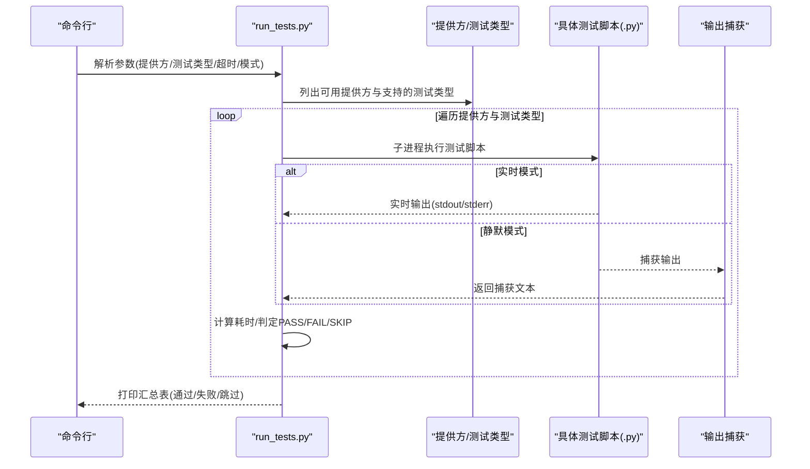

图表来源
- [run_tests.py](file://scripts/model_examples/run_tests.py)

## 详细组件分析

### 测试运行器与报告（run_tests.py）
- 设计要点
  - 使用子进程执行每个测试脚本，避免相互污染；支持超时控制与返回码判定。
  - 支持静默/实时输出模式，失败时自动打印捕获输出，便于定位问题。
  - 提供“列出”模式，展示各提供方的可用性与支持的测试类型。
- 边界与错误处理
  - 脚本不存在或不被支持时标记为SKIP；超时统一标记为FAIL。
  - 失败时保留stdout+stderr，便于后续分析。
- 性能与可维护性
  - 通过列表化提供方与测试类型，减少重复配置；统一汇总表输出，便于CI集成。

章节来源
- [run_tests.py](file://scripts/model_examples/run_tests.py)

### 测试模板与通用工具（test_template.py, utils.py）
- 测试模板
  - 异步TestCase基类，统一异步生命周期钩子，便于扩展。
- 通用工具
  - AnyString：用于断言任意字符串值，简化消息/标识符断言。
  - MockCredential/MockModel：模拟模型调用，支持设置非流式/流式响应序列，便于验证多轮对话与流式输出。
  - 比较工具：打印期望与实际结构，辅助调试。

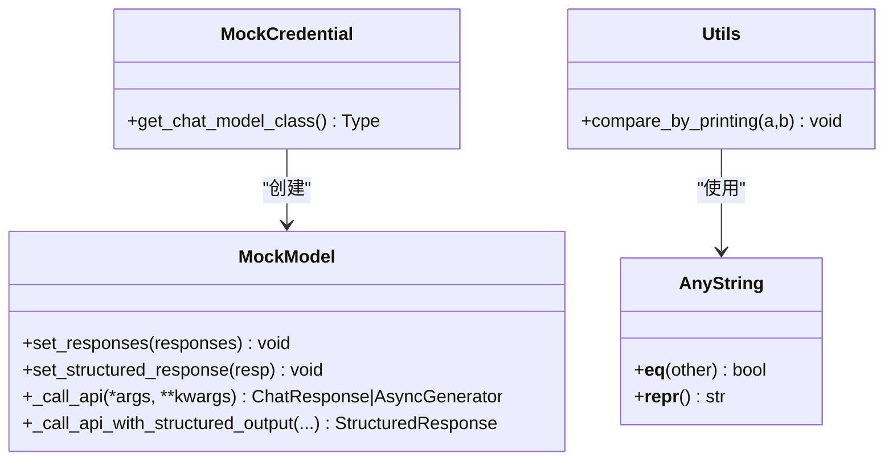

图表来源
- [utils.py](file://tests/utils.py)
- [test_template.py](file://tests/test_template.py)

章节来源
- [test_template.py](file://tests/test_template.py)
- [utils.py](file://tests/utils.py)

### 模型适配层测试（OpenAI Chat/Gemini/DashScope/OpenAI Responses）
- OpenAI Chat
  - 构造非流式与流式响应，模拟tool_calls、reasoning_content、音频等字段，覆盖完整消息链路。
- OpenAI Responses
  - 构造Responses API输出，包含reasoning、message、function_call三类事件，验证聚合逻辑。
- Gemini
  - 构造Part对象，支持text/thought/function_call，验证candidates/content/parts结构。
- DashScope
  - 类似OpenAI Chat的响应构造，覆盖delta_text/delta_reasoning/usage等字段。

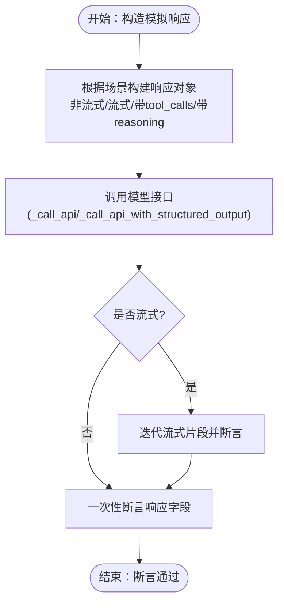

图表来源
- [model_openai_chat_test.py](file://tests/model_openai_chat_test.py)
- [model_openai_response_test.py](file://tests/model_openai_response_test.py)
- [model_gemini_test.py](file://tests/model_gemini_test.py)
- [model_dashscope_test.py](file://tests/model_dashscope_test.py)

章节来源
- [model_openai_chat_test.py](file://tests/model_openai_chat_test.py)
- [model_openai_response_test.py](file://tests/model_openai_response_test.py)
- [model_gemini_test.py](file://tests/model_gemini_test.py)
- [model_dashscope_test.py](file://tests/model_dashscope_test.py)

### 内置工具测试（文件/编辑/查找/匹配/Bash/缓存）
- 文件操作
  - 读取/写入/编辑/全局匹配/内容搜索：覆盖正常路径、文件不存在、权限不足、路径越权等边界。
- Bash执行
  - 正常命令、超时、非零退出码、非法命令、路径注入等边界条件。
- 缓存
  - 命中/未命中、过期、并发访问、磁盘空间不足等场景。

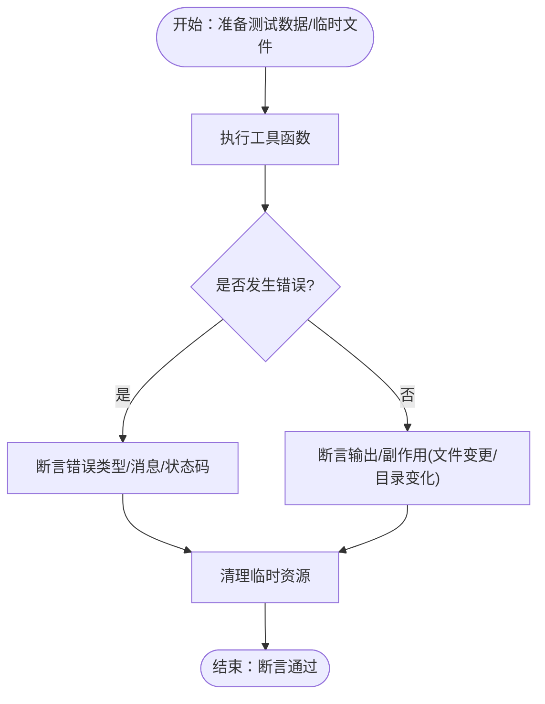

图表来源
- [builtin_read_test.py](file://tests/builtin_read_test.py)
- [builtin_write_test.py](file://tests/builtin_write_test.py)
- [builtin_edit_test.py](file://tests/builtin_edit_test.py)
- [builtin_glob_test.py](file://tests/builtin_glob_test.py)
- [builtin_grep_test.py](file://tests/builtin_grep_test.py)
- [builtin_bash_test.py](file://tests/builtin_bash_test.py)
- [builtin_file_cache_test.py](file://tests/builtin_file_cache_test.py)

章节来源
- [builtin_read_test.py](file://tests/builtin_read_test.py)
- [builtin_write_test.py](file://tests/builtin_write_test.py)
- [builtin_edit_test.py](file://tests/builtin_edit_test.py)
- [builtin_glob_test.py](file://tests/builtin_glob_test.py)
- [builtin_grep_test.py](file://tests/builtin_grep_test.py)
- [builtin_bash_test.py](file://tests/builtin_bash_test.py)
- [builtin_file_cache_test.py](file://tests/builtin_file_cache_test.py)

### 权限控制与安全（权限引擎、Bash解析器）
- 权限引擎
  - 规则匹配、上下文变量替换、拒绝/允许分支、异常输入处理。
- Bash解析器
  - 命令白名单、参数转义、路径解析、危险字符过滤。

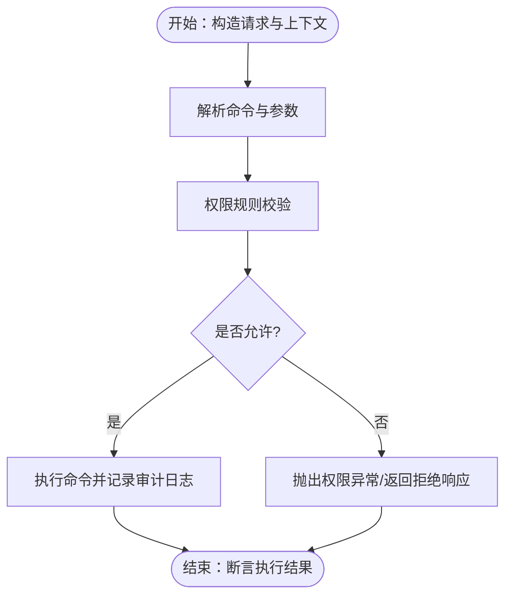

图表来源
- [permission_engine_test.py](file://tests/permission_engine_test.py)
- [permission_bash_parser_test.py](file://tests/permission_bash_parser_test.py)

章节来源
- [permission_engine_test.py](file://tests/permission_engine_test.py)
- [permission_bash_parser_test.py](file://tests/permission_bash_parser_test.py)

### 事件系统与消息传递（事件、事件到消息、消息）
- 事件生命周期
  - 创建、传播、订阅、取消、清理，覆盖异常中断与重试机制。
- 事件到消息转换
  - 字段映射、类型转换、缺失字段默认值、非法格式处理。
- 消息格式
  - 必填字段校验、嵌套结构断言、序列化/反序列化一致性。

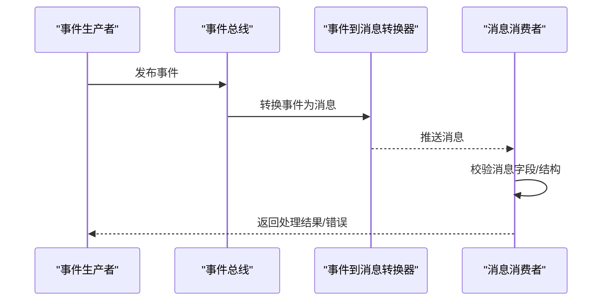

图表来源
- [event_test.py](file://tests/event_test.py)
- [event_to_message_test.py](file://tests/event_to_message_test.py)
- [message_test.py](file://tests/message_test.py)

章节来源
- [event_test.py](file://tests/event_test.py)
- [event_to_message_test.py](file://tests/event_to_message_test.py)
- [message_test.py](file://tests/message_test.py)

### 工具集与任务（工具包、技能、任务工具）
- 工具包
  - 工具注册、调用链、参数校验、结果聚合。
- 技能加载
  - 动态加载、签名校验、依赖注入、异常回退。
- 任务工具
  - 任务创建/查询/更新/删除，状态流转与幂等性。

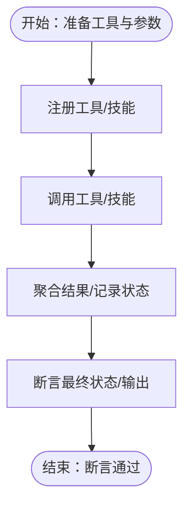

图表来源
- [toolkit_test.py](file://tests/toolkit_test.py)
- [toolkit_skill_test.py](file://tests/toolkit_skill_test.py)
- [toolkit_task_test.py](file://tests/toolkit_task_test.py)
- [task_tool_test.py](file://tests/task_tool_test.py)

章节来源
- [toolkit_test.py](file://tests/toolkit_test.py)
- [toolkit_skill_test.py](file://tests/toolkit_skill_test.py)
- [toolkit_task_test.py](file://tests/toolkit_task_test.py)
- [task_tool_test.py](file://tests/task_tool_test.py)

### 工作空间与中间件（Docker/E2B/本地、中间件、追踪、工具卸载）
- 工作空间
  - 容器/沙箱/本地环境初始化、资源隔离、清理回收。
- 中间件
  - 请求/响应拦截、链式调用顺序、异常传播。
- 追踪
  - Span生成、属性提取、上下文传播。
- 工具卸载中间件
  - 工具执行离线化、协议封装、结果回传。

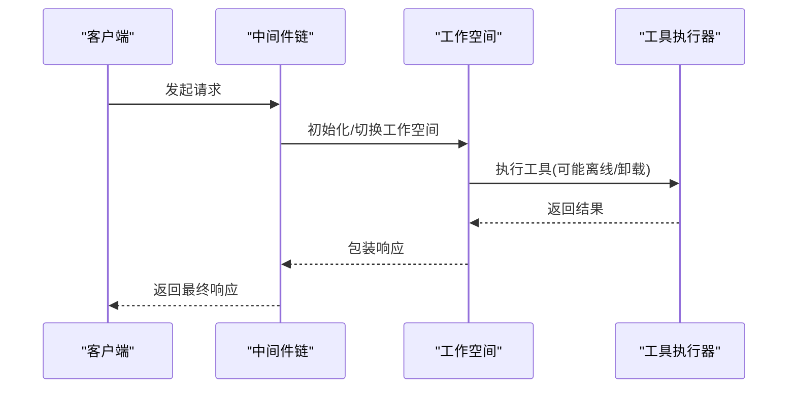

图表来源
- [workspace_docker_test.py](file://tests/workspace_docker_test.py)
- [workspace_e2b_test.py](file://tests/workspace_e2b_test.py)
- [workspace_local_test.py](file://tests/workspace_local_test.py)
- [middleware_test.py](file://tests/middleware_test.py)
- [tracing_test.py](file://tests/tracing_test.py)
- [tool_offload_middleware_test.py](file://tests/tool_offload_middleware_test.py)

章节来源
- [workspace_docker_test.py](file://tests/workspace_docker_test.py)
- [workspace_e2b_test.py](file://tests/workspace_e2b_test.py)
- [workspace_local_test.py](file://tests/workspace_local_test.py)
- [middleware_test.py](file://tests/middleware_test.py)
- [tracing_test.py](file://tests/tracing_test.py)
- [tool_offload_middleware_test.py](file://tests/tool_offload_middleware_test.py)

### MCP与人机交互（SSE/HTTP/确认/中断/外部执行）
- SSE客户端
  - 连接建立、事件流解析、断线重连、超时处理。
- 可流式HTTP客户端
  - 流式读取、缓冲区管理、错误恢复。
- 人机交互
  - 用户确认、混合中断、外部执行回调。

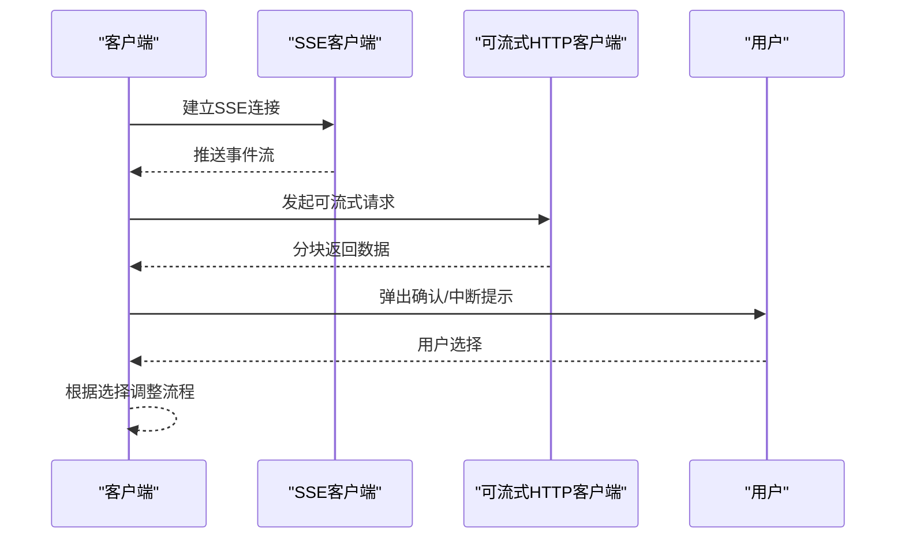

图表来源
- [mcp_sse_client_test.py](file://tests/mcp_sse_client_test.py)
- [mcp_streamable_http_client_test.py](file://tests/mcp_streamable_http_client_test.py)
- [hitl_user_confirmation_test.py](file://tests/hitl_user_confirmation_test.py)
- [hitl_mixed_interrupt.py](file://tests/hitl_mixed_interrupt.py)
- [hitl_external_execution_test.py](file://tests/hitl_external_execution_test.py)

章节来源
- [mcp_sse_client_test.py](file://tests/mcp_sse_client_test.py)
- [mcp_streamable_http_client_test.py](file://tests/mcp_streamable_http_client_test.py)
- [hitl_user_confirmation_test.py](file://tests/hitl_user_confirmation_test.py)
- [hitl_mixed_interrupt.py](file://tests/hitl_mixed_interrupt.py)
- [hitl_external_execution_test.py](file://tests/hitl_external_execution_test.py)

### 压缩与存储（上下文/工具结果/Redis）
- 上下文压缩
  - 文本截断、摘要策略、阈值控制。
- 工具结果压缩
  - 结果裁剪、编码优化、体积控制。
- Redis存储
  - 连接/序列化/反序列化/过期策略/异常处理。

章节来源
- [compress_context_test.py](file://tests/compress_context_test.py)
- [compress_tool_result_test.py](file://tests/compress_tool_result_test.py)
- [storage_redis_test.py](file://tests/storage_redis_test.py)

### 技能加载与工具链（skill_loader_test.py）
- 动态加载技能、参数校验、依赖解析、异常回退。
- 工具链组合与状态管理验证。

章节来源
- [skill_loader_test.py](file://tests/skill_loader_test.py)

## 依赖关系分析
- 测试耦合与内聚
  - 各模块测试相对独立，通过统一运行器与工具模块耦合，内聚于自身领域。
- 外部依赖与集成点
  - 模型SDK、文件系统、网络协议（SSE/HTTP）、容器/沙箱环境。
- 潜在循环依赖
  - 测试文件之间无直接循环导入；运行器仅作为调度入口。
- 接口契约
  - Mock模型与凭证遵循统一接口，便于替换与扩展。

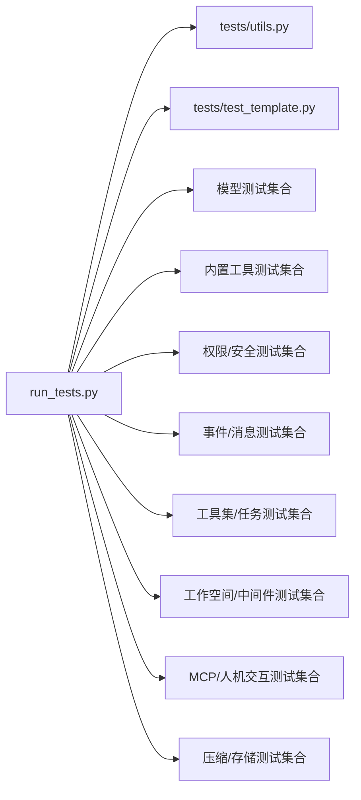

图表来源
- [run_tests.py](file://scripts/model_examples/run_tests.py)
- [utils.py](file://tests/utils.py)
- [test_template.py](file://tests/test_template.py)

章节来源
- [run_tests.py](file://scripts/model_examples/run_tests.py)
- [utils.py](file://tests/utils.py)
- [test_template.py](file://tests/test_template.py)

## 性能考量
- 测试执行效率
  - 使用子进程隔离与超时控制，避免阻塞；优先采用静态数据与内存Mock，减少IO开销。
- 并发与稳定性
  - 工作空间测试建议串行或加锁，避免资源竞争；中间件链路尽量短路径验证。
- 输出与可观测性
  - 失败时打印捕获输出，便于快速定位；对长输出可分段断言，避免内存压力。

## 故障排查指南
- 常见问题
  - 超时：检查脚本是否存在死循环或阻塞IO；适当增大超时或拆分用例。
  - 输出为空：确认静默模式下捕获逻辑；必要时切换为实时输出模式。
  - 提供方不可用：检查环境变量与网络连通性；使用“列出”模式确认支持情况。
- 定位技巧
  - 使用AnyString与结构化比较工具，缩小断言范围；逐步注释排除法定位问题模块。
  - 对流式接口，逐片断言并记录中间状态，确保顺序与完整性。

章节来源
- [run_tests.py](file://scripts/model_examples/run_tests.py)
- [utils.py](file://tests/utils.py)

## 结论
AgentScope的单元测试体系以“统一运行器+模块化测试文件+通用工具”为核心，覆盖从模型适配、工具执行、权限控制到事件与消息、工作空间与中间件等关键路径。通过Mock与模板化设计，测试具备高可维护性与可扩展性；结合运行器的汇总与失败输出，能够稳定支撑持续集成与回归测试。

## 附录
- 测试用例编写建议
  - 先正向后反向：先覆盖正常路径，再补充边界与异常。
  - 数据最小化：使用最小必要数据构造用例，提升可读性与可维护性。
  - 断言明确：优先断言关键字段与副作用，避免过度断言。
- 测试数据准备方法
  - 使用临时目录与文件，测试结束后统一清理。
  - 对网络/外部服务使用Mock，避免真实依赖。
  - 对时间敏感场景使用固定时间戳或可控时钟。