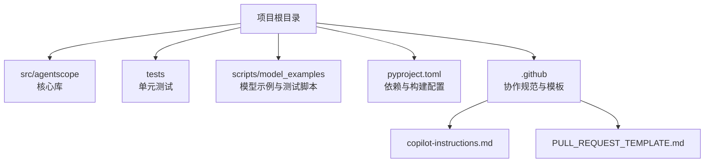
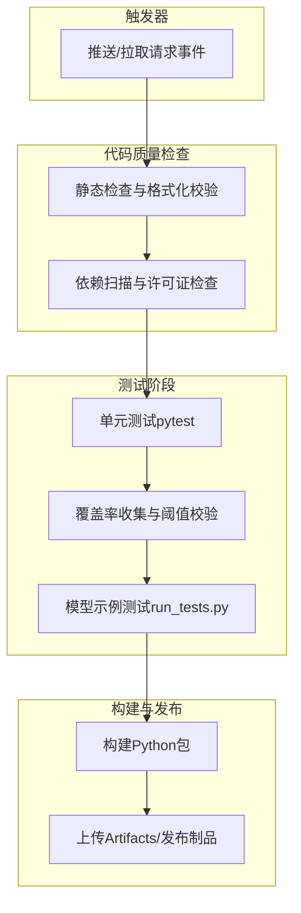
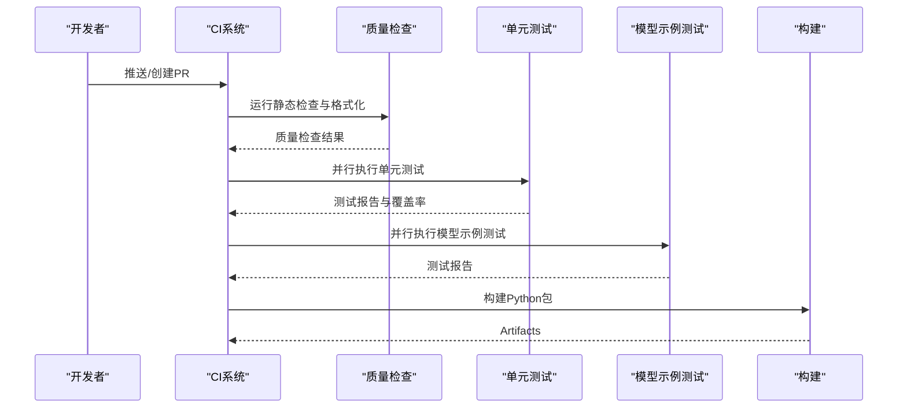
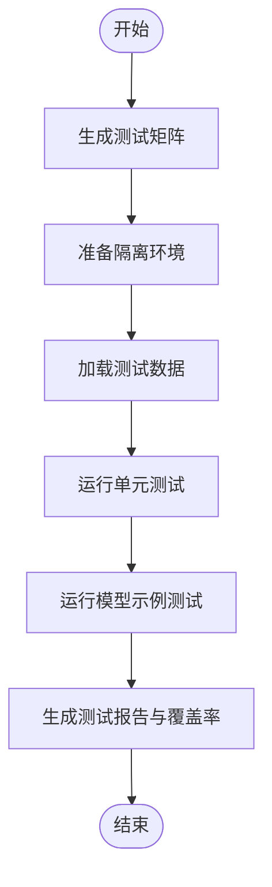
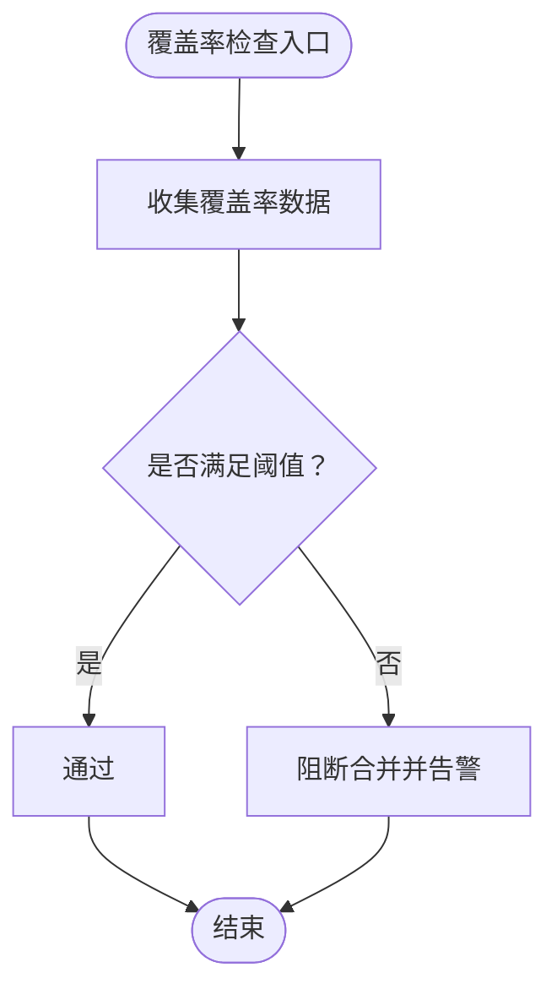
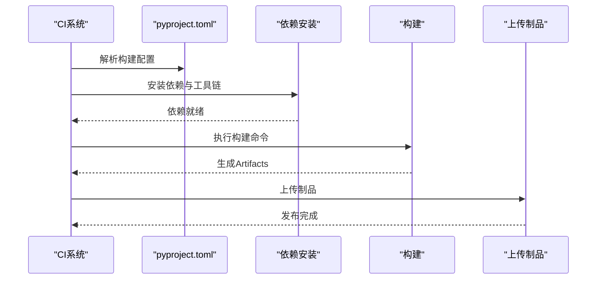
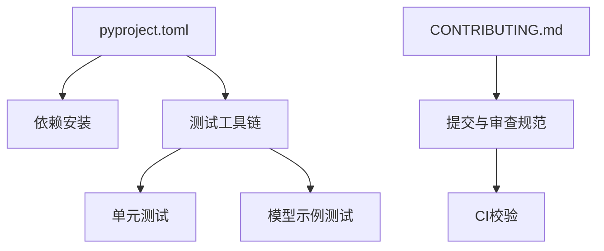

# 持续集成与部署

<cite>
**本文引用的文件**
- [pyproject.toml](file://pyproject.toml)
- [README.md](file://README.md)
- [CONTRIBUTING.md](file://CONTRIBUTING.md)
- [.github/copilot-instructions.md](file://.github/copilot-instructions.md)
- [.github/PULL_REQUEST_TEMPLATE.md](file://.github/PULL_REQUEST_TEMPLATE.md)
- [tests/test_template.py](file://tests/test_template.py)
- [tests/utils.py](file://tests/utils.py)
- [scripts/model_examples/run_tests.py](file://scripts/model_examples/run_tests.py)
</cite>

## 目录
1. [简介](#简介)
2. [项目结构](#项目结构)
3. [核心组件](#核心组件)
4. [架构总览](#架构总览)
5. [详细组件分析](#详细组件分析)
6. [依赖关系分析](#依赖关系分析)
7. [性能考虑](#性能考虑)
8. [故障排除指南](#故障排除指南)
9. [结论](#结论)
10. [附录](#附录)

## 简介
本文件面向AgentScope项目的持续集成与部署（CI/CD）实践，聚焦于自动化测试流程、代码质量检查与构建部署管道的设计与实现。根据当前仓库信息，项目未包含GitHub Actions工作流文件，但提供了测试模板、测试工具与模型示例测试脚本，以及项目配置文件，可据此设计并落地CI/CD流水线。本文将从流水线设计原理、测试触发机制、并行测试执行、结果报告、覆盖率收集与质量门禁等方面进行系统化说明，并给出最佳实践与故障排除建议。

## 项目结构
AgentScope采用Python包结构组织核心代码，测试用例集中于tests目录，模型示例测试位于scripts/model_examples中。项目根目录包含pyproject.toml用于依赖与构建配置，README与贡献指南明确了开发与提交规范，.github目录包含Copilot与PR模板等协作规范。

图表来源
- [pyproject.toml](file://pyproject.toml)
- [README.md](file://README.md)
- [CONTRIBUTING.md](file://CONTRIBUTING.md)

章节来源
- [pyproject.toml](file://pyproject.toml)
- [README.md](file://README.md)
- [CONTRIBUTING.md](file://CONTRIBUTING.md)

## 核心组件
- 测试框架与模板：tests目录提供统一的测试模板与工具，便于扩展新测试用例与维护一致性。
- 模型示例测试：scripts/model_examples中的run_tests.py用于批量运行模型示例测试，适合作为CI中的“集成测试”阶段。
- 构建与依赖：pyproject.toml定义了项目依赖、工具链与打包配置，是CI构建阶段的关键输入。
- 协作规范：.github目录下的Copilot与PR模板有助于在CI中引入自动化审查与合规性检查。

章节来源
- [tests/test_template.py](file://tests/test_template.py)
- [tests/utils.py](file://tests/utils.py)
- [scripts/model_examples/run_tests.py](file://scripts/model_examples/run_tests.py)
- [pyproject.toml](file://pyproject.toml)
- [.github/copilot-instructions.md](file://.github/copilot-instructions.md)
- [.github/PULL_REQUEST_TEMPLATE.md](file://.github/PULL_REQUEST_TEMPLATE.md)

## 架构总览
下图展示了基于现有仓库内容的CI/CD流水线架构：由触发器启动，依次执行代码质量检查、单元测试、模型示例测试与构建发布（如需），并在关键节点输出报告与覆盖率数据。

## 详细组件分析

### 测试触发机制与并行执行
- 触发机制：建议在CI中对主分支保护与PR事件启用流水线；针对不同路径变更可选择性跳过或加速某些步骤。
- 并行策略：
  - 单元测试：按模块或子系统拆分作业，利用pytest-xdist或多进程并行执行，缩短总时长。
  - 模型示例测试：将不同模型/供应商的测试用例拆分为多个任务并行运行，避免单点瓶颈。
- 结果聚合：通过JUnit XML与Coverage XML输出，统一归档Artifacts供后续分析。

### 自动化测试实现方法
- 测试矩阵配置：按Python版本、操作系统、后端供应商等维度组合，确保跨平台与多供应商兼容性。
- 环境隔离：使用容器镜像或虚拟环境隔离依赖，避免全局污染；对网络类测试建议使用Mock或本地服务。
- 测试数据管理：敏感数据使用密钥管理服务；公开数据可通过Git LFS或只读缓存方式提供；临时数据在作业结束后清理。

### 代码覆盖率收集与质量门禁
- 收集流程：在单元测试阶段启用覆盖率工具，输出XML/JSON格式报告；在模型示例测试阶段可选地追加覆盖率。
- 阈值设置：建议设置整体覆盖率阈值（如≥80%）、分支覆盖率阈值（如≥70%）；对关键模块可提高阈值。
- 质量门禁：当覆盖率低于阈值或测试失败时阻断合并；通过注释或状态检查反馈结果。

### 构建与部署管道
- 构建阶段：读取pyproject.toml进行依赖安装与构建，生成wheel/sdist；对前端子项目可在独立阶段构建。
- 发布阶段：将Artifacts上传至制品库或PyPI；对Web UI子项目可另起发布流程。
- 缓存优化：复用依赖缓存与构建缓存，减少重复下载与编译时间。

## 依赖关系分析
- 项目依赖与工具链：pyproject.toml定义了核心依赖与开发工具，是CI中安装与验证的基础。
- 测试依赖：单元测试与模型示例测试共享测试工具与模板，降低重复配置成本。
- 协作规范：贡献指南与PR模板约束提交与审查流程，有助于在CI中自动校验标题与描述格式。

图表来源
- [pyproject.toml](file://pyproject.toml)
- [CONTRIBUTING.md](file://CONTRIBUTING.md)

章节来源
- [pyproject.toml](file://pyproject.toml)
- [CONTRIBUTING.md](file://CONTRIBUTING.md)

## 性能考虑
- 并行度调优：根据Runner资源与测试特性合理设置并行度，避免过度竞争导致超时。
- 缓存策略：启用pip/conda缓存、构建缓存与测试缓存；对大体积依赖使用增量更新。
- 任务拆分：将耗时任务（如模型示例测试）拆分为多个小任务并行执行，缩短总时长。
- 日志与报告：仅在失败时输出详细日志，减少Artifacts体积与存储成本。

## 故障排除指南
- 测试失败定位：
  - 查看测试报告与覆盖率XML/JUnit文件，定位失败用例与异常堆栈。
  - 使用最小复现步骤缩小问题范围，必要时添加调试日志。
- 依赖冲突：
  - 清理缓存后重试；锁定关键依赖版本；在隔离环境中复现问题。
- 覆盖率异常：
  - 确认覆盖率工具正确注入；检查被测代码是否被正确导入；核对阈值配置。
- 构建失败：
  - 检查pyproject.toml中的构建命令与依赖声明；确认Runner环境与Python版本匹配。

## 结论
尽管当前仓库未包含GitHub Actions工作流文件，但已具备完善的测试模板、工具与配置文件，可据此快速搭建覆盖质量检查、单元测试、模型示例测试与构建发布的CI/CD流水线。通过合理的测试矩阵、并行执行与覆盖率门禁，可显著提升代码质量与交付效率。

## 附录
- 建议的CI/CD最佳实践清单：
  - 明确触发策略与权限控制
  - 分层并行执行，优先运行快速用例
  - 使用Artifacts归档报告与日志
  - 设置覆盖率阈值与质量门禁
  - 对关键模块增加回归测试
  - 定期审查与优化流水线性能