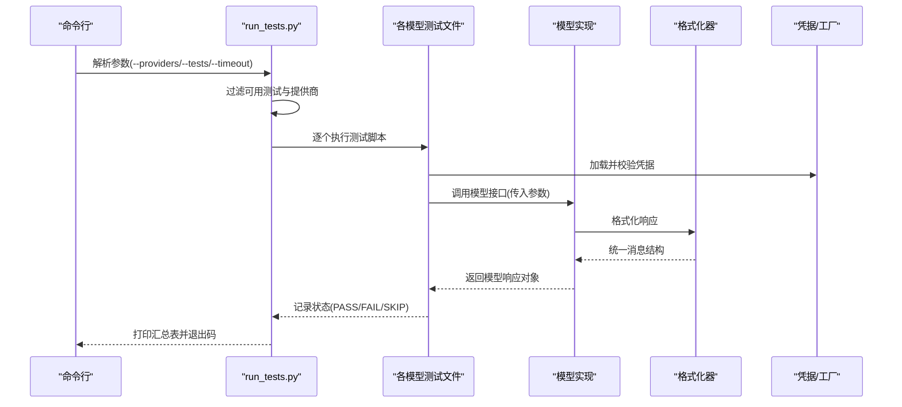
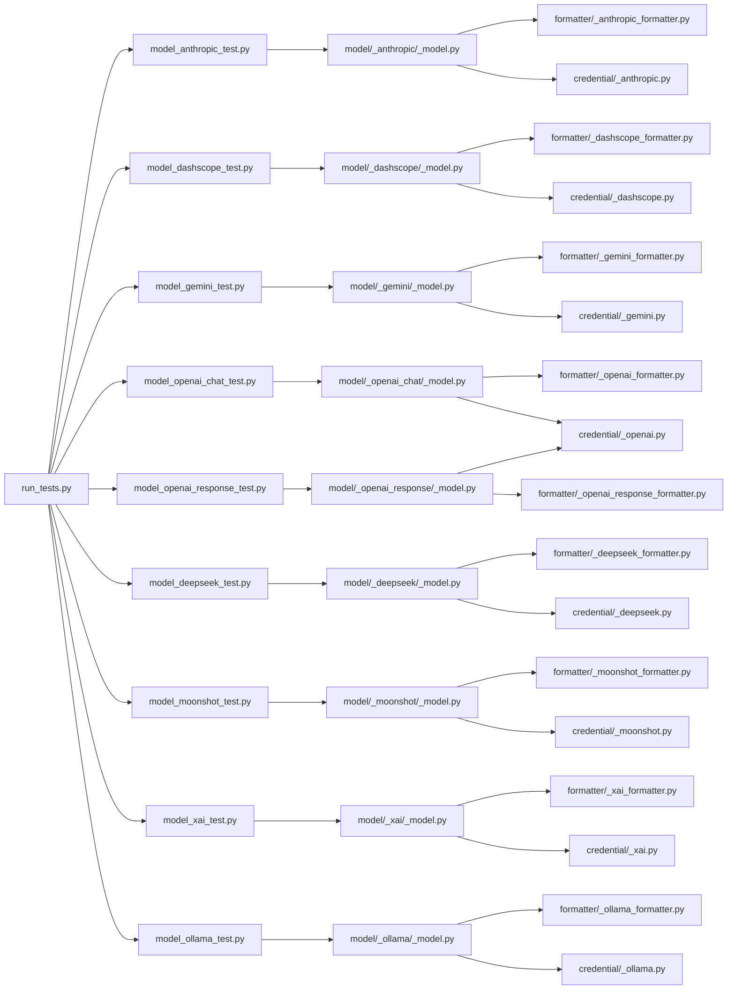

# 模型测试

<cite>
**本文引用的文件**
- [README.md](file://README.md)
- [scripts/model_examples/README.md](file://scripts/model_examples/README.md)
- [scripts/model_examples/run_tests.py](file://scripts/model_examples/run_tests.py)
- [tests/model_anthropic_test.py](file://tests/model_anthropic_test.py)
- [tests/model_dashscope_test.py](file://tests/model_dashscope_test.py)
- [tests/model_gemini_test.py](file://tests/model_gemini_test.py)
- [tests/model_deepseek_test.py](file://tests/model_deepseek_test.py)
- [tests/model_moonshot_test.py](file://tests/model_moonshot_test.py)
- [tests/model_ollama_test.py](file://tests/model_ollama_test.py)
- [tests/model_openai_chat_test.py](file://tests/model_openai_chat_test.py)
- [tests/model_openai_response_test.py](file://tests/model_openai_response_test.py)
- [tests/model_xai_test.py](file://tests/model_xai_test.py)
- [src/agentscope/model/_base.py](file://src/agentscope/model/_base.py)
- [src/agentscope/formatter/_formatter_base.py](file://src/agentscope/formatter/_formatter_base.py)
- [src/agentscope/credential/_base.py](file://src/agentscope/credential/_base.py)
- [src/agentscope/credential/_factory.py](file://src/agentscope/credential/_factory.py)
- [src/agentscope/credential/_anthropic.py](file://src/agentscope/credential/_anthropic.py)
- [src/agentscope/credential/_dashscope.py](file://src/agentscope/credential/_dashscope.py)
- [src/agentscope/credential/_gemini.py](file://src/agentscope/credential/_gemini.py)
- [src/agentscope/credential/_openai.py](file://src/agentscope/credential/_openai.py)
- [src/agentscope/credential/_xai.py](file://src/agentscope/credential/_xai.py)
- [src/agentscope/credential/_deepseek.py](file://src/agentscope/credential/_deepseek.py)
- [src/agentscope/credential/_moonshot.py](file://src/agentscope/credential/_moonshot.py)
- [src/agentscope/credential/_ollama.py](file://src/agentscope/credential/_ollama.py)
- [src/agentscope/formatter/_anthropic_formatter.py](file://src/agentscope/formatter/_anthropic_formatter.py)
- [src/agentscope/formatter/_dashscope_formatter.py](file://src/agentscope/formatter/_dashscope_formatter.py)
- [src/agentscope/formatter/_gemini_formatter.py](file://src/agentscope/formatter/_gemini_formatter.py)
- [src/agentscope/formatter/_openai_formatter.py](file://src/agentscope/formatter/_openai_formatter.py)
- [src/agentscope/formatter/_openai_response_formatter.py](file://src/agentscope/formatter/_openai_response_formatter.py)
- [src/agentscope/formatter/_xai_formatter.py](file://src/agentscope/formatter/_xai_formatter.py)
- [src/agentscope/formatter/_deepseek_formatter.py](file://src/agentscope/formatter/_deepseek_formatter.py)
- [src/agentscope/formatter/_moonshot_formatter.py](file://src/agentscope/formatter/_moonshot_formatter.py)
- [src/agentscope/formatter/_ollama_formatter.py](file://src/agentscope/formatter/_ollama_formatter.py)
- [src/agentscope/model/_anthropic/_model.py](file://src/agentscope/model/_anthropic/_model.py)
- [src/agentscope/model/_dashscope/_model.py](file://src/agentscope/model/_dashscope/_model.py)
- [src/agentscope/model/_gemini/_model.py](file://src/agentscope/model/_gemini/_model.py)
- [src/agentscope/model/_openai_chat/_model.py](file://src/agentscope/model/_openai_chat/_model.py)
- [src/agentscope/model/_openai_response/_model.py](file://src/agentscope/model/_openai_response/_model.py)
- [src/agentscope/model/_xai/_model.py](file://src/agentscope/model/_xai/_model.py)
- [src/agentscope/model/_deepseek/_model.py](file://src/agentscope/model/_deepseek/_model.py)
- [src/agentscope/model/_moonshot/_model.py](file://src/agentscope/model/_moonshot/_model.py)
- [src/agentscope/model/_ollama/_model.py](file://src/agentscope/model/_ollama/_model.py)
- [src/agentscope/model/_model_response.py](file://src/agentscope/model/_model_response.py)
- [src/agentscope/model/_model_usage.py](file://src/agentscope/model/_model_usage.py)
- [src/agentscope/model/_model_card.py](file://src/agentscope/model/_model_card.py)
- [src/agentscope/_version.py](file://src/agentscope/_version.py)
</cite>

## 目录
1. [引言](#引言)
2. [项目结构](#项目结构)
3. [核心组件](#核心组件)
4. [架构总览](#架构总览)
5. [详细组件分析](#详细组件分析)
6. [依赖关系分析](#依赖关系分析)
7. [性能考量](#性能考量)
8. [故障排查指南](#故障排查指南)
9. [结论](#结论)
10. [附录](#附录)

## 引言
本文件面向AgentScope的模型测试体系，系统化阐述多模型集成测试策略与方法，覆盖不同AI提供商（Anthropic、DashScope、Gemini、OpenAI系列、Moonshot、DeepSeek、xAI、Ollama等）的测试实现与最佳实践。内容包含：
- 测试类型与执行方式：调用测试、多智能体测试、多模态测试、响应格式测试、参数传递与错误处理测试
- 性能测试指标：响应时间、吞吐量、准确率与稳定性评估
- 配置测试要点：模型参数校验、环境变量检查、认证与凭据测试
- 实战示例与路径指引，便于快速定位与复用

## 项目结构
AgentScope在tests目录下为各模型提供独立的测试文件，在scripts/model_examples中提供统一的测试运行器与示例脚本；模型与格式化器分别位于src/agentscope/model与src/agentscope/formatter目录，凭据管理位于src/agentscope/credential。

```mermaid
graph TB
subgraph "测试层"
T_AN["tests/model_anthropic_test.py"]
T_DS["tests/model_dashscope_test.py"]
T_GM["tests/model_gemini_test.py"]
T_OA["tests/model_openai_chat_test.py"]
T_OR["tests/model_openai_response_test.py"]
T_DM["tests/model_deepseek_test.py"]
T_MN["tests/model_moonshot_test.py"]
T_XA["tests/model_xai_test.py"]
T_OL["tests/model_ollama_test.py"]
end
subgraph "运行器"
RUN["scripts/model_examples/run_tests.py"]
RMD["scripts/model_examples/README.md"]
end
subgraph "模型实现"
M_BASE["src/.../model/_base.py"]
M_ANTH["src/.../model/_anthropic/_model.py"]
M_DASH["src/.../model/_dashscope/_model.py"]
M_GEMI["src/.../model/_gemini/_model.py"]
M_OA["src/.../model/_openai_chat/_model.py"]
M_OR["src/.../model/_openai_response/_model.py"]
M_DEEK["src/.../model/_deepseek/_model.py"]
M_MOON["src/.../model/_moonshot/_model.py"]
M_XAI["src/.../model/_xai/_model.py"]
M_OL["src/.../model/_ollama/_model.py"]
end
subgraph "格式化器"
F_BASE["src/.../formatter/_formatter_base.py"]
F_ANTH["src/.../formatter/_anthropic_formatter.py"]
F_DASH["src/.../formatter/_dashscope_formatter.py"]
F_GEMI["src/.../formatter/_gemini_formatter.py"]
F_OA["src/.../formatter/_openai_formatter.py"]
F_OR["src/.../formatter/_openai_response_formatter.py"]
F_DEEK["src/.../formatter/_deepseek_formatter.py"]
F_MOON["src/.../formatter/_moonshot_formatter.py"]
F_XAI["src/.../formatter/_xai_formatter.py"]
F_OL["src/.../formatter/_ollama_formatter.py"]
end
subgraph "凭据"
C_BASE["src/.../credential/_base.py"]
C_FAC["src/.../credential/_factory.py"]
C_ANTH["src/.../credential/_anthropic.py"]
C_DASH["src/.../credential/_dashscope.py"]
C_GEMI["src/.../credential/_gemini.py"]
C_OA["src/.../credential/_openai.py"]
C_XA["src/.../credential/_xai.py"]
C_DEEK["src/.../credential/_deepseek.py"]
C_MOON["src/.../credential/_moonshot.py"]
C_OL["src/.../credential/_ollama.py"]
end
RUN --> T_AN
RUN --> T_DS
RUN --> T_GM
RUN --> T_OA
RUN --> T_OR
RUN --> T_DM
RUN --> T_MN
RUN --> T_XA
RUN --> T_OL
T_AN --> M_ANTH
T_DS --> M_DASH
T_GM --> M_GEMI
T_OA --> M_OA
T_OR --> M_OR
T_DM --> M_DEEK
T_MN --> M_MOON
T_XA --> M_XAI
T_OL --> M_OL
M_ANTH --> F_ANTH
M_DASH --> F_DASH
M_GEMI --> F_GEMI
M_OA --> F_OA
M_OR --> F_OR
M_DEEK --> F_DEEK
M_MOON --> F_MOON
M_XAI --> F_XAI
M_OL --> F_OL
M_ANTH --> C_ANTH
M_DASH --> C_DASH
M_GEMI --> C_GEMI
M_OA --> C_OA
M_XA --> C_XA
M_DEEK --> C_DEEK
M_MOON --> C_MOON
M_OL --> C_OL
```

图表来源
- [scripts/model_examples/run_tests.py:560-585](file://scripts/model_examples/run_tests.py#L560-L585)
- [tests/model_anthropic_test.py](file://tests/model_anthropic_test.py)
- [tests/model_dashscope_test.py](file://tests/model_dashscope_test.py)
- [tests/model_gemini_test.py](file://tests/model_gemini_test.py)
- [tests/model_openai_chat_test.py](file://tests/model_openai_chat_test.py)
- [tests/model_openai_response_test.py](file://tests/model_openai_response_test.py)
- [tests/model_deepseek_test.py](file://tests/model_deepseek_test.py)
- [tests/model_moonshot_test.py](file://tests/model_moonshot_test.py)
- [tests/model_xai_test.py](file://tests/model_xai_test.py)
- [tests/model_ollama_test.py](file://tests/model_ollama_test.py)

章节来源
- [README.md](file://README.md)
- [scripts/model_examples/README.md:153-200](file://scripts/model_examples/README.md#L153-L200)
- [scripts/model_examples/run_tests.py:560-585](file://scripts/model_examples/run_tests.py#L560-L585)

## 核心组件
- 测试运行器：提供命令行参数解析、测试类型与提供商过滤、超时控制、汇总统计与退出码控制，支持按提供商与测试类型组合执行。
- 模型基类：定义统一的模型接口、参数校验、调用流程与响应封装，确保各提供商实现的一致性。
- 凭据与工厂：集中管理各提供商的认证信息加载、校验与实例化，避免分散的环境变量检查。
- 格式化器：负责将模型返回的原始结果转换为统一的消息结构，保障跨提供商的输出一致性。

章节来源
- [scripts/model_examples/run_tests.py:560-585](file://scripts/model_examples/run_tests.py#L560-L585)
- [src/agentscope/model/_base.py](file://src/agentscope/model/_base.py)
- [src/agentscope/credential/_base.py](file://src/agentscope/credential/_base.py)
- [src/agentscope/credential/_factory.py](file://src/agentscope/credential/_factory.py)
- [src/agentscope/formatter/_formatter_base.py](file://src/agentscope/formatter/_formatter_base.py)

## 架构总览
下图展示从测试运行器到具体模型实现、格式化器与凭据的端到端调用链路，以及测试汇总与状态输出。

图表来源
- [scripts/model_examples/run_tests.py:560-585](file://scripts/model_examples/run_tests.py#L560-L585)
- [tests/model_anthropic_test.py](file://tests/model_anthropic_test.py)
- [src/agentscope/model/_anthropic/_model.py](file://src/agentscope/model/_anthropic/_model.py)
- [src/agentscope/formatter/_anthropic_formatter.py](file://src/agentscope/formatter/_anthropic_formatter.py)
- [src/agentscope/credential/_anthropic.py](file://src/agentscope/credential/_anthropic.py)

## 详细组件分析

### 测试运行器与执行策略
- 支持按提供商与测试类型组合筛选，如仅测试openai_chat与anthropic的call与multiagent。
- 支持设置每脚本超时时间，避免长时间阻塞。
- 输出汇总表，包含Provider、Test Type、Status、Time，并以非零退出码指示失败。
- 提供--list用于检查可用状态。

章节来源
- [scripts/model_examples/README.md:153-200](file://scripts/model_examples/README.md#L153-L200)
- [scripts/model_examples/run_tests.py:560-585](file://scripts/model_examples/run_tests.py#L560-L585)

### 模型响应测试（输出格式验证）
- 统一响应对象：通过模型基类封装，确保各提供商返回的字段一致，便于上层消费。
- 格式化器：将原始响应转换为统一的消息结构，便于断言与验证。
- 断言建议：
  - 必填字段存在性（如content、usage、id等）
  - 类型与范围校验（字符串、数值、枚举）
  - 多模态内容结构（图片、文本、URL等）
  - 错误场景下的异常抛出与错误码

章节来源
- [src/agentscope/model/_model_response.py](file://src/agentscope/model/_model_response.py)
- [src/agentscope/formatter/_formatter_base.py](file://src/agentscope/formatter/_formatter_base.py)
- [src/agentscope/formatter/_anthropic_formatter.py](file://src/agentscope/formatter/_anthropic_formatter.py)
- [src/agentscope/formatter/_dashscope_formatter.py](file://src/agentscope/formatter/_dashscope_formatter.py)
- [src/agentscope/formatter/_gemini_formatter.py](file://src/agentscope/formatter/_gemini_formatter.py)
- [src/agentscope/formatter/_openai_formatter.py](file://src/agentscope/formatter/_openai_formatter.py)
- [src/agentscope/formatter/_openai_response_formatter.py](file://src/agentscope/formatter/_openai_response_formatter.py)
- [src/agentscope/formatter/_xai_formatter.py](file://src/agentscope/formatter/_xai_formatter.py)
- [src/agentscope/formatter/_deepseek_formatter.py](file://src/agentscope/formatter/_deepseek_formatter.py)
- [src/agentscope/formatter/_moonshot_formatter.py](file://src/agentscope/formatter/_moonshot_formatter.py)
- [src/agentscope/formatter/_ollama_formatter.py](file://src/agentscope/formatter/_ollama_formatter.py)

### 参数传递与错误处理测试
- 参数校验：在模型基类中进行参数合法性检查，避免无效输入导致的异常。
- 错误处理：对HTTP/网络/认证错误进行捕获与分类，保证测试可预期且可重复。
- 环境变量缺失：当API密钥未设置时，测试应跳过而非失败，避免误报。

章节来源
- [src/agentscope/model/_base.py](file://src/agentscope/model/_base.py)
- [src/agentscope/credential/_base.py](file://src/agentscope/credential/_base.py)
- [src/agentscope/credential/_factory.py](file://src/agentscope/credential/_factory.py)

### 性能测试指标与评估方法
- 响应时间：记录单次调用耗时，支持分位数统计（P50/P95）。
- 吞吐量：单位时间内完成的请求数，结合并发度评估。
- 准确性：通过预设问题与期望答案的匹配度或人工抽样评估。
- 稳定性：多次运行的标准差、错误率与超时比例。
- 建议：在测试运行器中增加计时与统计逻辑，输出CSV便于后续分析。

章节来源
- [scripts/model_examples/run_tests.py:560-585](file://scripts/model_examples/run_tests.py#L560-L585)

### 配置测试（参数、环境变量与认证）
- 模型参数验证：在模型初始化阶段校验必填项与默认值，避免运行期错误。
- 环境变量检查：在凭据工厂中统一读取与校验，若缺失则返回可识别的SKIP状态。
- 认证测试：优先尝试最小权限调用（如查询模型列表），确认凭据有效后再进行完整测试。

章节来源
- [src/agentscope/model/_model_card.py](file://src/agentscope/model/_model_card.py)
- [src/agentscope/credential/_anthropic.py](file://src/agentscope/credential/_anthropic.py)
- [src/agentscope/credential/_dashscope.py](file://src/agentscope/credential/_dashscope.py)
- [src/agentscope/credential/_gemini.py](file://src/agentscope/credential/_gemini.py)
- [src/agentscope/credential/_openai.py](file://src/agentscope/credential/_openai.py)
- [src/agentscope/credential/_xai.py](file://src/agentscope/credential/_xai.py)
- [src/agentscope/credential/_deepseek.py](file://src/agentscope/credential/_deepseek.py)
- [src/agentscope/credential/_moonshot.py](file://src/agentscope/credential/_moonshot.py)
- [src/agentscope/credential/_ollama.py](file://src/agentscope/credential/_ollama.py)

### 各提供商测试示例与最佳实践

#### Anthropic
- 测试入口：tests/model_anthropic_test.py
- 关键点：
  - 使用凭据模块加载API密钥
  - 调用模型实现后经格式化器统一输出
  - 多模态与多智能体场景需分别验证
- 最佳实践：
  - 在本地设置环境变量后执行测试
  - 对错误场景（如限流、鉴权失败）进行断言

章节来源
- [tests/model_anthropic_test.py](file://tests/model_anthropic_test.py)
- [src/agentscope/model/_anthropic/_model.py](file://src/agentscope/model/_anthropic/_model.py)
- [src/agentscope/formatter/_anthropic_formatter.py](file://src/agentscope/formatter/_anthropic_formatter.py)
- [src/agentscope/credential/_anthropic.py](file://src/agentscope/credential/_anthropic.py)

#### DashScope
- 测试入口：tests/model_dashscope_test.py
- 关键点：
  - 检查模型卡片与参数配置
  - 验证多模态输入输出格式
- 最佳实践：
  - 先执行配置测试，再进行调用与多智能体测试

章节来源
- [tests/model_dashscope_test.py](file://tests/model_dashscope_test.py)
- [src/agentscope/model/_dashscope/_model.py](file://src/agentscope/model/_dashscope/_model.py)
- [src/agentscope/formatter/_dashscope_formatter.py](file://src/agentscope/formatter/_dashscope_formatter.py)
- [src/agentscope/credential/_dashscope.py](file://src/agentscope/credential/_dashscope.py)

#### Gemini
- 测试入口：tests/model_gemini_test.py
- 关键点：
  - 注意多模态与视频/图像输入的兼容性
  - 使用统一的响应对象进行断言
- 最佳实践：
  - 优先使用官方SDK示例作为对照

章节来源
- [tests/model_gemini_test.py](file://tests/model_gemini_test.py)
- [src/agentscope/model/_gemini/_model.py](file://src/agentscope/model/_gemini/_model.py)
- [src/agentscope/formatter/_gemini_formatter.py](file://src/agentscope/formatter/_gemini_formatter.py)
- [src/agentscope/credential/_gemini.py](file://src/agentscope/credential/_gemini.py)

#### OpenAI系列（Chat与Response）
- 测试入口：tests/model_openai_chat_test.py、tests/model_openai_response_test.py
- 关键点：
  - Chat与Response两类接口的差异与对应格式化器
  - 多模态与多智能体场景的对比测试
- 最佳实践：
  - 保持测试数据与期望输出的版本化管理

章节来源
- [tests/model_openai_chat_test.py](file://tests/model_openai_chat_test.py)
- [tests/model_openai_response_test.py](file://tests/model_openai_response_test.py)
- [src/agentscope/model/_openai_chat/_model.py](file://src/agentscope/model/_openai_chat/_model.py)
- [src/agentscope/model/_openai_response/_model.py](file://src/agentscope/model/_openai_response/_model.py)
- [src/agentscope/formatter/_openai_formatter.py](file://src/agentscope/formatter/_openai_formatter.py)
- [src/agentscope/formatter/_openai_response_formatter.py](file://src/agentscope/formatter/_openai_response_formatter.py)
- [src/agentscope/credential/_openai.py](file://src/agentscope/credential/_openai.py)

#### Moonshot
- 测试入口：tests/model_moonshot_test.py
- 关键点：
  - 检查长上下文模型的调用与输出稳定性
- 最佳实践：
  - 控制输入长度与轮次，避免超时

章节来源
- [tests/model_moonshot_test.py](file://tests/model_moonshot_test.py)
- [src/agentscope/model/_moonshot/_model.py](file://src/agentscope/model/_moonshot/_model.py)
- [src/agentscope/formatter/_moonshot_formatter.py](file://src/agentscope/formatter/_moonshot_formatter.py)
- [src/agentscope/credential/_moonshot.py](file://src/agentscope/credential/_moonshot.py)

#### DeepSeek
- 测试入口：tests/model_deepseek_test.py
- 关键点：
  - 验证推理类模型的输出质量与稳定性
- 最佳实践：
  - 结合人工评估与自动化断言

章节来源
- [tests/model_deepseek_test.py](file://tests/model_deepseek_test.py)
- [src/agentscope/model/_deepseek/_model.py](file://src/agentscope/model/_deepseek/_model.py)
- [src/agentscope/formatter/_deepseek_formatter.py](file://src/agentscope/formatter/_deepseek_formatter.py)
- [src/agentscope/credential/_deepseek.py](file://src/agentscope/credential/_deepseek.py)

#### xAI
- 测试入口：tests/model_xai_test.py
- 关键点：
  - Grok系列模型的调用与格式化
- 最佳实践：
  - 注意速率限制与配额

章节来源
- [tests/model_xai_test.py](file://tests/model_xai_test.py)
- [src/agentscope/model/_xai/_model.py](file://src/agentscope/model/_xai/_model.py)
- [src/agentscope/formatter/_xai_formatter.py](file://src/agentscope/formatter/_xai_formatter.py)
- [src/agentscope/credential/_xai.py](file://src/agentscope/credential/_xai.py)

#### Ollama
- 测试入口：tests/model_ollama_test.py
- 关键点：
  - 本地模型的调用与格式化
  - 注意模型名称与参数映射
- 最佳实践：
  - 在本地Docker或容器环境中准备模型镜像

章节来源
- [tests/model_ollama_test.py](file://tests/model_ollama_test.py)
- [src/agentscope/model/_ollama/_model.py](file://src/agentscope/model/_ollama/_model.py)
- [src/agentscope/formatter/_ollama_formatter.py](file://src/agentscope/formatter/_ollama_formatter.py)
- [src/agentscope/credential/_ollama.py](file://src/agentscope/credential/_ollama.py)

## 依赖关系分析
- 测试运行器依赖各模型测试文件；模型测试文件依赖模型实现与格式化器；模型实现依赖格式化器与凭据模块。
- 凭据工厂统一加载与校验环境变量，降低测试对环境的耦合。

图表来源
- [scripts/model_examples/run_tests.py:560-585](file://scripts/model_examples/run_tests.py#L560-L585)
- [tests/model_anthropic_test.py](file://tests/model_anthropic_test.py)
- [tests/model_dashscope_test.py](file://tests/model_dashscope_test.py)
- [tests/model_gemini_test.py](file://tests/model_gemini_test.py)
- [tests/model_openai_chat_test.py](file://tests/model_openai_chat_test.py)
- [tests/model_openai_response_test.py](file://tests/model_openai_response_test.py)
- [tests/model_deepseek_test.py](file://tests/model_deepseek_test.py)
- [tests/model_moonshot_test.py](file://tests/model_moonshot_test.py)
- [tests/model_xai_test.py](file://tests/model_xai_test.py)
- [tests/model_ollama_test.py](file://tests/model_ollama_test.py)

## 性能考量
- 单次调用耗时：建议在模型实现中埋点记录请求开始与结束时间，输出到日志或统计结构。
- 并发与限流：根据提供商的QPS限制调整并发度，避免触发限流。
- 缓存与重试：对稳定接口启用幂等重试与结果缓存，减少重复开销。
- 资源监控：在CI中记录CPU/内存占用，辅助定位性能瓶颈。

## 故障排查指南
- 环境变量缺失：检查对应提供商的API密钥是否设置，运行器会将其标记为SKIP。
- 超时与网络：增大--timeout参数，或在本地网络环境下重试。
- 版本不匹配：核对模型名称与参数映射，确保与模型卡片一致。
- 错误码与异常：根据格式化器输出的统一结构进行断言，定位具体错误来源。

章节来源
- [scripts/model_examples/README.md:153-200](file://scripts/model_examples/README.md#L153-L200)
- [scripts/model_examples/run_tests.py:560-585](file://scripts/model_examples/run_tests.py#L560-L585)

## 结论
AgentScope提供了完善的多模型测试框架：通过统一的测试运行器、模型基类、格式化器与凭据工厂，实现了跨提供商的一致性与可维护性。建议在实际工程中：
- 将配置测试前置，确保环境与参数正确
- 以格式化器为中心构建断言，提升跨提供商的稳定性
- 在CI中引入性能与稳定性指标，持续监控

## 附录
- 版本信息：参见版本文件，确保测试与SDK版本匹配
- 命令示例：参考运行器帮助与示例表格，快速组合测试场景

章节来源
- [src/agentscope/_version.py](file://src/agentscope/_version.py)