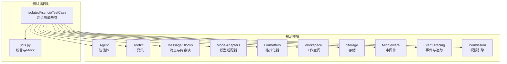
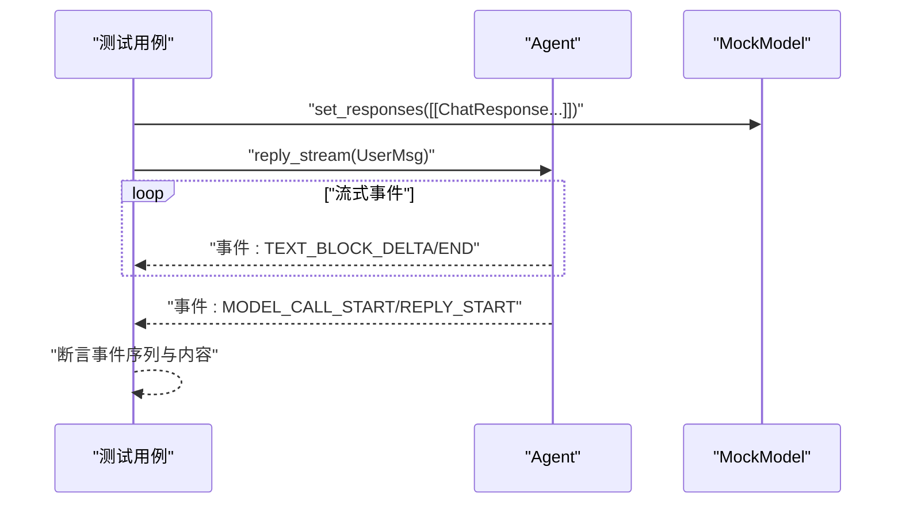
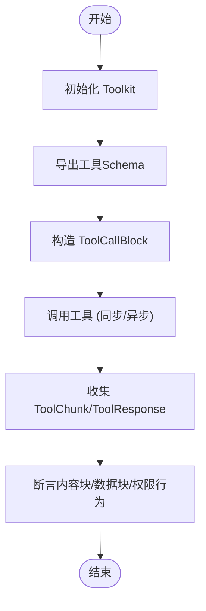
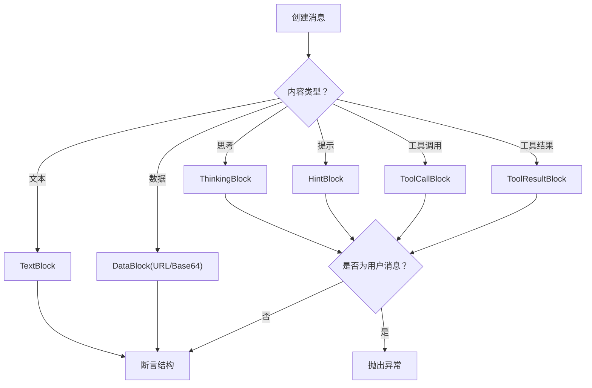
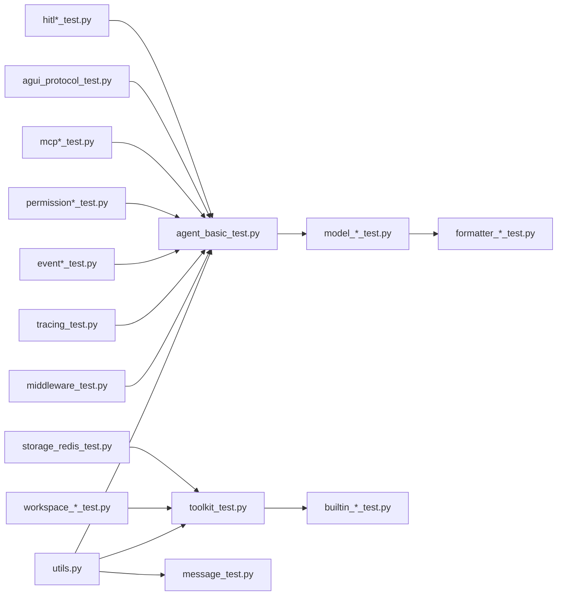

# 测试指南

<cite>
**本文引用的文件**
- [tests/utils.py](file://tests/utils.py)
- [tests/test_template.py](file://tests/test_template.py)
- [tests/agent_basic_test.py](file://tests/agent_basic_test.py)
- [tests/toolkit_test.py](file://tests/toolkit_test.py)
- [tests/message_test.py](file://tests/message_test.py)
- [tests/builtin_bash_test.py](file://tests/builtin_bash_test.py)
- [tests/builtin_edit_test.py](file://tests/builtin_edit_test.py)
- [tests/builtin_glob_test.py](file://tests/builtin_glob_test.py)
- [tests/builtin_grep_test.py](file://tests/builtin_grep_test.py)
- [tests/builtin_read_test.py](file://tests/builtin_read_test.py)
- [tests/builtin_write_test.py](file://tests/builtin_write_test.py)
- [tests/builtin_file_cache_test.py](file://tests/builtin_file_cache_test.py)
- [tests/model_anthropic_test.py](file://tests/model_anthropic_test.py)
- [tests/model_dashscope_test.py](file://tests/model_dashscope_test.py)
- [tests/model_deepseek_test.py](file://tests/model_deepseek_test.py)
- [tests/model_gemini_test.py](file://tests/model_gemini_test.py)
- [tests/model_moonshot_test.py](file://tests/model_moonshot_test.py)
- [tests/model_ollama_test.py](file://tests/model_ollama_test.py)
- [tests/model_openai_chat_test.py](file://tests/model_openai_chat_test.py)
- [tests/model_openai_response_test.py](file://tests/model_openai_response_test.py)
- [tests/model_xai_test.py](file://tests/model_xai_test.py)
- [tests/formatter_anthropic_test.py](file://tests/formatter_anthropic_test.py)
- [tests/formatter_dashscope_test.py](file://tests/formatter_dashscope_test.py)
- [tests/formatter_deepseek_test.py](file://tests/formatter_deepseek_test.py)
- [tests/formatter_gemini_test.py](file://tests/formatter_gemini_test.py)
- [tests/formatter_moonshot_test.py](file://tests/formatter_moonshot_test.py)
- [tests/formatter_ollama_test.py](file://tests/formatter_ollama_test.py)
- [tests/formatter_openai_chat_test.py](file://tests/formatter_openai_chat_test.py)
- [tests/formatter_openai_response_test.py](file://tests/formatter_openai_response_test.py)
- [tests/formatter_xai_test.py](file://tests/formatter_xai_test.py)
- [tests/workspace_docker_test.py](file://tests/workspace_docker_test.py)
- [tests/workspace_e2b_test.py](file://tests/workspace_e2b_test.py)
- [tests/workspace_local_test.py](file://tests/workspace_local_test.py)
- [tests/storage_redis_test.py](file://tests/storage_redis_test.py)
- [tests/middleware_test.py](file://tests/middleware_test.py)
- [tests/tracing_test.py](file://tests/tracing_test.py)
- [tests/event_test.py](file://tests/event_test.py)
- [tests/event_to_message_test.py](file://tests/event_to_message_test.py)
- [tests/skill_loader_test.py](file://tests/skill_loader_test.py)
- [tests/toolkit_skill_test.py](file://tests/toolkit_skill_test.py)
- [tests/toolkit_task_test.py](file://tests/toolkit_task_test.py)
- [tests/task_tool_test.py](file://tests/task_tool_test.py)
- [tests/permission_engine_test.py](file://tests/permission_engine_test.py)
- [tests/permission_bash_parser_test.py](file://tests/permission_bash_parser_test.py)
- [tests/compress_context_test.py](file://tests/compress_context_test.py)
- [tests/compress_tool_result_test.py](file://tests/compress_tool_result_test.py)
- [tests/tool_offload_middleware_test.py](file://tests/tool_offload_middleware_test.py)
- [tests/agui_protocol_test.py](file://tests/agui_protocol_test.py)
- [tests/mcp_sse_client_test.py](file://tests/mcp_sse_client_test.py)
- [tests/mcp_streamable_http_client_test.py](file://tests/mcp_streamable_http_client_test.py)
- [tests/hitl_external_execution_test.py](file://tests/hitl_external_execution_test.py)
- [tests/hitl_mixed_interrupt.py](file://tests/hitl_mixed_interrupt.py)
- [tests/hitl_user_confirmation_test.py](file://tests/hitl_user_confirmation_test.py)
- [scripts/model_examples/run_tests.py](file://scripts/model_examples/run_tests.py)
- [pyproject.toml](file://pyproject.toml)
</cite>

## 目录
1. [简介](#简介)
2. [项目结构](#项目结构)
3. [核心组件](#核心组件)
4. [架构总览](#架构总览)
5. [详细组件分析](#详细组件分析)
6. [依赖分析](#依赖分析)
7. [性能考虑](#性能考虑)
8. [故障排查指南](#故障排查指南)
9. [结论](#结论)
10. [附录](#附录)

## 简介
本指南面向AgentScope项目的测试体系，系统性阐述测试框架的结构与组织方式，覆盖单元测试、集成测试与端到端测试的边界与职责；详解测试工具与辅助函数（测试数据生成、模拟对象、断言工具）的使用；给出各模块（智能体、工具、模型格式化器、工作空间、存储、中间件、权限等）的测试策略；并提供测试编写指南与最佳实践，包括测试用例设计、Mock使用与异步测试处理，以及完整测试示例与调试技巧。

## 项目结构
测试代码集中于tests目录，按功能域分层组织：消息与事件、工具与工具组、模型与格式化器、工作空间与存储、中间件与追踪、权限控制、内置工具、MCP与AGUI协议、任务与技能等。测试基类统一采用异步测试基类，便于并发与流式场景验证。

```mermaid
graph TB
T["tests 目录"] --> U["utils.py<br/>断言辅助与Mock模型"]
T --> TMPL["test_template.py<br/>异步测试模板"]
T --> AG["agent_basic_test.py<br/>智能体基础测试"]
T --> TK["toolkit_test.py<br/>工具与工具组测试"]
T --> MSG["message_test.py<br/>消息与内容块测试"]
T --> BUILTIN["builtin_*_test.py<br/>内置工具测试集合"]
T --> MODEL["model_*_test.py<br/>模型适配器测试集合"]
T --> FMT["formatter_*_test.py<br/>格式化器测试集合"]
T --> WS["workspace_*_test.py<br/>工作空间测试集合"]
T --> ST["storage_redis_test.py<br/>存储测试"]
T --> MW["middleware_test.py<br/>中间件测试"]
T --> TR["tracing_test.py<br/>追踪测试"]
T --> EVT["event*_test.py<br/>事件与消息转换测试"]
T --> PERM["permission*_test.py<br/>权限引擎与解析测试"]
T --> TASK["task_tool_test.py<br/>任务工具测试"]
T --> SKILL["skill_loader_test.py<br/>技能加载测试"]
T --> MCP["mcp*_test.py<br/>MCP客户端测试"]
T --> AGUI["agui_protocol_test.py<br/>AGUI协议测试"]
T --> HITL["hitl*_test.py<br/>人机交互测试"]
```

图表来源
- [tests/agent_basic_test.py:1-200](file://tests/agent_basic_test.py#L1-L200)
- [tests/toolkit_test.py:1-200](file://tests/toolkit_test.py#L1-L200)
- [tests/message_test.py:1-200](file://tests/message_test.py#L1-L200)
- [tests/utils.py:1-115](file://tests/utils.py#L1-L115)

章节来源
- [tests/agent_basic_test.py:1-200](file://tests/agent_basic_test.py#L1-L200)
- [tests/toolkit_test.py:1-200](file://tests/toolkit_test.py#L1-L200)
- [tests/message_test.py:1-200](file://tests/message_test.py#L1-L200)
- [tests/utils.py:1-115](file://tests/utils.py#L1-L115)

## 核心组件
- 异步测试基类：所有测试用例继承自异步测试基类，确保对异步接口（如流式响应、并发工具执行）的正确验证。
- 断言辅助：
  - AnyString：用于忽略字符串值差异的断言占位符，常用于时间戳、ID等动态字段。
  - compare_by_printing：打印期望与实际结构，便于调试。
- Mock模型与凭证：
  - MockCredential：提供Mock模型类以供测试。
  - MockModel：支持设置单次或流式响应，支持结构化输出Mock，便于验证不同推理模式与输出形态。
- 模板测试：提供异步生命周期钩子（asyncSetUp/asyncTearDown），作为新测试用例的起点。

章节来源
- [tests/test_template.py:1-17](file://tests/test_template.py#L1-L17)
- [tests/utils.py:1-115](file://tests/utils.py#L1-L115)

## 架构总览
测试架构围绕“模拟外部依赖 + 结构化断言 + 异步验证”展开，通过Mock模型与工具，隔离真实外部服务，保证测试稳定性与可重复性；通过AnyString等断言工具，聚焦业务逻辑而非动态值；通过异步测试基类，覆盖并发与流式场景。

图表来源
- [tests/agent_basic_test.py:97-200](file://tests/agent_basic_test.py#L97-L200)
- [tests/toolkit_test.py:134-200](file://tests/toolkit_test.py#L134-L200)
- [tests/message_test.py:22-200](file://tests/message_test.py#L22-L200)
- [tests/utils.py:25-115](file://tests/utils.py#L25-L115)

## 详细组件分析

### 智能体测试（Agent）
- 流式推理与文本块事件：通过MockModel设置多段流式响应，逐段断言事件类型、文本增量与结束事件，验证REPLY_START/MODEL_CALL_START/TEXT_BLOCK_*等事件序列。
- 并发与顺序工具：定义并发安全与非并发安全工具，验证工具调用在并发与串行场景下的行为差异。
- 会话与回复ID：利用AnyString断言动态ID，确保事件与消息结构一致性。

图表来源
- [tests/agent_basic_test.py:130-200](file://tests/agent_basic_test.py#L130-L200)
- [tests/utils.py:34-108](file://tests/utils.py#L34-L108)

章节来源
- [tests/agent_basic_test.py:97-200](file://tests/agent_basic_test.py#L97-L200)
- [tests/utils.py:25-115](file://tests/utils.py#L25-L115)

### 工具与工具组测试（Toolkit）
- 工具注册与Schema导出：初始化空工具集与含工具工具集，断言导出的函数Schema结构与参数定义。
- 工具调用与流式输出：对同步与异步工具进行调用，收集ToolChunk与ToolResponse，断言内容块与数据块合并逻辑。
- 权限决策：工具检查权限返回ASK/ALLOW等行为，验证权限引擎交互。

图表来源
- [tests/toolkit_test.py:134-200](file://tests/toolkit_test.py#L134-L200)
- [tests/toolkit_test.py:181-200](file://tests/toolkit_test.py#L181-L200)

章节来源
- [tests/toolkit_test.py:134-200](file://tests/toolkit_test.py#L134-L200)

### 消息与内容块测试（Message）
- 多种内容块：文本、数据（URL/Base64）、思考、提示、工具调用/结果等。
- 结构断言：使用AnyString忽略动态字段，断言消息结构与字段映射。
- 非法组合校验：用户消息中不允许出现思考/提示/工具调用/工具结果等非法内容块，断言抛出异常。

图表来源
- [tests/message_test.py:22-200](file://tests/message_test.py#L22-L200)

章节来源
- [tests/message_test.py:1-200](file://tests/message_test.py#L1-L200)

### 内置工具测试（Builtin Tools）
- Bash/编辑/Glob/Grep/读写/文件缓存等：针对每类内置工具，构造输入与期望输出，断言执行结果与副作用（文件系统、进程输出等）。
- 流式与一次性输出：部分工具支持流式增量输出，需逐段断言。

章节来源
- [tests/builtin_bash_test.py](file://tests/builtin_bash_test.py)
- [tests/builtin_edit_test.py](file://tests/builtin_edit_test.py)
- [tests/builtin_glob_test.py](file://tests/builtin_glob_test.py)
- [tests/builtin_grep_test.py](file://tests/builtin_grep_test.py)
- [tests/builtin_read_test.py](file://tests/builtin_read_test.py)
- [tests/builtin_write_test.py](file://tests/builtin_write_test.py)
- [tests/builtin_file_cache_test.py](file://tests/builtin_file_cache_test.py)

### 模型适配器测试（Model）
- 各大模型厂商适配器：Anthropic/DashScope/DeepSeek/Gemini/Moonshot/Ollama/OpenAI/XAI。
- 测试点：初始化、参数传递、推理调用、流式响应、结构化输出、错误处理。
- 与格式化器配合：模型适配器与格式化器成对测试，确保消息格式与模型输入一致。

章节来源
- [tests/model_anthropic_test.py](file://tests/model_anthropic_test.py)
- [tests/model_dashscope_test.py](file://tests/model_dashscope_test.py)
- [tests/model_deepseek_test.py](file://tests/model_deepseek_test.py)
- [tests/model_gemini_test.py](file://tests/model_gemini_test.py)
- [tests/model_moonshot_test.py](file://tests/model_moonshot_test.py)
- [tests/model_ollama_test.py](file://tests/model_ollama_test.py)
- [tests/model_openai_chat_test.py](file://tests/model_openai_chat_test.py)
- [tests/model_openai_response_test.py](file://tests/model_openai_response_test.py)
- [tests/model_xai_test.py](file://tests/model_xai_test.py)

### 格式化器测试（Formatter）
- 各大模型格式化器：Anthropic/DashScope/DeepSeek/Gemini/Moonshot/Ollama/OpenAI/XAI。
- 测试点：消息到Prompt/JSON的转换、参数注入、特殊字段处理、兼容性。

章节来源
- [tests/formatter_anthropic_test.py](file://tests/formatter_anthropic_test.py)
- [tests/formatter_dashscope_test.py](file://tests/formatter_dashscope_test.py)
- [tests/formatter_deepseek_test.py](file://tests/formatter_deepseek_test.py)
- [tests/formatter_gemini_test.py](file://tests/formatter_gemini_test.py)
- [tests/formatter_moonshot_test.py](file://tests/formatter_moonshot_test.py)
- [tests/formatter_ollama_test.py](file://tests/formatter_ollama_test.py)
- [tests/formatter_openai_chat_test.py](file://tests/formatter_openai_chat_test.py)
- [tests/formatter_openai_response_test.py](file://tests/formatter_openai_response_test.py)
- [tests/formatter_xai_test.py](file://tests/formatter_xai_test.py)

### 工作空间测试（Workspace）
- Docker/E2B/本地：分别验证容器环境、云端沙箱与本地工作区的创建、清理与隔离能力。
- 与工具离线：结合工具离线中间件，验证跨环境工具执行路径。

章节来源
- [tests/workspace_docker_test.py](file://tests/workspace_docker_test.py)
- [tests/workspace_e2b_test.py](file://tests/workspace_e2b_test.py)
- [tests/workspace_local_test.py](file://tests/workspace_local_test.py)
- [tests/tool_offload_middleware_test.py](file://tests/tool_offload_middleware_test.py)

### 存储测试（Storage）
- Redis存储：验证连接、键值操作、序列化/反序列化、过期策略等。

章节来源
- [tests/storage_redis_test.py](file://tests/storage_redis_test.py)

### 中间件与追踪测试（Middleware & Tracing）
- 中间件：验证请求/响应拦截、上下文传播、错误处理。
- 追踪：验证Span生成、属性提取、链路追踪。

章节来源
- [tests/middleware_test.py](file://tests/middleware_test.py)
- [tests/tracing_test.py](file://tests/tracing_test.py)

### 事件与消息转换测试（Event & Event-to-Message）
- 事件序列断言：REPLY_START/MODEL_CALL_START/TEXT_BLOCK_*等事件的时序与内容。
- 事件到消息转换：验证事件聚合为最终消息的能力。

章节来源
- [tests/event_test.py](file://tests/event_test.py)
- [tests/event_to_message_test.py](file://tests/event_to_message_test.py)

### 权限测试（Permission）
- 权限引擎：规则匹配、行为决策（ALLOW/ASK/DENY）。
- Bash解析器：对命令行输入进行权限解析与限制。

章节来源
- [tests/permission_engine_test.py](file://tests/permission_engine_test.py)
- [tests/permission_bash_parser_test.py](file://tests/permission_bash_parser_test.py)

### 技能与任务测试（Skill & Task）
- 技能加载：从本地/远程加载技能，断言Schema与执行。
- 工具组与任务工具：验证任务工具的创建、查询、更新与执行。

章节来源
- [tests/skill_loader_test.py](file://tests/skill_loader_test.py)
- [tests/toolkit_skill_test.py](file://tests/toolkit_skill_test.py)
- [tests/toolkit_task_test.py](file://tests/toolkit_task_test.py)
- [tests/task_tool_test.py](file://tests/task_tool_test.py)

### MCP与AGUI协议测试
- MCP SSE/HTTP客户端：验证SSE流式事件与HTTP客户端行为。
- AGUI协议：验证前后端协议一致性与事件流转。

章节来源
- [tests/agui_protocol_test.py](file://tests/agui_protocol_test.py)
- [tests/mcp_sse_client_test.py](file://tests/mcp_sse_client_test.py)
- [tests/mcp_streamable_http_client_test.py](file://tests/mcp_streamable_http_client_test.py)

### 人机交互测试（HITL）
- 外部执行、混合中断、用户确认：验证人机交互流程与状态切换。

章节来源
- [tests/hitl_external_execution_test.py](file://tests/hitl_external_execution_test.py)
- [tests/hitl_mixed_interrupt.py](file://tests/hitl_mixed_interrupt.py)
- [tests/hitl_user_confirmation_test.py](file://tests/hitl_user_confirmation_test.py)

## 依赖分析
- 测试耦合度：测试主要依赖utils中的Mock模型与断言辅助，耦合集中在测试基类与工具函数上，降低对真实外部服务的依赖。
- 模块内聚：每个测试文件聚焦单一功能域，内聚度高，便于维护与扩展。
- 外部依赖：模型与格式化器测试依赖对应SDK；工作空间测试依赖Docker/E2B；存储测试依赖Redis；MCP测试依赖网络与SSE。

图表来源
- [tests/utils.py:1-115](file://tests/utils.py#L1-L115)
- [tests/agent_basic_test.py:1-200](file://tests/agent_basic_test.py#L1-L200)
- [tests/toolkit_test.py:1-200](file://tests/toolkit_test.py#L1-L200)
- [tests/message_test.py:1-200](file://tests/message_test.py#L1-L200)

## 性能考虑
- 流式响应断言：优先断言事件序列而非等待完整响应，减少等待时间。
- Mock最小化：仅Mock必要依赖，避免过度Mock导致测试脆弱。
- 并发工具测试：使用并发安全与非并发安全工具对比，验证锁与资源竞争处理。
- 资源清理：异步测试基类提供生命周期钩子，确保测试后资源释放。

## 故障排查指南
- 动态字段断言失败：使用AnyString忽略动态ID/时间戳，或使用compare_by_printing打印结构比对。
- 流式事件缺失：检查MockModel的响应队列与is_last标记，确保事件序列完整。
- 权限拒绝：核对权限决策行为与上下文，定位规则匹配问题。
- 外部依赖不可用：Docker/E2B/Redis不可用时，跳过相关测试或使用环境变量控制。

章节来源
- [tests/utils.py:111-115](file://tests/utils.py#L111-L115)

## 结论
AgentScope测试体系以异步测试基类为核心，辅以Mock模型与断言工具，覆盖从单元到集成的关键场景。通过清晰的功能域划分与严格的断言策略，测试能够稳定、高效地验证智能体、工具、模型、工作空间、存储、中间件与权限等模块的行为与交互。

## 附录

### 测试编写指南与最佳实践
- 测试用例设计
  - 单一职责：每个测试只验证一个行为或边界条件。
  - 前后置：使用asyncSetUp/asyncTearDown准备与清理资源。
  - 边界与异常：覆盖正常、异常与边界输入，断言异常类型与消息。
- Mock使用
  - 使用MockModel设置期望响应，区分流式与非流式场景。
  - 对外部SDK/服务进行Mock，避免真实网络与IO。
- 异步测试处理
  - 使用异步测试基类，正确await异步调用与流式事件。
  - 对并发工具进行竞态验证，确保线程/协程安全。
- 断言策略
  - 使用AnyString忽略动态字段，使用compare_by_printing辅助调试。
  - 对复杂结构使用分段断言，先断言类型与关键字段，再断言细节。

### 完整测试示例与调试技巧
- 示例参考
  - 智能体流式推理：参考智能体测试中对流式事件的断言与序列验证。
  - 工具组Schema导出：参考工具组测试中对函数Schema的断言。
  - 消息结构断言：参考消息测试中对多种内容块的断言。
- 调试技巧
  - 打印结构：使用compare_by_printing输出期望与实际，快速定位差异。
  - 分步断言：将复杂断言拆分为多个步骤，逐步缩小问题范围。
  - 环境隔离：确保Docker/E2B/Redis等外部依赖可用，或在CI中按需启用。