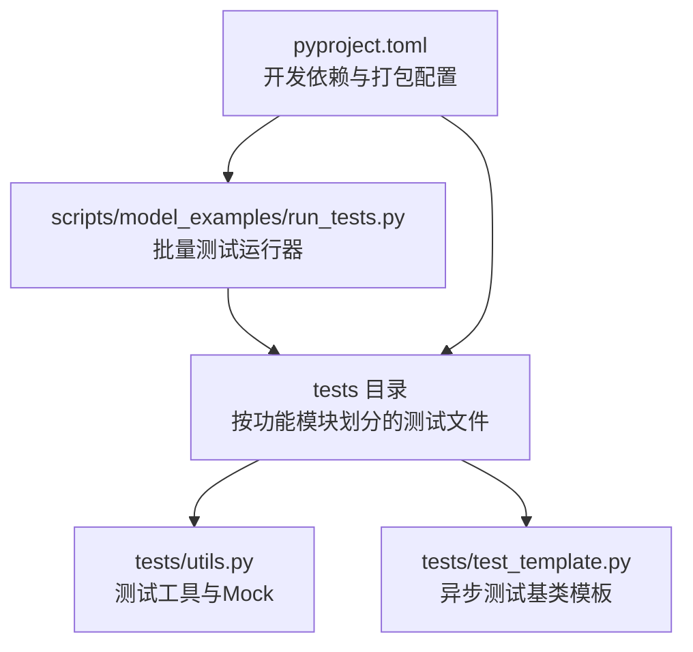
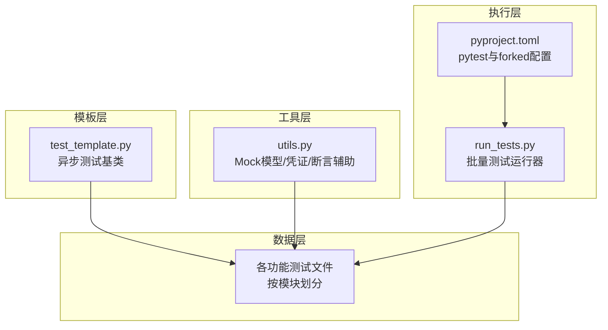
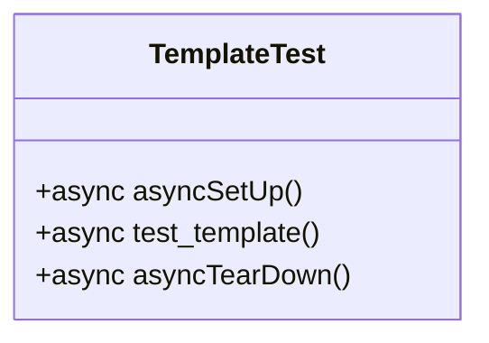
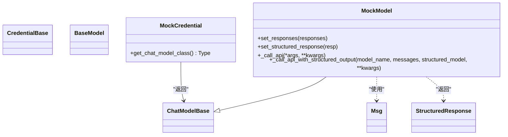
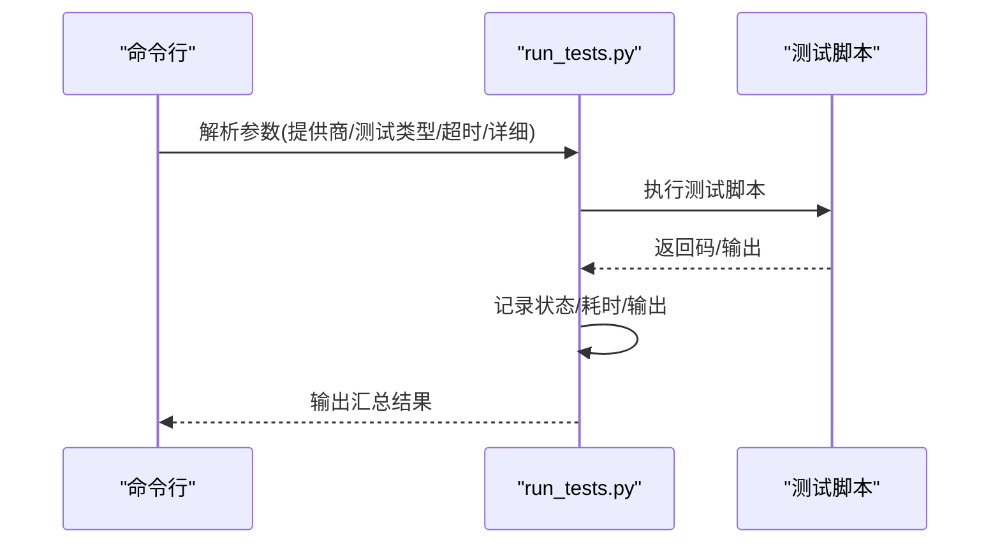
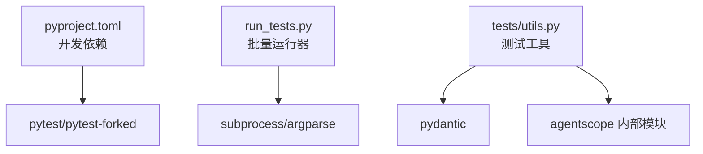

# 测试框架与工具

<cite>
**本文引用的文件**   
- [pyproject.toml](file://pyproject.toml)
- [test_template.py](file://tests/test_template.py)
- [utils.py](file://tests/utils.py)
- [run_tests.py](file://scripts/model_examples/run_tests.py)
- [agent_basic_test.py](file://tests/agent_basic_test.py)
- [agui_protocol_test.py](file://tests/agui_protocol_test.py)
- [builtin_bash_test.py](file://tests/builtin_bash_test.py)
- [builtin_edit_test.py](file://tests/builtin_edit_test.py)
- [builtin_file_cache_test.py](file://tests/builtin_file_cache_test.py)
- [builtin_glob_test.py](file://tests/builtin_glob_test.py)
- [builtin_grep_test.py](file://tests/builtin_grep_test.py)
- [builtin_read_test.py](file://tests/builtin_read_test.py)
- [builtin_write_test.py](file://tests/builtin_write_test.py)
- [compress_context_test.py](file://tests/compress_context_test.py)
- [compress_tool_result_test.py](file://tests/compress_tool_result_test.py)
- [event_test.py](file://tests/event_test.py)
- [event_to_message_test.py](file://tests/event_to_message_test.py)
- [formatter_anthropic_test.py](file://tests/formatter_anthropic_test.py)
- [formatter_dashscope_test.py](file://tests/formatter_dashscope_test.py)
- [formatter_deepseek_test.py](file://tests/formatter_deepseek_test.py)
- [formatter_gemini_test.py](file://tests/formatter_gemini_test.py)
- [formatter_moonshot_test.py](file://tests/formatter_moonshot_test.py)
- [formatter_ollama_test.py](file://tests/formatter_ollama_test.py)
- [formatter_openai_chat_test.py](file://tests/formatter_openai_chat_test.py)
- [formatter_openai_response_test.py](file://tests/formatter_openai_response_test.py)
- [formatter_xai_test.py](file://tests/formatter_xai_test.py)
- [hitl_external_execution_test.py](file://tests/hitl_external_execution_test.py)
- [hitl_mixed_interrupt.py](file://tests/hitl_mixed_interrupt.py)
- [hitl_user_confirmation_test.py](file://tests/hitl_user_confirmation_test.py)
- [mcp_sse_client_test.py](file://tests/mcp_sse_client_test.py)
- [mcp_streamable_http_client_test.py](file://tests/mcp_streamable_http_client_test.py)
- [message_test.py](file://tests/message_test.py)
- [middleware_test.py](file://tests/middleware_test.py)
- [model_anthropic_test.py](file://tests/model_anthropic_test.py)
- [model_dashscope_test.py](file://tests/model_dashscope_test.py)
- [model_deepseek_test.py](file://tests/model_deepseek_test.py)
- [model_gemini_test.py](file://tests/model_gemini_test.py)
- [model_moonshot_test.py](file://tests/model_moonshot_test.py)
- [model_ollama_test.py](file://tests/model_ollama_test.py)
- [model_openai_chat_test.py](file://tests/model_openai_chat_test.py)
- [model_openai_response_test.py](file://tests/model_openai_response_test.py)
- [model_xai_test.py](file://tests/model_xai_test.py)
- [permission_bash_parser_test.py](file://tests/permission_bash_parser_test.py)
- [permission_engine_test.py](file://tests/permission_engine_test.py)
- [skill_loader_test.py](file://tests/skill_loader_test.py)
- [storage_redis_test.py](file://tests/storage_redis_test.py)
- [task_tool_test.py](file://tests/task_tool_test.py)
- [toolkit_skill_test.py](file://tests/toolkit_skill_test.py)
- [toolkit_task_test.py](file://tests/toolkit_task_test.py)
- [toolkit_test.py](file://tests/toolkit_test.py)
- [tracing_test.py](file://tests/tracing_test.py)
- [workspace_docker_test.py](file://tests/workspace_docker_test.py)
- [workspace_e2b_test.py](file://tests/workspace_e2b_test.py)
- [workspace_local_test.py](file://tests/workspace_local_test.py)
</cite>

## 目录
1. [引言](#引言)
2. [项目结构](#项目结构)
3. [核心组件](#核心组件)
4. [架构总览](#架构总览)
5. [详细组件分析](#详细组件分析)
6. [依赖分析](#依赖分析)
7. [性能考虑](#性能考虑)
8. [故障排查指南](#故障排查指南)
9. [结论](#结论)
10. [附录](#附录)

## 引言
本文件系统性梳理 AgentScope 的测试框架与工具，覆盖整体架构、组织方式、pytest 配置、测试模板、通用工具函数、测试夹具（fixtures）、测试数据管理策略以及最佳实践与使用示例。目标是帮助开发者快速理解并高效扩展测试体系，确保在多模型、多工作空间、多中间件等复杂场景下保持高质量与可维护性。

## 项目结构
测试相关代码主要分布在以下位置：
- tests 目录：包含大量按功能模块划分的单元测试与集成测试，命名遵循“功能名_test.py”的约定，便于按模块检索与执行。
- scripts/model_examples/run_tests.py：提供统一的测试运行脚本，支持按提供商、测试类型分组执行，并输出汇总结果。
- tests/utils.py：提供测试辅助工具，如 Mock 模型、凭证、消息断言辅助等。
- tests/test_template.py：提供异步测试基类模板，统一 asyncSetUp/asyncTearDown 生命周期。
- pyproject.toml：定义开发依赖，其中包含 pytest、pytest-forked 等测试相关工具，为测试执行提供基础。

图表来源
- [pyproject.toml:1-122](file://pyproject.toml#L1-L122)
- [run_tests.py:252-561](file://scripts/model_examples/run_tests.py#L252-L561)
- [test_template.py:1-17](file://tests/test_template.py#L1-L17)
- [utils.py:1-115](file://tests/utils.py#L1-L115)

章节来源
- [pyproject.toml:1-122](file://pyproject.toml#L1-L122)
- [run_tests.py:252-561](file://scripts/model_examples/run_tests.py#L252-L561)
- [test_template.py:1-17](file://tests/test_template.py#L1-L17)
- [utils.py:1-115](file://tests/utils.py#L1-L115)

## 核心组件
- 测试模板基类：提供异步生命周期钩子，统一异步测试的初始化与清理流程，降低重复代码。
- 测试工具模块：封装常用 Mock 对象（如 MockCredential、MockModel），以及断言辅助函数，提升测试可读性与可维护性。
- 批量测试运行器：支持按提供商与测试类型筛选，统一超时控制、输出捕获与汇总统计，便于 CI/CD 场景集成。
- 测试夹具（fixtures）：在具体测试文件中通过 pytest fixtures 提供共享资源（如临时目录、会话、消息对象等），减少重复构造逻辑。
- 测试数据管理：通过测试工具模块与 fixtures 组合，集中管理 Mock 数据与期望响应，保证测试稳定性与可复现性。

章节来源
- [test_template.py:6-16](file://tests/test_template.py#L6-L16)
- [utils.py:25-108](file://tests/utils.py#L25-L108)
- [run_tests.py:293-388](file://scripts/model_examples/run_tests.py#L293-L388)

## 架构总览
测试体系由“模板层—工具层—执行层—数据层”构成，协同完成从单测到批量测试的全链路覆盖。

图表来源
- [test_template.py:1-17](file://tests/test_template.py#L1-L17)
- [utils.py:1-115](file://tests/utils.py#L1-L115)
- [run_tests.py:252-561](file://scripts/model_examples/run_tests.py#L252-L561)
- [pyproject.toml:84-95](file://pyproject.toml#L84-L95)

## 详细组件分析

### 测试模板基类（TemplateTest）
- 设计目的：为所有异步测试提供统一的 setUp/tearDown 生命周期，避免重复样板代码。
- 关键点：继承 IsolatedAsyncioTestCase，提供 asyncSetUp/asyncTearDown 钩子，便于在测试前准备异步资源或在测试后清理状态。
- 使用建议：新测试类优先继承该模板，按需在 asyncSetUp 中初始化共享资源，在 asyncTearDown 中释放资源。

图表来源
- [test_template.py:6-16](file://tests/test_template.py#L6-L16)

章节来源
- [test_template.py:6-16](file://tests/test_template.py#L6-L16)

### 测试工具模块（tests/utils.py）
- MockCredential：用于替代真实凭证，返回指定的 ChatModel 类型，便于在不依赖外部服务的情况下进行测试。
- MockModel：基于 ChatModelBase 实现的可配置 Mock，支持：
  - 设置聊天响应列表，自动切换流式/非流式模式；
  - 设置结构化输出响应；
  - 支持异步流式返回与单次响应两种调用路径。
- 断言辅助：
  - AnyString：用于断言任意字符串值，简化对动态内容（如时间戳、ID）的断言；
  - compare_by_printing：以 JSON 形式打印期望与实际输出，便于调试对比。

图表来源
- [utils.py:25-108](file://tests/utils.py#L25-L108)

章节来源
- [utils.py:13-23](file://tests/utils.py#L13-L23)
- [utils.py:25-108](file://tests/utils.py#L25-L108)
- [utils.py:111-115](file://tests/utils.py#L111-L115)

### 批量测试运行器（scripts/model_examples/run_tests.py）
- 功能概述：支持按提供商与测试类型筛选执行，统一处理超时、输出捕获与汇总统计。
- 关键流程：
  - 参数解析：支持列出提供商、选择测试类型、设置超时与详细输出开关；
  - 脚本执行：逐个运行测试脚本，记录状态、耗时与输出；
  - 结果汇总：统计通过/失败/跳过数量，格式化输出汇总表。
- 适用场景：CI/CD、本地批量回归、按模块/提供商定向验证。

图表来源
- [run_tests.py:293-388](file://scripts/model_examples/run_tests.py#L293-L388)
- [run_tests.py:396-407](file://scripts/model_examples/run_tests.py#L396-L407)
- [run_tests.py:529-537](file://scripts/model_examples/run_tests.py#L529-L537)

章节来源
- [run_tests.py:252-276](file://scripts/model_examples/run_tests.py#L252-L276)
- [run_tests.py:278-291](file://scripts/model_examples/run_tests.py#L278-L291)
- [run_tests.py:293-388](file://scripts/model_examples/run_tests.py#L293-L388)
- [run_tests.py:396-407](file://scripts/model_examples/run_tests.py#L396-L407)
- [run_tests.py:529-537](file://scripts/model_examples/run_tests.py#L529-L537)

### 测试夹具（fixtures）与测试数据管理
- 夹具（fixtures）：在具体测试文件中通过 pytest fixtures 提供共享资源（如临时目录、会话、消息对象、Mock 模型实例等）。建议将与业务强相关的资源抽象为 fixtures，减少重复构造逻辑，提升可维护性。
- 测试数据管理：结合 tests/utils.py 中的 Mock 工具与 fixtures，集中管理期望响应与动态数据，确保测试稳定与可复现。
- 示例应用：
  - 在 agent_basic_test.py、agui_protocol_test.py 等文件中，通过 asyncSetUp/asyncTearDown 与 fixtures 组合，实现跨测试的资源复用与隔离。
  - 在工具函数中使用 AnyString 与 compare_by_printing，简化断言与调试。

章节来源
- [agent_basic_test.py:100-1322](file://tests/agent_basic_test.py#L100-L1322)
- [agui_protocol_test.py:42-360](file://tests/agui_protocol_test.py#L42-L360)
- [utils.py:13-23](file://tests/utils.py#L13-L23)
- [utils.py:111-115](file://tests/utils/utils.py#L111-L115)

### 典型测试文件结构与最佳实践
- 命名规范：测试文件采用“功能名_test.py”，便于按模块定位与执行。
- 结构建议：每个测试类继承 TemplateTest，使用 fixtures 注入资源，通过 MockModel/MockCredential 提供可控的外部依赖，使用 AnyString/compare_by_printing 提升断言与调试效率。
- 并发与隔离：利用 IsolatedAsyncioTestCase 与 fixtures 的作用域隔离，避免测试间相互干扰；在 run_tests.py 中统一超时与输出捕获，便于问题定位。

章节来源
- [builtin_bash_test.py](file://tests/builtin_bash_test.py)
- [builtin_edit_test.py](file://tests/builtin_edit_test.py)
- [builtin_file_cache_test.py](file://tests/builtin_file_cache_test.py)
- [builtin_glob_test.py](file://tests/builtin_glob_test.py)
- [builtin_grep_test.py](file://tests/builtin_grep_test.py)
- [builtin_read_test.py](file://tests/builtin_read_test.py)
- [builtin_write_test.py](file://tests/builtin_write_test.py)
- [compress_context_test.py](file://tests/compress_context_test.py)
- [compress_tool_result_test.py](file://tests/compress_tool_result_test.py)
- [event_test.py](file://tests/event_test.py)
- [event_to_message_test.py](file://tests/event_to_message_test.py)
- [formatter_anthropic_test.py](file://tests/formatter_anthropic_test.py)
- [formatter_dashscope_test.py](file://tests/formatter_dashscope_test.py)
- [formatter_deepseek_test.py](file://tests/formatter_deepseek_test.py)
- [formatter_gemini_test.py](file://tests/formatter_gemini_test.py)
- [formatter_moonshot_test.py](file://tests/formatter_moonshot_test.py)
- [formatter_ollama_test.py](file://tests/formatter_ollama_test.py)
- [formatter_openai_chat_test.py](file://tests/formatter_openai_chat_test.py)
- [formatter_openai_response_test.py](file://tests/formatter_openai_response_test.py)
- [formatter_xai_test.py](file://tests/formatter_xai_test.py)
- [hitl_external_execution_test.py](file://tests/hitl_external_execution_test.py)
- [hitl_mixed_interrupt.py](file://tests/hitl_mixed_interrupt.py)
- [hitl_user_confirmation_test.py](file://tests/hitl_user_confirmation_test.py)
- [mcp_sse_client_test.py](file://tests/mcp_sse_client_test.py)
- [mcp_streamable_http_client_test.py](file://tests/mcp_streamable_http_client_test.py)
- [message_test.py](file://tests/message_test.py)
- [middleware_test.py](file://tests/middleware_test.py)
- [model_anthropic_test.py](file://tests/model_anthropic_test.py)
- [model_dashscope_test.py](file://tests/model_dashscope_test.py)
- [model_deepseek_test.py](file://tests/model_deepseek_test.py)
- [model_gemini_test.py](file://tests/model_gemini_test.py)
- [model_moonshot_test.py](file://tests/model_moonshot_test.py)
- [model_ollama_test.py](file://tests/model_ollama_test.py)
- [model_openai_chat_test.py](file://tests/model_openai_chat_test.py)
- [model_openai_response_test.py](file://tests/model_openai_response_test.py)
- [model_xai_test.py](file://tests/model_xai_test.py)
- [permission_bash_parser_test.py](file://tests/permission_bash_parser_test.py)
- [permission_engine_test.py](file://tests/permission_engine_test.py)
- [skill_loader_test.py](file://tests/skill_loader_test.py)
- [storage_redis_test.py](file://tests/storage_redis_test.py)
- [task_tool_test.py](file://tests/task_tool_test.py)
- [toolkit_skill_test.py](file://tests/toolkit_skill_test.py)
- [toolkit_task_test.py](file://tests/toolkit_task_test.py)
- [toolkit_test.py](file://tests/toolkit_test.py)
- [tracing_test.py](file://tests/tracing_test.py)
- [workspace_docker_test.py](file://tests/workspace_docker_test.py)
- [workspace_e2b_test.py](file://tests/workspace_e2b_test.py)
- [workspace_local_test.py](file://tests/workspace_local_test.py)

## 依赖分析
- 开发依赖：pyproject.toml 中定义了 pytest、pytest-forked 等测试相关依赖，为并发与隔离测试提供基础能力。
- 运行器依赖：run_tests.py 依赖 subprocess、argparse 等标准库，用于执行测试脚本与解析参数。
- 工具依赖：tests/utils.py 依赖 pydantic、agentscope 内部模块（CredentialBase、Msg、ChatModelBase 等），用于构建 Mock 与断言辅助。

图表来源
- [pyproject.toml:84-95](file://pyproject.toml#L84-L95)
- [run_tests.py:252-276](file://scripts/model_examples/run_tests.py#L252-L276)
- [utils.py:1-115](file://tests/utils.py#L1-L115)

章节来源
- [pyproject.toml:84-95](file://pyproject.toml#L84-L95)
- [run_tests.py:252-276](file://scripts/model_examples/run_tests.py#L252-L276)
- [utils.py:1-115](file://tests/utils.py#L1-L115)

## 性能考虑
- 并发与隔离：使用 pytest-forked 与 IsolatedAsyncioTestCase，避免全局状态污染与竞态条件，提高测试稳定性。
- 超时控制：run_tests.py 提供统一超时机制，防止个别测试阻塞导致整体回归失败。
- Mock 策略：通过 MockModel/MockCredential 减少对外部服务的依赖，显著降低测试执行时间与网络波动影响。
- 输出捕获：run_tests.py 在静默模式下仅在失败时输出，有助于快速定位问题并减少日志噪声。

## 故障排查指南
- 测试卡死或超时：检查 run_tests.py 的超时参数与测试中的异步循环；确认 MockModel 的响应序列是否完整。
- 断言失败：使用 compare_by_printing 输出期望与实际 JSON，定位字段差异；对动态字段使用 AnyString 进行宽松匹配。
- 资源泄漏：在 asyncTearDown 中确保释放临时文件、会话与连接；必要时在 fixtures 中使用作用域隔离。
- 并发冲突：避免在测试间共享可变状态；若必须共享，使用 fixtures 或在 asyncSetUp 中显式初始化。

章节来源
- [utils.py:111-115](file://tests/utils.py#L111-L115)
- [run_tests.py:252-276](file://scripts/model_examples/run_tests.py#L252-L276)

## 结论
AgentScope 的测试框架以模板基类、工具模块与批量运行器为核心，辅以 fixtures 与 Mock 策略，形成高可维护、可扩展且易于执行的测试体系。通过统一的生命周期、断言辅助与超时控制，能够在多模型、多工作空间与中间件场景下稳定地验证功能正确性与性能表现。

## 附录
- 快速开始
  - 新建测试：继承 TemplateTest，按需在 asyncSetUp 中注入 fixtures 与 Mock 资源。
  - 断言技巧：对动态字段使用 AnyString；对复杂对象差异使用 compare_by_printing。
  - 批量执行：使用 run_tests.py 按提供商与测试类型筛选执行，设置合理超时与详细输出。
- 参考文件
  - [pyproject.toml:84-95](file://pyproject.toml#L84-L95)
  - [run_tests.py:293-388](file://scripts/model_examples/run_tests.py#L293-L388)
  - [test_template.py:6-16](file://tests/test_template.py#L6-L16)
  - [utils.py:25-108](file://tests/utils.py#L25-L108)