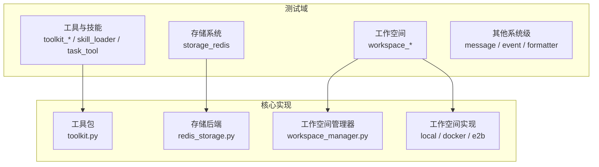
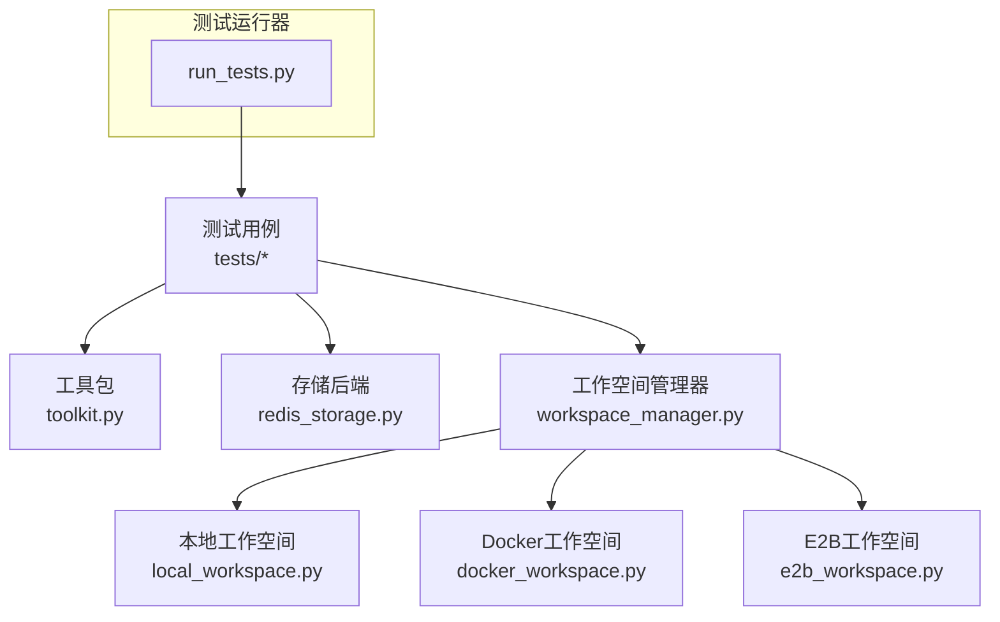
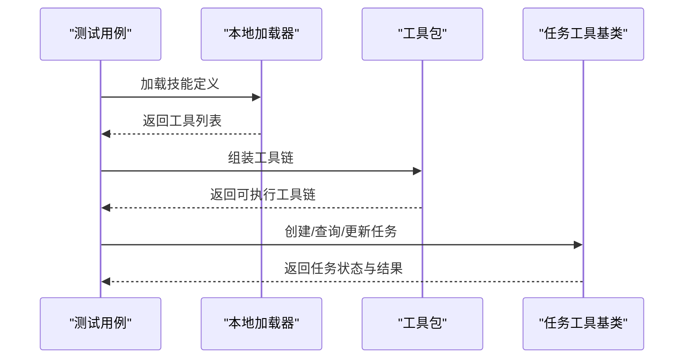
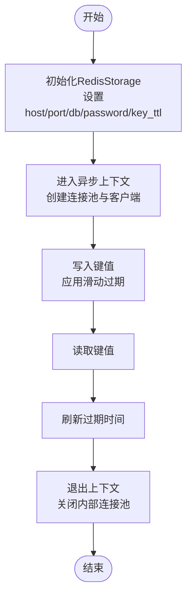
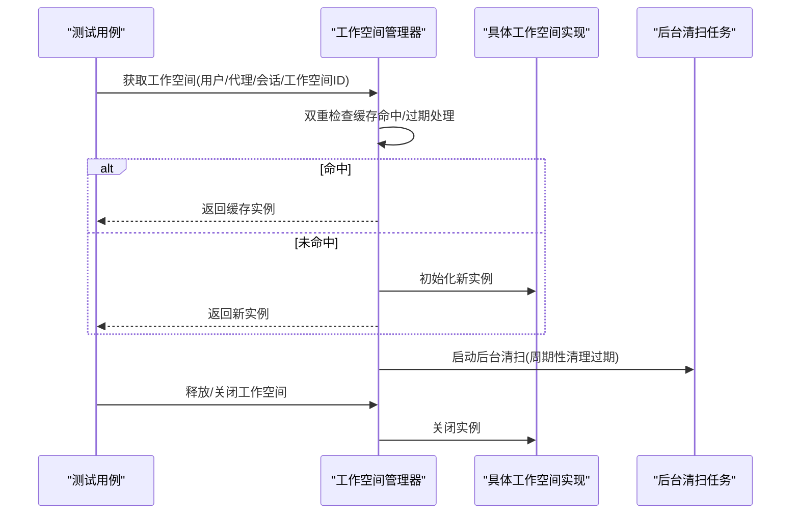
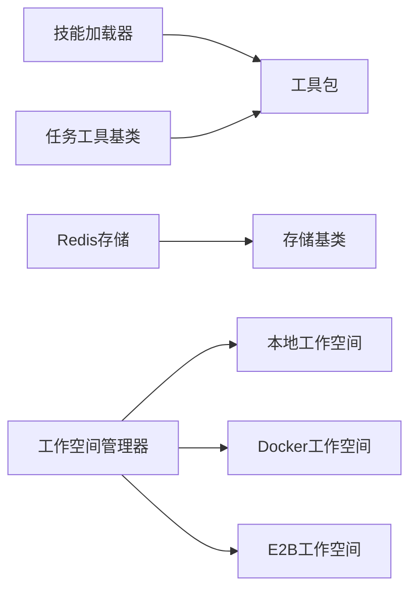

# 集成测试

<cite>
**本文引用的文件**
- [run_tests.py](file://scripts/model_examples/run_tests.py)
- [storage_redis_test.py](file://tests/storage_redis_test.py)
- [workspace_docker_test.py](file://tests/workspace_docker_test.py)
- [workspace_e2b_test.py](file://tests/workspace_e2b_test.py)
- [workspace_local_test.py](file://tests/workspace_local_test.py)
- [toolkit_test.py](file://tests/toolkit_test.py)
- [toolkit_skill_test.py](file://tests/toolkit_skill_test.py)
- [toolkit_task_test.py](file://tests/toolkit_task_test.py)
- [skill_loader_test.py](file://tests/skill_loader_test.py)
- [task_tool_test.py](file://tests/task_tool_test.py)
- [_redis_storage.py](file://src/agentscope/app/storage/_redis_storage.py)
- [_workspace_manager.py](file://src/agentscope/app/_manager/_workspace_manager.py)
- [_e2b_workspace_manager.py](file://src/agentscope/app/_manager/_e2b_workspace_manager.py)
- [_docker_workspace_manager.py](file://src/agentscope/app/_manager/_docker_workspace_manager.py)
- [_local_workspace.py](file://src/agentscope/workspace/_local_workspace.py)
- [_e2b_workspace.py](file://src/agentscope/workspace/_e2b/_e2b_workspace.py)
- [_docker_workspace.py](file://src/agentscope/workspace/_docker/_docker_workspace.py)
- [_base.py](file://src/agentscope/workspace/_base.py)
- [_toolkit.py](file://src/agentscope/tool/_toolkit.py)
- [_task_tool_base.py](file://src/agentscope/tool/_task/_task_tool_base.py)
- [_local_loader.py](file://src/agentscope/skill/_local_loader.py)
</cite>

## 目录
1. [引言](#引言)
2. [项目结构](#项目结构)
3. [核心组件](#核心组件)
4. [架构总览](#架构总览)
5. [详细组件分析](#详细组件分析)
6. [依赖关系分析](#依赖关系分析)
7. [性能考量](#性能考量)
8. [故障排查指南](#故障排查指南)
9. [结论](#结论)
10. [附录](#附录)

## 引言
本文件面向AgentScope的集成测试，目标是系统性说明多组件协作与系统级功能验证的策略，并覆盖以下主题：
- 工具包集成测试：技能加载、任务执行与工具链组合测试
- 存储系统集成测试：Redis存储、数据持久化与并发访问测试
- 工作空间集成测试：Docker、E2B与本地工作空间的集成验证
- 集成测试环境搭建与测试数据准备的完整指南

通过并行运行与分层验证，确保从单组件到端到端流程的稳定性与一致性。

## 项目结构
AgentScope的集成测试主要分布在tests目录中，按功能域划分如下：
- 工具与技能：toolkit系列、skill_loader、task_tool
- 存储：storage_redis
- 工作空间：workspace_docker、workspace_e2b、workspace_local
- 其他：message、event、formatter等（用于系统级消息与协议验证）

**图表来源**
- [toolkit_test.py](file://tests/toolkit_test.py)
- [_toolkit.py](file://src/agentscope/tool/_toolkit.py)
- [storage_redis_test.py](file://tests/storage_redis_test.py)
- [_redis_storage.py](file://src/agentscope/app/storage/_redis_storage.py)
- [workspace_docker_test.py](file://tests/workspace_docker_test.py)
- [_workspace_manager.py](file://src/agentscope/app/_manager/_workspace_manager.py)
- [_local_workspace.py](file://src/agentscope/workspace/_local_workspace.py)
- [_docker_workspace.py](file://src/agentscope/workspace/_docker/_docker_workspace.py)
- [_e2b_workspace.py](file://src/agentscope/workspace/_e2b/_e2b_workspace.py)

**章节来源**
- [toolkit_test.py](file://tests/toolkit_test.py)
- [storage_redis_test.py](file://tests/storage_redis_test.py)
- [workspace_docker_test.py](file://tests/workspace_docker_test.py)
- [workspace_e2b_test.py](file://tests/workspace_e2b_test.py)
- [workspace_local_test.py](file://tests/workspace_local_test.py)

## 核心组件
- 工具包与工具链：负责技能封装、工具组合与任务执行编排
- 存储系统：基于Redis的异步存储实现，支持键模板、滑动过期与连接池管理
- 工作空间管理：统一抽象工作空间生命周期管理，支持Docker、E2B与本地实现
- 测试运行器：提供跨模型/格式化器的批量测试与结果汇总

**章节来源**
- [_toolkit.py](file://src/agentscope/tool/_toolkit.py)
- [_redis_storage.py](file://src/agentscope/app/storage/_redis_storage.py)
- [_workspace_manager.py](file://src/agentscope/app/_manager/_workspace_manager.py)
- [run_tests.py](file://scripts/model_examples/run_tests.py)

## 架构总览
下图展示集成测试在系统中的位置与交互路径，强调从测试用例到核心组件的调用链与数据流。

**图表来源**
- [run_tests.py](file://scripts/model_examples/run_tests.py)
- [_toolkit.py](file://src/agentscope/tool/_toolkit.py)
- [_redis_storage.py](file://src/agentscope/app/storage/_redis_storage.py)
- [_workspace_manager.py](file://src/agentscope/app/_manager/_workspace_manager.py)
- [_local_workspace.py](file://src/agentscope/workspace/_local_workspace.py)
- [_docker_workspace.py](file://src/agentscope/workspace/_docker/_docker_workspace.py)
- [_e2b_workspace.py](file://src/agentscope/workspace/_e2b/_e2b_workspace.py)

## 详细组件分析

### 工具包集成测试
目标：验证技能加载、工具链组合与任务执行的端到端流程。
- 技能加载：通过本地加载器解析技能定义，构建工具包
- 工具链组合：将多个工具组装为复合工具链，验证参数传递与返回值
- 任务执行：模拟任务创建、查询与更新，验证工具链在任务上下文中的行为

**图表来源**
- [toolkit_test.py](file://tests/toolkit_test.py)
- [toolkit_skill_test.py](file://tests/toolkit_skill_test.py)
- [toolkit_task_test.py](file://tests/toolkit_task_test.py)
- [skill_loader_test.py](file://tests/skill_loader_test.py)
- [task_tool_test.py](file://tests/task_tool_test.py)
- [_local_loader.py](file://src/agentscope/skill/_local_loader.py)
- [_toolkit.py](file://src/agentscope/tool/_toolkit.py)
- [_task_tool_base.py](file://src/agentscope/tool/_task/_task_tool_base.py)

**章节来源**
- [toolkit_test.py](file://tests/toolkit_test.py)
- [toolkit_skill_test.py](file://tests/toolkit_skill_test.py)
- [toolkit_task_test.py](file://tests/toolkit_task_test.py)
- [skill_loader_test.py](file://tests/skill_loader_test.py)
- [task_tool_test.py](file://tests/task_tool_test.py)
- [_local_loader.py](file://src/agentscope/skill/_local_loader.py)
- [_toolkit.py](file://src/agentscope/tool/_toolkit.py)
- [_task_tool_base.py](file://src/agentscope/tool/_task/_task_tool_base.py)

### 存储系统集成测试
目标：验证Redis存储的连接、键模板、滑动过期、并发写入与数据一致性。
- 连接与上下文：验证异步上下文进入/退出时连接池的创建与释放
- 键模板与滑动过期：验证键命名规范与过期刷新逻辑
- 并发访问：多协程同时写入/读取，验证无竞争条件与一致性

**图表来源**
- [_redis_storage.py](file://src/agentscope/app/storage/_redis_storage.py)
- [storage_redis_test.py](file://tests/storage_redis_test.py)

**章节来源**
- [_redis_storage.py](file://src/agentscope/app/storage/_redis_storage.py)
- [storage_redis_test.py](file://tests/storage_redis_test.py)

### 工作空间集成测试
目标：验证Docker、E2B与本地工作空间的生命周期管理、资源清理与并发访问。
- 生命周期管理：创建、初始化、复用与关闭
- 资源清理：超时淘汰、后台清扫任务与并发关闭
- 并发访问：多用户/多会话并发获取工作空间，验证线程安全与隔离性

**图表来源**
- [_workspace_manager.py](file://src/agentscope/app/_manager/_workspace_manager.py)
- [_e2b_workspace_manager.py](file://src/agentscope/app/_manager/_e2b_workspace_manager.py)
- [_docker_workspace_manager.py](file://src/agentscope/app/_manager/_docker_workspace_manager.py)
- [_local_workspace.py](file://src/agentscope/workspace/_local_workspace.py)
- [_e2b_workspace.py](file://src/agentscope/workspace/_e2b/_e2b_workspace.py)
- [_docker_workspace.py](file://src/agentscope/workspace/_docker/_docker_workspace.py)
- [_base.py](file://src/agentscope/workspace/_base.py)
- [workspace_docker_test.py](file://tests/workspace_docker_test.py)
- [workspace_e2b_test.py](file://tests/workspace_e2b_test.py)
- [workspace_local_test.py](file://tests/workspace_local_test.py)

**章节来源**
- [_workspace_manager.py](file://src/agentscope/app/_manager/_workspace_manager.py)
- [_e2b_workspace_manager.py](file://src/agentscope/app/_manager/_e2b_workspace_manager.py)
- [_docker_workspace_manager.py](file://src/agentscope/app/_manager/_docker_workspace_manager.py)
- [_local_workspace.py](file://src/agentscope/workspace/_local_workspace.py)
- [_e2b_workspace.py](file://src/agentscope/workspace/_e2b/_e2b_workspace.py)
- [_docker_workspace.py](file://src/agentscope/workspace/_docker/_docker_workspace.py)
- [_base.py](file://src/agentscope/workspace/_base.py)
- [workspace_docker_test.py](file://tests/workspace_docker_test.py)
- [workspace_e2b_test.py](file://tests/workspace_e2b_test.py)
- [workspace_local_test.py](file://tests/workspace_local_test.py)

## 依赖关系分析
- 工具包依赖技能加载器与任务工具基类，形成“技能→工具→任务”的链式依赖
- 存储系统依赖Redis异步客户端与连接池，提供键模板与过期控制
- 工作空间管理器依赖具体工作空间实现，统一生命周期与缓存策略

**图表来源**
- [_local_loader.py](file://src/agentscope/skill/_local_loader.py)
- [_toolkit.py](file://src/agentscope/tool/_toolkit.py)
- [_task_tool_base.py](file://src/agentscope/tool/_task/_task_tool_base.py)
- [_redis_storage.py](file://src/agentscope/app/storage/_redis_storage.py)
- [_workspace_manager.py](file://src/agentscope/app/_manager/_workspace_manager.py)
- [_local_workspace.py](file://src/agentscope/workspace/_local_workspace.py)
- [_docker_workspace.py](file://src/agentscope/workspace/_docker/_docker_workspace.py)
- [_e2b_workspace.py](file://src/agentscope/workspace/_e2b/_e2b_workspace.py)

**章节来源**
- [_local_loader.py](file://src/agentscope/skill/_local_loader.py)
- [_toolkit.py](file://src/agentscope/tool/_toolkit.py)
- [_task_tool_base.py](file://src/agentscope/tool/_task/_task_tool_base.py)
- [_redis_storage.py](file://src/agentscope/app/storage/_redis_storage.py)
- [_workspace_manager.py](file://src/agentscope/app/_manager/_workspace_manager.py)
- [_local_workspace.py](file://src/agentscope/workspace/_local_workspace.py)
- [_docker_workspace.py](file://src/agentscope/workspace/_docker/_docker_workspace.py)
- [_e2b_workspace.py](file://src/agentscope/workspace/_e2b/_e2b_workspace.py)

## 性能考量
- 工具链组合：避免重复初始化与参数拷贝，优先复用已构建的工具实例
- 存储写入：批量写入与滑动过期合并，减少网络往返；合理设置key_ttl以降低过期风暴
- 工作空间：后台清扫任务周期性清理过期实例，避免频繁创建销毁；并发关闭使用gather以缩短停顿时间
- 测试运行：run_tests.py支持超时控制与并行执行，提升整体吞吐

[本节为通用指导，不直接分析具体文件]

## 故障排查指南
- 工具包测试失败
  - 检查技能定义是否正确加载，工具链参数映射是否一致
  - 确认任务工具的输入输出格式符合预期
- 存储测试失败
  - 核对Redis连接参数与可达性；确认键模板与过期策略配置
  - 观察并发场景下的竞态条件与异常回滚
- 工作空间测试失败
  - 排查管理器缓存命中与过期逻辑；确认后台清扫任务未提前回收实例
  - 检查Docker/E2B沙箱的可用性与网络连通性

**章节来源**
- [toolkit_test.py](file://tests/toolkit_test.py)
- [storage_redis_test.py](file://tests/storage_redis_test.py)
- [workspace_docker_test.py](file://tests/workspace_docker_test.py)
- [workspace_e2b_test.py](file://tests/workspace_e2b_test.py)
- [workspace_local_test.py](file://tests/workspace_local_test.py)

## 结论
通过覆盖工具包、存储与工作空间三大域的集成测试，结合run_tests.py提供的统一执行框架，能够有效验证多组件协作与系统级功能。建议在CI中启用并行执行与超时保护，并针对关键路径增加压力与并发测试，持续保障系统的稳定性与性能。

[本节为总结性内容，不直接分析具体文件]

## 附录

### 集成测试环境搭建与测试数据准备
- 环境准备
  - 安装Python依赖与Redis服务
  - 准备Docker与E2B相关凭据与模板
- 测试数据准备
  - 工具包：准备技能定义文件与任务模板
  - 存储：准备Redis键空间与初始数据
  - 工作空间：准备沙箱模板与必要依赖
- 执行方式
  - 使用run_tests.py选择提供商与测试类型，设置超时与详细输出

**章节来源**
- [run_tests.py](file://scripts/model_examples/run_tests.py)