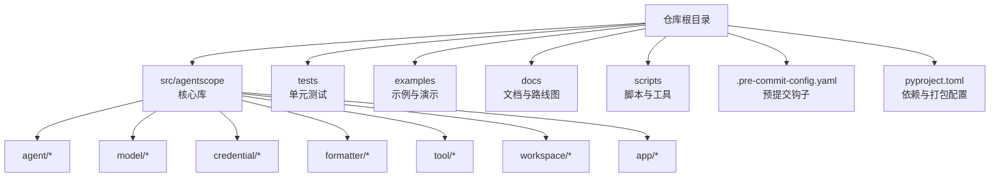
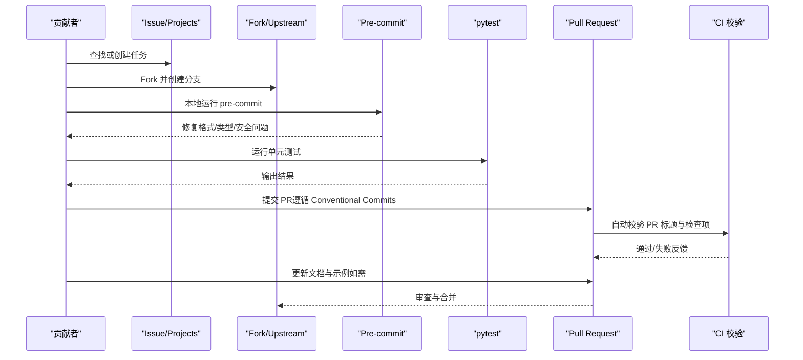
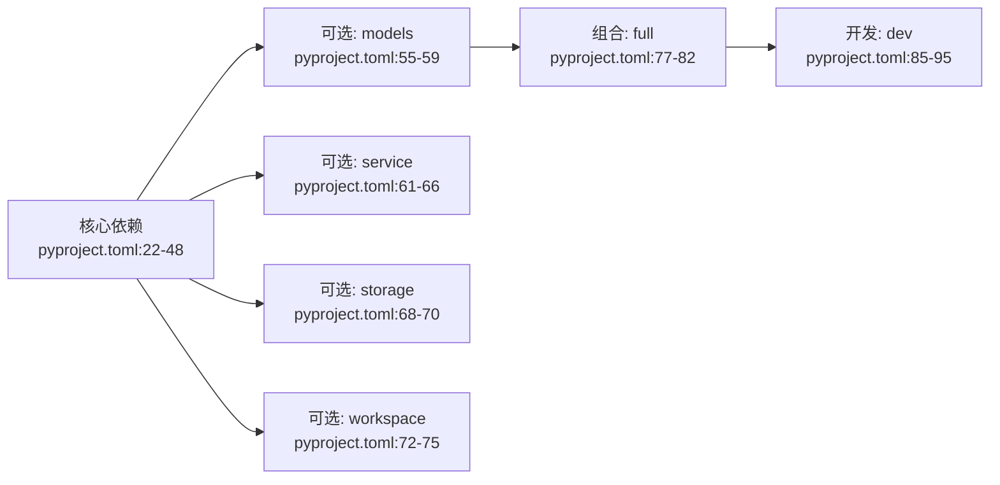

# 贡献指南

<cite>
**本文引用的文件**
- [CONTRIBUTING.md](file://CONTRIBUTING.md)
- [.pre-commit-config.yaml](file://.pre-commit-config.yaml)
- [pyproject.toml](file://pyproject.toml)
- [.github/PULL_REQUEST_TEMPLATE.md](file://.github/PULL_REQUEST_TEMPLATE.md)
- [.github/copilot-instructions.md](file://.github/copilot-instructions.md)
- [README.md](file://README.md)
- [CONTRIBUTING_zh.md](file://CONTRIBUTING_zh.md)
- [tests/test_template.py](file://tests/test_template.py)
- [scripts/model_examples/run_tests.py](file://scripts/model_examples/run_tests.py)
</cite>

## 目录
1. [简介](#简介)
2. [项目结构](#项目结构)
3. [核心组件](#核心组件)
4. [架构总览](#架构总览)
5. [详细组件分析](#详细组件分析)
6. [依赖分析](#依赖分析)
7. [性能考虑](#性能考虑)
8. [故障排查指南](#故障排查指南)
9. [结论](#结论)
10. [附录](#附录)

## 简介
本指南面向希望参与 AgentScope 开源项目的贡献者，涵盖从开发环境搭建、代码与文档规范、提交与审查流程，到问题报告与功能请求的完整实践。AgentScope 采用“约定式提交”与“惰性导入”等工程实践，强调可维护性、可测试性与一致性。

## 项目结构
AgentScope 采用“按功能域分层 + 可选特性分组”的组织方式：
- 核心库位于 src/agentscope，包含 agent、model、credential、formatter、tool、workspace、app 等子系统
- 可选特性通过 pyproject.toml 的 optional-dependencies 分组管理（如 models、service、storage、workspace）
- 开发工具与测试通过 dev 组合依赖统一管理
- 文档与示例分别位于 docs 与 examples 目录

图表来源
- [pyproject.toml:1-122](file://pyproject.toml#L1-L122)
- [CONTRIBUTING.md:285-408](file://CONTRIBUTING.md#L285-L408)

章节来源
- [pyproject.toml:1-122](file://pyproject.toml#L1-L122)
- [CONTRIBUTING.md:285-408](file://CONTRIBUTING.md#L285-L408)

## 核心组件
- 贡献流程与规范：从 issue 认领、Fork 与分支、本地环境搭建、开发与测试、提交与 PR 标题格式，到文档与示例更新
- 预提交与静态检查：pre-commit 钩子自动执行 AST/格式/类型/安全等检查
- 依赖与可选特性：通过 optional-dependencies 实现按需加载与最小依赖
- 测试与覆盖率：单元测试模板与批量测试脚本，确保功能正确性与回归稳定性

章节来源
- [CONTRIBUTING.md:79-284](file://CONTRIBUTING.md#L79-L284)
- [.pre-commit-config.yaml:1-117](file://.pre-commit-config.yaml#L1-L117)
- [pyproject.toml:50-95](file://pyproject.toml#L50-L95)
- [tests/test_template.py:1-16](file://tests/test_template.py#L1-L16)
- [scripts/model_examples/run_tests.py:209-407](file://scripts/model_examples/run_tests.py#L209-L407)

## 架构总览
下图展示了贡献者从“发现任务”到“代码合入”的端到端流程，以及与 CI/PR 标题校验、预提交钩子、测试与文档更新的关系。

图表来源
- [CONTRIBUTING.md:83-284](file://CONTRIBUTING.md#L83-L284)
- [.github/PULL_REQUEST_TEMPLATE.md:1-25](file://.github/PULL_REQUEST_TEMPLATE.md#L1-L25)
- [.pre-commit-config.yaml:1-117](file://.pre-commit-config.yaml#L1-L117)

## 详细组件分析

### 开发环境搭建与依赖管理
- Python 版本要求：3.11+
- 推荐使用虚拟环境（uv/virtualenv/conda），以可编辑模式安装 dev 组合依赖，一键获得测试、文档与预提交工具
- 安装后启用 git 预提交钩子，确保每次提交前自动执行格式化与静态检查

章节来源
- [CONTRIBUTING.md:114-136](file://CONTRIBUTING.md#L114-L136)
- [pyproject.toml:21-95](file://pyproject.toml#L21-L95)

### 代码规范与风格指南
- 惰性导入：可选依赖（来自 optional-dependencies 的包）必须在使用点惰性导入，避免模块顶部集中导入
- 预提交钩子：自动执行 AST/JSON/YAML/XML/TOML 检查、文档首句检查、私钥检测、尾随空白清理、类型检查（mypy）、flake8、pylint、black 格式化等
- 文档注释：遵循 Google 风格（PR 模板中明确要求），英文编写，使用 reStructuredText 特殊语法标注示例与提示
- 提交信息：严格遵循 Conventional Commits；PR 标题与提交信息格式一致，类型与范围限制明确

章节来源
- [CONTRIBUTING.md:137-190](file://CONTRIBUTING.md#L137-L190)
- [.pre-commit-config.yaml:1-117](file://.pre-commit-config.yaml#L1-L117)
- [.github/PULL_REQUEST_TEMPLATE.md:17-25](file://.github/PULL_REQUEST_TEMPLATE.md#L17-L25)
- [.github/copilot-instructions.md:42-87](file://.github/copilot-instructions.md#L42-L87)

### Pull Request 流程与审查要点
- 分支策略：基于 main 创建 feat/fix/docs/refactor/perf/ci/chore 等前缀的短描述分支
- PR 标题：遵循 Conventional Commits，类型与范围校验由 CI 自动执行
- 审查清单：预提交通过、测试全部通过、docstring 符合 Google 风格、相关文档已更新、代码可审查
- 合并规则：破坏性变更需在 PR 描述中明确说明；避免绕过惰性导入与忽略 CI 失败

章节来源
- [CONTRIBUTING.md:191-258](file://CONTRIBUTING.md#L191-L258)
- [.github/PULL_REQUEST_TEMPLATE.md:1-25](file://.github/PULL_REQUEST_TEMPLATE.md#L1-L25)
- [.github/copilot-instructions.md:90-96](file://.github/copilot-instructions.md#L90-L96)

### 问题报告与功能请求
- 问题报告：在 Issues 中描述问题、复现步骤与期望结果；涉及 AI 辅助时，需自行审阅并确保可解释性
- 功能请求：在 Projects/Issues 中提出提案，等待核心团队反馈后再进行实现，避免无谓返工
- 社区支持：通过 Discussions、Issues、Discord/DingTalk 等渠道获取帮助

章节来源
- [CONTRIBUTING.md:42-44](file://CONTRIBUTING.md#L42-L44)
- [CONTRIBUTING.md:409-416](file://CONTRIBUTING.md#L409-L416)
- [README.md:81-88](file://README.md#L81-L88)

### 模块特定贡献指南
- Chat Model 贡献需配套 Credential、Chat Model 类、Model Card YAML 与 Formatter（单用户与多智能体两类）
- Agent：核心仅保留单一 Agent 类，特殊 Agent 作为 examples 贡献
- Workspace：新增后端需配套 Workspace 类、Workspace Manager 类与文档
- Examples：examples 目录用于展示具体能力的参考实现，完整应用建议贡献至 agentscope-samples

章节来源
- [CONTRIBUTING.md:285-408](file://CONTRIBUTING.md#L285-L408)

### 测试与验证
- 单元测试：遵循 tests/test_template.py 的模板结构，异步测试用例建议使用 IsolatedAsyncioTestCase
- 批量测试：scripts/model_examples/run_tests.py 提供统一的测试执行与汇总逻辑，支持超时、颜色输出与失败重试
- 预提交与 CI：pre-commit 与 CI 共同保障代码质量，避免跳过文件级检查

章节来源
- [tests/test_template.py:1-16](file://tests/test_template.py#L1-L16)
- [scripts/model_examples/run_tests.py:209-407](file://scripts/model_examples/run_tests.py#L209-L407)
- [.pre-commit-config.yaml:1-117](file://.pre-commit-config.yaml#L1-L117)

## 依赖分析
- 最小依赖：核心库保持精简，仅包含必要依赖
- 可选特性：通过 optional-dependencies 分组（models、service、storage、workspace、full），按需启用
- 开发依赖：dev 组合包含 pytest、pre-commit、文档工具链与 fakeredis 等

图表来源
- [pyproject.toml:22-95](file://pyproject.toml#L22-L95)

章节来源
- [pyproject.toml:22-95](file://pyproject.toml#L22-L95)

## 性能考虑
- 惰性导入降低启动时的模块加载成本，仅在使用时触发 ImportError
- 预提交与 CI 中的类型检查与复杂度限制有助于控制函数与模块规模，提升长期可维护性
- 测试脚本提供超时与汇总统计，便于快速定位耗时问题

章节来源
- [CONTRIBUTING.md:139-156](file://CONTRIBUTING.md#L139-L156)
- [.pre-commit-config.yaml:27-50](file://.pre-commit-config.yaml#L27-L50)
- [scripts/model_examples/run_tests.py:209-407](file://scripts/model_examples/run_tests.py#L209-L407)

## 故障排查指南
- 预提交失败
  - 现象：AST/JSON/YAML/XML/TOML/Docstring/私钥/空白等检查失败
  - 处理：根据提示修复或自动修复，重新提交；避免使用 --no-verify 跳过检查
- 类型检查失败
  - 现象：mypy 报告未定义/不完整定义/导入缺失等问题
  - 处理：补充类型注解或在排除列表中合理配置
- 测试失败
  - 现象：pytest 报错或覆盖率不足
  - 处理：完善测试用例，确保可选特性测试在缺失依赖时可跳过
- PR 标题不合规
  - 现象：CI 校验失败，提示类型或范围格式错误
  - 处理：修改 PR 标题为符合 Conventional Commits 的格式

章节来源
- [.pre-commit-config.yaml:1-117](file://.pre-commit-config.yaml#L1-L117)
- [.github/PULL_REQUEST_TEMPLATE.md:1-25](file://.github/PULL_REQUEST_TEMPLATE.md#L1-L25)
- [CONTRIBUTING.md:165-190](file://CONTRIBUTING.md#L165-L190)

## 结论
AgentScope 的贡献流程以“可维护性优先、测试驱动、规范先行”为核心，通过惰性导入、预提交钩子与 CI 校验形成闭环。遵循本指南可显著提升贡献效率与代码质量，加速功能落地与社区协作。

## 附录
- 社区行为准则与沟通渠道：遵循项目内行为准则，通过 Discussions、Issues、Discord/DingTalk 获取支持
- 中文贡献指南：提供中文版本的贡献流程与规范说明

章节来源
- [CONTRIBUTING.md:409-416](file://CONTRIBUTING.md#L409-L416)
- [README.md:81-88](file://README.md#L81-L88)
- [CONTRIBUTING_zh.md:1-299](file://CONTRIBUTING_zh.md#L1-L299)