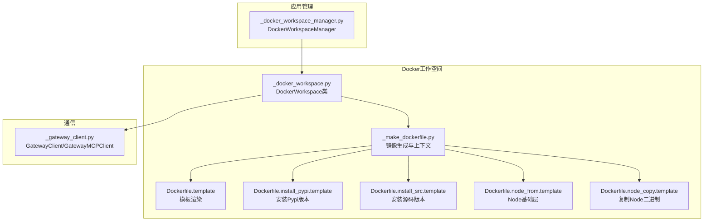
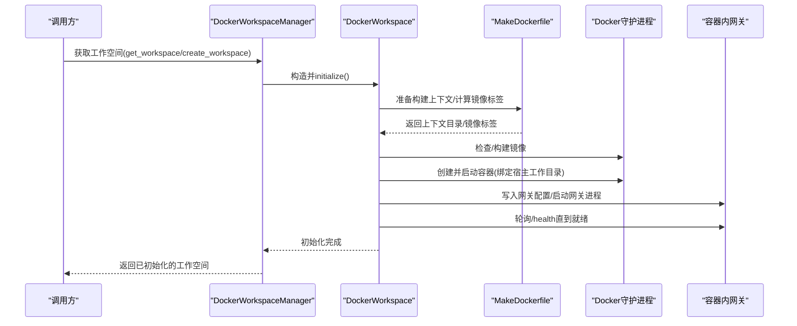
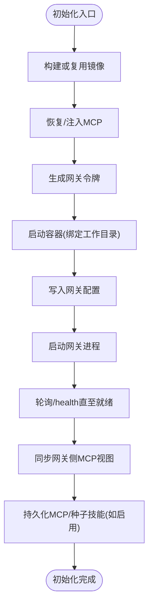
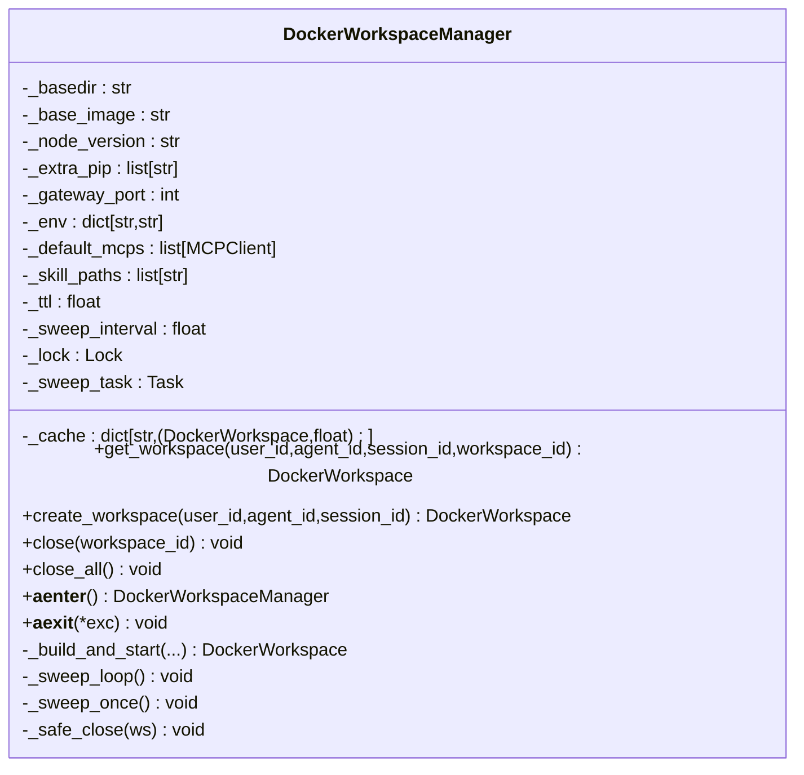
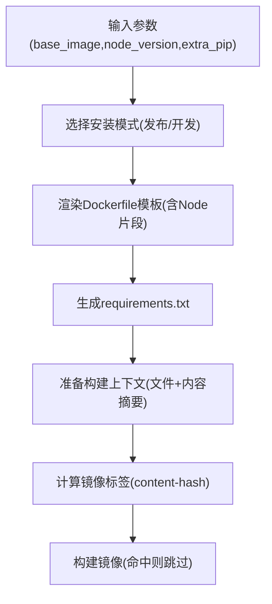
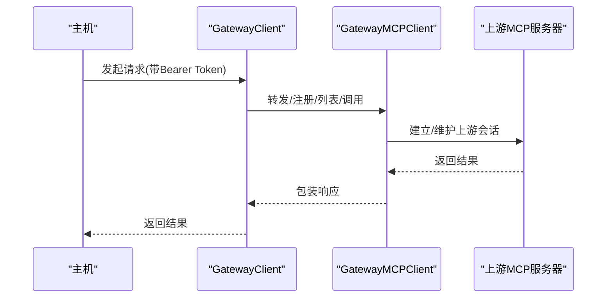
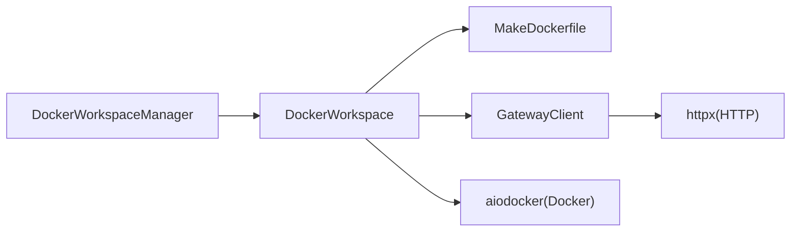
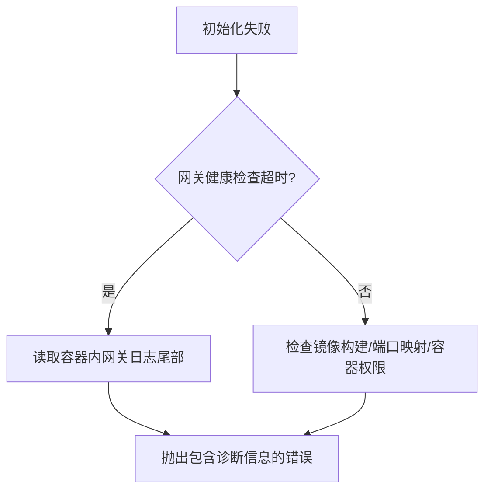

# Docker容器化部署

<cite>
**本文引用的文件**
- [src/agentscope/workspace/_docker/__init__.py](file://src/agentscope/workspace/_docker/__init__.py)
- [src/agentscope/workspace/_docker/_docker_workspace.py](file://src/agentscope/workspace/_docker/_docker_workspace.py)
- [src/agentscope/workspace/_docker/_make_dockerfile.py](file://src/agentscope/workspace/_docker/_make_dockerfile.py)
- [src/agentscope/workspace/_docker/Dockerfile.template](file://src/agentscope/workspace/_docker/Dockerfile.template)
- [src/agentscope/workspace/_docker/Dockerfile.install_pypi.template](file://src/agentscope/workspace/_docker/Dockerfile.install_pypi.template)
- [src/agentscope/workspace/_docker/Dockerfile.install_src.template](file://src/agentscope/workspace/_docker/Dockerfile.install_src.template)
- [src/agentscope/workspace/_docker/Dockerfile.node_from.template](file://src/agentscope/workspace/_docker/Dockerfile.node_from.template)
- [src/agentscope/workspace/_docker/Dockerfile.node_copy.template](file://src/agentscope/workspace/_docker/Dockerfile.node_copy.template)
- [src/agentscope/app/_manager/_docker_workspace_manager.py](file://src/agentscope/app/_manager/_docker_workspace_manager.py)
- [src/agentscope/workspace/_gateway_client.py](file://src/agentscope/workspace/_gateway_client.py)
- [tests/workspace_docker_test.py](file://tests/workspace_docker_test.py)
</cite>

## 目录
1. [简介](#简介)
2. [项目结构](#项目结构)
3. [核心组件](#核心组件)
4. [架构总览](#架构总览)
5. [组件详解](#组件详解)
6. [依赖关系分析](#依赖关系分析)
7. [性能与资源特性](#性能与资源特性)
8. [安全与合规](#安全与合规)
9. [故障排查与日志](#故障排查与日志)
10. [结论](#结论)
11. [附录：Docker Compose与多容器编排](#附录docker-compose与多容器编排)

## 简介
本文件面向在AgentScope中使用Docker容器化工作空间的用户与运维人员，系统性阐述Docker工作空间的构建与运行机制、容器生命周期管理、缓存与资源隔离策略、以及安全与可观测性最佳实践。文档同时提供基于现有源码的架构图与流程图，帮助读者快速理解从镜像构建到容器启动、再到网关服务与MCP工具链交互的完整路径。

## 项目结构
与Docker容器化部署直接相关的模块主要集中在以下位置：
- 工作空间实现：src/agentscope/workspace/_docker/
- 工作空间管理器：src/agentscope/app/_manager/_docker_workspace_manager.py
- 网关客户端：src/agentscope/workspace/_gateway_client.py
- 测试用例：tests/workspace_docker_test.py

下图给出与Docker工作空间相关的文件级关系概览：

图表来源
- [src/agentscope/workspace/_docker/_docker_workspace.py:127-396](file://src/agentscope/workspace/_docker/_docker_workspace.py#L127-L396)
- [src/agentscope/workspace/_docker/_make_dockerfile.py:109-276](file://src/agentscope/workspace/_docker/_make_dockerfile.py#L109-L276)
- [src/agentscope/app/_manager/_docker_workspace_manager.py:45-372](file://src/agentscope/app/_manager/_docker_workspace_manager.py#L45-L372)
- [src/agentscope/workspace/_gateway_client.py:245-539](file://src/agentscope/workspace/_gateway_client.py#L245-L539)

章节来源
- [src/agentscope/workspace/_docker/__init__.py:1-13](file://src/agentscope/workspace/_docker/__init__.py#L1-L13)
- [src/agentscope/workspace/_docker/_docker_workspace.py:1-120](file://src/agentscope/workspace/_docker/_docker_workspace.py#L1-L120)
- [src/agentscope/workspace/_docker/_make_dockerfile.py:1-68](file://src/agentscope/workspace/_docker/_make_dockerfile.py#L1-L68)
- [src/agentscope/app/_manager/_docker_workspace_manager.py:1-70](file://src/agentscope/app/_manager/_docker_workspace_manager.py#L1-L70)

## 核心组件
- DockerWorkspace：基于Docker的沙箱工作空间，负责镜像构建、容器创建与启动、网关进程管理、MCP注册与技能管理等。
- DockerWorkspaceManager：对DockerWorkspace进行TTL缓存与后台清理，支持并发访问下的幂等构建与并行关闭。
- 镜像生成器（MakeDockerfile）：根据模板渲染Dockerfile，计算镜像标签，准备构建上下文，支持发布版与开发版两种安装模式。
- 网关客户端：通过HTTP与容器内网关通信，实现MCP连接、列表与调用。

章节来源
- [src/agentscope/workspace/_docker/_docker_workspace.py:127-396](file://src/agentscope/workspace/_docker/_docker_workspace.py#L127-L396)
- [src/agentscope/app/_manager/_docker_workspace_manager.py:45-122](file://src/agentscope/app/_manager/_docker_workspace_manager.py#L45-L122)
- [src/agentscope/workspace/_docker/_make_dockerfile.py:109-276](file://src/agentscope/workspace/_docker/_make_dockerfile.py#L109-L276)
- [src/agentscope/workspace/_gateway_client.py:245-539](file://src/agentscope/workspace/_gateway_client.py#L245-L539)

## 架构总览
下图展示Docker工作空间从初始化到可用的关键步骤，以及与管理器、网关客户端之间的交互：

图表来源
- [src/agentscope/app/_manager/_docker_workspace_manager.py:167-271](file://src/agentscope/app/_manager/_docker_workspace_manager.py#L167-L271)
- [src/agentscope/workspace/_docker/_docker_workspace.py:230-293](file://src/agentscope/workspace/_docker/_docker_workspace.py#L230-L293)
- [src/agentscope/workspace/_docker/_make_dockerfile.py:196-276](file://src/agentscope/workspace/_docker/_make_dockerfile.py#L196-L276)
- [src/agentscope/workspace/_gateway_client.py:515-521](file://src/agentscope/workspace/_gateway_client.py#L515-L521)

## 组件详解

### Docker工作空间（DockerWorkspace）
- 容器生命周期
  - 初始化：构建或复用镜像、恢复/注入MCP、生成网关令牌、启动容器、写入网关配置、启动网关进程、等待健康检查、拉取网关侧MCP视图、持久化状态。
  - 关闭：关闭网关客户端、尝试将宿主工作目录所有权归还给当前UID/GID（Linux）、杀死并删除容器、释放客户端句柄。
- 缓存与镜像标签
  - 基于Dockerfile文本与COPY文件内容计算镜像标签，命中则跳过构建。
- 卷挂载与持久化
  - 可选绑定宿主工作目录至容器内/workspace；重启时从宿主/.mcp恢复MCP列表，skills/sessions/data目录持久化。
- 网络与端口
  - 网关端口在容器内固定，映射到宿主机随机端口；通过本地回环地址与网关通信。
- 资源隔离
  - 每个工作空间独立容器，隔离文件系统、进程与网络命名空间；可结合宿主文件权限控制（Linux）降低权限问题。

图表来源
- [src/agentscope/workspace/_docker/_docker_workspace.py:230-293](file://src/agentscope/workspace/_docker/_docker_workspace.py#L230-L293)
- [src/agentscope/workspace/_docker/_docker_workspace.py:914-946](file://src/agentscope/workspace/_docker/_docker_workspace.py#L914-L946)
- [src/agentscope/workspace/_docker/_docker_workspace.py:940-981](file://src/agentscope/workspace/_docker/_docker_workspace.py#L940-L981)
- [src/agentscope/workspace/_docker/_docker_workspace.py:982-1007](file://src/agentscope/workspace/_docker/_docker_workspace.py#L982-L1007)

章节来源
- [src/agentscope/workspace/_docker/_docker_workspace.py:228-384](file://src/agentscope/workspace/_docker/_docker_workspace.py#L228-L384)
- [src/agentscope/workspace/_docker/_docker_workspace.py:914-1007](file://src/agentscope/workspace/_docker/_docker_workspace.py#L914-L1007)

### Docker工作空间管理器（DockerWorkspaceManager）
- 缓存与隔离
  - 基于workspace_id的TTL缓存，两层目录布局避免不同用户共享同一bind-mount。
  - 后台清扫任务按间隔扫描并清理超时未使用的容器。
- 并发与一致性
  - 使用锁防止同一workspace_id并发重复创建；缓存命中时仅更新最近访问时间。
- 关闭策略
  - 应用退出时并行关闭所有缓存中的工作空间，提升关闭效率。

图表来源
- [src/agentscope/app/_manager/_docker_workspace_manager.py:45-372](file://src/agentscope/app/_manager/_docker_workspace_manager.py#L45-L372)

章节来源
- [src/agentscope/app/_manager/_docker_workspace_manager.py:45-122](file://src/agentscope/app/_manager/_docker_workspace_manager.py#L45-L122)
- [src/agentscope/app/_manager/_docker_workspace_manager.py:167-372](file://src/agentscope/app/_manager/_docker_workspace_manager.py#L167-L372)

### 镜像生成与模板（MakeDockerfile）
- 模板体系
  - 主模板：定义基础镜像、uv虚拟环境、requirements安装、Node复制（可选）、网关脚本拷贝与工作目录。
  - 安装模式：发布版（PyPI）与开发版（源码树）自动选择。
  - Node集成：可从官方Node slim镜像复制node/npm到目标镜像。
- 标签与上下文
  - 计算镜像标签时包含Dockerfile与所有COPY文件内容摘要，确保构建结果可重现且可缓存。
  - 构建上下文包含Dockerfile、requirements.txt、网关脚本与源码树（开发模式）。

图表来源
- [src/agentscope/workspace/_docker/_make_dockerfile.py:196-276](file://src/agentscope/workspace/_docker/_make_dockerfile.py#L196-L276)
- [src/agentscope/workspace/_docker/Dockerfile.template:1-46](file://src/agentscope/workspace/_docker/Dockerfile.template#L1-L46)
- [src/agentscope/workspace/_docker/Dockerfile.install_pypi.template:1-6](file://src/agentscope/workspace/_docker/Dockerfile.install_pypi.template#L1-L6)
- [src/agentscope/workspace/_docker/Dockerfile.install_src.template:1-13](file://src/agentscope/workspace/_docker/Dockerfile.install_src.template#L1-L13)
- [src/agentscope/workspace/_docker/Dockerfile.node_from.template:1-1](file://src/agentscope/workspace/_docker/Dockerfile.node_from.template#L1-L1)
- [src/agentscope/workspace/_docker/Dockerfile.node_copy.template:1-5](file://src/agentscope/workspace/_docker/Dockerfile.node_copy.template#L1-L5)

章节来源
- [src/agentscope/workspace/_docker/_make_dockerfile.py:109-276](file://src/agentscope/workspace/_docker/_make_dockerfile.py#L109-L276)
- [src/agentscope/workspace/_docker/Dockerfile.template:1-46](file://src/agentscope/workspace/_docker/Dockerfile.template#L1-L46)

### 网关客户端（GatewayClient/GatewayMCPClient）
- 通信模型
  - 主机侧通过Bearer Token向容器内网关发起HTTP请求；网关内部维护上游MCP会话。
- 关键能力
  - 健康检查：轮询/health确认网关就绪。
  - MCP管理：注册/注销MCP，拉取已注册列表，转发工具调用。
  - 连接语义：无状态MCP直接透传，有状态MCP由网关在容器内启动并保持会话。

图表来源
- [src/agentscope/workspace/_gateway_client.py:245-539](file://src/agentscope/workspace/_gateway_client.py#L245-L539)

章节来源
- [src/agentscope/workspace/_gateway_client.py:245-539](file://src/agentscope/workspace/_gateway_client.py#L245-L539)

## 依赖关系分析
- 组件耦合
  - DockerWorkspaceManager持有DockerWorkspace实例并进行缓存与清扫；DockerWorkspace依赖MakeDockerfile生成镜像与上下文；DockerWorkspace通过GatewayClient与容器内网关交互。
- 外部依赖
  - Docker守护进程（aiodocker）用于镜像构建与容器生命周期管理。
  - 网关脚本与FastAPI/uvicorn组合提供HTTP接口。
- 潜在循环
  - 源码结构清晰分层，未见循环导入迹象。

图表来源
- [src/agentscope/app/_manager/_docker_workspace_manager.py:35-40](file://src/agentscope/app/_manager/_docker_workspace_manager.py#L35-L40)
- [src/agentscope/workspace/_docker/_docker_workspace.py:47-77](file://src/agentscope/workspace/_docker/_docker_workspace.py#L47-L77)
- [src/agentscope/workspace/_gateway_client.py:245-261](file://src/agentscope/workspace/_gateway_client.py#L245-L261)

章节来源
- [src/agentscope/app/_manager/_docker_workspace_manager.py:35-40](file://src/agentscope/app/_manager/_docker_workspace_manager.py#L35-L40)
- [src/agentscope/workspace/_docker/_docker_workspace.py:47-77](file://src/agentscope/workspace/_docker/_docker_workspace.py#L47-L77)
- [src/agentscope/workspace/_gateway_client.py:245-261](file://src/agentscope/workspace/_gateway_client.py#L245-L261)

## 性能与资源特性
- 镜像构建缓存
  - 通过content-hash标签避免重复构建，显著缩短后续启动时间。
- 并发与批量操作
  - 管理器在应用关闭时并行关闭所有容器，减少停机时间。
- 资源隔离
  - 每个工作空间独立容器，天然隔离CPU、内存与存储；可通过宿主资源限制进一步约束。
- I/O与持久化
  - 宿主工作目录绑定提供持久化能力；容器内/workspace为统一工作区，便于工具链访问。

[本节为通用性能讨论，不直接分析具体文件]

## 安全与合规
- 访问控制
  - 网关使用一次性Bearer Token，不落盘，降低泄露风险；每次initialize重新生成。
- 权限与隔离
  - 容器内以root运行，Linux平台在关闭时尝试将宿主工作目录所有权归还当前UID/GID，降低权限残留。
- 最小暴露面
  - 网关端口映射到宿主机随机端口，避免固定端口暴露；容器内仅开放网关端口。
- 安装模式
  - 发布版从PyPI安装，减少容器内依赖树复杂度；开发版仅在调试场景使用。

章节来源
- [src/agentscope/workspace/_docker/_docker_workspace.py:267-279](file://src/agentscope/workspace/_docker/_docker_workspace.py#L267-L279)
- [src/agentscope/workspace/_docker/_docker_workspace.py:358-374](file://src/agentscope/workspace/_docker/_docker_workspace.py#L358-L374)
- [src/agentscope/workspace/_docker/_make_dockerfile.py:220-232](file://src/agentscope/workspace/_docker/_make_dockerfile.py#L220-L232)

## 故障排查与日志
- 启动失败定位
  - 初始化阶段若网关未在时限内就绪，会读取容器内网关日志尾部作为错误上下文返回。
- 关闭异常处理
  - 关闭过程吞掉非致命异常，保证close总是可安全调用。
- 测试验证
  - 测试覆盖了初始化/关闭、空MCP列表、工具列表为空、跨重启持久化等关键行为。

图表来源
- [src/agentscope/workspace/_docker/_docker_workspace.py:982-1007](file://src/agentscope/workspace/_docker/_docker_workspace.py#L982-L1007)
- [src/agentscope/workspace/_docker/_docker_workspace.py:332-384](file://src/agentscope/workspace/_docker/_docker_workspace.py#L332-L384)

章节来源
- [src/agentscope/workspace/_docker/_docker_workspace.py:982-1007](file://src/agentscope/workspace/_docker/_docker_workspace.py#L982-L1007)
- [src/agentscope/workspace/_docker/_docker_workspace.py:332-384](file://src/agentscope/workspace/_docker/_docker_workspace.py#L332-L384)
- [tests/workspace_docker_test.py:688-726](file://tests/workspace_docker_test.py#L688-L726)

## 结论
AgentScope的Docker容器化工作空间通过“模板渲染+内容哈希”的镜像构建策略、严格的容器生命周期管理与TTL缓存清扫机制，实现了高可靠、可扩展且易于运维的沙箱执行环境。配合一次性网关令牌与最小暴露面的端口映射，整体方案在安全性与易用性之间取得良好平衡。建议在生产环境中结合资源限制、健康检查与日志采集策略，进一步强化稳定性与可观测性。

[本节为总结性内容，不直接分析具体文件]

## 附录：Docker Compose与多容器编排
说明
- 本仓库未提供现成的Docker Compose配置文件。以下为基于现有组件的编排思路与最佳实践建议，便于在实际环境中落地。
- 由于本仓库未包含Compose文件，此处不提供具体YAML内容与图示。

最佳实践
- 基础镜像选择
  - 推荐使用官方Python slim镜像作为基础，确保可复现性与体积可控。
- 网络配置
  - 将容器置于自定义桥接网络，仅暴露网关端口；避免使用host网络模式。
- 卷挂载
  - 将宿主工作目录绑定到容器内/workspace，确保会话与技能持久化。
- 端口映射
  - 使用随机映射或范围映射，避免端口冲突；通过服务发现或反向代理统一入口。
- 资源限制
  - 为容器设置CPU/内存上限与预留，防止资源争用；结合节点亲和性分散负载。
- 安全加固
  - 以非root用户运行容器内的应用逻辑（如需要），并通过只读根文件系统与最小权限卷挂载降低攻击面。
- 监控与日志
  - 收集容器标准输出与网关日志；结合指标采集器暴露健康检查与资源使用情况。
- 多容器编排
  - 若需同时运行多个Agent或外部MCP服务，建议通过独立容器与共享网络实现隔离；必要时引入反向代理或服务网格统一路由。

[本节为概念性指导，不直接分析具体文件]